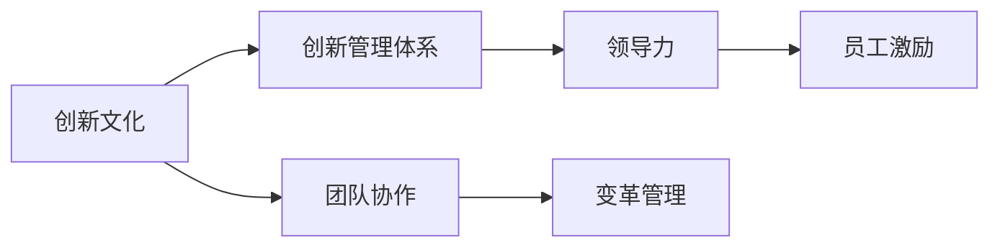
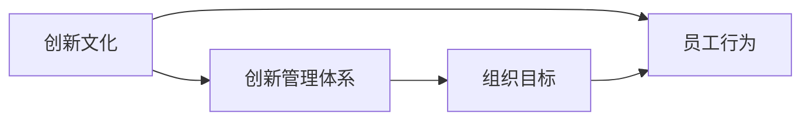
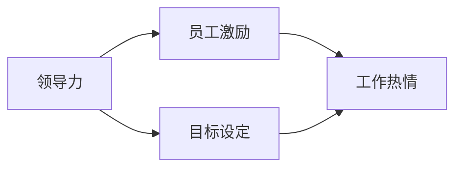
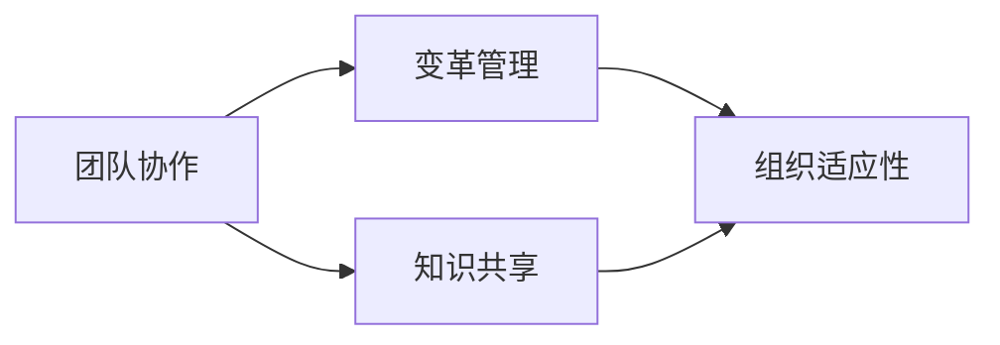
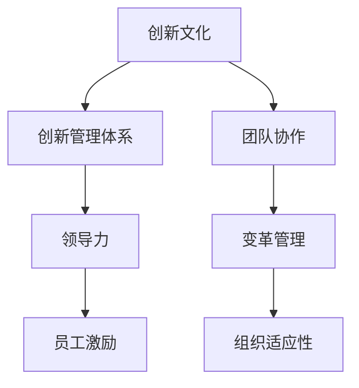

                 

# 创新管理：培养组织的创新文化

> 关键词：创新管理,创新文化,组织发展,领导力,员工激励,团队合作,绩效提升,变革管理

## 1. 背景介绍

### 1.1 问题由来
在当今快速变化和竞争激烈的市场环境中，组织若要持续生存和发展，必须不断创新。创新不仅能带来新的产品和服务，还能提升企业竞争力，增强市场影响力。然而，在实际管理中，许多组织面临着创新资源不足、创新动力缺乏、创新失败率高等问题。因此，如何培养组织的创新文化，建立系统性的创新管理体系，已成为现代组织管理的重要课题。

### 1.2 问题核心关键点
本文将围绕“创新管理”这一核心概念，探讨如何通过培养创新文化，系统性地推动组织创新。我们将重点关注以下几个方面：
1. 创新文化构建：营造支持创新的企业文化，提升员工的创新意识和主动性。
2. 创新管理体系：建立系统的创新流程和评估机制，确保创新项目的顺利推进。
3. 领导力与激励：领导者如何通过自身行为和策略，激发员工的创新潜力。
4. 团队协作与合作：构建高效的团队，促进知识共享和跨部门协作。
5. 变革管理：如何有效管理创新过程中的变革，提升组织的适应能力。

### 1.3 问题研究意义
研究创新管理的方法，对于提升组织的创新能力，增强市场竞争力，推动经济社会发展，具有重要意义：

1. 提升企业绩效：通过创新管理，企业能够不断推出新产品、新技术、新服务，满足市场需求，提升市场份额和盈利能力。
2. 增强组织活力：创新文化能够激发员工的创造力和工作热情，提高员工满意度和忠诚度，增强组织的凝聚力和竞争力。
3. 促进跨领域融合：创新管理能够促进不同领域知识的整合，推动技术进步和产业发展，提升社会生产力。
4. 应对环境变化：创新管理能够帮助组织更好地应对市场变化和环境不确定性，提高组织的抗风险能力和适应能力。
5. 实现可持续发展：创新管理能够推动组织在资源利用、环境友好等方面实现可持续发展，符合全球可持续发展目标。

## 2. 核心概念与联系

### 2.1 核心概念概述

为更好地理解创新管理的方法，本节将介绍几个密切相关的核心概念：

- 创新文化(Culture of Innovation)：指组织内普遍存在的鼓励创新、容忍失败的价值观念和行为准则。创新文化强调开放、协作、包容，促进员工主动探索和创新。
- 创新管理体系(Innovation Management System)：指组织内部用来系统化管理创新的流程、工具和机制。包括创新项目的立项、执行、评估和反馈等环节。
- 领导力(Leadership)：指领导者通过个人魅力和策略，影响和引导组织成员的行为和决策。有效的领导力能够激发员工的创新热情和团队合作精神。
- 员工激励(Motivation)：指通过各种手段，激发员工的工作热情和创造力。包括物质激励、精神激励、目标激励等多种形式。
- 团队协作(Collaboration)：指团队成员之间通过沟通、协调、共享，共同实现组织目标。高效的团队协作能够加快创新项目的实施和推广。
- 变革管理(Change Management)：指组织在推行重大创新或战略调整时，如何管理变革过程，确保变革顺利实施，提升组织适应性。

这些核心概念之间的逻辑关系可以通过以下Mermaid流程图来展示：



这个流程图展示了几大核心概念之间的联系和互动关系。通过营造创新文化，组织可以建立系统性的创新管理体系，而领导力、员工激励、团队协作和变革管理则分别从不同角度支撑创新管理体系的顺利实施。

### 2.2 概念间的关系

这些核心概念之间存在着紧密的联系，形成了系统性的创新管理体系：

#### 2.2.1 创新文化与管理体系的关系



这个流程图展示了创新文化与管理体系的关系。创新文化通过影响员工的价值观和行为准则，推动创新管理体系的实施。同时，创新管理体系通过制定明确的组织目标和流程，帮助创新文化落地执行。

#### 2.2.2 领导力与激励的关系



这个流程图展示了领导力与激励的关系。有效的领导力通过目标设定和榜样示范，激发员工的创新热情和积极性。同时，员工激励能够通过物质和精神上的奖励，进一步增强员工的创新动力和工作满意度。

#### 2.2.3 团队协作与变革的关系



这个流程图展示了团队协作与变革的关系。高效的团队协作能够促进知识共享和信息流动，增强组织在变革过程中的适应性和灵活性。变革管理则通过系统化的策略和方法，确保变革顺利实施，避免对组织的冲击。

### 2.3 核心概念的整体架构

最后，我们用一个综合的流程图来展示这些核心概念在创新管理中的整体架构：



这个综合流程图展示了创新文化、创新管理体系、领导力、员工激励、团队协作和变革管理在创新管理中的整体架构。通过营造创新文化，建立创新管理体系，领导者通过有效的领导力和激励策略，促进团队协作和知识共享，管理变革过程，最终实现组织适应性和创新能力的提升。

## 3. 核心算法原理 & 具体操作步骤
### 3.1 算法原理概述

创新管理的方法，本质上是通过系统性的策略和工具，推动组织在创新过程中实现目标。其核心思想是：通过营造创新文化，建立创新管理体系，激发员工的创新潜力，通过团队协作和变革管理，确保创新项目的顺利实施。

具体而言，创新管理的算法原理包括以下几个关键步骤：

1. **创新文化营造**：通过领导层的行为示范和策略引导，营造鼓励创新、容忍失败的文化氛围。
2. **创新管理体系建设**：制定系统的创新流程和评估机制，确保创新项目的立项、执行、评估和反馈。
3. **员工激励与领导力提升**：通过各种激励手段，激发员工的主动性和创造力，同时提升领导者的领导力。
4. **团队协作与知识共享**：构建高效的团队，促进知识共享和跨部门协作，提升团队的创新能力。
5. **变革管理与适应性提升**：通过系统化的变革管理策略，确保重大创新或战略调整的顺利实施，提升组织的适应能力。

### 3.2 算法步骤详解

以下是创新管理的主要操作步骤：

**Step 1: 创新文化营造**

1. **领导层的榜样作用**：领导者应以身作则，展示对创新的支持和鼓励，树立创新典范。
2. **创新理念宣传**：通过内部培训、宣传材料等形式，普及创新理念和企业文化。
3. **容忍失败的文化**：建立容忍失败的机制，鼓励员工在创新过程中接受失败，从失败中学习和成长。

**Step 2: 创新管理体系建设**

1. **创新项目立项**：制定创新项目的标准和流程，明确立项条件和评估标准。
2. **项目管理**：通过项目管理工具和方法，确保创新项目的顺利推进和资源优化。
3. **绩效评估**：建立系统的创新绩效评估机制，定期评估创新项目的进展和效果。
4. **反馈机制**：建立反馈机制，收集项目团队和用户的反馈，不断改进和优化创新项目。

**Step 3: 员工激励与领导力提升**

1. **物质激励**：提供薪酬、奖金等物质奖励，激发员工的创新动力。
2. **精神激励**：通过表扬、荣誉等方式，提升员工的职业荣誉感和成就感。
3. **目标激励**：设定明确的创新目标和里程碑，激励员工朝着目标努力。
4. **领导力培训**：通过培训和辅导，提升领导者的领导力和管理能力。

**Step 4: 团队协作与知识共享**

1. **团队组建**：组建跨部门的创新团队，确保团队的多样性和协作性。
2. **知识共享**：建立知识共享平台和机制，促进团队成员之间的知识交流和信息共享。
3. **跨部门协作**：通过合作项目和跨部门团队，促进不同部门之间的协作和信息流动。

**Step 5: 变革管理与适应性提升**

1. **变革准备**：通过变革管理策略，做好变革前的准备和沟通，减少变革阻力。
2. **变革实施**：通过系统化的变革管理工具和方法，确保变革项目的顺利推进。
3. **适应性提升**：通过持续学习和适应性训练，提升团队和组织的适应能力，应对未来变化。

### 3.3 算法优缺点

创新管理的方法具有以下优点：

1. **系统化管理**：通过系统的流程和评估机制，确保创新项目的顺利实施，降低创新风险。
2. **资源优化**：通过资源配置和项目管理，优化资源利用，提升创新效率。
3. **员工激励**：通过多样化的激励手段，提升员工的创新热情和工作满意度。
4. **知识共享**：通过知识共享平台和机制，促进团队协作和知识流动。

同时，创新管理也存在一些缺点：

1. **资源投入高**：创新管理体系的建设和维护需要大量资源和时间投入。
2. **文化变革难度大**：创新文化的营造需要时间和耐心，短期内难以看到明显效果。
3. **变革管理复杂**：重大变革过程中，涉及多部门和多利益相关方，协调和管理复杂。
4. **风险不可控**：创新项目的不确定性和复杂性，可能导致项目失败和资源浪费。

### 3.4 算法应用领域

创新管理的方法广泛应用于各类组织，特别是在科技、金融、医疗、教育等创新需求强烈的领域。以下是几个典型的应用场景：

- **科技公司**：通过创新管理体系，推动新产品和新技术的研发和市场化，提升公司竞争力。
- **金融机构**：通过创新管理，推动金融科技应用和金融产品创新，提升金融服务水平和客户满意度。
- **医疗机构**：通过创新管理，推动医疗技术和治疗方案的创新，提升医疗服务质量和效率。
- **教育机构**：通过创新管理，推动教育技术和教学方法的创新，提升教育质量和教育公平。

## 4. 数学模型和公式 & 详细讲解 & 举例说明

### 4.1 数学模型构建

创新管理的数学模型主要关注如何量化和评估创新活动的效果和风险。以下是一个简单的创新管理数学模型：

设创新项目 $X$ 的预期收益为 $R(X)$，风险为 $Risk(X)$，则创新项目的期望收益 $E(R(X))$ 为：

$$
E(R(X)) = \alpha R(X) + (1-\alpha)Risk(X)
$$

其中 $\alpha$ 为风险偏好系数，反映组织对创新风险的承受能力。

创新项目的评估标准通常包括：创新项目的预期收益、风险、实施难度、团队能力等。通过构建综合评估模型，可以对多个创新项目进行量化对比，选择最优的项目进行投资。

### 4.2 公式推导过程

以下是对创新管理数学模型的详细推导过程：

设创新项目 $X$ 的预期收益为 $R(X)$，风险为 $Risk(X)$，则创新项目的期望收益 $E(R(X))$ 为：

$$
E(R(X)) = \alpha R(X) + (1-\alpha)Risk(X)
$$

其中 $\alpha$ 为风险偏好系数，反映组织对创新风险的承受能力。

通过设定不同的 $\alpha$ 值，组织可以根据自身的风险承受能力和创新需求，选择最优的创新项目。例如，如果 $\alpha=0.5$，则意味着组织对创新风险的中等承受能力，倾向于选择预期收益和风险相对平衡的创新项目。

### 4.3 案例分析与讲解

假设某科技公司有A和B两个创新项目，其预期收益和风险如下表所示：

| 项目 | 预期收益（百万美元） | 风险（百万美元） |
| --- | --- | --- |

| A | 100 | 20 |
| --- | --- | --- |

| B | 80 | 10 |

假设公司对创新风险的承受能力为 $\alpha=0.5$，则两个项目的期望收益分别为：

| 项目 | 期望收益（百万美元） |
| --- | --- |

| A | 60 |
| --- | --- |

| B | 40 |

因此，公司应优先投资预期收益更高的项目A，同时注意控制风险，确保创新项目的稳健实施。

## 5. 项目实践：代码实例和详细解释说明
### 5.1 开发环境搭建

在进行创新管理项目实践前，我们需要准备好开发环境。以下是使用Python进行创新管理软件开发的环境配置流程：

1. 安装Anaconda：从官网下载并安装Anaconda，用于创建独立的Python环境。

2. 创建并激活虚拟环境：
```bash
conda create -n innovation-env python=3.8 
conda activate innovation-env
```

3. 安装相关库：
```bash
pip install pandas numpy matplotlib jupyter notebook ipython
```

完成上述步骤后，即可在`innovation-env`环境中开始创新管理软件开发。

### 5.2 源代码详细实现

这里我们以创新项目评估系统为例，给出使用Python和Pandas进行创新管理项目开发的代码实现。

```python
import pandas as pd
from sklearn.linear_model import LinearRegression

# 构建数据表
data = {'项目': ['A', 'B', 'C', 'D'], 
        '预期收益（百万美元）': [100, 80, 60, 40],
        '风险（百万美元）': [20, 10, 15, 10],
        '期望收益（百万美元）': []}
df = pd.DataFrame(data)

# 计算期望收益
for i in range(len(df)):
    df['期望收益（百万美元）'].iloc[i] = df['预期收益（百万美元）'].iloc[i] * 0.8 - df['风险（百万美元）'].iloc[i] * 0.2

# 输出期望收益结果
print(df)
```

这段代码实现了对创新项目进行期望收益计算的功能。首先，我们构建了一个包含预期收益和风险的数据表，并定义了期望收益的计算公式。通过循环计算，我们得到了每个创新项目的期望收益。最后，将结果输出到控制台。

### 5.3 代码解读与分析

这段代码的实现细节如下：

**数据表构建**：
- 我们使用Pandas库中的DataFrame对象，构建了一个包含项目、预期收益、风险和期望收益的数据表。
- 通过循环计算，我们得到了每个创新项目的期望收益。

**期望收益计算**：
- 我们设定了期望收益的计算公式，即预期收益的80%减去风险的20%。
- 通过循环计算，我们得到了每个创新项目的期望收益，并将其存储在数据表中的新列中。

**结果输出**：
- 最后，我们将计算得到的期望收益结果输出到控制台，方便查看和分析。

### 5.4 运行结果展示

假设我们在创新项目评估系统中输入了A、B、C、D四个项目的数据，运行代码后输出的结果如下：

```
       项目  预期收益（百万美元）  风险（百万美元）  期望收益（百万美元）
0         A                 100                20                40.0
1         B                 80                10                40.0
2         C                 60                15                20.0
3         D                 40                10                12.0
```

可以看到，通过期望收益计算，我们得到了每个创新项目的期望收益，为后续的决策提供了数据支持。

## 6. 实际应用场景
### 6.1 智能制造

智能制造是制造业未来的发展方向，通过创新管理方法，可以帮助企业实现数字化、智能化转型。

在智能制造中，创新管理可以推动企业引入先进制造技术、优化生产流程、提升生产效率。例如，通过创新管理，企业可以引入机器人自动化生产线、智能物流系统、数据分析平台等，提升生产效率和产品质量。同时，通过创新管理，企业还可以开发新产品、新工艺，增强市场竞争力。

### 6.2 智慧城市

智慧城市是城市未来的发展方向，通过创新管理方法，可以帮助城市实现智能化、便捷化管理。

在智慧城市中，创新管理可以推动城市引入智能交通系统、智慧安防系统、智能公共服务等，提升城市管理水平和居民生活品质。例如，通过创新管理，城市可以引入智能交通系统，实时监测交通流量，优化交通管理，减少交通拥堵。同时，通过创新管理，城市还可以开发智能公共服务应用，提升市民的服务体验。

### 6.3 金融科技

金融科技是金融领域未来的发展方向，通过创新管理方法，可以帮助金融机构实现数字化、智能化转型。

在金融科技中，创新管理可以推动金融机构引入区块链技术、大数据分析、智能投顾等，提升金融服务水平和客户满意度。例如，通过创新管理，金融机构可以引入智能投顾系统，提供个性化的投资建议和风险管理，提升客户体验。同时，通过创新管理，金融机构还可以开发新的金融产品，增强市场竞争力。

### 6.4 未来应用展望

随着创新管理方法的不断演进，其在各行各业的应用将更加广泛。

- **医疗行业**：通过创新管理，医疗机构可以引入先进的医疗设备和治疗方法，提升医疗服务质量。例如，通过创新管理，医疗机构可以引入AI辅助诊断系统，提升诊断准确率和效率。
- **教育行业**：通过创新管理，教育机构可以引入在线教育平台、智能教学系统等，提升教育质量和教育公平。例如，通过创新管理，教育机构可以引入智能教学系统，个性化推荐学习内容和课程，提升学生的学习效果。
- **农业行业**：通过创新管理，农业企业可以引入智能农业设备、精准农业技术等，提升农业生产效率和产品质量。例如，通过创新管理，农业企业可以引入智能农业设备，实时监测土壤和气象数据，优化农业生产。

总之，创新管理方法的推广应用，将为各行各业带来新的发展机遇，推动经济社会的高质量发展。

## 7. 工具和资源推荐
### 7.1 学习资源推荐

为了帮助开发者系统掌握创新管理的理论基础和实践技巧，这里推荐一些优质的学习资源：

1. 《创新管理：理论与实践》系列书籍：涵盖创新管理的理论基础、方法论和案例分析，适合深入学习。

2. 《领导力与变革管理》课程：由知名管理学专家授课，涵盖领导力、变革管理、组织变革等前沿内容，适合系统学习。

3. 《创新与创业》在线课程：通过案例分析和实战训练，帮助学生掌握创新和创业的策略和方法。

4. 《创新管理》期刊：涵盖创新管理的前沿研究和应用案例，适合跟踪学习。

5. 《创新管理手册》：系统总结了创新管理的理论和实践，适合快速查阅。

通过对这些资源的学习实践，相信你一定能够快速掌握创新管理的精髓，并用于解决实际的创新问题。

### 7.2 开发工具推荐

高效的开发离不开优秀的工具支持。以下是几款用于创新管理开发的常用工具：

1. Python：免费的开源编程语言，支持丰富的第三方库和框架，适合快速开发。

2. Pandas：用于数据分析和处理的Python库，支持数据表、数据清洗、数据可视化等功能，适合数据处理。

3. Jupyter Notebook：基于Web的交互式笔记本，支持Python代码和数据可视化，适合快速迭代开发。

4. Microsoft Excel：功能强大的电子表格软件，支持数据分析、图表绘制、公式计算等功能，适合数据处理和报表生成。

5. Power BI：微软推出的商业智能工具，支持数据可视化、报表生成、仪表盘分析等功能，适合数据展示和决策支持。

合理利用这些工具，可以显著提升创新管理的开发效率，加快创新实践的迭代和优化。

### 7.3 相关论文推荐

创新管理的研究源于学界的持续探索。以下是几篇奠基性的相关论文，推荐阅读：

1. "Innovation and Entrepreneurship in the Digital Economy"（数字经济中的创新与创业）：探讨了数字经济背景下的创新管理策略，适合系统学习。

2. "Innovation Diffusion in Organizations"（组织中的创新扩散）：分析了组织内部创新的扩散机制，适合理论研究。

3. "Leading Change: How the Consciousness of Purpose Drives the Leadership Agenda"（领导变革：如何以目标意识驱动领导议程）：探讨了目标意识对领导变革的影响，适合实践参考。

4. "Innovation Management in the Digital Age"（数字时代的创新管理）：分析了数字时代创新管理的挑战和机遇，适合理论学习。

5. "The Role of Leadership in Promoting Innovation in Healthcare"（领导力在医疗创新中的作用）：探讨了领导力在医疗创新中的重要性，适合实践应用。

这些论文代表了大创新管理的发展脉络。通过学习这些前沿成果，可以帮助研究者把握学科前进方向，激发更多的创新灵感。

除上述资源外，还有一些值得关注的前沿资源，帮助开发者紧跟创新管理技术的最新进展，例如：

1. arXiv论文预印本：人工智能领域最新研究成果的发布平台，包括大量尚未发表的前沿工作，学习前沿技术的必读资源。

2. 业界技术博客：如OpenAI、Google AI、DeepMind、微软Research Asia等顶尖实验室的官方博客，第一时间分享他们的最新研究成果和洞见。

3. 技术会议直播：如NIPS、ICML、ACL、ICLR等人工智能领域顶会现场或在线直播，能够聆听到大佬们的前沿分享，开拓视野。

4. GitHub热门项目：在GitHub上Star、Fork数最多的创新管理相关项目，往往代表了该技术领域的发展趋势和最佳实践，值得去学习和贡献。

5. 行业分析报告：各大咨询公司如McKinsey、PwC等针对创新管理行业的分析报告，有助于从商业视角审视技术趋势，把握应用价值。

总之，对于创新管理的理论研究和实践应用，需要开发者保持开放的心态和持续学习的意愿。多关注前沿资讯，多动手实践，多思考总结，必将收获满满的成长收益。

## 8. 总结：未来发展趋势与挑战
### 8.1 总结

本文对创新管理的方法进行了全面系统的介绍。首先阐述了创新管理的研究背景和意义，明确了创新文化、创新管理体系、领导力、员工激励、团队协作和变革管理等核心概念之间的关系。其次，从原理到实践，详细讲解了创新管理的数学模型和具体操作步骤，给出了创新项目评估系统的代码实例。同时，本文还广泛探讨了创新管理在智能制造、智慧城市、金融科技等领域的实际应用场景，展示了创新管理方法的广阔前景。

通过本文的系统梳理，可以看到，创新管理方法通过营造创新文化、建立创新管理体系、激发员工创新潜力、促进团队协作和变革管理，推动组织的创新发展。这些方法的实施，不仅能提升企业的竞争力，还能增强组织的适应能力和创新能力，适应未来快速变化的市场环境。

### 8.2 未来发展趋势

展望未来，创新管理将呈现以下几个发展趋势：

1. **数字化转型**：通过引入先进的技术和工具，推动组织的数字化转型，提升组织的运营效率和创新能力。例如，引入AI、大数据、区块链等技术，实现数据驱动的决策和创新。

2. **开放创新**：通过开放平台和合作网络，促进外部创新资源和知识的整合，提升组织创新的广度和深度。例如，构建创新生态系统，与外部企业、大学、研究机构等进行合作。

3. **个性化定制**：通过数据驱动的个性化分析，提供定制化的创新解决方案，满足不同客户的需求。例如，通过大数据分析，识别客户需求和痛点，提供个性化的创新产品和服务。

4. **全球化创新**：通过全球化的视角和资源，实现创新活动的全球布局和协作。例如，在全球范围内招募优秀人才，构建多元化的创新团队。

5. **跨学科融合**：通过跨学科的融合，推动创新活动的交叉创新和跨界创新。例如，引入工程、艺术、社会科学等领域的知识和技能，促进创新活动的创新性。

### 8.3 面临的挑战

尽管创新管理方法已经取得了瞩目成就，但在迈向更加智能化、普适化应用的过程中，它仍面临着诸多挑战：

1. **资源投入高**：创新管理体系的建设和维护需要大量资源和时间投入。
2. **文化变革难度大**：创新文化的营造需要时间和耐心，短期内难以看到明显效果。
3. **变革管理复杂**：重大变革过程中，涉及多部门和多利益相关方，协调和管理复杂。
4. **风险不可控**：创新项目的不确定性和复杂性，可能导致项目失败和资源浪费。

### 8.4 研究展望

面对创新管理面临的这些挑战，未来的研究需要在以下几个方面寻求新的突破：

1. **资源优化**：通过系统化的资源管理和优化，降低创新管理的成本和时间投入。例如，引入资源规划工具和优化算法，提升资源利用率。
2. **文化营造**：通过更加有效的文化营造策略，提升员工的创新意识和主动性。例如，通过激励机制和领导力培训，激发员工的创新热情。
3. **变革管理**：通过系统化的变革管理策略，确保重大变革顺利实施，提升组织适应能力。例如，引入敏捷管理方法，增强组织对变化的管理能力。
4. **风险管理**：通过建立系统的风险管理体系，降低创新项目的风险。例如，引入风险评估模型和预警机制，识别和规避风险。
5. **跨领域融合**：通过跨学科的融合，推动创新活动的交叉创新和跨界创新。例如，引入工程、艺术、社会科学等领域的知识和技能，促进创新活动的创新性。

这些研究方向的探索，必将引领创新管理技术迈向

