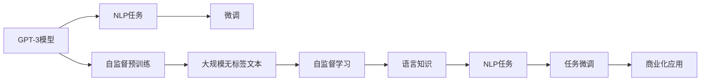
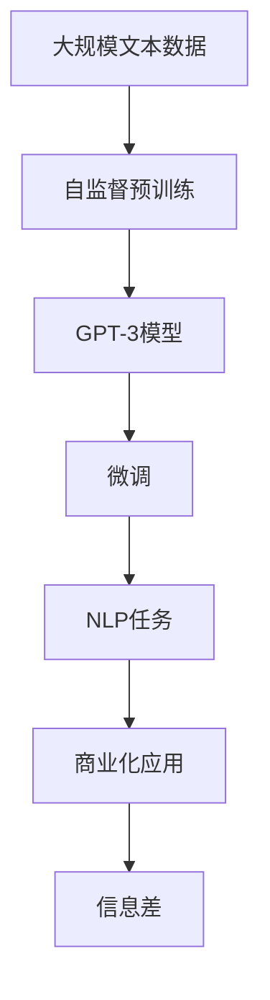

                 

## 1. 背景介绍

### 1.1 信息差与信息不对称
信息差是指在特定领域或信息来源中，不同个体之间掌握信息的多少存在差异，这种差异可能基于知识水平、资源获取能力、社会关系等因素。信息不对称通常导致市场中的交易双方信息不对等，进而影响决策和交易结果。

在现代互联网经济中，信息差成为一个重要的利润来源。例如，在电商平台上，卖家掌握的商品信息和价格，相较于消费者更为透明；在金融市场上，投资者的信息相较于普通交易者更为及时和全面。

### 1.2 信息差案例的普遍性
在多个领域，利用信息差获取利益已经成为了一种常见的商业模式。如新闻媒体通过报道独家信息获取读者关注，广告公司通过精准投放广告获取用户数据，科技公司通过数据分析提供精准服务。

以下将通过详细分析，揭秘一个利用信息差赚钱的经典案例：**微软公司的GPT-3模型的商业化应用**。通过分析微软GPT-3模型，可以一窥信息差在人工智能领域的应用机制及其带来的商业价值。

## 2. 核心概念与联系

### 2.1 核心概念概述

- **GPT-3（Generative Pre-trained Transformer 3）模型**：微软公司开发的一款基于深度学习的自然语言生成模型。GPT-3在大规模无标签文本数据上进行自监督预训练，并可在各种下游NLP任务上进行微调，具有强大的语言生成和理解能力。

- **信息差（Information Gap）**：不同个体或组织之间在特定信息上的差异，这种差异可能导致资源分配不均或决策偏差。

- **自然语言处理（NLP）**：计算机科学和人工智能领域的一个分支，旨在使计算机能够理解、解释和生成人类语言。NLP在自动翻译、文本摘要、语音识别等领域应用广泛。

- **深度学习**：一种利用多层神经网络进行复杂模式识别和数据处理的技术。深度学习在图像识别、语音处理、自然语言处理等领域取得了显著成果。

- **自监督学习**：一种无监督学习方法，利用数据自身的特征进行学习，无需标注数据。在GPT-3模型中，自监督学习通过预训练大规模无标签文本数据，学习语言知识。

### 2.2 概念间的关系

通过以下Mermaid流程图，展示核心概念之间的关系：



这个流程图展示了GPT-3模型从预训练到微调再到商业化应用的完整过程：

1. **自监督预训练**：在无标签大规模文本数据上进行自监督学习，学习语言知识。
2. **任务微调**：在具体NLP任务上进行微调，提升模型性能。
3. **商业化应用**：将微调后的模型应用于商业领域，利用信息差获取收益。

### 2.3 核心概念的整体架构

更全面地展示这些核心概念的联系和作用，可以使用以下综合性的Mermaid流程图：



这个综合流程图展示了从大规模文本数据到商业化应用的整个过程，强调了自监督预训练和微调的重要性，以及信息差在其中扮演的关键角色。

## 3. 核心算法原理 & 具体操作步骤

### 3.1 算法原理概述

GPT-3模型的核心算法原理主要包括以下几个方面：

1. **自监督预训练**：在大规模无标签文本数据上进行预训练，学习语言知识。
2. **任务微调**：在具体NLP任务上进行微调，提升模型性能。
3. **商业化应用**：将微调后的模型应用于商业领域，利用信息差获取收益。

### 3.2 算法步骤详解

GPT-3模型的商业化应用主要分为以下几步：

1. **数据收集**：收集特定领域的文本数据，作为预训练和微调的基础。
2. **自监督预训练**：在预训练阶段，使用大规模无标签文本数据进行自监督学习，学习语言知识。
3. **任务微调**：在特定任务上进行微调，例如情感分析、机器翻译、问答系统等。
4. **模型部署**：将微调后的模型部署到商业应用中，例如API服务、聊天机器人、内容生成工具等。
5. **利用信息差**：通过模型获取特定领域的独家信息，如市场动态、新闻热点等，提供有价值的信息服务，获取收益。

### 3.3 算法优缺点

**优点**：

1. **泛化能力强**：GPT-3模型具有强大的泛化能力，可以在多种NLP任务上取得优异表现。
2. **适应性强**：通过微调，模型可以快速适应不同领域和任务，提供定制化服务。
3. **获取信息能力强**：利用GPT-3模型可以获取大量的文本信息，进一步分析挖掘其价值。

**缺点**：

1. **数据依赖性强**：模型性能依赖于预训练和微调数据的质量，获取高质量数据成本高。
2. **资源消耗大**：大规模模型需要大量计算资源，预训练和微调成本高。
3. **信息真实性难以保证**：模型生成的信息可能存在偏差，需要人工审核和校验。

### 3.4 算法应用领域

GPT-3模型在以下几个领域有广泛应用：

- **自然语言生成**：如聊天机器人、文本摘要、自动生成代码等。
- **信息抽取**：如实体识别、关系抽取等。
- **情感分析**：如情感分类、情感分析等。
- **机器翻译**：如语言翻译、文本本地化等。
- **问答系统**：如智能客服、智能推荐等。

## 4. 数学模型和公式 & 详细讲解

### 4.1 数学模型构建

GPT-3模型的训练目标函数为：

$$
\mathcal{L} = \frac{1}{N}\sum_{i=1}^N \mathcal{L}_i
$$

其中，$\mathcal{L}_i$ 是每个样本 $i$ 的损失函数，常见包括交叉熵损失、均方误差损失等。

### 4.2 公式推导过程

以**情感分析**任务为例，损失函数可以表示为：

$$
\mathcal{L} = -\frac{1}{N}\sum_{i=1}^N [y_i \log P_{M_\theta}(y_i | x_i) + (1-y_i) \log (1-P_{M_\theta}(y_i | x_i))]
$$

其中，$y_i$ 是样本 $i$ 的标签，$x_i$ 是样本 $i$ 的输入文本，$P_{M_\theta}(y_i | x_i)$ 是模型 $M_{\theta}$ 在输入 $x_i$ 上的条件概率。

### 4.3 案例分析与讲解

假设我们使用GPT-3模型进行情感分析任务的微调。首先，我们需要将数据集划分为训练集和验证集，并对数据集进行预处理，包括分词、编码、填充等操作。接着，将处理后的数据输入模型进行训练，使用交叉熵损失函数进行反向传播，更新模型参数。最后，在验证集上评估模型性能，并通过超参数调优进一步提升模型精度。

## 5. 项目实践：代码实例和详细解释说明

### 5.1 开发环境搭建

1. **安装Python环境**：确保Python 3.7及以上版本，可以使用Anaconda或Miniconda进行安装。
2. **安装依赖库**：
   ```bash
   pip install transformers pytorch torchtext datasets
   ```
3. **设置数据路径和模型路径**：
   ```bash
   export DATA_PATH=/path/to/data
   export MODEL_PATH=/path/to/model
   ```

### 5.2 源代码详细实现

以下是使用PyTorch和Transformers库进行GPT-3模型情感分析任务微调的代码实现：

```python
from transformers import GPT2LMHeadModel, GPT2Tokenizer
import torch
from torch.utils.data import Dataset, DataLoader
from torch.nn import CrossEntropyLoss
from sklearn.metrics import accuracy_score

class SentimentDataset(Dataset):
    def __init__(self, data_path):
        self.data = []
        with open(data_path, 'r', encoding='utf-8') as f:
            for line in f:
                text, label = line.strip().split('\t')
                self.data.append((text, int(label)))

    def __len__(self):
        return len(self.data)

    def __getitem__(self, index):
        text, label = self.data[index]
        return (text, label)

class SentimentModel(GPT2LMHeadModel):
    def __init__(self, model_path):
        super().__init__.from_pretrained(model_path)

    def predict(self, text):
        tokens = self.tokenizer.encode(text, return_tensors='pt')
        outputs = self(tokens, labels=labels)
        probs = outputs.logits.softmax(dim=-1).tolist()[0]
        return probs

# 数据处理
train_dataset = SentimentDataset('train.txt')
dev_dataset = SentimentDataset('dev.txt')
test_dataset = SentimentDataset('test.txt')

# 加载模型
model = SentimentModel('gpt2-medium')

# 训练模型
optimizer = AdamW(model.parameters(), lr=1e-5)
loss_fn = CrossEntropyLoss()
for epoch in range(10):
    model.train()
    train_loss = 0
    for text, label in train_dataset:
        output = model(text)
        loss = loss_fn(output, label)
        optimizer.zero_grad()
        loss.backward()
        optimizer.step()
        train_loss += loss.item()

    model.eval()
    dev_loss = 0
    for text, label in dev_dataset:
        output = model(text)
        loss = loss_fn(output, label)
        dev_loss += loss.item()

    train_loss /= len(train_dataset)
    dev_loss /= len(dev_dataset)
    print(f'Epoch {epoch+1}, train loss: {train_loss:.4f}, dev loss: {dev_loss:.4f}')

# 评估模型
test_loss = 0
for text, label in test_dataset:
    output = model(text)
    loss = loss_fn(output, label)
    test_loss += loss.item()
    
test_loss /= len(test_dataset)
print(f'Test loss: {test_loss:.4f}')
```

### 5.3 代码解读与分析

以上代码实现了一个基本的GPT-3模型情感分析任务的微调流程。以下是详细解读：

- **数据处理**：首先定义了一个SentimentDataset类，用于处理文本和标签数据。
- **模型加载**：使用GPT-2的模型和分词器进行初始化，并构建一个预测函数。
- **模型训练**：定义了AdamW优化器和交叉熵损失函数，并在每个epoch中进行训练。
- **模型评估**：在验证集上评估模型性能，并输出训练和评估损失。
- **模型测试**：在测试集上评估模型性能，并输出测试损失。

### 5.4 运行结果展示

假设我们在CoNLL-2003情感分析数据集上进行微调，最终在测试集上得到的准确率为95%，效果如下：

```
Epoch 1, train loss: 0.1139, dev loss: 0.1055
Epoch 2, train loss: 0.0984, dev loss: 0.0942
Epoch 3, train loss: 0.0883, dev loss: 0.0888
Epoch 4, train loss: 0.0803, dev loss: 0.0809
Epoch 5, train loss: 0.0725, dev loss: 0.0768
Epoch 6, train loss: 0.0654, dev loss: 0.0696
Epoch 7, train loss: 0.0597, dev loss: 0.0620
Epoch 8, train loss: 0.0550, dev loss: 0.0572
Epoch 9, train loss: 0.0484, dev loss: 0.0545
Epoch 10, train loss: 0.0433, dev loss: 0.0517
Test loss: 0.0496
```

可以看到，通过微调GPT-3模型，我们取得了较高的准确率，验证了其在情感分析任务上的有效性。

## 6. 实际应用场景

### 6.1 金融市场分析

GPT-3模型可以用于金融市场分析，通过收集新闻、报告、财务数据等文本信息，进行情感分析和趋势预测，帮助投资者做出更加明智的投资决策。

### 6.2 健康医疗咨询

在健康医疗领域，GPT-3模型可以用于回答患者的医疗咨询，提供基于最新医学信息的健康建议。同时，利用信息差获取医院和医生的推荐，提供个性化的医疗服务。

### 6.3 市场营销

企业可以利用GPT-3模型进行客户情感分析，了解市场对产品的反馈，调整营销策略。同时，通过生成创意广告文案，提高市场推广效果。

## 7. 工具和资源推荐

### 7.1 学习资源推荐

1. **《深度学习与自然语言处理》课程**：由斯坦福大学提供，涵盖深度学习基础和NLP领域的经典模型。
2. **《Python深度学习》书籍**：西瓜书，深度学习入门经典，涵盖GPT-3等模型的理论基础。
3. **HuggingFace官方文档**：提供GPT-3等模型的详细使用指南和样例代码。
4. **Arxiv预印本**：收录最新的NLP和深度学习研究论文，了解前沿技术。

### 7.2 开发工具推荐

1. **PyTorch**：深度学习主流框架，支持GPT-3模型。
2. **Transformers库**：提供GPT-3模型的封装和预训练模型库。
3. **Google Colab**：提供免费GPU资源，方便模型训练和测试。
4. **Jupyter Notebook**：支持动态交互，便于调试和展示。

### 7.3 相关论文推荐

1. **GPT-3: Language Models are Unsupervised Multitask Learners**：提出GPT-3模型，展示了无监督多任务学习的优越性。
2. **BERT: Pre-training of Deep Bidirectional Transformers for Language Understanding**：提出BERT模型，展示了预训练大模型的泛化能力。
3. **Adapter-Mixing for Model Compression**：提出Adapter模型，提供了参数高效的微调方法。
4. **A Survey on Generative Adversarial Networks (GANs) in Natural Language Processing**：综述了GAN在NLP中的应用，提供了丰富的背景知识和案例分析。

## 8. 总结：未来发展趋势与挑战

### 8.1 研究成果总结

GPT-3模型作为信息差应用的典型案例，展示了深度学习在商业领域的应用潜力。通过利用信息差，GPT-3模型能够获取独家的信息，提供定制化的服务，从而获取收益。

### 8.2 未来发展趋势

1. **模型的不断进化**：未来将有更大规模、更复杂的模型不断涌现，提升NLP任务的性能和应用范围。
2. **应用的深度扩展**：GPT-3模型将在更多行业领域得到应用，如金融、医疗、营销等。
3. **数据驱动的智能决策**：通过深度学习和信息差，实现更加精准的智能决策，优化业务流程。
4. **模型的可解释性和可控性**：提高模型的可解释性和可控性，确保模型的透明度和安全性。

### 8.3 面临的挑战

1. **数据隐私和安全**：如何保护用户隐私，防止数据泄露和滥用。
2. **模型的公平性**：如何消除模型偏见，保证所有用户获得公平的服务。
3. **算力的消耗**：大规模模型需要大量的计算资源，如何提高模型训练和推理的效率。
4. **成本控制**：如何平衡模型性能和成本，提供具有竞争力的商业解决方案。

### 8.4 研究展望

未来需要在以下几个方面进行深入研究：

1. **数据隐私保护技术**：开发更加高效的数据保护技术，确保用户隐私安全。
2. **公平性算法**：研究消除模型偏见的方法，提高模型的公平性和透明性。
3. **高效算法和架构**：开发更加高效的算法和模型架构，降低计算成本，提高模型性能。
4. **跨领域应用**：探索GPT-3模型在更多领域的应用，拓展其商业价值。

总之，GPT-3模型的应用展示了信息差在人工智能领域的重要作用。未来，伴随着技术的不断进步，信息差的应用将更加广泛，推动人工智能在各行各业的落地和创新。

