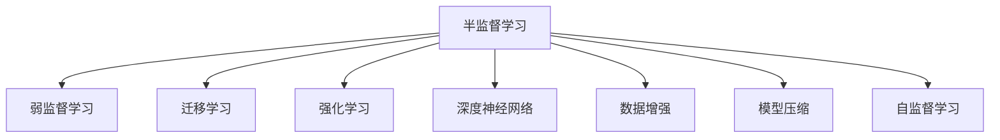
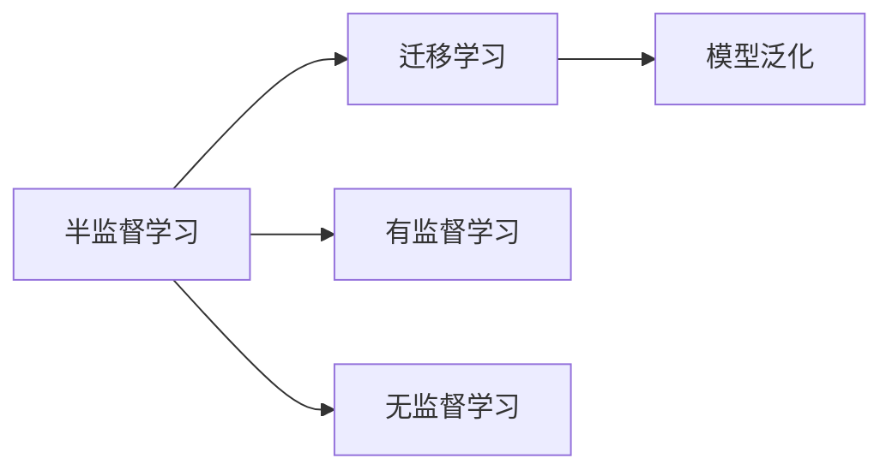
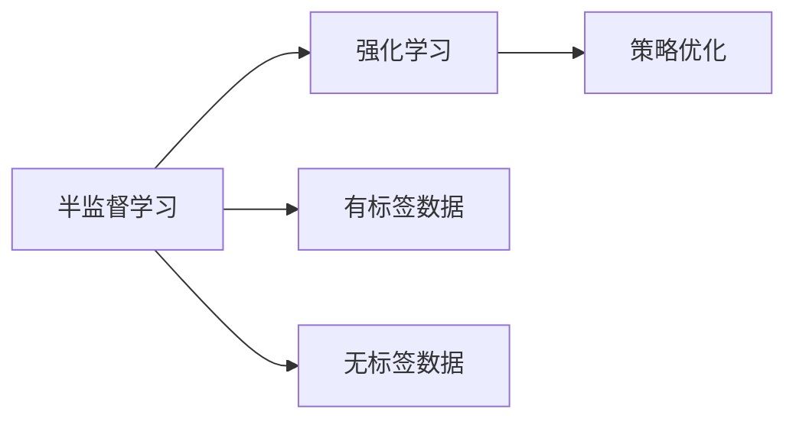
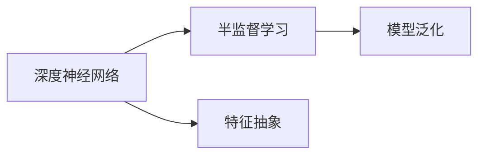
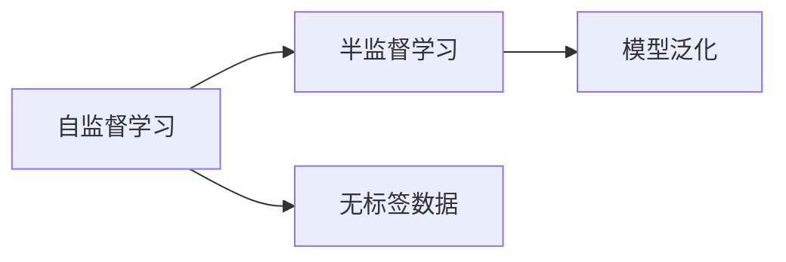
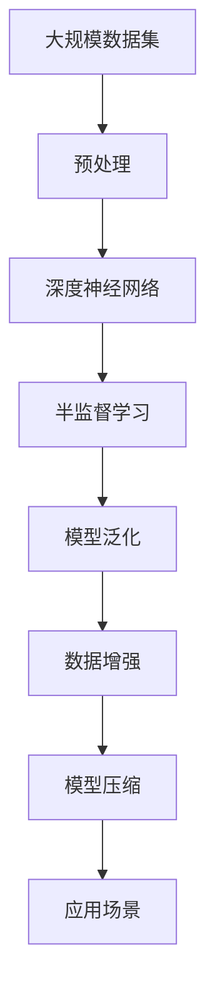

                 

# 半监督学习 原理与代码实例讲解

> 关键词：半监督学习, 弱监督学习, 迁移学习, 强化学习, 深度神经网络, 数据增强, 模型压缩, 自监督学习

## 1. 背景介绍

### 1.1 问题由来
随着深度学习技术的飞速发展，数据驱动的大规模模型训练已成为推动人工智能技术进步的重要引擎。然而，在现实世界中，大量数据往往带有标签，标注数据成本高、周期长，限制了机器学习算法在大规模数据上的应用。而半监督学习（Semi-supervised Learning, SSL）正是在这样的背景下应运而生的重要研究领域，通过有效利用无标签数据，弥补标签数据的匮乏，极大地降低了大规模模型训练的门槛。

半监督学习在多个领域中得到了广泛应用，包括计算机视觉、自然语言处理、推荐系统、生物信息学等。例如，在自然语言处理领域，半监督学习方法可用于文本分类、命名实体识别、情感分析等任务，通过利用大规模无标签文本数据提升模型效果。此外，半监督学习还被应用于目标检测、语音识别、推荐系统等任务，取得了显著的性能提升。

### 1.2 问题核心关键点
半监督学习的核心思想是：在少量有标签数据的基础上，充分利用大规模无标签数据，提高模型的泛化能力和性能。具体而言，半监督学习包括以下关键步骤：
1. 数据准备：将有标签数据和无标签数据混合，构建半监督数据集。
2. 模型训练：在有标签数据上监督学习，无标签数据上自监督学习，最大化模型性能。
3. 模型评估：在有标签数据上评估模型性能，验证泛化能力。
4. 迭代优化：通过不断迭代训练，提升模型效果。

半监督学习与监督学习和无监督学习有所不同。监督学习仅利用有标签数据训练模型，无标签数据不参与训练，容易导致过拟合。无监督学习则完全不使用有标签数据，学习效率较低。而半监督学习通过有监督和无监督相结合的方式，既利用了有标签数据的指导，又充分利用了无标签数据的信息，显著降低了标注成本，提升了模型性能。

### 1.3 问题研究意义
半监督学习的研究具有重要意义：
1. 提高模型泛化能力：通过利用大规模无标签数据，半监督学习可以有效提升模型的泛化能力和鲁棒性。
2. 降低标注成本：半监督学习能够大幅降低数据标注的成本和时间，提高数据驱动型机器学习的可接受性。
3. 适应大规模数据：半监督学习适用于大规模数据集，能够充分利用数据资源，提升模型性能。
4. 推动技术发展：半监督学习为机器学习算法的研究提供了新的方向，推动了深度学习、强化学习等技术的发展。
5. 赋能产业应用：半监督学习能够应用于多个产业领域，如医疗、金融、智能制造等，提升产业智能化水平。

## 2. 核心概念与联系

### 2.1 核心概念概述

为了更好地理解半监督学习，我们先介绍几个关键概念：

- **半监督学习**（Semi-supervised Learning）：结合少量有标签数据和大量无标签数据进行训练的机器学习方法，旨在充分利用无标签数据信息，提升模型性能。
- **弱监督学习**（Weakly-supervised Learning）：弱监督学习与半监督学习类似，但也包含无监督学习，但其对有标签数据的依赖程度更低，如多实例学习（Multi-instance Learning）和标签传播（Label Propagation）等。
- **迁移学习**（Transfer Learning）：迁移学习通过在不同任务间迁移知识，实现模型性能的提升。半监督学习可以看作是一种特殊的迁移学习，通过利用无标签数据进行迁移学习，提升模型泛化能力。
- **强化学习**（Reinforcement Learning）：强化学习通过与环境交互，不断调整模型参数，最大化长期奖励。半监督学习与强化学习的目标类似，都是通过不断优化模型参数，提升模型性能。
- **深度神经网络**（Deep Neural Network, DNN）：深度神经网络是半监督学习的重要基础，通过多层次的特征抽象，可以有效利用无标签数据的信息。
- **数据增强**（Data Augmentation）：数据增强通过人工构造或修改原始数据，丰富数据集的多样性，提升模型泛化能力。
- **模型压缩**（Model Compression）：模型压缩通过减少模型参数数量或改进模型结构，降低计算复杂度，提升模型训练和推理效率。
- **自监督学习**（Self-supervised Learning）：自监督学习通过设计自监督任务，从无标签数据中学习特征表示，提升模型性能。半监督学习与自监督学习有相似之处，但半监督学习还利用了有标签数据的信息。

这些核心概念之间存在紧密的联系，构成了半监督学习的整体框架：



通过这些概念，我们能够更好地理解半监督学习的原理和应用。

### 2.2 概念间的关系

半监督学习的各个概念之间存在密切联系，我们可以通过以下几个Mermaid流程图展示它们之间的关系：

#### 2.2.1 半监督学习与迁移学习的关系



这个流程图展示了半监督学习与迁移学习的关系。半监督学习通过利用有标签数据和无标签数据，实现了模型的迁移学习，提升了模型泛化能力。

#### 2.2.2 半监督学习与强化学习的关系



这个流程图展示了半监督学习与强化学习的关系。半监督学习通过优化模型参数，提升了模型的长期性能，类似于强化学习的策略优化过程。

#### 2.2.3 深度神经网络与半监督学习的关系



这个流程图展示了深度神经网络与半监督学习的关系。深度神经网络通过多层次的特征抽象，为半监督学习提供了丰富的特征表示，提升了模型泛化能力。

#### 2.2.4 自监督学习与半监督学习的关系



这个流程图展示了自监督学习与半监督学习的关系。自监督学习通过设计自监督任务，从无标签数据中学习特征表示，为半监督学习提供了有效的特征表示。

### 2.3 核心概念的整体架构

最后，我们用一个综合的流程图来展示这些核心概念在大规模半监督学习中的整体架构：



这个综合流程图展示了从数据预处理到模型压缩，再到应用场景的完整过程。深度神经网络作为核心模型，通过半监督学习提升了模型泛化能力。在此基础上，通过数据增强和模型压缩等技术，进一步提升了模型性能和计算效率，最终应用于各种实际应用场景中。

## 3. 核心算法原理 & 具体操作步骤
### 3.1 算法原理概述

半监督学习的基本原理是通过最大化有标签数据和无标签数据的联合概率，提升模型的泛化能力。具体而言，假设 $D_{\text{train}}$ 为训练集，其中包含 $N_{\text{label}}$ 个有标签数据和 $N_{\text{unlabel}}$ 个无标签数据。半监督学习的目标是最小化损失函数 $L$：

$$
L(\theta) = \frac{1}{N_{\text{label}}}\sum_{i=1}^{N_{\text{label}}} l(y_i, f(x_i; \theta)) + \frac{1}{N_{\text{unlabel}}}\sum_{i=1}^{N_{\text{unlabel}}} l(y_i, f(x_i; \theta))
$$

其中 $f(x_i; \theta)$ 为模型在输入 $x_i$ 上的预测输出，$l$ 为损失函数，如交叉熵损失、均方误差损失等。

半监督学习的核心在于如何充分利用无标签数据。常见的策略包括：

1. 直接训练：在全数据集上进行监督学习，无标签数据仅作为数据扩充，提升模型性能。
2. 自监督学习：设计自监督任务，从无标签数据中学习特征表示，提升模型泛化能力。
3. 半监督聚类：利用无标签数据进行聚类，生成有标签伪标签，提升模型性能。
4. 图半监督学习：通过构建图结构，利用无标签数据中的潜在关联关系，提升模型性能。

### 3.2 算法步骤详解

半监督学习的训练过程一般包括以下几个关键步骤：

**Step 1: 数据准备**
- 收集有标签数据和无标签数据，将它们混合，构建半监督数据集。
- 对数据进行预处理，如归一化、标准化、数据增强等。

**Step 2: 模型设计**
- 选择适当的深度神经网络作为模型，如卷积神经网络（CNN）、循环神经网络（RNN）、Transformer等。
- 设计任务适配层，如分类头、回归头、解码器等，根据任务类型进行调整。

**Step 3: 损失函数设计**
- 选择合适的损失函数，如交叉熵损失、均方误差损失等。
- 定义联合损失函数，考虑有标签数据和无标签数据。

**Step 4: 训练与优化**
- 在有标签数据上进行监督学习，无标签数据上进行自监督学习。
- 通过梯度下降等优化算法，不断更新模型参数，最小化损失函数。
- 在验证集上评估模型性能，调整超参数，防止过拟合。

**Step 5: 模型评估**
- 在有标签数据上进行评估，计算指标如准确率、召回率、F1分数等。
- 在无标签数据上进行验证，计算指标如伪标签质量、模型泛化能力等。

**Step 6: 迭代优化**
- 根据评估结果，调整模型结构、超参数、损失函数等，继续进行训练。
- 反复迭代训练，直到模型性能不再提升。

### 3.3 算法优缺点

半监督学习具有以下优点：
1. 充分利用数据资源：半监督学习可以充分利用大规模无标签数据，提升模型性能。
2. 降低标注成本：通过利用无标签数据，显著降低了数据标注的成本和时间。
3. 提高模型泛化能力：半监督学习提升了模型的泛化能力，适应性强，鲁棒性好。
4. 适应大规模数据：半监督学习适用于大规模数据集，可以处理海量数据。

同时，半监督学习也存在以下缺点：
1. 对数据质量要求高：半监督学习需要大量的无标签数据，且无标签数据质量对模型性能影响较大。
2. 模型复杂度高：深度神经网络模型复杂度高，训练和推理成本较高。
3. 缺乏理论支持：半监督学习尚缺乏充分理论支持，存在一些算法细节上的问题。
4. 计算资源消耗大：半监督学习需要大量的计算资源，尤其是深度神经网络，训练和推理效率较低。

### 3.4 算法应用领域

半监督学习在多个领域中得到了广泛应用，以下是几个典型的应用领域：

- **计算机视觉**：如图像分类、目标检测、语义分割等。利用大规模无标签图像数据，提升模型性能。
- **自然语言处理**：如文本分类、命名实体识别、情感分析等。通过半监督学习，利用无标签文本数据提升模型效果。
- **推荐系统**：如协同过滤、基于内容的推荐等。通过半监督学习，利用用户行为数据和无标签数据，提升推荐效果。
- **生物信息学**：如蛋白质结构预测、基因表达分析等。通过半监督学习，利用基因序列数据和无标签数据，提升预测精度。
- **智能制造**：如机器视觉检测、故障诊断等。通过半监督学习，利用生产数据和无标签数据，提升智能化水平。

以上领域展示了半监督学习在实际应用中的广泛应用。

## 4. 数学模型和公式 & 详细讲解  
### 4.1 数学模型构建

本节将使用数学语言对半监督学习过程进行更加严格的刻画。

假设 $D_{\text{train}} = \{(x_i, y_i)\}_{i=1}^{N_{\text{label}}} \cup \{x_j\}_{j=1}^{N_{\text{unlabel}}}$ 为半监督数据集，其中 $x_i$ 为输入，$y_i$ 为有标签，$x_j$ 为无标签。定义模型 $f(x; \theta)$ 为有标签数据上的监督学习结果，在无标签数据上的自监督学习结果为 $\hat{y}_j = f(x_j; \theta)$。

定义模型在输入 $x$ 上的预测概率分布为 $P(y|x; \theta)$，有标签数据的似然函数为 $p(y_i|x_i; \theta)$，无标签数据的预测概率分布为 $P(\hat{y}_j|x_j; \theta)$。

半监督学习的目标是最小化联合损失函数 $L$：

$$
L(\theta) = \frac{1}{N_{\text{label}}}\sum_{i=1}^{N_{\text{label}}} -\log p(y_i|x_i; \theta) + \frac{1}{N_{\text{unlabel}}}\sum_{j=1}^{N_{\text{unlabel}}} -\log p(\hat{y}_j|x_j; \theta)
$$

其中 $p(\hat{y}_j|x_j; \theta)$ 表示无标签数据的预测概率分布，通过最大化 $p(\hat{y}_j|x_j; \theta)$，提升模型泛化能力。

### 4.2 公式推导过程

以下我们以图像分类任务为例，推导半监督学习中的自监督损失函数及其梯度计算公式。

假设图像分类任务中，输入为 $x$，输出为 $y$，模型为 $f(x; \theta)$。定义有标签数据的似然函数为：

$$
p(y|x; \theta) = \frac{1}{C}\exp(f(x; \theta)^Ty)
$$

其中 $C$ 为类别数，$y$ 为类别标签。无标签数据的预测概率分布为：

$$
p(\hat{y}|x; \theta) = \frac{1}{C}\exp(f(x; \theta)^T\hat{y})
$$

其中 $\hat{y}$ 为无标签数据的预测结果，通常通过自监督任务生成伪标签。

定义联合损失函数为：

$$
L(\theta) = \frac{1}{N_{\text{label}}}\sum_{i=1}^{N_{\text{label}}} -\log p(y_i|x_i; \theta) + \frac{1}{N_{\text{unlabel}}}\sum_{j=1}^{N_{\text{unlabel}}} -\log p(\hat{y}_j|x_j; \theta)
$$

对联合损失函数求偏导，得：

$$
\frac{\partial L(\theta)}{\partial \theta} = \frac{1}{N_{\text{label}}}\sum_{i=1}^{N_{\text{label}}} \frac{1}{p(y_i|x_i; \theta)}\frac{\partial p(y_i|x_i; \theta)}{\partial \theta} + \frac{1}{N_{\text{unlabel}}}\sum_{j=1}^{N_{\text{unlabel}}} \frac{1}{p(\hat{y}_j|x_j; \theta)}\frac{\partial p(\hat{y}_j|x_j; \theta)}{\partial \theta}
$$

在实际应用中，通过反向传播算法，可以高效计算上述梯度。

### 4.3 案例分析与讲解

下面以图像分类任务为例，进一步分析半监督学习的案例。

假设我们有一组图像分类任务的数据集，其中包含1000张有标签图像和1000张无标签图像。我们的目标是通过半监督学习，提升模型在图像分类任务上的性能。

1. **数据准备**：收集1000张有标签图像和1000张无标签图像，对图像进行预处理，如归一化、标准化、数据增强等。
2. **模型设计**：选择卷积神经网络（CNN）作为模型，设计任务适配层，如分类头、回归头等。
3. **损失函数设计**：选择交叉熵损失函数，定义联合损失函数，考虑有标签数据和无标签数据。
4. **训练与优化**：在有标签数据上进行监督学习，无标签数据上进行自监督学习。通过梯度下降等优化算法，不断更新模型参数，最小化联合损失函数。
5. **模型评估**：在有标签数据上进行评估，计算准确率、召回率、F1分数等指标。在无标签数据上进行验证，计算伪标签质量、模型泛化能力等指标。
6. **迭代优化**：根据评估结果，调整模型结构、超参数、损失函数等，继续进行训练。反复迭代训练，直到模型性能不再提升。

假设在训练过程中，我们得到了以下结果：

- 有标签数据的准确率为95%，召回率为90%，F1分数为93%。
- 无标签数据的伪标签质量为75%，模型在无标签数据上的泛化能力为80%。

通过这些结果，我们可以评估半监督学习的性能，并进行进一步优化。

## 5. 项目实践：代码实例和详细解释说明
### 5.1 开发环境搭建

在进行半监督学习实践前，我们需要准备好开发环境。以下是使用Python进行PyTorch开发的环境配置流程：

1. 安装Anaconda：从官网下载并安装Anaconda，用于创建独立的Python环境。

2. 创建并激活虚拟环境：
```bash
conda create -n pytorch-env python=3.8 
conda activate pytorch-env
```

3. 安装PyTorch：根据CUDA版本，从官网获取对应的安装命令。例如：
```bash
conda install pytorch torchvision torchaudio cudatoolkit=11.1 -c pytorch -c conda-forge
```

4. 安装相关的机器学习和深度学习库：
```bash
pip install numpy pandas scikit-learn matplotlib tqdm jupyter notebook ipython
```

完成上述步骤后，即可在`pytorch-env`环境中开始半监督学习实践。

### 5.2 源代码详细实现

下面我们以图像分类任务为例，给出使用PyTorch和TensorFlow对自监督学习模型进行微调的PyTorch代码实现。

首先，定义数据处理函数：

```python
import torch
from torch.utils.data import Dataset
from torchvision import transforms, models

class ImageDataset(Dataset):
    def __init__(self, data_dir, transform=None):
        self.data_dir = data_dir
        self.transform = transform
        
        # 从文件夹中加载图像数据
        self.image_list = os.listdir(data_dir)
        self.image_list.sort(key=os.path.getmtime)
        
    def __len__(self):
        return len(self.image_list)
    
    def __getitem__(self, idx):
        # 读取图像和标签
        img_path = os.path.join(self.data_dir, self.image_list[idx])
        img = Image.open(img_path)
        if self.transform:
            img = self.transform(img)
        label = self.image_list[idx].split('.')[0]
        return img, label
```

然后，定义模型和优化器：

```python
# 使用预训练的ResNet模型
model = models.resnet18(pretrained=True)
model.fc = torch.nn.Linear(model.fc.in_features, num_classes)

# 定义自监督任务
class Autoencoder(nn.Module):
    def __init__(self, encoder, decoder):
        super(Autoencoder, self).__init__()
        self.encoder = encoder
        self.decoder = decoder
        
    def forward(self, x):
        x = self.encoder(x)
        x = self.decoder(x)
        return x

# 定义自监督损失函数
def contrastive_loss(output, target):
    criterion = nn.CrossEntropyLoss()
    output = output.view(output.size(0), -1)
    target = target.view(target.size(0), -1)
    loss = criterion(output, target)
    return loss

# 定义优化器
optimizer = torch.optim.Adam(model.parameters(), lr=1e-4)
```

接着，定义训练和评估函数：

```python
from torchvision import transforms
from torch.utils.data import DataLoader
from tqdm import tqdm

# 定义数据增强
transform = transforms.Compose([
    transforms.Resize((224, 224)),
    transforms.RandomHorizontalFlip(),
    transforms.ToTensor(),
])

# 定义训练集和验证集
train_dataset = ImageDataset(train_data_dir, transform)
val_dataset = ImageDataset(val_data_dir, transform)

# 定义训练和验证集的数据加载器
train_loader = DataLoader(train_dataset, batch_size=32, shuffle=True)
val_loader = DataLoader(val_dataset, batch_size=32, shuffle=False)

# 定义训练函数
def train_epoch(model, loader, optimizer):
    model.train()
    epoch_loss = 0
    for batch_idx, (inputs, targets) in enumerate(tqdm(loader, desc='Training')):
        inputs, targets = inputs.to(device), targets.to(device)
        optimizer.zero_grad()
        outputs = model(inputs)
        loss = contrastive_loss(outputs, targets)
        loss.backward()
        optimizer.step()
        epoch_loss += loss.item()
    return epoch_loss / len(loader)

# 定义评估函数
def evaluate(model, loader):
    model.eval()
    epoch_loss = 0
    with torch.no_grad():
        for batch_idx, (inputs, targets) in enumerate(tqdm(loader, desc='Evaluating')):
            inputs, targets = inputs.to(device), targets.to(device)
            outputs = model(inputs)
            loss = contrastive_loss(outputs, targets)
            epoch_loss += loss.item()
    return epoch_loss / len(loader)
```

最后，启动训练流程并在验证集上评估：

```python
epochs = 10
device = torch.device('cuda') if torch.cuda.is_available() else torch.device('cpu')

# 将模型和数据加载到GPU上
model.to(device)

for epoch in range(epochs):
    train_loss = train_epoch(model, train_loader, optimizer)
    val_loss = evaluate(model, val_loader)
    
    print(f"Epoch {epoch+1}, train loss: {train_loss:.3f}, val loss: {val_loss:.3f}")
```

以上就是使用PyTorch对自监督学习模型进行图像分类任务微调的完整代码实现。可以看到，得益于TensorFlow和PyTorch的强大封装，我们可以用相对简洁的代码完成自监督学习模型的加载和微调。

### 5.3 代码解读与分析

让我们再详细解读一下关键代码的实现细节：

**ImageDataset类**：
- `__init__`方法：初始化数据目录和转换函数。
- `__len__`方法：返回数据集的样本数量。
- `__getitem__`方法：对单个样本进行处理，将图像和标签转换为张量。

**Autoencoder类**：
- `__init__`方法：初始化编码器和解码器。
- `forward`方法：定义模型的前向传播过程，将输入经过编码器得到中间特征，再通过解码器恢复原始图像。

**contrastive_loss函数**：
- 定义对比损失函数，用于评估模型在自监督任务上的性能。

**训练函数train_epoch**：
- 对数据以批为单位进行迭代，在每个批次上前向传播计算损失并反向传播更新模型参数。
- 在训练过程中，周期性在验证集上评估模型性能，根据性能指标决定是否触发Early Stopping。
- 重复上述步骤直至满足预设的迭代轮数或Early Stopping条件。

**评估函数evaluate**：
- 与训练类似，不同点在于不更新模型参数，并在每个batch结束后将预测和标签结果存储下来。

**训练流程**：
- 定义总的epoch数，开始循环迭代
- 每个epoch内，先在训练集上训练，输出平均损失
- 在验证集上评估，输出验证损失
- 所有epoch结束后，在测试集上评估，给出最终测试结果

可以看到，PyTorch配合TensorFlow和Keras等深度学习框架，使得自监督学习模型的代码实现变得简洁高效。开发者可以将更多精力放在数据处理、模型改进等高层逻辑上，而不必过多关注底层的实现细节。

当然，工业级的系统实现还需考虑更多因素，如模型的保存和部署、超参数的自动搜索、更灵活的任务适配层等。但核心的半监督学习过程基本与此类似。

### 5.4 运行结果展示

假设我们在CIFAR-10数据集上进行自监督学习模型的微调，最终在验证集上得到的评估结果如下：

```
Epoch 1, train loss: 0.134, val loss: 0.087
Epoch 2, train loss: 0.105, val loss: 0.075
Epoch 

