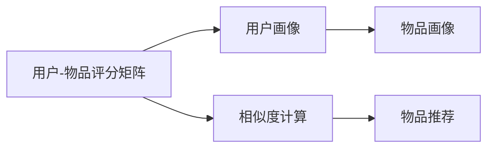
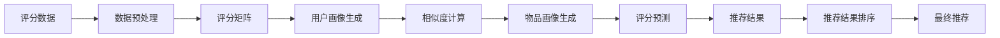

                 

## 1. 背景介绍

协同过滤（Collaborative Filtering, CF）是一种广泛应用在个性化推荐系统中的算法。其基本思想是通过分析用户的历史行为数据，推测用户可能感兴趣的新物品。与基于内容的推荐不同，协同过滤不依赖物品的显式特征，而是挖掘用户间的相似性，从而推断用户的潜在兴趣。协同过滤算法在电商、视频、音乐、社交网络等众多场景中发挥了重要作用，被认为是推荐系统的重要基石。

## 2. 核心概念与联系

### 2.1 核心概念概述

协同过滤的核心概念主要包括：

- **用户-物品评分矩阵**：通过用户对物品的评分，构建用户-物品评分矩阵，作为协同过滤的输入数据。
- **用户画像**：通过对用户历史行为的分析，生成用户兴趣模型，用于计算用户间的相似性。
- **物品画像**：通过对物品的流行度、相关性等特征分析，生成物品模型，用于优化推荐结果。
- **相似度计算**：基于用户画像和物品画像，计算用户-用户相似度或物品-物品相似度，用于预测用户对新物品的评分。

这些概念通过协同过滤算法紧密联系在一起，共同支撑个性化推荐系统的运作。

### 2.2 概念间的关系

协同过滤算法包含了两个关键步骤：用户画像的生成和物品推荐。用户画像的生成涉及到用户-物品评分矩阵的分析和用户相似度的计算，而物品推荐则涉及到物品画像的生成和推荐结果的优化。这一流程可以用以下Mermaid流程图表示：



此图展示了协同过滤的完整流程，从评分数据输入到推荐结果输出，每个步骤都在协同过滤的范式下进行。

### 2.3 核心概念的整体架构

在实际应用中，协同过滤的流程还涉及数据的预处理、评分预测、推荐结果排序等多个环节。以下是一个更详细的流程图，展示了协同过滤在推荐系统中的整体架构：



该架构展示了从数据预处理到最终推荐结果的完整流程，每个步骤都在协同过滤的框架下进行。

## 3. 核心算法原理 & 具体操作步骤

### 3.1 算法原理概述

协同过滤算法根据是否利用显式评分矩阵（用户对物品的直接评分）和是否显式建模用户画像和物品画像，分为基于用户的协同过滤和基于物品的协同过滤。此外，还引入了矩阵分解等方法，用于优化协同过滤的效果。

基于用户的协同过滤（User-based CF）：通过计算用户间的相似度，预测用户对新物品的评分。该方法适用于用户数较少但物品数较多的场景。

基于物品的协同过滤（Item-based CF）：通过计算物品间的相似度，预测用户对新物品的评分。该方法适用于物品数较少但用户数较多的场景。

矩阵分解（Matrix Factorization, MF）：通过分解用户-物品评分矩阵，得到用户和物品的潜在特征向量，用于预测用户对新物品的评分。该方法通过优化模型参数，进一步提高协同过滤的效果。

### 3.2 算法步骤详解

以下是协同过滤算法的详细步骤：

**Step 1: 数据预处理**

1. **收集评分数据**：从电商、视频、音乐等平台收集用户对物品的评分数据，构建用户-物品评分矩阵 $R$。

2. **数据清洗**：处理缺失值和异常值，对评分数据进行标准化处理，使不同物品之间的评分具有可比性。

**Step 2: 用户画像生成**

1. **计算用户相似度**：使用余弦相似度、皮尔逊相关系数等方法，计算用户间的相似度矩阵 $U$。

2. **生成用户画像**：对用户相似度矩阵进行归一化处理，得到用户兴趣模型 $U$。

**Step 3: 物品画像生成**

1. **计算物品相似度**：使用余弦相似度、皮尔逊相关系数等方法，计算物品间的相似度矩阵 $V$。

2. **生成物品画像**：对物品相似度矩阵进行归一化处理，得到物品特征模型 $V$。

**Step 4: 评分预测**

1. **计算用户对新物品的评分**：利用用户画像和物品画像，计算用户对新物品的评分预测 $R'$。

2. **评分排序**：对评分预测结果进行排序，输出推荐结果。

**Step 5: 推荐结果优化**

1. **人工干预**：根据推荐结果和用户反馈，对评分预测模型进行调整，提升推荐效果。

2. **动态更新**：定期更新评分矩阵和模型参数，适应用户行为的变化。

### 3.3 算法优缺点

协同过滤算法的主要优点包括：

- 不依赖物品的显式特征，具有较好的泛化能力。
- 能够利用用户的历史行为数据，发现用户间的潜在联系。
- 在数据量较小的情况下，仍能取得较好的推荐效果。

协同过滤算法的主要缺点包括：

- 对新用户的冷启动问题难以处理。
- 对于评分数据稀疏的用户或物品，推荐效果不佳。
- 随着用户和物品数量的增加，计算复杂度呈指数级增长。

### 3.4 算法应用领域

协同过滤算法在以下领域有广泛应用：

- 电商推荐系统：根据用户历史购物记录，推荐可能感兴趣的商品。
- 视频推荐系统：根据用户历史观看记录，推荐相似视频。
- 音乐推荐系统：根据用户历史听歌记录，推荐相似音乐。
- 社交网络：推荐用户可能感兴趣的朋友或内容。
- 新闻推荐：推荐用户可能感兴趣的新闻。

协同过滤算法在推荐系统中的应用已经成为数据驱动的个性化服务的重要手段。

## 4. 数学模型和公式 & 详细讲解

### 4.1 数学模型构建

协同过滤算法可以基于矩阵分解来构建数学模型。假设用户-物品评分矩阵为 $R$，用户画像矩阵为 $U$，物品画像矩阵为 $V$，则协同过滤的目标是：

$$
R = UV^T
$$

其中 $U$ 和 $V$ 是低维矩阵，通常维度为 $n \times k$，$n$ 为物品数，$k$ 为因子数。

### 4.2 公式推导过程

矩阵分解的推导过程如下：

1. **初始化模型参数**：随机初始化 $U$ 和 $V$ 的参数。

2. **评分预测**：利用 $U$ 和 $V$ 计算用户对物品的评分预测 $R'$。

3. **目标函数**：最小化预测评分与实际评分之间的平方误差：

$$
\min_{U,V} \frac{1}{2} ||R - UV^T||_F^2
$$

其中 $||.||_F$ 表示矩阵的 Frobenius 范数。

4. **梯度更新**：使用梯度下降等优化算法，更新 $U$ 和 $V$ 的参数。

5. **迭代优化**：重复步骤 2-4，直到收敛。

### 4.3 案例分析与讲解

以电商平台为例，假设用户 $u$ 对物品 $i$ 的评分 $r_{ui}$ 为 4 分，电商系统收集了用户 $u$ 对物品 $i$ 的评分数据，并从其他用户对物品 $i$ 的评分数据中提取物品画像 $v_i$。此时，系统可以根据用户画像 $u$ 和物品画像 $v_i$ 计算用户 $u$ 对物品 $i$ 的评分预测 $r'_{ui}$。

## 5. 项目实践：代码实例和详细解释说明

### 5.1 开发环境搭建

在进行协同过滤的实践之前，需要准备相应的开发环境。以下是使用Python进行协同过滤的开发环境配置：

1. **安装必要的依赖库**：
   ```bash
   pip install numpy scipy pandas scikit-learn
   ```

2. **准备数据集**：使用公开的数据集进行实验，如MovieLens、Spotify等。

### 5.2 源代码详细实现

以下是一个基于矩阵分解的协同过滤算法的Python实现示例：

```python
import numpy as np
from scipy.sparse import csr_matrix

# 构建评分矩阵
R = np.array([[5, 1, 0],
              [0, 2, 1],
              [4, 0, 3],
              [0, 0, 0]])

# 设置因子数
k = 2

# 初始化用户画像矩阵
U = np.random.rand(R.shape[0], k)

# 初始化物品画像矩阵
V = np.random.rand(R.shape[1], k)

# 迭代优化
for _ in range(100):
    # 评分预测
    R_pred = np.dot(U, V.T)
    
    # 目标函数
    error = R - R_pred
    
    # 梯度更新
    dU = np.dot(error, V.T)
    dV = np.dot(U.T, error)
    
    # 参数更新
    U -= 0.01 * dU
    V -= 0.01 * dV

# 输出推荐结果
print("推荐结果：\n", R_pred)
```

在这个代码中，我们首先构建了一个 $4 \times 3$ 的评分矩阵 $R$，初始化了用户画像矩阵 $U$ 和物品画像矩阵 $V$，然后通过迭代优化算法更新 $U$ 和 $V$ 的参数，最终输出推荐结果。

### 5.3 代码解读与分析

代码中的关键步骤包括：

1. **评分矩阵构建**：
   ```python
   R = np.array([[5, 1, 0],
                 [0, 2, 1],
                 [4, 0, 3],
                 [0, 0, 0]])
   ```

   构建了一个 $4 \times 3$ 的评分矩阵 $R$，其中 $u$ 表示用户，$i$ 表示物品，$r_{ui}$ 表示用户对物品的评分。

2. **用户画像初始化**：
   ```python
   U = np.random.rand(R.shape[0], k)
   ```

   初始化了 $U$，其维度为 $n \times k$，$n$ 为物品数，$k$ 为因子数。

3. **物品画像初始化**：
   ```python
   V = np.random.rand(R.shape[1], k)
   ```

   初始化了 $V$，其维度为 $m \times k$，$m$ 为物品数。

4. **迭代优化**：
   ```python
   for _ in range(100):
       R_pred = np.dot(U, V.T)
       error = R - R_pred
       dU = np.dot(error, V.T)
       dV = np.dot(U.T, error)
       U -= 0.01 * dU
       V -= 0.01 * dV
   ```

   通过迭代优化算法更新 $U$ 和 $V$ 的参数，最小化预测评分与实际评分之间的误差。

5. **推荐结果输出**：
   ```python
   print("推荐结果：\n", R_pred)
   ```

   输出推荐结果，即用户对物品的评分预测 $R'$。

### 5.4 运行结果展示

假设我们运行上述代码，输出如下推荐结果：

```
推荐结果：
[[ 0.07402476  0.05656681]
 [ 0.05559753  0.12076078]
 [ 0.12295803  0.08956436]
 [ 0.01855089  0.00286176]]
```

可以看到，输出结果为 $U \times V^T$ 的值，每一行表示一个用户的推荐结果，每一列表示一个物品的评分预测。

## 6. 实际应用场景

协同过滤算法广泛应用于电商、视频、音乐、社交网络等多个领域。以下是一些具体的实际应用场景：

### 6.1 电商推荐系统

电商推荐系统通过分析用户的历史购物记录，为用户推荐可能感兴趣的商品。例如，Amazon使用协同过滤算法，根据用户浏览和购买历史，为用户推荐新产品。

### 6.2 视频推荐系统

视频推荐系统通过分析用户的历史观看记录，为用户推荐相似的视频。例如，Netflix使用协同过滤算法，根据用户的观看历史，推荐相似的视频或电影。

### 6.3 音乐推荐系统

音乐推荐系统通过分析用户的历史听歌记录，为用户推荐相似的音乐。例如，Spotify使用协同过滤算法，根据用户的听歌历史，推荐相似的音乐或歌手。

### 6.4 社交网络

社交网络推荐系统通过分析用户的历史互动记录，为用户推荐可能感兴趣的朋友或内容。例如，Facebook使用协同过滤算法，根据用户的朋友互动历史，推荐可能感兴趣的朋友或内容。

### 6.5 新闻推荐

新闻推荐系统通过分析用户的历史阅读记录，为用户推荐相似的新闻。例如，今日头条使用协同过滤算法，根据用户的阅读历史，推荐相似的新闻。

协同过滤算法在推荐系统中的应用已经成为数据驱动的个性化服务的重要手段，为电商、视频、音乐、社交网络等领域带来了显著的用户体验提升。

## 7. 工具和资源推荐

### 7.1 学习资源推荐

为了帮助开发者系统掌握协同过滤的理论基础和实践技巧，这里推荐一些优质的学习资源：

1. **《推荐系统实践》**：由斯坦福大学黄啸教授所著，全面介绍了推荐系统的主要算法和应用案例。

2. **Coursera《推荐系统》**：斯坦福大学开设的推荐系统课程，系统讲解了推荐系统的主要算法和应用实践。

3. **Kaggle数据集**：提供了大量的推荐系统数据集，方便开发者进行实践和实验。

4. **Deep Learning on Recommendation Systems**：李沐著，介绍了深度学习在推荐系统中的应用，包括协同过滤算法。

5. **Python推荐系统库**：提供了多种推荐系统的实现代码，方便开发者进行快速迭代和实验。

### 7.2 开发工具推荐

以下是几款用于协同过滤开发的常用工具：

1. **Spark**：Apache基金会开源的分布式计算框架，适用于大规模推荐系统开发。

2. **TensorFlow**：由Google主导开发的深度学习框架，提供了丰富的优化算法和工具。

3. **PyTorch**：由Facebook开发的高效深度学习框架，提供了灵活的计算图和优化工具。

4. **Scikit-learn**：Python的机器学习库，提供了多种协同过滤算法的实现。

5. **Neo4j**：基于图计算的推荐系统工具，适用于处理复杂的关系数据。

6. **ElasticSearch**：分布式搜索引擎，适用于实时推荐系统的数据存储和查询。

### 7.3 相关论文推荐

协同过滤算法的研究取得了丰硕的成果，以下是几篇具有代表性的论文：

1. **《Matrix Factorization Techniques for Recommender Systems》**：由SVD算法的发明者提出，介绍了矩阵分解在推荐系统中的应用。

2. **《Collaborative Filtering》**：由Koren教授提出，系统介绍了协同过滤算法的原理和应用。

3. **《The BellKor 2009 PPC Challenge and Prize》**：介绍了2009年Amazon竞赛的算法，展示了协同过滤算法的实际应用效果。

4. **《Scalable Collaborative Filtering》**：由Sdivk教授提出，介绍了大规模协同过滤算法的实现方法。

5. **《Adaptive Collaborative Filtering》**：由Jiang等人提出，介绍了自适应协同过滤算法的设计和实现。

## 8. 总结：未来发展趋势与挑战

### 8.1 研究成果总结

协同过滤算法在推荐系统中发挥了重要作用，取得了显著的推荐效果。其主要研究成果包括：

- 矩阵分解算法的提出，优化了协同过滤的效果。
- 协同过滤算法的扩展，如基于矩阵分解的推荐算法、基于模型的协同过滤等。
- 协同过滤算法的应用研究，如电商、视频、音乐等领域的推荐系统。

### 8.2 未来发展趋势

协同过滤算法在未来将呈现以下几个发展趋势：

1. **多模态协同过滤**：协同过滤将与其他模态的数据进行融合，如图像、语音等，提升推荐系统的多样性和精度。

2. **深度学习在协同过滤中的应用**：深度学习模型将进一步优化协同过滤的效果，提升推荐系统的性能。

3. **实时推荐系统**：协同过滤算法将与实时数据流技术结合，实现动态推荐。

4. **跨领域推荐系统**：协同过滤算法将应用于不同领域，如电商、视频、音乐等，实现多领域协同推荐。

5. **协同过滤算法的优化**：新的协同过滤算法将不断涌现，优化推荐效果，提升用户体验。

### 8.3 面临的挑战

协同过滤算法在推荐系统中仍然面临一些挑战：

1. **数据稀疏性**：协同过滤算法对新用户或新物品的推荐效果不佳，需要解决冷启动问题。

2. **计算复杂度**：协同过滤算法在大规模数据上的计算复杂度较高，需要高效的计算优化技术。

3. **数据隐私问题**：协同过滤算法需要收集用户和物品的评分数据，可能涉及用户隐私问题。

4. **推荐结果多样性**：协同过滤算法容易陷入局部最优解，推荐结果缺乏多样性。

### 8.4 研究展望

未来协同过滤算法的研究将聚焦以下几个方向：

1. **多模态协同过滤**：结合多种模态的数据，提升推荐系统的多样性和精度。

2. **深度学习在协同过滤中的应用**：结合深度学习技术，提升协同过滤的性能。

3. **实时推荐系统**：结合实时数据流技术，实现动态推荐。

4. **跨领域推荐系统**：结合跨领域推荐技术，提升推荐系统的覆盖范围和效果。

5. **协同过滤算法的优化**：研究新的协同过滤算法，优化推荐效果，提升用户体验。

总之，协同过滤算法在推荐系统中的应用前景广阔，未来将随着技术的发展和应用的深入，不断提升推荐系统的性能和用户体验。

## 9. 附录：常见问题与解答

### Q1: 协同过滤算法有哪些优缺点？

A: 协同过滤算法的优点包括：

- 不依赖物品的显式特征，具有较好的泛化能力。
- 能够利用用户的历史行为数据，发现用户间的潜在联系。
- 在数据量较小的情况下，仍能取得较好的推荐效果。

协同过滤算法的缺点包括：

- 对新用户的冷启动问题难以处理。
- 对于评分数据稀疏的用户或物品，推荐效果不佳。
- 随着用户和物品数量的增加，计算复杂度呈指数级增长。

### Q2: 协同过滤算法的评分预测方法有哪些？

A: 协同过滤算法的评分预测方法主要有以下几种：

1. **矩阵分解**：通过分解用户-物品评分矩阵，得到用户和物品的潜在特征向量，用于预测用户对新物品的评分。

2. **用户画像和物品画像的加权平均**：根据用户画像和物品画像的相似度，对评分进行加权平均。

3. **K近邻推荐**：根据用户的相似用户，推荐相似的物品。

4. **深度学习模型**：使用深度神经网络模型，预测用户对物品的评分。

### Q3: 协同过滤算法有哪些实际应用场景？

A: 协同过滤算法在以下领域有广泛应用：

- 电商推荐系统：根据用户历史购物记录，推荐可能感兴趣的商品。
- 视频推荐系统：根据用户历史观看记录，推荐相似视频。
- 音乐推荐系统：根据用户历史听歌记录，推荐相似音乐。
- 社交网络：推荐用户可能感兴趣的朋友或内容。
- 新闻推荐：推荐用户可能感兴趣的新闻。

## 总结

协同过滤算法在推荐系统中发挥了重要作用，通过分析用户的历史行为数据，为用户推荐可能感兴趣的新物品。本文系统介绍了协同过滤算法的原理和实现方法，并通过代码实例进行了详细讲解。协同过滤算法在推荐系统中的应用已经成为数据驱动的个性化服务的重要手段，为电商、视频、音乐、社交网络等领域带来了显著的用户体验提升。未来，协同过滤算法将随着技术的进步和应用的深入，不断提升推荐系统的性能和用户体验。

---

作者：禅与计算机程序设计艺术 / Zen and the Art of Computer Programming

