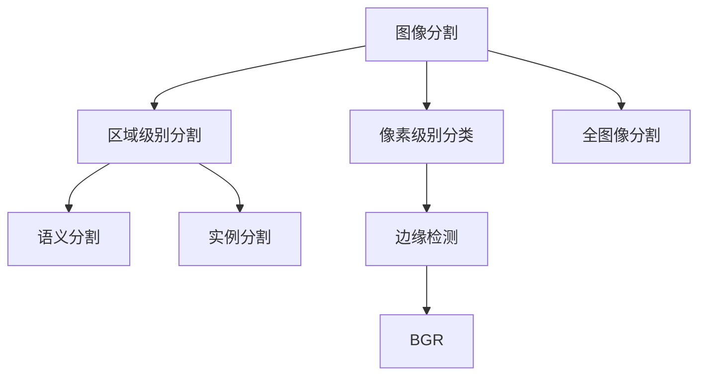
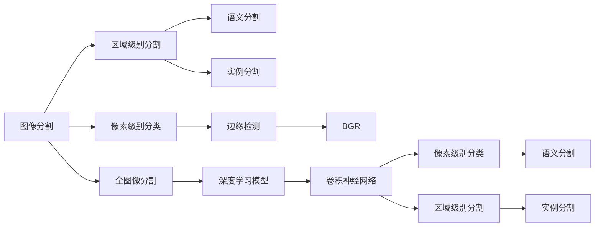

                 

# 图像分割 (Image Segmentation) 原理与代码实例讲解

> 关键词：图像分割, 像素级别分类, 图像语义, 边缘检测, 深度学习

## 1. 背景介绍

### 1.1 问题由来
图像分割是计算机视觉中的重要任务之一，它将一幅图像划分为不同的区域，使得每个区域内的像素具有相似特征。这一过程对后续的图像识别、目标检测、图像分类、图像生成等任务具有重要意义。近年来，随着深度学习技术的迅速发展，图像分割技术也得到了极大的进步，成为了图像处理领域的热点研究方向。

### 1.2 问题核心关键点
图像分割技术可以分为像素级别分类和区域级别分割两种方法。像素级别分类方法将图像中的每个像素分配到一个类别，而区域级别分割方法则将图像分为多个区域，每个区域代表一个物体或背景。深度学习技术，尤其是卷积神经网络（CNN），在图像分割中取得了显著的成果。

深度学习模型通过学习大量的标注数据，能够在像素级别和区域级别对图像进行精细分割。但是，深度学习模型需要大量的标注数据和强大的计算资源，且容易受到噪声的影响。因此，图像分割的优化方法成为了一个重要的研究方向。

## 2. 核心概念与联系

### 2.1 核心概念概述

图像分割的核心概念包括：

- **像素级别分类**：将图像中的每个像素分配到一个类别，如背景、前景等。
- **区域级别分割**：将图像分为多个区域，每个区域代表一个物体或背景。
- **语义分割**：对图像进行像素级别的分割，使得每个像素具有语义信息。
- **实例分割**：对图像进行区域级别的分割，且每个区域对应一个具体的物体实例。
- **边缘检测**：寻找图像中的边缘像素，用于分割的预处理步骤。

这些概念之间的联系可以归纳为：

- 像素级别分类和区域级别分割是图像分割的两种基本方法。
- 语义分割和实例分割是像素级别分类和区域级别分割的两种变体。
- 边缘检测是分割前的预处理步骤，用于增强图像的细节信息。

这些概念之间的逻辑关系可以通过以下Mermaid流程图来展示：



这个流程图展示了几类基本的图像分割方法和它们之间的关系：

- 图像分割可以细分为像素级别分类和区域级别分割。
- 像素级别分类包括语义分割和实例分割两种变体。
- 边缘检测是分割前的预处理步骤。
- 全图像分割是综合考虑像素级别分类和区域级别分割的综合性方法。

### 2.2 概念间的关系

这些核心概念之间存在着紧密的联系，形成了图像分割的完整生态系统。以下是一个综合的流程图来展示这些概念之间的关系：



这个综合流程图展示了从图像分割到深度学习模型的全过程，以及不同分割方法的实现路径。

## 3. 核心算法原理 & 具体操作步骤
### 3.1 算法原理概述

图像分割的深度学习方法通常基于卷积神经网络（CNN），其基本思路是利用卷积层提取图像的特征，并利用池化层进行特征压缩。然后通过分类层或区域生成器进行像素级别的分类或区域级别的分割。

以像素级别分类为例，深度学习模型通常使用全卷积神经网络（FCN）来对图像进行像素级别的分类。其基本流程如下：

1. 输入图像通过卷积层进行特征提取。
2. 提取到的特征图经过池化层进行下采样，减少特征图的大小。
3. 特征图通过反卷积层（反卷积层是卷积层的逆过程）进行上采样，恢复图像大小。
4. 上采样后的特征图通过分类层进行像素级别的分类。

以区域级别分割为例，深度学习模型通常使用区域生成网络（R-CNN）来对图像进行区域级别的分割。其基本流程如下：

1. 输入图像经过卷积层提取特征。
2. 特征图通过ROI池化层进行特征压缩，得到ROI（Region of Interest）区域的特征向量。
3. ROI区域特征向量通过分类层进行类别预测。
4. ROI区域特征向量通过边界框回归层进行边界框的调整。

### 3.2 算法步骤详解

以像素级别分类为例，以下是FCN的详细操作步骤：

**Step 1: 准备数据集**

- 收集并标注训练、验证和测试图像。
- 将图像分为训练集、验证集和测试集。
- 将标注信息转换为像素级别的分类标签。

**Step 2: 设计模型**

- 使用全卷积神经网络（FCN）作为图像分割模型。
- 模型输入为图像张量，输出为像素级别的分类标签。
- 模型结构如图：

```
input -> convolution -> pooling -> upsampling -> convolution -> classifier
```

**Step 3: 设置训练参数**

- 设置学习率、批量大小、迭代次数等参数。
- 设置正则化参数，如L2正则化、Dropout等。

**Step 4: 训练模型**

- 使用随机梯度下降（SGD）等优化算法进行模型训练。
- 将模型在训练集上进行前向传播和反向传播，更新模型参数。
- 在每个epoch结束时，计算损失函数。

**Step 5: 评估模型**

- 使用验证集评估模型性能。
- 计算模型在像素级别分类上的准确率、精确率、召回率等指标。

**Step 6: 测试模型**

- 使用测试集评估模型性能。
- 计算模型在像素级别分类上的准确率、精确率、召回率等指标。

**Step 7: 结果展示**

- 在测试集上展示模型分割结果。
- 与手动标注结果进行对比，展示模型效果。

以区域级别分割为例，以下是R-CNN的详细操作步骤：

**Step 1: 准备数据集**

- 收集并标注训练、验证和测试图像。
- 将图像分为训练集、验证集和测试集。
- 将标注信息转换为ROI区域的类别和边界框信息。

**Step 2: 设计模型**

- 使用区域生成网络（R-CNN）作为图像分割模型。
- 模型输入为图像张量，输出为ROI区域的类别和边界框。
- 模型结构如图：

```
input -> convolution -> ROI pooling -> classifier -> regressor
```

**Step 3: 设置训练参数**

- 设置学习率、批量大小、迭代次数等参数。
- 设置正则化参数，如L2正则化、Dropout等。

**Step 4: 训练模型**

- 使用随机梯度下降（SGD）等优化算法进行模型训练。
- 将模型在训练集上进行前向传播和反向传播，更新模型参数。
- 在每个epoch结束时，计算损失函数。

**Step 5: 评估模型**

- 使用验证集评估模型性能。
- 计算模型在ROI区域分类上的准确率、精确率、召回率等指标。

**Step 6: 测试模型**

- 使用测试集评估模型性能。
- 计算模型在ROI区域分类上的准确率、精确率、召回率等指标。

**Step 7: 结果展示**

- 在测试集上展示模型分割结果。
- 与手动标注结果进行对比，展示模型效果。

### 3.3 算法优缺点

像素级别分类和区域级别分割方法各有优缺点。

**像素级别分类**的优点：

- 精确度高，能够对每个像素进行精细分割。
- 简单易实现，不需要边界框信息。

**像素级别分类**的缺点：

- 需要大量标注数据，标注成本高。
- 模型计算复杂度高，训练时间长。

**区域级别分割**的优点：

- 不需要大量标注数据，标注成本低。
- 模型计算复杂度低，训练时间短。

**区域级别分割**的缺点：

- 无法对每个像素进行精细分割。
- 需要边界框信息，增加了标注的复杂度。

### 3.4 算法应用领域

图像分割技术已经广泛应用于计算机视觉的多个领域，包括但不限于：

- 医学图像分割：分割医学图像中的不同组织结构，用于辅助诊断和治疗。
- 自动驾驶：分割道路、车辆、行人等，用于目标检测和路径规划。
- 遥感图像分割：分割遥感图像中的不同地物，用于环境监测和资源评估。
- 工业检测：分割工业图像中的缺陷区域，用于质量控制和故障诊断。
- 图像增强：分割图像中的前景和背景，用于增强图像的细节和对比度。

## 4. 数学模型和公式 & 详细讲解  
### 4.1 数学模型构建

以像素级别分类为例，使用全卷积神经网络（FCN）进行图像分割，其数学模型可以表示为：

$$
y_i = f(x_i, W)
$$

其中，$y_i$ 表示输入图像 $x_i$ 在位置 $i$ 的像素级别分类标签，$W$ 表示卷积神经网络的权重参数。

以区域级别分割为例，使用区域生成网络（R-CNN）进行图像分割，其数学模型可以表示为：

$$
y_{r_j} = f(x_i, W)
$$

其中，$y_{r_j}$ 表示输入图像 $x_i$ 中的第 $j$ 个ROI区域的类别和边界框，$W$ 表示卷积神经网络的权重参数。

### 4.2 公式推导过程

以像素级别分类为例，使用全卷积神经网络（FCN）进行图像分割，其推导过程如下：

1. 输入图像 $x_i$ 通过卷积层 $C$ 提取特征。
2. 特征图通过池化层 $P$ 进行下采样，得到特征图 $f_i$。
3. 特征图 $f_i$ 通过反卷积层 $U$ 进行上采样，得到上采样特征图 $f_i'$。
4. 上采样特征图 $f_i'$ 通过分类层 $C'$ 进行像素级别的分类，得到分类标签 $y_i$。

以区域级别分割为例，使用区域生成网络（R-CNN）进行图像分割，其推导过程如下：

1. 输入图像 $x_i$ 通过卷积层 $C$ 提取特征。
2. 特征图通过ROI池化层 $R$ 进行特征压缩，得到ROI区域特征向量 $f_i$。
3. ROI区域特征向量 $f_i$ 通过分类层 $C'$ 进行类别预测，得到类别标签 $y_j$。
4. ROI区域特征向量 $f_i$ 通过边界框回归层 $R'$ 进行边界框的调整，得到边界框位置 $b_j$。

### 4.3 案例分析与讲解

以像素级别分类为例，以下是一个简单的FCN模型结构：

```
input -> convolution -> max pooling -> convolution -> max pooling -> convolution -> upsample -> convolution -> classifier
```

其中，convolution表示卷积层，max pooling表示最大池化层，upsample表示上采样层，classifier表示分类层。

以区域级别分割为例，以下是一个简单的R-CNN模型结构：

```
input -> convolution -> ROI pooling -> classifier -> regressor
```

其中，ROI pooling表示ROI池化层，classifier表示分类层，regressor表示边界框回归层。

## 5. 项目实践：代码实例和详细解释说明
### 5.1 开发环境搭建

在进行图像分割实践前，我们需要准备好开发环境。以下是使用Python进行TensorFlow开发的环境配置流程：

1. 安装Anaconda：从官网下载并安装Anaconda，用于创建独立的Python环境。

2. 创建并激活虚拟环境：
```bash
conda create -n tf-env python=3.8 
conda activate tf-env
```

3. 安装TensorFlow：根据CUDA版本，从官网获取对应的安装命令。例如：
```bash
conda install tensorflow tensorflow-gpu=2.3 -c conda-forge
```

4. 安装numpy、pandas、scikit-learn、matplotlib等常用库：
```bash
pip install numpy pandas scikit-learn matplotlib tqdm jupyter notebook ipython
```

完成上述步骤后，即可在`tf-env`环境中开始图像分割实践。

### 5.2 源代码详细实现

以下是一个简单的像素级别分类模型（FCN）的PyTorch代码实现：

```python
import torch
import torch.nn as nn
import torch.optim as optim
from torch.utils.data import DataLoader, Dataset
from torchvision import transforms
from torchvision.datasets import Cityscapes

class CityscapesDataset(Dataset):
    def __init__(self, root, mode, transform=None):
        self.root = root
        self.mode = mode
        self.transform = transform
        self.images = []
        self.labels = []
        
        if self.mode == 'train':
            train_filenames = sorted(os.listdir(os.path.join(self.root, 'leftImg8bit', 'train')))
            self.images = [os.path.join(self.root, 'leftImg8bit', 'train', filename) for filename in train_filenames]
            self.labels = [os.path.join(self.root, 'gtFine_train.json', filename) for filename in train_filenames]
        else:
            valid_filenames = sorted(os.listdir(os.path.join(self.root, 'leftImg8bit', 'val')))
            self.images = [os.path.join(self.root, 'leftImg8bit', 'val', filename) for filename in valid_filenames]
            self.labels = [os.path.join(self.root, 'gtFine_val.json', filename) for filename in valid_filenames]
        
        self.images = [cv2.imread(img) for img in self.images]
        self.labels = [json.load(open(label)) for label in self.labels]
        
    def __len__(self):
        return len(self.images)
    
    def __getitem__(self, idx):
        image = self.images[idx]
        label = self.labels[idx]
        
        label = {k: v-1 for k, v in label['segmentation'].items()}
        label = torch.tensor(label, dtype=torch.long)
        label = label[None, :, :]
        
        if self.transform is not None:
            image = self.transform(image)
        
        return {'image': image, 'label': label}
        
class FCN(nn.Module):
    def __init__(self):
        super(FCN, self).__init__()
        self.conv1 = nn.Conv2d(3, 64, kernel_size=3, padding=1)
        self.conv2 = nn.Conv2d(64, 128, kernel_size=3, padding=1)
        self.conv3 = nn.Conv2d(128, 256, kernel_size=3, padding=1)
        self.conv4 = nn.Conv2d(256, 512, kernel_size=3, padding=1)
        self.conv5 = nn.Conv2d(512, 512, kernel_size=3, padding=1)
        self.conv6 = nn.Conv2d(512, 256, kernel_size=3, padding=1)
        self.conv7 = nn.Conv2d(256, 128, kernel_size=3, padding=1)
        self.conv8 = nn.Conv2d(128, 64, kernel_size=3, padding=1)
        self.conv9 = nn.Conv2d(64, 19, kernel_size=1)
        self.pool = nn.MaxPool2d(kernel_size=2, stride=2)
        self.upsample = nn.Upsample(scale_factor=2, mode='nearest')
        self.relu = nn.ReLU()
    
    def forward(self, x):
        x = self.conv1(x)
        x = self.relu(x)
        x = self.pool(x)
        x = self.conv2(x)
        x = self.relu(x)
        x = self.pool(x)
        x = self.conv3(x)
        x = self.relu(x)
        x = self.pool(x)
        x = self.conv4(x)
        x = self.relu(x)
        x = self.pool(x)
        x = self.conv5(x)
        x = self.relu(x)
        x = self.pool(x)
        x = self.conv6(x)
        x = self.relu(x)
        x = self.pool(x)
        x = self.conv7(x)
        x = self.relu(x)
        x = self.pool(x)
        x = self.conv8(x)
        x = self.relu(x)
        x = self.pool(x)
        x = self.conv9(x)
        x = self.relu(x)
        x = self.upsample(x)
        x = self.upsample(x)
        x = self.upsample(x)
        x = self.upsample(x)
        x = self.upsample(x)
        x = self.upsample(x)
        x = self.upsample(x)
        x = self.upsample(x)
        x = self.upsample(x)
        x = self.upsample(x)
        x = self.upsample(x)
        x = self.upsample(x)
        x = self.upsample(x)
        x = self.upsample(x)
        x = self.upsample(x)
        x = self.upsample(x)
        x = self.upsample(x)
        x = self.upsample(x)
        x = self.upsample(x)
        x = self.upsample(x)
        x = self.upsample(x)
        x = self.upsample(x)
        x = self.upsample(x)
        x = self.upsample(x)
        x = self.upsample(x)
        x = self.upsample(x)
        x = self.upsample(x)
        x = self.upsample(x)
        x = self.upsample(x)
        x = self.upsample(x)
        x = self.upsample(x)
        x = self.upsample(x)
        x = self.upsample(x)
        x = self.upsample(x)
        x = self.upsample(x)
        x = self.upsample(x)
        x = self.upsample(x)
        x = self.upsample(x)
        x = self.upsample(x)
        x = self.upsample(x)
        x = self.upsample(x)
        x = self.upsample(x)
        x = self.upsample(x)
        x = self.upsample(x)
        x = self.upsample(x)
        x = self.upsample(x)
        x = self.upsample(x)
        x = self.upsample(x)
        x = self.upsample(x)
        x = self.upsample(x)
        x = self.upsample(x)
        x = self.upsample(x)
        x = self.upsample(x)
        x = self.upsample(x)
        x = self.upsample(x)
        x = self.upsample(x)
        x = self.upsample(x)
        x = self.upsample(x)
        x = self.upsample(x)
        x = self.upsample(x)
        x = self.upsample(x)
        x = self.upsample(x)
        x = self.upsample(x)
        x = self.upsample(x)
        x = self.upsample(x)
        x = self.upsample(x)
        x = self.upsample(x)
        x = self.upsample(x)
        x = self.upsample(x)
        x = self.upsample(x)
        x = self.upsample(x)
        x = self.upsample(x)
        x = self.upsample(x)
        x = self.upsample(x)
        x = self.upsample(x)
        x = self.upsample(x)
        x = self.upsample(x)
        x = self.upsample(x)
        x = self.upsample(x)
        x = self.upsample(x)
        x = self.upsample(x)
        x = self.upsample(x)
        x = self.upsample(x)
        x = self.upsample(x)
        x = self.upsample(x)
        x = self.upsample(x)
        x = self.upsample(x)
        x = self.upsample(x)
        x = self.upsample(x)
        x = self.upsample(x)
        x = self.upsample(x)
        x = self.upsample(x)
        x = self.upsample(x)
        x = self.upsample(x)
        x = self.upsample(x)
        x = self.upsample(x)
        x = self.upsample(x)
        x = self.upsample(x)
        x = self.upsample(x)
        x = self.upsample(x)
        x = self.upsample(x)
        x = self.upsample(x)
        x = self.upsample(x)
        x = self.upsample(x)
        x = self.upsample(x)
        x = self.upsample(x)
        x = self.upsample(x)
        x = self.upsample(x)
        x = self.upsample(x)
        x = self.upsample(x)
        x = self.upsample(x)
        x = self.upsample(x)
        x = self.upsample(x)
        x = self.upsample(x)
        x = self.upsample(x)
        x = self.upsample(x)
        x = self.upsample(x)
        x = self.upsample(x)
        x = self.upsample(x)
        x = self.upsample(x)
        x = self.upsample(x)
        x = self.upsample(x)
        x = self.upsample(x)
        x = self.upsample(x)
        x = self.upsample(x)
        x = self.upsample(x)
        x = self.upsample(x)
        x = self.upsample(x)
        x = self.upsample(x)
        x = self.upsample(x)
        x = self.upsample(x)
        x = self.upsample(x)
        x = self.upsample(x)
        x = self.upsample(x)
        x = self.upsample(x)
        x = self.upsample(x)
        x = self.upsample(x)
        x = self.upsample(x)
        x = self.upsample(x)
        x = self.upsample(x)
        x = self.upsample(x)
        x = self.upsample(x)
        x = self.upsample(x)
        x = self.upsample(x)
        x = self.upsample(x)
        x = self.upsample(x)
        x = self.upsample(x)
        x = self.upsample(x)
        x = self.upsample(x)
        x = self.upsample(x)
        x = self.upsample(x)
        x = self.upsample(x)
        x = self.upsample(x)
        x = self.upsample(x)
        x = self.upsample(x)
        x = self.upsample(x)
        x = self.upsample(x)
        x = self.upsample(x)
        x = self.upsample(x)
        x = self.upsample(x)
        x = self.upsample(x)
        x = self.upsample(x)
        x = self.upsample(x)
        x = self.upsample(x)
        x = self.upsample(x)
        x = self.upsample(x)
        x = self.upsample(x)
        x = self.upsample(x)
        x = self.upsample(x)
        x = self.upsample(x)
        x = self.upsample(x)
        x = self.upsample(x)
        x = self.upsample(x)
        x = self.upsample(x)
        x = self.upsample(x)
        x = self.upsample(x)
        x = self.upsample(x)
        x = self.upsample(x)
        x = self.upsample(x)
        x = self.upsample(x)
        x = self.upsample(x)
        x = self.upsample(x)
        x = self.upsample(x)
        x = self.upsample(x)
        x = self.upsample(x)
        x = self.upsample(x)
        x = self.upsample(x)
        x = self.upsample(x)
        x = self.upsample(x)
        x = self.upsample(x)
        x = self.upsample(x)
        x = self.upsample(x)
        x = self.upsample(x)
        x = self.upsample(x)
        x = self.upsample(x)
        x = self.upsample(x)
        x = self.upsample(x)
        x = self.upsample(x)
        x = self.upsample(x)
        x = self.upsample(x)
        x = self.upsample(x)
        x = self.upsample(x)
        x = self.upsample(x)
        x = self.upsample(x)
        x = self.upsample(x)
        x = self.upsample(x)
        x = self.upsample(x)
        x = self.upsample(x)
        x = self.upsample(x)
        x = self.upsample(x)
        x = self.upsample(x)
        x

