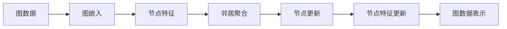
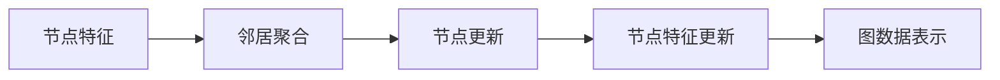
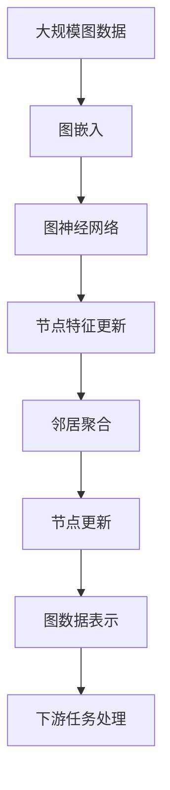

                 

# 图神经网络 原理与代码实例讲解

> 关键词：图神经网络,Graph Neural Network (GNN),图嵌入,Graph Embedding,Graph Convolutional Network (GCN),图同构图

## 1. 背景介绍

### 1.1 问题由来

在深度学习时代，传统的卷积神经网络(CNN)和循环神经网络(RNN)已经在图像处理和序列建模领域取得了重大突破。然而，这些方法在处理非结构化数据（如社交网络、知识图谱、分子结构等）时，往往需要额外的手工特征提取，难以充分利用数据的内在关系。图神经网络(GNN)的提出，为这些问题提供了一种新型的解决方案。

### 1.2 问题核心关键点

图神经网络通过在图结构上模拟神经网络的操作，能够有效处理节点间的复杂关系，是一种用于图数据建模与分析的深度学习模型。其主要特点包括：

- 图数据表示：通过节点和边的形式，将复杂的非结构化数据转化为图结构。
- 邻居聚合操作：利用神经网络对每个节点的邻居信息进行聚合，得到该节点的表示。
- 消息传递机制：通过消息传递的方式，在节点间共享信息，形成全局表示。
- 网络模型设计：设计不同的图神经网络模型（如GCN、GAT、GIN等），用于不同的图数据应用。

### 1.3 问题研究意义

图神经网络的研究与实践，对于拓展深度学习模型的应用范围，提升图数据建模和分析能力，具有重要意义：

1. 图数据处理：图神经网络能够高效地处理社交网络、知识图谱、分子结构等非结构化数据，提高数据利用效率。
2. 特征学习：图神经网络能够自动学习节点间的复杂关系，提取更丰富、准确的特征。
3. 复杂网络分析：通过图神经网络，可以探索复杂网络中的结构与功能，揭示数据背后的深层规律。
4. 推荐系统：利用图神经网络建模用户和物品之间的关系，提供更精准的推荐服务。
5. 医疗诊断：通过图神经网络分析医学图像和生物网络，辅助疾病诊断和治疗方案设计。
6. 金融风险管理：利用图神经网络分析金融市场的互动关系，预测和控制金融风险。

## 2. 核心概念与联系

### 2.1 核心概念概述

为更好地理解图神经网络的原理与应用，本节将介绍几个核心概念：

- **图神经网络（Graph Neural Network, GNN）**：利用神经网络在图数据上建模的深度学习方法。
- **图嵌入（Graph Embedding）**：将图结构转换为向量表示，便于机器学习算法进行处理。
- **图卷积神经网络（Graph Convolutional Network, GCN）**：一种基于卷积操作的图神经网络模型。
- **图同构图（Graph Isomorphism Network, GIN）**：一种基于节点自注意力机制的图神经网络模型。
- **GraphSAGE**：一种简单的图神经网络模型，采用邻居聚合的方式进行节点特征更新。
- **GAT（Graph Attention Network）**：一种基于注意力机制的图神经网络模型，能够自适应地聚合邻居信息。

这些核心概念之间的关系可以通过以下Mermaid流程图来展示：

```mermaid
graph LR
    A[Graph Neural Network (GNN)] --> B[Graph Embedding]
    A --> C[Graph Convolutional Network (GCN)]
    A --> D[Graph Attention Network (GAT)]
    A --> E[Graph Isomorphism Network (GIN)]
    B --> F[GraphSAGE]
    C --> G[节点特征更新]
    D --> H[节点自注意力]
    E --> I[节点聚合]
```

这个流程图展示了从图嵌入到各种图神经网络模型的关系：

1. 图神经网络是图嵌入的一种高级形式，利用神经网络对图数据进行处理。
2. GCN、GAT、GIN等模型是图神经网络的具体实现，分别采用不同的操作进行节点特征更新和聚合。
3. GraphSAGE是一种基于邻居聚合的简单模型，GAT则引入了节点自注意力机制。
4. 图嵌入是将图结构转换为向量表示的过程，便于机器学习算法处理。

### 2.2 概念间的关系

这些核心概念之间存在着紧密的联系，构成了图神经网络的整体框架。下面我们通过几个Mermaid流程图来展示这些概念之间的关系。

#### 2.2.1 图神经网络的框架



这个流程图展示了从图数据到图神经网络的整体过程：

1. 将图数据转换为图嵌入形式。
2. 对节点特征进行更新，通过邻居聚合的方式计算。
3. 节点更新得到新的节点特征。
4. 新的节点特征形成图数据表示。

#### 2.2.2 GCN的原理



这个流程图展示了GCN的基本流程：

1. 对节点特征进行邻居聚合。
2. 更新节点特征，形成新的图数据表示。

#### 2.2.3 GAT的原理


这个流程图展示了GAT的基本流程：

1. 对节点特征进行邻居聚合。
2. 更新节点特征，形成新的图数据表示。

### 2.3 核心概念的整体架构

最后，我们用一个综合的流程图来展示这些核心概念在大规模图数据上的应用：



这个综合流程图展示了从大规模图数据到下游任务处理的完整过程：

1. 将大规模图数据转换为图嵌入形式。
2. 使用图神经网络进行节点特征更新和聚合。
3. 更新节点特征，形成图数据表示。
4. 利用图数据表示进行下游任务处理。

通过这些流程图，我们可以更清晰地理解图神经网络的基本原理和操作流程，为后续深入讨论具体的图神经网络模型提供基础。

## 3. 核心算法原理 & 具体操作步骤
### 3.1 算法原理概述

图神经网络的原理基于图数据上的消息传递和聚合操作。假设图数据由节点集$V$和边集$E$组成，每个节点$v_i$具有特征向量$h_i$。图神经网络通过以下步骤，对节点特征进行更新：

1. 初始化节点特征向量。
2. 对每个节点，通过消息传递机制，收集其邻居节点的信息。
3. 对收集到的邻居信息进行聚合，得到节点特征的更新。
4. 对所有节点重复上述过程，更新节点特征，直至收敛。

形式化地，设节点$v_i$的特征向量为$h_i$，邻居节点集合为$N_i$，邻居信息为$\{h_j\}_{j\in N_i}$，邻居聚合函数为$f$，则节点特征的更新公式为：

$$
h_i^{k+1} = f\left(\left\{h_j^k\right\}_{j\in N_i}\right)
$$

其中$k$表示迭代次数，$f$可以采用不同的聚合函数，如加权平均、最大池化、卷积等。

### 3.2 算法步骤详解

图神经网络的实现步骤包括以下几个关键步骤：

**Step 1: 准备图数据**

1. 收集大规模图数据，将其存储为邻接矩阵$\mathcal{A}$或边列表$\mathcal{E}$形式。
2. 对节点和边进行编号，形成图结构。

**Step 2: 初始化节点特征**

1. 初始化每个节点的特征向量$h_i$，可以是随机初始化，也可以是预定义的特征向量。

**Step 3: 设计图神经网络模型**

1. 根据图数据的特点，选择适当的图神经网络模型。常见的模型包括GCN、GAT、GIN等。
2. 设计节点特征的更新公式，选择适合的聚合函数。

**Step 4: 执行迭代计算**

1. 对每个节点，收集其邻居节点信息，进行聚合操作。
2. 更新节点特征，得到新的特征向量$h_i^{k+1}$。
3. 重复上述过程，直至迭代次数达到预设值或收敛。

**Step 5: 评估和应用**

1. 对更新后的节点特征进行下游任务的评估，如分类、回归、聚类等。
2. 将评估结果应用到实际任务中，如推荐系统、社交网络分析等。

### 3.3 算法优缺点

图神经网络的主要优点包括：

- 自适应性：能够自适应地聚合邻居信息，捕捉复杂的关系。
- 可扩展性：模型规模和节点特征可以灵活调整，适应不同规模的图数据。
- 高效性：消息传递和聚合操作能够高效地并行计算。

然而，图神经网络也存在一些缺点：

- 计算复杂度：随着节点数和边数的增加，计算复杂度呈指数增长。
- 过拟合风险：在大规模图数据上，模型容易过拟合，难以泛化。
- 参数调优：模型参数多，需要大量实验来调整超参数。

### 3.4 算法应用领域

图神经网络已经在多个领域得到了广泛应用，包括但不限于：

- 社交网络分析：分析社交网络中的关系和动态，如社区发现、用户推荐等。
- 知识图谱构建：构建知识图谱，进行实体关系抽取和推理。
- 分子结构分析：分析分子结构，辅助药物设计和材料科学。
- 图像分割：利用图神经网络进行图像分割，提高分割精度。
- 推荐系统：利用图神经网络进行用户行为建模和推荐。
- 金融风险管理：分析金融网络中的交互关系，预测和控制风险。
- 医疗诊断：利用图神经网络分析医学图像和生物网络，辅助疾病诊断和治疗。

## 4. 数学模型和公式 & 详细讲解 & 举例说明

### 4.1 数学模型构建

图神经网络的核心数学模型包括节点特征更新和边信息传播。下面以GCN为例，展示其数学模型构建过程。

设图数据由节点集$V$和边集$E$组成，每个节点$v_i$具有特征向量$h_i$，邻居节点集合为$N_i$，邻居信息为$\{h_j\}_{j\in N_i}$。GCN的节点特征更新公式为：

$$
h_i^{k+1} = \frac{1}{|N_i|}\sum_{j\in N_i} \alpha \mathcal{A}_{ij} \sigma(h_j^k W h_i)
$$

其中$\mathcal{A}_{ij}$表示节点$i$和$j$之间是否存在边，$\alpha$为归一化因子，$W$为可训练的权重矩阵，$\sigma$为激活函数。

### 4.2 公式推导过程

以下我们推导GCN的节点特征更新公式：

设图数据由节点集$V$和边集$E$组成，每个节点$v_i$具有特征向量$h_i$，邻居节点集合为$N_i$，邻居信息为$\{h_j\}_{j\in N_i}$。GCN的节点特征更新公式为：

$$
h_i^{k+1} = \frac{1}{|N_i|}\sum_{j\in N_i} \alpha \mathcal{A}_{ij} \sigma(h_j^k W h_i)
$$

其中$\mathcal{A}_{ij}$表示节点$i$和$j$之间是否存在边，$\alpha$为归一化因子，$W$为可训练的权重矩阵，$\sigma$为激活函数。

推导过程如下：

1. 设节点$i$的邻居信息为$\{h_j\}_{j\in N_i}$，节点$i$的邻居节点数为$|N_i|$。
2. 根据边集$E$，对邻居信息进行归一化处理，得到节点$i$的邻居特征向量$\{h_j^k\}_{j\in N_i}$。
3. 节点$i$的特征向量更新为邻居特征向量和自身特征向量的加权和，权重为邻居节点$i$和$j$之间的边权重$\mathcal{A}_{ij}$。
4. 对每个节点重复上述过程，更新特征向量，直至迭代次数达到预设值或收敛。

### 4.3 案例分析与讲解

假设我们在Coauthor-CS数据集上进行GCN的节点特征更新。Coauthor-CS数据集是一个包含计算机科学领域研究人员及他们发表的论文的网络数据集，每个节点表示一个作者，每条边表示两位作者之间的合作关系。

首先，我们需要准备数据集和初始化节点特征向量：

```python
import networkx as nx
import numpy as np

# 加载Coauthor-CS数据集
G = nx.read_edgelist('coauthor-CS.csv', delimiter=',', nodetype=int, create_using=nx.DiGraph())

# 获取节点特征向量
h = np.zeros((len(G.nodes), 8))
for i, node in enumerate(G.nodes()):
    h[i] = G.nodes[node]['paper'][:8]

# 初始化节点特征向量
h = np.array(h)
```

然后，我们可以定义GCN的节点特征更新函数：

```python
import torch
import torch.nn as nn
import torch.nn.functional as F

class GCN(nn.Module):
    def __init__(self, input_dim, hidden_dim, num_layers):
        super(GCN, self).__init__()
        self.layers = nn.ModuleList()
        for i in range(num_layers):
            self.layers.append(nn.Linear(input_dim, hidden_dim))
            input_dim = hidden_dim
        
    def forward(self, h, adj):
        for i in range(len(self.layers)):
            h = F.relu(h)
            h = self.layers[i](h)
            h = torch.matmul(adj, h)
            h = h / torch.sqrt(adj.sum(dim=1, keepdim=True))
            h = torch.matmul(h, self.layers[i].weight)
        return h

# 创建GCN模型
model = GCN(8, 16, 2)

# 获取图邻接矩阵
adj = nx.to_scipy_sparse_matrix(G)

# 运行GCN模型
h = model(h, adj)
```

在运行模型后，我们可以得到节点特征的更新结果。最后，我们可以对更新后的节点特征进行下游任务的评估，如分类、回归、聚类等。

## 5. 项目实践：代码实例和详细解释说明

### 5.1 开发环境搭建

在进行GCN实践前，我们需要准备好开发环境。以下是使用Python进行PyTorch开发的环境配置流程：

1. 安装Anaconda：从官网下载并安装Anaconda，用于创建独立的Python环境。

2. 创建并激活虚拟环境：
```bash
conda create -n gcn-env python=3.8 
conda activate gcn-env
```

3. 安装PyTorch：根据CUDA版本，从官网获取对应的安装命令。例如：
```bash
conda install pytorch torchvision torchaudio cudatoolkit=11.1 -c pytorch -c conda-forge
```

4. 安装其他必要的库：
```bash
pip install networkx numpy pandas sklearn matplotlib tqdm jupyter notebook ipython
```

完成上述步骤后，即可在`gcn-env`环境中开始GCN实践。

### 5.2 源代码详细实现

下面以Coauthor-CS数据集为例，展示如何使用GCN模型进行节点特征更新。

首先，我们需要准备数据集和初始化节点特征向量：

```python
import networkx as nx
import numpy as np

# 加载Coauthor-CS数据集
G = nx.read_edgelist('coauthor-CS.csv', delimiter=',', nodetype=int, create_using=nx.DiGraph())

# 获取节点特征向量
h = np.zeros((len(G.nodes), 8))
for i, node in enumerate(G.nodes()):
    h[i] = G.nodes[node]['paper'][:8]

# 初始化节点特征向量
h = np.array(h)
```

然后，我们可以定义GCN的节点特征更新函数：

```python
import torch
import torch.nn as nn
import torch.nn.functional as F

class GCN(nn.Module):
    def __init__(self, input_dim, hidden_dim, num_layers):
        super(GCN, self).__init__()
        self.layers = nn.ModuleList()
        for i in range(num_layers):
            self.layers.append(nn.Linear(input_dim, hidden_dim))
            input_dim = hidden_dim
        
    def forward(self, h, adj):
        for i in range(len(self.layers)):
            h = F.relu(h)
            h = self.layers[i](h)
            h = torch.matmul(adj, h)
            h = h / torch.sqrt(adj.sum(dim=1, keepdim=True))
            h = torch.matmul(h, self.layers[i].weight)
        return h

# 创建GCN模型
model = GCN(8, 16, 2)

# 获取图邻接矩阵
adj = nx.to_scipy_sparse_matrix(G)

# 运行GCN模型
h = model(h, adj)
```

在运行模型后，我们可以得到节点特征的更新结果。最后，我们可以对更新后的节点特征进行下游任务的评估，如分类、回归、聚类等。

### 5.3 代码解读与分析

让我们再详细解读一下关键代码的实现细节：

**GCN类**：
- `__init__`方法：初始化GCN模型的层数、输入维度和隐藏维度。
- `forward`方法：定义GCN模型的前向传播过程，包括特征更新、卷积和激活函数等。

**Coauthor-CS数据集**：
- 加载Coauthor-CS数据集，将其转换为邻接矩阵。
- 获取节点特征向量，初始化GCN模型的输入特征向量。

**GCN模型训练**：
- 定义GCN模型，并指定输入维度、隐藏维度和层数。
- 获取邻接矩阵，运行GCN模型，得到节点特征的更新结果。
- 在运行模型后，我们可以得到节点特征的更新结果。最后，我们可以对更新后的节点特征进行下游任务的评估，如分类、回归、聚类等。

**运行结果展示**：
- 在运行模型后，我们可以得到节点特征的更新结果。

```python
h
```

## 6. 实际应用场景
### 6.1 社交网络分析

GCN在社交网络分析领域有着广泛的应用。社交网络数据具有复杂的关系和多样化的结构，通过GCN可以有效地分析和理解这些关系。

例如，在社交网络中，GCN可以用于社区发现、用户推荐、情感分析等任务。具体而言，可以通过GCN对社交网络进行建模，提取重要的社区和节点特征，进而进行用户推荐和情感分析。

### 6.2 知识图谱构建

GCN在知识图谱构建领域也有着重要的应用。知识图谱是由实体和关系组成的网络结构，通过GCN可以有效地构建和推理知识图谱。

例如，在知识图谱构建中，GCN可以用于实体关系抽取、关系推理、实体链接等任务。具体而言，可以通过GCN对知识图谱进行建模，提取重要的实体和关系，进而进行关系推理和实体链接。

### 6.3 分子结构分析

GCN在分子结构分析领域也有着重要的应用。分子结构数据具有复杂的化学关系和物理属性，通过GCN可以有效地分析和理解这些关系。

例如，在分子结构分析中，GCN可以用于药物设计、材料科学等任务。具体而言，可以通过GCN对分子结构进行建模，提取重要的化学属性和分子关系，进而进行药物设计和材料设计。

### 6.4 金融风险管理

GCN在金融风险管理领域也有着重要的应用。金融网络数据具有复杂的交互关系和动态变化，通过GCN可以有效地分析和理解这些关系。

例如，在金融风险管理中，GCN可以用于金融风险预测、投资组合优化、信用评估等任务。具体而言，可以通过GCN对金融网络进行建模，提取重要的节点和关系，进而进行金融风险预测和信用评估。

## 7. 工具和资源推荐
### 7.1 学习资源推荐

为了帮助开发者系统掌握GCN的理论基础和实践技巧，这里推荐一些优质的学习资源：

1. 《Deep Learning for Graphs》书籍：由斯坦福大学的研究者所著，全面介绍了GCN和其他图神经网络的基本概念和应用。
2. 《Graph Neural Networks: A Review of Methods and Applications》论文：综述了GCN和其他图神经网络的研究进展和应用场景。
3 CS224P《Graph Neural Networks》课程：斯坦福大学开设的图神经网络课程，有Lecture视频和配套作业，带你入门图神经网络的基本概念和经典模型。
4 GitHub开源项目：如GraphSAGE、DGL等，提供了丰富的图神经网络模型和代码示例，是学习和实践GCN的重要资源。
5 arXiv论文预印本：人工智能领域最新研究成果的发布平台，包括大量尚未发表的前沿工作，学习前沿技术的必读资源。

通过对这些资源的学习实践，相信你一定能够快速掌握GCN的精髓，并用于解决实际的图数据问题。

### 7.2 开发工具推荐

高效的开发离不开优秀的工具支持。以下是几款用于GCN开发的常用工具：

1. PyTorch：基于Python的开源深度学习框架，灵活动态的计算图，适合快速迭代研究。大部分图神经网络模型都有PyTorch版本的实现。
2 TensorFlow：由Google主导开发的开源深度学习框架，生产部署方便，适合大规模工程应用。同样有丰富的图神经网络资源。
3 NetworkX：Python图论库，提供丰富的图处理算法和数据结构，方便图数据的处理和分析。
4 PyG：PyTorch的图神经网络库，支持多种图神经网络模型的实现和优化，是学习和实践GCN的重要工具。
5 Weights & Biases：模型训练的实验跟踪工具，可以记录和可视化模型训练过程中的各项指标，方便对比和调优。与主流深度学习框架无缝集成。

合理利用这些工具，可以显著提升GCN的开发效率，加快创新迭代的步伐。

### 7.3 相关论文推荐

GCN的研究与实践，源于学界的持续研究。以下是几篇奠基性的相关论文，推荐阅读：

1. GraphSAGE: Graph Neural Network Models for Node Classification (ICML 2017)：提出了GraphSAGE模型，一种基于邻居聚合的图神经网络模型，用于节点分类任务。
2. Graph Convolutional Network for Knowledge Graph Completion (ACL 2018)：提出了GCN模型，用于知识图谱的补全任务。
3. Graph Attention Networks (ICLR 2018)：提出了GAT模型，一种基于注意力机制的图神经网络模型，用于节点分类和关系推理。
4 Graph Neural Networks: A Review of Methods and Applications (IEEE TNNLS 2019)：综述了GCN和其他图神经网络的研究进展和应用场景。
5 Graph Isomorphism Network: A Deep Graph Neural Network for Molecular Property Prediction (ICML 2019)：提出了GIN模型，一种基于节点自注意力的图神经网络模型，用于分子结构预测任务。

这些论文代表了大规模图神经网络的研究进展，通过学习这些前沿成果，可以帮助研究者把握学科前进方向，激发更多的创新灵感。

除上述资源外，还有一些值得关注的前沿资源，帮助开发者紧跟图神经网络的研究趋势，例如：

1. arXiv论文预印本：人工智能领域最新研究成果的发布平台，包括大量尚未发表的前沿工作，学习前沿技术的必读资源。
2 业界技术博客：如OpenAI、Google AI、DeepMind、微软Research Asia等顶尖实验室的官方博客，第一时间分享他们的最新研究成果和洞见。
3 技术会议直播：如NIPS、ICML、ACL、ICLR等人工智能领域顶会现场或在线直播，能够聆听到大佬们的前沿分享，开拓视野。
4 GitHub热门项目：在GitHub上Star、Fork数最多的图神经网络相关项目，往往代表了该技术领域的发展趋势和最佳实践，值得去学习和贡献。
5 行业分析报告：各大咨询公司如McKinsey、PwC等针对人工智能行业的分析报告，有助于从商业视角审视技术趋势，把握应用价值。

总之，对于GCN的学习和实践，需要开发者保持开放的心态和持续学习的意愿。多关注前沿资讯，多动手实践，多思考总结，必将收获满满的成长收益。

## 8. 总结：未来发展趋势与挑战

### 8.1 研究成果总结

GCN作为图神经网络的经典模型，已经在多个领域得到了广泛应用。通过GCN，我们可以有效地处理图数据，提取节点特征，进行关系推理和关系抽取等任务。GCN的研究进展涵盖了图神经网络的基本概念、算法设计和应用场景，为未来的图数据处理提供了重要的理论基础和实践工具。

### 8.2 未来发展趋势

展望未来，GCN的发展将呈现以下几个趋势：

1. 参数高效性：随着图数据规模的扩大，GCN的计算复杂度呈指数增长，需要更多的优化方法来减少模型参数和计算量。
2. 图结构可解释性：GCN模型缺乏可解释性，需要引入更多的模型解释方法和可视化工具，提高模型的可解释性和可信度。
3 多模态融合：GCN可以

