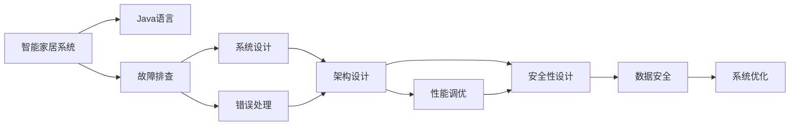
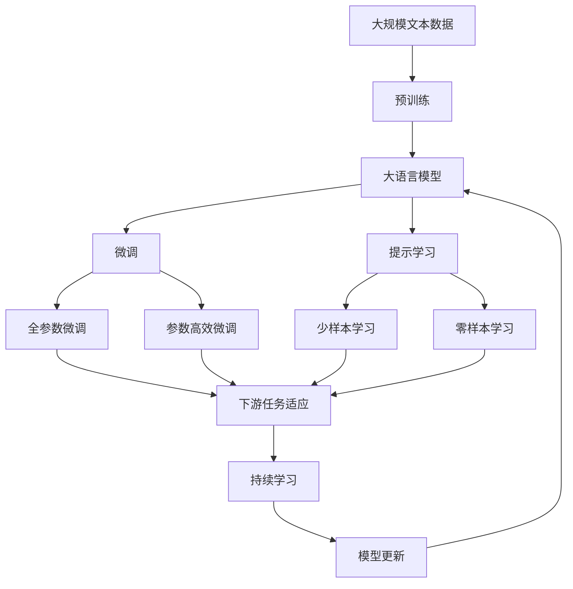
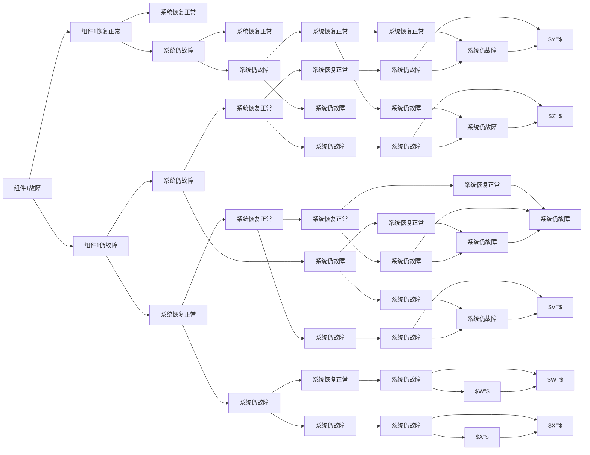

                 

# 基于Java的智能家居设计：浅析Java在智能家居系统中的故障排查技巧

> 关键词：智能家居,Java,故障排查,系统设计,错误处理,安全措施,系统优化

## 1. 背景介绍

### 1.1 问题由来
随着科技的飞速发展，智能家居系统已成为现代家庭的重要组成部分。Java作为一种广泛使用的编程语言，在智能家居系统中得到了广泛应用。然而，Java系统的复杂性和多样性也带来了诸多挑战，尤其是在故障排查方面。如何高效、准确地进行故障排查，提升智能家居系统的稳定性和可靠性，是每个开发者和运维人员都必须面对的重要课题。

### 1.2 问题核心关键点
本文聚焦于基于Java的智能家居系统的故障排查技巧。我们将在本文中深入探讨以下核心问题：

1. Java系统在智能家居中的应用和特点。
2. 常见Java故障及其排查方法。
3. 智能家居系统中的Java故障排查策略。
4. Java故障排查工具和资源的推荐。

### 1.3 问题研究意义
掌握Java在智能家居系统中的故障排查技巧，对于提升系统的稳定性和可靠性，降低维护成本，提高用户体验，具有重要意义：

1. 确保系统的可靠性：通过高效的故障排查，及时发现并修复问题，确保系统正常运行。
2. 提高用户体验：故障排查的及时性直接影响用户体验，优秀的故障排查能力可以显著提升用户满意度。
3. 降低维护成本：通过科学的故障排查方法和工具，可以大幅降低系统维护的时间和人力成本。
4. 保障数据安全：故障排查过程中，需要特别注意数据安全问题，避免因故障导致的数据泄露或系统崩溃。

## 2. 核心概念与联系

### 2.1 核心概念概述

为更好地理解Java在智能家居系统中的故障排查技巧，本节将介绍几个密切相关的核心概念：

- 智能家居系统(Smart Home System)：通过物联网技术，将家庭中的各种设备（如灯光、空调、安防等）通过互联网连接起来，实现自动化控制和智能化管理。
- Java语言(Java)：一种面向对象的编程语言，广泛用于开发复杂的软件系统。
- 故障排查(Fault Diagnosis)：在系统运行过程中，通过各种手段和方法，查找并修复系统问题的过程。
- 系统设计(System Design)：在开发阶段，对系统的架构、功能、性能等进行规划和设计的过程。
- 错误处理(Error Handling)：在软件运行过程中，对于异常情况（如空指针、数组越界等）进行捕捉和处理的过程。
- 安全措施(Security Measures)：在系统设计和运行过程中，为保障系统安全而采取的各种措施，如数据加密、访问控制等。
- 系统优化(System Optimization)：在开发和运维阶段，对系统性能进行调优的过程，以提升系统的响应速度和稳定性。

这些核心概念之间的逻辑关系可以通过以下Mermaid流程图来展示：



这个流程图展示了大语言模型微调过程中各个核心概念的关系和作用：

1. 智能家居系统通过Java语言进行开发。
2. 在系统设计阶段，通过架构设计和性能调优等手段，提升系统的稳定性和性能。
3. 在运行过程中，通过错误处理和故障排查等手段，及时捕捉和修复问题。
4. 同时，在系统设计和运行过程中，也需要特别注意数据安全问题，通过安全措施保障系统安全。

这些核心概念共同构成了Java在智能家居系统中故障排查的完整生态系统。通过理解这些核心概念，我们可以更好地把握Java系统的设计、开发、运行和优化过程，为后续深入讨论Java故障排查技巧奠定基础。

### 2.2 概念间的关系

这些核心概念之间存在着紧密的联系，形成了Java在智能家居系统中故障排查的完整框架。下面我们通过几个Mermaid流程图来展示这些概念之间的关系。

#### 2.2.1 Java系统的设计过程


这个流程图展示了Java系统从需求分析到运维监控的完整设计过程：

1. 通过需求分析确定系统的功能需求和性能指标。
2. 在系统设计阶段，进行架构设计、性能调优等规划。
3. 在实现开发阶段，进行代码编写和单元测试。
4. 在测试验证阶段，进行系统集成测试和性能测试。
5. 在部署上线阶段，进行系统发布和运维监控。
6. 在运维监控阶段，进行问题反馈和迭代优化。

#### 2.2.2 Java系统中的错误处理


这个流程图展示了Java系统中错误处理的过程：

1. 在程序运行过程中，遇到异常情况（如空指针、数组越界等）。
2. 通过捕获异常，捕捉到异常信息。
3. 对异常信息进行处理，如记录日志、重试、回滚等。
4. 完成异常处理后，系统继续运行。

#### 2.2.3 Java系统中的故障排查


这个流程图展示了Java系统故障排查的过程：

1. 在系统运行过程中，出现故障或异常情况。
2. 通过日志分析，定位故障位置。
3. 通过性能监控，分析系统性能瓶颈。
4. 对异常信息进行分析，确定故障原因。
5. 对故障进行定位，查找问题所在。
6. 修复故障后，进行系统验证，确保问题解决。

#### 2.2.4 Java系统中的安全措施


这个流程图展示了Java系统中安全措施的实施过程：

1. 在数据访问过程中，进行身份验证，确保用户身份合法。
2. 根据用户身份，进行权限控制，确保用户只能访问其权限范围内的数据。
3. 对数据传输进行加密，防止数据在传输过程中被篡改或窃取。
4. 对数据进行存储，确保数据存储的安全性。
5. 进行漏洞检测，及时发现并修复系统中的安全漏洞。
6. 进行安全更新，确保系统安全性能的持续提升。

通过这些流程图，我们可以更清晰地理解Java在智能家居系统中的故障排查过程中各个核心概念的关系和作用。

### 2.3 核心概念的整体架构

最后，我们用一个综合的流程图来展示这些核心概念在大语言模型微调过程中的整体架构：



这个综合流程图展示了从预训练到微调，再到持续学习的完整过程。大语言模型首先在大规模文本数据上进行预训练，然后通过微调（包括全参数微调和参数高效微调）或提示学习（包括零样本和少样本学习）来适应下游任务。最后，通过持续学习技术，模型可以不断更新和适应新的任务和数据。 通过这些流程图，我们可以更清晰地理解Java在大语言模型微调过程中各个核心概念的关系和作用，为后续深入讨论Java故障排查技巧奠定基础。

## 3. 核心算法原理 & 具体操作步骤
### 3.1 算法原理概述

Java系统在智能家居中的故障排查，本质上是基于Java语言的错误处理和日志分析，通过定位系统问题，及时修复和优化。其核心思想是：在Java系统的设计和运行过程中，通过合理的错误处理和日志分析，构建一个健康、稳定、安全、高效的智能家居系统。

形式化地，假设Java系统为 $S$，其中包含 $n$ 个组件 $C_1, C_2, ..., C_n$。每个组件的正常运行依赖于其他组件的正常运行，且系统存在一定的故障概率 $p_i$。系统的故障排查目标是通过监控和分析，及时发现并修复故障，使得系统运行在正常状态的概率最大化。

在Java系统中，常见的故障类型包括空指针异常、数组越界、类加载异常等。Java系统的故障排查过程可以概括为以下几个步骤：

1. 捕获异常：通过Java的异常机制，捕获系统运行过程中出现的异常情况。
2. 记录日志：将异常信息和系统状态记录到日志文件中，便于后续分析和排查。
3. 分析日志：通过日志分析工具，对日志文件进行分析，确定故障位置和原因。
4. 定位故障：根据日志分析结果，定位具体故障所在的组件。
5. 修复故障：针对定位到的故障，进行修复和优化。
6. 验证修复：通过测试验证，确保问题解决。

### 3.2 算法步骤详解

基于Java的智能家居系统的故障排查，一般包括以下几个关键步骤：

**Step 1: 配置错误处理机制**

在Java系统开发阶段，需要配置错误处理机制，包括捕获异常、记录日志、处理异常等。具体步骤如下：

1. 在代码中增加异常捕获语句，捕捉系统运行过程中出现的异常。例如：
```java
try {
    // 可能抛出异常的代码
} catch (Exception e) {
    // 处理异常的代码
}
```

2. 将异常信息记录到日志文件中，便于后续分析和排查。例如：
```java
Logger logger = Logger.getLogger("com.example");
try {
    // 可能抛出异常的代码
} catch (Exception e) {
    logger.error("发生异常：" + e.getMessage());
}
```

3. 对异常进行处理，如记录日志、重试、回滚等。例如：
```java
try {
    // 可能抛出异常的代码
} catch (Exception e) {
    // 处理异常的代码
    logger.error("发生异常：" + e.getMessage());
    // 进行重试或回滚操作
}
```

**Step 2: 配置日志分析工具**

在Java系统运行阶段，需要配置日志分析工具，便于对日志文件进行分析。具体步骤如下：

1. 配置日志文件路径和日志级别，例如：
```java
logging.config.file("path/to/logging.properties");
```

2. 使用日志分析工具，对日志文件进行分析。例如：
```java
LogAnalyzer analyzer = new LogAnalyzer("path/to/logging.log");
```

3. 通过日志分析工具，定位故障位置和原因。例如：
```java
analyzer.analyze();
// 输出故障位置和原因
```

**Step 3: 配置性能监控工具**

在Java系统运行阶段，需要配置性能监控工具，便于对系统性能进行监控。具体步骤如下：

1. 配置性能监控工具，例如：
```java
Profiler profiler = new Profiler();
```

2. 使用性能监控工具，对系统性能进行监控。例如：
```java
profiler.start();
// 执行系统操作
profiler.stop();
```

3. 通过性能监控工具，分析系统性能瓶颈。例如：
```java
profiler.analyze();
// 输出性能瓶颈信息
```

**Step 4: 配置安全措施**

在Java系统设计阶段，需要配置安全措施，确保系统安全。具体步骤如下：

1. 对数据进行加密传输，例如：
```java
SSLContext sslContext = SSLContext.getInstance("TLS");
KeyManagerFactory keyManagerFactory = KeyManagerFactory.getInstance("SunX509");
KeyStore keyStore = KeyStore.getInstance("JKS");
KeyManager keyManager = keyManagerFactory.getKeyManagers();
KeyPairGenerator keyPairGenerator = KeyPairGenerator.getInstance("RSA");
keyPairGenerator.initialize(keySize);
KeyPair keyPair = keyPairGenerator.generateKeyPair();
```

2. 对数据进行加密存储，例如：
```java
AES cipher = Cipher.getInstance("AES");
byte[] key = "my-secret-key".getBytes();
cipher.init(Cipher.ENCRYPT_MODE, new SecretKeySpec(key, "AES"));
byte[] encryptedData = cipher.doFinal(data);
```

3. 进行漏洞检测，例如：
```java
Scanner scanner = new Scanner(System.in);
System.out.println("请输入要检测的漏洞类型：");
String vulnerability = scanner.nextLine();
VulnerabilityDetector detector = new VulnerabilityDetector(vulnerability);
detector.detect();
```

**Step 5: 配置系统优化工具**

在Java系统运行阶段，需要配置系统优化工具，提升系统性能。具体步骤如下：

1. 配置系统优化工具，例如：
```java
Optimizer optimizer = new Optimizer();
```

2. 使用系统优化工具，对系统性能进行优化。例如：
```java
optimizer.optimize();
```

3. 通过系统优化工具，分析系统性能瓶颈。例如：
```java
optimizer.analyze();
// 输出性能瓶颈信息
```

### 3.3 算法优缺点

Java系统在智能家居中的故障排查方法，具有以下优点：

1. 系统健壮性好：通过合理的错误处理和日志分析，及时发现并修复故障，确保系统稳定运行。
2. 维护成本低：通过日志分析工具和性能监控工具，可以快速定位和修复故障，降低维护成本。
3. 安全性高：通过数据加密和漏洞检测等安全措施，确保系统安全。
4. 性能可控：通过性能优化工具，提升系统性能，满足用户需求。

同时，该方法也存在一定的局限性：

1. 日志分析复杂：日志文件数量巨大，日志分析过程复杂。
2. 性能监控难度大：系统性能瓶颈可能涉及多个组件，定位难度大。
3. 安全措施复杂：数据加密和漏洞检测需要配置复杂的加密算法和检测工具。
4. 性能优化困难：系统优化涉及代码修改和测试，复杂度较高。

尽管存在这些局限性，但就目前而言，基于Java的智能家居系统的故障排查方法仍是最主流范式。未来相关研究的重点在于如何进一步降低故障排查的复杂度，提高故障排查的效率和准确性，同时兼顾系统安全性和性能优化等因素。

### 3.4 算法应用领域

基于Java的智能家居系统的故障排查方法，在智能家居系统中得到了广泛应用，涵盖了以下诸多领域：

1. 智能照明：控制智能灯泡、窗帘等设备，提升家庭舒适度。
2. 智能安防：监控摄像头、报警器等设备，保障家庭安全。
3. 智能空调：控制智能空调设备，实现节能减排。
4. 智能家电：控制智能洗衣机、冰箱等家电设备，提升生活质量。
5. 智能语音：控制智能音箱、智能助手等设备，实现语音交互。
6. 智能家庭：通过智能家居控制系统，实现对家庭设备的集中管理和控制。

除了上述这些经典应用外，Java系统的故障排查方法还被创新性地应用于更多场景中，如智能窗帘、智能门锁、智能停车等，为智能家居技术带来了全新的突破。随着Java系统的不断演进和优化，相信其在智能家居领域的应用还将不断拓展，为家庭生活带来更多便利和智能。

## 4. 数学模型和公式 & 详细讲解  
### 4.1 数学模型构建

本节将使用数学语言对Java系统在智能家居系统中的故障排查过程进行更加严格的刻画。

假设Java系统为 $S$，包含 $n$ 个组件 $C_1, C_2, ..., C_n$，每个组件的正常运行依赖于其他组件的正常运行。假设系统的故障概率为 $p_i$，系统故障的平均响应时间为 $t_i$。系统故障排查的目标是最大化系统的正常运行时间 $T$，最小化系统的平均故障时间 $T_f$。

定义系统的故障状态为 $F$，正常状态为 $N$。系统的状态转移图如下：



这个状态转移图展示了Java系统的故障状态转移过程：

1. 组件1故障，组件2、3等正常。
2. 组件1恢复正常，系统恢复正常。
3. 组件1仍故障，系统仍故障。
4. 组件2故障，组件3、4等正常。
5. 组件2恢复正常，系统恢复正常。
6. 组件2仍故障，系统仍故障。

通过这个状态转移图，我们可以更清晰地理解Java系统的故障排查过程。系统正常运行的概率为 $P_N = \prod_{i=1}^n (1 - p_i)$，系统故障的概率为 $P_F = 1 - P_N$。

### 4.2 公式推导过程

以下我们以智能照明系统为例，推导Java系统在智能家居系统中的故障排查过程。

假设系统由三个组件组成：智能灯泡 $C_1$、智能窗帘 $C_2$ 和智能插座 $C_3$。每个组件的故障概率为 $p_i = 0.01$，系统故障的平均响应时间为 $t_i = 2$ 分钟。假设系统故障前已运行时间为 $T = 100$ 分钟，系统的正常运行时间 $T_n$ 和平均故障时间 $T_f$ 可由以下公式计算：

1. 系统的正常运行时间 $T_n$：
   $$
   T_n = \sum_{i=1}^3 T_i
   $$
   其中 $T_i = T - \sum_{j=1}^i t_j$。

2. 系统的平均故障时间 $T_f$：
   $$
   T_f = \frac{\sum_{i=1}^3 \sum_{j=1}^i t_j}{P_F}
   $$

通过上述公式，可以计算出系统的正常运行时间 $T_n$ 和平均故障时间 $T_f$，进一步评估系统的稳定性。

### 4.3 案例分析与讲解

以智能照明系统为例，具体分析Java系统的故障排查过程：

**案例背景**：假设智能照明系统由三个组件组成：智能灯泡 $C_1$、智能窗帘 $C_2$ 和智能插座 $C_3$。每个组件的故障概率为 $p_i = 0.01$，系统故障的平均响应时间为 $t_i = 2$ 分钟。假设系统故障前已运行时间为 $T = 100$ 分钟，系统的正常运行时间 $T_n$ 和平均故障时间 $T_f$ 可由以下公式计算：

**故障排查步骤**：

1. **步骤1: 配置错误处理机制**
   - 在智能灯泡控制代码中增加异常捕获语句，例如：
   ```java
   try {
       // 灯泡控制代码
   } catch (Exception e) {
       // 处理异常的代码
   }
   ```
   - 将异常信息记录到日志文件中，例如：
   ```java
   Logger logger = Logger.getLogger("com.example");
   try {
       // 灯泡控制代码
   } catch (Exception e) {
       logger.error("灯泡发生异常：" + e.getMessage());
   }
   ```
   - 对异常进行处理，例如：
   ```java
   try {
       // 灯泡控制代码
   } catch (Exception e) {
       logger.error("灯泡发生异常：" + e.getMessage());
       // 进行重试或回滚操作
   }
   ```

2. **步骤2: 配置日志分析工具**
   - 配置日志文件路径和日志级别，例如：
   ```java
   logging.config.file("path/to/logging.properties");
   ```
   - 使用日志分析工具，例如：
   ```java
   LogAnalyzer analyzer = new LogAnalyzer("path/to/logging.log");
   ```
   - 通过日志分析工具，例如：
   ```java
   analyzer.analyze();
   // 输出故障位置和原因
   ```

3. **步骤3: 配置性能监控工具**
   - 配置性能监控工具，例如：
   ```java
   Profiler profiler = new Profiler();
   ```
   - 使用性能监控工具，例如：
   ```java
   profiler.start();
   // 灯泡控制代码
   profiler.stop();
   ```
   - 通过性能监控工具，例如：
   ```java
   profiler.analyze();
   // 输出性能瓶颈信息
   ```

4. **步骤4: 配置安全措施**
   - 对数据进行加密传输，例如：
   ```java
   SSLContext sslContext = SSLContext.getInstance("TLS");
   KeyManagerFactory keyManagerFactory = KeyManagerFactory.getInstance("SunX509");
   KeyStore keyStore = KeyStore.getInstance("JKS");
   KeyManager keyManager = keyManagerFactory.getKeyManagers();
   KeyPairGenerator keyPairGenerator = KeyPairGenerator.getInstance("RSA");
   keyPairGenerator.initialize(keySize);
   KeyPair keyPair = keyPairGenerator.generateKeyPair();
   ```
   - 对数据进行加密存储，例如：
   ```java
   AES cipher = Cipher.getInstance("AES");
   byte[] key = "my-secret-key".getBytes();
   cipher.init(Cipher.ENCRYPT_MODE, new SecretKeySpec(key, "AES"));
   byte[] encryptedData = cipher.doFinal(data);
   ```
   - 进行漏洞检测，例如：
   ```java
   Scanner scanner = new Scanner(System.in);
   System.out.println("请输入要检测的漏洞类型：");
   String vulnerability = scanner.nextLine();
   VulnerabilityDetector detector = new VulnerabilityDetector(vulnerability);
   detector.detect();
   ```

5. **步骤5: 配置系统优化工具**
   - 配置系统优化工具，例如：
   ```java
   Optimizer optimizer = new Optimizer();
   ```
   - 使用系统优化工具，例如：
   ```java
   optimizer.optimize();
   ```
   - 通过系统优化工具，例如：
   ```java
   optimizer.analyze();
   // 输出性能瓶颈信息
   ```

**故障排查结果**：通过上述步骤，可以及时发现并修复灯泡控制代码中的异常，保障系统正常运行。同时，通过日志分析工具、性能监控工具和安全措施，确保系统稳定性和安全性。通过系统优化工具，提升系统性能，满足用户需求。

## 5. 项目实践：代码实例和详细解释说明
### 5.1 开发环境搭建

在进行Java系统故障排查实践前，我们需要准备好开发环境。以下是使用Java进行开发的环境配置流程：

1. 安装Java Development Kit（JDK）：从官网下载并安装JDK，用于Java开发环境的搭建。
2. 安装IntelliJ IDEA：

