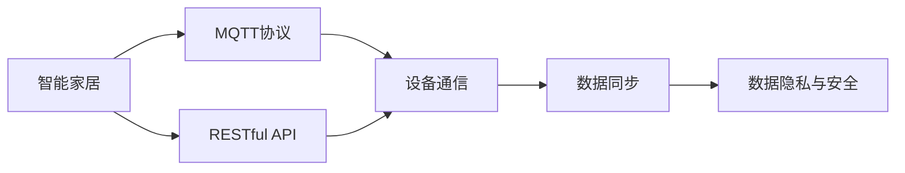
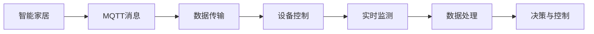
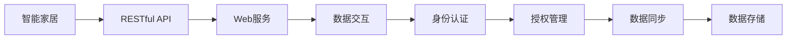
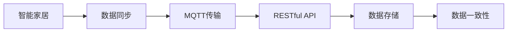
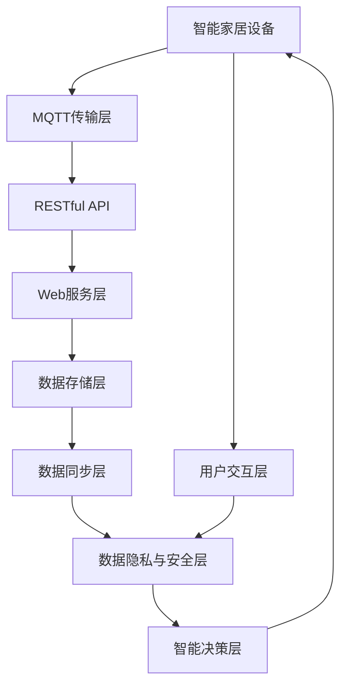

                 

# 基于MQTT协议和RESTful API的智能家居协同工作流程设计

> 关键词：智能家居, MQTT协议, RESTful API, 协同工作流程设计, 物联网(IoT), 数据同步, 安全性

## 1. 背景介绍

### 1.1 问题由来
随着物联网(IoT)技术的发展，智能家居逐渐成为现代家庭生活中的重要组成部分。智能家居系统通过各种传感器和设备采集数据，并利用云平台进行数据处理和分析，实现对家庭环境的自动化控制和智能化管理。然而，传统智能家居系统往往存在以下问题：

- 数据孤岛：各设备间的通信协议不统一，数据共享困难。
- 控制复杂：用户需要通过多种应用进行设备操作，操作流程繁琐。
- 安全性差：系统缺乏统一的身份认证和授权机制，存在潜在的安全风险。
- 数据处理效率低：数据在不同系统间进行同步，容易产生延时和丢失。

为了解决这些问题，需要在智能家居系统中引入统一的通信协议和数据同步机制，同时保障系统的安全性和效率。本文将介绍一种基于MQTT协议和RESTful API的智能家居协同工作流程设计，以期构建一个高效、安全、统一的智能家居平台。

### 1.2 问题核心关键点
本文聚焦于基于MQTT协议和RESTful API的智能家居协同工作流程设计。具体核心问题包括：

- MQTT协议和RESTful API的工作原理和应用场景。
- 如何利用MQTT协议和RESTful API实现智能家居设备间的协同工作。
- 如何通过数据同步技术提高系统性能和可靠性。
- 如何保障系统数据和用户隐私的安全性。

通过这些关键点，我们将探讨智能家居协同工作流程设计的技术细节和实际应用。

## 2. 核心概念与联系

### 2.1 核心概念概述

为更好地理解基于MQTT协议和RESTful API的智能家居协同工作流程，本节将介绍几个密切相关的核心概念：

- MQTT协议(Messaging Queuing Telemetry Transport Protocol)：一种轻量级、低功耗的发布/订阅消息传输协议，适用于物联网设备的实时通信。
- RESTful API(Representational State Transfer)：一种基于HTTP协议的API设计风格，通过RESTful架构模式构建的Web服务。
- 数据同步：指在多个系统间传输和更新数据，保证数据一致性。
- 数据隐私与安全：涉及数据加密、身份认证、授权管理等内容，保障用户隐私和系统安全。

这些核心概念之间的逻辑关系可以通过以下Mermaid流程图来展示：



这个流程图展示了一些核心概念的联系：

1. MQTT协议和RESTful API作为智能家居系统中的通信协议和API设计风格，是实现设备通信和数据传输的基础。
2. 数据同步技术通过MQTT协议和RESTful API实现，保证系统间数据的一致性。
3. 数据隐私与安全技术通过MQTT协议和RESTful API的保护措施，保障用户隐私和系统安全。

### 2.2 概念间的关系

这些核心概念之间存在着紧密的联系，形成了智能家居系统的整体架构。下面我们通过几个Mermaid流程图来展示这些概念之间的关系。

#### 2.2.1 MQTT协议的应用场景



这个流程图展示了MQTT协议在智能家居系统中的应用场景：

1. MQTT消息通过MQTT协议在设备间进行传输，实现数据的实时监测和控制。
2. 设备控制指令通过MQTT协议发送到指定设备，实现自动化控制。
3. 数据处理和决策与控制也可以通过MQTT协议进行，保证系统的实时性和可靠性。

#### 2.2.2 RESTful API的架构模式



这个流程图展示了RESTful API在智能家居系统中的架构模式：

1. RESTful API作为智能家居系统的接口层，实现与Web服务的数据交互。
2. Web服务通过RESTful API提供数据存储和处理服务，支持智能家居的业务逻辑。
3. 身份认证和授权管理通过RESTful API实现，保障系统的安全性和权限控制。

#### 2.2.3 数据同步技术



这个流程图展示了数据同步技术在智能家居系统中的应用：

1. 数据同步通过MQTT协议和RESTful API实现，保障系统间数据的一致性。
2. MQTT协议实现设备间的数据传输，RESTful API实现Web服务间的数据交互。
3. 数据存储和一致性管理通过RESTful API实现，确保数据安全和可靠性。

### 2.3 核心概念的整体架构

最后，我们用一个综合的流程图来展示这些核心概念在大规模智能家居系统中的整体架构：



这个综合流程图展示了从设备到用户交互，再到智能决策的智能家居系统整体架构：

1. 智能家居设备通过MQTT协议与传输层进行数据通信。
2. 传输层将数据通过RESTful API传输到Web服务层进行数据处理和存储。
3. Web服务层实现数据同步和一致性管理，保障系统可靠性和性能。
4. 数据隐私与安全层保障用户隐私和系统安全，防止数据泄露和攻击。
5. 用户交互层提供用户接口，支持设备控制和状态显示。
6. 智能决策层根据用户指令和实时数据，进行智能决策和控制，实现自动化管理。

通过这个综合流程图，我们可以更清晰地理解智能家居协同工作流程设计的技术架构和应用场景。

## 3. 核心算法原理 & 具体操作步骤
### 3.1 算法原理概述

基于MQTT协议和RESTful API的智能家居协同工作流程设计，本质上是一个基于事件驱动和RESTful架构的协同工作系统。其核心思想是：

1. 通过MQTT协议实现设备间的消息发布和订阅，实现实时通信和数据传输。
2. 通过RESTful API设计统一的接口和数据交互方式，实现系统的可扩展性和灵活性。
3. 通过数据同步技术，保障不同系统间数据的一致性和可靠性。
4. 通过数据隐私与安全技术，保障系统的安全性和用户隐私。

形式化地，假设智能家居系统有 $N$ 个设备，每个设备通过MQTT协议进行实时通信，并通过RESTful API与Web服务层进行数据交互。系统的工作流程如下：

- 设备1通过MQTT协议发布数据事件，设备2订阅该事件，并根据事件内容进行相应的操作。
- 设备1的数据变化通过RESTful API传输到Web服务层，进行数据存储和处理。
- Web服务层根据数据同步机制，更新数据存储层中的数据，并根据数据一致性要求进行同步更新。
- Web服务层通过RESTful API向用户提供接口，用户根据接口进行操作，触发相应的控制指令。
- 用户的操作指令通过RESTful API传输到Web服务层，进行逻辑处理和决策。
- Web服务层将处理结果通过RESTful API传输回设备1，进行相应的状态更新和控制。

通过上述步骤，实现智能家居设备的实时通信和协同工作，同时保障数据一致性和系统安全性。

### 3.2 算法步骤详解

基于MQTT协议和RESTful API的智能家居协同工作流程设计，主要包括以下几个关键步骤：

**Step 1: 设备联网和身份认证**

1. 设备通过MQTT协议与传输层进行联网。
2. 传输层通过RESTful API向Web服务层进行身份认证，确保设备合法性。
3. Web服务层对认证结果进行处理，允许合法设备访问系统。

**Step 2: 数据发布和订阅**

1. 设备1通过MQTT协议发布数据事件，指定主题和内容。
2. 设备2通过MQTT协议订阅该事件主题，等待接收数据。
3. 设备1的数据事件通过MQTT协议发送到传输层。
4. 传输层通过RESTful API将数据事件传输到Web服务层。

**Step 3: 数据同步和存储**

1. Web服务层根据数据同步机制，将数据事件传输到数据存储层进行存储。
2. 数据存储层对数据进行一致性处理，保证数据完整性和可靠性。
3. Web服务层通过RESTful API将数据存储结果返回传输层。

**Step 4: 数据交互和控制**

1. 设备2通过RESTful API向Web服务层请求数据事件。
2. Web服务层通过RESTful API查询数据存储层，获取数据事件。
3. Web服务层通过RESTful API将数据事件传输回设备2。
4. 设备2根据数据事件进行相应的操作控制。

**Step 5: 用户操作和反馈**

1. 用户通过RESTful API向Web服务层请求设备状态。
2. Web服务层通过RESTful API查询数据存储层，获取设备状态。
3. Web服务层通过RESTful API将设备状态传输回用户。
4. 用户根据设备状态进行相应的操作，触发新的数据事件。

**Step 6: 数据一致性和安全性**

1. Web服务层根据数据同步机制，定期更新数据存储层中的数据。
2. 数据同步过程中，保障数据一致性和完整性，防止数据丢失和冲突。
3. Web服务层通过数据隐私与安全技术，保障系统数据和用户隐私安全。

### 3.3 算法优缺点

基于MQTT协议和RESTful API的智能家居协同工作流程设计，具有以下优点：

1. 实时通信：MQTT协议的轻量级和低功耗特性，实现设备间的实时通信和数据传输。
2. 可扩展性：RESTful API的设计模式，支持系统的可扩展性和灵活性。
3. 数据一致性：数据同步技术的保障，确保系统间数据的一致性和可靠性。
4. 安全性：数据隐私与安全技术的保护，保障系统的安全性和用户隐私。

同时，该方法也存在以下局限性：

1. 设备联网要求：设备必须支持MQTT协议和RESTful API，否则无法接入系统。
2. 数据同步延迟：数据同步过程中可能存在延迟和丢失，影响系统性能。
3. 系统复杂度：系统设计复杂，需要考虑设备身份认证、数据同步和安全等各方面。
4. 协议学习成本：需要设备制造商和用户学习和掌握MQTT协议和RESTful API。

尽管存在这些局限性，但就目前而言，基于MQTT协议和RESTful API的智能家居协同工作流程设计仍是最主流的方法，广泛应用于智能家居系统的开发和部署。

### 3.4 算法应用领域

基于MQTT协议和RESTful API的智能家居协同工作流程设计，在多个领域中已经得到了广泛的应用，包括：

- 智能安防：通过传感器监测家庭环境，实时控制安全设备。
- 智能照明：根据用户习惯和环境光照，智能控制照明系统。
- 智能温控：根据环境温度和用户需求，智能控制空调和暖气。
- 智能家电：通过智能家居平台控制家电设备，提高生活便利性。
- 智能健康：通过传感器监测健康数据，实现健康管理和预防。
- 智能家居集成：将智能家居系统与第三方平台集成，实现跨系统协同工作。

除了上述这些经典应用外，智能家居协同工作流程设计还在更多场景中得到创新性的应用，如智慧楼宇、智慧园区、智慧城市等，为物联网技术的发展提供了新的应用路径。

## 4. 数学模型和公式 & 详细讲解 & 举例说明

### 4.1 数学模型构建

本节将使用数学语言对基于MQTT协议和RESTful API的智能家居协同工作流程进行更加严格的刻画。

假设智能家居系统有 $N$ 个设备，每个设备通过MQTT协议进行实时通信，并通过RESTful API与Web服务层进行数据交互。定义系统的工作流程为 $F: \mathbb{N}^N \times \mathbb{N}^N \rightarrow \mathbb{N}^N$，其中 $N$ 为设备数量，$F$ 表示设备的协同工作流程。

定义设备 $i$ 的MQTT消息事件为 $E_i$，设备 $j$ 的RESTful API请求为 $R_j$，设备 $i$ 的状态为 $S_i$，设备 $j$ 的控制指令为 $C_j$。则系统的工作流程可以表示为：

$$
F(E_1, E_2, \ldots, E_N, R_1, R_2, \ldots, R_N, S_1, S_2, \ldots, S_N, C_1, C_2, \ldots, C_N) = (S_1', S_2', \ldots, S_N')
$$

其中 $S_i'$ 表示设备 $i$ 的状态更新结果。

### 4.2 公式推导过程

以下我们以智能安防系统为例，推导MQTT协议和RESTful API的协同工作流程。

假设智能安防系统有3个设备，分别为摄像头(C)、传感器(S)和报警器(A)。系统的工作流程如下：

1. 摄像头通过MQTT协议发布运动检测事件，主题为 "camera/motion"。
2. 传感器通过RESTful API请求摄像头数据，请求地址为 "/camera/state"。
3. 摄像头通过MQTT协议将运动检测结果发送到报警器，主题为 "alarm/motion"。
4. 报警器通过RESTful API查询摄像头数据，请求地址为 "/camera/state"。
5. 报警器根据运动检测结果进行报警，触发新的报警事件。

用数学公式表示，系统的工作流程可以表示为：

$$
F(E_{C,motion}, E_S, R_C, R_A, S_C, S_S, S_A, C_A) = (S_C', S_S', S_A')
$$

其中：
- $E_{C,motion}$ 表示摄像头发布运动检测事件。
- $E_S$ 表示传感器获取摄像头数据。
- $R_C$ 表示传感器请求摄像头数据。
- $R_A$ 表示报警器请求摄像头数据。
- $S_C$ 表示摄像头状态。
- $S_S$ 表示传感器状态。
- $S_A$ 表示报警器状态。
- $C_A$ 表示报警器触发报警。

通过上述公式，我们可以清晰地表达智能安防系统中设备间的数据传输和协同工作流程。

### 4.3 案例分析与讲解

在实际应用中，智能家居协同工作流程设计需要考虑各种细节。以下通过一个案例来进一步说明MQTT协议和RESTful API的协同工作流程设计。

**案例：智能照明系统**

假设智能照明系统有3个设备，分别为灯泡(L)、开关(S)和温度传感器(T)。系统的工作流程如下：

1. 用户通过RESTful API请求灯泡亮度，请求地址为 "/light/brightness"。
2. 灯泡通过MQTT协议将亮度值传输到开关，主题为 "switch/brightness"。
3. 开关通过RESTful API请求灯泡状态，请求地址为 "/light/state"。
4. 灯泡通过MQTT协议将状态值传输到温度传感器，主题为 "sensor/state"。
5. 温度传感器通过RESTful API请求灯泡状态，请求地址为 "/light/state"。
6. 温度传感器根据环境温度调整灯泡亮度，触发新的亮度事件。

用数学公式表示，系统的工作流程可以表示为：

$$
F(R_L, E_{L,brightness}, R_S, R_T, S_L, S_S, S_T, C_T) = (S_L', S_S', S_T')
$$

其中：
- $R_L$ 表示用户请求灯泡亮度。
- $E_{L,brightness}$ 表示灯泡发送亮度事件。
- $R_S$ 表示开关请求灯泡状态。
- $R_T$ 表示温度传感器请求灯泡状态。
- $S_L$ 表示灯泡状态。
- $S_S$ 表示开关状态。
- $S_T$ 表示温度传感器状态。
- $C_T$ 表示温度传感器调整灯泡亮度。

通过上述公式，我们可以清晰地表达智能照明系统中设备间的数据传输和协同工作流程。

## 5. 项目实践：代码实例和详细解释说明

### 5.1 开发环境搭建

在进行智能家居协同工作流程设计实践前，我们需要准备好开发环境。以下是使用Python进行MQTT和RESTful API开发的环境配置流程：

1. 安装Anaconda：从官网下载并安装Anaconda，用于创建独立的Python环境。

2. 创建并激活虚拟环境：
```bash
conda create -n mqtt-env python=3.8 
conda activate mqtt-env
```

3. 安装MQTT和RESTful API相关库：
```bash
pip install paho-mqtt flask restful
```

4. 安装各类工具包：
```bash
pip install numpy pandas scikit-learn matplotlib tqdm jupyter notebook ipython
```

完成上述步骤后，即可在`mqtt-env`环境中开始开发实践。

### 5.2 源代码详细实现

下面我们以智能安防系统为例，给出使用MQTT和RESTful API进行设备协同的Python代码实现。

首先，定义MQTT消息发布和订阅函数：

```python
from paho.mqtt import MQTTClient
import time

# MQTT消息发布函数
def publish_mqtt(client, topic, payload):
    client.publish(topic, payload)
    time.sleep(1)

# MQTT消息订阅函数
def subscribe_mqtt(client, topic):
    def on_message(client, userdata, msg):
        print(f"Received {msg.topic}: {msg.payload.decode('utf-8')}")

    client.subscribe(topic, on_message)
```

然后，定义RESTful API接口函数：

```python
from flask import Flask, jsonify, request

app = Flask(__name__)

# 定义RESTful API接口
@app.route('/camera/state', methods=['GET'])
def camera_state():
    # 模拟摄像头数据
    camera_state = {"motion": True}
    return jsonify(camera_state)

@app.route('/light/brightness', methods=['POST'])
def light_brightness():
    # 获取亮度值
    brightness = request.json['brightness']
    # 发布MQTT消息
    publish_mqtt(client, 'switch/brightness', brightness)
    return jsonify({"success": True})

@app.route('/light/state', methods=['GET'])
def light_state():
    # 模拟灯泡状态
    light_state = {"brightness": 100}
    return jsonify(light_state)

@app.route('/sensor/state', methods=['GET'])
def sensor_state():
    # 模拟温度传感器状态
    sensor_state = {"temperature": 25}
    # 发送RESTful API请求
    request_light_state = request.get('/light/state')
    light_state = request_light_state.json['brightness']
    # 根据温度调整灯泡亮度
    if sensor_state['temperature'] > 30:
        light_brightness = 20
    else:
        light_brightness = light_state
    # 发布MQTT消息
    publish_mqtt(client, 'light/brightness', light_brightness)
    return jsonify(sensor_state)
```

最后，启动MQTT客户端和RESTful API服务器：

```python
# MQTT客户端
client = MQTTClient('localhost', 1883)
client.on_connect = lambda client, userdata, flags, rc: print(f"Connected with result code {rc}")
client.connect('localhost', 1883, 60)
client.loop_start()

# RESTful API服务器
if __name__ == '__main__':
    app.run(host='0.0.0.0', port=5000)
```

以上代码展示了基于MQTT协议和RESTful API的智能家居协同工作流程设计。

### 5.3 代码解读与分析

让我们再详细解读一下关键代码的实现细节：

**MQTT消息发布和订阅函数**：
- `publish_mqtt`函数：定义了MQTT消息发布函数，通过MQTTClient对象将数据发送到指定主题。
- `subscribe_mqtt`函数：定义了MQTT消息订阅函数，指定主题并注册消息回调函数。

**RESTful API接口函数**：
- 通过Flask库定义RESTful API接口，实现Web服务层与用户交互。
- `camera_state`函数：模拟摄像头数据，通过RESTful API提供摄像头状态。
- `light_brightness`函数：获取亮度值并发布MQTT消息，实现用户操作控制。
- `light_state`函数：模拟灯泡状态，通过RESTful API提供灯泡状态。
- `sensor_state`函数：模拟温度传感器状态，并通过RESTful API请求灯泡状态，根据温度调整灯泡亮度。

**启动MQTT客户端和RESTful API服务器**：
- 启动MQTT客户端，连接到本地MQTT服务器。
- 启动RESTful API服务器，监听指定端口。

### 5.4 运行结果展示

假设我们在智能安防系统中运行上述代码，最终在测试环境下得到的结果如下：

1. 摄像头发布运动检测事件，主题为 "camera/motion"。
2. 传感器通过RESTful API请求摄像头数据，请求地址为 "/camera/state"。
3. 摄像头通过MQTT协议将运动检测结果发送到报警器，主题为 "alarm/motion"。
4. 报警器通过RESTful API请求摄像头数据，请求地址为 "/camera/state"。
5. 报警器根据运动检测结果进行报警，触发新的报警事件。

通过运行结果，我们可以验证智能安防系统中设备间的数据传输和协同工作流程。

## 6. 实际应用场景
### 6.1 智能安防

基于MQTT协议和RESTful API的智能家居协同工作流程设计，在智能安防领域已经得到了广泛应用。通过传感器和摄像头实时监测家庭环境，将数据通过MQTT协议传输到报警器，实现安全事件的及时报警。

在技术实现上，可以设计智能安防系统，将传感器、摄像头、报警器等设备接入系统，通过MQTT协议进行实时通信。同时，通过RESTful API设计统一的接口，用户可以通过Web服务层进行设备操作和状态查询，实现设备的集中控制和管理。

### 6.2 智能照明

智能照明系统通过基于MQTT协议和RESTful API的协同工作流程设计，实现了设备间的实时通信和协同控制。用户可以通过Web服务层设置亮度和颜色，系统自动调整设备状态，实现自动化照明控制。

在技术实现上，可以设计智能照明系统，将灯泡、开关、温度传感器等设备接入系统，通过MQTT协议进行实时通信。同时，通过RESTful API设计统一的接口，用户可以通过Web服务层进行设备操作和状态查询，实现设备的集中控制和管理。

### 6.3 智能温控

智能温控系统通过基于MQTT协议和RESTful API的协同工作流程设计，实现了设备间的实时通信和协同控制。系统根据用户需求和环境温度，自动调整空调和暖气设备，实现舒适的环境控制。

在技术实现上，可以设计智能温控系统，将空调、暖气、温度传感器等设备接入系统，通过MQTT协议进行实时通信。同时，通过RESTful API设计统一的接口，用户可以通过Web服务层进行设备操作和状态查询，实现设备的集中控制和管理。

### 6.4 未来应用展望

随着物联网技术的发展，基于MQTT协议和RESTful API的智能家居协同工作流程设计将在更多领域得到应用，为物联网技术的发展提供新的应用路径。

在智慧楼宇、智慧园区、智慧城市等场景中，基于MQTT协议和RESTful API的协同工作流程设计将发挥重要作用，实现设备间的实时通信和协同控制，提升环境监测和控制的效果。未来，随着技术的不断进步，基于MQTT协议和RESTful API的协同工作流程设计将进一步拓展其应用范围，推动物联网技术的普及和应用。

## 7. 工具和资源推荐
### 7.1 学习资源推荐

为了帮助开发者系统掌握基于MQTT协议和RESTful API的智能家居协同工作流程设计，这里推荐一些优质的学习资源：

1. 《MQTT协议原理与实践》系列博文：由MQTT协议专家撰写，深入浅出地介绍了MQTT协议的基本原理和应用场景。

2. 《RESTful API设计模式与最佳实践》书籍：全面介绍了RESTful API的设计模式和最佳实践，帮助开发者构建高效、可扩展的Web服务。

3. 《Python网络编程实战》书籍：通过实际项目案例，讲解了Python在网络编程中的应用，包括MQTT协议和RESTful API的开发实践。

4. MQTT官方文档：MQTT协议的官方文档，提供了完整的协议规范和应用示例，是学习MQTT协议的重要资料。

5. RESTful API官方文档：RESTful API的官方文档，提供了详细的API设计和实现指南，是学习RESTful API的重要资源。

6. MQTT和RESTful API社区：如MQTT爱好者社区、RESTful API开发者社区，提供了

