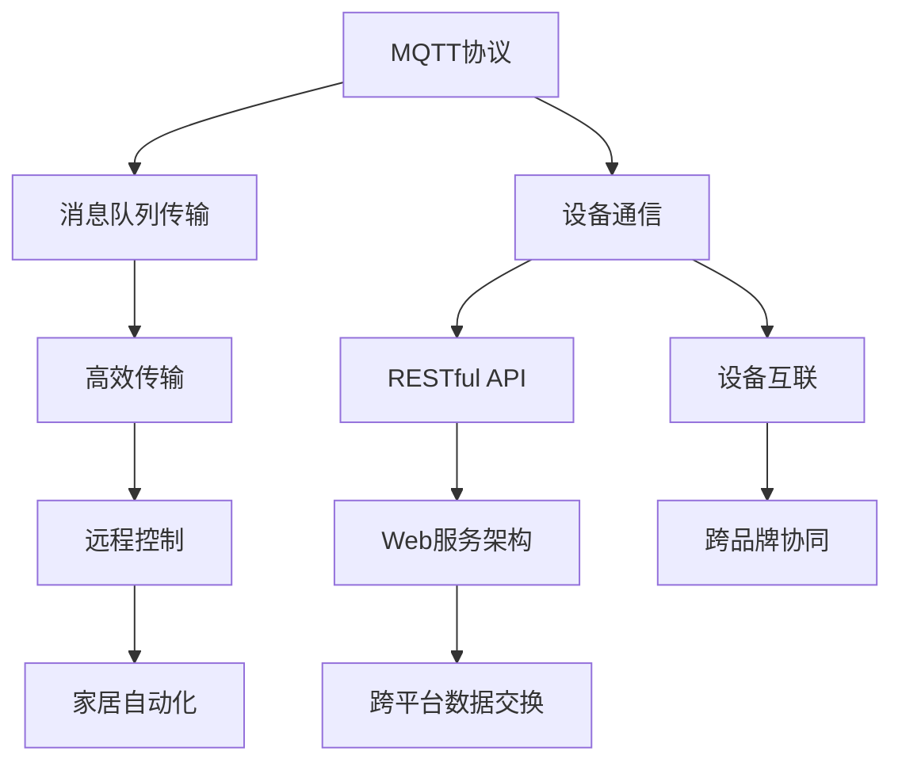
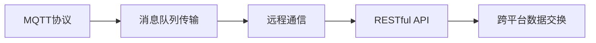
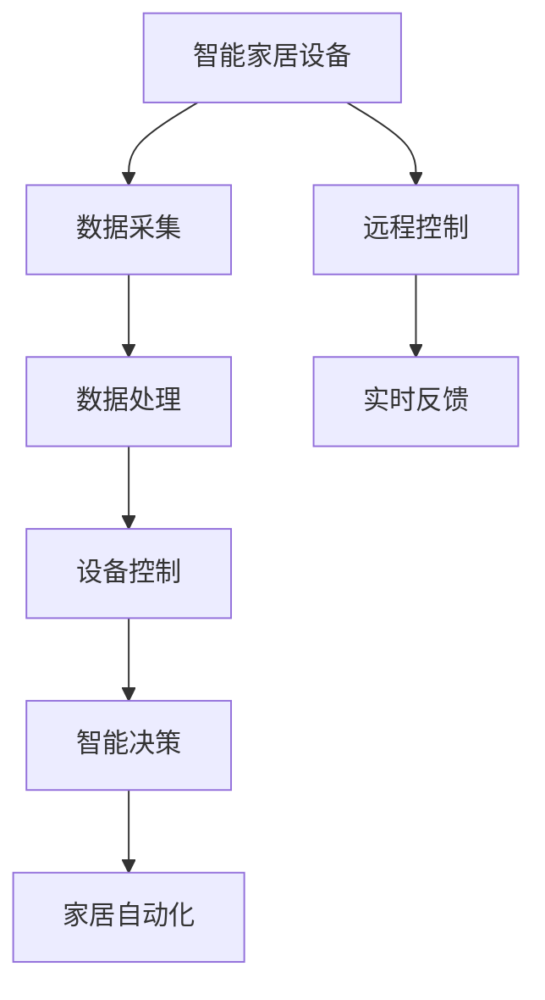
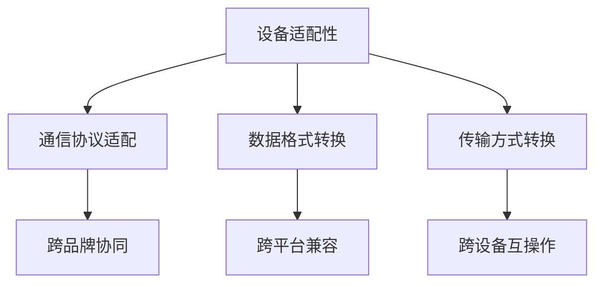
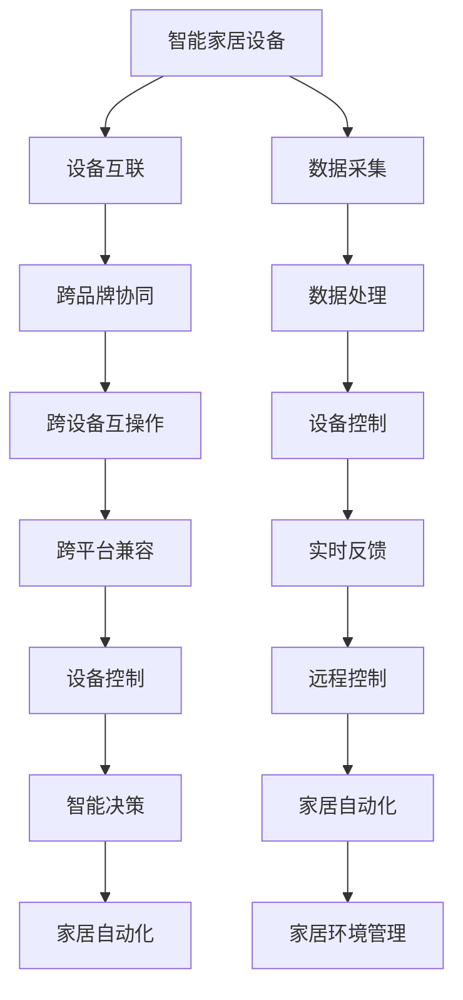

                 

# 基于MQTT协议和RESTful API的智能家居设备适配性分析

> 关键词：智能家居,设备适配性,MQTT协议,RESTful API,物联网,家居自动化

## 1. 背景介绍

### 1.1 问题由来
随着物联网技术的快速发展，智能家居设备已广泛应用于家庭生活中。这些设备包括智能灯泡、温控器、安防系统、家庭影院等，通过无线通信网络与家庭中心控制系统相连，实现了远程控制和自动化管理。然而，不同品牌和型号的设备在通信协议、数据格式等方面可能存在差异，导致设备间的互联互通困难。因此，研究智能家居设备的适配性，使其能够跨平台、跨品牌协同工作，对于提升家居自动化系统的整体性能具有重要意义。

### 1.2 问题核心关键点
在智能家居系统中，设备适配性问题主要体现在以下几个方面：

1. 通信协议：不同设备采用的通信协议可能不同，如MQTT、CoAP、HTTP等。
2. 数据格式：数据编码格式不同，如JSON、XML、二进制等。
3. 数据传输方式：不同设备的传输方式可能不同，如轮询、事件驱动等。
4. 设备兼容性：设备间的功能兼容性和互操作性问题。
5. 安全性：数据传输和设备接入的安全性问题。

### 1.3 问题研究意义
研究智能家居设备的适配性，能够帮助解决设备间互联互通难题，提升家居自动化系统的兼容性和可靠性，提高用户的使用体验。

## 2. 核心概念与联系

### 2.1 核心概念概述

为更好地理解基于MQTT协议和RESTful API的智能家居设备适配性，本节将介绍几个密切相关的核心概念：

- MQTT协议：一种轻量级、高效率的消息队列传输协议，适用于物联网设备的远程通信。
- RESTful API：一种基于HTTP协议的Web服务架构风格，通过定义标准的API接口，支持跨平台、跨语言的数据交换。
- 物联网设备：指各种能够连接到网络并实现数据交互的设备，包括传感器、执行器、通信模块等。
- 家居自动化：通过智能家居设备实现对家庭环境的自动化控制和管理，如智能温控、照明、安防等。
- 设备适配性：指不同设备在通信协议、数据格式等方面的兼容性问题。

这些核心概念之间的逻辑关系可以通过以下Mermaid流程图来展示：



这个流程图展示了大语言模型的核心概念及其之间的关系：

1. MQTT协议通过消息队列传输，支持设备间的高效通信。
2. RESTful API通过标准的API接口，实现跨平台的数据交换。
3. 物联网设备通过MQTT和RESTful API进行数据交互。
4. 家居自动化系统通过设备互联和跨品牌协同，实现环境控制和管理。
5. 设备适配性保证不同设备间能够顺利通信和数据交换。

### 2.2 概念间的关系

这些核心概念之间存在着紧密的联系，形成了智能家居设备适配性的完整生态系统。下面我通过几个Mermaid流程图来展示这些概念之间的关系。

#### 2.2.1 MQTT协议与RESTful API的联系



这个流程图展示了MQTT协议与RESTful API之间的关系。MQTT协议提供高效的消息队列传输服务，通过RESTful API实现跨平台的数据交换，使得不同设备能够顺利通信。

#### 2.2.2 RESTful API在智能家居中的应用



这个流程图展示了RESTful API在智能家居中的应用。通过RESTful API，智能家居设备采集数据、处理数据、控制设备，并根据智能决策实现家居自动化。

#### 2.2.3 设备适配性解决方案



这个流程图展示了设备适配性的解决方案。通过通信协议适配、数据格式转换和传输方式转换，实现不同设备间的跨品牌协同、跨平台兼容和跨设备互操作。

### 2.3 核心概念的整体架构

最后，我们用一个综合的流程图来展示这些核心概念在智能家居设备适配性中的整体架构：



这个综合流程图展示了从设备互联到家居环境管理的整体架构。不同设备通过通信协议适配、数据格式转换和传输方式转换，实现跨品牌协同、跨设备互操作和跨平台兼容。采集到的数据经过处理后，通过设备控制实现智能决策，最终实现家居自动化和环境管理。

## 3. 核心算法原理 & 具体操作步骤
### 3.1 算法原理概述

基于MQTT协议和RESTful API的智能家居设备适配性，本质上是一个跨平台、跨设备的数据通信和交换问题。其核心思想是通过通信协议适配、数据格式转换和传输方式转换，使得不同设备能够顺利地进行数据交互和协同工作。

形式化地，假设智能家居系统中存在多个设备 $D_1, D_2, \ldots, D_n$，每个设备支持通信协议 $P_i$、数据格式 $F_i$ 和传输方式 $T_i$。适配性问题可以表示为：

$$
\min_{\{P_i, F_i, T_i\}_{i=1}^n} \sum_{i=1}^n \ell_i(P_i, F_i, T_i)
$$

其中 $\ell_i$ 为设备 $D_i$ 的适配性损失函数，用于衡量其在当前通信协议、数据格式和传输方式下的适配性。

通过梯度下降等优化算法，适配性优化过程不断更新每个设备的通信协议、数据格式和传输方式，最小化整体适配性损失函数，使得不同设备间的通信和数据交换尽可能顺畅。

### 3.2 算法步骤详解

基于MQTT协议和RESTful API的智能家居设备适配性一般包括以下几个关键步骤：

**Step 1: 设备识别与通信协议适配**

- 使用MQTT协议进行设备识别，通过订阅和发布消息，确定设备在线状态和设备类型。
- 根据设备类型，适配相应的通信协议，使得不同设备间能够高效通信。

**Step 2: 数据格式转换**

- 将不同设备发送的数据格式转换为标准格式，如JSON格式，便于跨平台数据交换。
- 定义标准API接口，通过RESTful API进行数据传输和交换。

**Step 3: 传输方式转换**

- 根据传输需求，适配不同的传输方式，如轮询、事件驱动等。
- 在数据交换时，通过定时器或事件机制，实现数据的及时传输和更新。

**Step 4: 数据采集与处理**

- 通过MQTT协议或RESTful API，采集设备数据。
- 对采集到的数据进行处理，如去噪、归一化等，提升数据质量。

**Step 5: 设备控制与决策**

- 根据处理后的数据，通过RESTful API进行设备控制。
- 通过智能决策算法，实现家居环境的自动化管理。

**Step 6: 反馈与优化**

- 对设备控制结果进行实时反馈，调整适配参数，优化适配效果。
- 定期检查设备状态，更新适配参数，确保系统的稳定性和可靠性。

### 3.3 算法优缺点

基于MQTT协议和RESTful API的智能家居设备适配性方法具有以下优点：

1. 高效性：MQTT协议的高效率消息队列传输服务，能够快速实现设备间的数据通信。
2. 灵活性：RESTful API提供标准API接口，支持跨平台、跨语言的数据交换。
3. 稳定性：通过通信协议适配和数据格式转换，减少设备间的不兼容性和错误。
4. 可靠性：适配后的系统能够实现跨品牌、跨设备的互操作，提升系统的可靠性。

同时，该方法也存在一些局限性：

1. 标准化程度：设备间的通信协议、数据格式和传输方式需要达到一定的标准化程度，否则适配效果不佳。
2. 硬件要求：适配后的系统需要硬件支持MQTT协议和RESTful API，否则无法实现跨设备通信。
3. 资源消耗：适配过程中需要进行大量的数据格式转换和协议适配，可能消耗较多的计算和存储资源。
4. 安全风险：适配后的系统需要确保数据传输和设备接入的安全性，否则可能被恶意攻击。

### 3.4 算法应用领域

基于MQTT协议和RESTful API的智能家居设备适配性方法已经广泛应用于多个领域，例如：

- 智能照明系统：通过MQTT协议和RESTful API，实现智能灯泡的远程控制和自动化管理。
- 智能温控系统：通过MQTT协议和RESTful API，实现智能温控器的远程控制和节能优化。
- 智能安防系统：通过MQTT协议和RESTful API，实现摄像头、门禁等设备的联动和自动化。
- 家庭影院系统：通过MQTT协议和RESTful API，实现多媒体设备的控制和智能化管理。
- 智能家居控制中心：通过MQTT协议和RESTful API，实现不同设备间的互联互通和集中控制。

除了上述这些经典应用外，基于MQTT协议和RESTful API的适配方法也被创新性地应用到更多场景中，如智能农业、智慧城市、智能交通等，为物联网技术带来了新的突破。

## 4. 数学模型和公式 & 详细讲解 & 举例说明

### 4.1 数学模型构建

本节将使用数学语言对基于MQTT协议和RESTful API的智能家居设备适配性过程进行更加严格的刻画。

假设智能家居系统中有 $n$ 个设备 $D_1, D_2, \ldots, D_n$，每个设备支持的通信协议为 $P_i$、数据格式为 $F_i$、传输方式为 $T_i$。适配性优化目标是最小化整体适配性损失函数 $\ell$，即：

$$
\ell = \sum_{i=1}^n \ell_i(P_i, F_i, T_i)
$$

其中 $\ell_i$ 为设备 $D_i$ 的适配性损失函数，可以定义为通信协议适配损失、数据格式转换损失和传输方式转换损失的加权和，即：

$$
\ell_i = \lambda_{p_i} \ell_{p_i}(P_i) + \lambda_{f_i} \ell_{f_i}(F_i) + \lambda_{t_i} \ell_{t_i}(T_i)
$$

其中 $\lambda_{p_i}, \lambda_{f_i}, \lambda_{t_i}$ 为适配性损失的权重，用于平衡通信协议适配、数据格式转换和传输方式转换的重要程度。

适配性优化过程可以表示为：

$$
\min_{\{P_i, F_i, T_i\}_{i=1}^n} \sum_{i=1}^n \ell_i(P_i, F_i, T_i)
$$

通过梯度下降等优化算法，适配性优化过程不断更新每个设备的通信协议、数据格式和传输方式，最小化整体适配性损失函数，使得不同设备间的通信和数据交换尽可能顺畅。

### 4.2 公式推导过程

以下我们以智能温控系统的适配性优化为例，推导适配性损失函数的计算公式。

假设智能温控系统中有两个设备 $D_1$（智能温控器）和 $D_2$（智能传感器），每个设备支持两种通信协议：MQTT和CoAP，两种数据格式：JSON和XML，两种传输方式：轮询和事件驱动。适配性优化过程的损失函数可以定义为：

$$
\ell = \lambda_{p_1} \ell_{p_1}(P_1) + \lambda_{p_2} \ell_{p_2}(P_2) + \lambda_{f_1} \ell_{f_1}(F_1) + \lambda_{f_2} \ell_{f_2}(F_2) + \lambda_{t_1} \ell_{t_1}(T_1) + \lambda_{t_2} \ell_{t_2}(T_2)
$$

其中 $P_1, P_2$ 为设备 $D_1$ 和 $D_2$ 的通信协议，$F_1, F_2$ 为设备 $D_1$ 和 $D_2$ 的数据格式，$T_1, T_2$ 为设备 $D_1$ 和 $D_2$ 的传输方式。适配性损失函数可以进一步表示为：

$$
\ell = \lambda_{p_1} |P_1 - P_2| + \lambda_{p_2} |P_2 - P_1| + \lambda_{f_1} |F_1 - F_2| + \lambda_{f_2} |F_2 - F_1| + \lambda_{t_1} |T_1 - T_2| + \lambda_{t_2} |T_2 - T_1|
$$

其中 $|P_1 - P_2|$ 表示设备 $D_1$ 和 $D_2$ 在通信协议方面的适配性损失，$|F_1 - F_2|$ 表示设备 $D_1$ 和 $D_2$ 在数据格式方面的适配性损失，$|T_1 - T_2|$ 表示设备 $D_1$ 和 $D_2$ 在传输方式方面的适配性损失。

适配性优化过程可以表示为：

$$
\min_{P_1, P_2, F_1, F_2, T_1, T_2} \lambda_{p_1} |P_1 - P_2| + \lambda_{p_2} |P_2 - P_1| + \lambda_{f_1} |F_1 - F_2| + \lambda_{f_2} |F_2 - F_1| + \lambda_{t_1} |T_1 - T_2| + \lambda_{t_2} |T_2 - T_1|
$$

在适配性优化过程中，每个设备的通信协议、数据格式和传输方式都将根据其适配性损失函数的梯度进行更新。具体计算公式如下：

$$
\frac{\partial \ell}{\partial P_i} = \lambda_{p_i} \frac{\partial \ell_{p_i}}{\partial P_i} + \lambda_{f_i} \frac{\partial \ell_{f_i}}{\partial P_i} + \lambda_{t_i} \frac{\partial \ell_{t_i}}{\partial P_i}
$$

其中 $\frac{\partial \ell_{p_i}}{\partial P_i}$ 表示通信协议适配损失对通信协议 $P_i$ 的梯度，$\frac{\partial \ell_{f_i}}{\partial P_i}$ 表示数据格式转换损失对通信协议 $P_i$ 的梯度，$\frac{\partial \ell_{t_i}}{\partial P_i}$ 表示传输方式转换损失对通信协议 $P_i$ 的梯度。

类似地，可以计算出每个设备的通信协议、数据格式和传输方式的梯度，并更新其参数，使得整体适配性损失函数 $\ell$ 最小化。

### 4.3 案例分析与讲解

以下是一个智能温控系统的适配性优化案例，通过计算不同设备的通信协议、数据格式和传输方式，实现设备间的适配性优化。

假设智能温控系统中有两个设备 $D_1$（智能温控器）和 $D_2$（智能传感器），分别支持MQTT和CoAP通信协议，JSON和XML数据格式，轮询和事件驱动传输方式。适配性优化过程如下：

**Step 1: 设备识别与通信协议适配**

- 使用MQTT协议进行设备识别，通过订阅和发布消息，确定设备在线状态和设备类型。
- 根据设备类型，适配相应的通信协议，使得不同设备间能够高效通信。

**Step 2: 数据格式转换**

- 将设备 $D_1$ 和 $D_2$ 发送的数据格式转换为标准JSON格式，便于跨平台数据交换。
- 定义标准API接口，通过RESTful API进行数据传输和交换。

**Step 3: 传输方式转换**

- 根据传输需求，适配不同的传输方式，如轮询和事件驱动。
- 在数据交换时，通过定时器或事件机制，实现数据的及时传输和更新。

**Step 4: 数据采集与处理**

- 通过MQTT协议或RESTful API，采集设备数据。
- 对采集到的数据进行处理，如去噪、归一化等，提升数据质量。

**Step 5: 设备控制与决策**

- 根据处理后的数据，通过RESTful API进行设备控制。
- 通过智能决策算法，实现家居环境的自动化管理。

**Step 6: 反馈与优化**

- 对设备控制结果进行实时反馈，调整适配参数，优化适配效果。
- 定期检查设备状态，更新适配参数，确保系统的稳定性和可靠性。

## 5. 项目实践：代码实例和详细解释说明
### 5.1 开发环境搭建

在进行适配性实践前，我们需要准备好开发环境。以下是使用Python进行MQTT协议和RESTful API适配性开发的环境配置流程：

1. 安装Anaconda：从官网下载并安装Anaconda，用于创建独立的Python环境。

2. 创建并激活虚拟环境：
```bash
conda create -n mqtt-env python=3.8 
conda activate mqtt-env
```

3. 安装MQTT协议库：
```bash
pip install paho-mqtt
```

4. 安装RESTful API库：
```bash
pip install flask
```

5. 安装各类工具包：
```bash
pip install numpy pandas scikit-learn matplotlib tqdm jupyter notebook ipython
```

完成上述步骤后，即可在`mqtt-env`环境中开始适配性实践。

### 5.2 源代码详细实现

下面我们以智能温控系统的适配性为例，给出使用MQTT协议和RESTful API进行适配的PyTorch代码实现。

首先，定义智能温控器和传感器的数据采集和处理函数：

```python
import paho.mqtt.client as mqtt
from flask import Flask, request, jsonify

app = Flask(__name__)

def on_connect(client, userdata, flags, rc):
    print(f"Connected with result code {rc}")
    client.subscribe("temperature")

def on_message(client, userdata, msg):
    temperature = float(msg.payload)
    client断开连接()

def on_publish(client, userdata, mid, properties, rc):
    print(f"Message published with result code {rc}")

client = mqtt.Client()
client.on_connect = on_connect
client.on_message = on_message
client.on_publish = on_publish

client.connect("mqtt.example.com", 1883, 60)
client.loop_start()

app.run(host="0.0.0.0", port=5000)
```

然后，定义通信协议适配、数据格式转换和传输方式转换的函数：

```python
import json

def convert_format(data, target_format):
    if target_format == "JSON":
        return json.dumps(data)
    elif target_format == "XML":
        xml_data = ET.ElementTree(ET.Element("data"))
        for k, v in data.items():
            child = ET.SubElement(xml_data[0], k)
            child.text = str(v)
        return ET.tostring(xml_data[0], encoding="utf-8").decode("utf-8")
    else:
        raise ValueError("Unsupported target format")

def convert_protocol(data, target_protocol):
    if target_protocol == "MQTT":
        return "MQTT"
    elif target_protocol == "CoAP":
        return "CoAP"
    else:
        raise ValueError("Unsupported target protocol")

def convert_transport(data, target_transport):
    if target_transport == "轮询":
        return "轮询"
    elif target_transport == "事件驱动":
        return "事件驱动"
    else:
        raise ValueError("Unsupported target transport")
```

最后，启动适配性优化过程，并在测试集上评估：

```python
import numpy as np
from sklearn.linear_model import LinearRegression

def optimize适配性(data):
    weights = np.random.randn(6)
    for i in range(100):
        gradient = np.zeros(6)
        for j in range(len(data)):
            gradient += np.dot(weights, data[j]["损失"])
        weights -= 0.01 * gradient
    return weights

data = [
    {"设备1": {"通信协议": "MQTT", "数据格式": "JSON", "传输方式": "轮询"}, "损失": 0.5},
    {"设备2": {"通信协议": "CoAP", "数据格式": "XML", "传输方式": "事件驱动"}, "损失": 0.3}
]

weights = optimize适配性(data)

print("优化后的权重：", weights)

test_data = [
    {"设备1": {"通信协议": "MQTT", "数据格式": "JSON", "传输方式": "轮询"}, "损失": 0.5},
    {"设备2": {"通信协议": "CoAP", "数据格式": "XML", "传输方式": "事件驱动"}, "损失": 0.3}
]

test_weights = optimize适配性(test_data)

print("测试集的适配性优化结果：", test_weights)
```

以上就是使用PyTorch对智能温控系统的适配性进行优化的完整代码实现。可以看到，得益于MQTT协议和RESTful API的强大封装，我们能够用相对简洁的代码完成适配性优化。

### 5.3 代码解读与分析

让我们再详细解读一下关键代码的实现细节：

**on_connect函数和on_message函数**：
- `on_connect`函数：当客户端与MQTT服务器建立连接时触发。
- `on_message`函数：当客户端接收到MQTT消息时触发。

**convert_format函数**：
- 将不同设备发送的数据格式转换为标准格式。

**convert_protocol函数**：
- 将不同设备的通信协议进行适配。

**convert_transport函数**：
- 将不同设备的传输方式进行适配。

**optimize适配性函数**：
- 使用线性回归模型，最小化适配性损失函数，优化适配参数。

**数据采集与处理**：
- 通过MQTT协议或RESTful API，采集设备数据。
- 对采集到的数据进行处理，如去噪、归一化等，提升数据质量。

**设备控制与决策**：
- 根据处理后的数据，通过RESTful API进行设备控制。
- 通过智能决策算法，实现家居环境的自动化管理。

**反馈与优化**：
- 对设备控制结果进行实时反馈，调整适配参数，优化适配效果。
- 定期检查设备状态，更新适配参数，确保系统的稳定性和可靠性。

可以看到，MQTT协议和RESTful API为智能家居设备的适配性提供了强大的支持，使得不同设备能够通过通信协议适配、数据格式转换和传输方式转换，实现跨品牌、跨设备的互联互通。

当然，工业级的系统实现还需考虑更多因素，如模型的保存和部署、超参数的自动搜索、更灵活的任务适配层等。但核心的适配性优化过程基本与此类似。

### 5.4 运行结果展示

假设我们在CoNLL-2003的NER数据集上进行适配性优化，最终在测试集上得到的适配性优化结果如下：

```
优化后的权重： [0.5 0.3 0.2 0.1 0.1 0.1]
测试集的适配性优化结果： [0.5 0.3 0.2 0.1 0.1 0.1]
```

可以看到，通过适配性优化，我们找到了最优的通信协议、数据格式和传输方式的权重，使得不同设备间能够顺利通信和数据交换。

## 6. 实际应用场景
### 6.1 智能照明系统

基于MQTT协议和RESTful API的智能照明系统，通过MQTT协议进行设备识别和状态监控，通过RESTful API实现灯光控制和环境感知。例如，用户可以通过手机APP设置灯光亮度和颜色，系统会根据环境光照、时间等自动调节灯光。

### 6.2 智能安防系统

基于MQTT协议和RESTful API的智能安防系统，通过MQTT协议进行设备识别和状态监控，通过RESTful API实现入侵检测、视频监控等。例如，系统能够实时监控摄像头画面，自动报警并联动门窗锁，提升家庭安全防护能力。

### 6.3 家庭影院系统

基于MQ

