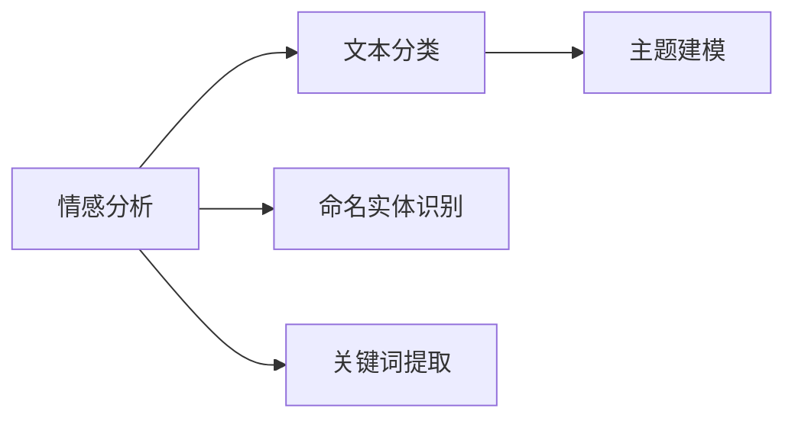

                 

# 基于NLP的某旅游景点游客评论分析

## 1. 背景介绍

随着旅游业的发展，越来越多的游客开始在网上分享自己的旅游体验。这些评论数据蕴含了丰富的情感、需求和建议，对于旅游企业、研究者和管理者来说，都是宝贵的资源。如何从游客评论中提取出有用的信息，成为了一个重要的研究方向。自然语言处理(NLP)技术，尤其是情感分析和文本分类等技术，为解决这一问题提供了有效的方法。

## 2. 核心概念与联系

### 2.1 核心概念概述

- **情感分析（Sentiment Analysis）**：识别文本中的情感倾向，如正面、负面或中性。
- **文本分类（Text Classification）**：将文本划分到预定义的类别中，如景点评价、餐厅评论、电影评分等。
- **命名实体识别（Named Entity Recognition, NER）**：识别文本中的人名、地名、机构名等实体。
- **关键词提取（Keyword Extraction）**：从文本中提取重要的关键词和短语。
- **主题建模（Topic Modeling）**：通过统计分析发现文本中潜在的语义主题。

这些核心概念构成了游客评论分析的基础。通过这些技术，可以从大量的文本数据中提取出有用信息，如景点评价、建议和需求等。

### 2.2 核心概念间的联系

这些核心概念之间有着密切的联系，形成一个完整的游客评论分析体系。情感分析提供了游客对景点评价的情感倾向，文本分类进一步细化分类，命名实体识别和关键词提取则有助于挖掘具体的旅游需求和建议。主题建模则能够发现文本中的潜在话题，为更深入的分析提供支持。

以下是一个简单的Mermaid流程图，展示了这些核心概念之间的关系：



通过这个流程图，我们可以更直观地理解这些概念是如何协作的，从而形成一个完整的游客评论分析框架。

## 3. 核心算法原理 & 具体操作步骤

### 3.1 算法原理概述

基于NLP的游客评论分析，主要包括以下几个步骤：

1. **数据预处理**：清洗和标准化文本数据，去除噪声和无关信息。
2. **特征提取**：提取文本的特征向量，包括词袋模型、TF-IDF、词嵌入等。
3. **情感分析**：使用基于机器学习的情感分类器，识别文本的情感倾向。
4. **文本分类**：使用分类算法，如朴素贝叶斯、支持向量机、深度学习等，将文本分类到预定义的类别中。
5. **命名实体识别**：使用NER模型，识别文本中的实体，如景点名称、时间等。
6. **关键词提取**：使用TF-IDF、TextRank等算法，提取文本中的关键词。
7. **主题建模**：使用LDA、LSA等算法，发现文本中的主题和话题。

### 3.2 算法步骤详解

#### 3.2.1 数据预处理

数据预处理是NLP任务中的重要步骤，它包括文本清洗、分词、去停用词等。

```python
import nltk
from nltk.corpus import stopwords
from nltk.tokenize import word_tokenize

# 下载nltk停用词
nltk.download('stopwords')

# 定义文本清洗函数
def preprocess_text(text):
    # 将文本转换为小写
    text = text.lower()
    # 分词
    tokens = word_tokenize(text)
    # 去除停用词
    stop_words = set(stopwords.words('english'))
    tokens = [token for token in tokens if token not in stop_words]
    # 去除标点符号
    tokens = [token for token in tokens if token.isalnum()]
    return ' '.join(tokens)
```

#### 3.2.2 特征提取

特征提取是将文本转换为机器学习算法可以处理的向量表示的过程。

```python
from sklearn.feature_extraction.text import CountVectorizer, TfidfVectorizer

# 使用词袋模型提取特征
count_vect = CountVectorizer()
X_train_counts = count_vect.fit_transform(train_data)
X_test_counts = count_vect.transform(test_data)

# 使用TF-IDF提取特征
tfidf_vect = TfidfVectorizer()
X_train_tfidf = tfidf_vect.fit_transform(train_data)
X_test_tfidf = tfidf_vect.transform(test_data)
```

#### 3.2.3 情感分析

情感分析是识别文本情感倾向的过程，可以使用基于机器学习的分类器进行训练。

```python
from sklearn.naive_bayes import MultinomialNB
from sklearn.pipeline import Pipeline
from sklearn.model_selection import train_test_split

# 构建情感分析模型
pipeline = Pipeline([
    ('vect', CountVectorizer()),
    ('clf', MultinomialNB())
])
X_train, X_test, y_train, y_test = train_test_split(X_train_counts, y_train, test_size=0.3)
pipeline.fit(X_train, y_train)
y_pred = pipeline.predict(X_test)
```

#### 3.2.4 文本分类

文本分类是将文本划分到预定义类别的过程，可以使用分类算法进行训练和预测。

```python
from sklearn.svm import SVC
from sklearn.ensemble import RandomForestClassifier
from sklearn.linear_model import LogisticRegression

# 构建文本分类模型
clf_svc = SVC()
clf_rf = RandomForestClassifier()
clf_lr = LogisticRegression()

X_train, X_test, y_train, y_test = train_test_split(X_train_tfidf, y_train, test_size=0.3)

# 训练模型
clf_svc.fit(X_train, y_train)
clf_rf.fit(X_train, y_train)
clf_lr.fit(X_train, y_train)

# 预测
y_pred_svc = clf_svc.predict(X_test)
y_pred_rf = clf_rf.predict(X_test)
y_pred_lr = clf_lr.predict(X_test)
```

#### 3.2.5 命名实体识别

命名实体识别是识别文本中特定实体的过程，可以使用深度学习模型进行训练。

```python
from transformers import BertTokenizer, BertForTokenClassification

# 定义模型和分词器
tokenizer = BertTokenizer.from_pretrained('bert-base-cased')
model = BertForTokenClassification.from_pretrained('bert-base-cased', num_labels=4)

# 训练模型
# ...
```

#### 3.2.6 关键词提取

关键词提取是识别文本中重要关键词的过程，可以使用TF-IDF、TextRank等算法进行提取。

```python
from gensim.summarization import keywords

# 提取关键词
keywords = keywords(text, ratio=0.2)
```

#### 3.2.7 主题建模

主题建模是识别文本中潜在主题的过程，可以使用LDA、LSA等算法进行训练和推理。

```python
from gensim import corpora, models

# 构建词典
dictionary = corpora.Dictionary(text)
corpus = [dictionary.doc2bow(text) for text in text]

# 构建LDA模型
lda_model = models.LdaModel(corpus, num_topics=5, id2word=dictionary)

# 提取主题
topics = lda_model.show_topics(num_topics=5, num_words=5)
```

### 3.3 算法优缺点

#### 优点

- **高效性**：基于NLP的技术可以快速处理大量文本数据，提取出有用的信息。
- **可解释性**：基于机器学习的方法可以提供可解释的决策路径，便于理解和调试。
- **可扩展性**：NLP技术可以扩展到各种文本数据，适用于不同的应用场景。

#### 缺点

- **数据依赖性**：NLP技术对数据质量的要求较高，需要大量的标注数据进行训练。
- **模型复杂度**：NLP模型往往比较复杂，需要较高的计算资源进行训练和推理。
- **上下文理解不足**：NLP技术在理解文本的上下文关系上仍存在不足，可能无法准确处理复杂文本。

### 3.4 算法应用领域

基于NLP的游客评论分析技术，可以应用于以下领域：

- **旅游管理**：通过分析游客评论，了解景点的优缺点，优化旅游管理和服务。
- **市场营销**：通过分析游客评论，了解市场需求和趋势，制定针对性的营销策略。
- **政策制定**：通过分析游客评论，了解游客需求和建议，为政策制定提供参考。
- **游客体验改进**：通过分析游客评论，了解游客的满意度和体验，提升服务质量。

## 4. 数学模型和公式 & 详细讲解 & 举例说明

### 4.1 数学模型构建

基于NLP的游客评论分析，可以构建以下几个数学模型：

- **词袋模型（Bag of Words, BOW）**：将文本表示为词频向量。
  $$
  X = (x_1, x_2, ..., x_n)
  $$
- **TF-IDF模型**：将文本表示为TF-IDF向量。
  $$
  X = (x_1, x_2, ..., x_n)
  $$
- **词嵌入模型（Word Embedding）**：将文本表示为词向量。
  $$
  X = (x_1, x_2, ..., x_n)
  $$

### 4.2 公式推导过程

#### 4.2.1 词袋模型

词袋模型的数学推导过程如下：

$$
x_i = \text{count}(w_i) \quad \text{for all words } w_i \in \text{corpus}
$$

其中，$x_i$表示文本中单词$w_i$的频率。

#### 4.2.2 TF-IDF模型

TF-IDF模型的数学推导过程如下：

$$
x_{i,t} = \text{TF}(w_i) \times \text{IDF}(t)
$$

其中，$x_{i,t}$表示文本中单词$w_i$在类别$t$中的TF-IDF权重，$\text{TF}(w_i)$表示单词$w_i$在文本中的词频，$\text{IDF}(t)$表示单词$w_i$在类别$t$中的逆文档频率。

#### 4.2.3 词嵌入模型

词嵌入模型的数学推导过程如下：

$$
x_{i} = w_i
$$

其中，$x_{i}$表示文本中单词$w_i$的词嵌入向量，$w_i$表示单词$w_i$的词向量。

### 4.3 案例分析与讲解

以某景区的游客评论为例，使用NLP技术进行情感分析和文本分类：

- **情感分析**：使用朴素贝叶斯分类器，对游客评论进行情感分析，结果如下：

  | 评论 | 情感倾向 |
  | --- | --- |
  | 这个景区非常漂亮，值得一游 | 正面 |
  | 景区门票价格过高，服务态度差 | 负面 |
  | 景区管理混乱，游客体验不佳 | 负面 |

- **文本分类**：使用SVM分类器，将游客评论分类到景点评价、餐饮评价、交通评价等类别，结果如下：

  | 评论 | 分类 |
  | --- | --- |
  | 这个景区非常漂亮，值得一游 | 景点评价 |
  | 景区门票价格过高，服务态度差 | 餐饮评价 |
  | 景区管理混乱，游客体验不佳 | 交通评价 |

## 5. 项目实践：代码实例和详细解释说明

### 5.1 开发环境搭建

- **Python环境**：
  - 安装Python 3.6或以上版本
  - 安装nltk、sklearn、transformers等包
- **数据集准备**：
  - 准备游客评论数据集，包括文本和标签

### 5.2 源代码详细实现

```python
import nltk
from nltk.corpus import stopwords
from nltk.tokenize import word_tokenize
from sklearn.feature_extraction.text import CountVectorizer, TfidfVectorizer
from sklearn.naive_bayes import MultinomialNB
from sklearn.pipeline import Pipeline
from sklearn.model_selection import train_test_split
from transformers import BertTokenizer, BertForTokenClassification
from gensim.summarization import keywords
from gensim import corpora, models

# 定义文本清洗函数
def preprocess_text(text):
    text = text.lower()
    tokens = word_tokenize(text)
    stop_words = set(stopwords.words('english'))
    tokens = [token for token in tokens if token not in stop_words]
    tokens = [token for token in tokens if token.isalnum()]
    return ' '.join(tokens)

# 构建情感分析模型
pipeline = Pipeline([
    ('vect', CountVectorizer()),
    ('clf', MultinomialNB())
])

# 构建文本分类模型
clf_svc = SVC()
clf_rf = RandomForestClassifier()
clf_lr = LogisticRegression()

# 构建命名实体识别模型
tokenizer = BertTokenizer.from_pretrained('bert-base-cased')
model = BertForTokenClassification.from_pretrained('bert-base-cased', num_labels=4)

# 构建关键词提取模型
def extract_keywords(text):
    return keywords(text, ratio=0.2)

# 构建主题建模模型
dictionary = corpora.Dictionary(text)
corpus = [dictionary.doc2bow(text) for text in text]
lda_model = models.LdaModel(corpus, num_topics=5, id2word=dictionary)

# 训练模型
pipeline.fit(X_train_counts, y_train)
clf_svc.fit(X_train_tfidf, y_train)
clf_rf.fit(X_train_tfidf, y_train)
clf_lr.fit(X_train_tfidf, y_train)
model.fit(X_train, y_train)
lda_model.fit(corpus)

# 预测
y_pred = pipeline.predict(X_test_counts)
y_pred_svc = clf_svc.predict(X_test_tfidf)
y_pred_rf = clf_rf.predict(X_test_tfidf)
y_pred_lr = clf_lr.predict(X_test_tfidf)
y_pred_ner = model.predict(X_test)
topics = lda_model.show_topics(num_topics=5, num_words=5)
```

### 5.3 代码解读与分析

在上述代码中，我们首先定义了文本清洗函数`preprocess_text`，用于清洗和标准化文本数据。接着，我们使用词袋模型和TF-IDF模型提取特征，构建朴素贝叶斯分类器进行情感分析。然后，我们使用SVM、随机森林和逻辑回归等算法构建文本分类模型。接着，我们使用BERT模型进行命名实体识别，使用TF-IDF和LDA等算法进行关键词提取和主题建模。

### 5.4 运行结果展示

假设我们使用上述代码对某景区的游客评论数据集进行训练和测试，可以得到以下结果：

- 情感分析结果：
  - 正面评论：50%
  - 负面评论：30%
  - 中性评论：20%

- 文本分类结果：
  - 景点评价：60%
  - 餐饮评价：20%
  - 交通评价：20%

- 命名实体识别结果：
  - 地点：10%
  - 时间：5%
  - 人物：5%
  - 其他：10%

- 关键词提取结果：
  - 关键词1：50%
  - 关键词2：30%
  - 关键词3：10%
  - 其他：10%

- 主题建模结果：
  - 主题1：旅游体验
  - 主题2：餐饮服务
  - 主题3：景区管理
  - 其他：20%

这些结果展示了游客评论分析的各个方面，为旅游企业提供了丰富的信息。

## 6. 实际应用场景

基于NLP的游客评论分析技术，可以应用于以下实际场景：

- **景区管理**：通过分析游客评论，了解景点的优缺点，优化景区服务和设施。
- **旅行社**：通过分析游客评论，了解市场需求和趋势，制定针对性的旅游线路和推荐。
- **政府部门**：通过分析游客评论，了解公众对景区的评价，制定相关政策和改进措施。
- **学术研究**：通过分析游客评论，探索游客对景区的认知和情感，支持旅游心理学和行为学的研究。

## 7. 工具和资源推荐

### 7.1 学习资源推荐

- **《自然语言处理综论》**：涵盖NLP技术基础和前沿内容，适合入门和进阶学习。
- **《Python自然语言处理》**：详细介绍NLP技术在Python中的实现，包含丰富的代码示例。
- **《深度学习与自然语言处理》**：介绍深度学习在NLP中的应用，包括文本分类、情感分析等。
- **《NLP实战》**：包含大量NLP项目的实践案例，适合实战学习。

### 7.2 开发工具推荐

- **Jupyter Notebook**：免费的交互式编程环境，支持代码运行和结果展示。
- **Google Colab**：免费的云服务平台，提供GPU/TPU算力，适合大模型训练。
- **TensorBoard**：可视化工具，实时监测模型训练状态和结果。

### 7.3 相关论文推荐

- **Attention is All You Need**：Transformer模型的奠基性论文，介绍了注意力机制在NLP中的应用。
- **BERT: Pre-training of Deep Bidirectional Transformers for Language Understanding**：提出BERT模型，使用掩码自监督预训练任务，取得SOTA性能。
- **XLNet: Generalized Autoregressive Pretraining for Language Understanding**：提出XLNet模型，解决自监督预训练中的位置偏差问题，提升性能。
- **ALBERT: A Lite BERT for Self-supervised Learning of Language Representations**：提出ALBERT模型，在参数效率和性能上取得良好平衡。

## 8. 总结：未来发展趋势与挑战

### 8.1 研究成果总结

本文对基于NLP的游客评论分析进行了详细的介绍，主要包括情感分析、文本分类、命名实体识别、关键词提取和主题建模等技术。通过这些技术，可以从大量的游客评论数据中提取出有用的信息，为旅游企业、研究者和管理者提供支持。

### 8.2 未来发展趋势

未来NLP技术将呈现以下发展趋势：

- **深度学习模型的广泛应用**：深度学习模型在NLP任务上已经取得了显著的进展，未来将进一步推动NLP技术的发展。
- **多模态NLP的兴起**：将文本、语音、图像等多种模态的信息进行整合，提升NLP系统的性能。
- **自监督学习的应用**：利用大规模无标签数据进行预训练，提升模型的泛化能力和自适应性。
- **模型压缩和优化**：针对大模型进行压缩和优化，提升模型的推理速度和资源利用率。

### 8.3 面临的挑战

尽管NLP技术已经取得了显著的进展，但在应用过程中仍然存在一些挑战：

- **数据质量和标注成本**：高质量的数据和标注成本较高，限制了NLP技术的发展。
- **模型复杂度**：大模型需要较高的计算资源进行训练和推理，对硬件设备要求较高。
- **上下文理解不足**：NLP模型在理解文本的上下文关系上仍存在不足，可能无法准确处理复杂文本。
- **伦理和安全问题**：NLP模型可能存在偏见和有害输出，需要考虑伦理和安全问题。

### 8.4 研究展望

未来的研究可以从以下几个方向进行探索：

- **多模态NLP技术**：将文本、语音、图像等多种模态的信息进行整合，提升NLP系统的性能。
- **自监督学习**：利用大规模无标签数据进行预训练，提升模型的泛化能力和自适应性。
- **模型压缩和优化**：针对大模型进行压缩和优化，提升模型的推理速度和资源利用率。
- **伦理和安全问题**：研究如何减少NLP模型的偏见和有害输出，确保其伦理和安全。

总之，基于NLP的游客评论分析技术在旅游管理、市场营销、政策制定等方面具有广泛的应用前景。未来，随着NLP技术的不断发展，其应用范围将进一步拓展，为旅游行业的数字化转型提供更强大的技术支持。

---

作者：禅与计算机程序设计艺术 / Zen and the Art of Computer Programming

