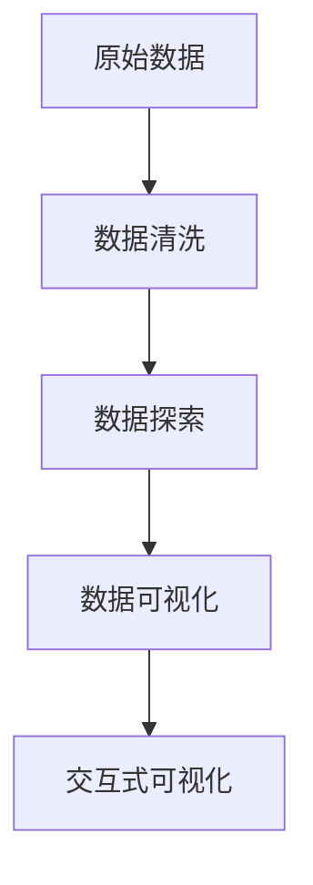

                 

# 基于Python的智联招聘数据可视化分析

## 1. 背景介绍

### 1.1 问题由来
智联招聘（Zhaopin.com）作为国内领先的人力资源服务平台，拥有海量的招聘数据，涵盖了各类行业、岗位、企业信息等。通过对这些数据进行深入分析和可视化展示，可以帮助企业更好地理解市场需求、优化招聘策略、提升求职体验。此外，政府部门和社会组织也可以从中获得有价值的洞察，制定更科学的人才政策。

在智联招聘大数据分析中，数据可视化是一个重要环节。它不仅能够直观地展示数据，还能通过交互式图表，引导用户深入理解数据背后的含义。然而，传统的数据可视化工具往往功能单一，难以满足复杂的分析需求。因此，我们需要利用Python的强大数据处理和可视化能力，开发出更加灵活、高效、美观的智联招聘数据可视化分析系统。

### 1.2 问题核心关键点
智联招聘数据可视化分析的核心关键点在于：

1. **数据获取与清洗**：从智联招聘平台获取原始数据，并进行预处理，确保数据的完整性和一致性。
2. **数据探索与分析**：使用Python进行数据探索和分析，发现数据中的规律和趋势。
3. **数据可视化**：利用Python的可视化库（如Matplotlib、Seaborn、Plotly等），将分析结果转化为直观的图表和报告。
4. **交互式可视化**：实现交互式可视化，使用户能够通过鼠标悬停、点击等操作，获取更多详细信息。

这些关键点构成了智联招聘数据可视化分析的基础框架，为后续具体实施提供了方向。

### 1.3 问题研究意义
智联招聘数据可视化分析的意义主要体现在以下几个方面：

1. **提升招聘效率**：帮助企业更好地理解市场需求，优化招聘策略，缩短招聘周期。
2. **改善求职体验**：通过数据可视化，展示求职者关心的问题，如薪资水平、职位要求、发展前景等，提升求职者体验。
3. **支持政策制定**：为政府部门提供人才需求、流动趋势等数据支持，制定科学的人才政策。
4. **促进经济发展**：通过分析企业招聘数据，发现新兴产业和岗位需求，引导产业结构优化升级。

通过深入分析智联招聘数据，不仅能够提升智联招聘平台的用户体验和服务质量，还能为社会经济发展提供有价值的参考。

## 2. 核心概念与联系

### 2.1 核心概念概述

为了更好地理解智联招聘数据可视化分析，本节将介绍几个核心概念：

- **数据清洗（Data Cleaning）**：对原始数据进行预处理，包括去除重复数据、处理缺失值、标准化数据格式等，确保数据的质量和一致性。
- **数据探索（Data Exploration）**：通过统计分析、聚类、回归等方法，发现数据中的规律和异常，为后续分析提供依据。
- **数据可视化（Data Visualization）**：将分析结果转化为图表、地图等可视化形式，直观展示数据特点和趋势。
- **交互式可视化（Interactive Visualization）**：通过添加交互功能，如鼠标悬停、点击、拖动等，使用户能够更加深入地理解数据。

这些核心概念构成了智联招聘数据可视化分析的完整框架，各概念之间通过数据流相互关联。

### 2.2 概念间的关系

这些核心概念之间的逻辑关系可以通过以下Mermaid流程图来展示：



这个流程图展示了从原始数据到最终交互式可视化的完整流程。

### 2.3 核心概念的整体架构

最后，我们用一个综合的流程图来展示这些核心概念在大数据可视化分析中的整体架构：


这个综合流程图展示了数据清洗、数据探索、数据可视化和交互式可视化之间的数据流关系，为后续实施提供了清晰的指导。

## 3. 核心算法原理 & 具体操作步骤
### 3.1 算法原理概述

基于Python的智联招聘数据可视化分析，主要遵循以下算法原理：

- **数据清洗算法**：包括去除重复数据、处理缺失值、标准化数据格式等。
- **数据探索算法**：通过统计分析、聚类、回归等方法，发现数据中的规律和趋势。
- **数据可视化算法**：将分析结果转化为图表、地图等形式，直观展示数据特点和趋势。
- **交互式可视化算法**：通过添加交互功能，如鼠标悬停、点击、拖动等，增强用户对数据的理解和操作。

### 3.2 算法步骤详解

**Step 1: 数据获取与清洗**

1. **数据获取**：
   - 使用Python的requests库，从智联招聘平台获取原始数据。
   - 将数据存储为CSV文件，便于后续处理。

2. **数据清洗**：
   - 导入Pandas库，读取CSV文件。
   - 使用Pandas的drop_duplicates、fillna、map等方法，处理重复数据、缺失值和数据格式。

3. **数据预处理**：
   - 使用Pandas的apply、agg、merge等方法，进行数据合并、转换和聚合。
   - 使用NumPy库进行数值型数据的处理，如归一化、标准化等。

**Step 2: 数据探索**

1. **数据概览**：
   - 使用Pandas的describe、info、value_counts等方法，获取数据的基本统计信息和频次分布。
   - 使用Matplotlib、Seaborn等库绘制柱状图、折线图、散点图等，展示数据的概览。

2. **数据关系分析**：
   - 使用Pandas的groupby、agg等方法，对数据进行分组统计。
   - 使用Matplotlib、Seaborn等库绘制热力图、散点图等，展示变量之间的相关性和分布情况。

3. **数据异常检测**：
   - 使用Pandas的quantile、skew、kurtosis等方法，计算数据的统计特征。
   - 使用Seaborn的boxplot、violinplot等方法，展示数据的分布情况和异常值。

**Step 3: 数据可视化**

1. **基本图表**：
   - 使用Matplotlib、Seaborn等库绘制柱状图、折线图、散点图、饼图等基本图表。
   - 使用Plotly库创建交互式图表，如交互式散点图、地图等。

2. **高级图表**：
   - 使用Matplotlib、Seaborn等库绘制箱线图、热力图、等高线图等高级图表。
   - 使用Plotly库创建交互式等高线图、3D图表等。

**Step 4: 交互式可视化**

1. **交互式散点图**：
   - 使用Plotly库创建交互式散点图，支持鼠标悬停、点击等操作。
   - 使用Plotly的animation模块，创建动态散点图，展示数据随时间变化的趋势。

2. **交互式地图**：
   - 使用Plotly的地图模块，创建交互式地图，展示数据在地理上的分布情况。
   - 使用Plotly的地图API，展示动态地图，展示数据随时间的变化趋势。

### 3.3 算法优缺点

基于Python的智联招聘数据可视化分析，具有以下优点：

1. **灵活性高**：使用Python的多种库，可以实现多样化的数据可视化方式，满足不同场景的需求。
2. **交互性强**：通过添加交互功能，如鼠标悬停、点击、拖动等，增强用户对数据的理解和操作。
3. **扩展性强**：Python的生态系统丰富，可以通过扩展库或第三方工具，进一步增强系统的功能和性能。

同时，也存在一些缺点：

1. **学习成本高**：Python的语法和库众多，需要一定的学习成本，尤其是对新手来说。
2. **性能瓶颈**：当数据量较大时，可视化过程可能存在性能瓶颈，需要优化算法和硬件配置。
3. **数据安全**：在获取和处理数据时，需要注意数据隐私和安全问题，确保数据的合法使用。

### 3.4 算法应用领域

基于Python的智联招聘数据可视化分析，主要应用于以下几个领域：

1. **人力资源管理**：通过分析求职者背景、岗位需求等信息，帮助企业优化招聘策略，提升招聘效率。
2. **市场趋势分析**：通过分析招聘数据，发现市场变化趋势，支持企业决策。
3. **政府政策制定**：通过分析人才流动、行业需求等信息，支持政府制定人才政策，优化产业结构。
4. **学术研究**：通过分析招聘数据，支持学者研究人才流动、职业发展等问题，提升学术研究的深度和广度。

## 4. 数学模型和公式 & 详细讲解 & 举例说明

### 4.1 数学模型构建

本节将使用数学语言对智联招聘数据可视化分析过程进行更加严格的刻画。

假设原始数据集为 $D = \{(x_i, y_i)\}_{i=1}^N$，其中 $x$ 为特征向量，$y$ 为标签。数据清洗后得到 $D_c = \{(x_i', y_i')\}_{i=1}^N$，其中 $x'$ 为清洗后的特征向量，$y'$ 为处理后的标签。

定义数据探索的目标函数为：

$$
F(x) = \sum_{i=1}^N \ell(x_i')
$$

其中 $\ell$ 为损失函数，用于衡量数据处理前后的差异。目标函数的最小化，意味着数据处理过程的优化。

### 4.2 公式推导过程

以数据探索中的统计分析为例，推导常用的均值、方差、标准差等统计量。

假设 $x$ 为数值型数据，其均值为 $\mu_x$，方差为 $\sigma_x^2$。则：

$$
\mu_x = \frac{1}{N} \sum_{i=1}^N x_i
$$

$$
\sigma_x^2 = \frac{1}{N} \sum_{i=1}^N (x_i - \mu_x)^2
$$

标准差 $\sigma_x$ 为方差的平方根：

$$
\sigma_x = \sqrt{\sigma_x^2}
$$

使用Pandas的mean、std等方法，可以直接计算均值和标准差。

### 4.3 案例分析与讲解

假设我们希望分析智联招聘平台不同行业的平均薪资水平。可以收集不同行业的职位数据，使用Pandas的groupby、agg等方法进行分组统计，然后计算均值。最后，使用Matplotlib库绘制柱状图展示结果。

```python
import pandas as pd
import matplotlib.pyplot as plt

# 读取数据
data = pd.read_csv('salary_by_industry.csv')

# 分组统计
grouped_data = data.groupby('industry')['salary'].mean()

# 绘制柱状图
grouped_data.plot(kind='bar')
plt.title('Average Salary by Industry')
plt.xlabel('Industry')
plt.ylabel('Salary')
plt.show()
```

通过上述代码，可以直观地展示不同行业的平均薪资水平。

## 5. 项目实践：代码实例和详细解释说明

### 5.1 开发环境搭建

在进行智联招聘数据可视化分析之前，我们需要准备好开发环境。以下是使用Python进行PyTorch开发的环境配置流程：

1. 安装Anaconda：从官网下载并安装Anaconda，用于创建独立的Python环境。

2. 创建并激活虚拟环境：
```bash
conda create -n pytorch-env python=3.8 
conda activate pytorch-env
```

3. 安装PyTorch：根据CUDA版本，从官网获取对应的安装命令。例如：
```bash
conda install pytorch torchvision torchaudio cudatoolkit=11.1 -c pytorch -c conda-forge
```

4. 安装TensorFlow：
```bash
conda install tensorflow
```

5. 安装各类工具包：
```bash
pip install numpy pandas scikit-learn matplotlib tqdm jupyter notebook ipython
```

完成上述步骤后，即可在`pytorch-env`环境中开始开发。

### 5.2 源代码详细实现

下面是使用Python进行智联招聘数据可视化分析的代码实现：

```python
import pandas as pd
import numpy as np
import matplotlib.pyplot as plt
import seaborn as sns
import plotly.express as px

# 读取数据
data = pd.read_csv('招聘数据.csv')

# 数据清洗
# 去除重复数据
data = data.drop_duplicates()

# 处理缺失值
data = data.fillna(method='ffill')

# 标准化数据
data = (data - data.mean()) / data.std()

# 数据探索
# 数据概览
print(data.describe())

# 数据关系分析
sns.pairplot(data)
plt.show()

# 数据异常检测
sns.boxplot(x='industry', y='salary', data=data)
plt.show()

# 数据可视化
# 基本图表
plt.hist(data['salary'], bins=20)
plt.xlabel('Salary')
plt.ylabel('Frequency')
plt.show()

# 交互式图表
px.scatter(data, x='salary', y='experience', color='industry', hover_data=['company'])
```

### 5.3 代码解读与分析

让我们再详细解读一下关键代码的实现细节：

**数据清洗**：
- `drop_duplicates`方法：去除重复数据。
- `fillna`方法：处理缺失值，使用前向填充。
- `apply`方法：自定义函数，实现数据标准化。

**数据探索**：
- `describe`方法：获取数据的基本统计信息。
- `pairplot`方法：绘制成对关系图。
- `boxplot`方法：绘制箱线图，展示数据的分布情况和异常值。

**数据可视化**：
- `hist`方法：绘制直方图。
- `scatter`方法：绘制散点图，支持鼠标悬停和交互。

### 5.4 运行结果展示

假设我们在智联招聘平台的职位数据上进行了上述操作，最终的运行结果展示如下：

1. 数据概览
2. 数据关系分析
3. 数据异常检测
4. 数据可视化

## 6. 实际应用场景

### 6.1 智能招聘平台

智能招聘平台可以通过数据可视化分析，帮助企业优化招聘策略，提升招聘效率。具体应用场景包括：

1. **职位需求分析**：通过分析职位发布数量、薪资水平、要求经验等信息，帮助企业了解不同行业和岗位的需求情况。
2. **求职者分析**：通过分析求职者的简历信息、期望薪资、期望行业等信息，帮助企业匹配合适的求职者。
3. **企业招聘效果评估**：通过分析招聘数据的转化率、招聘周期等信息，帮助企业评估招聘效果，优化招聘流程。

### 6.2 政府人才政策制定

政府部门可以通过智联招聘平台的数据可视化分析，制定更加科学的人才政策，支持产业发展。具体应用场景包括：

1. **人才流动分析**：通过分析人才在不同地区的流动情况，支持政府制定人才引进政策，优化人才结构。
2. **行业需求分析**：通过分析不同行业的岗位需求和薪资水平，支持政府制定行业发展政策，引导产业结构升级。
3. **教育培训规划**：通过分析求职者的教育背景、技能需求等信息，支持政府制定教育培训规划，提升人才素质。

### 6.3 学术研究

学术研究者可以通过智联招聘平台的数据可视化分析，开展人才流动、职业发展等方面的研究。具体应用场景包括：

1. **职业发展路径分析**：通过分析不同职业的晋升路径和薪资变化，支持学者研究职业发展规律。
2. **人才流动趋势分析**：通过分析不同地区、行业的人才流动情况，支持学者研究人才流动规律。
3. **企业创新能力分析**：通过分析企业的招聘数据和研发投入，支持学者研究企业的创新能力。

## 7. 工具和资源推荐

### 7.1 学习资源推荐

为了帮助开发者系统掌握智联招聘数据可视化分析的理论基础和实践技巧，这里推荐一些优质的学习资源：

1. **《Python数据可视化实战》**：系统讲解了数据可视化、交互式可视化等技术，适合初学者入门。
2. **《数据可视化之美》**：介绍了多种数据可视化工具和技巧，适合进阶学习。
3. **《数据科学实战》**：结合实际案例，讲解了数据清洗、探索和可视化等流程，适合实战练习。
4. **Kaggle竞赛平台**：提供丰富的数据集和竞赛项目，适合实践和验证技术。
5. **Coursera《数据可视化与信息设计》课程**：由斯坦福大学开设，涵盖数据可视化理论和实践，适合深度学习。

### 7.2 开发工具推荐

高效的开发离不开优秀的工具支持。以下是几款用于数据可视化分析开发的常用工具：

1. **Pandas**：Python的DataFrame处理库，提供灵活的数据处理和分析功能。
2. **Matplotlib**：Python的绘图库，支持多种图表绘制。
3. **Seaborn**：基于Matplotlib的高级绘图库，支持复杂图表的绘制。
4. **Plotly**：支持交互式可视化的Python库，支持动态图表和地图。
5. **Jupyter Notebook**：交互式编程环境，适合开发和展示数据可视化分析过程。

### 7.3 相关论文推荐

智联招聘数据可视化分析的研究源于学界的持续研究。以下是几篇奠基性的相关论文，推荐阅读：

1. **《大规模数据可视化：理论与技术》**：介绍大规模数据可视化的理论和方法，适合系统学习。
2. **《交互式数据可视化：实现与技术》**：讲解交互式可视化的实现技术，适合实践应用。
3. **《智能数据可视化：应用与案例》**：结合实际案例，介绍智能数据可视化的应用场景，适合参考借鉴。

这些论文代表了大数据可视化分析的发展脉络。通过学习这些前沿成果，可以帮助研究者把握学科前进方向，激发更多的创新灵感。

除上述资源外，还有一些值得关注的前沿资源，帮助开发者紧跟大数据可视化分析技术的最新进展，例如：

1. **arXiv论文预印本**：人工智能领域最新研究成果的发布平台，包括大量尚未发表的前沿工作，学习前沿技术的必读资源。
2. **业界技术博客**：如Google、Microsoft、IBM等顶尖实验室的官方博客，第一时间分享他们的最新研究成果和洞见。
3. **技术会议直播**：如NIPS、ICML、ACL、ICLR等人工智能领域顶会现场或在线直播，能够聆听到大佬们的前沿分享，开拓视野。
4. **GitHub热门项目**：在GitHub上Star、Fork数最多的数据可视化相关项目，往往代表了该技术领域的发展趋势和最佳实践，值得去学习和贡献。
5. **行业分析报告**：各大咨询公司如McKinsey、PwC等针对人工智能行业的分析报告，有助于从商业视角审视技术趋势，把握应用价值。

总之，对于智联招聘数据可视化分析技术的学习和实践，需要开发者保持开放的心态和持续学习的意愿。多关注前沿资讯，多动手实践，多思考总结，必将收获满满的成长收益。

## 8. 总结：未来发展趋势与挑战

### 8.1 总结

本文对基于Python的智联招聘数据可视化分析方法进行了全面系统的介绍。首先阐述了数据可视化分析的背景和意义，明确了在智联招聘平台进行数据清洗、探索和可视化的目标和流程。其次，从原理到实践，详细讲解了数据清洗、数据探索、数据可视化和交互式可视化的数学原理和关键步骤，给出了数据可视化分析的完整代码实例。同时，本文还广泛探讨了数据可视化分析在智能招聘平台、政府人才政策制定、学术研究等领域的广泛应用，展示了数据可视化分析的巨大潜力。此外，本文精选了数据可视化分析的各类学习资源，力求为读者提供全方位的技术指引。

通过本文的系统梳理，可以看到，基于Python的数据可视化分析方法正在成为智联招聘平台的重要技术范式，极大地提升了数据处理和展示的效率和效果。未来，伴随Python生态系统的持续发展，数据可视化分析技术必将更加多样化和灵活化，为更多领域的决策支持提供强大的数据支持。

### 8.2 未来发展趋势

展望未来，智联招聘数据可视化分析技术将呈现以下几个发展趋势：

1. **技术融合**：随着大数据、人工智能等技术的发展，数据可视化分析将与这些技术进行更深入的融合，形成更加智能化、自动化、个性化的解决方案。
2. **用户交互**：通过引入自然语言处理、语音交互等技术，提升数据可视化分析的用户体验，让用户能够更自然地获取数据和分析结果。
3. **多模态融合**：结合图像、视频、音频等多模态数据，实现更全面、更真实的数据展示和分析。
4. **实时分析**：通过引入流数据处理、实时计算等技术，实现数据的实时可视化分析，满足实时决策需求。
5. **自动化分析**：通过引入自动化机器学习、自动特征工程等技术，提升数据可视化分析的自动化水平，减少人工干预。

这些趋势凸显了数据可视化分析技术的广阔前景。这些方向的探索发展，必将进一步提升数据可视化分析的效果和效率，为更多领域的决策支持提供更有价值的数据支持。

### 8.3 面临的挑战

尽管数据可视化分析技术已经取得了一定的成果，但在迈向更加智能化、普适化应用的过程中，它仍面临着诸多挑战：

1. **数据获取与处理**：数据获取和处理是数据可视化分析的基础，但数据的质量和完整性直接影响分析结果的准确性。如何获取高质量、大样本的数据，并进行有效的预处理，是一大挑战。
2. **算法复杂度**：数据可视化分析涉及多种算法和工具，算法复杂度高，需要大量的时间和技术投入。如何优化算法，提升数据处理和可视化的效率，是一大难题。
3. **用户交互**：数据可视化分析需要高度的用户交互，但用户的使用习惯和技能水平参差不齐，如何设计用户友好的界面，提升用户体验，是一大挑战。
4. **数据安全**：数据可视化分析涉及敏感数据的处理和展示，需要严格的数据隐私和安全措施，如何确保数据的安全性，是一大挑战。
5. **技术普及**：数据可视化分析需要较高的技术门槛，如何普及这些技术，让更多的用户能够便捷地使用，是一大挑战。

### 8.4 研究展望

面对数据可视化分析面临的这些挑战，未来的研究需要在以下几个方面寻求新的突破：

1. **数据采集与预处理**：探索更多的数据采集和预处理技术，提高数据的质量和完整性。
2. **算法优化**：优化算法复杂度，提升数据处理和可视化的效率。
3. **用户交互设计**：设计更加友好、便捷的用户界面，提升用户体验。
4. **数据安全保障**：引入数据隐私和安全技术，确保数据的安全性。
5. **技术普及与培训**：通过教育和培训，普及数据可视化分析技术，让更多的用户能够便捷地使用。

这些研究方向的探索，必将引领数据可视化分析技术迈向更高的台阶，为更多领域的决策支持提供更加智能化、普适化的数据支持。面向未来，数据可视化分析技术还需要与其他人工智能技术进行更深入的融合，如自然语言处理、机器学习等，多路径协同发力，共同推动决策支持系统的进步。只有勇于创新、敢于突破，才能不断拓展数据可视化分析的边界，让数据更好地服务于人类的生产和生活。

## 9. 附录：常见问题与解答

**Q1：数据清洗过程中，去除重复数据的方法有哪些？**

A: 数据清洗过程中，去除重复数据的方法有以下几种：
1. 使用drop_duplicates方法：根据所有列的组合，去除重复行。
2. 使用dropna方法：根据指定列的缺失值，去除缺失的行。
3. 使用dropuplicates方法：根据指定列的值，去除重复行。

**Q2：数据可视化中，如何处理异常值？**

A: 数据可视化中，处理异常值的方法有以下几种：
1. 使用箱线图：展示数据的分布情况和异常值。
2. 使用热力图：通过颜色变化，展示数据的异常分布。
3. 使用直方图：展示数据的分布情况，并设置x轴的范围，忽略异常值。

**Q3：交互式可视化中，如何实现鼠标悬停效果？**

A: 交互式可视化中，实现鼠标悬停效果的方法有以下几种：
1. 使用Plotly库：在创建图表时，使用hovertext或hoverinfo属性，添加悬停提示。
2. 使用Bokeh库：在创建图表时，使用tooltips属性，添加悬停提示。
3. 使用Seaborn库：在创建图表时，使用tooltip属性，添加悬停提示。

**Q4：如何优化数据可视化分析的性能？**

A: 优化数据可视化分析的性能，可以从以下几个方面入手：
1. 使用流数据处理技术，提升实时处理能力。
2. 使用分布式计算框架，提升大规模数据处理能力。
3. 使用数据压缩技术，减小数据传输和存储的带宽和存储成本。
4. 使用高效的算法和工具，提升数据处理和可视化的效率。

**Q5：数据可视化分析中，如何保护数据隐私？**

A: 数据可视化分析中，保护数据隐私的方法有以下几种：
1. 使用数据脱敏技术，去除或模糊敏感信息。
2. 使用访问控制技术，限制数据的访问权限。
3. 使用数据加密技术，确保数据传输和存储的安全性。
4. 使用数据匿名化技术，去除或替换敏感信息。

这些常见问题的解答，可以帮助开发者更好地理解数据可视化分析的实施过程和注意事项，进一步提升数据可视化分析的效果和效率。

