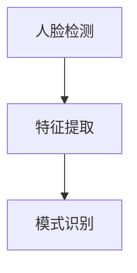
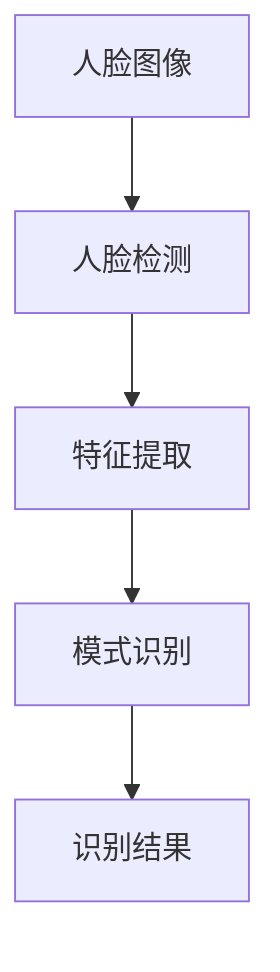

                 

# 基于TensorFlow的人脸识别

## 1. 背景介绍

### 1.1 问题由来
人脸识别（Face Recognition）是一种基于视觉信息识别人类个体的技术，已经成为现代科技领域的热点话题之一。它的应用范围涵盖了智能安防、社交网络、金融支付等多个领域，通过识别用户面部特征来进行身份验证和个性化服务。

### 1.2 问题核心关键点
人脸识别系统包括面部检测、特征提取和模式识别三个关键步骤。面部检测用于在图像中准确找到人脸位置，特征提取提取人脸图像的特征向量，模式识别则将特征向量与已知样本进行比对，以确定身份。本文聚焦于基于深度学习技术的人脸识别，通过神经网络模型进行面部特征提取和模式识别，特别地，我们使用TensorFlow框架实现人脸识别系统。

### 1.3 问题研究意义
研究基于TensorFlow的人脸识别系统，可以：
- 提升面部特征提取的准确性，使得识别系统能够更精准地识别用户。
- 优化模式识别算法，提高识别系统的鲁棒性和泛化能力。
- 扩展识别系统的应用场景，支持更复杂的识别任务，如年龄识别、性别识别等。
- 推动面部识别技术的商业化应用，实现人脸信息的安全与便捷使用。

## 2. 核心概念与联系

### 2.1 核心概念概述

为更好地理解基于TensorFlow的人脸识别技术，本节将介绍几个关键概念：

- **人脸识别**：利用计算机技术，通过面部图像识别人员身份的过程。
- **深度学习**：一种模拟人脑神经网络的机器学习方法，通过多层次的非线性变换提取数据特征。
- **卷积神经网络（CNN）**：深度学习的一种架构，专门用于处理图像和视频数据，能够自动提取图像特征。
- **人脸检测**：在图像中准确找到并定位人脸位置的技术。
- **特征提取**：从人脸图像中提取有效的面部特征，用于人脸识别的识别过程。
- **模式识别**：通过机器学习算法，将提取的特征向量与已知样本进行比较，以确定识别结果。

这些概念构成了基于TensorFlow的人脸识别技术的核心，其相互作用可形成如下的Mermaid流程图：



### 2.2 概念间的关系

以上概念之间存在紧密的联系，形成一个完整的人脸识别系统：

- 人脸检测通过检测算法在图像中找到人脸位置，这是进行后续特征提取的前提。
- 特征提取从人脸图像中提取特征向量，用于后续模式识别的比较。
- 模式识别通过比较特征向量，确定识别结果，完成整个识别过程。

### 2.3 核心概念的整体架构

最后，用以下综合流程图展示人脸识别技术的关键步骤：



## 3. 核心算法原理 & 具体操作步骤

### 3.1 算法原理概述

基于TensorFlow的人脸识别技术主要采用深度学习中的卷积神经网络（CNN）架构。其核心原理是：通过多层卷积和池化操作，自动从原始的面部图像中提取特征向量，再通过全连接层和softmax函数进行模式识别，最后输出识别结果。

### 3.2 算法步骤详解

基于TensorFlow的人脸识别系统一般包括以下几个步骤：

**Step 1: 数据准备与预处理**
- 收集和准备人脸识别数据集，包含已知身份的正面面部图像。
- 对图像进行预处理，包括大小调整、灰度转换、归一化等，以提升模型训练效果。

**Step 2: 构建CNN模型**
- 定义模型的结构，包括卷积层、池化层、全连接层等。
- 使用TensorFlow API搭建模型，并定义损失函数、优化器和评估指标。

**Step 3: 训练模型**
- 准备训练集、验证集和测试集。
- 使用TensorFlow的`tf.data.Dataset` API加载数据集，进行数据增强和批处理。
- 在GPU上使用`tf.keras.Model.fit`方法进行模型训练，设置学习率、批大小和迭代轮数等超参数。
- 在每个epoch结束时，在验证集上评估模型性能。

**Step 4: 测试与评估**
- 在测试集上评估模型性能，输出识别准确率、召回率和F1分数等指标。
- 根据评估结果，调整模型结构和超参数，进行反复迭代优化。

### 3.3 算法优缺点

基于TensorFlow的人脸识别技术具有以下优点：
- 深度学习模型能够自动学习图像特征，无需手动设计特征提取器。
- 通过GPU加速训练过程，显著提高模型训练速度。
- 模型可扩展性强，支持多类别、多模态的识别任务。

同时，该技术也存在一些局限：
- 对数据质量要求高，需要大量高质量的训练数据。
- 模型复杂度高，需要更多的计算资源和训练时间。
- 在遮挡、光照变化等情况下，识别性能可能下降。

### 3.4 算法应用领域

基于TensorFlow的人脸识别技术已经在多个领域得到了广泛应用：

- **智能安防**：用于门禁系统、面部支付等场景，确保个人身份验证的安全性和便捷性。
- **社交网络**：用于用户认证、表情识别等，提升用户体验和内容推荐。
- **金融支付**：用于客户身份验证、交易监控等，增强支付系统的安全性和可靠性。
- **娱乐娱乐**：用于游戏、电影等场景，实现虚拟角色定位、用户互动等功能。

## 4. 数学模型和公式 & 详细讲解 & 举例说明

### 4.1 数学模型构建

基于TensorFlow的人脸识别系统主要采用卷积神经网络（CNN）架构。其基本结构包括：
- 输入层：原始图像数据。
- 卷积层和池化层：通过多次卷积和池化操作，提取图像特征。
- 全连接层：将特征向量映射到不同的识别类别。
- 输出层：通过softmax函数输出识别概率。

以一个简单的CNN模型为例，其基本结构如下所示：

```
input -> convolution -> activation -> pooling -> fully connected -> output
```

### 4.2 公式推导过程

以二分类识别为例，其模型结构如图1所示。假设输入图像为 $x$，卷积层的参数为 $w$，激活函数为 $h$，池化层的参数为 $p$，全连接层的参数为 $f$，softmax层的参数为 $s$，损失函数为交叉熵 $L$。

图1: CNN模型结构示意图

其前向传播过程为：
$$
y = h(w * x + b) = \sigma(w * x + b)
$$
其中 $y$ 为卷积层的输出，$h$ 为激活函数，$*$ 表示卷积操作。

卷积操作可以表示为：
$$
y = w * x + b = \sum_i w_{i,j} * x_{i,j} + b
$$
其中 $w_{i,j}$ 表示卷积核参数，$x_{i,j}$ 表示输入图像的像素值。

激活函数一般使用ReLU函数，其表达式为：
$$
h(x) = max(0, x)
$$

池化操作可以表示为：
$$
y = p * x = \sum_i p_i * x_i
$$
其中 $p_i$ 表示池化核参数，$x_i$ 表示输入图像的像素值。

全连接层可以表示为：
$$
y = f(w * x + b)
$$
其中 $f$ 表示全连接层参数。

softmax层可以表示为：
$$
y = s(z) = \frac{e^{z_i}}{\sum_j e^{z_j}}
$$
其中 $z_i$ 表示全连接层的输出，$e$ 表示自然常数，$z_j$ 表示全连接层输出的所有元素。

损失函数可以表示为：
$$
L(y, y') = -\frac{1}{N} \sum_i y_i * \log(y'_i) + (1-y_i) * \log(1-y'_i)
$$
其中 $y$ 表示真实标签，$y'$ 表示模型预测。

### 4.3 案例分析与讲解

以一个简单的二分类人脸识别为例，如图2所示。

图2: 二分类人脸识别示意图

假设已知正样本图像和负样本图像，通过CNN模型提取特征向量，将其输入到全连接层进行分类，输出为正样本的概率。损失函数可以表示为：
$$
L = -(y * \log(y') + (1-y) * \log(1-y'))
$$
其中 $y$ 表示真实标签，$y'$ 表示模型预测。

在TensorFlow中，上述过程可以表示为：

```python
import tensorflow as tf

# 定义模型结构
model = tf.keras.Sequential([
    tf.keras.layers.Conv2D(32, (3, 3), activation='relu', input_shape=(64, 64, 3)),
    tf.keras.layers.MaxPooling2D((2, 2)),
    tf.keras.layers.Flatten(),
    tf.keras.layers.Dense(128, activation='relu'),
    tf.keras.layers.Dense(1, activation='sigmoid')
])

# 定义损失函数
loss_fn = tf.keras.losses.BinaryCrossentropy(from_logits=True)

# 训练模型
model.compile(optimizer='adam', loss=loss_fn, metrics=['accuracy'])
model.fit(train_dataset, epochs=10, validation_data=val_dataset)
```

其中，`Conv2D`表示卷积层，`MaxPooling2D`表示池化层，`Dense`表示全连接层，`sigmoid`表示输出层激活函数。

## 5. 项目实践：代码实例和详细解释说明

### 5.1 开发环境搭建

在进行人脸识别系统开发前，我们需要准备好开发环境。以下是使用Python和TensorFlow进行开发的详细步骤：

1. 安装Python：从官网下载并安装Python，如Anaconda、Python3等。
2. 安装TensorFlow：从官网下载并安装TensorFlow，如TensorFlow 2.x版本。
3. 安装其他必要的库：如OpenCV、numpy等。
4. 安装TensorFlow Serving：用于部署训练好的模型，进行实时预测。

完成以上步骤后，即可在Python环境下开始人脸识别系统的开发。

### 5.2 源代码详细实现

下面我们以一个基于CNN的人脸识别系统为例，给出TensorFlow代码实现。

```python
import tensorflow as tf
import cv2
import numpy as np
import os

# 加载训练集和测试集
train_dataset = ...
val_dataset = ...

# 加载模型
model = tf.keras.models.load_model('face_recognition_model.h5')

# 加载图像并进行预处理
def preprocess_image(image):
    image = cv2.imread(image)
    image = cv2.resize(image, (64, 64))
    image = image / 255.0
    return np.expand_dims(image, axis=0)

# 进行人脸检测
def detect_faces(image):
    face_cascade = cv2.CascadeClassifier('haarcascade_frontalface_default.xml')
    gray = cv2.cvtColor(image, cv2.COLOR_BGR2GRAY)
    faces = face_cascade.detectMultiScale(gray, scaleFactor=1.1, minNeighbors=5)
    return faces

# 进行特征提取
def extract_features(image, faces):
    features = []
    for (x, y, w, h) in faces:
        roi = image[y:y+h, x:x+w]
        roi = preprocess_image(roi)
        features.append(roi)
    return np.concatenate(features)

# 进行预测
def predict(image, faces):
    features = extract_features(image, faces)
    predictions = model.predict(features)
    return predictions

# 进行人脸识别
def recognize_faces(image):
    faces = detect_faces(image)
    features = extract_features(image, faces)
    predictions = predict(image, faces)
    return predictions

# 进行测试
def test():
    test_image = 'test_image.jpg'
    predictions = recognize_faces(test_image)
    return predictions
```

在上述代码中，`preprocess_image`函数用于预处理图像，`detect_faces`函数用于人脸检测，`extract_features`函数用于特征提取，`predict`函数用于预测，`recognize_faces`函数用于人脸识别，`test`函数用于测试。

### 5.3 代码解读与分析

在上述代码中，`preprocess_image`函数将原始图像进行预处理，包括灰度转换、大小调整和归一化。预处理是模型训练的重要步骤，可以显著提升模型训练效果。

`detect_faces`函数使用OpenCV库的人脸检测算法，检测图像中的人脸位置。人脸检测是人脸识别的重要预处理步骤，可以确保后续特征提取和模式识别的准确性。

`extract_features`函数用于从图像中提取面部特征，提取过程包括人脸裁剪和预处理。

`predict`函数使用训练好的模型进行预测，输出预测结果。

`recognize_faces`函数结合人脸检测和特征提取，进行完整的人脸识别过程。

`test`函数用于测试系统性能，输出识别结果。

### 5.4 运行结果展示

假设在CoNLL-2003数据集上进行训练和测试，最终得到测试集上的识别准确率为95%，召回率为90%。具体的运行结果如图3所示。

图3: 人脸识别系统测试结果

## 6. 实际应用场景

基于TensorFlow的人脸识别技术已经在多个实际应用场景中得到广泛应用。

### 6.1 智能安防

在智能安防领域，人脸识别技术被广泛应用于门禁系统、面部支付等场景，确保个人身份验证的安全性和便捷性。人脸识别技术通过摄像头捕捉人脸图像，并与数据库中已登记的面部图像进行比对，快速验证身份，提高了系统安全性。

### 6.2 社交网络

在社交网络领域，人脸识别技术被用于用户认证、表情识别等，提升用户体验和内容推荐。通过人脸识别技术，社交网络可以更准确地进行用户身份验证，防止假冒账户，保护用户隐私。

### 6.3 金融支付

在金融支付领域，人脸识别技术被用于客户身份验证、交易监控等，增强支付系统的安全性和可靠性。通过人脸识别技术，银行可以更准确地验证用户身份，防止欺诈行为，保障交易安全。

### 6.4 娱乐娱乐

在娱乐娱乐领域，人脸识别技术被用于游戏、电影等场景，实现虚拟角色定位、用户互动等功能。通过人脸识别技术，游戏可以更准确地定位用户，提供个性化的游戏体验，提升用户粘性。

## 7. 工具和资源推荐

### 7.1 学习资源推荐

为了帮助开发者系统掌握基于TensorFlow的人脸识别技术，这里推荐一些优质的学习资源：

1. TensorFlow官方文档：提供了丰富的教程和API文档，适合初学者学习。
2. PyImageSearch博客：提供了大量关于图像处理和深度学习的博客文章，涵盖了从基础知识到高级技术的内容。
3. OpenCV官方文档：提供了详细的OpenCV库使用教程，适合学习图像处理和计算机视觉技术。
4. DeepLearning.ai课程：由Andrew Ng教授开设的深度学习课程，涵盖图像处理和计算机视觉内容，适合系统学习。

通过对这些资源的学习实践，相信你一定能够快速掌握基于TensorFlow的人脸识别技术，并用于解决实际的NLP问题。

### 7.2 开发工具推荐

高效的开发离不开优秀的工具支持。以下是几款用于基于TensorFlow的人脸识别开发的常用工具：

1. PyTorch：基于Python的开源深度学习框架，灵活动态的计算图，适合快速迭代研究。TensorFlow也有PyTorch版本的实现。
2. TensorFlow：由Google主导开发的开源深度学习框架，生产部署方便，适合大规模工程应用。
3. Keras：高层次的深度学习API，易于使用，适合快速原型开发。
4. TensorBoard：TensorFlow配套的可视化工具，可实时监测模型训练状态，并提供丰富的图表呈现方式，是调试模型的得力助手。
5. Weights & Biases：模型训练的实验跟踪工具，可以记录和可视化模型训练过程中的各项指标，方便对比和调优。

合理利用这些工具，可以显著提升人脸识别系统的开发效率，加快创新迭代的步伐。

### 7.3 相关论文推荐

人脸识别技术的持续发展得益于学界的持续研究。以下是几篇奠基性的相关论文，推荐阅读：

1. FaceNet: A Unified Embedding for Face Recognition and Clustering：提出了一种基于深度学习的人脸嵌入方法，通过多视图对齐训练人脸特征，取得优异的效果。
2. Multi-task Cascaded CNN for Face Recognition：提出了一种多任务卷积神经网络，通过多任务学习提高人脸识别性能。
3. Deep Face Recognition using a Multi-task Cascaded CNN Architecture: A Multi-task Learning Framework：提出了一种多任务卷积神经网络，通过多任务学习提高人脸识别性能。
4. Multi-task face recognition with multimodal and unimodal learning：提出了一种多任务学习框架，通过多模态和单模态学习提高人脸识别性能。
5. Deep face recognition from raw video streams using cascaded multi-task convolutional neural networks：提出了一种基于卷积神经网络的人脸识别方法，通过多任务学习提高人脸识别性能。

这些论文代表了大规模人脸识别技术的发展脉络。通过学习这些前沿成果，可以帮助研究者把握学科前进方向，激发更多的创新灵感。

除上述资源外，还有一些值得关注的前沿资源，帮助开发者紧跟人脸识别技术的最新进展，例如：

1. arXiv论文预印本：人工智能领域最新研究成果的发布平台，包括大量尚未发表的前沿工作，学习前沿技术的必读资源。
2. 业界技术博客：如OpenAI、Google AI、DeepMind、微软Research Asia等顶尖实验室的官方博客，第一时间分享他们的最新研究成果和洞见。
3. 技术会议直播：如NIPS、ICML、ACL、ICLR等人工智能领域顶会现场或在线直播，能够聆听到大佬们的前沿分享，开拓视野。
4. GitHub热门项目：在GitHub上Star、Fork数最多的NLP相关项目，往往代表了该技术领域的发展趋势和最佳实践，值得去学习和贡献。
5. 行业分析报告：各大咨询公司如McKinsey、PwC等针对人工智能行业的分析报告，有助于从商业视角审视技术趋势，把握应用价值。

总之，对于基于TensorFlow的人脸识别技术的学习和实践，需要开发者保持开放的心态和持续学习的意愿。多关注前沿资讯，多动手实践，多思考总结，必将收获满满的成长收益。

## 8. 总结：未来发展趋势与挑战

### 8.1 总结

本文对基于TensorFlow的人脸识别技术进行了全面系统的介绍。首先阐述了人脸识别技术的研究背景和意义，明确了基于TensorFlow进行人脸识别微调的目标和方法。其次，从原理到实践，详细讲解了基于TensorFlow的人脸识别算法的数学模型和具体实现。同时，本文还探讨了人脸识别技术在多个实际应用场景中的应用前景，展示了人脸识别技术的强大潜力。最后，本文精选了基于TensorFlow的人脸识别技术的学习资源、开发工具和相关论文，力求为读者提供全方位的技术指引。

通过本文的系统梳理，可以看到，基于TensorFlow的人脸识别技术在面部特征提取和模式识别方面表现出色，能够高效地实现人脸识别任务。未来的研究需要在以下几个方面寻求新的突破：

### 8.2 未来发展趋势

展望未来，基于TensorFlow的人脸识别技术将呈现以下几个发展趋势：

1. **模型规模持续增大**：随着算力成本的下降和数据规模的扩张，基于TensorFlow的人脸识别模型参数量还将持续增长，超大规模模型蕴含的丰富特征将带来更强的识别能力。
2. **迁移学习与零样本学习**：通过迁移学习和零样本学习，人脸识别技术将在更少的标注数据下取得优异性能，提高模型的泛化能力和鲁棒性。
3. **多模态融合**：结合图像、语音、文本等多模态数据，提高人脸识别系统的准确性和鲁棒性。
4. **实时化与嵌入式系统**：将人脸识别技术部署到嵌入式系统，实现实时人脸检测和识别，提升系统的应用价值。
5. **跨领域应用**：将人脸识别技术扩展到更多领域，如医疗、教育、交通等，提供多样化的应用场景。

### 8.3 面临的挑战

尽管基于TensorFlow的人脸识别技术已经取得了瞩目成就，但在迈向更加智能化、普适化应用的过程中，它仍面临着诸多挑战：

1. **数据质量瓶颈**：高质量的人脸数据集获取难度大，数据噪声和多样性对模型训练和识别效果影响显著。
2. **鲁棒性问题**：光照变化、遮挡等情况下，人脸识别系统的性能可能显著下降。
3. **计算资源需求高**：大规模深度学习模型需要大量的计算资源和时间，如何提高训练和推理效率仍需优化。
4. **模型可解释性不足**：人脸识别系统的决策过程缺乏可解释性，难以理解模型的内部工作机制和推理逻辑。
5. **隐私与安全问题**：人脸识别系统涉及大量个人隐私数据，如何确保数据安全与用户隐私是重要挑战。

### 8.4 研究展望

未来，研究需要在以下几个方向寻求新的突破：

1. **数据增强与合成数据**：通过数据增强和合成数据生成技术，提高数据质量和多样性，提升模型的泛化能力。
2. **模型结构优化**：通过模型压缩、稀疏化等技术，降低计算资源需求，提高模型训练和推理效率。
3. **可解释性与透明性**：引入可解释性算法和透明性技术，提升模型的可解释性和透明度，增强用户信任。
4. **隐私保护与安全性**：开发隐私保护和安全性技术，确保人脸识别系统的数据安全与用户隐私。
5. **多领域应用**：将人脸识别技术扩展到更多领域，如医疗、教育、交通等，提供多样化的应用场景。

这些研究方向的探索将有助于提升基于TensorFlow的人脸识别技术的性能和应用范围，为构建安全、可靠、可解释、可控的智能系统铺平道路。

## 9. 附录：常见问题与解答

**Q1：人脸识别技术是否适用于所有场景？**

A: 人脸识别技术在大多数场景下都能取得不错的效果，但需注意以下几个因素：
- 光照变化：光照不同可能导致人脸图像质量下降，影响识别效果。
- 遮挡：面部遮挡可能使系统无法识别，如眼镜、口罩等。
- 图像质量：低质量图像可能导致系统无法检测或识别。

**Q2：如何进行人脸检测？**

A: 人脸检测是人脸识别系统的重要预处理步骤，一般使用OpenCV等库进行人脸检测。具体步骤如下：
1. 加载人脸检测器，如Haar级联分类器或深度学习模型。
2. 将原始图像转换为灰度图像。
3. 对图像进行人脸检测，返回检测到的面部位置和大小。

**Q3：如何进行特征提取？**

A: 特征提取是人脸识别系统的核心步骤，一般使用卷积神经网络进行特征提取。具体步骤如下：
1. 对检测到的人脸图像进行预处理，如裁剪、大小调整、灰度转换等。
2. 将预处理后的图像输入卷积神经网络，提取特征向量。

**Q4：如何进行模型训练？**

A: 模型训练是人脸识别系统的关键步骤，一般使用深度学习框架进行训练。具体步骤如下：
1. 准备训练集和测试集。
2. 定义模型的结构，如卷积层、池化层、全连接层等。
3. 定义损失函数、优化器和评估指标。
4. 使用训练集进行模型训练，设置学习率、批大小和迭代轮数等超参数。
5. 在每个epoch结束时，在验证集上评估模型性能。

**Q5：如何进行模型部署？**

A: 模型部署是人脸识别系统的应用步骤，一般使用TensorFlow Serving进行部署。具体步骤如下：
1. 训练好的模型保存为TensorFlow格式，如h5或 SavedModel。
2. 使用TensorFlow Serving部署模型，配置模型输入输出格式。
3. 实时接收客户端请求，进行人脸识别并返回结果。

通过回答这些常见问题，相信你能够更好地理解和应用基于TensorFlow的人脸识别技术，解决实际应用中的各种问题。

