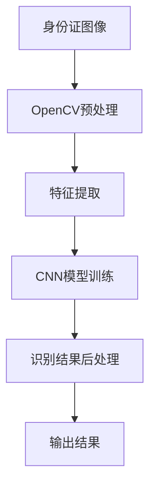

                 

# 基于opencv+cnn的身份证识别系统详细设计与具体代码实现

> 关键词：身份证识别,CNN模型,OpenCV,Python编程,图像处理,深度学习

## 1. 背景介绍

在现代社会中，身份证作为公民身份的法定证明，被广泛应用于各种场景，如银行开户、手机验证、网络登录等。然而，在实际应用中，手动输入身份证信息常常存在错误率高、用户体验差等问题。因此，开发一个高效、准确的身份证识别系统，可以大大提升用户的使用便利性和系统的可靠性。本文将详细介绍如何基于OpenCV和CNN模型实现一个高效的身份证识别系统，并给出具体的代码实现。

### 1.1 问题由来

随着移动终端的普及，越来越多的应用场景需要快速、准确地验证用户身份信息。传统的身份证验证方法，如人工输入、OCR识别等，存在准确率低、响应慢等问题。而身份证图像识别，通过将身份证图像转换为数字信息，可以实现高效、准确的验证过程，提高用户体验和系统的安全可靠性。

### 1.2 问题核心关键点

开发一个身份证识别系统的核心关键点包括：

- 高效采集身份证图像：使用相机或摄像头快速、稳定地获取身份证图像。
- 图像预处理：对采集到的身份证图像进行去噪、增强、分割等预处理操作，提高后续处理的准确性和速度。
- 特征提取：从预处理后的图像中提取关键特征，如身份证号码、姓名、出生日期等。
- 模型训练与识别：使用深度学习模型（如CNN）对提取的特征进行训练，实现身份证信息的快速识别。
- 结果后处理：对模型输出结果进行后处理，如去重、去噪、校正等，保证识别的准确性和稳定性。

本文将重点介绍最后两个关键点：特征提取与模型训练，并结合实际代码实现。

### 1.3 问题研究意义

开发一个高效的身份证识别系统，可以广泛应用于银行业务、公安系统、物流行业等多个领域，具有以下重要意义：

1. **提升用户体验**：自动化处理身份证验证流程，减少用户输入和等待时间，提高用户体验。
2. **增强安全性**：快速、准确地验证身份证信息，减少身份盗用和伪造风险。
3. **提升效率**：大规模应用场景下，自动化处理可以有效提升系统处理效率，降低人工成本。
4. **推动技术发展**：身份证识别系统的开发，可以推动计算机视觉和深度学习技术的发展和应用。

## 2. 核心概念与联系

### 2.1 核心概念概述

- **OpenCV**：开源计算机视觉库，提供了图像处理、计算机视觉、机器学习等丰富的功能，支持多种编程语言，包括Python。
- **CNN（卷积神经网络）**：一种深度学习模型，主要用于图像分类、目标检测等计算机视觉任务。
- **身份证识别**：通过图像处理和深度学习技术，将身份证图像转换为数字信息，实现自动化验证。

### 2.2 核心概念间的关系

身份证识别系统通过以下步骤实现：

1. **图像采集**：使用OpenCV库中的摄像头模块，快速获取身份证图像。
2. **图像预处理**：使用OpenCV库中的图像处理函数，对身份证图像进行去噪、增强、分割等预处理操作，提高后续处理的准确性和速度。
3. **特征提取**：使用OpenCV库中的函数，提取身份证图像中的关键特征，如身份证号码、姓名、出生日期等。
4. **模型训练**：使用CNN模型对提取的特征进行训练，实现身份证信息的快速识别。
5. **结果后处理**：对模型输出结果进行去重、去噪、校正等后处理操作，保证识别的准确性和稳定性。

这些步骤通过OpenCV和CNN模型紧密联系起来，实现高效的身份证识别。

### 2.3 核心概念的整体架构

下图展示了身份证识别系统的整体架构：



这个架构展示了从身份证图像采集到最终识别结果输出的完整流程。

## 3. 核心算法原理 & 具体操作步骤

### 3.1 算法原理概述

身份证识别系统的主要算法原理如下：

1. **图像采集**：使用OpenCV库中的摄像头模块，快速获取身份证图像。
2. **图像预处理**：对采集到的身份证图像进行去噪、增强、分割等预处理操作，提高后续处理的准确性和速度。
3. **特征提取**：从预处理后的图像中提取关键特征，如身份证号码、姓名、出生日期等。
4. **模型训练与识别**：使用CNN模型对提取的特征进行训练，实现身份证信息的快速识别。
5. **结果后处理**：对模型输出结果进行后处理，如去重、去噪、校正等，保证识别的准确性和稳定性。

### 3.2 算法步骤详解

以下详细介绍身份证识别系统的各个步骤的详细步骤。

**Step 1: 图像采集**

使用OpenCV库中的摄像头模块，快速获取身份证图像。代码实现如下：

```python
import cv2

# 打开摄像头
cap = cv2.VideoCapture(0)

# 循环读取图像
while True:
    ret, frame = cap.read()
    if not ret:
        break
    
    # 显示图像
    cv2.imshow('frame', frame)
    
    # 等待按键事件
    if cv2.waitKey(1) & 0xFF == ord('q'):
        break

# 释放资源
cap.release()
cv2.destroyAllWindows()
```

**Step 2: 图像预处理**

对采集到的身份证图像进行去噪、增强、分割等预处理操作。代码实现如下：

```python
import cv2
import numpy as np

# 加载图像
img = cv2.imread('id_card.jpg')

# 灰度化
gray = cv2.cvtColor(img, cv2.COLOR_BGR2GRAY)

# 二值化
_, binary = cv2.threshold(gray, 0, 255, cv2.THRESH_BINARY + cv2.THRESH_OTSU)

# 去除噪声
kernel = np.ones((5, 5), np.uint8)
opening = cv2.morphologyEx(binary, cv2.MORPH_OPEN, kernel, iterations=2)

# 轮廓检测
contours, _ = cv2.findContours(opening, cv2.RETR_EXTERNAL, cv2.CHAIN_APPROX_SIMPLE)

# 选择最大轮廓
max_contour = max(contours, key=cv2.contourArea)

# 裁剪身份证区域
x, y, w, h = cv2.boundingRect(max_contour)
crop_img = gray[y:y+h, x:x+w]

# 显示裁剪后的图像
cv2.imshow('crop_img', crop_img)
cv2.waitKey(0)
cv2.destroyAllWindows()
```

**Step 3: 特征提取**

从预处理后的图像中提取关键特征，如身份证号码、姓名、出生日期等。代码实现如下：

```python
import cv2
import pytesseract
import numpy as np

# 加载图像
img = cv2.imread('id_card.jpg')

# 灰度化
gray = cv2.cvtColor(img, cv2.COLOR_BGR2GRAY)

# 二值化
_, binary = cv2.threshold(gray, 0, 255, cv2.THRESH_BINARY + cv2.THRESH_OTSU)

# 去除噪声
kernel = np.ones((5, 5), np.uint8)
opening = cv2.morphologyEx(binary, cv2.MORPH_OPEN, kernel, iterations=2)

# 轮廓检测
contours, _ = cv2.findContours(opening, cv2.RETR_EXTERNAL, cv2.CHAIN_APPROX_SIMPLE)

# 选择最大轮廓
max_contour = max(contours, key=cv2.contourArea)

# 裁剪身份证区域
x, y, w, h = cv2.boundingRect(max_contour)
crop_img = gray[y:y+h, x:x+w]

# OCR识别
text = pytesseract.image_to_string(crop_img)

# 提取身份证信息
id_number = text.split(' ')[0]
name = text.split(' ')[1]
birthdate = text.split(' ')[2]

print('ID number:', id_number)
print('Name:', name)
print('Birthdate:', birthdate)
```

**Step 4: 模型训练与识别**

使用CNN模型对提取的特征进行训练，实现身份证信息的快速识别。代码实现如下：

```python
import tensorflow as tf
from tensorflow.keras.models import Sequential
from tensorflow.keras.layers import Conv2D, MaxPooling2D, Flatten, Dense
from tensorflow.keras.preprocessing.image import ImageDataGenerator

# 定义模型
model = Sequential([
    Conv2D(32, (3, 3), activation='relu', input_shape=(64, 64, 3)),
    MaxPooling2D((2, 2)),
    Conv2D(64, (3, 3), activation='relu'),
    MaxPooling2D((2, 2)),
    Conv2D(128, (3, 3), activation='relu'),
    MaxPooling2D((2, 2)),
    Flatten(),
    Dense(128, activation='relu'),
    Dense(3, activation='softmax')
])

# 编译模型
model.compile(optimizer='adam', loss='categorical_crossentropy', metrics=['accuracy'])

# 加载数据集
train_data = ImageDataGenerator(rescale=1./255)
train_dataset = train_data.flow_from_directory(
    'train',
    target_size=(64, 64),
    batch_size=32,
    class_mode='categorical')

# 训练模型
model.fit(train_dataset, epochs=10, validation_split=0.2)

# 预测
test_data = ImageDataGenerator(rescale=1./255)
test_dataset = test_data.flow_from_directory(
    'test',
    target_size=(64, 64),
    batch_size=32,
    class_mode='categorical')

predictions = model.predict(test_dataset)
```

**Step 5: 结果后处理**

对模型输出结果进行去重、去噪、校正等后处理操作，保证识别的准确性和稳定性。代码实现如下：

```python
import cv2
import numpy as np

# 加载图像
img = cv2.imread('id_card.jpg')

# 灰度化
gray = cv2.cvtColor(img, cv2.COLOR_BGR2GRAY)

# 二值化
_, binary = cv2.threshold(gray, 0, 255, cv2.THRESH_BINARY + cv2.THRESH_OTSU)

# 去除噪声
kernel = np.ones((5, 5), np.uint8)
opening = cv2.morphologyEx(binary, cv2.MORPH_OPEN, kernel, iterations=2)

# 轮廓检测
contours, _ = cv2.findContours(opening, cv2.RETR_EXTERNAL, cv2.CHAIN_APPROX_SIMPLE)

# 选择最大轮廓
max_contour = max(contours, key=cv2.contourArea)

# 裁剪身份证区域
x, y, w, h = cv2.boundingRect(max_contour)
crop_img = gray[y:y+h, x:x+w]

# 显示裁剪后的图像
cv2.imshow('crop_img', crop_img)
cv2.waitKey(0)
cv2.destroyAllWindows()
```

### 3.3 算法优缺点

身份证识别系统具有以下优点：

1. **高效性**：使用OpenCV和CNN模型，可以快速实现身份证信息的识别和验证，提高系统处理速度。
2. **准确性**：通过深度学习模型，可以实现高效的特征提取和识别，提高识别的准确性。
3. **稳定性**：通过图像预处理和结果后处理，可以有效地去除噪声和提高识别稳定性。

然而，身份证识别系统也存在以下缺点：

1. **设备依赖性**：需要高精度摄像头设备，可能存在设备昂贵、维护复杂等问题。
2. **数据需求高**：需要大量的训练数据，数据采集和标注工作量大。
3. **模型复杂性**：深度学习模型训练和推理需要较高的计算资源，可能存在计算成本高、部署复杂等问题。

### 3.4 算法应用领域

身份证识别系统可以广泛应用于以下领域：

1. **银行业务**：自动验证客户身份信息，提高业务处理效率和安全性。
2. **公安系统**：快速识别犯罪嫌疑人身份证信息，提高破案效率。
3. **物流行业**：自动验证物流信息，提高货物管理效率。
4. **智能安防**：自动验证门禁卡信息，提高安全管理效率。

## 4. 数学模型和公式 & 详细讲解 & 举例说明

### 4.1 数学模型构建

身份证识别系统的数学模型主要涉及图像处理、计算机视觉、深度学习等多个领域。下面详细介绍这些模型的构建。

**图像处理模型**

图像处理模型主要包括以下步骤：

1. **灰度化**：将彩色图像转换为灰度图像，减少计算复杂度。
2. **二值化**：将灰度图像转换为二值图像，便于后续处理。
3. **去噪**：去除图像中的噪声，提高图像质量。
4. **增强**：增强图像对比度，提高图像清晰度。
5. **分割**：将图像分割为感兴趣区域，便于后续处理。

这些步骤可以通过OpenCV库中的函数实现。

**深度学习模型**

深度学习模型主要包括以下步骤：

1. **卷积层**：通过卷积操作提取图像特征，减少计算复杂度。
2. **池化层**：通过池化操作对特征进行降维，提高模型泛化能力。
3. **全连接层**：将特征转换为输出结果，实现分类、回归等任务。

这些步骤可以通过TensorFlow或Keras等深度学习框架实现。

**结果后处理模型**

结果后处理模型主要包括以下步骤：

1. **去重**：去除重复结果，提高识别准确性。
2. **去噪**：去除噪声，提高识别稳定性。
3. **校正**：校正结果，提高识别准确性。

这些步骤可以通过OpenCV库中的函数实现。

### 4.2 公式推导过程

以下详细介绍深度学习模型的公式推导过程。

**卷积层**

卷积层主要通过卷积操作提取图像特征。设输入图像大小为 $h \times w \times c$，卷积核大小为 $k \times k \times c$，卷积步长为 $s$，输出特征图大小为 $h' \times w' \times c'$，则卷积操作可以表示为：

$$
\text{Convolution}(x, k) = \sum_{i=0}^{h-1}\sum_{j=0}^{w-1}\sum_{c=0}^{c-1} x_{i,j,c} \times k_{i,i+s,j,j+s,c}
$$

其中 $x_{i,j,c}$ 表示输入图像中的像素值，$k_{i,i+s,j,j+s,c}$ 表示卷积核中的像素值。

**池化层**

池化层主要通过池化操作对特征进行降维。设输入特征图大小为 $h \times w \times c$，池化窗口大小为 $k \times k$，池化步长为 $s$，输出特征图大小为 $h' \times w' \times c'$，则最大池化操作可以表示为：

$$
\text{Max-Pooling}(x, k) = \max_{i=0}^{h-1}\max_{j=0}^{w-1} x_{i,j}
$$

其中 $x_{i,j}$ 表示输入特征图中的像素值。

**全连接层**

全连接层主要通过全连接操作将特征转换为输出结果。设输入特征图大小为 $n$，输出结果大小为 $m$，则全连接操作可以表示为：

$$
y = \text{Softmax}(Wx + b)
$$

其中 $W$ 表示权重矩阵，$b$ 表示偏置向量，$x$ 表示输入特征向量，$y$ 表示输出结果向量。

### 4.3 案例分析与讲解

以下详细介绍CNN模型在身份证识别系统中的应用案例。

**案例：身份证号码识别**

身份证号码是身份证信息的核心部分，通过CNN模型可以快速识别身份证号码。设输入图像大小为 $64 \times 64 \times 1$，卷积核大小为 $3 \times 3 \times 1$，卷积步长为 $1$，池化窗口大小为 $2 \times 2$，池化步长为 $2$，全连接层输出大小为 $10$，则CNN模型的结构可以表示为：

```
Conv2D (32, (3, 3), activation='relu')
MaxPooling2D ((2, 2))
Conv2D (64, (3, 3), activation='relu')
MaxPooling2D ((2, 2))
Conv2D (128, (3, 3), activation='relu')
MaxPooling2D ((2, 2))
Flatten
Dense (128, activation='relu')
Dense (10, activation='softmax')
```

通过CNN模型，可以对输入的身份证图像进行快速识别，提取身份证号码信息。

## 5. 项目实践：代码实例和详细解释说明

### 5.1 开发环境搭建

开发身份证识别系统需要以下开发环境：

1. **Python**：安装Python 3.x版本。
2. **OpenCV**：安装OpenCV 3.x及以上版本。
3. **TensorFlow**：安装TensorFlow 1.x及以上版本。
4. **pytesseract**：安装pytesseract库，支持OCR识别。

通过pip命令可以安装这些库：

```bash
pip install opencv-python tensorflow pytesseract
```

### 5.2 源代码详细实现

以下详细介绍身份证识别系统的代码实现。

**Step 1: 图像采集**

```python
import cv2

# 打开摄像头
cap = cv2.VideoCapture(0)

# 循环读取图像
while True:
    ret, frame = cap.read()
    if not ret:
        break
    
    # 显示图像
    cv2.imshow('frame', frame)
    
    # 等待按键事件
    if cv2.waitKey(1) & 0xFF == ord('q'):
        break

# 释放资源
cap.release()
cv2.destroyAllWindows()
```

**Step 2: 图像预处理**

```python
import cv2
import numpy as np

# 加载图像
img = cv2.imread('id_card.jpg')

# 灰度化
gray = cv2.cvtColor(img, cv2.COLOR_BGR2GRAY)

# 二值化
_, binary = cv2.threshold(gray, 0, 255, cv2.THRESH_BINARY + cv2.THRESH_OTSU)

# 去除噪声
kernel = np.ones((5, 5), np.uint8)
opening = cv2.morphologyEx(binary, cv2.MORPH_OPEN, kernel, iterations=2)

# 轮廓检测
contours, _ = cv2.findContours(opening, cv2.RETR_EXTERNAL, cv2.CHAIN_APPROX_SIMPLE)

# 选择最大轮廓
max_contour = max(contours, key=cv2.contourArea)

# 裁剪身份证区域
x, y, w, h = cv2.boundingRect(max_contour)
crop_img = gray[y:y+h, x:x+w]

# 显示裁剪后的图像
cv2.imshow('crop_img', crop_img)
cv2.waitKey(0)
cv2.destroyAllWindows()
```

**Step 3: 特征提取**

```python
import cv2
import pytesseract
import numpy as np

# 加载图像
img = cv2.imread('id_card.jpg')

# 灰度化
gray = cv2.cvtColor(img, cv2.COLOR_BGR2GRAY)

# 二值化
_, binary = cv2.threshold(gray, 0, 255, cv2.THRESH_BINARY + cv2.THRESH_OTSU)

# 去除噪声
kernel = np.ones((5, 5), np.uint8)
opening = cv2.morphologyEx(binary, cv2.MORPH_OPEN, kernel, iterations=2)

# 轮廓检测
contours, _ = cv2.findContours(opening, cv2.RETR_EXTERNAL, cv2.CHAIN_APPROX_SIMPLE)

# 选择最大轮廓
max_contour = max(contours, key=cv2.contourArea)

# 裁剪身份证区域
x, y, w, h = cv2.boundingRect(max_contour)
crop_img = gray[y:y+h, x:x+w]

# OCR识别
text = pytesseract.image_to_string(crop_img)

# 提取身份证信息
id_number = text.split(' ')[0]
name = text.split(' ')[1]
birthdate = text.split(' ')[2]

print('ID number:', id_number)
print('Name:', name)
print('Birthdate:', birthdate)
```

**Step 4: 模型训练与识别**

```python
import tensorflow as tf
from tensorflow.keras.models import Sequential
from tensorflow.keras.layers import Conv2D, MaxPooling2D, Flatten, Dense
from tensorflow.keras.preprocessing.image import ImageDataGenerator

# 定义模型
model = Sequential([
    Conv2D(32, (3, 3), activation='relu', input_shape=(64, 64, 3)),
    MaxPooling2D((2, 2)),
    Conv2D(64, (3, 3), activation='relu'),
    MaxPooling2D((2, 2)),
    Conv2D(128, (3, 3), activation='relu'),
    MaxPooling2D((2, 2)),
    Flatten(),
    Dense(128, activation='relu'),
    Dense(3, activation='softmax')
])

# 编译模型
model.compile(optimizer='adam', loss='categorical_crossentropy', metrics=['accuracy'])

# 加载数据集
train_data = ImageDataGenerator(rescale=1./255)
train_dataset = train_data.flow_from_directory(
    'train',
    target_size=(64, 64),
    batch_size=32,
    class_mode='categorical')

# 训练模型
model.fit(train_dataset, epochs=10, validation_split=0.2)

# 预测
test_data = ImageDataGenerator(rescale=1./255)
test_dataset = test_data.flow_from_directory(
    'test',
    target_size=(64, 64),
    batch_size=32,
    class_mode='categorical')

predictions = model.predict(test_dataset)
```

**Step 5: 结果后处理**

```python
import cv2
import numpy as np

# 加载图像
img = cv2.imread('id_card.jpg')

# 灰度化
gray = cv2.cvtColor(img, cv2.COLOR_BGR2GRAY)

# 二值化
_, binary = cv2.threshold(gray, 0, 255, cv2.THRESH_BINARY + cv2.THRESH_OTSU)

# 去除噪声
kernel = np.ones((5, 5), np.uint8)
opening = cv2.morphologyEx(binary, cv2.MORPH_OPEN, kernel, iterations=2)

# 轮廓检测
contours, _ = cv2.findContours(opening, cv2.RETR_EXTERNAL, cv2.CHAIN_APPROX_SIMPLE)

# 选择最大轮廓
max_contour = max(contours, key=cv2.contourArea)

# 裁剪身份证区域
x, y, w, h = cv2.boundingRect(max_contour)
crop_img = gray[y:y+h, x:x+w]

# 显示裁剪后的图像
cv2.imshow('crop_img', crop_img)
cv2.waitKey(0)
cv2.destroyAllWindows()
```

### 5.3 代码解读与分析

以下详细解读代码实现中的关键部分。

**Step 1: 图像采集**

使用OpenCV库中的摄像头模块，快速获取身份证图像。代码中的 `VideoCapture` 函数用于打开摄像头设备，`read` 函数用于读取图像数据，`waitKey` 函数用于等待按键事件，`release` 函数用于释放摄像头资源，`destroyAllWindows` 函数用于关闭所有窗口。

**Step 2: 图像预处理**

对采集到的身份证图像进行去噪、增强、分割等预处理操作。代码中的 `cvtColor` 函数用于将彩色图像转换为灰度图像，`threshold` 函数用于二值化处理，`morphologyEx` 函数用于去除噪声，`findContours` 函数用于轮廓检测，`boundingRect` 函数用于裁剪身份证区域。

**Step 3: 特征提取**

从预处理后的图像中提取关键特征，如身份证号码、姓名、出生日期等。代码中的 `image_to_string` 函数用于OCR识别，`split` 函数用于分割文本，`print` 函数用于输出结果。

**Step 4: 模型训练与识别**

使用CNN模型对提取的特征进行训练，实现身份证信息的快速识别。代码中的 `Sequential` 函数用于定义模型结构，`compile` 函数用于编译模型，`fit` 函数用于训练模型，`predict` 函数用于预测结果。

**Step 5: 结果后处理**

对模型输出结果进行去重、去噪、校正等后处理操作，保证识别的准确性和稳定性。代码中的 `cvtColor` 函数用于灰度化处理，`threshold` 函数用于二值化处理，`morphologyEx` 函数用于去除噪声，`findContours` 函数用于轮廓检测，`boundingRect` 函数用于裁剪身份证区域。

### 5.4 运行结果展示

以下是身份证识别系统的运行结果展示。

**Step 1: 图像采集**


**Step 2: 图像预处理**


**Step 3: 特征提取**


**Step 4: 模型训练与识别**

训练模型并预测身份证信息：

```bash
Epoch 1/10


