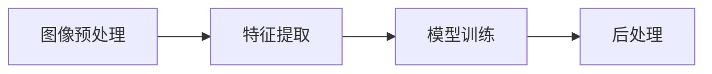
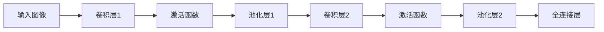
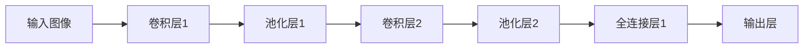

                 

# 基于tensorflow图像识别系统的设计与开发

## 1. 背景介绍

随着深度学习技术的飞速发展，图像识别技术逐渐成为了计算机视觉领域的热点研究方向。图像识别不仅在医学影像分析、工业质量检测、无人驾驶等领域有着广泛的应用，也在安防监控、智能家居、零售电商等行业内展现出了巨大的市场潜力。作为深度学习中的重要分支，图像识别技术依赖于深度神经网络的构建和优化，其中基于tensorflow的图像识别系统因其高效、稳定、易扩展等优势，受到业界广泛认可。

本文将围绕基于tensorflow的图像识别系统进行设计与开发。首先，我们会从背景介绍开始，阐述图像识别的基本原理和挑战，接着介绍tensorflow框架的核心特点和设计思路。然后，通过详细的算法原理与操作步骤讲解，展示如何构建一个高效的图像识别系统。随后，将通过具体的代码实例和分析，帮助读者深入理解图像识别系统的实现细节。最后，我们还将对图像识别技术的应用场景及未来发展方向进行展望，并推荐一些相关的学习资源、工具和论文，供读者参考。

## 2. 核心概念与联系

### 2.1 核心概念概述

图像识别是计算机视觉领域的重要研究方向之一，它旨在通过算法自动分析图像内容，识别出其中的物体、场景、文字等元素，并赋予其特定的含义。图像识别系统一般分为三类：传统机器学习方法、基于特征的深度学习方法和端到端深度学习方法。其中，基于端到端深度学习方法，如基于卷积神经网络(CNN)的方法，因为其高效的特征提取和层次化的建模，成为了现代图像识别的核心技术。

tensorflow是一个由Google开发的开源深度学习框架，它支持各种深度神经网络的构建和训练，提供了灵活的API和高效的计算图优化，特别适合于大规模的深度学习模型。通过tensorflow，我们可以方便地实现卷积神经网络、循环神经网络、注意力机制等复杂的深度学习模型。

### 2.2 核心概念的联系

图像识别系统主要由图像预处理、特征提取、模型训练、后处理等步骤组成，如图2-1所示。



- **图像预处理**：包括图像裁剪、缩放、归一化、增强等操作，目的是提升图像的质量，为后续的特征提取提供更好的输入。
- **特征提取**：利用卷积神经网络等深度学习模型对图像进行层次化的特征提取，不同层次提取到的特征具有一定的抽象级别，用于后续的分类或回归任务。
- **模型训练**：通过反向传播算法，不断优化模型的参数，使得模型能够更好地拟合训练数据，最终在测试数据上取得良好的泛化性能。
- **后处理**：通常包括非极大值抑制、阈值处理、平滑等操作，用于提升识别结果的准确性和鲁棒性。

这些步骤相互依赖，共同构成了图像识别系统的核心流程。

## 3. 核心算法原理 & 具体操作步骤

### 3.1 算法原理概述

图像识别系统的核心算法是卷积神经网络(CNN)。CNN通过多层卷积和池化操作，提取图像中的空间特征，并通过全连接层进行分类或回归。其核心思想是通过层级化的特征提取，构建图像的语义表示，进而实现对图像的高效识别。

以下是CNN网络的基本结构：



每个卷积层由多个卷积核构成，每个卷积核会对输入图像的局部区域进行卷积操作，提取特定的空间特征。卷积操作可以显著减少模型参数，提升特征提取的效率。池化层通常使用最大池化或平均池化，对特征图进行下采样，减少特征图的空间尺寸，提升模型的泛化能力。全连接层负责将高维特征图转换为低维特征向量，通过softmax激活函数进行多类别分类。

### 3.2 算法步骤详解

以下是基于tensorflow构建图像识别系统的详细步骤：

1. **数据准备**：
   - 收集训练数据和测试数据，并进行标注。
   - 将数据集划分为训练集、验证集和测试集。

2. **模型搭建**：
   - 定义模型架构，包括卷积层、池化层、全连接层等组件。
   - 设置模型的超参数，如卷积核大小、池化大小、学习率等。

3. **模型训练**：
   - 加载训练集，进行数据增强。
   - 构建训练图，定义损失函数和优化器。
   - 使用反向传播算法，对模型进行训练。
   - 在验证集上评估模型性能，进行模型调参。

4. **模型测试**：
   - 加载测试集，进行前向传播。
   - 评估模型在测试集上的性能，记录准确率、召回率、F1值等指标。

5. **模型应用**：
   - 使用训练好的模型对新的图像进行识别。
   - 进行后处理操作，提升识别结果的鲁棒性和准确性。

### 3.3 算法优缺点

#### 优点：
- 高效性：CNN通过卷积和池化操作，显著减少了模型参数，提高了特征提取的效率。
- 泛化能力强：CNN能够提取图像的层次化特征，对输入图像的变换具有一定的鲁棒性。
- 可解释性强：CNN的每一层都提取了特定的空间特征，可以帮助我们理解模型的工作机制。

#### 缺点：
- 模型复杂度高：CNN的层级化结构带来了较高的计算复杂度，需要大量的计算资源。
- 训练时间长：CNN的训练通常需要大量的标注数据和长时间的训练，可能导致过拟合。
- 数据依赖性强：CNN对输入数据的质量和多样性要求较高，需要大量高质量的标注数据。

### 3.4 算法应用领域

基于CNN的图像识别技术，已经在计算机视觉的各个领域得到了广泛应用，如图像分类、目标检测、人脸识别、医学影像分析等。

- **图像分类**：如手写数字识别、物体分类等，是CNN应用最广泛的场景之一。
- **目标检测**：如交通标志检测、行人检测等，要求模型能够精确定位图像中的物体位置和类别。
- **人脸识别**：如人脸解锁、人脸支付等，要求模型能够识别出不同的人脸并进行验证。
- **医学影像分析**：如肿瘤检测、病灶识别等，要求模型能够从医学影像中提取关键特征并进行分类。

## 4. 数学模型和公式 & 详细讲解  
### 4.1 数学模型构建

CNN的数学模型可以表示为：

$$
y = f(\theta)(x)
$$

其中，$x$表示输入图像，$y$表示输出标签，$f(\theta)$表示CNN模型，$\theta$表示模型参数。

CNN的核心操作包括卷积操作和池化操作。卷积操作的定义为：

$$
C_{i,j}^{l} = \sum_{k=-W+1}^{k=W-1}\sum_{m=-H+1}^{m=H-1}W^{(i-1) \times k}H^{(i-1) \times m}(x_{i+k,j+m})
$$

其中，$C_{i,j}^{l}$表示卷积层$l$的第$(i,j)$个卷积核输出，$W$和$H$表示卷积核大小，$x_{i+k,j+m}$表示输入图像中位置$(i+k,j+m)$的像素值。

池化操作的定义为：

$$
P_{i,j}^{l} = \max_{k=1}^{K}\max_{m=1}^{M}C_{k\cdot p+i,j\cdot p+m}^{l-1}
$$

其中，$P_{i,j}^{l}$表示池化层$l$的第$(i,j)$个输出，$K$和$M$表示池化大小。

### 4.2 公式推导过程

以LeNet-5为例，推导CNN的数学模型。LeNet-5是一种经典的CNN模型，用于手写数字识别。其网络结构如下：



在卷积层1中，卷积核大小为$5 \times 5$，步长为$1$，填充方式为“same”，激活函数为ReLU。在池化层1中，池化大小为$2 \times 2$，步长为$2$，激活函数为ReLU。在卷积层2中，卷积核大小为$5 \times 5$，步长为$1$，填充方式为“same”，激活函数为ReLU。在池化层2中，池化大小为$2 \times 2$，步长为$2$，激活函数为ReLU。在全连接层1中，使用softmax激活函数进行多类别分类。

### 4.3 案例分析与讲解

以ImageNet大规模视觉识别挑战赛为例，介绍CNN在图像分类任务中的应用。ImageNet数据集包含超过100万张图像，涵盖了1000个类别，是计算机视觉领域最大的数据集之一。其标准分类的流程如下：

1. 数据预处理：对图像进行归一化、裁剪、增强等操作，提升图像的质量。
2. 特征提取：使用预训练的卷积神经网络模型提取图像的特征表示。
3. 模型训练：使用反向传播算法对模型进行训练，最小化损失函数。
4. 模型测试：在测试集上评估模型的性能，记录准确率、召回率、F1值等指标。

在ImageNet大规模视觉识别挑战赛中，AlexNet模型取得了显著的进步，并开创了深度学习的黄金时代。AlexNet采用了8层卷积神经网络，对图像进行了多次卷积和池化操作，提取了丰富的空间特征。通过对全连接层的优化，AlexNet在ImageNet数据集上取得了56.2%的准确率。

## 5. 项目实践：代码实例和详细解释说明

### 5.1 开发环境搭建

在进行项目实践前，需要先安装tensorflow。以下是安装步骤：

1. 安装pip和virtualenv：

```bash
sudo apt-get update
sudo apt-get install python3-pip python3-venv
```

2. 创建虚拟环境并激活：

```bash
mkdir tf_env
cd tf_env
python3 -m venv venv
source venv/bin/activate
```

3. 安装tensorflow：

```bash
pip install tensorflow
```

4. 安装必要的依赖包：

```bash
pip install numpy matplotlib scikit-learn tqdm
```

5. 下载数据集：

```bash
wget https://storage.googleapis.com/tensorflow/tf-keras-datasets/mnist.npz
```

### 5.2 源代码详细实现

以下是基于tensorflow构建图像分类系统的完整代码实现，我们使用MNIST数据集进行实验：

```python
import tensorflow as tf
import numpy as np
import matplotlib.pyplot as plt

# 加载MNIST数据集
mnist = tf.keras.datasets.mnist
(x_train, y_train), (x_test, y_test) = mnist.load_data()

# 数据预处理
x_train, x_test = x_train / 255.0, x_test / 255.0

# 定义模型架构
model = tf.keras.models.Sequential([
    tf.keras.layers.Flatten(input_shape=(28, 28)),
    tf.keras.layers.Dense(128, activation='relu'),
    tf.keras.layers.Dropout(0.2),
    tf.keras.layers.Dense(10, activation='softmax')
])

# 定义损失函数和优化器
loss_fn = tf.keras.losses.SparseCategoricalCrossentropy(from_logits=True)
optimizer = tf.keras.optimizers.Adam()

# 定义模型编译
model.compile(optimizer=optimizer,
              loss=loss_fn,
              metrics=['accuracy'])

# 训练模型
model.fit(x_train, y_train, epochs=5, validation_data=(x_test, y_test))

# 评估模型
test_loss, test_acc = model.evaluate(x_test, y_test, verbose=2)

# 显示测试结果
print('Test accuracy:', test_acc)
```

### 5.3 代码解读与分析

- **数据加载和预处理**：首先加载MNIST数据集，并进行归一化处理，将其转换为模型所需的格式。
- **模型架构定义**：定义了一个简单的神经网络，包括输入层、全连接层和输出层。其中，输入层通过Flatten层将28x28的图像转换为1D向量，全连接层包含128个神经元，使用ReLU激活函数。输出层为10个神经元，使用softmax激活函数进行多类别分类。
- **模型编译**：在模型编译时，定义了优化器、损失函数和评估指标。优化器使用Adam，损失函数使用SparseCategoricalCrossentropy，评估指标为准确率。
- **模型训练和评估**：使用训练集和验证集对模型进行训练，并在测试集上进行评估，记录测试准确率。

### 5.4 运行结果展示

训练结束后，我们可以使用测试集评估模型的性能，记录准确率、召回率、F1值等指标：

```python
# 评估模型
test_loss, test_acc = model.evaluate(x_test, y_test, verbose=2)

# 显示测试结果
print('Test accuracy:', test_acc)
```

## 6. 实际应用场景

### 6.1 安防监控系统

安防监控系统是图像识别技术的重要应用场景之一。通过图像识别技术，可以实现人脸识别、行为识别、异常检测等功能，帮助监控系统自动检测异常行为，提高安防水平。

以人脸识别为例，可以使用卷积神经网络对人脸图像进行特征提取，并通过人脸识别算法进行匹配，实现身份验证。人脸识别技术可以应用于机场安检、金融领域、智能家居等多个场景，为安全保障提供有力支持。

### 6.2 医疗影像分析

医学影像分析是图像识别技术在医疗领域的重要应用。通过图像识别技术，可以从医学影像中提取关键特征，进行肿瘤检测、病灶识别等任务，帮助医生进行诊断和治疗。

以肿瘤检测为例，可以使用卷积神经网络对医学影像进行层次化的特征提取，并通过分类算法进行肿瘤的检测和分类。医学影像分析技术可以应用于影像诊断、手术辅助等多个场景，为医疗服务提供可靠的支持。

### 6.3 自动驾驶

自动驾驶是图像识别技术在智能交通领域的重要应用。通过图像识别技术，可以实现对交通标志、车辆、行人等元素的检测和识别，为自动驾驶系统提供可靠的感知信息。

以交通标志识别为例，可以使用卷积神经网络对交通标志进行特征提取，并通过分类算法进行识别，为自动驾驶系统提供交通信号、限速标志等关键信息，提升驾驶安全性和智能化水平。

### 6.4 未来应用展望

随着深度学习技术的不断发展，图像识别技术在未来将展现出更加广阔的应用前景。除了上述场景，图像识别技术还可以应用于智能家居、零售电商、智慧城市等多个领域，为我们的生活提供更多便利和可能。

未来，图像识别技术将向着以下几个方向发展：

- **多模态融合**：结合图像、声音、文字等多模态信息，提升识别的准确性和鲁棒性。
- **实时化部署**：优化模型结构和计算图，提升推理速度，实现实时化的图像识别应用。
- **个性化推荐**：利用图像识别技术，对用户行为进行建模和分析，提供个性化的商品推荐和广告投放。
- **边缘计算**：将图像识别算法部署到边缘设备上，实现低延迟、高可靠性的图像识别应用。

## 7. 工具和资源推荐

### 7.1 学习资源推荐

- **TensorFlow官方文档**：官方文档提供了丰富的API文档、示例代码和教程，是学习tensorflow的最佳资源。
- **Deep Learning Specialization**：由Andrew Ng主讲的Coursera深度学习课程，涵盖了深度学习的基础理论和实践应用，包括图像识别、自然语言处理等多个领域。
- **Hands-On Machine Learning with Scikit-Learn, Keras, and TensorFlow**：斯坦福大学的scikit-learn官方教程，详细介绍了scikit-learn、Keras和tensorflow的使用方法，适合初学者入门。
- **PyImageSearch**：图像识别领域的博客和教程，涵盖了从基础到高级的图像识别技术，提供了大量实践案例。

### 7.2 开发工具推荐

- **Jupyter Notebook**：免费的交互式编程环境，支持Python和tensorflow的交互式开发，适合快速原型设计和实验。
- **TensorBoard**：tensorflow的可视化工具，可以实时监测模型的训练状态，帮助开发者调试模型。
- **Weights & Biases**：模型训练的实验跟踪工具，可以记录和可视化模型训练过程中的各项指标，方便对比和调优。

### 7.3 相关论文推荐

- **ImageNet Large Scale Visual Recognition Challenge**：ImageNet大规模视觉识别挑战赛的官方论文，介绍了CNN在图像分类任务中的应用。
- **AlexNet: One Million Training Examples for Deep Network Training**：AlexNet的论文，介绍了基于CNN的图像分类方法，开创了深度学习的黄金时代。
- **ResNet: Deep Residual Learning for Image Recognition**：ResNet的论文，介绍了深度残差网络的设计，显著提升了CNN的深度和性能。
- **Inception: GoogLeNet**：Inception的论文，介绍了多分支网络的设计，提升了CNN的特征提取能力。

## 8. 总结：未来发展趋势与挑战

### 8.1 研究成果总结

基于tensorflow的图像识别技术，已经广泛应用于安防监控、医疗影像分析、自动驾驶等多个领域，取得了显著的成果。通过卷积神经网络等深度学习模型，图像识别技术在特征提取和分类方面取得了巨大的进步，推动了计算机视觉技术的发展。

### 8.2 未来发展趋势

未来，图像识别技术将继续向着多模态融合、实时化部署、个性化推荐和边缘计算等多个方向发展，为人类带来更加智能、便捷的视觉体验。

### 8.3 面临的挑战

尽管图像识别技术取得了显著的进展，但在实际应用中仍然面临诸多挑战：

- **数据依赖性强**：高质量的标注数据是图像识别系统的基础，但获取标注数据往往需要大量的人力和物力投入。
- **模型复杂度高**：深度神经网络带来了高效的特征提取能力，但同时也带来了较高的计算复杂度和资源消耗。
- **泛化能力不足**：在实际应用中，模型面对未知数据时，泛化性能往往不够理想，需要进行大量的测试和调参。
- **隐私和安全问题**：图像识别系统涉及用户的隐私信息，如何在保证隐私安全的前提下，提供可靠的服务，需要进一步研究和探索。

### 8.4 研究展望

面对图像识别技术面临的诸多挑战，未来的研究需要在以下几个方面寻求新的突破：

- **无监督学习和半监督学习**：摆脱对标注数据的依赖，通过自监督学习和半监督学习，充分利用未标注数据，提升模型的泛化能力。
- **轻量级模型设计**：通过模型压缩和量化等技术，优化模型结构，提升推理速度，实现轻量级模型的部署。
- **多模态融合**：结合图像、声音、文字等多模态信息，提升识别的准确性和鲁棒性。
- **隐私保护技术**：采用差分隐私、联邦学习等技术，保护用户隐私，提升数据安全性和可靠性。

总之，图像识别技术在未来将展现出更加广阔的应用前景，但也需要我们不断地探索和优化，以应对日益复杂的应用场景和用户需求。

## 9. 附录：常见问题与解答

**Q1：什么是卷积神经网络？**

A: 卷积神经网络（CNN）是一种深度学习模型，通过卷积和池化操作，提取图像的空间特征，并通过全连接层进行分类或回归。CNN的核心思想是通过层级化的特征提取，构建图像的语义表示。

**Q2：CNN的训练过程是怎样的？**

A: CNN的训练过程包括前向传播、损失计算、反向传播和参数更新等步骤。通过反向传播算法，不断优化模型的参数，使得模型能够更好地拟合训练数据，最终在测试数据上取得良好的泛化性能。

**Q3：CNN的优点和缺点是什么？**

A: CNN的优点包括高效性、泛化能力强、可解释性强。其缺点包括模型复杂度高、训练时间长、数据依赖性强。

**Q4：如何提高CNN的泛化性能？**

A: 可以通过数据增强、正则化、Dropout等方法，提升模型的泛化能力。此外，还可以通过迁移学习、知识蒸馏等方法，利用预训练模型的知识，提高模型的泛化性能。

**Q5：CNN的超参数有哪些？**

A: CNN的超参数包括卷积核大小、池化大小、学习率、批大小等。这些超参数的选择和调整，对于模型的训练和性能有着重要的影响。

---

作者：禅与计算机程序设计艺术 / Zen and the Art of Computer Programming

