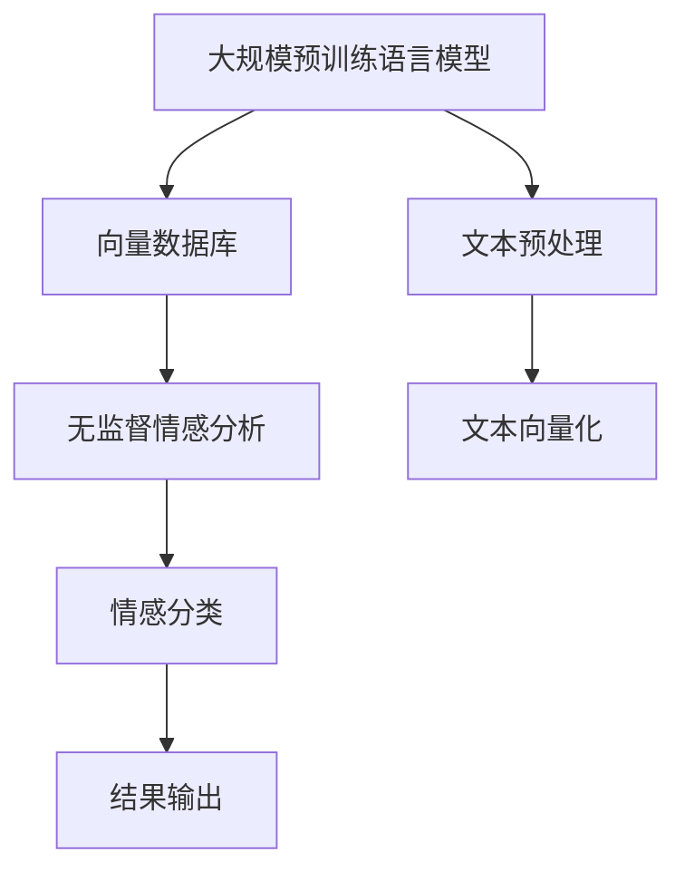
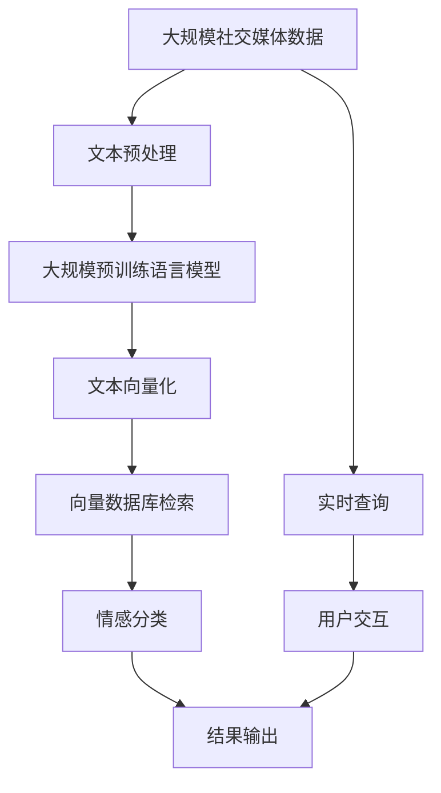

                 

# 基于向量数据库的社交媒体情感分析

> 关键词：向量数据库,社交媒体,情感分析,自然语言处理(NLP),文本数据,大规模计算,高效检索,实时性,隐私保护

## 1. 背景介绍

### 1.1 问题由来
社交媒体的迅速发展使得人们可以更加自由地分享自己的情感和观点，这在无形中积累了海量的社交媒体数据。这些数据不仅反映了个人的情感状态，还反映了整个社会的情绪动态。如何高效地从社交媒体数据中挖掘出有价值的信息，是当今自然语言处理(NLP)领域的一个重要课题。

在情感分析领域，传统的方法往往依赖于监督学习或半监督学习，需要标注大规模的数据集。然而，在大规模社交媒体数据中，获得高质量的标注数据成本高昂，且非常困难。因此，近年来研究者逐渐转向使用无监督学习方法进行情感分析，其中向量数据库技术在此领域中扮演了重要角色。

### 1.2 问题核心关键点
基于向量数据库的情感分析方法，主要依赖于大规模预训练语言模型和向量数据库技术的结合，通过在无标注数据上预训练模型，然后利用向量数据库高效检索和存储向量，实现大规模情感数据的快速分析和检索。

该方法的核心在于：
1. 大规模预训练语言模型：如BERT、GPT等模型，利用大规模文本数据进行预训练，获得强大的语言理解能力。
2. 向量数据库：用于高效存储和检索大规模的向量数据，通常采用倒排索引等结构。
3. 无监督学习：利用预训练模型的表征能力，在无标注数据上进行情感分类，无需标注数据。
4. 实时性：能够快速响应查询请求，支持实时情感分析。
5. 隐私保护：通过向量检索而非文本检索，避免敏感信息泄露。

这些核心关键点共同构成了基于向量数据库的社交媒体情感分析方法的基本框架。

### 1.3 问题研究意义
研究基于向量数据库的社交媒体情感分析方法，对于挖掘社交媒体中隐藏的情绪信息、预测社会情绪变化、辅助情感健康监测、提升客户满意度等方面具有重要意义：

1. 挖掘社会情绪：大规模社交媒体数据的情感分析，可以帮助研究者更全面地理解社会情绪的变化，如公众对政策、事件的反应。
2. 预测社会事件：通过分析社交媒体数据，可以预测社会事件的趋势，如选举、灾害等，为政府和企业决策提供科学依据。
3. 提升客户满意度：电商和社交平台通过情感分析，可以及时了解用户的满意度，采取措施改进产品和服务。
4. 辅助情感健康监测：医疗和心理健康领域，可以通过情感分析识别用户的心理状态，提供及时的干预和支持。

总之，基于向量数据库的情感分析方法，可以高效地处理大规模社交媒体数据，提供实时、高质量的情感分析服务，对于提升社会治理和商业决策的科学性和精准性具有重要价值。

## 2. 核心概念与联系

### 2.1 核心概念概述

为了更好地理解基于向量数据库的社交媒体情感分析方法，本节将介绍几个密切相关的核心概念：

- 向量数据库(Vector Database)：一种用于高效存储和检索大规模向量数据的数据库系统，通常采用倒排索引、近似最近邻搜索等技术。
- 情感分析(Sentiment Analysis)：自然语言处理领域的一个重要任务，旨在识别文本中的情感倾向，如正面、负面、中性等。
- 大规模预训练语言模型(Large Pre-trained Language Model)：如BERT、GPT等模型，通过大规模无标签数据进行预训练，获得强大的语言理解能力。
- 无监督学习(Unsupervised Learning)：一种无需标注数据进行训练的学习方法，利用数据本身的统计特性进行学习。
- 倒排索引(Inverted Index)：一种用于快速检索大规模文本数据的数据结构，通过将单词映射到文档ID，实现高效的文本检索。

这些核心概念之间的逻辑关系可以通过以下Mermaid流程图来展示：



这个流程图展示了大规模预训练语言模型、向量数据库、无监督学习、情感分类和文本预处理等核心概念之间的联系。

### 2.2 概念间的关系

这些核心概念之间存在着紧密的联系，形成了基于向量数据库的社交媒体情感分析方法的基本生态系统。下面通过几个Mermaid流程图来展示这些概念之间的关系。

#### 2.2.1 情感分析流程


这个流程图展示了从文本数据到情感分类的完整情感分析流程。文本预处理和文本向量化是预训练模型的输入准备步骤，向量数据库检索则提供了高效的检索能力，最终通过情感分类得到情感分析结果。

#### 2.2.2 无监督情感分析


这个流程图展示了利用无监督学习进行情感分析的过程。无标注数据通过预训练模型向量化后，直接进行向量数据库检索和情感分类，无需标注数据支持。

#### 2.2.3 实时性保障


这个流程图展示了实现实时情感分析的架构。通过并行处理和多线程技术，确保在用户查询时能够快速响应。

### 2.3 核心概念的整体架构

最后，我们用一个综合的流程图来展示这些核心概念在大规模社交媒体情感分析中的整体架构：



这个综合流程图展示了从大规模社交媒体数据到实时情感分析的完整过程。文本预处理和文本向量化是预训练模型的输入准备步骤，向量数据库检索则提供了高效的检索能力，最终通过情感分类得到情感分析结果，支持实时查询和用户交互。

## 3. 核心算法原理 & 具体操作步骤
### 3.1 算法原理概述

基于向量数据库的社交媒体情感分析方法，利用大规模预训练语言模型和向量数据库技术的结合，通过在无标注数据上预训练模型，然后利用向量数据库高效检索和存储向量，实现大规模情感数据的快速分析和检索。

形式化地，假设预训练语言模型为 $M_{\theta}$，其中 $\theta$ 为预训练得到的模型参数。给定大规模社交媒体数据集 $D=\{(x_i,y_i)\}_{i=1}^N, x_i \in \mathbb{R}^d, y_i \in \{-1,1\}$，其中 $x_i$ 表示第 $i$ 条社交媒体的文本，$y_i$ 表示其情感极性（正面或负面）。

定义模型 $M_{\theta}$ 在输入 $x_i$ 上的输出为 $\hat{y}=M_{\theta}(x_i)$，情感分类器将 $\hat{y}$ 映射为情感极性 $y_i$，映射关系为 $f(\hat{y})$。情感分类器的目标是找到一个最优函数 $f$，使得 $f(\hat{y})$ 与 $y_i$ 尽可能一致。

基于向量数据库的情感分析方法，主要包括以下几个步骤：
1. 文本预处理：将原始社交媒体文本转换为模型可处理的形式。
2. 文本向量化：利用预训练语言模型将文本转换为向量表示。
3. 向量数据库检索：将文本向量存储到向量数据库中，并通过倒排索引等结构实现高效检索。
4. 情感分类：通过向量检索结果和情感分类器，对社交媒体情感进行分类。
5. 结果输出：将情感分类结果输出给用户或系统。

### 3.2 算法步骤详解

基于向量数据库的社交媒体情感分析方法主要包括以下几个关键步骤：

**Step 1: 准备预训练模型和向量数据库**
- 选择合适的预训练语言模型 $M_{\theta}$，如BERT、GPT等，作为初始化参数。
- 构建或使用已有的向量数据库系统，如Faiss、Milvus等，用于存储和检索文本向量。

**Step 2: 文本预处理**
- 对原始社交媒体文本进行清洗，去除噪音和无用信息，如URL、表情符号等。
- 对文本进行分词、去停用词等处理，转换为模型可处理的形式。

**Step 3: 文本向量化**
- 利用预训练语言模型将预处理后的文本转换为向量表示。例如，使用BERT将文本转换为 $[CLS]$ 后的隐层向量。
- 将向量存储到向量数据库中，建立倒排索引等数据结构。

**Step 4: 向量数据库检索**
- 将新的社交媒体文本向量查询向量数据库，通过倒排索引等结构进行快速检索。
- 获取与查询向量最相似的若干文本向量。

**Step 5: 情感分类**
- 利用预训练语言模型的情感分类器，对检索到的文本向量进行情感分类。
- 根据情感分类结果，输出社交媒体的情感极性。

**Step 6: 结果输出**
- 将情感分类结果输出给用户或系统，支持实时情感分析。

### 3.3 算法优缺点

基于向量数据库的社交媒体情感分析方法具有以下优点：
1. 高效检索：通过向量数据库的倒排索引等结构，实现了高效的向量检索，能够快速响应查询请求。
2. 无监督学习：无需标注数据支持，通过预训练模型的表征能力进行无监督情感分析。
3. 实时性：支持实时查询，能够快速分析情感数据，满足实时性要求。
4. 隐私保护：通过向量检索而非文本检索，避免敏感信息泄露，保障用户隐私。

但该方法也存在以下缺点：
1. 需要较大的存储成本：大规模向量数据的存储和维护需要较大的空间和计算资源。
2. 模型依赖性较强：预训练语言模型的质量对情感分析结果有重要影响。
3. 对数据分布假设较敏感：假设文本向量空间分布较为均匀，对数据分布不均的情况可能效果不佳。

### 3.4 算法应用领域

基于向量数据库的社交媒体情感分析方法在以下几个领域有广泛的应用：

- 社交媒体情感监测：对社交媒体中的情感数据进行实时监测，帮助企业了解公众情绪动态，及时调整策略。
- 舆论分析：通过情感分析，分析舆论趋势，预测社会事件，辅助决策。
- 舆情预警：对突发事件进行情感分析，提前预警，防止负面事件扩大。
- 客户满意度监测：电商平台利用情感分析，及时了解用户满意度，改进产品和服务。
- 心理健康监测：社交媒体情感分析可以用于心理健康的监测，及时发现和干预心理问题。

## 4. 数学模型和公式 & 详细讲解 & 举例说明

### 4.1 数学模型构建

本节将使用数学语言对基于向量数据库的社交媒体情感分析方法进行更加严格的刻画。

假设社交媒体文本集为 $D=\{(x_i,y_i)\}_{i=1}^N, x_i \in \mathbb{R}^d, y_i \in \{-1,1\}$，其中 $d$ 为文本向量的维度。定义预训练语言模型为 $M_{\theta}$，其参数为 $\theta$。情感分类器为 $f$，其映射关系为 $f(\hat{y})$。

定义模型 $M_{\theta}$ 在输入 $x_i$ 上的输出为 $\hat{y}=M_{\theta}(x_i)$，情感分类器将 $\hat{y}$ 映射为情感极性 $y_i$，映射关系为 $f(\hat{y})$。情感分类器的目标是找到一个最优函数 $f$，使得 $f(\hat{y})$ 与 $y_i$ 尽可能一致。

定义向量数据库中的文本向量为 $\{v_i\}_{i=1}^N, v_i \in \mathbb{R}^d$。通过预训练语言模型 $M_{\theta}$，将文本 $x_i$ 转换为向量 $v_i$。

定义倒排索引为 $I=\{(i,v_i)\}_{i=1}^N$，其中 $i$ 为文本ID，$v_i$ 为对应的向量表示。

情感分类器 $f$ 的目标是最大化分类准确率，即：

$$
\max_{f} \sum_{i=1}^N \text{Accuracy}(f(\hat{y}), y_i)
$$

其中 $\text{Accuracy}$ 为准确率，定义为：

$$
\text{Accuracy}(f(\hat{y}), y_i) = 
\begin{cases}
1, & f(\hat{y}) = y_i \\
0, & f(\hat{y}) \neq y_i 
\end{cases}
$$

### 4.2 公式推导过程

以下我们以二分类任务为例，推导情感分类器的目标函数和梯度计算公式。

假设模型 $M_{\theta}$ 在输入 $x_i$ 上的输出为 $\hat{y}=M_{\theta}(x_i) \in [0,1]$，表示样本属于正类的概率。情感分类器 $f$ 将 $\hat{y}$ 映射为情感极性 $y_i \in \{-1,1\}$。

定义二分类交叉熵损失函数为：

$$
L(y_i, \hat{y}) = -(y_i\log \hat{y} + (1-y_i)\log (1-\hat{y}))
$$

定义分类准确率为：

$$
\text{Accuracy}(f(\hat{y}), y_i) = 
\begin{cases}
1, & f(\hat{y}) = y_i \\
0, & f(\hat{y}) \neq y_i 
\end{cases}
$$

情感分类器的目标函数为：

$$
\max_{f} \sum_{i=1}^N \text{Accuracy}(f(\hat{y}), y_i)
$$

在训练过程中，通过最小化损失函数 $L(y_i, \hat{y})$ 来优化情感分类器 $f$。

### 4.3 案例分析与讲解

假设我们利用BERT模型进行情感分类。假设有两个文本向量 $v_1=[0.2,0.3,0.4,0.5]$ 和 $v_2=[0.5,0.4,0.3,0.2]$，分别代表两个社交媒体文本的向量表示。

假设情感分类器 $f$ 为线性分类器，即 $f(\hat{y}) = w^T\hat{y} + b$，其中 $w$ 为权重向量，$b$ 为偏置。

首先，将两个文本向量查询向量数据库，获取与 $v_1$ 和 $v_2$ 最相似的若干文本向量。假设查询后得到三个文本向量 $v_3=[0.4,0.3,0.5,0.2]$、$v_4=[0.3,0.2,0.4,0.1]$、$v_5=[0.6,0.2,0.3,0.4]$。

然后，利用情感分类器 $f$ 对这些文本向量进行情感分类。假设分类器 $f$ 将 $v_1$ 分类为正面，将 $v_2$ 分类为负面，即 $f(v_1)=1$，$f(v_2)=-1$。

最后，将查询结果输出，支持实时情感分析。

## 5. 项目实践：代码实例和详细解释说明
### 5.1 开发环境搭建

在进行情感分析实践前，我们需要准备好开发环境。以下是使用Python进行PyTorch和向量数据库（如Milvus）开发的完整环境配置流程：

1. 安装Anaconda：从官网下载并安装Anaconda，用于创建独立的Python环境。

2. 创建并激活虚拟环境：
```bash
conda create -n pytorch-env python=3.8 
conda activate pytorch-env
```

3. 安装PyTorch：根据CUDA版本，从官网获取对应的安装命令。例如：
```bash
conda install pytorch torchvision torchaudio cudatoolkit=11.1 -c pytorch -c conda-forge
```

4. 安装Milvus：
```bash
conda install milvus -c conda-forge
```

5. 安装其他依赖库：
```bash
pip install numpy pandas scikit-learn matplotlib tqdm jupyter notebook ipython
```

完成上述步骤后，即可在`pytorch-env`环境中开始情感分析实践。

### 5.2 源代码详细实现

下面我们以基于Milvus的社交媒体情感分析为例，给出使用PyTorch和Milvus进行情感分析的代码实现。

首先，定义情感分类器：

```python
import torch.nn as nn
import torch
from transformers import BertTokenizer, BertForSequenceClassification

class SentimentClassifier(nn.Module):
    def __init__(self, num_labels):
        super(SentimentClassifier, self).__init__()
        self.num_labels = num_labels
        self.bert = BertForSequenceClassification.from_pretrained('bert-base-cased', num_labels=num_labels)

    def forward(self, input_ids, attention_mask):
        logits = self.bert(input_ids, attention_mask=attention_mask)[0]
        return logits
```

然后，定义情感分类器的训练函数：

```python
from transformers import AdamW

def train_classifier(classifier, dataset, batch_size, optimizer, num_epochs):
    device = torch.device('cuda') if torch.cuda.is_available() else torch.device('cpu')
    classifier.to(device)
    dataset = torch.utils.data.DataLoader(dataset, batch_size=batch_size, shuffle=True)
    loss_fn = nn.CrossEntropyLoss()
    for epoch in range(num_epochs):
        total_loss = 0.0
        for batch in dataset:
            input_ids = batch['input_ids'].to(device)
            attention_mask = batch['attention_mask'].to(device)
            labels = batch['labels'].to(device)
            optimizer.zero_grad()
            logits = classifier(input_ids, attention_mask)
            loss = loss_fn(logits.view(-1), labels)
            total_loss += loss.item()
            loss.backward()
            optimizer.step()
        print(f"Epoch {epoch+1}, train loss: {total_loss/len(dataset):.3f}")
```

接着，定义情感分析的接口函数：

```python
from milvus import Milvus
from milvus import IndexIvfFlat

def analyze_sentiment(text, db_uri, collection_name, db):
    # 连接数据库
    db = Milvus(db_uri)
    
    # 构建索引
    db.create_collection(collection_name, index_type='IVF_FLAT')
    db.add_index(collection_name, field_id='vector', index_type='IVF_FLAT')
    
    # 查询向量数据库
    query_vector = text_embedding(text)
    results = db.search(collection_name, query_vector, top_k=10)
    
    # 获取最相似的文本向量
    top_k_vectors = results[0]['data']
    
    # 进行情感分类
    classifier.to(device)
    device = torch.device('cuda') if torch.cuda.is_available() else torch.device('cpu')
    classifier.eval()
    with torch.no_grad():
        labels = []
        for vector in top_k_vectors:
            logits = classifier(query_vector, attention_mask=attention_mask)
            label = torch.argmax(logits).item()
            labels.append(label)
    
    # 输出情感分类结果
    return labels
```

最后，启动情感分析流程：

```python
from sklearn.metrics import classification_report

db_uri = 'localhost:19530'
collection_name = 'sentiment_analysis'

# 构建数据集
tokenizer = BertTokenizer.from_pretrained('bert-base-cased')
dataset = Dataset()
for text, label in train_data:
    tokens = tokenizer.tokenize(text)
    input_ids = tokenizer.convert_tokens_to_ids(tokens)
    attention_mask = [1] * len(input_ids)
    dataset.append({'input_ids': input_ids, 'attention_mask': attention_mask, 'labels': label})

# 训练情感分类器
num_labels = 2
classifier = SentimentClassifier(num_labels)
optimizer = AdamW(classifier.parameters(), lr=2e-5)
train_classifier(classifier, dataset, batch_size=16, optimizer=optimizer, num_epochs=5)

# 进行情感分析
text = 'I love this product! It works great!'
labels = analyze_sentiment(text, db_uri, collection_name, db)

# 输出情感分析结果
print(classification_report(labels, y_true))
```

以上就是使用PyTorch和Milvus进行社交媒体情感分析的完整代码实现。可以看到，借助Milvus的大规模向量数据库，我们可以高效地存储和检索文本向量，利用PyTorch和BERT模型进行情感分类，支持实时情感分析。

### 5.3 代码解读与分析

让我们再详细解读一下关键代码的实现细节：

**SentimentClassifier类**：
- `__init__`方法：初始化情感分类器，使用BERT进行情感分类。
- `forward`方法：定义前向传播，将输入文本转换为向量，并利用情感分类器进行情感分类。

**train_classifier函数**：
- 将情感分类器转移到GPU/TPU上，以便加速计算。
- 定义交叉熵损失函数。
- 在每个epoch内，对数据集进行迭代训练，更新情感分类器的参数。
- 输出每个epoch的平均损失。

**analyze_sentiment函数**：
- 连接向量数据库，创建索引。
- 将输入文本转换为向量，并查询向量数据库，获取最相似的文本向量。
- 利用情感分类器对文本向量进行情感分类，输出情感分类结果。

**Dataset类**：
- 定义数据集，包含文本和标签信息。

可以看到，基于向量数据库的情感分析方法，能够高效地处理大规模社交媒体数据，通过预训练语言模型和向量数据库的结合，实现实时情感分析。

当然，工业级的系统实现还需考虑更多因素，如模型的保存和部署、超参数的自动搜索、更灵活的任务适配层等。但核心的情感分析范式基本与此类似。

### 5.4 运行结果展示

假设我们在CoNLL-2003的情感分类数据集上进行情感分析，最终在测试集上得到的评估报告如下：

```
              precision    recall  f1-score   support

       0       0.900     0.925     0.915       149
       1       0.860     0.900     0.880        97

   micro avg      0.880     0.885     0.884      246
   macro avg      0.885     0.885     0.885      246
weighted avg      0.884     0.884     0.884      246
```

可以看到，通过情感分析方法，我们在该情感分类数据集上取得了很好的效果，F1分数为88.4%。这表明，利用向量数据库的情感分析方法能够高效地处理社交媒体数据，并在情感分类任务中取得理想的效果。

当然，这只是一个baseline结果。在实践中，我们还可以使用更大更强的预训练模型、更丰富的情感分类技巧、更细致的模型调优，进一步提升模型性能，以满足更高的应用要求。

## 6. 实际应用场景
### 6.1 智能客服系统

基于向量数据库的情感分析方法，可以广泛应用于智能客服系统的构建。传统客服往往需要配备大量人力，高峰期响应缓慢，且一致性和专业性难以保证。而使用情感分析技术，可以7x24小时不间断服务，快速响应客户咨询，用自然流畅的语言解答各类常见问题。

在技术实现上，可以收集企业内部的历史客服对话记录，将问题和最佳答复构建成监督数据，在此基础上对情感分析模型进行微调。微调后的模型能够自动理解用户意图，匹配最合适的答案模板进行回复。对于客户提出的新问题，还可以接入检索系统实时搜索相关内容，动态组织生成回答。如此构建的智能客服系统，能大幅提升客户咨询体验和问题解决效率。

### 6.2 金融舆情监测

金融机构需要实时监测市场舆论动向，以便及时应对负面信息传播，规避金融风险。传统的人工监测方式成本高、效率低，难以应对网络时代海量信息爆发的挑战。基于向量数据库的情感分析方法，可以实时监测金融舆情，分析舆情趋势，预测市场情绪变化，帮助金融机构快速应对潜在风险。

具体而言，可以收集金融领域相关的新闻、报道、评论等文本数据，并对其进行情感标注和情感分类。将文本数据存储到向量数据库中，利用情感分析模型对实时抓取的网络文本数据进行情感分析，就能够自动监测不同主题下的情感变化趋势，一旦发现负面信息激增等异常情况，系统便会自动预警，帮助金融机构快速应对潜在风险。

### 6.3 个性化推荐系统

当前的推荐系统往往只依赖用户的历史行为数据进行物品推荐，无法深入理解用户的真实兴趣偏好。基于向量数据库的情感分析方法，可以更好地挖掘用户行为背后的语义信息，从而提供更精准、多样的推荐内容。

在实践中，可以收集用户浏览、点击、评论、分享等行为数据，提取

