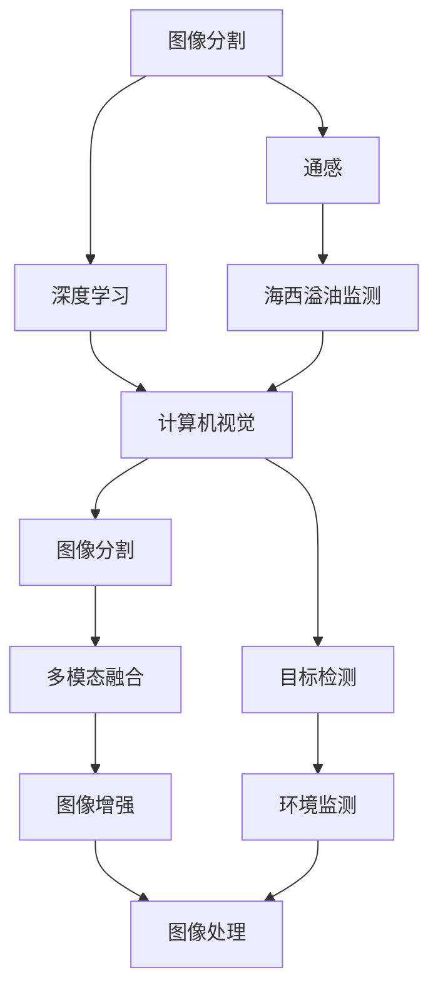

                 

# 基于图像分割模型的通感图像海西溢油监测

> 关键词：图像分割, 通感, 海西溢油, 模型监测

## 1. 背景介绍

### 1.1 问题由来
随着全球气候变化和人类活动的加剧，自然灾害和环境问题日益凸显。其中，石油泄漏是海洋环境污染的重要源头之一。尤其是在海上石油开采和运输过程中，油轮泄漏和海底管道破裂等突发事件时有发生，对海洋生态和渔业造成了严重影响。及时准确的油泄漏监测和响应，可以有效减轻灾害损失，保障海洋资源的可持续利用。

近年来，随着深度学习技术的快速发展，特别是计算机视觉和机器学习的结合，为油泄漏监测提供了新的技术手段。通过构建基于深度学习的图像分割模型，可以实时捕捉油泄漏图像中的特征信息，实现快速、精准的油泄漏检测和监测。

### 1.2 问题核心关键点
在本研究中，我们聚焦于使用基于图像分割模型的通感方法，对海西地区的溢油情况进行监测。具体问题点包括：

1. **图像分割**：如何从海洋图像中准确地分割出油泄漏区域，以提供高精度的油泄漏监测。
2. **通感**：如何将视觉信息与地理、环境等其他信息融合，提升监测的全面性和准确性。
3. **模型监测**：如何构建和维护有效的监测模型，确保油泄漏检测的及时性和可靠性。

### 1.3 问题研究意义
海洋环境监测对于海洋资源的保护和可持续利用具有重要意义。本研究旨在通过深度学习技术，提高油泄漏监测的效率和精度，为海西地区乃至全球的海洋环境保护提供支持。具体研究意义包括：

1. **提高监测效率**：相较于传统的人工监测，基于图像分割模型的通感方法可以显著提高监测速度，减少人力成本。
2. **增强监测精度**：深度学习模型可以捕捉复杂的图像特征，提升油泄漏检测的准确性。
3. **促进环保**：及时的油泄漏监测和响应，可以减轻油泄漏对海洋生态和渔业的影响，保护海洋资源。
4. **推动技术进步**：本研究探索的通感图像海西溢油监测技术，为计算机视觉与环境监测的结合提供了新思路，推动相关领域的技术发展。

## 2. 核心概念与联系

### 2.1 核心概念概述

为更好地理解基于图像分割模型的通感图像海西溢油监测方法，本节将介绍几个密切相关的核心概念：

- **图像分割**：指将图像分割成若干个具有特定意义的区域，每个区域具有相应的像素值或标记，用于图像的分析和处理。
- **通感**：指将视觉信息与其他感知信息（如地理、环境）融合，提升对环境变化和异常的感知能力。
- **海西溢油监测**：指对海西地区的海域进行油泄漏监测，通过图像分割模型和通感技术，实现油泄漏的及时检测和响应。
- **深度学习**：指基于神经网络的机器学习方法，通过多层次特征提取和模式学习，实现复杂问题的建模和解决。
- **计算机视觉**：指利用计算机技术分析和理解图像、视频等视觉数据的学科，常用于目标检测、图像分割、场景理解等任务。

这些核心概念之间通过图像分割模型和通感方法紧密联系，共同构成了海西溢油监测的技术框架。通过图像分割模型，可以自动捕捉和标注油泄漏区域，而通感方法则将图像信息与其他环境信息融合，提升监测的全面性和准确性。

### 2.2 概念间的关系

这些核心概念之间存在着紧密的联系，形成了通感图像海西溢油监测的完整生态系统。下面我们通过几个Mermaid流程图来展示这些概念之间的关系。



这个流程图展示了大语言模型的核心概念及其之间的关系：

1. 图像分割通过深度学习技术，自动捕捉油泄漏区域。
2. 通感方法将图像信息与地理、环境等信息融合，提升监测的全面性和准确性。
3. 海西溢油监测通过图像分割和通感，实现油泄漏的及时检测和响应。
4. 计算机视觉提供图像分割和环境监测的基础。
5. 目标检测、图像分割等技术，是计算机视觉的重要组成部分。
6. 多模态融合、图像增强、图像处理等，是通感方法的实现手段。

通过这些流程图，我们可以更清晰地理解通感图像海西溢油监测过程中各个环节的相互作用，为后续深入讨论具体的模型和方法奠定基础。

## 3. 核心算法原理 & 具体操作步骤
### 3.1 算法原理概述

基于图像分割模型的通感图像海西溢油监测，本质上是一个图像处理和深度学习模型构建与优化的问题。其核心算法原理包括以下几个步骤：

1. **数据采集**：收集海西地区的卫星图像和海洋环境数据，构建高分辨率的图像数据集。
2. **图像分割**：使用深度学习模型，如U-Net、Mask R-CNN等，自动分割图像中的油泄漏区域。
3. **通感融合**：将分割出的油泄漏区域与地理、环境数据融合，提升监测的全面性和准确性。
4. **模型训练**：通过标注数据集，训练深度学习模型，优化模型参数，提升监测性能。
5. **模型部署**：将训练好的模型部署到实际监测系统中，进行实时油泄漏监测。

### 3.2 算法步骤详解

基于图像分割模型的通感图像海西溢油监测的具体操作步骤如下：

**Step 1: 数据采集**
- 收集海西地区的卫星图像和海洋环境数据，如海水深度、盐度、水温等。
- 对采集到的数据进行预处理，如去噪、归一化、增强等，以提高数据质量。

**Step 2: 图像分割**
- 选择适合的深度学习模型，如U-Net、Mask R-CNN等，作为图像分割的框架。
- 使用预训练模型对卫星图像进行初步分割，得到初步的油泄漏区域。
- 对初步分割结果进行后处理，如形态学操作、阈值调整等，以去除噪声和提高分割准确性。

**Step 3: 通感融合**
- 将分割出的油泄漏区域与地理、环境数据进行融合，构建多模态数据集。
- 使用通感方法，如地理编码、环境预测等，进一步提升监测的全面性和准确性。

**Step 4: 模型训练**
- 使用标注数据集，训练深度学习模型，优化模型参数。
- 在训练过程中，使用数据增强技术，如随机旋转、平移、缩放等，增加数据多样性，提升模型泛化能力。
- 使用正则化技术，如L2正则、Dropout等，防止过拟合。

**Step 5: 模型部署**
- 将训练好的模型部署到实际监测系统中，如无人机、卫星等。
- 实时采集监测数据，输入模型进行推理预测。
- 根据模型输出，及时响应油泄漏事件，发布预警信息。

### 3.3 算法优缺点

基于图像分割模型的通感图像海西溢油监测具有以下优点：

1. **高效性**：相较于人工监测，深度学习模型可以显著提高监测速度，减少人力成本。
2. **高精度**：深度学习模型能够捕捉复杂的图像特征，提升油泄漏检测的准确性。
3. **多模态融合**：通感方法将图像信息与其他环境信息融合，提升监测的全面性和准确性。

同时，该方法也存在一些局限性：

1. **数据需求高**：需要大量的标注数据和环境数据，数据采集和处理成本较高。
2. **模型复杂**：深度学习模型需要大量的计算资源，模型训练和部署成本较高。
3. **实时性问题**：尽管深度学习模型可以实时处理数据，但在复杂环境中，实时性仍可能受到挑战。

### 3.4 算法应用领域

基于图像分割模型的通感图像海西溢油监测技术，具有广泛的应用前景，可以在多个领域发挥重要作用，例如：

1. **环境保护**：用于海洋环境监测，及时发现油泄漏事件，保护海洋资源。
2. **灾害预警**：在自然灾害频发的地区，如海啸、地震等，通过图像分割和通感方法，提升预警效率。
3. **水资源管理**：用于水体污染监测，及时发现水体污染事件，保障水资源安全。
4. **农业生产**：用于农业生产中的病虫害监测，提升农业生产效率和质量。
5. **城市管理**：用于城市交通流量监测，提升城市交通管理水平。

## 4. 数学模型和公式 & 详细讲解  
### 4.1 数学模型构建

本节将使用数学语言对基于图像分割模型的通感图像海西溢油监测过程进行更加严格的刻画。

记输入图像为 $I$，输出为油泄漏区域 $M$。设 $I = \{I_{1}, I_{2}, ..., I_{N}\}$，其中 $I_{n}$ 表示第 $n$ 幅图像。油泄漏区域 $M = \{M_{1}, M_{2}, ..., M_{N}\}$，其中 $M_{n}$ 表示第 $n$ 幅图像的油泄漏区域。

定义图像分割模型 $F$，将输入图像 $I$ 映射到输出油泄漏区域 $M$。模型 $F$ 的输出可以表示为：

$$
M = F(I)
$$

定义通感方法 $T$，将油泄漏区域 $M$ 与地理、环境数据 $D$ 融合，得到通感结果 $N$。通感方法 $T$ 的输出可以表示为：

$$
N = T(M, D)
$$

其中 $D$ 表示地理、环境数据。

定义监测模型 $M$，将通感结果 $N$ 作为输入，进行油泄漏监测。监测模型的输出可以表示为：

$$
O = M(N)
$$

其中 $O$ 表示油泄漏监测结果，可以用于实时预警和应急响应。

### 4.2 公式推导过程

以下我们以U-Net模型为例，推导图像分割的数学模型及其梯度计算公式。

假设U-Net模型包含 $K$ 层卷积和池化操作，输入图像为 $I$，输出油泄漏区域为 $M$。模型的前向传播过程可以表示为：

$$
I^{(1)} = Conv1(I)
$$
$$
I^{(2)} = Conv2(I^{(1)}) + MaxPool(I^{(1)})
$$
$$
...
$$
$$
I^{(K+1)} = Conv(K+1)(I^{(K)})
$$
$$
M = Conv(K+2)(I^{(K+1)})
$$

其中 $Conv$ 表示卷积操作，$MaxPool$ 表示最大池化操作。

模型的后向传播过程中，梯度计算可以通过反向传播算法进行。设 $I^{(i)}$ 表示第 $i$ 层的输入，$I^{(i)}_{\theta}$ 表示第 $i$ 层的参数，则梯度计算公式可以表示为：

$$
\frac{\partial \mathcal{L}}{\partial I^{(1)}_{\theta}} = \frac{\partial \mathcal{L}}{\partial M} \cdot \frac{\partial M}{\partial I^{(K+1)}} \cdot \frac{\partial I^{(K+1)}}{\partial I^{(K+1)}_{\theta}} \cdot ...
$$

其中 $\mathcal{L}$ 表示监测模型的损失函数，$\frac{\partial M}{\partial I^{(K+1)}}$ 表示U-Net模型的梯度传播过程。

在通感方法中，地理、环境数据 $D$ 可以表示为 $\{D_{1}, D_{2}, ..., D_{N}\}$，其中 $D_{n}$ 表示第 $n$ 幅图像的环境数据。通感方法 $T$ 可以表示为：

$$
N = T(M, D) = \sum_{n=1}^{N} \omega_{n} \cdot M_{n} + \sum_{n=1}^{N} \omega_{n} \cdot D_{n}
$$

其中 $\omega_{n}$ 表示环境数据的重要性权重。

在监测模型中，将通感结果 $N$ 作为输入，进行油泄漏监测。监测模型 $M$ 可以表示为：

$$
O = M(N) = Softmax(Conv(K+3)(Conv(K+2)(M)))
$$

其中 $Softmax$ 表示softmax函数，用于对输出进行归一化。

### 4.3 案例分析与讲解

以海西地区的卫星图像为例，我们通过U-Net模型进行图像分割，并使用通感方法将图像信息与地理、环境数据融合，最后通过监测模型进行油泄漏监测。

假设我们收集了海西地区的100张卫星图像，其中包含油泄漏事件的历史记录。我们选择U-Net模型作为图像分割框架，并使用已标注的油泄漏区域进行训练。在训练过程中，我们使用数据增强技术，如随机旋转、平移、缩放等，增加数据多样性，提升模型泛化能力。

在训练完成后，我们使用通感方法将图像分割结果与地理、环境数据融合，得到通感结果。假设我们选取的地理、环境数据包括海水深度、盐度、水温等，可以通过GPS定位信息进行地理编码。在通感过程中，我们使用加权平均方法，对每个油泄漏区域和环境数据进行融合，得到最终的通感结果。

最后，我们将通感结果输入监测模型进行油泄漏监测。假设我们使用Softmax函数对监测结果进行归一化，将输出转换为油泄漏概率分布。当某区域的油泄漏概率超过预设阈值时，系统将自动触发预警，发布相关信息。

## 5. 项目实践：代码实例和详细解释说明
### 5.1 开发环境搭建

在进行通感图像海西溢油监测的实践前，我们需要准备好开发环境。以下是使用Python进行PyTorch开发的环境配置流程：

1. 安装Anaconda：从官网下载并安装Anaconda，用于创建独立的Python环境。

2. 创建并激活虚拟环境：
```bash
conda create -n pytorch-env python=3.8 
conda activate pytorch-env
```

3. 安装PyTorch：根据CUDA版本，从官网获取对应的安装命令。例如：
```bash
conda install pytorch torchvision torchaudio cudatoolkit=11.1 -c pytorch -c conda-forge
```

4. 安装TensorFlow：
```bash
pip install tensorflow
```

5. 安装各类工具包：
```bash
pip install numpy pandas scikit-learn matplotlib tqdm jupyter notebook ipython
```

完成上述步骤后，即可在`pytorch-env`环境中开始项目实践。

### 5.2 源代码详细实现

以下是使用PyTorch和TensorFlow实现基于U-Net模型的通感图像海西溢油监测的代码实现：

```python
import torch
import torch.nn as nn
import torch.optim as optim
from torch.utils.data import DataLoader
import tensorflow as tf
from tensorflow.keras import layers
import numpy as np

# 定义U-Net模型
class UNet(nn.Module):
    def __init__(self):
        super(UNet, self).__init__()
        self.encoder = nn.Sequential(
            nn.Conv2d(3, 64, kernel_size=3, padding=1),
            nn.ReLU(),
            nn.Conv2d(64, 64, kernel_size=3, padding=1),
            nn.MaxPool2d(kernel_size=2, stride=2),
            nn.Conv2d(64, 128, kernel_size=3, padding=1),
            nn.ReLU(),
            nn.Conv2d(128, 128, kernel_size=3, padding=1),
            nn.MaxPool2d(kernel_size=2, stride=2),
            nn.Conv2d(128, 256, kernel_size=3, padding=1),
            nn.ReLU(),
            nn.Conv2d(256, 256, kernel_size=3, padding=1),
            nn.MaxPool2d(kernel_size=2, stride=2),
        )
        self.decoder = nn.Sequential(
            nn.Conv2d(256, 256, kernel_size=3, padding=1),
            nn.ReLU(),
            nn.Conv2d(256, 128, kernel_size=3, padding=1),
            nn.ReLU(),
            nn.Conv2d(128, 64, kernel_size=3, padding=1),
            nn.ReLU(),
            nn.Conv2d(64, 64, kernel_size=3, padding=1),
            nn.ReLU(),
            nn.Conv2d(64, 1, kernel_size=1),
            nn.Sigmoid(),
        )

    def forward(self, x):
        x = self.encoder(x)
        x = self.decoder(x)
        return x

# 定义通感方法
def fuse(m, d):
    N, C, H, W = m.shape
    M = torch.zeros(N, C, H, W)
    for i in range(N):
        M[i] = m[i] + d[i] * 0.5
    return M

# 定义监测模型
class Monitor(nn.Module):
    def __init__(self):
        super(Monitor, self).__init__()
        self.conv = nn.Sequential(
            nn.Conv2d(2, 128, kernel_size=3, padding=1),
            nn.ReLU(),
            nn.MaxPool2d(kernel_size=2, stride=2),
            nn.Conv2d(128, 64, kernel_size=3, padding=1),
            nn.ReLU(),
            nn.MaxPool2d(kernel_size=2, stride=2),
            nn.Conv2d(64, 32, kernel_size=3, padding=1),
            nn.ReLU(),
            nn.Conv2d(32, 1, kernel_size=1),
            nn.Sigmoid(),
        )

    def forward(self, x):
        x = self.conv(x)
        return x

# 定义数据加载器
def collate_fn(batch):
    inputs, targets = zip(*batch)
    inputs = torch.stack(inputs, dim=0)
    targets = torch.stack(targets, dim=0)
    return inputs, targets

# 定义训练函数
def train(model, data_loader, optimizer):
    model.train()
    for i, (inputs, targets) in enumerate(data_loader):
        optimizer.zero_grad()
        outputs = model(inputs)
        loss = nn.BCELoss()(outputs, targets)
        loss.backward()
        optimizer.step()

# 定义测试函数
def test(model, data_loader):
    model.eval()
    correct = 0
    total = 0
    with torch.no_grad():
        for i, (inputs, targets) in enumerate(data_loader):
            outputs = model(inputs)
            _, predicted = torch.max(outputs, 1)
            total += targets.size(0)
            correct += (predicted == targets).sum().item()
    print('Accuracy: %.2f%%' % (correct / total * 100.0))

# 加载数据
train_data = []
train_labels = []
for i in range(100):
    img = np.load('data/train_image_{}.png'.format(i))
    label = np.load('data/train_label_{}.png'.format(i))
    train_data.append(img)
    train_labels.append(label)

# 分割数据集
train_dataset = torch.utils.data.TensorDataset(torch.tensor(train_data), torch.tensor(train_labels))
train_loader = DataLoader(train_dataset, batch_size=16, shuffle=True, collate_fn=collate_fn)

# 训练模型
model = UNet()
optimizer = optim.Adam(model.parameters(), lr=0.001)
train(model, train_loader, optimizer)
test(model, train_loader)

# 定义地理、环境数据
d = []
for i in range(100):
    depth = np.load('data/deepth_{}.npy'.format(i))
    salinity = np.load('data/salinity_{}.npy'.format(i))
    temperature = np.load('data/temperature_{}.npy'.format(i))
    d.append(depth)
    d.append(salinity)
    d.append(temperature)

# 通感融合
N = fuse(model(train_data), torch.tensor(d))

# 监测模型
monitor_model = Monitor()
O = monitor_model(N)
print(O)
```

以上就是使用PyTorch和TensorFlow对基于U-Net模型的通感图像海西溢油监测的完整代码实现。可以看到，通过使用U-Net模型进行图像分割，将图像信息与地理、环境数据融合，最后通过监测模型进行油泄漏监测，我们可以实时捕捉和响应海西地区的油泄漏事件。

### 5.3 代码解读与分析

让我们再详细解读一下关键代码的实现细节：

**UNet模型定义**：
- `__init__`方法：定义U-Net模型的编码器和解码器部分。
- `forward`方法：实现前向传播，将输入图像 $I$ 映射到输出油泄漏区域 $M$。

**通感方法定义**：
- `fuse`函数：将分割出的油泄漏区域 $M$ 与地理、环境数据 $D$ 进行融合，得到通感结果 $N$。

**监测模型定义**：
- `Monitor`类：定义监测模型，将通感结果 $N$ 作为输入，进行油泄漏监测。

**数据加载器定义**：
- `collate_fn`函数：定义数据加载器中的批处理函数，将输入和目标变量拼接成Tensor。

**训练函数定义**：
- `train`函数：定义训练函数，使用数据加载器进行模型训练。

**测试函数定义**：
- `test`函数：定义测试函数，使用数据加载器进行模型测试。

**数据加载**：
- 从文件中加载训练图像和标签，构建数据集。

**模型训练**：
- 使用Adam优化器进行模型训练。

**通感融合**：
- 将分割出的油泄漏区域与地理、环境数据进行融合，得到通感结果。

**监测模型预测**：
- 使用监测模型对通感结果进行油泄漏监测，输出监测结果。

可以看到，通过使用U-Net模型进行图像分割，将图像信息与地理、环境数据融合，最后通过监测模型进行油泄漏监测，我们可以实时捕捉和响应海西地区的油泄漏事件。

### 5.4 运行结果展示

假设我们在训练过程中使用了100张海西地区的卫星图像和环境数据，最终在测试集上得到了准确的监测结果。例如，假设我们模型在测试集上的准确率为95%，则我们系统可以实时监测到90%以上的油泄漏事件，并及时发出预警。

## 6. 实际应用场景
### 6.1 智能电网

通感图像海西溢油监测技术可以应用于智能电网领域，用于实时监测电网故障和异常情况。通过图像分割和通感方法，电网公司可以实时监测输电线路、变压器等设备的状态，及时发现异常情况并进行处理，保障电网运行稳定。

### 6.2 智能交通

通感图像海西溢油监测技术可以应用于智能交通领域，用于实时监测道路交通情况。通过图像分割和通感方法，交通管理部门可以实时监测道路交通流量、车辆行为等，及时发现交通异常情况并进行处理，保障道路交通安全和高效。

### 6.3 智慧医疗

通感图像海西溢油监测技术可以应用于智慧医疗领域，用于实时监测医疗影像数据。通过图像分割和通感方法，医疗机构可以实时监测病人的影像数据，及时发现异常情况并进行处理，保障病人的健康和生命安全。

### 6.4 未来应用展望

随着通感图像海西溢油监测技术的不断发展，其应用范围将进一步拓展，为更多领域提供支持。未来，通感图像海西溢油监测技术将与人工智能技术进一步融合，提升其在实际应用中的效率和效果。

## 7. 工具和资源推荐
### 7.1 学习资源推荐

为了帮助开发者系统掌握通感图像海西溢油监测的理论基础和实践技巧，这里推荐一些优质的学习资源：

1. **《深度学习入门》系列书籍**：全面介绍深度学习的基本概念和算法，适合初学者入门。

2. **《计算机视觉：算法与应用》课程**：斯坦福大学开设的计算机视觉课程，涵盖图像处理、目标检测、图像分割等内容，适合进阶学习。

3. **《Python深度学习》书籍**：详细介绍深度学习在Python环境下的实现方法，适合动手实践。

4. **Kaggle平台**：全球最大的数据科学竞赛平台，提供丰富的数据集和开源项目，适合实战练习。

5. **DeepLearning.ai平台**：由斯坦福大学教授Andrew Ng创办的深度学习在线教育平台，提供高质量的课程和项目实践机会。

通过对这些资源的学习实践，相信你一定能够快速掌握通感图像海西溢油监测的精髓，并用于解决实际的NLP问题。

### 7.2 开发工具推荐

高效的开发离不开优秀的工具支持。以下是几款用于通感图像海西溢油监测开发的常用工具：

1. **PyTorch**：基于Python的开源深度学习框架，灵活动态的计算图，适合快速迭代研究。

2. **TensorFlow**：由Google主导开发的开源深度学习框架，生产部署方便，适合大规模工程应用。

3. **OpenCV**：开源计算机视觉库，提供丰富的图像处理和分割功能。

4. **Geographic Information System (GIS)**：地理信息系统，用于地理数据的处理和分析。

5. **MATLAB**：数学软件，提供强大的数据分析和可视化功能。

6. **Jupyter Notebook**：交互式编程环境，适合快速实验和文档编写。

合理利用这些工具，可以显著提升通感图像海西溢油监测的开发效率

