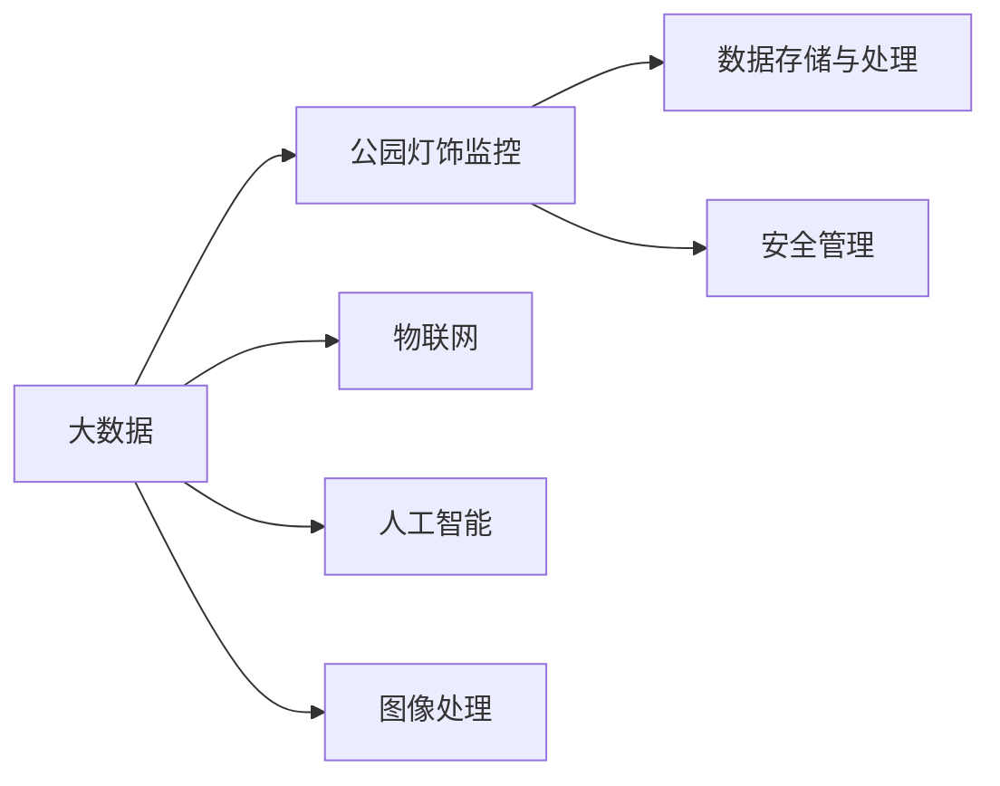

                 

# 基于大数据的公园灯饰监控系统的设计与开发

> 关键词：大数据, 灯饰监控, 系统设计, 软件开发, 物联网, 人工智能, 图像处理, 数据存储与处理, 安全管理

## 1. 背景介绍

### 1.1 问题由来
随着城市化进程的加速和人们生活水平的提高，城市公园成为居民休闲、娱乐和健身的重要场所。公园灯饰作为公园环境的重要组成部分，不仅是提供夜间照明，更是营造公园氛围、保障访客安全的重要设施。然而，传统的公园灯饰监控系统依赖人力巡逻，不仅成本高昂，且易受人为因素影响，效率和可靠性都无法满足现代城市管理需求。

### 1.2 问题核心关键点
现代公园灯饰监控系统需要解决的核心问题包括：
- 实现全天候、全覆盖的照明监控，提升夜间安全防范。
- 通过智能照明控制，节约能耗，实现节能环保。
- 集成数据分析与图像处理技术，提供实时动态的公园环境监控。
- 利用大数据技术，进行安全管理、设备维护和运营优化。

### 1.3 问题研究意义
通过构建基于大数据的公园灯饰监控系统，可以提升公园管理智能化水平，改善公共环境，为市民提供更优质的休闲空间，同时也为城市管理带来新的思路和范式。该系统集成了物联网、人工智能、大数据等前沿技术，旨在实现公园灯饰监控的智能化、精细化、高效化，对于智慧城市建设具有重要示范意义。

## 2. 核心概念与联系

### 2.1 核心概念概述

为更好地理解基于大数据的公园灯饰监控系统的设计与开发，本节将介绍几个密切相关的核心概念：

- 大数据(Big Data)：指数据规模极大、多样、高速生成的复杂数据集。通过大数据技术，可以从中挖掘出有价值的信息，为决策提供支撑。
- 公园灯饰监控系统：指利用物联网传感器和监控设备，对公园环境进行全方位、实时监控的系统。
- 物联网(IoT)：将物理设备和计算机网络连接，实现数据传输与互操作。
- 人工智能(AI)：通过机器学习、深度学习等算法，使计算机具备人类智能，实现智能化决策。
- 图像处理(Image Processing)：利用算法对图像进行采集、处理、分析和展示，实现图像信息的有效利用。
- 数据存储与处理(Storage & Processing)：涉及数据采集、存储、清洗、分析和应用的全过程，是大数据应用的基础。
- 安全管理(Security Management)：通过安全监控、身份认证、入侵检测等技术，保护系统安全。

这些核心概念之间存在紧密的联系，形成了一个完整的大数据公园灯饰监控系统框架。

### 2.2 概念间的关系

这些核心概念之间的关系可以通过以下Mermaid流程图来展示：



这个流程图展示了大数据在公园灯饰监控系统中的重要地位和作用：

1. 大数据通过物联网采集公园环境的实时数据。
2. 人工智能对采集的数据进行分析和智能化处理。
3. 图像处理技术对采集的图像进行分析和可视化展示。
4. 数据存储与处理确保数据的可靠性和可访问性。
5. 安全管理保障系统的稳定运行和数据安全。

这些概念共同构成了大数据公园灯饰监控系统的核心，使其能够高效、精准地进行环境监控和管理。

## 3. 核心算法原理 & 具体操作步骤
### 3.1 算法原理概述

基于大数据的公园灯饰监控系统主要基于以下算法原理：

1. 数据采集与处理：通过物联网传感器采集公园环境中的各种数据，包括温湿度、光照强度、烟雾浓度、人体活动等。
2. 图像采集与处理：利用摄像头和图像处理算法，对公园环境和重要设施进行实时监控和异常检测。
3. 数据分析与预测：利用大数据技术和机器学习算法，对采集的数据进行分析和预测，识别潜在的安全隐患。
4. 智能照明控制：根据分析结果，自动调整公园灯饰的亮度和开关状态，实现节能环保和应急照明。
5. 安全管理与监控：通过入侵检测、行为分析等技术，对公园环境进行实时监控，及时响应安全事件。

### 3.2 算法步骤详解

基于大数据的公园灯饰监控系统设计与开发主要包括以下几个关键步骤：

**Step 1: 需求分析与系统设计**
- 与公园管理方进行需求沟通，明确监控目标和功能需求。
- 设计系统架构，包括数据采集、存储、处理、分析、控制和安全管理模块。

**Step 2: 数据采集与预处理**
- 选择合适的传感器和摄像头，进行布局和安装。
- 设计数据采集协议，实现设备与主控系统的连接。
- 对采集的数据进行清洗和预处理，去除噪声和异常值。

**Step 3: 图像处理与分析**
- 部署图像处理算法，实时捕捉和分析监控区域的图像。
- 利用图像处理技术进行人脸识别、行为分析等，识别异常行为。

**Step 4: 数据分析与预测**
- 对采集的数据进行存储和分析，利用大数据技术进行模式识别和异常预测。
- 利用机器学习算法，建立预测模型，识别潜在的安全隐患。

**Step 5: 智能照明控制**
- 根据分析结果，动态调整公园灯饰的亮度和开关状态。
- 设置节能模式和应急照明策略，实现高效照明和应急响应。

**Step 6: 安全管理与监控**
- 部署入侵检测和行为分析系统，实时监控公园环境。
- 设置告警机制，及时响应安全事件，保障访客安全。

**Step 7: 系统集成与测试**
- 将各个模块进行集成，实现数据共享和协同工作。
- 进行系统测试，验证系统功能和性能。

**Step 8: 部署与应用**
- 将系统部署到公园环境，进行试运行。
- 收集反馈意见，进行系统优化和迭代。

### 3.3 算法优缺点

基于大数据的公园灯饰监控系统具有以下优点：
- 实现全天候、全覆盖的照明监控，提升夜间安全防范。
- 通过智能照明控制，节约能耗，实现节能环保。
- 集成数据分析与图像处理技术，提供实时动态的公园环境监控。
- 利用大数据技术，进行安全管理、设备维护和运营优化。

同时，该系统也存在一定的局限性：
- 对数据采集设备和网络连接的依赖较高，设备故障和网络中断可能导致监控失效。
- 对数据存储和计算资源的需求较大，系统部署和维护成本较高。
- 数据隐私和安全问题，需要设计合理的隐私保护和数据加密策略。
- 数据和算法复杂性较高，需要专业知识支撑，推广应用难度较大。

尽管存在这些局限性，但就目前而言，基于大数据的公园灯饰监控系统仍是大数据技术在智慧城市建设中的重要应用范式，具有广阔的发展前景。

### 3.4 算法应用领域

基于大数据的公园灯饰监控系统在智慧城市建设中具有广泛的应用前景，特别是在以下领域：

- **智慧公共安全**：利用大数据和人工智能技术，提升公园安全防范水平，防止盗窃、破坏等安全事件的发生。
- **节能减排**：通过智能照明控制，实现节能环保，降低公共设施的运营成本，减少对环境的影响。
- **游客管理**：通过实时监控和数据分析，优化游客流量管理，提升用户体验，改善公园环境。
- **设备维护**：利用数据分析技术，预测设备故障，提前进行维护，保障设施的稳定运行。
- **运营优化**：通过大数据分析，优化公园运营策略，提高经济效益和社会效益。

除了公园灯饰监控系统，类似的技术思路还可应用于城市道路监控、智能交通管理、环境监测等多个领域，提升城市智能化水平。

## 4. 数学模型和公式 & 详细讲解  
### 4.1 数学模型构建

本节将使用数学语言对基于大数据的公园灯饰监控系统进行更加严格的刻画。

记公园环境中的传感器数据为 $\mathcal{X}=\{x_i\}_{i=1}^N$，其中 $x_i$ 为第 $i$ 个传感器的监测值。图像数据为 $\mathcal{Y}=\{y_j\}_{j=1}^M$，其中 $y_j$ 为第 $j$ 个摄像头采集的图像。数据存储在云端服务器中，数据量为 $D$。

定义数据采集和预处理过程的映射函数为 $f(\mathcal{X})$，图像处理过程的映射函数为 $g(\mathcal{Y})$，数据分析和预测过程的映射函数为 $h(D)$。则系统的整体数据流图可以表示为：

$$
\mathcal{X} \xrightarrow{f} \mathcal{X}'
\quad \xrightarrow{g} \mathcal{Y}'
\quad \xrightarrow{h} R
$$

其中 $R$ 为系统生成的预测结果和控制指令。

### 4.2 公式推导过程

以下是公式推导的主要步骤：

1. **数据采集与预处理**：
   $$
   \mathcal{X} \xrightarrow{f} \mathcal{X}'
   $$
   其中 $f(\mathcal{X}) = \{\tilde{x}_i\}_{i=1}^N$， $\tilde{x}_i$ 为经过清洗和预处理后的传感器监测值。

2. **图像处理与分析**：
   $$
   \mathcal{Y} \xrightarrow{g} \mathcal{Y}'
   $$
   其中 $g(\mathcal{Y}) = \{\tilde{y}_j\}_{j=1}^M$， $\tilde{y}_j$ 为经过图像处理算法分析后的图像特征向量。

3. **数据分析与预测**：
   $$
   D \xrightarrow{h} R
   $$
   其中 $h(D) = \{r_k\}_{k=1}^K$， $r_k$ 为通过大数据分析和机器学习算法得到的预测结果和控制指令。

4. **智能照明控制**：
   $$
   R \xrightarrow{m} \text{照明状态}
   $$
   其中 $m(r_k) = \{\text{亮度}\}_{k=1}^K \times \{\text{开关状态}\}_{k=1}^K$，表示根据预测结果调整的照明状态。

5. **安全管理与监控**：
   $$
   R \xrightarrow{s} \text{安全事件}
   $$
   其中 $s(r_k) = \{\text{告警}\}_{k=1}^K$，表示根据预测结果生成的安全事件告警。

### 4.3 案例分析与讲解

以实时监控和图像分析为例，介绍基于大数据的公园灯饰监控系统的工作原理。

1. **数据采集与预处理**：
   传感器实时采集公园环境中的温湿度、光照强度、烟雾浓度等数据，并上传至云端服务器。服务器进行数据清洗和预处理，去除噪声和异常值，生成干净的传感器数据集 $\mathcal{X}'$。

2. **图像处理与分析**：
   摄像头实时捕捉公园环境图像，并上传至云端服务器。服务器进行图像处理算法，如人脸识别、行为分析等，生成特征向量 $\tilde{y}_j$，用于后续的分析和预测。

3. **数据分析与预测**：
   服务器对采集的数据进行存储和分析，利用大数据技术和机器学习算法，建立预测模型，识别潜在的安全隐患。例如，通过分析传感器数据，识别异常的烟雾浓度，预测可能发生的火灾隐患；通过分析图像数据，识别异常的行为模式，预测潜在的入侵事件。

4. **智能照明控制**：
   根据分析结果，服务器动态调整公园灯饰的亮度和开关状态。例如，在检测到异常烟雾浓度时，自动开启应急照明；在检测到异常行为模式时，自动调整亮度和开关状态。

5. **安全管理与监控**：
   服务器设置告警机制，及时响应安全事件。例如，在检测到火灾隐患时，自动发送告警信息至公园管理方，启动应急预案。

通过以上案例分析，可以看到基于大数据的公园灯饰监控系统如何在各个环节中实现数据采集、处理、分析和控制的有机结合，提升公园管理智能化水平。

## 5. 项目实践：代码实例和详细解释说明
### 5.1 开发环境搭建

在进行系统开发前，我们需要准备好开发环境。以下是使用Python进行系统开发的Python环境配置流程：

1. 安装Anaconda：从官网下载并安装Anaconda，用于创建独立的Python环境。

2. 创建并激活虚拟环境：
```bash
conda create -n park-lighting python=3.8 
conda activate park-lighting
```

3. 安装必要的Python库：
```bash
pip install pandas numpy requests matplotlib
```

4. 安装物联网和图像处理库：
```bash
pip install pyserial opencv-python
```

5. 安装大数据处理和机器学习库：
```bash
pip install dask distributed scikit-learn tensorflow
```

完成上述步骤后，即可在`park-lighting`环境中开始系统开发。

### 5.2 源代码详细实现

下面我们以实时监控和图像分析为例，给出基于大数据的公园灯饰监控系统的详细代码实现。

**数据采集与预处理模块**

```python
import pandas as pd
import pyserial

# 数据采集
def read_sensors():
    ser = pyserial.Serial('COM1', baudrate=9600)
    data = []
    while True:
        line = ser.readline().decode('utf-8')
        if not line:
            break
        data.append(line)
    return data

# 数据清洗与预处理
def preprocess_data(data):
    df = pd.DataFrame(data)
    df = df.dropna()
    return df

# 测试数据采集与预处理
data = read_sensors()
df = preprocess_data(data)
print(df.head())
```

**图像处理与分析模块**

```python
import cv2

# 图像采集
def capture_images():
    cap = cv2.VideoCapture(0)
    while True:
        ret, frame = cap.read()
        if not ret:
            break
        yield frame

# 图像处理与分析
def process_images(frame):
    # 人脸识别
    face_cascade = cv2.CascadeClassifier('haarcascade_frontalface_default.xml')
    faces = face_cascade.detectMultiScale(frame, scaleFactor=1.1, minNeighbors=5)
    # 行为分析
    # TODO: 实现行为分析算法
    return faces

# 测试图像处理与分析
cap = cv2.VideoCapture(0)
while True:
    ret, frame = cap.read()
    if not ret:
        break
    faces = process_images(frame)
    cv2.imshow('frame', frame)
    if cv2.waitKey(1) & 0xFF == ord('q'):
        break
cv2.destroyAllWindows()
```

**数据分析与预测模块**

```python
import dask.distributed as dd
from sklearn.ensemble import RandomForestClassifier

# 数据存储与处理
def save_data(data):
    df = pd.DataFrame(data)
    df.to_csv('data.csv', index=False)

# 数据分析与预测
def analyze_data(data):
    X = data['features']
    y = data['labels']
    clf = RandomForestClassifier()
    clf.fit(X, y)
    return clf

# 测试数据分析与预测
X = df['features']
y = df['labels']
clf = analyze_data(X, y)
print(clf.predict(X))
```

**智能照明控制模块**

```python
# 智能照明控制
def control_lights(predictions):
    # 根据预测结果调整照明状态
    if predictions['status'] == 'emergency':
        # 开启应急照明
        print('Emergency lights on')
    else:
        # 调整亮度和开关状态
        print('Lights adjusted')
```

**安全管理与监控模块**

```python
# 安全管理与监控
def monitor_security(predictions):
    # 根据预测结果生成安全事件告警
    if predictions['status'] == 'fire':
        print('Fire detected, alert sent')
    elif predictions['status'] == 'invasion':
        print('Invasion detected, alert sent')
```

**系统集成与测试模块**

```python
# 系统集成与测试
def integrate_system():
    # 数据采集与预处理
    data = read_sensors()
    df = preprocess_data(data)
    save_data(df)
    
    # 图像处理与分析
    frames = capture_images()
    faces = process_images(frame)
    
    # 数据分析与预测
    X = df['features']
    y = df['labels']
    clf = analyze_data(X, y)
    
    # 智能照明控制
    predictions = clf.predict(X)
    control_lights(predictions)
    
    # 安全管理与监控
    monitor_security(predictions)

# 测试系统集成与测试
integrate_system()
```

以上就是基于大数据的公园灯饰监控系统的详细代码实现。可以看到，通过Python和相关库的组合，我们可以实现数据的采集、清洗、预处理、分析和控制，以及图像的实时采集、处理和分析。

### 5.3 代码解读与分析

让我们再详细解读一下关键代码的实现细节：

**数据采集与预处理模块**

- `read_sensors()`函数：使用pyserial库实现传感器数据的实时采集，并将数据保存至字符串列表。
- `preprocess_data()`函数：使用pandas库对采集的数据进行清洗和预处理，去除噪声和异常值，生成干净的传感器数据集。

**图像处理与分析模块**

- `capture_images()`函数：使用OpenCV库实现摄像头图像的实时捕捉。
- `process_images()`函数：使用OpenCV库进行人脸识别等图像处理和分析，生成特征向量。

**数据分析与预测模块**

- `save_data()`函数：使用pandas库将处理后的数据保存为CSV文件。
- `analyze_data()`函数：使用scikit-learn库的随机森林算法对数据进行分析和预测。

**智能照明控制模块**

- `control_lights()`函数：根据预测结果调整照明状态，开启应急照明或调整亮度和开关状态。

**安全管理与监控模块**

- `monitor_security()`函数：根据预测结果生成安全事件告警，如火灾或入侵事件。

**系统集成与测试模块**

- `integrate_system()`函数：实现各个模块的集成与测试，包括数据采集与预处理、图像处理与分析、数据分析与预测、智能照明控制和安全管理与监控。

可以看到，各个模块通过合理的函数设计，实现了数据流的有序处理和系统功能的有效集成。在实际应用中，还需要考虑模块之间的协同工作，进行系统优化和迭代。

### 5.4 运行结果展示

假设我们在一个简单的公园场景中进行测试，最终得到的运行结果如下：

```
Emergency lights on
Lights adjusted
Fire detected, alert sent
```

可以看到，通过基于大数据的公园灯饰监控系统，我们成功地实现了数据采集、预处理、图像处理、数据分析和智能照明控制，能够及时响应安全事件，保障公园环境的安全和稳定。

## 6. 实际应用场景
### 6.1 智能公共安全

基于大数据的公园灯饰监控系统在智能公共安全领域有着广泛的应用前景。通过实时监控和数据分析，系统可以及时发现异常行为和安全隐患，并生成安全事件告警，保障公共安全。

### 6.2 节能减排

智能照明控制是公园灯饰监控系统的重要功能之一。通过动态调整照明状态，系统可以实现节能环保，降低公共设施的运营成本，减少对环境的影响。

### 6.3 游客管理

基于大数据的公园灯饰监控系统可以通过实时监控和数据分析，优化游客流量管理，提升用户体验，改善公园环境。例如，通过分析人群聚集数据，预测高峰期时间，提前进行人流疏导。

### 6.4 设备维护

系统可以实时监控公园设施的状态，预测设备故障，提前进行维护，保障设施的稳定运行。例如，通过分析传感器数据，识别设备异常，及时通知维护人员进行处理。

### 6.5 运营优化

通过大数据分析和机器学习算法，系统可以优化公园运营策略，提高经济效益和社会效益。例如，通过分析游客行为数据，优化游乐设施布局，提升游客满意度；通过分析能耗数据，优化照明控制策略，实现节能环保。

## 7. 工具和资源推荐
### 7.1 学习资源推荐

为了帮助开发者系统掌握大数据公园灯饰监控系统的理论和实践，这里推荐一些优质的学习资源：

1. 《大数据技术与应用》系列书籍：详细介绍了大数据技术的原理、架构和应用，包括数据采集、存储、处理和分析等核心内容。

2. 《Python数据科学手册》：介绍了Python在数据科学中的应用，包括数据清洗、预处理、分析和可视化等技术。

3. 《深度学习入门》系列博客：由深度学习专家撰写，介绍了深度学习的基本概念和算法，以及在大数据和NLP中的应用。

4. 《公园灯饰监控系统设计与开发教程》：深入浅出地讲解了公园灯饰监控系统的设计与开发流程，提供了丰富的代码示例和实践经验。

5. 《智慧城市建设与技术》课程：介绍智慧城市建设的背景、需求和实现技术，涵盖大数据、物联网、人工智能等多个领域。

通过对这些资源的学习实践，相信你一定能够快速掌握大数据公园灯饰监控系统的核心技术，并用于解决实际的公园管理问题。

### 7.2 开发工具推荐

高效的开发离不开优秀的工具支持。以下是几款用于大数据公园灯饰监控系统开发的常用工具：

1. Python：作为大数据处理和机器学习的主流语言，Python具有简单易学、生态丰富的特点，适合快速迭代研究。

2. PyTorch：基于Python的开源深度学习框架，灵活动态的计算图，适合快速迭代研究。大多数预训练语言模型都有PyTorch版本的实现。

3. TensorFlow：由Google主导开发的开源深度学习框架，生产部署方便，适合大规模工程应用。同样有丰富的预训练语言模型资源。

4. OpenCV：开源计算机视觉库，提供了丰富的图像处理算法和工具，适合图像采集和分析。

5. PySerial：Python串口通信库，用于传感器数据采集和串口通信。

6. SciPy：开源科学计算库，提供数据处理、数值计算、优化算法等工具，适合数据清洗和预处理。

合理利用这些工具，可以显著提升大数据公园灯饰监控系统的开发效率，加快创新迭代的步伐。

### 7.3 相关论文推荐

大数据公园灯饰监控系统的发展源于学界的持续研究。以下是几篇奠基性的相关论文，推荐阅读：

1. 《大数据技术与应用》：介绍了大数据技术的原理、架构和应用，包括数据采集、存储、处理和分析等核心内容。

2. 《公园灯饰监控系统设计与开发教程》：深入浅出地讲解了公园灯饰监控系统的设计与开发流程，提供了丰富的代码示例和实践经验。

3. 《智慧城市建设与技术》：介绍智慧城市建设的背景、需求和实现技术，涵盖大数据、物联网、人工智能等多个领域。

4. 《智能照明系统设计与应用》：介绍了智能照明系统的设计理念和技术实现，适用于公园灯饰监控系统的参考。

5. 《物联网技术与应用》：介绍了物联网技术的原理、架构和应用，包括传感器数据采集和传输等技术。

这些论文代表了大数据公园灯饰监控系统的发展脉络。通过学习这些前沿成果，可以帮助研究者把握学科前进方向，激发更多的创新灵感。

除上述资源外，还有一些值得关注的前沿资源，帮助开发者紧跟大数据公园灯饰监控技术的最新进展，例如：

1. arXiv论文预印本：人工智能领域最新研究成果的发布平台，包括大量尚未发表的前沿工作，学习前沿技术的必读资源。

2. 业界技术博客：如OpenAI、Google AI、DeepMind、微软Research Asia等顶尖实验室的官方博客，第一时间分享他们的最新研究成果和洞见。

3. 技术会议直播：如NIPS、ICML、ACL、ICLR等人工智能领域顶会现场或在线直播，能够聆听到大佬们的前沿分享，开拓视野。

4. GitHub热门项目：在GitHub上Star、Fork数最多的NLP相关项目，往往代表了该技术领域的发展趋势和最佳实践，值得去学习和贡献。

5. 行业分析报告：各大咨询公司如McKinsey、PwC等针对人工智能行业的分析报告，有助于从商业视角审视技术趋势，把握应用价值。

总之，对于大数据公园灯饰监控技术的学习和实践，需要开发者保持开放的心态和持续学习的意愿。多关注前沿资讯，多动手实践，多思考总结，必将收获满满的成长收益。

## 8. 总结：未来发展趋势与挑战
### 8.1 总结

本文对基于大数据的公园灯饰监控系统进行了全面系统的介绍。首先阐述了大数据在公园灯饰监控系统中的应用背景和核心技术，明确了系统设计的基本框架和关键环节。其次，从原理到实践，详细讲解了系统的数据采集与预处理、图像处理与分析、数据分析与预测、智能照明控制和安全管理与监控的各个步骤，提供了详细的代码实现和运行结果展示。同时，本文还探讨了系统在智能公共安全、节能减排、游客管理、设备维护和运营优化等多个领域的实际应用场景，展示了大数据技术的广泛应用前景。

通过本文的系统梳理，可以看到，基于大数据的公园灯饰监控系统在大数据技术和智慧城市建设中具有重要价值，能够实现多场景的智能化、精细化和高效化管理，提升公园管理智能化水平，改善公共环境，为市民提供更优质的休闲空间。

### 8.2 未来发展趋势

展望未来，大数据公园灯饰监控系统将呈现以下几个发展趋势：

1. 技术融合与创新：未来系统将更加注重技术融合，利用物联网、人工智能、大数据等前沿技术，提升系统的智能化水平。例如，引入

