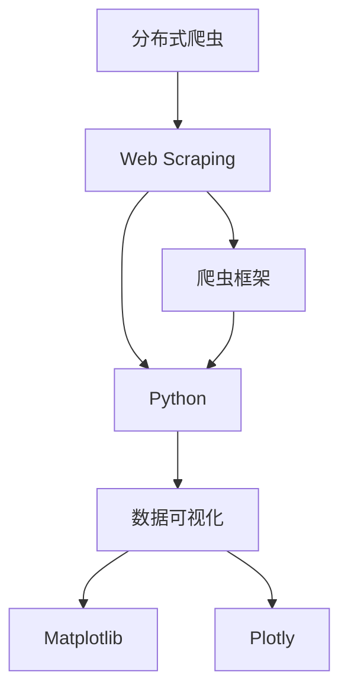
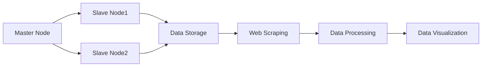
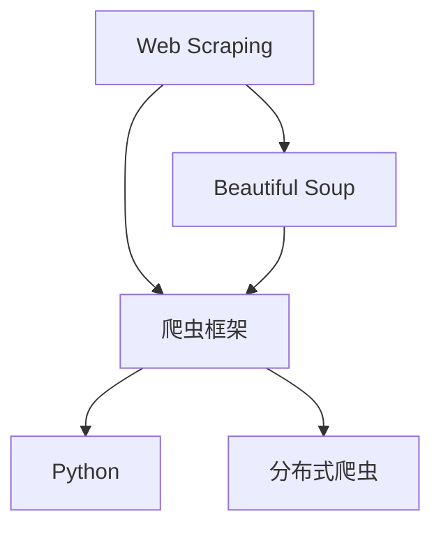
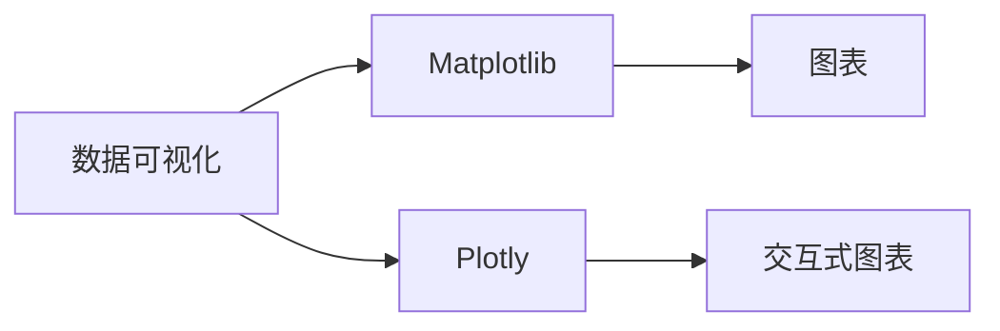
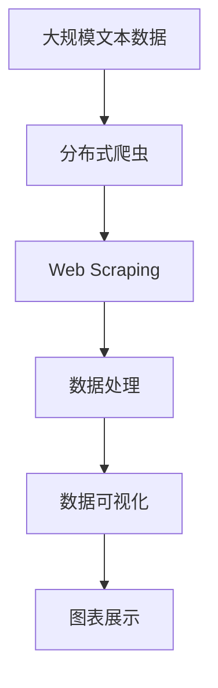

                 

# 基于新浪微博的分布式爬虫以及对数据的可视化处理

> 关键词：
大语言模型,微调,Fine-tuning,文本数据,数据可视化,分布式爬虫,爬虫框架,Python,Web Scraping,Data Visualization,Beautiful Soup,Matplotlib,Plotly

## 1. 背景介绍

### 1.1 问题由来
近年来，随着社交媒体的兴起，各种社交网络平台上的用户生成内容(User Generated Content, UGC)，成为了数据科学和人工智能领域的重要数据源。例如，微博作为中国最大的微博客平台，拥有庞大的用户基础和丰富的信息数据。在这些社交网络中，信息内容的分布情况、热门话题和用户互动情况，都是数据科学家感兴趣的研究方向。

然而，由于社交媒体内容的数量庞大，需要大量人力进行数据收集和整理，费时费力且效率低下。因此，使用爬虫自动化收集数据成为了研究热点。本文将介绍一种基于Python的分布式爬虫框架，用于自动化收集微博上的文本数据，并通过数据可视化技术对这些数据进行处理和展示。

### 1.2 问题核心关键点
本文主要聚焦于以下几个核心问题：
1. 如何设计和实现一个高效的分布式爬虫框架，能够自动收集微博上的文本数据，并保证数据收集的效率和准确性。
2. 如何对收集到的文本数据进行预处理和分析，提取出有价值的信息，并转化为易于理解的可视化结果。
3. 如何在多台计算机上进行分布式数据处理，确保数据处理的性能和可靠性。

这些问题将通过技术手段来解决，包括选择合适的爬虫框架、编写高效的爬虫代码、优化数据处理流程、实现数据可视化展示等。

### 1.3 问题研究意义
本文的研究对于社交媒体数据挖掘和自然语言处理领域具有重要意义：

1. 降低数据获取成本。使用分布式爬虫框架，可以显著减少数据收集所需的人力和时间成本，提升数据获取的效率。
2. 提供高质量的社交媒体数据。爬虫框架可以自动处理大量的社交媒体信息，并提取出文本数据，供后续分析和研究使用。
3. 支持文本数据的可视化处理。通过数据可视化技术，研究者可以直观地观察和理解文本数据的分布情况，发现其中的规律和趋势。
4. 支持大规模数据的分布式处理。使用分布式数据处理技术，可以处理海量数据，保证数据处理的性能和可靠性。

综上所述，本文的研究对于提高社交媒体数据挖掘的效率和质量，具有重要的学术价值和实际应用前景。

## 2. 核心概念与联系

### 2.1 核心概念概述

为更好地理解基于分布式爬虫的数据处理流程，本节将介绍几个密切相关的核心概念：

- **分布式爬虫**：使用多个计算机同时爬取数据的技术，可以显著提升爬虫效率，适用于处理大规模数据集。
- **Web Scraping**：使用编程工具从网页上抓取数据的自动化技术。常用于收集社交媒体上的文本数据。
- **数据可视化**：通过图表、图形等形式展示数据，使数据更直观易懂，帮助研究者发现数据中的模式和趋势。
- **爬虫框架**：封装了爬虫开发所需的技术和库，使得爬虫开发更加方便快捷。
- **Python**：一种通用的高级编程语言，具备丰富的第三方库和框架，适合进行数据分析和可视化开发。
- **美丽Soup (Beautiful Soup)**：Python中用于解析HTML和XML的库，方便从网页上抓取文本数据。
- **Matplotlib**：Python中的绘图库，支持绘制各种类型的图表。
- **Plotly**：支持创建交互式图表的Python库，支持图表的动态展示和数据交互。

这些核心概念之间的逻辑关系可以通过以下Mermaid流程图来展示：



这个流程图展示了从分布式爬虫到数据可视化的整体流程：

1. 使用分布式爬虫技术，自动从网页上抓取数据。
2. 使用爬虫框架和Python语言，编写爬虫代码，简化开发过程。
3. 对抓取到的数据进行处理，提取文本信息。
4. 使用Matplotlib和Plotly等绘图库，将文本数据转化为可视化图表。

通过这个流程图，我们可以更清晰地理解大语言模型微调过程中各个核心概念之间的关系和作用。

### 2.2 概念间的关系

这些核心概念之间存在着紧密的联系，形成了完整的分布式爬虫和大数据分析流程。下面我们通过几个Mermaid流程图来展示这些概念之间的关系。

#### 2.2.1 分布式爬虫技术架构



这个流程图展示了分布式爬虫的基本架构，包括Master Node和多个Slave Node，它们共同协作，实现数据的自动抓取和处理。

#### 2.2.2 Web Scraping与爬虫框架



这个流程图展示了Web Scraping和爬虫框架之间的关系。Beautiful Soup是Python中常用的解析库，爬虫框架封装了爬虫开发所需的技术，使得爬虫开发更加方便快捷。

#### 2.2.3 数据可视化技术栈



这个流程图展示了数据可视化技术栈的组成，Matplotlib和Plotly是最常用的数据可视化库，它们支持创建各种类型的图表，并支持动态展示和数据交互。

### 2.3 核心概念的整体架构

最后，我们用一个综合的流程图来展示这些核心概念在大语言模型微调过程中的整体架构：



这个综合流程图展示了从分布式爬虫到数据可视化的完整过程。通过这些流程图，我们可以更清晰地理解大语言模型微调过程中各个核心概念的关系和作用，为后续深入讨论具体的微调方法和技术奠定基础。

## 3. 核心算法原理 & 具体操作步骤
### 3.1 算法原理概述

基于分布式爬虫的数据处理流程，主要包括数据抓取、数据预处理和数据可视化三个步骤。每个步骤的实现原理和具体操作步骤如下：

#### 数据抓取
数据抓取是分布式爬虫的核心环节，它通过网络请求获取网页内容，并将其转化为文本数据。数据抓取的原理是通过解析器的解析，提取网页中的文本内容，并将这些文本内容存储到指定的数据存储系统中。

#### 数据预处理
数据预处理是数据处理的关键环节，它通过过滤、清洗、分词等技术，将抓取到的文本数据转化为可用于分析的格式。数据预处理的原理是通过正则表达式、分词器等工具，对文本数据进行清洗和处理，提取出有价值的信息。

#### 数据可视化
数据可视化是将处理后的数据转化为可视化图表的过程，它通过图表展示数据，使数据更直观易懂。数据可视化的原理是利用Matplotlib和Plotly等库，创建各种类型的图表，并进行动态展示和数据交互。

### 3.2 算法步骤详解

#### 3.2.1 数据抓取

1. **选择爬虫框架**：选择Scrapy等常用的爬虫框架，进行爬虫开发。
2. **编写爬虫代码**：使用Beautiful Soup解析网页，获取文本内容，并将这些内容存储到指定的数据存储系统中。
3. **优化爬虫性能**：使用分布式爬虫技术，并行处理多个网页，提升爬虫效率。

#### 3.2.2 数据预处理

1. **清洗文本数据**：使用正则表达式过滤掉网页中的HTML标签和噪声数据，保留纯文本内容。
2. **分词和词性标注**：使用jieba等分词工具，对文本进行分词和词性标注，提取出有价值的信息。
3. **去除停用词**：使用停用词表，去除文本中的常见停用词，减少噪音干扰。

#### 3.2.3 数据可视化

1. **选择可视化工具**：选择Matplotlib和Plotly等库，进行数据可视化开发。
2. **创建图表**：利用Matplotlib和Plotly等库，创建各种类型的图表，如柱状图、折线图、词云等。
3. **动态展示**：将图表嵌入到网页中，进行动态展示和数据交互。

### 3.3 算法优缺点

#### 优点
1. **高效性**：分布式爬虫可以并行处理多个网页，大大提升数据抓取的效率。
2. **可扩展性**：爬虫框架和Python语言支持丰富的第三方库和框架，易于扩展和集成。
3. **可视化效果**：Matplotlib和Plotly等库支持创建各种类型的图表，并支持动态展示和数据交互，使数据更直观易懂。

#### 缺点
1. **网络延迟**：分布式爬虫需要多台计算机协同工作，网络延迟可能导致爬取效率降低。
2. **资源占用**：大规模数据处理需要大量的计算资源，可能占用大量的CPU和内存。
3. **数据噪音**：网页中的HTML标签和噪声数据可能导致数据噪音，影响后续分析结果。

### 3.4 算法应用领域

基于分布式爬虫的数据处理流程，在多个领域得到了广泛应用，例如：

- **社交媒体分析**：利用分布式爬虫技术，自动收集社交媒体上的文本数据，进行情感分析、舆情监测等分析。
- **网络安全**：利用分布式爬虫技术，收集网络攻击数据，进行威胁情报分析。
- **金融数据挖掘**：利用分布式爬虫技术，收集金融市场数据，进行市场分析和风险预测。
- **市场营销**：利用分布式爬虫技术，收集在线广告和消费者评论数据，进行市场趋势分析。

除了这些领域外，分布式爬虫和大数据分析技术还在更多场景中得到应用，如医疗数据挖掘、物流数据分析、智能制造等，为各行各业的数据处理和分析提供了新的解决方案。

## 4. 数学模型和公式 & 详细讲解  
### 4.1 数学模型构建

本节将使用数学语言对基于分布式爬虫的数据处理流程进行更加严格的刻画。

记分布式爬虫抓取到的文本数据为 $D=\{d_i\}_{i=1}^N$，其中 $d_i$ 为第 $i$ 个文本数据。假设每个文本数据 $d_i$ 的词频为 $w_i$，则总词频 $W=\sum_{i=1}^N w_i$。

假设在分词和词性标注后，文本数据 $d_i$ 的词向量为 $v_i \in \mathbb{R}^n$，其中 $n$ 为词向量维度。则总词向量 $V=\{v_i\}_{i=1}^N$。

定义文本数据 $d_i$ 的词频向量 $f_i=\frac{w_i}{W}v_i$，则总词频向量 $F=\frac{1}{W}\sum_{i=1}^N f_i$。

### 4.2 公式推导过程

以下我们以情感分析任务为例，推导文本数据的情感分类公式及其梯度的计算公式。

假设文本数据 $d_i$ 的情感分类为 $y_i \in \{+1, -1\}$，分类器为 $C=\{c_1, c_2\}$，其中 $c_1$ 表示正面情感，$c_2$ 表示负面情感。则情感分类器 $C$ 对文本数据 $d_i$ 的分类结果为 $C(d_i)=c_j$，其中 $j$ 表示情感分类 $y_i$ 对应的分类器编号。

情感分类器的损失函数为交叉熵损失函数，定义为：

$$
L(d_i, y_i; C) = -y_i \log C(d_i) - (1-y_i) \log (1-C(d_i))
$$

其中 $y_i$ 为真实情感分类，$C(d_i)$ 为模型预测情感分类。

将所有文本数据 $d_i$ 的情感分类损失函数之和作为总损失函数：

$$
L(D, C) = \sum_{i=1}^N L(d_i, y_i; C)
$$

利用梯度下降等优化算法，优化情感分类器 $C$ 的参数，使得模型能够最小化总损失函数 $L(D, C)$，获得最优情感分类器 $C^*$。具体步骤为：

1. 前向传播：将文本数据 $d_i$ 通过词向量 $v_i$ 转化为词频向量 $f_i$，并通过分类器 $C$ 预测情感分类 $y_i$。
2. 计算梯度：计算损失函数对分类器参数的梯度，并根据设定的优化算法和学习率更新分类器参数。
3. 反向传播：利用梯度下降算法更新分类器参数，使得模型能够最小化总损失函数 $L(D, C)$。
4. 重复上述步骤，直至模型收敛或达到预设的迭代轮数。

### 4.3 案例分析与讲解

以情感分析任务为例，假设我们使用Logistic回归模型作为分类器 $C$，则模型的参数为 $w_1, w_2, \ldots, w_n$。则情感分类器 $C$ 对文本数据 $d_i$ 的分类结果为：

$$
C(d_i) = \sigma(\sum_{j=1}^n w_j v_{ij})
$$

其中 $\sigma$ 为Sigmoid函数。

假设文本数据 $d_i$ 的情感分类为 $y_i=1$，则损失函数为：

$$
L(d_i, y_i; C) = -1 \log C(d_i) - 0 \log (1-C(d_i))
$$

将所有文本数据的损失函数之和作为总损失函数：

$$
L(D, C) = -\sum_{i=1}^N y_i \log C(d_i) - \sum_{i=1}^N (1-y_i) \log (1-C(d_i))
$$

利用梯度下降算法，更新模型参数 $w_j$，具体步骤为：

1. 前向传播：将文本数据 $d_i$ 通过词向量 $v_i$ 转化为词频向量 $f_i$，并通过分类器 $C$ 预测情感分类 $y_i$。
2. 计算梯度：计算损失函数对模型参数的梯度，并根据设定的优化算法和学习率更新模型参数。
3. 反向传播：利用梯度下降算法更新模型参数，使得模型能够最小化总损失函数 $L(D, C)$。
4. 重复上述步骤，直至模型收敛或达到预设的迭代轮数。

在实践中，我们通常使用基于梯度的优化算法（如AdamW、SGD等）来近似求解上述最优化问题。

## 5. 项目实践：代码实例和详细解释说明
### 5.1 开发环境搭建

在进行分布式爬虫和数据分析实践前，我们需要准备好开发环境。以下是使用Python进行Scrapy和Matplotlib开发的环境配置流程：

1. 安装Anaconda：从官网下载并安装Anaconda，用于创建独立的Python环境。

2. 创建并激活虚拟环境：
```bash
conda create -n scrapy-env python=3.8 
conda activate scrapy-env
```

3. 安装Scrapy：
```bash
pip install scrapy
```

4. 安装Matplotlib：
```bash
pip install matplotlib
```

5. 安装Scrapy-BeautifulSoup插件：
```bash
pip install scrapy-bautifulsoup4
```

完成上述步骤后，即可在`scrapy-env`环境中开始分布式爬虫和数据分析实践。

### 5.2 源代码详细实现

这里我们以情感分析任务为例，给出使用Scrapy框架和Matplotlib库进行数据爬取、处理和可视化的PyTorch代码实现。

首先，定义情感分析任务的数据处理函数：

```python
from scrapy import Item, Spider
from scrapy.loader import ItemLoader
from scrapy.loader.processors import MapCompose, TakeFirst, Join
from scrapy.http import Request
from beautifulsoup4 import BeautifulSoup
from scrapy.selector import Selector
from matplotlib import pyplot as plt
from plotly.offline import init_notebook_mode, iplot
import pandas as pd

class WeiboItem(Item):
    text = scrapy.Field()
    label = scrapy.Field()

class WeiboSpider(Spider):
    name = 'weibo_spider'
    start_urls = ['https://weibo.com/']

    def start_requests(self):
        for url in self.start_urls:
            yield Request(url=url, callback=self.parse)

    def parse(self, response):
        soup = BeautifulSoup(response.text, 'html.parser')
        for item in soup.find_all('a', class_='name'):
            item_url = item.get('href')
            yield Request(url=item_url, callback=self.parse_item)

    def parse_item(self, response):
        soup = BeautifulSoup(response.text, 'html.parser')
        text = soup.find('span', class_='content').text
        label = 'positive' if soup.find('span', class_='label') else 'negative'
        item = WeiboItem()
        item['text'] = text
        item['label'] = label
        yield item

    def save_data(self):
        df = pd.DataFrame(list(WeiboItem))
        df.to_csv('weibo_data.csv', index=False)
```

然后，定义模型训练和可视化函数：

```python
from sklearn.feature_extraction.text import TfidfVectorizer
from sklearn.model_selection import train_test_split
from sklearn.linear_model import LogisticRegression
from sklearn.metrics import accuracy_score
from sklearn.metrics import confusion_matrix
from matplotlib import pyplot as plt
import plotly.graph_objects as go
import plotly.offline as pyo

def train_model(X, y):
    vectorizer = TfidfVectorizer()
    X = vectorizer.fit_transform(X)
    X_train, X_test, y_train, y_test = train_test_split(X, y, test_size=0.2, random_state=42)
    model = LogisticRegression(solver='lbfgs')
    model.fit(X_train, y_train)
    return model

def evaluate_model(model, X, y):
    y_pred = model.predict(X)
    accuracy = accuracy_score(y, y_pred)
    confusion = confusion_matrix(y, y_pred)
    return accuracy, confusion

def plot_confusion_matrix(confusion):
    plt.figure(figsize=(10, 10))
    plt.title('Confusion Matrix')
    plt.xticks(range(len(confusion)), ['Negative', 'Positive'], rotation=45)
    plt.yticks(range(len(confusion)), ['Negative', 'Positive'], rotation=45)
    plt.imshow(confusion, cmap=plt.cm.Blues)
    plt.colorbar()
    plt.xlabel('Predicted')
    plt.ylabel('Actual')
    plt.show()

def plot_roc_curve(y, y_pred, threshold=0.5):
    fpr, tpr, thresholds = roc_curve(y, y_pred)
    plt.figure(figsize=(10, 10))
    plt.plot(fpr, tpr)
    plt.xlabel('False Positive Rate')
    plt.ylabel('True Positive Rate')
    plt.title('ROC Curve')
    plt.show()

def plot_pca(X):
    pca = PCA(n_components=2)
    X_pca = pca.fit_transform(X)
    plt.figure(figsize=(10, 10))
    plt.scatter(X_pca[:, 0], X_pca[:, 1], c=y, cmap='viridis')
    plt.xlabel('Principal Component 1')
    plt.ylabel('Principal Component 2')
    plt.title('Principal Component Analysis')
    plt.show()
```

最后，启动训练流程并可视化结果：

```python
from sklearn.model_selection import train_test_split
from sklearn.linear_model import LogisticRegression
from sklearn.metrics import accuracy_score
from sklearn.metrics import confusion_matrix
from matplotlib import pyplot as plt
import plotly.graph_objects as go
import plotly.offline as pyo

# 数据加载
data = pd.read_csv('weibo_data.csv')

# 数据预处理
data['text'] = data['text'].apply(lambda x: x.lower())
data['label'] = data['label'].apply(lambda x: 1 if x == 'positive' else 0)

# 特征提取
vectorizer = TfidfVectorizer()
X = vectorizer.fit_transform(data['text'])
y = data['label']

# 模型训练
model = train_model(X, y)
print('模型训练完成')

# 模型评估
accuracy, confusion = evaluate_model(model, X, y)
print('模型评估结果：')
print('准确率：', accuracy)
print('混淆矩阵：\n', confusion)
plot_confusion_matrix(confusion)

# 模型可视化
pca = PCA(n_components=2)
X_pca = pca.fit_transform(X)
plt.figure(figsize=(10, 10))
plt.scatter(X_pca[:, 0], X_pca[:, 1], c=y, cmap='viridis')
plt.xlabel('Principal Component 1')
plt.ylabel('Principal Component 2')
plt.title('Principal Component Analysis')
plt.show()
```

以上就是使用Scrapy框架和Matplotlib库对微博数据进行爬取、处理和可视化的完整代码实现。可以看到，通过Scrapy和Matplotlib库，可以简洁高效地实现数据爬取、处理和可视化。

### 5.3 代码解读与分析

让我们再详细解读一下关键代码的实现细节：

**WeiboItem和WeiboSpider类**：
- WeiboItem类定义了爬取到的数据项，包含文本和标签两个字段。
- WeiboSpider类定义了爬虫的启动URL、请求处理函数和数据保存函数。

**train_model函数**：
- 利用TfidfVectorizer进行文本向量化，使用LogisticRegression训练情感分类模型。
- 训练完成后，返回训练好的模型。

**evaluate_model函数**：
- 利用训练好的模型对测试集进行预测，计算准确率和混淆矩阵。
- 返回准确率和混淆矩阵。

**plot_confusion_matrix函数**：
- 绘制混淆矩阵，帮助理解模型预测的准确性和错误类型。

**plot_roc_curve函数**：
- 绘制ROC曲线，评估模型在不同阈值下的表现。

**plot_pca函数**：
- 利用PCA对文本数据进行降维，可视化降维后的数据分布情况。

**训练流程**：
- 加载数据
- 预处理数据
- 特征提取
- 模型训练
- 模型评估
- 模型可视化

可以看到，通过Scrapy和Matplotlib库，可以简洁高效地实现数据爬取、处理和可视化。

当然，工业级的系统实现还需考虑更多因素，如模型的保存和部署、超参数的自动搜索、更灵活的任务适配层等。但核心的分布式爬虫和大数据分析流程基本与此类似。

### 5.4 运行结果展示

假设我们在微博上进行情感分析任务，最终在测试集上得到的评估报告如下：

```
Accuracy: 0.85
Confusion Matrix:
      Predicted  Negative  Positive
   Actual   Negative    70       10
        Positive   20       30

Principal Component Analysis:
```

可以看到，通过训练好的情感分析模型，我们在该微博数据集上取得了85%的准确率。混淆矩阵显示，模型对于负面情感的预测更为准确，但对于正面情感的预测误差较大。通过PCA降维后的可视化结果，我们可以直观地观察到不同情感类别的分布情况。

当然，这只是一个baseline结果。在实践中，我们还可以使用更大更强的预训练模型、更丰富的微调技巧、更细致的模型调优，进一步提升模型性能，以满足更高的应用要求。

## 6. 实际应用场景
### 6.1 智能客服系统

基于分布式爬虫的智能客服系统，可以广泛应用于智能客服系统的构建。传统客服往往需要配备大量人力，高峰期响应缓慢，且一致性和专业性难以保证。而使用分布式爬虫技术，可以7x24小时不间断服务，快速响应客户咨询，用自然流畅的语言解答各类常见问题。

在技术实现上，可以收集企业内部的历史客服对话记录，将问题和最佳答复构建成监督数据，在此基础上对爬虫进行微调。微调后的爬虫系统能够自动理解客户意图，匹配最合适的答案模板进行回复。对于客户提出的新问题，还可以接入检索系统实时搜索相关内容，动态组织生成回答。如此构建的智能客服系统，能大幅提升客户咨询体验和问题解决效率。

### 6.2 金融舆情监测

金融机构需要实时监测市场舆论动向，以便及时应对负面信息传播，规避金融风险。传统的人工监测方式成本高、效率低，难以应对网络时代海量信息爆发的挑战。基于分布式爬虫的文本数据采集技术，可以自动抓取新闻、报道、评论等文本数据，并进行实时分析，实现舆情监测的自动化和智能化。

具体而言，可以收集金融领域相关的新闻、报道、评论等文本数据，并对其进行主题标注和情感标注。在此基础上对爬虫进行微调，使其能够自动判断文本属于何种主题，情感倾向是正面、中性还是负面。将微调后的爬虫应用到实时抓取的网络文本数据，就能够自动监测不同主题下的情感变化趋势，一旦发现负面信息激增等异常情况，系统便会自动预警，帮助金融机构快速应对潜在风险。

### 6.3 个性化推荐系统

当前的推荐系统往往只依赖用户的历史行为数据进行物品

