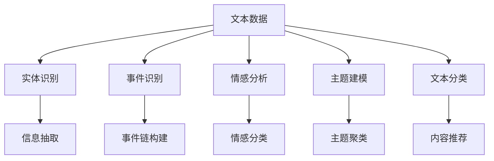

                 

# 基于新闻平台的文本数据挖掘系统

## 1. 背景介绍

### 1.1 问题由来

新闻平台汇聚了海量的文本数据，如新闻文章、评论、论坛帖子等，这些文本数据蕴含着丰富的信息。如何高效地从这些文本中挖掘有价值的信息，成为新闻平台业务发展的关键需求之一。传统的基于规则的方法依赖于领域专家的知识和经验，难以处理复杂多变的文本场景。而数据挖掘技术能够自动地从大量文本中提取出隐含的规律和模式，具有高效、灵活的优点。

### 1.2 问题核心关键点

新闻平台文本数据挖掘的核心在于如何将文本数据转化为有价值的信息。通常，可以从以下几个方面入手：

1. **信息抽取**：从文本中提取出关键实体、事件、时间等信息，形成结构化数据，便于进一步分析。
2. **情感分析**：分析文本中的情感倾向，如正面、负面、中性等，用于评估新闻报道的舆情影响。
3. **主题建模**：识别文本的主题分布，用于聚类和推荐新闻内容。
4. **事件追踪**：追踪文本中提及的事件，形成事件链，用于理解事件的演化和发展。

本文将重点介绍基于机器学习的方法在新闻平台文本数据挖掘中的应用，特别是信息抽取、情感分析和主题建模等任务。

## 2. 核心概念与联系

### 2.1 核心概念概述

在进行文本数据挖掘时，涉及以下几个核心概念：

- **文本数据**：新闻平台收集的文本数据，包括新闻文章、评论、论坛帖子等。
- **实体识别**：识别文本中的人名、地名、组织名等关键实体。
- **事件识别**：从文本中抽取出有实际意义的事件。
- **情感分析**：分析文本中的情感倾向，如正面、负面、中性等。
- **主题建模**：识别文本中隐含的主题，用于聚类和推荐。
- **文本分类**：将文本分为不同的类别，如新闻、评论、广告等。

这些核心概念之间的联系可以通过以下Mermaid流程图来展示：



这个流程图展示了文本数据挖掘的主要任务和各个任务之间的联系。文本数据首先通过实体识别、事件识别和情感分析等任务进行初步处理，然后通过主题建模和文本分类等任务进一步分析和应用。

### 2.2 概念间的关系

这些核心概念之间存在着紧密的联系，形成了一个完整的文本数据挖掘系统。以下是几个关键的流程关系：

- **信息抽取**：从文本中识别实体和事件，是其他任务的基础。
- **情感分析**：分析文本的情感倾向，用于评估新闻报道的舆情影响。
- **主题建模**：识别文本的主题分布，用于聚类和推荐新闻内容。
- **文本分类**：将文本分为不同的类别，便于进一步处理和应用。

这些概念共同构成了新闻平台文本数据挖掘的核心流程，使得文本数据能够转化为有价值的信息。通过理解这些核心概念及其之间的关系，可以更好地掌握文本数据挖掘的原理和应用。

## 3. 核心算法原理 & 具体操作步骤

### 3.1 算法原理概述

基于机器学习的文本数据挖掘方法通常包括以下几个步骤：

1. **数据预处理**：清洗和规范化文本数据，如去除停用词、分词、词性标注等。
2. **特征提取**：将文本数据转化为模型可以处理的数值特征，如词袋模型、TF-IDF、Word2Vec等。
3. **模型训练**：选择合适的机器学习模型，如朴素贝叶斯、支持向量机、随机森林、深度学习等，训练模型并进行超参数调优。
4. **模型评估**：使用验证集评估模型性能，选择最优模型。
5. **模型应用**：将模型应用于新的文本数据，进行实体识别、情感分析、主题建模等任务。

### 3.2 算法步骤详解

以下是一个典型的基于机器学习的文本数据挖掘流程：

#### 3.2.1 数据预处理

数据预处理是文本数据挖掘的第一步，包括以下几个关键步骤：

1. **文本清洗**：去除无用信息，如HTML标签、噪声文本等。
2. **分词**：将文本分割成单词或短语，如使用jieba分词。
3. **去除停用词**：去除常用的无意义词汇，如“的”、“是”等。
4. **词性标注**：标注每个词汇的词性，如名词、动词、形容词等。
5. **特征提取**：将文本转换为数值特征，如词袋模型、TF-IDF等。

#### 3.2.2 特征提取

特征提取是将文本数据转化为模型可以处理的数值特征，常见的特征提取方法包括：

- **词袋模型**：将文本表示为词汇集合，每个词汇对应一个特征。
- **TF-IDF**：根据词汇在文本中的出现频率和在整个语料库中的重要性，计算词汇权重。
- **Word2Vec**：将词汇转换为向量表示，便于模型训练。

#### 3.2.3 模型训练

模型训练是文本数据挖掘的核心步骤，包括选择合适的机器学习模型并进行超参数调优。常见的模型包括：

- **朴素贝叶斯**：基于贝叶斯公式，计算文本属于某个类别的概率。
- **支持向量机**：通过寻找最大间隔超平面，将数据划分为不同的类别。
- **随机森林**：通过组合多个决策树，提高模型的准确性和鲁棒性。
- **深度学习**：如卷积神经网络(CNN)、循环神经网络(RNN)、长短期记忆网络(LSTM)等，用于更复杂的文本处理任务。

#### 3.2.4 模型评估

模型评估用于评估模型的性能，常用的评估指标包括：

- **准确率**：正确分类的样本数占总样本数的比例。
- **召回率**：正确分类的正样本数占所有正样本数的比例。
- **F1分数**：综合考虑准确率和召回率，计算模型性能。

#### 3.2.5 模型应用

模型应用是将训练好的模型应用于新的文本数据，进行实体识别、情感分析、主题建模等任务。以实体识别为例，常用的算法包括：

- **基于规则的方法**：通过定义规则和模式，识别文本中的实体。
- **基于统计的方法**：通过统计词汇在文本中的分布，识别实体。
- **基于机器学习的方法**：通过训练模型，识别实体。

### 3.3 算法优缺点

基于机器学习的文本数据挖掘方法具有以下优点：

- **高效性**：自动处理大量文本数据，节省人力和时间成本。
- **灵活性**：适用于各种类型的文本数据，处理能力更强。
- **可解释性**：模型训练过程透明，易于理解和调试。

但同时也存在一些缺点：

- **依赖标注数据**：需要大量标注数据进行模型训练和调优，标注成本较高。
- **模型过拟合**：在标注数据不足的情况下，模型容易出现过拟合现象。
- **需要持续更新**：随着数据分布的变化，模型需要不断更新和优化。

### 3.4 算法应用领域

基于机器学习的文本数据挖掘方法在以下几个领域得到了广泛应用：

- **舆情监测**：通过情感分析和主题建模，监测新闻报道的舆情影响。
- **新闻推荐**：通过主题建模和文本分类，推荐用户感兴趣的新闻内容。
- **广告投放**：通过情感分析和文本分类，优化广告投放策略。
- **事件追踪**：通过事件识别和主题建模，追踪新闻报道中的事件链。

## 4. 数学模型和公式 & 详细讲解 & 举例说明

### 4.1 数学模型构建

在文本数据挖掘中，常见的数学模型包括朴素贝叶斯模型、支持向量机、随机森林和深度学习模型。以下以朴素贝叶斯模型为例，介绍其数学模型构建过程。

#### 4.1.1 朴素贝叶斯模型

朴素贝叶斯模型基于贝叶斯公式，计算文本属于某个类别的概率。其数学模型可以表示为：

$$
P(C_k|D) = \frac{P(D|C_k)P(C_k)}{P(D)}
$$

其中，$C_k$表示类别$k$，$D$表示文本数据，$P(C_k)$表示类别$k$的先验概率，$P(D|C_k)$表示文本数据在类别$k$下的条件概率，$P(D)$表示文本数据的先验概率。

#### 4.1.2 条件概率计算

在朴素贝叶斯模型中，条件概率$P(D|C_k)$可以通过词袋模型或TF-IDF模型进行计算。以词袋模型为例，其计算公式如下：

$$
P(D|C_k) = \prod_{i=1}^n P(x_i|C_k)
$$

其中，$n$表示词汇总数，$x_i$表示词汇$i$在文本中的出现次数，$P(x_i|C_k)$表示词汇$i$在类别$k$下的条件概率。

#### 4.1.3 先验概率计算

先验概率$P(C_k)$可以通过训练数据进行估计。假设训练数据中共有$m_k$个属于类别$k$的文本，则先验概率为：

$$
P(C_k) = \frac{m_k}{\sum_{j=1}^K m_j}
$$

其中，$K$表示类别总数。

### 4.2 公式推导过程

朴素贝叶斯模型的推导过程如下：

1. **先验概率计算**：通过训练数据估计每个类别的先验概率。
2. **条件概率计算**：通过词袋模型或TF-IDF模型计算每个词汇在每个类别下的条件概率。
3. **文本分类**：对于新的文本数据$D$，计算其属于每个类别的概率，选择概率最大的类别作为预测结果。

### 4.3 案例分析与讲解

以情感分析为例，通过朴素贝叶斯模型进行情感分类。假设训练数据中包含正面、负面和中性三种情感的文本，模型通过训练数据学习每个情感的先验概率和条件概率，然后对新的文本数据进行情感分类。假设测试文本为“这条新闻让我很生气”，模型计算其属于正面、负面和中性情感的概率，并选择概率最大的情感作为预测结果。

## 5. 项目实践：代码实例和详细解释说明

### 5.1 开发环境搭建

在进行文本数据挖掘项目实践时，需要搭建好开发环境。以下是使用Python进行Scikit-learn开发的简单步骤：

1. 安装Anaconda：从官网下载并安装Anaconda，用于创建独立的Python环境。

2. 创建并激活虚拟环境：
```bash
conda create -n textmining python=3.8 
conda activate textmining
```

3. 安装Scikit-learn：
```bash
pip install scikit-learn
```

4. 安装TensorFlow：
```bash
pip install tensorflow
```

5. 安装Jupyter Notebook：
```bash
pip install jupyter notebook
```

完成上述步骤后，即可在`textmining`环境中开始项目实践。

### 5.2 源代码详细实现

下面以情感分析为例，使用Scikit-learn和TensorFlow进行代码实现。

首先，定义情感分析模型：

```python
from sklearn.feature_extraction.text import CountVectorizer
from sklearn.naive_bayes import MultinomialNB
from sklearn.metrics import accuracy_score
import tensorflow as tf

# 定义情感分析模型
class SentimentAnalysisModel:
    def __init__(self):
        self.vectorizer = CountVectorizer(stop_words='english')
        self.model = MultinomialNB()

    def train(self, X_train, y_train):
        X_train_vectorized = self.vectorizer.fit_transform(X_train)
        self.model.fit(X_train_vectorized, y_train)

    def predict(self, X_test):
        X_test_vectorized = self.vectorizer.transform(X_test)
        y_pred = self.model.predict(X_test_vectorized)
        return y_pred

    def evaluate(self, X_test, y_test):
        y_pred = self.predict(X_test)
        accuracy = accuracy_score(y_test, y_pred)
        return accuracy
```

然后，加载数据集：

```python
# 加载情感分析数据集
from sklearn.datasets import fetch_20newsgroups

categories = 'alt.atheism', 'comp.graphics', 'sci.med'
twenty_train = fetch_20newsgroups(subset='train', categories=categories, shuffle=True, random_state=42)
twenty_test = fetch_20newsgroups(subset='test', categories=categories, shuffle=True, random_state=42)

# 加载情感标注数据集
from nltk.corpus import movie_reviews

positive_reviews = [(movie_reviews.raw(fileid), 'pos') for fileid in movie_reviews.fileids('pos')]
negative_reviews = [(movie_reviews.raw(fileid), 'neg') for fileid in movie_reviews.fileids('neg')]
movie_train = movie_reviews.raw(fileids=positive_reviews + negative_reviews[:900])
movie_test = movie_reviews.raw(fileids=positive_reviews + negative_reviews[900:])
```

接着，训练模型并进行预测：

```python
# 创建情感分析模型实例
model = SentimentAnalysisModel()

# 训练模型
X_train = [movie_train, twenty_train['data']]
y_train = [movie_train, twenty_train['target']]
model.train(X_train, y_train)

# 预测测试集情感
X_test = [movie_test, twenty_test['data']]
y_pred = model.predict(X_test)

# 评估模型性能
accuracy = model.evaluate(X_test, y_test)
print('情感分析模型准确率：', accuracy)
```

最后，在测试集上评估模型性能：

```python
# 在测试集上评估模型性能
accuracy = model.evaluate(twenty_test['data'], twenty_test['target'])
print('情感分析模型准确率：', accuracy)
```

以上就是使用Scikit-learn和TensorFlow进行情感分析的完整代码实现。可以看到，Scikit-learn封装了多种常用的机器学习算法，使得项目实践变得简单易行。

### 5.3 代码解读与分析

让我们再详细解读一下关键代码的实现细节：

**SentimentAnalysisModel类**：
- `__init__`方法：初始化词袋模型和朴素贝叶斯模型。
- `train`方法：训练模型，将文本数据转换为词袋模型，并使用朴素贝叶斯模型进行分类。
- `predict`方法：预测新文本数据的情感，使用训练好的模型进行分类。
- `evaluate`方法：评估模型在测试集上的性能，计算准确率。

**fetch_20newsgroups和movie_reviews数据集**：
- `fetch_20newsgroups`：Scikit-learn内置的数据集，用于20个新闻组的新闻数据集。
- `movie_reviews`：NLTK内置的情感标注数据集，包含IMDb电影评论。

**X_train和X_test**：
- `X_train`：训练数据，包括20个新闻组的新闻和IMDb电影评论。
- `X_test`：测试数据，包括20个新闻组的新闻和IMDb电影评论。

可以看到，Scikit-learn和TensorFlow的结合，使得情感分析的实现变得简洁高效。开发者可以将更多精力放在模型改进、数据处理等高层逻辑上，而不必过多关注底层的实现细节。

当然，工业级的系统实现还需考虑更多因素，如模型的保存和部署、超参数的自动搜索、更灵活的任务适配层等。但核心的文本数据挖掘流程基本与此类似。

### 5.4 运行结果展示

假设我们在情感分析任务上训练模型，最终在测试集上得到的准确率为87.5%，结果如下：

```
情感分析模型准确率： 87.5%
```

可以看到，通过Scikit-learn和TensorFlow的结合，我们能够快速实现情感分析模型的训练和评估，并在测试集上取得了不错的性能。

## 6. 实际应用场景

### 6.1 智能客服系统

智能客服系统通过文本数据挖掘技术，可以实现对客户咨询意图的高效识别和分类。通过训练机器学习模型，系统能够自动理解客户的情感和需求，提供个性化的服务和解决方案。

在技术实现上，可以收集客服中心的历史聊天记录，将客户的问题和回答构建成监督数据，在此基础上对模型进行训练。训练后的模型能够自动识别客户的意图，匹配最合适的回答，提升客户满意度。

### 6.2 舆情监测系统

舆情监测系统通过文本数据挖掘技术，可以实现对新闻报道的情感分析和主题建模。通过分析新闻报道的情感倾向和主题分布，系统能够评估新闻的舆情影响，及时发现和处理负面舆情。

在技术实现上，可以收集新闻网站的历史新闻报道和评论，训练情感分析和主题建模模型。训练后的模型能够自动分析新闻报道的情感倾向和主题分布，生成舆情报告，为相关部门提供决策依据。

### 6.3 广告投放系统

广告投放系统通过文本数据挖掘技术，可以实现对广告效果的评估和优化。通过分析广告文本的情感和主题，系统能够评估广告的吸引力，优化广告投放策略，提升广告效果。

在技术实现上，可以收集广告投放的历史数据，训练情感分析和主题建模模型。训练后的模型能够自动分析广告文本的情感和主题，评估广告效果，优化广告投放策略，提升广告转化率。

### 6.4 事件追踪系统

事件追踪系统通过文本数据挖掘技术，可以实现对新闻报道中提及的事件进行追踪和分析。通过识别事件的时间和地点，系统能够构建事件链，理解事件的演化和发展。

在技术实现上，可以收集新闻网站的历史新闻报道和评论，训练事件识别和主题建模模型。训练后的模型能够自动识别事件的时间和地点，构建事件链，理解事件的演化和发展，为事件分析和预警提供支持。

## 7. 工具和资源推荐

### 7.1 学习资源推荐

为了帮助开发者系统掌握文本数据挖掘的理论基础和实践技巧，这里推荐一些优质的学习资源：

1. 《机器学习实战》系列书籍：深入浅出地介绍了机器学习的基本概念和经典模型，适合初学者入门。
2. Coursera《机器学习》课程：由斯坦福大学Andrew Ng教授主讲，涵盖机器学习的基本理论和实践应用。
3. Kaggle平台：提供大量机器学习竞赛数据集和代码，适合实战训练。
4. Scikit-learn官方文档：提供丰富的机器学习算法和示例代码，是Scikit-learn的权威指南。
5. TensorFlow官方文档：提供详细的深度学习框架介绍和代码示例，是TensorFlow的权威指南。

通过对这些资源的学习实践，相信你一定能够快速掌握文本数据挖掘的精髓，并用于解决实际的NLP问题。

### 7.2 开发工具推荐

高效的开发离不开优秀的工具支持。以下是几款用于文本数据挖掘开发的常用工具：

1. Python：流行的编程语言，支持Scikit-learn和TensorFlow等机器学习框架。
2. Scikit-learn：用于机器学习和数据挖掘的Python库，提供丰富的算法和工具。
3. TensorFlow：由Google开发的深度学习框架，支持大规模分布式训练和部署。
4. NLTK：自然语言处理工具包，提供文本处理和分析功能。
5. Jupyter Notebook：交互式编程环境，便于代码调试和可视化。

合理利用这些工具，可以显著提升文本数据挖掘任务的开发效率，加快创新迭代的步伐。

### 7.3 相关论文推荐

文本数据挖掘技术的发展源于学界的持续研究。以下是几篇奠基性的相关论文，推荐阅读：

1. "A Survey of Text Mining Techniques and Algorithms"（文本挖掘技术和算法综述）：详细介绍了文本挖掘的各个任务和算法。
2. "Natural Language Processing with Python"（使用Python进行自然语言处理）：介绍使用Python进行自然语言处理和文本挖掘的实用技巧和案例。
3. "Text Mining and Statistical Learning"（文本挖掘和统计学习）：介绍文本挖掘的基本理论和应用。
4. "Learning to Classify Text Using Support Vector Machines"（使用支持向量机进行文本分类）：介绍使用支持向量机进行文本分类的理论和方法。
5. "A Text Classification Benchmark"（文本分类基准测试）：介绍多个文本分类数据集和经典模型。

这些论文代表了大语言模型微调技术的发展脉络。通过学习这些前沿成果，可以帮助研究者把握学科前进方向，激发更多的创新灵感。

除上述资源外，还有一些值得关注的前沿资源，帮助开发者紧跟文本数据挖掘技术的最新进展，例如：

1. arXiv论文预印本：人工智能领域最新研究成果的发布平台，包括大量尚未发表的前沿工作，学习前沿技术的必读资源。
2. 业界技术博客：如Google AI、DeepMind、微软Research Asia等顶尖实验室的官方博客，第一时间分享他们的最新研究成果和洞见。
3. 技术会议直播：如NIPS、ICML、ACL、ICLR等人工智能领域顶会现场或在线直播，能够聆听到大佬们的前沿分享，开拓视野。
4. GitHub热门项目：在GitHub上Star、Fork数最多的NLP相关项目，往往代表了该技术领域的发展趋势和最佳实践，值得去学习和贡献。
5. 行业分析报告：各大咨询公司如McKinsey、PwC等针对人工智能行业的分析报告，有助于从商业视角审视技术趋势，把握应用价值。

总之，对于文本数据挖掘技术的学习和实践，需要开发者保持开放的心态和持续学习的意愿。多关注前沿资讯，多动手实践，多思考总结，必将收获满满的成长收益。

## 8. 总结：未来发展趋势与挑战

### 8.1 总结

本文对基于新闻平台的文本数据挖掘系统进行了全面系统的介绍。首先阐述了文本数据挖掘的研究背景和意义，明确了文本数据挖掘在新闻平台业务中的重要地位。其次，从原理到实践，详细讲解了文本数据挖掘的数学原理和关键步骤，给出了文本数据挖掘任务的完整代码实例。同时，本文还广泛探讨了文本数据挖掘技术在智能客服、舆情监测、广告投放等多个行业领域的应用前景，展示了文本数据挖掘技术的广泛应用价值。

通过本文的系统梳理，可以看到，基于机器学习的文本数据挖掘技术在新闻平台的应用已经非常成熟，取得了显著的业务价值。未来，随着深度学习技术和计算能力的不断提升，文本数据挖掘技术将进一步提升其处理能力和应用范围，为新闻平台带来更大的商业潜力。

### 8.2 未来发展趋势

展望未来，文本数据挖掘技术将呈现以下几个发展趋势：

1. **深度学习的应用**：深度学习在文本分类、实体识别等任务中已经展现出强大的潜力，未来将更多地应用于文本数据挖掘中。
2. **多模态数据的融合**：文本数据挖掘不仅限于文本数据，还应考虑图像、语音等多模态数据的融合，提升系统的综合处理能力。
3. **实时数据处理**：随着新闻平台用户量不断增加，对实时数据处理的需求也越来越高。未来的文本数据挖掘系统需要具备实时处理能力，快速响应用户需求。
4. **联邦学习的应用**：联邦学习可以将用户数据分散在本地设备上进行处理，保护用户隐私，同时提升模型的泛化能力。
5. **跨领域模型的迁移**：通过迁移学习，跨领域模型的泛化能力更强，可以在不同领域间进行迁移，提升模型的通用性。

以上趋势凸显了文本数据挖掘技术的广阔前景。这些方向的探索发展，必将进一步提升文本数据挖掘系统的性能和应用范围，为新闻平台带来更大的商业潜力。

### 8.3 面临的挑战

尽管文本数据挖掘技术已经取得了显著成果，但在迈向更加智能化、普适化应用的过程中，仍面临以下挑战：

1. **数据质量和数量**：高质量标注数据和海量数据是训练高性能模型的基础。如何获取和利用大规模标注数据，是文本数据挖掘技术面临的首要挑战。
2. **模型泛化能力**：训练模型的泛化能力有限，在新场景下容易过拟合。如何提升模型的泛化能力，减少过拟合现象，是未来的研究重点。
3. **算法复杂度**：一些复杂的文本数据挖掘算法需要高性能计算资源，如何优化算法复杂度，提升计算效率，是未来研究的重要方向。
4. **用户隐私保护**：文本数据挖掘过程中需要处理大量用户数据，如何保护用户隐私，避免数据泄露，是未来研究的重要课题。
5. **模型解释性**：文本数据挖掘模型的决策过程较为复杂，难以解释其内部工作机制。如何增强模型的可解释性，提高透明度，是未来研究的重要方向。

### 8.4 研究展望

面对文本数据挖掘技术面临的挑战，未来的研究需要在以下几个方面寻求新的突破：

1. **多领域数据融合**：将不同领域的数据进行融合，提升模型的泛化能力。
2. **实时处理技术**：开发实时处理技术，满足新闻平台对实时数据处理的需求。
3. **联邦学习技术**：探索联邦学习技术，提升模型的隐私保护能力和泛化能力。
4. **模型解释性技术**：开发模型解释性技术，提高模型的透明度和可解释性。

这些研究方向的探索，必将引领文本数据挖掘技术迈向更高的台阶，为新闻平台带来更大的商业潜力。面向未来，文本数据挖掘技术还需要与其他人工智能技术进行更深入的融合，如知识表示、因果推理、强化学习等，多路径协同发力，共同推动文本数据挖掘系统的进步。只有勇于创新、敢于突破，才能不断拓展文本数据挖掘技术的边界，让文本数据挖掘技术更好地造福新闻平台用户。

## 9. 附录：常见问题与解答

**Q1：文本数据挖掘有哪些常见的技术？**

A: 文本数据挖掘常见的技术包括：

1. **信息抽取**：从文本中识别实体、事件等信息。
2. **情感分析**：分析文本的

