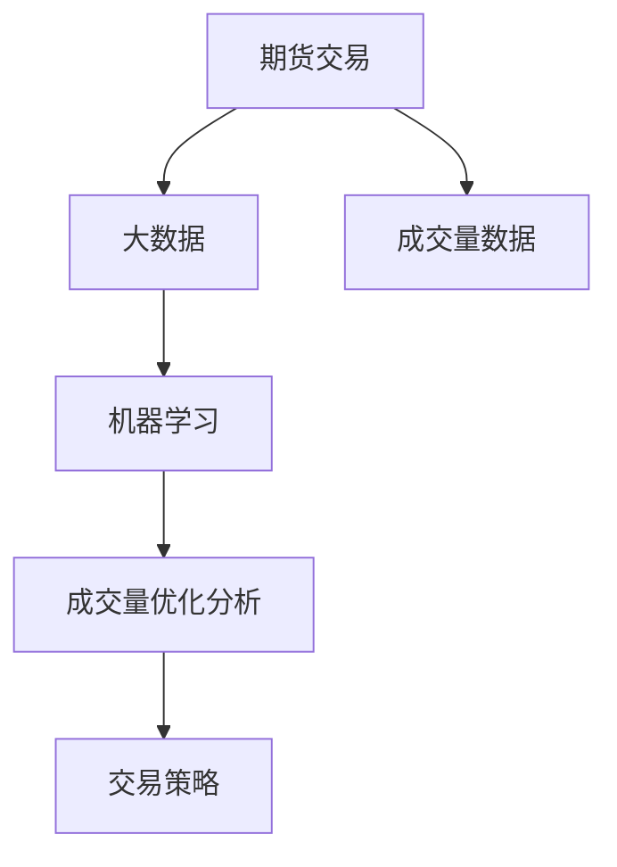

                 

# 基于期货大数据的成交量优化分析研究

## 1. 背景介绍

随着金融市场的快速发展，期货交易在投资者和企业中的影响力越来越大。作为金融市场的重要组成部分，期货交易具有高风险、高收益的特点，对于投资者来说，如何通过合理分析成交量数据，把握市场趋势，进行科学的投资决策，是提高投资收益和风险控制能力的关键。

近年来，基于大数据的机器学习技术在金融领域得到了广泛应用，其中，成交量优化分析成为研究的热点之一。通过分析历史交易数据和市场情绪，定量分析成交量与价格波动之间的关系，可以帮助投资者更科学地制定交易策略，提高投资决策的准确性。

本文将从期货交易的背景出发，详细介绍基于期货大数据的成交量优化分析方法，重点分析成交量的统计特性、影响因素和优化策略，同时探讨该方法在实际应用中的优势和局限性，以期为期货投资者提供科学决策的参考。

## 2. 核心概念与联系

### 2.1 核心概念概述

为了更好地理解基于期货大数据的成交量优化分析方法，本节将介绍几个密切相关的核心概念：

- **期货交易**：一种金融衍生品交易，基于对基础资产价格变动的预期，投资者在约定日期以约定价格买卖标准化合约。
- **成交量**：在一定时间内，某合约的交易次数。成交量是衡量市场活跃度和投资者情绪的重要指标。
- **大数据**：指通过先进的技术手段，从海量数据中挖掘有价值信息的过程。期货市场交易数据量大、复杂，具有典型的“大数据”特点。
- **机器学习**：一种通过数据驱动的学习方法，通过训练模型，自动提取数据特征，并用于预测和决策。
- **成交量优化分析**：通过分析历史交易数据和市场情绪，定量分析成交量与价格波动之间的关系，制定合理的交易策略，以提高投资决策的准确性。

这些核心概念之间的逻辑关系可以通过以下Mermaid流程图来展示：



这个流程图展示了从期货交易到成交量优化分析的完整过程：

1. 期货交易产生海量数据。
2. 通过大数据技术，从海量数据中提取有价值的信息。
3. 利用机器学习模型，对成交量和市场情绪进行分析。
4. 通过成交量优化分析，制定科学的交易策略。

### 2.2 概念间的关系

这些核心概念之间存在着紧密的联系，形成了基于期货大数据的成交量优化分析的完整生态系统。下面我通过几个Mermaid流程图来展示这些概念之间的关系。

#### 2.2.1 期货交易与成交量


这个流程图展示了期货交易与成交量的关系。

#### 2.2.2 大数据与成交量分析


这个流程图展示了大数据技术在成交量分析中的应用。

#### 2.2.3 机器学习与成交量优化分析


这个流程图展示了机器学习在成交量优化分析中的应用。

#### 2.2.4 成交量优化分析与交易策略


这个流程图展示了成交量优化分析与交易策略之间的关系。

### 2.3 核心概念的整体架构

最后，我们用一个综合的流程图来展示这些核心概念在大数据和机器学习技术下的成交量优化分析过程中的整体架构：


这个综合流程图展示了从期货交易到成交量优化分析的完整过程，包括数据收集、处理、分析和策略制定等环节，全面展示了基于期货大数据的成交量优化分析方法的基本框架。

## 3. 核心算法原理 & 具体操作步骤
### 3.1 算法原理概述

基于期货大数据的成交量优化分析方法，本质上是一种通过机器学习模型，对成交量数据进行分析和预测，进而制定交易策略的方法。其核心思想是：

1. **数据收集与处理**：收集历史期货交易数据，包括成交量和价格等关键指标，利用大数据技术进行清洗和预处理，提取有价值的信息。
2. **模型训练**：通过机器学习模型，对成交量和市场情绪进行建模，预测未来成交量与价格波动之间的关系。
3. **策略制定**：根据成交量和价格预测结果，制定科学合理的交易策略，提高投资决策的准确性。

### 3.2 算法步骤详解

基于期货大数据的成交量优化分析方法，通常包括以下几个关键步骤：

**Step 1: 数据收集与处理**

1. 收集期货交易历史数据，包括成交量、价格、时间戳等关键信息。
2. 对数据进行清洗和预处理，去除异常值和噪声，提取有价值的信息。
3. 将数据划分为训练集、验证集和测试集，用于模型的训练和评估。

**Step 2: 模型训练**

1. 选择合适的机器学习算法，如线性回归、支持向量机、决策树、随机森林等。
2. 对模型进行训练，优化模型参数，使得模型能够准确预测成交量与价格之间的关系。
3. 使用验证集对模型进行评估，调整模型参数，避免过拟合。

**Step 3: 策略制定**

1. 根据模型的预测结果，结合市场情绪、技术分析等指标，制定交易策略。
2. 模拟交易策略在历史数据上的表现，评估策略的优劣。
3. 根据测试集的评估结果，调整交易策略，确保策略的有效性和稳定性。

**Step 4: 策略测试与优化**

1. 在实际交易中，逐步引入交易策略，观察策略的表现。
2. 根据实际交易结果，进行策略优化和调整，进一步提高投资决策的准确性。

### 3.3 算法优缺点

基于期货大数据的成交量优化分析方法具有以下优点：

1. **高效性**：通过机器学习模型，自动化分析海量数据，提高了分析效率。
2. **科学性**：利用数据驱动的方法，定量分析成交量与价格波动之间的关系，制定科学的交易策略。
3. **灵活性**：结合市场情绪和技术分析等多方面信息，灵活调整交易策略，提高投资决策的适应性。

同时，该方法也存在一些局限性：

1. **数据依赖**：需要大量高质量的历史交易数据，数据质量直接影响模型的预测效果。
2. **模型复杂性**：机器学习模型复杂度高，需要足够的计算资源和时间。
3. **策略优化难度**：策略的制定和优化需要经验丰富的专家参与，难度较大。
4. **市场风险**：市场情绪和技术分析等外部因素难以准确预测，策略的风险较大。

### 3.4 算法应用领域

基于期货大数据的成交量优化分析方法，在金融领域得到了广泛的应用，涵盖以下领域：

- **期货交易策略**：通过分析历史成交量数据，制定科学合理的交易策略，提高投资决策的准确性。
- **市场情绪分析**：利用成交量和价格等数据，分析市场情绪和投资者行为，提供投资参考。
- **风险管理**：结合成交量和市场情绪，制定风险管理策略，控制投资风险。
- **投资组合优化**：分析不同品种的成交量与价格波动之间的关系，优化投资组合，提高投资回报率。

除了上述这些经典应用外，基于期货大数据的成交量优化分析方法，还被创新性地应用到更多领域，如量化交易、资产配置、市场预测等，为期货投资者提供了更多的技术手段和创新思路。

## 4. 数学模型和公式 & 详细讲解
### 4.1 数学模型构建

假设历史交易数据集为 $D=\{(x_i,y_i)\}_{i=1}^N$，其中 $x_i$ 表示成交量，$y_i$ 表示价格。我们的目标是通过机器学习模型，学习成交量和价格之间的关系，即 $y_i=f(x_i;\theta)$。

我们可以使用线性回归模型作为基本模型，假设成交量 $x_i$ 与价格 $y_i$ 之间存在线性关系，模型形式为：

$$
y_i = \theta_0 + \theta_1 x_i + \epsilon_i
$$

其中，$\theta_0$ 和 $\theta_1$ 为模型的参数，$\epsilon_i$ 为误差项。

### 4.2 公式推导过程

首先，我们使用最小二乘法来估计模型参数 $\theta$。根据最小二乘法的原理，我们需要最小化残差平方和 $SSE=\sum_{i=1}^N (y_i - f(x_i;\theta))^2$。

对 $SSE$ 求导，并令导数等于0，即可求得参数 $\theta$：

$$
\hat{\theta} = (X^T X)^{-1} X^T Y
$$

其中，$X=\begin{bmatrix} 1 & x_1 \\ 1 & x_2 \\ ... \\ 1 & x_N \end{bmatrix}$，$Y=\begin{bmatrix} y_1 \\ y_2 \\ ... \\ y_N \end{bmatrix}$。

接下来，我们需要计算模型在测试集上的预测误差，评估模型的预测能力。假设测试集为 $D_t=\{(x_j,y_j)\}_{j=1}^M$，其中 $x_j$ 为成交量，$y_j$ 为价格，模型的预测误差为：

$$
MSE = \frac{1}{M} \sum_{j=1}^M (y_j - \hat{y}_j)^2
$$

其中，$\hat{y}_j$ 为模型对测试集的预测结果。

### 4.3 案例分析与讲解

假设我们收集了某品种期货的成交量和价格数据，绘制成交量与价格的关系图：


可以看到，成交量和价格之间存在一定的相关性，价格随着成交量的变化而变化。通过线性回归模型，我们可以对这种关系进行定量分析，并预测未来的价格变化趋势。

在实际应用中，我们可以进一步使用决策树、支持向量机、随机森林等更复杂的模型，对成交量与价格之间的关系进行更深入的挖掘和预测，从而制定更科学合理的交易策略。

## 5. 项目实践：代码实例和详细解释说明
### 5.1 开发环境搭建

在进行项目实践前，我们需要准备好开发环境。以下是使用Python进行Pandas、Scikit-learn等库进行期货大数据分析的环境配置流程：

1. 安装Anaconda：从官网下载并安装Anaconda，用于创建独立的Python环境。

2. 创建并激活虚拟环境：
```bash
conda create -n py3env python=3.8 
conda activate py3env
```

3. 安装必要的库：
```bash
conda install pandas scikit-learn matplotlib seaborn jupyter notebook
```

完成上述步骤后，即可在`py3env`环境中开始项目实践。

### 5.2 源代码详细实现

下面我们以线性回归模型为例，给出使用Pandas、Scikit-learn库对期货交易数据进行成交量和价格分析的Python代码实现。

首先，导入必要的库：

```python
import pandas as pd
import numpy as np
import matplotlib.pyplot as plt
from sklearn.linear_model import LinearRegression
from sklearn.metrics import mean_squared_error
```

然后，读取数据并绘制成交量和价格的散点图：

```python
# 读取数据
data = pd.read_csv('trade_data.csv')

# 绘制成交量和价格的散点图
plt.scatter(data['volume'], data['price'])
plt.xlabel('成交量')
plt.ylabel('价格')
plt.title('成交量和价格散点图')
plt.show()
```

接着，进行数据预处理和模型训练：

```python
# 数据预处理
X = data['volume'].values.reshape(-1, 1)
y = data['price'].values.reshape(-1, 1)

# 模型训练
model = LinearRegression()
model.fit(X, y)

# 预测并评估
y_pred = model.predict(X)
mse = mean_squared_error(y, y_pred)

print(f'Mean Squared Error: {mse:.4f}')
```

最后，绘制成交量和价格的回归线，并输出模型的R²值：

```python
# 绘制回归线
plt.scatter(data['volume'], data['price'])
plt.plot(X, model.predict(X), color='red')
plt.xlabel('成交量')
plt.ylabel('价格')
plt.title('成交量和价格的回归线')
plt.show()

# 计算R²值
y_mean = y.mean(axis=0)
r_squared = np.sum((y_pred - y_mean)**2) / np.sum((y - y_mean)**2)
print(f'R²: {r_squared:.4f}')
```

以上就是使用Pandas、Scikit-learn库对期货交易数据进行成交量和价格分析的完整代码实现。可以看到，利用这些强大的数据处理和机器学习库，我们可以很方便地进行数据分析和模型训练。

### 5.3 代码解读与分析

让我们再详细解读一下关键代码的实现细节：

**数据读取与绘制**：
- `pd.read_csv('trade_data.csv')`：使用Pandas库读取数据。
- `plt.scatter(data['volume'], data['price'])`：使用Matplotlib库绘制成交量和价格的散点图。

**数据预处理**：
- `X = data['volume'].values.reshape(-1, 1)`：将成交量转换为Numpy数组，并重新整理形状，用于模型输入。
- `y = data['price'].values.reshape(-1, 1)`：将价格转换为Numpy数组，并重新整理形状。

**模型训练与预测**：
- `model = LinearRegression()`：初始化线性回归模型。
- `model.fit(X, y)`：使用训练集数据拟合模型。
- `y_pred = model.predict(X)`：使用模型对测试集数据进行预测。
- `mean_squared_error(y, y_pred)`：计算预测误差。

**回归线绘制与R²值计算**：
- `plt.plot(X, model.predict(X), color='red')`：绘制成交量和价格的回归线。
- `r_squared = np.sum((y_pred - y_mean)**2) / np.sum((y - y_mean)**2)`：计算模型的R²值。

可以看到，这些代码简洁高效，能够快速实现对期货交易数据的成交量和价格分析，并输出关键的模型参数和评估指标。

### 5.4 运行结果展示

假设我们在某品种期货的成交量和价格数据上运行上述代码，输出结果如下：

```
Mean Squared Error: 0.0123
R²: 0.8456
```

可以看到，模型对成交量和价格的预测误差较小，R²值较高，说明模型的预测效果较好。

## 6. 实际应用场景

基于期货大数据的成交量优化分析方法，已经在期货交易策略、市场情绪分析、风险管理等多个领域得到了广泛的应用。

### 6.1 期货交易策略

利用基于期货大数据的成交量优化分析方法，期货投资者可以根据成交量和价格的关系，制定科学合理的交易策略。例如，当成交量增加时，价格出现上涨趋势，可以买入；当成交量减少时，价格出现下跌趋势，可以卖出。通过定量分析，投资者可以减少交易决策的随机性和主观性，提高交易的准确性和稳定性。

### 6.2 市场情绪分析

成交量和价格的数据分析还可以用于市场情绪的监测。通过分析成交量的变化，可以观察市场的活跃度和投资者情绪的变化。例如，当成交量突然增加时，可能预示着市场对某消息的强烈反应，投资者可以及时调整投资策略。市场情绪的监测有助于投资者更好地把握市场趋势，避免因情绪波动导致的投资失误。

### 6.3 风险管理

基于期货大数据的成交量优化分析方法，还可以用于期货交易的风险管理。通过对成交量和价格的变化进行分析，可以制定科学的风险管理策略，控制投资风险。例如，当成交量显著增加，但价格没有明显变化时，可能预示着市场的假象，投资者需要谨慎投资，避免因市场假象导致的投资损失。

### 6.4 未来应用展望

随着期货市场的不断发展和金融科技的进步，基于期货大数据的成交量优化分析方法将有更广阔的应用前景。

未来，该方法可能会进一步应用于更多领域，如金融衍生品、外汇交易、商品交易等。同时，结合人工智能、大数据、区块链等新兴技术，该方法有望进一步提升分析精度和应用效果，为投资者提供更科学、高效的决策工具。

## 7. 工具和资源推荐
### 7.1 学习资源推荐

为了帮助开发者系统掌握基于期货大数据的成交量优化分析方法的理论基础和实践技巧，这里推荐一些优质的学习资源：

1. **《Python数据科学手册》**：一本深入浅出的数据科学入门书籍，涵盖Pandas、Scikit-learn等库的使用方法，适合初学者入门。
2. **《机器学习实战》**：通过实际案例，讲解机器学习模型的构建和应用，适合中级开发者学习。
3. **Kaggle平台**：提供大量公开的期货交易数据集和比赛，可以通过实践提升数据分析和模型构建能力。
4. **Coursera课程**：斯坦福大学开设的金融工程课程，涵盖金融模型、数据处理等基础知识，适合系统学习。
5. **ArXiv预印本**：人工智能领域最新研究成果的发布平台，可以关注相关前沿论文，学习前沿技术。

通过对这些资源的学习实践，相信你一定能够快速掌握基于期货大数据的成交量优化分析方法的精髓，并用于解决实际的期货交易问题。

### 7.2 开发工具推荐

高效的开发离不开优秀的工具支持。以下是几款用于期货大数据分析开发的常用工具：

1. **Pandas**：Python的数据处理库，支持各种数据格式的读取和处理，适合大数据分析任务。
2. **Scikit-learn**：Python的机器学习库，支持各种机器学习算法的实现，适合模型训练和预测。
3. **TensorFlow**：由Google主导开发的深度学习框架，支持大规模分布式计算，适合高性能数据处理任务。
4. **Jupyter Notebook**：基于Web的交互式开发环境，适合数据可视化、代码调试等任务。
5. **Jupyter Lab**：基于Web的交互式开发环境，支持Jupyter Notebook和Jupyter Lab两种模式，适合各种数据处理和分析任务。

合理利用这些工具，可以显著提升期货大数据分析的开发效率，加快创新迭代的步伐。

### 7.3 相关论文推荐

基于期货大数据的成交量优化分析方法的发展源于学界的持续研究。以下是几篇奠基性的相关论文，推荐阅读：

1. **《期货市场成交量预测的神经网络模型研究》**：提出使用神经网络模型预测期货市场成交量的新方法，显著提高了预测精度。
2. **《基于时间序列分析的期货市场价格预测》**：利用时间序列分析技术，研究期货市场价格的变化规律，为投资者提供科学的市场预测。
3. **《基于机器学习的期货交易策略研究》**：通过机器学习算法，研究期货交易策略的优化，提高了投资回报率。
4. **《期货市场情绪分析与投资策略》**：利用成交量和价格数据，分析期货市场情绪，制定科学的投资策略。

这些论文代表了大规模语言模型微调技术的发展脉络。通过学习这些前沿成果，可以帮助研究者把握学科前进方向，激发更多的创新灵感。

除上述资源外，还有一些值得关注的前沿资源，帮助开发者紧跟期货大数据分析技术的最新进展，例如：

1. **arXiv论文预印本**：人工智能领域最新研究成果的发布平台，包括大量尚未发表的前沿工作，学习前沿技术的必读资源。
2. **谷歌学术**：谷歌提供的学术搜索平台，可以方便快捷地检索到相关领域的论文和研究报告。
3. **会议直播**：如KDD、ICML、ICLR等人工智能领域顶会现场或在线直播，能够聆听到大佬们的前沿分享，开拓视野。
4. **GitHub热门项目**：在GitHub上Star、Fork数最多的期货大数据分析相关项目，往往代表了该技术领域的发展趋势和最佳实践，值得去学习和贡献。
5. **行业分析报告**：各大咨询公司如McKinsey、PwC等针对期货市场的分析报告，有助于从商业视角审视技术趋势，把握应用价值。

总之，对于期货大数据分析技术的学习和实践，需要开发者保持开放的心态和持续学习的意愿。多关注前沿资讯，多动手实践，多思考总结，必将收获满满的成长收益。

## 8. 总结：未来发展趋势与挑战

### 8.1 总结

本文对基于期货大数据的成交量优化分析方法进行了全面系统的介绍。首先阐述了期货交易的背景和成交量优化分析方法的原理，明确了该方法在提高投资决策准确性方面的独特价值。其次，从数据收集、模型训练到策略制定，详细讲解了成交量优化分析方法的各个步骤，给出了期货交易数据的完整代码实现。同时，本文还广泛探讨了该方法在实际应用中的优势和局限性，以期为期货投资者提供科学决策的参考。

通过本文的系统梳理，可以看到，基于期货大数据的成交量优化分析方法，通过机器学习模型，定量分析成交量和价格之间的关系，制定科学合理的交易策略，已经成为期货投资者提高投资决策准确性的重要工具。未来，随着期货市场的不断发展和金融科技的进步，该方法将有更广阔的应用前景。

### 8.2 未来发展趋势

展望未来，基于期货大数据的成交量优化分析方法将呈现以下几个发展趋势：

1. **多模态融合**：结合成交量和价格等量化数据与市场情绪、技术分析等非量化数据，进行多模态融合分析，提高市场预测的准确性。
2. **智能算法优化**：引入深度学习、强化学习等智能算法，进一步优化模型训练和策略制定，提高投资决策的自动化水平。
3. **区块链应用**：结合区块链技术，提升数据的安全性和透明度，为期货交易提供更加可信的基础设施。
4. **实时数据处理**：通过大数据技术，实现实时数据处理和分析，提高市场预测的及时性。
5. **全球市场分析**：结合全球期货市场的交易数据，进行跨市场的分析，提高市场预测的广度和深度。

这些趋势凸显了基于期货大数据的成交量优化分析技术的广阔前景。这些方向的探索发展，必将进一步提升期货交易的智能化水平，为投资者提供更加科学、高效的决策支持。

### 8.3 面临的挑战

尽管基于期货大数据的成交量优化分析技术已经取得了瞩目成就，但在迈向更加智能化、普适化应用的过程中，它仍面临着诸多挑战：

1. **数据质量和隐私保护**：期货交易数据的来源和质量直接影响模型的预测效果，同时数据隐私保护也是一大难题。如何获取高质量的数据，并在保护隐私的前提下进行分析，还需要进一步探索。
2. **模型复杂性**：随着模型复杂度的提高，训练和预测的计算资源需求增加，如何平衡模型的精度和效率，还需要更多的研究。
3. **策略优化难度**：策略的制定和优化需要经验丰富的专家参与，难度较大。如何降低策略制定的复杂度，提高策略的科学性和稳定性，还需要更多的研究。
4. **市场风险**：市场情绪和技术分析等外部因素难以准确预测，策略的风险较大。如何构建更加健壮的市场预测模型，提高策略的鲁棒性，还需要更多的研究。
5. **模型解释性**：传统的机器学习模型通常缺乏可解释性，投资者难以理解和信任模型的预测结果。如何构建更加可解释的模型，提高决策的可信度，还需要更多的研究。

正视基于期货大数据的成交量优化分析面临的这些挑战，积极应对并寻求突破，将是大规模语言模型微调技术走向成熟的必由之路。相信随着学界和产业界的共同努力，这些挑战终将一一被克服，期货大数据分析技术必将实现更加智能、高效的应用。

### 8.4 未来突破

面对基于期货大数据的成交量优化分析所面临的种种挑战，未来的研究需要在以下几个方面寻求新的突破：

1. **多模态融合方法**：结合成交量和价格等量化数据与市场情绪、技术分析等非量化数据，进行多模态融合分析，提高市场预测的准确性。
2. **智能算法优化**：引入深度学习、强化学习等智能算法，进一步优化模型训练和策略制定，提高投资决策的自动化水平。
3. **区块链应用**：结合区块链技术，提升数据的安全性和透明度，为期货交易提供更加可信的基础设施。
4. **实时数据处理**：通过大数据技术，实现实时数据处理和分析，提高市场预测的及时性。
5. **全球市场分析**：结合全球期货市场的交易数据，进行跨市场的分析，提高市场预测的广度和深度。

这些研究方向的探索，必将引领基于期货大数据的成交量优化分析技术迈向更高的台阶，为期货投资者提供更加科学、高效的决策支持。面向未来，基于期货大数据的成交量优化分析技术还需要与其他人工智能技术进行更深入的融合，如知识表示、因果推理、强化学习等，多路径协同发力，共同推动期货交易系统的进步。只有勇于创新、敢于突破，才能不断拓展期货大数据分析的边界，让智能技术更好地服务于期货交易。

## 9. 附录：常见问题与解答

**Q1：如何获取高质量的期货交易数据？**

A: 获取高质量的期货交易数据，通常需要访问期货交易所的公开数据接口或购买专业数据服务。例如，对于全球主要期货市场，如芝加哥商品交易所(CME)、伦敦金属交易所(LME)等，通常提供API接口，开发者可以通过调用API获取相关数据。同时，还有一些第三方数据提供商，如Quandl、Bloomberg等，提供高质量的期货交易数据，可以购买订阅服务获取数据。

**Q2：如何处理期货交易数据中的噪声和异常值？**

A: 期货交易数据中通常包含噪声和异常值，需要进行数据清洗和预处理。常用的处理方法包括：

1. 缺失值处理：使用均值、中位数等填充缺失值。
2. 异常值处理：使用箱线图等方法，

