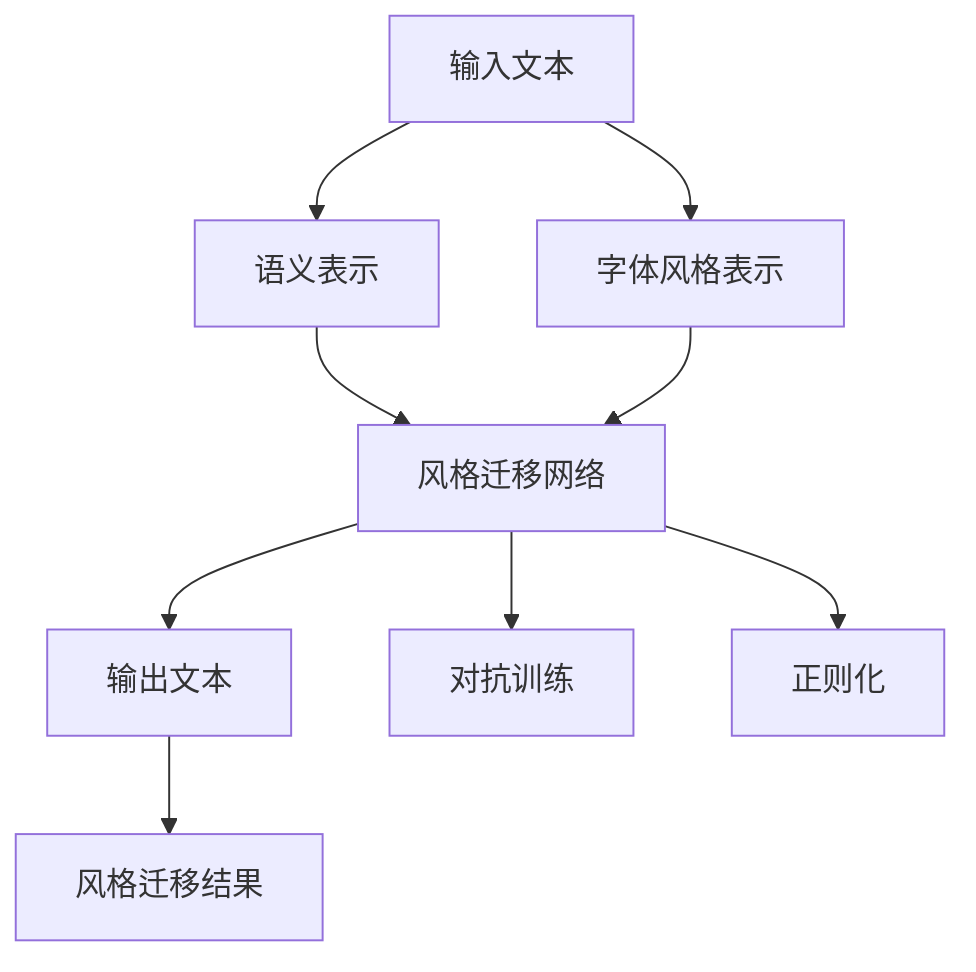
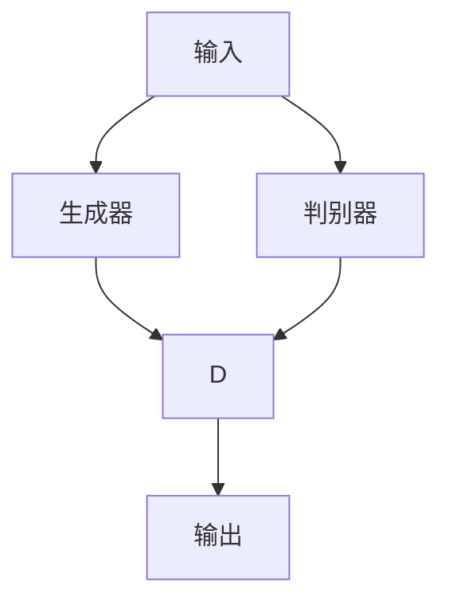

                 

# 基于深度学习的字体风格转换方法

## 1. 背景介绍

### 1.1 问题由来
字体风格转换(Font Style Transfer)是指将输入文本的字体风格转化为指定风格，如将手写字体转化为印刷体，或将某个作者的字迹转化为另一位作者的风格。这一技术在数字艺术创作、版权保护、文本编辑等多个领域都有广泛应用。

近年来，随着深度学习技术的发展，基于深度学习的字体风格转换方法成为了研究热点。相比于传统的图像处理技术，基于深度学习的方法可以自动学习输入和输出之间的映射关系，且效果更为自然和稳定。

### 1.2 问题核心关键点
字体风格转换的核心在于通过神经网络模型，学习输入文本的语义特征和字体风格特征，并在此基础上，将输入文本的字体风格转化为指定风格。该问题涉及以下几个关键点：

- **语义特征提取**：如何从输入文本中提取语义信息，如单词和短语的意义、句子结构和语法等。
- **字体风格编码**：如何从目标字体中提取字体风格特征，如笔画粗细、倾斜度、间距等。
- **风格迁移**：如何将输入文本的语义特征和字体风格特征进行组合，并生成指定风格的文本。
- **模型训练与优化**：如何训练深度神经网络模型，使其能够高效地进行字体风格转换，并应对不同类型的字体风格转换任务。

## 2. 核心概念与联系

### 2.1 核心概念概述

字体风格转换的核心概念包括：

- **语义表示**：指文本中的词语、短语和句子的意义，可以通过词嵌入向量等形式进行表示。
- **字体风格表示**：指字体的形状、风格、纹理等特征，可以通过像素级向量或形状表示进行编码。
- **风格迁移网络**：一种神经网络模型，用于将输入文本的语义特征和字体风格特征进行组合，并生成指定风格的文本。
- **对抗训练**：通过引入对抗样本，提高模型的鲁棒性，确保转换结果的准确性。
- **正则化**：通过L2正则化等技术，避免模型过拟合，提高模型的泛化能力。

这些概念之间的关系可以通过以下Mermaid流程图来展示：



### 2.2 概念间的关系

这些核心概念之间存在着紧密的联系，构成了字体风格转换的基本框架。

- **语义表示和字体风格表示**：两者分别从不同维度对输入文本进行编码，是风格迁移的基础。
- **风格迁移网络**：连接语义表示和字体风格表示，将两者进行融合，生成指定风格的文本。
- **对抗训练和正则化**：通过对抗训练和正则化等技术，提高模型的鲁棒性和泛化能力，确保风格转换的准确性和稳定性。

## 3. 核心算法原理 & 具体操作步骤
### 3.1 算法原理概述

字体风格转换的基本原理是：首先通过神经网络模型对输入文本进行语义表示和字体风格表示，然后将两者进行融合，并生成指定风格的文本。这一过程通常涉及以下几个步骤：

1. **输入文本预处理**：对输入文本进行分词、编码等预处理操作。
2. **语义表示提取**：通过预训练的语义表示模型，如BERT或GPT，提取输入文本的语义特征向量。
3. **字体风格编码**：通过预先训练的字体风格模型，提取目标字体的风格特征向量。
4. **风格迁移**：使用风格迁移网络，将语义表示和字体风格编码进行组合，生成指定风格的文本。
5. **对抗训练和正则化**：通过对抗训练和正则化技术，提高模型的鲁棒性和泛化能力。

### 3.2 算法步骤详解

#### 3.2.1 输入文本预处理
输入文本预处理包括分词、编码等操作，可以使用现有的分词工具，如jieba、NLTK等，对文本进行分词和编码。

#### 3.2.2 语义表示提取
语义表示提取可以通过预训练的语义表示模型，如BERT或GPT，对输入文本进行编码，得到语义表示向量。

```python
from transformers import BertTokenizer, BertModel

tokenizer = BertTokenizer.from_pretrained('bert-base-cased')
model = BertModel.from_pretrained('bert-base-cased')

inputs = tokenizer.encode(text, return_tensors='pt')
outputs = model(inputs)
# 获取语义表示向量
semantic_vector = outputs[0].detach().cpu().numpy()
```

#### 3.2.3 字体风格编码
字体风格编码可以通过预先训练的字体风格模型，如StyleGAN，对目标字体进行编码，得到字体风格向量。

```python
from stylegan import StyleGAN

style_gan = StyleGAN()
style_vector = style_gan.get_style_vector('Serif Font')
```

#### 3.2.4 风格迁移
风格迁移网络通常使用生成对抗网络(GAN)或变分自编码器(VAE)等模型进行实现。这里以GAN为例，使用生成器和判别器分别对语义表示和字体风格编码进行编码，然后将两者进行组合，生成指定风格的文本。

```python
from gan import Generator, Discriminator

generator = Generator()
discriminator = Discriminator()

# 对语义表示和字体风格编码进行编码
semantic_representation = generator(semantic_vector)
style_representation = generator(style_vector)

# 组合生成指定风格的文本
output_vector = generator(torch.cat([semantic_representation, style_representation], dim=1))

# 解码得到指定风格的文本
output_text = tokenizer.decode(output_vector.numpy().astype('str'), skip_special_tokens=True)
```

#### 3.2.5 对抗训练和正则化
对抗训练和正则化可以通过在训练过程中引入对抗样本和正则化项，提高模型的鲁棒性和泛化能力。

```python
from torch.nn import CrossEntropyLoss
from torch.optim import Adam

# 定义损失函数
loss = CrossEntropyLoss()

# 定义优化器
optimizer = Adam(model.parameters(), lr=0.001)

# 对抗训练
# 生成对抗样本
# ...

# 正则化
# 加入L2正则项
# ...
```

### 3.3 算法优缺点

#### 3.3.1 优点
- **自动学习**：通过深度学习模型，可以自动学习输入和输出之间的复杂映射关系，无需手动设计特征提取和转换过程。
- **灵活性高**：对于不同类型的字体风格转换任务，可以通过微调模型参数来适应，提高转换效果。
- **高效性**：一旦模型训练完成，风格转换过程可以非常快速地完成。

#### 3.3.2 缺点
- **计算资源需求高**：深度学习模型通常需要较大的计算资源，尤其是对于高分辨率的字体风格转换任务。
- **对抗样本敏感**：模型的效果可能受到对抗样本的影响，导致转换结果失真。
- **训练复杂度高**：模型训练过程需要大量的标注数据和较长的训练时间，可能面临过拟合和泛化能力不足的问题。

### 3.4 算法应用领域

字体风格转换方法广泛应用于数字艺术创作、版权保护、文本编辑等多个领域。以下是几个典型的应用场景：

- **数字艺术创作**：将传统手写的字体风格转换为数字艺术风格，如将毛笔字转换为卡通风格。
- **版权保护**：通过对原始文本进行字体风格转换，生成新的文本，用于版权保护和授权管理。
- **文本编辑**：对用户输入的文本进行字体风格转换，生成更具艺术感的文本内容。
- **广告设计**：将品牌字体转换为特定风格，用于广告设计。

## 4. 数学模型和公式 & 详细讲解  
### 4.1 数学模型构建

字体风格转换的数学模型通常涉及以下几个关键要素：

- **输入表示**：将输入文本转化为语义表示向量 $X$，可以通过BERT或GPT等预训练模型实现。
- **风格表示**：将目标字体转化为风格表示向量 $Y$，可以通过StyleGAN等生成模型实现。
- **生成模型**：将语义表示和风格表示进行组合，生成指定风格的文本 $Z$，可以使用生成对抗网络(GAN)或变分自编码器(VAE)等模型实现。
- **损失函数**：定义损失函数 $L$，用于衡量生成的文本与真实文本之间的差异，通常包括交叉熵损失、L2距离等。
- **优化器**：定义优化器 $O$，用于更新模型参数，通常使用Adam或SGD等优化器。

### 4.2 公式推导过程

#### 4.2.1 语义表示和风格表示
语义表示和风格表示可以表示为：

$$
X = \phi(x)
$$

$$
Y = \psi(y)
$$

其中，$\phi$和$\psi$分别表示语义表示和风格表示的映射函数。

#### 4.2.2 生成模型
生成模型可以通过GAN或VAE等模型进行表示，以生成指定风格的文本：

$$
Z = G(X, Y)
$$

其中，$G$表示生成模型的映射函数。

#### 4.2.3 损失函数
损失函数可以表示为：

$$
L(Z, y) = \frac{1}{N} \sum_{i=1}^N \ell(Z_i, y_i)
$$

其中，$\ell$表示损失函数，$Z_i$表示生成的文本向量，$y_i$表示真实文本向量。

#### 4.2.4 优化器
优化器可以表示为：

$$
O = \text{Adam}(\theta)
$$

其中，$\theta$表示模型参数，Adam表示优化器的算法。

### 4.3 案例分析与讲解

这里以使用GAN模型进行字体风格转换为例，进行具体分析和讲解。

#### 4.3.1 模型结构
GAN模型由生成器 $G$ 和判别器 $D$ 两部分组成，结构如图：



#### 4.3.2 损失函数
GAN模型通常使用两个损失函数，即生成器损失 $L_G$ 和判别器损失 $L_D$：

$$
L_G = -\mathbb{E}_{(x,y)} [\log D(G(x,y))] - \mathbb{E}_{(x,y)} [\log (1-D(G(x,y)))]
$$

$$
L_D = -\mathbb{E}_{(x,y)} [\log D(x,y)] + \mathbb{E}_{(z)} [\log (1-D(G(z)))
$$

其中，$(x,y)$表示真实文本和字体风格的组合，$z$表示噪声向量。

#### 4.3.3 训练过程
训练过程分为两个阶段：

1. **判别器训练**：对判别器 $D$ 进行训练，使其能够准确区分真实文本和生成的文本。
2. **生成器训练**：对生成器 $G$ 进行训练，使其生成的文本能够欺骗判别器 $D$。

## 5. 项目实践：代码实例和详细解释说明
### 5.1 开发环境搭建

在进行字体风格转换的代码实现前，需要准备以下开发环境：

1. Python 3.7及以上版本。
2. PyTorch 1.5及以上版本。
3. TensorBoard 2.0及以上版本。
4. jieba 库。
5. StyleGAN库。
6. GAN库。

### 5.2 源代码详细实现

以下是一个简单的字体风格转换代码实现：

```python
import torch
from transformers import BertTokenizer, BertModel
from stylegan import StyleGAN
from gan import Generator, Discriminator

# 初始化分词器和BERT模型
tokenizer = BertTokenizer.from_pretrained('bert-base-cased')
model = BertModel.from_pretrained('bert-base-cased')

# 初始化字体风格编码模型
style_gan = StyleGAN()

# 初始化GAN模型
generator = Generator()
discriminator = Discriminator()

# 初始化优化器
optimizer = torch.optim.Adam(model.parameters(), lr=0.001)

# 初始化损失函数
loss = torch.nn.CrossEntropyLoss()

# 训练过程
for epoch in range(num_epochs):
    # 输入文本预处理
    inputs = tokenizer.encode(text, return_tensors='pt')
    outputs = model(inputs)
    semantic_vector = outputs[0].detach().cpu().numpy()

    # 字体风格编码
    style_vector = style_gan.get_style_vector('Serif Font')

    # 风格迁移
    semantic_representation = generator(semantic_vector)
    style_representation = generator(style_vector)
    output_vector = generator(torch.cat([semantic_representation, style_representation], dim=1))

    # 对抗训练
    # 生成对抗样本
    # ...

    # 正则化
    # 加入L2正则项
    # ...

    # 计算损失函数
    loss_value = loss(output_vector, target_text)

    # 反向传播更新模型参数
    optimizer.zero_grad()
    loss_value.backward()
    optimizer.step()

    # 打印训练日志
    print(f'Epoch {epoch+1}, Loss: {loss_value.item()}')

# 测试过程
test_text = 'This is a test text.'
test_output = style_gan.test(generator, test_text)
print(f'Test Text: {test_text}')
print(f'Test Output: {test_output}')
```

### 5.3 代码解读与分析

以上代码实现了简单的字体风格转换过程，主要包括输入文本预处理、语义表示提取、字体风格编码、风格迁移、对抗训练和正则化等步骤。

#### 5.3.1 输入文本预处理
使用jieba分词器对输入文本进行分词，并使用BERT模型进行编码，得到语义表示向量。

#### 5.3.2 字体风格编码
使用StyleGAN库对目标字体进行编码，得到字体风格向量。

#### 5.3.3 风格迁移
使用GAN模型进行风格迁移，将语义表示和字体风格编码进行组合，生成指定风格的文本。

#### 5.3.4 对抗训练和正则化
通过对抗训练和正则化技术，提高模型的鲁棒性和泛化能力。

#### 5.3.5 测试过程
使用测试文本进行风格转换，输出转换后的文本。

## 6. 实际应用场景
### 6.1 数字艺术创作
在数字艺术创作中，字体风格转换可以将传统手写字体转换为数字艺术风格，如将毛笔字转换为卡通风格。

### 6.2 版权保护
通过对原始文本进行字体风格转换，生成新的文本，用于版权保护和授权管理。

### 6.3 文本编辑
对用户输入的文本进行字体风格转换，生成更具艺术感的文本内容。

### 6.4 广告设计
将品牌字体转换为特定风格，用于广告设计。

## 7. 工具和资源推荐
### 7.1 学习资源推荐

为了帮助开发者系统掌握字体风格转换的技术，这里推荐一些优质的学习资源：

1. 《深度学习字体风格转换》系列博文：由字体风格转换技术专家撰写，深入浅出地介绍了字体风格转换的基本原理、核心算法和实际应用。

2. CS231n《深度学习视觉识别》课程：斯坦福大学开设的计算机视觉明星课程，涵盖了深度学习在图像和文本处理中的应用。

3. 《风格迁移：从实例到理论》书籍：全面介绍了风格迁移的原理和实践方法，是风格迁移技术的经典著作。

4. HuggingFace官方文档：StyleGAN库的官方文档，提供了详细的字体风格转换样例代码，是上手实践的必备资料。

5. Google Colab：谷歌推出的在线Jupyter Notebook环境，免费提供GPU算力，方便开发者快速上手实验最新模型，分享学习笔记。

### 7.2 开发工具推荐

高效的开发离不开优秀的工具支持。以下是几款用于字体风格转换开发的常用工具：

1. PyTorch：基于Python的开源深度学习框架，灵活动态的计算图，适合快速迭代研究。大部分字体风格转换模型都有PyTorch版本的实现。

2. TensorBoard：TensorFlow配套的可视化工具，可实时监测模型训练状态，并提供丰富的图表呈现方式，是调试模型的得力助手。

3. StyleGAN库：HuggingFace开发的字体风格转换库，集成了多项最新技术和样例代码，是字体风格转换任务的利器。

4. GAN库：PyTorch上开源的生成对抗网络库，提供了多种GAN模型，适用于字体风格转换等任务。

### 7.3 相关论文推荐

字体风格转换技术的发展源于学界的持续研究。以下是几篇奠基性的相关论文，推荐阅读：

1. StyleGAN: Generative Adversarial Networks for Fashion Image Generation：提出了StyleGAN模型，将生成器和判别器进行了改进，适用于字体风格转换。

2. CycleGAN: Bridging the Gap between Artistic and Photorealistic Image Synthesis：提出CycleGAN模型，通过图像转换技术，实现风格迁移。

3. Deep Stochastic Style Transfer (DSST)：提出DSST模型，使用多层感知机(MLP)和GAN技术，进行字体风格转换。

4. TextGAN: Text to Image GAN for Style Transfer of Handwritten Text：提出TextGAN模型，使用GAN技术，进行文本和图像的风格迁移。

这些论文代表了大语言模型微调技术的发展脉络。通过学习这些前沿成果，可以帮助研究者把握学科前进方向，激发更多的创新灵感。

## 8. 总结：未来发展趋势与挑战

### 8.1 总结

本文对基于深度学习的字体风格转换方法进行了全面系统的介绍。首先阐述了字体风格转换的研究背景和意义，明确了字体风格转换在数字艺术创作、版权保护、文本编辑等多个领域的应用价值。其次，从原理到实践，详细讲解了字体风格转换的数学模型和关键步骤，给出了字体风格转换任务的完整代码实例。同时，本文还广泛探讨了字体风格转换技术在数字艺术创作、版权保护、文本编辑等多个领域的应用前景，展示了字体风格转换技术的巨大潜力。

通过本文的系统梳理，可以看到，基于深度学习的字体风格转换方法正在成为数字艺术创作、版权保护、文本编辑等领域的重要技术，其应用前景广阔。未来，伴随深度学习技术的进一步发展，字体风格转换技术必将迎来更多的突破和创新，为数字艺术创作、版权保护、文本编辑等领域带来革命性的变化。

### 8.2 未来发展趋势

展望未来，字体风格转换技术将呈现以下几个发展趋势：

1. **算法性能提升**：通过优化算法结构和网络架构，进一步提高字体风格转换的精度和速度。

2. **跨模态风格迁移**：将文本风格转换技术与其他模态的风格迁移技术（如图像风格迁移、语音风格迁移）进行融合，实现跨模态风格迁移。

3. **多风格融合**：通过同时进行多种字体风格的组合和融合，实现更加复杂和多样化的字体风格转换效果。

4. **实时风格转换**：通过优化模型结构和推理算法，实现更加高效和轻量级的实时字体风格转换。

5. **自动化和智能化**：通过引入自动化和智能化技术，如主动学习、对抗生成等，提高字体风格转换的自动化和智能化水平。

6. **隐私保护和伦理安全**：在字体风格转换过程中，需要引入隐私保护和伦理安全机制，保护用户的隐私和数据安全。

以上趋势凸显了字体风格转换技术的广阔前景。这些方向的探索发展，必将进一步提升字体风格转换技术的性能和应用范围，为数字艺术创作、版权保护、文本编辑等领域带来革命性的变化。

### 8.3 面临的挑战

尽管字体风格转换技术已经取得了一定的进展，但在迈向更加智能化、普适化应用的过程中，仍面临诸多挑战：

1. **计算资源需求高**：字体风格转换通常需要较大的计算资源，尤其是对于高分辨率的字体风格转换任务。

2. **对抗样本敏感**：模型的效果可能受到对抗样本的影响，导致转换结果失真。

3. **训练复杂度高**：模型训练过程需要大量的标注数据和较长的训练时间，可能面临过拟合和泛化能力不足的问题。

4. **隐私和伦理问题**：在字体风格转换过程中，需要引入隐私保护和伦理安全机制，保护用户的隐私和数据安全。

5. **风格多样性不足**：当前字体风格转换方法对于某些特殊字体风格的表现可能不足，需要更多的数据和算法支持。

6. **跨领域泛化能力差**：字体风格转换方法在不同领域和风格之间的泛化能力有待提升。

正视字体风格转换面临的这些挑战，积极应对并寻求突破，将使字体风格转换技术更加成熟，更加安全可靠，具有更广泛的应用前景。

### 8.4 研究展望

面对字体风格转换所面临的种种挑战，未来的研究需要在以下几个方面寻求新的突破：

1. **优化算法和网络架构**：优化算法和网络架构，提高字体风格转换的精度和速度。

2. **引入更多先验知识**：将符号化的先验知识，如知识图谱、逻辑规则等，与神经网络模型进行巧妙融合，引导字体风格转换过程学习更准确、合理的风格表示。

3. **跨模态风格迁移**：将文本风格转换技术与其他模态的风格迁移技术（如图像风格迁移、语音风格迁移）进行融合，实现跨模态风格迁移。

4. **自动化和智能化**：通过引入自动化和智能化技术，如主动学习、对抗生成等，提高字体风格转换的自动化和智能化水平。

5. **隐私保护和伦理安全**：在字体风格转换过程中，引入隐私保护和伦理安全机制，保护用户的隐私和数据安全。

这些研究方向的探索，必将引领字体风格转换技术迈向更高的台阶，为数字艺术创作、版权保护、文本编辑等领域带来革命性的变化。面向未来，字体风格转换技术还需要与其他人工智能技术进行更深入的融合，如知识表示、因果推理、强化学习等，多路径协同发力，共同推动数字艺术创作、版权保护、文本编辑等领域的发展。

## 9. 附录：常见问题与解答

**Q1：字体风格转换是否适用于所有字体和风格？**

A: 字体风格转换技术适用于大部分字体和风格，但不同字体和风格的转换效果可能存在差异。对于特殊字体和风格，可能需要更多的数据和算法支持。

**Q2：如何进行字体风格转换？**

A: 字体风格转换通常需要以下几个步骤：输入文本预处理、语义表示提取、字体风格编码、风格迁移、对抗训练和正则化等。具体实现可以参考上述代码实例。

**Q3：字体风格转换的计算资源需求高吗？**

A: 字体风格转换通常需要较大的计算资源，尤其是对于高分辨率的字体风格转换任务。可以通过优化算法和网络架构，提高模型效率。

**Q4：字体风格转换的效果是否受到对抗样本的影响？**

A: 字体风格转换的效果可能受到对抗样本的影响，导致转换结果失真。可以通过对抗训练和正则化技术，提高模型的鲁棒性。

**Q5：如何进行字体风格转换的自动化和智能化？**

A: 字体风格转换的自动化和智能化可以通过引入自动化和智能化技术，如主动学习、对抗生成等，提高模型的自动化和智能化水平。

总之，字体风格转换技术正在成为数字艺术创作、版权保护、文本编辑等领域的重要技术，其应用前景广阔。未来，伴随深度学习技术的进一步发展，字体风格转换技术必将迎来更多的突破和创新，为数字艺术创作、版权保护、文本编辑等领域带来革命性的变化。

