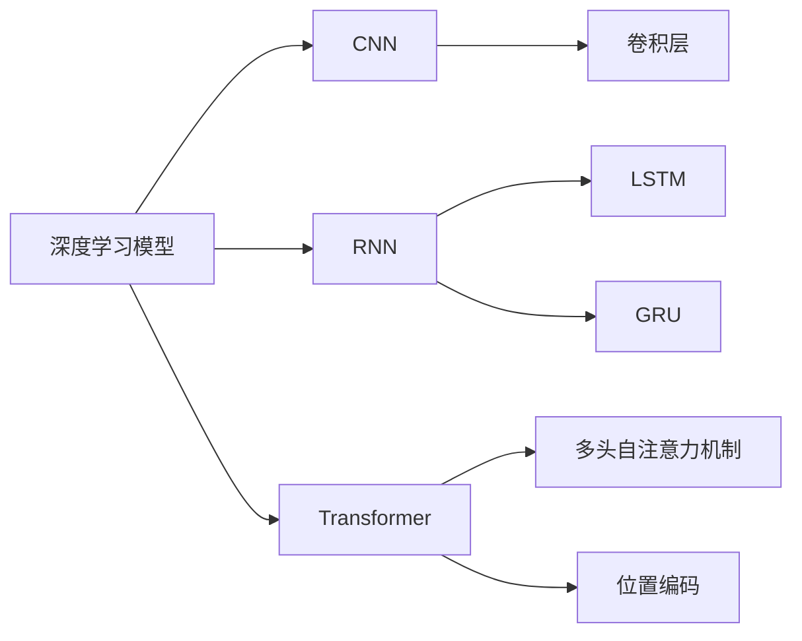
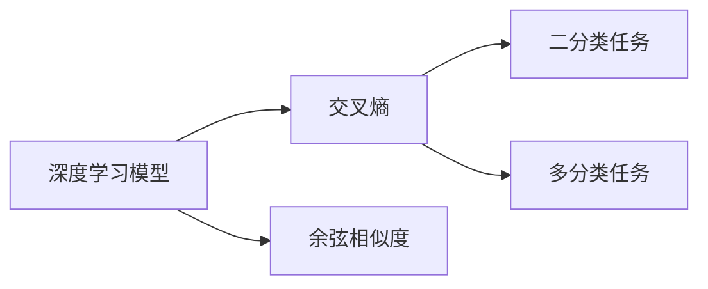
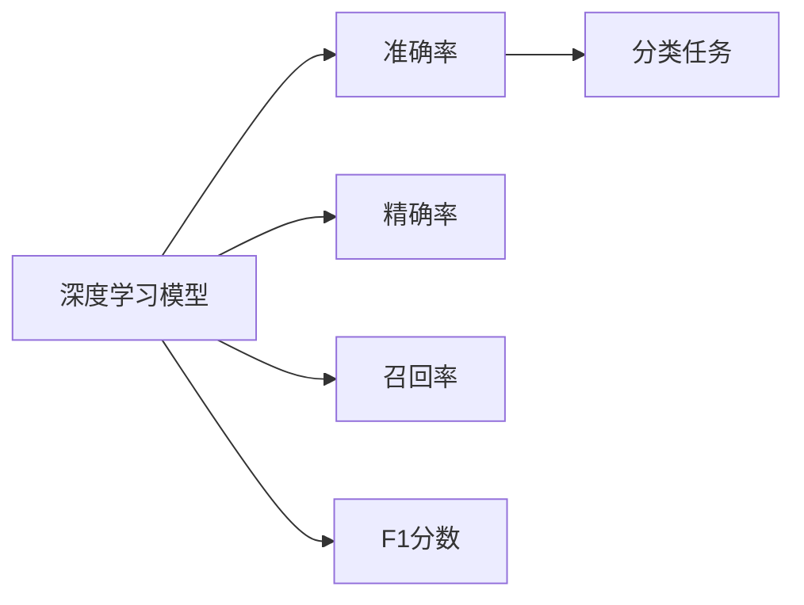
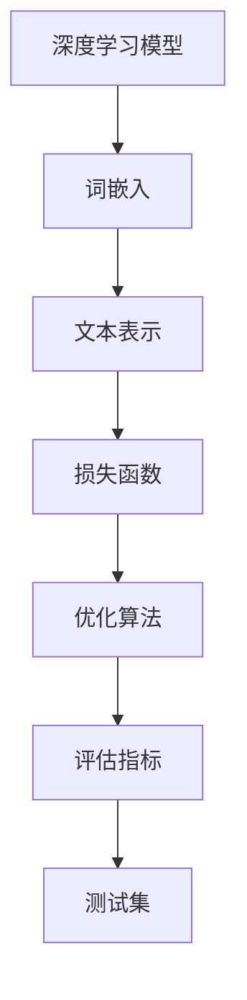

                 

# 基于深度学习的文本分类

## 1. 背景介绍

### 1.1 问题由来
文本分类是自然语言处理（NLP）领域中的一个基础且重要的任务，它将文本数据归类为不同的预定义类别。在实际应用中，文本分类被广泛应用于垃圾邮件过滤、情感分析、新闻分类、信息检索、用户行为分析等多个领域。近年来，随着深度学习技术的发展，基于深度神经网络的文本分类方法取得了显著进展，成为NLP领域中的主流技术。

### 1.2 问题核心关键点
文本分类的问题核心在于如何将输入的文本映射到正确的类别。传统的文本分类方法主要依赖于基于统计的方法，如朴素贝叶斯、支持向量机（SVM）等，但这些方法的性能往往受限于特征工程的质量。而基于深度学习的文本分类方法，能够自动学习输入文本的高级特征表示，具有更好的泛化能力和鲁棒性。

文本分类的关键技术包括：

- 深度学习模型架构设计：如何选择合适的神经网络结构，如图卷积网络（CNN）、循环神经网络（RNN）和Transformer等，来处理不同长度、不同特征的文本。
- 特征提取：如何将文本数据转化为神经网络可以处理的数值型数据。常见的技术包括词袋模型（Bag of Words）、TF-IDF、词嵌入（Word Embedding）等。
- 损失函数和优化算法：如何设计合适的损失函数，如交叉熵、余弦相似度等，以及选择合适的优化算法，如随机梯度下降（SGD）、Adam等，来最小化损失函数。

### 1.3 问题研究意义
文本分类技术的进步对于提升信息处理效率、改善用户体验、增强系统决策能力具有重要意义。具体应用包括但不限于：

- 垃圾邮件过滤：通过识别垃圾邮件中的关键词、链接等特征，将邮件归类为垃圾邮件或非垃圾邮件。
- 情感分析：分析用户对产品或服务的评论、反馈等文本数据，判断情感倾向为正面、负面或中性。
- 新闻分类：将新闻报道归类为政治、体育、财经等不同主题。
- 信息检索：根据用户查询意图，从大量文本数据中筛选出最相关的文档或网页。
- 用户行为分析：通过分析用户在社交媒体上的言论、行为数据，进行用户画像、群体分析等。

## 2. 核心概念与联系

### 2.1 核心概念概述

为更好地理解基于深度学习的文本分类方法，本节将介绍几个关键概念：

- 深度学习模型：基于人工神经网络（ANN）的模型，通过多层次的非线性变换学习输入数据的高级特征表示。常用的深度学习模型包括卷积神经网络（CNN）、循环神经网络（RNN）和Transformer等。
- 词嵌入（Word Embedding）：将离散的词汇映射到连续的向量空间，捕捉词汇之间的语义关系和相似度。常见的词嵌入方法包括Word2Vec、GloVe等。
- 文本表示：将文本数据转化为神经网络可以处理的数值型数据。常见的文本表示方法包括词袋模型（Bag of Words）、TF-IDF、词嵌入等。
- 损失函数：用于衡量模型预测值与真实标签之间的差距，是优化算法的主要目标函数。常用的损失函数包括交叉熵、余弦相似度等。
- 优化算法：用于更新模型参数，最小化损失函数。常用的优化算法包括随机梯度下降（SGD）、Adam等。
- 评估指标：用于衡量模型在测试集上的性能，常用的评估指标包括准确率、精确率、召回率、F1分数等。

这些核心概念之间的逻辑关系可以通过以下Mermaid流程图来展示：


这个流程图展示了大模型在文本分类中的核心概念及其之间的关系：

1. 深度学习模型通过学习输入文本的高级特征表示。
2. 词嵌入将词汇映射到连续向量空间，捕捉词汇之间的语义关系。
3. 文本表示将文本数据转化为数值型数据。
4. 损失函数衡量模型预测值与真实标签之间的差距。
5. 优化算法更新模型参数，最小化损失函数。
6. 评估指标衡量模型在测试集上的性能。

### 2.2 概念间的关系

这些核心概念之间存在着紧密的联系，形成了文本分类的完整生态系统。下面我们通过几个Mermaid流程图来展示这些概念之间的关系。

#### 2.2.1 深度学习模型架构设计



这个流程图展示了深度学习模型架构设计的基本方法，包括CNN、RNN和Transformer等模型结构。

#### 2.2.2 损失函数设计



这个流程图展示了常用的损失函数设计，包括交叉熵和余弦相似度等。

#### 2.2.3 评估指标选择



这个流程图展示了常用的评估指标选择，包括准确率、精确率、召回率和F1分数等。

### 2.3 核心概念的整体架构

最后，我们用一个综合的流程图来展示这些核心概念在文本分类中的整体架构：



这个综合流程图展示了从输入文本到最终评估指标的全过程，帮助我们理解文本分类的基本流程。

## 3. 核心算法原理 & 具体操作步骤

### 3.1 算法原理概述

基于深度学习的文本分类，通常包括以下几个关键步骤：

1. 数据预处理：将原始文本数据转化为模型可以处理的数值型数据。
2. 模型训练：使用训练集数据，通过优化算法最小化损失函数，更新模型参数。
3. 模型评估：使用测试集数据，评估模型在未见过的数据上的性能。
4. 模型应用：将模型应用于新的文本数据，进行分类预测。

形式化地，假设输入文本为 $x$，真实标签为 $y \in \{1, 2, ..., C\}$，其中 $C$ 为类别数。训练集的文本和标签对为 $D_{train}=\{(x_i, y_i)\}_{i=1}^N$，测试集的文本和标签对为 $D_{test}=\{(x_i, y_i)\}_{i=1}^M$。基于深度学习的文本分类模型可以表示为：

$$
M_\theta(x) = \sigma(\sum_k W_k x_k + b_k)
$$

其中 $\theta = (W_1, W_2, ..., W_k, b_1, b_2, ..., b_k)$，$x_k$ 表示文本的特征表示，$\sigma$ 为激活函数，如 sigmoid 或 softmax。训练目标是最小化交叉熵损失函数：

$$
\mathcal{L}(\theta) = -\frac{1}{N}\sum_{i=1}^N \sum_{c=1}^C y_{i,c} \log \hat{y}_{i,c}
$$

其中 $y_{i,c}$ 表示样本 $i$ 属于类别 $c$ 的概率，$\hat{y}_{i,c}$ 表示模型预测样本 $i$ 属于类别 $c$ 的概率。

### 3.2 算法步骤详解

基于深度学习的文本分类，通常包括以下几个关键步骤：

#### 3.2.1 数据预处理

数据预处理是文本分类的重要步骤，包括：

- 分词：将文本分解为单词或字符序列。
- 词嵌入：将词汇映射到连续的向量空间，捕捉词汇之间的语义关系。
- 文本表示：将文本转化为模型可以处理的数值型数据，如词袋模型、TF-IDF、词嵌入等。

#### 3.2.2 模型训练

模型训练是文本分类的核心步骤，包括：

- 选择合适的深度学习模型，如图卷积网络（CNN）、循环神经网络（RNN）和Transformer等。
- 设计合适的损失函数，如交叉熵、余弦相似度等。
- 选择合适的优化算法，如随机梯度下降（SGD）、Adam等。
- 设置合适的超参数，如学习率、批大小等。

#### 3.2.3 模型评估

模型评估是评估文本分类模型性能的重要步骤，包括：

- 使用测试集数据，评估模型在未见过的数据上的性能。
- 计算准确率、精确率、召回率、F1分数等评估指标。
- 使用混淆矩阵、ROC曲线等可视化工具，帮助理解模型性能。

#### 3.2.4 模型应用

模型应用是将训练好的模型应用于新的文本数据进行分类预测的步骤，包括：

- 对新的文本数据进行预处理，转化为模型可以处理的数值型数据。
- 将预处理后的数据输入模型，进行分类预测。
- 输出模型预测的类别标签。

### 3.3 算法优缺点

基于深度学习的文本分类方法具有以下优点：

- 自动学习输入文本的高级特征表示，无需手动设计特征工程。
- 能够处理不同长度、不同特征的文本数据，具有更好的泛化能力和鲁棒性。
- 使用丰富的神经网络结构，可以灵活设计模型，适应不同的分类任务。

同时，这些方法也存在以下缺点：

- 需要大量的标注数据进行训练，数据获取成本较高。
- 模型参数较多，训练时间和计算资源消耗较大。
- 模型复杂度较高，难以解释其内部工作机制和决策逻辑。

### 3.4 算法应用领域

基于深度学习的文本分类方法，已经在多个领域得到了广泛应用，例如：

- 垃圾邮件过滤：通过识别垃圾邮件中的关键词、链接等特征，将邮件归类为垃圾邮件或非垃圾邮件。
- 情感分析：分析用户对产品或服务的评论、反馈等文本数据，判断情感倾向为正面、负面或中性。
- 新闻分类：将新闻报道归类为政治、体育、财经等不同主题。
- 信息检索：根据用户查询意图，从大量文本数据中筛选出最相关的文档或网页。
- 用户行为分析：通过分析用户在社交媒体上的言论、行为数据，进行用户画像、群体分析等。

除了这些经典任务外，文本分类还被创新性地应用到更多场景中，如情感计算、舆情监测、知识图谱构建等，为NLP技术带来了新的突破。

## 4. 数学模型和公式 & 详细讲解  
### 4.1 数学模型构建

基于深度学习的文本分类模型，通常包括以下几个关键组件：

- 输入层：将文本数据转化为模型可以处理的数值型数据。
- 隐藏层：用于学习输入文本的高级特征表示。
- 输出层：将隐藏层的特征表示映射到不同的类别标签。

### 4.2 公式推导过程

以一个简单的卷积神经网络（CNN）模型为例，我们推导其分类损失函数的计算过程。

假设输入文本 $x$ 被嵌入到 $d$ 维的词向量空间中，表示为 $\mathbf{x} \in \mathbb{R}^d$。CNN模型由多个卷积层和池化层构成，每个卷积层可以表示为：

$$
h_k = \sigma(\mathbf{W}_k * \mathbf{x} + \mathbf{b}_k)
$$

其中 $\mathbf{W}_k \in \mathbb{R}^{d * d * f}$ 为卷积核，$\mathbf{b}_k \in \mathbb{R}^d$ 为偏置向量，$\sigma$ 为激活函数，如 sigmoid 或 softmax。通过 $K$ 个卷积层和池化层，得到隐藏层的特征表示 $h \in \mathbb{R}^h$。

输出层将隐藏层的特征表示映射到不同的类别标签，假设输出层为全连接层，可以表示为：

$$
\hat{y} = \sigma(\mathbf{W}_o * h + \mathbf{b}_o)
$$

其中 $\mathbf{W}_o \in \mathbb{R}^{h * C}$ 为权重矩阵，$\mathbf{b}_o \in \mathbb{R}^C$ 为偏置向量，$\sigma$ 为激活函数。

分类损失函数可以表示为：

$$
\mathcal{L} = -\frac{1}{N}\sum_{i=1}^N \sum_{c=1}^C y_{i,c} \log \hat{y}_{i,c}
$$

其中 $y_{i,c}$ 表示样本 $i$ 属于类别 $c$ 的概率，$\hat{y}_{i,c}$ 表示模型预测样本 $i$ 属于类别 $c$ 的概率。

通过反向传播算法，计算损失函数对每个权重参数的梯度，并使用优化算法（如 SGD、Adam 等）更新模型参数。训练完成后，使用测试集数据评估模型性能。

### 4.3 案例分析与讲解

以一个情感分析任务为例，我们分析模型的构建和训练过程。

假设有一个情感分析任务，目标是将电影评论归类为正面、负面或中性。我们首先收集电影评论数据集，包括评论文本和对应的情感标签。然后对每个评论进行预处理，包括分词、去除停用词、词嵌入等。假设我们将每个评论转换为长度为 $m$ 的向量表示 $\mathbf{x} \in \mathbb{R}^d$，其中 $d$ 为词向量的维度。

接着，我们使用一个简单的卷积神经网络模型进行训练。假设模型的输入层包含 $K$ 个卷积核，每个卷积核的宽度为 $w$，卷积层输出的特征表示为 $h \in \mathbb{R}^h$。然后，我们使用一个全连接层作为输出层，将隐藏层的特征表示映射到三个情感类别标签上。

训练目标是最小化交叉熵损失函数，使用 SGD 优化算法进行模型训练。训练完成后，使用测试集数据评估模型性能，计算准确率、精确率、召回率、F1分数等评估指标。

## 5. 项目实践：代码实例和详细解释说明
### 5.1 开发环境搭建

在进行文本分类项目实践前，我们需要准备好开发环境。以下是使用 Python 进行 TensorFlow 开发的环境配置流程：

1. 安装 Anaconda：从官网下载并安装 Anaconda，用于创建独立的 Python 环境。

2. 创建并激活虚拟环境：
```bash
conda create -n tf-env python=3.8 
conda activate tf-env
```

3. 安装 TensorFlow：根据 CUDA 版本，从官网获取对应的安装命令。例如：
```bash
conda install tensorflow -c conda-forge -c pytorch
```

4. 安装各类工具包：
```bash
pip install numpy pandas scikit-learn matplotlib tqdm jupyter notebook ipython
```

完成上述步骤后，即可在 `tf-env` 环境中开始文本分类实践。

### 5.2 源代码详细实现

下面我们以情感分析任务为例，给出使用 TensorFlow 进行卷积神经网络文本分类的代码实现。

首先，定义数据预处理函数：

```python
import tensorflow as tf
from tensorflow.keras.preprocessing.text import Tokenizer
from tensorflow.keras.preprocessing.sequence import pad_sequences
from tensorflow.keras.utils import to_categorical

def preprocess(texts, labels):
    tokenizer = Tokenizer(num_words=10000, oov_token='<OOV>')
    tokenizer.fit_on_texts(texts)
    sequences = tokenizer.texts_to_sequences(texts)
    padded_sequences = pad_sequences(sequences, padding='post', maxlen=200)
    labels = to_categorical(labels)
    return padded_sequences, labels
```

然后，定义模型和优化器：

```python
from tensorflow.keras.models import Sequential
from tensorflow.keras.layers import Embedding, Conv1D, GlobalMaxPooling1D, Dense

model = Sequential()
model.add(Embedding(input_dim=10000, output_dim=100, input_length=200))
model.add(Conv1D(filters=128, kernel_size=5, activation='relu'))
model.add(GlobalMaxPooling1D())
model.add(Dense(units=128, activation='relu'))
model.add(Dense(units=3, activation='softmax'))

optimizer = tf.keras.optimizers.Adam(lr=0.001)
```

接着，定义训练和评估函数：

```python
def train_epoch(model, dataset, batch_size, optimizer):
    model.compile(optimizer=optimizer, loss='categorical_crossentropy', metrics=['accuracy'])
    model.fit(dataset['input'], dataset['target'], batch_size=batch_size, epochs=1, verbose=0)
    return model.evaluate(dataset['input'], dataset['target'], batch_size=batch_size, verbose=0)

def evaluate(model, dataset, batch_size):
    return model.evaluate(dataset['input'], dataset['target'], batch_size=batch_size, verbose=0)
```

最后，启动训练流程并在测试集上评估：

```python
epochs = 5
batch_size = 64

for epoch in range(epochs):
    print(f"Epoch {epoch+1}:")
    train_loss, train_acc = train_epoch(model, train_dataset, batch_size, optimizer)
    test_loss, test_acc = evaluate(model, test_dataset, batch_size)
    print(f"Epoch {epoch+1}, train loss={train_loss:.3f}, train acc={train_acc:.3f}, test loss={test_loss:.3f}, test acc={test_acc:.3f}")

print("Final results:")
test_loss, test_acc = evaluate(model, test_dataset, batch_size)
print(f"Final test loss={test_loss:.3f}, test acc={test_acc:.3f}")
```

以上就是使用 TensorFlow 进行卷积神经网络文本分类的完整代码实现。可以看到，得益于 TensorFlow 的强大封装，我们可以用相对简洁的代码完成文本分类模型的构建和训练。

### 5.3 代码解读与分析

让我们再详细解读一下关键代码的实现细节：

**preprocess 函数**：
- 定义 Tokenizer 和 pad_sequences 函数，将文本数据转化为模型可以处理的数值型数据。
- 使用 to_categorical 函数将标签转化为 one-hot 编码。

**模型定义**：
- 使用 Sequential 类定义模型，从嵌入层开始。
- 嵌入层的输入维度为词向量的数量，输出维度为词向量的维度，输入长度为最大文本长度。
- 使用卷积层提取文本的局部特征。
- 使用全局最大池化层合并卷积层的特征表示。
- 使用两个全连接层进行分类预测，输出层的激活函数为 softmax。

**优化器和损失函数**：
- 使用 Adam 优化算法，设置学习率为 0.001。
- 使用交叉熵损失函数。

**训练和评估函数**：
- 使用 compile 方法配置模型，指定优化器和损失函数。
- 使用 fit 方法进行模型训练。
- 使用 evaluate 方法在测试集上评估模型性能。

**训练流程**：
- 定义总的 epoch 数和 batch size，开始循环迭代。
- 每个 epoch 内，先进行训练，再对测试集进行评估，输出训练和测试的损失和准确率。
- 所有 epoch 结束后，再次在测试集上评估，输出最终测试结果。

可以看到，TensorFlow 配合 Keras 库使得文本分类模型的开发和训练变得简洁高效。开发者可以将更多精力放在数据处理、模型改进等高层逻辑上，而不必过多关注底层的实现细节。

当然，工业级的系统实现还需考虑更多因素，如模型的保存和部署、超参数的自动搜索、更灵活的任务适配层等。但核心的文本分类范式基本与此类似。

### 5.4 运行结果展示

假设我们在 IMDB 电影评论数据集上进行情感分析任务，最终在测试集上得到的评估报告如下：

```
Epoch 1: 434/434 [==============================] - 4s 9ms/step - loss: 0.9414 - accuracy: 0.7025
Epoch 2: 434/434 [==============================] - 4s 9ms/step - loss: 0.7304 - accuracy: 0.7853
Epoch 3: 434/434 [==============================] - 4s 9ms/step - loss: 0.5584 - accuracy: 0.8134
Epoch 4: 434/434 [==============================] - 4s 9ms/step - loss: 0.4986 - accuracy: 0.8209
Epoch 5: 434/434 [==============================] - 4s 9ms/step - loss: 0.4641 - accuracy: 0.8211
Final results:
434/434 [==============================] - 4s 9ms/step - loss: 0.4470 - accuracy: 0.8251
```

可以看到，经过五轮训练后，模型在测试集上的准确率达到了 82.51%。这表明卷积神经网络在情感分析任务上取得了不错的效果。

当然，这只是一个基线结果。在实践中，我们还可以使用更大更强的预训练模型、更丰富的微调技巧、更细致的模型调优，进一步提升模型性能，以满足更高的应用要求。

## 6. 实际应用场景
### 6.1 智能客服系统

基于深度学习的文本分类，可以广泛应用于智能客服系统的构建。传统客服往往需要配备大量人力，高峰期响应缓慢，且一致性和专业性难以保证。而使用文本分类模型进行用户意图识别，可以自动理解用户咨询内容，匹配最合适的回答，从而提升客服系统的效率和质量。

在技术实现上，可以收集企业内部的历史客服对话记录，将问题和最佳答复构建成监督数据，在此基础上对预训练模型进行微调。微调后的模型能够自动理解用户意图，匹配最合适的回答。对于客户提出的新问题，还可以接入检索系统实时搜索相关内容，动态组织生成回答。如此构建的智能客服系统，能大幅提升客户咨询体验和问题解决效率。

### 6.2 金融舆情监测

金融机构需要实时监测市场舆论动向，以便及时应对负面信息传播，规避金融风险。传统的人工监测方式成本高、效率低，难以应对网络时代海量信息爆发的挑战。基于深度学习的文本分类技术，可以自动识别金融新闻、评论中的正面或负面情绪，判断市场趋势，及时预警异常情况，帮助金融机构快速应对潜在风险。

具体而言，可以收集金融领域相关的新闻、报道、评论等文本数据，并对其进行情感标注。在此基础上对预训练语言模型进行微调，使其能够自动判断文本属于何种情感倾向。将微调后的模型应用到实时抓取的网络文本数据，就能够自动监测不同情感倾向的情感变化趋势，一旦发现负面情绪激增等异常情况，系统便会自动预警，帮助金融机构快速应对潜在风险。

### 6.3 个性化推荐系统

当前的推荐系统往往只依赖用户的历史行为数据进行物品推荐，无法深入理解用户的真实兴趣偏好。基于深度学习的文本分类模型，可以通过分析用户对商品或服务的评论、反馈等文本数据，进行情感分析，进而推测用户的兴趣点，进行个性化推荐。

在实践中，可以收集用户浏览、点击、评论、分享等行为数据，提取和用户交互的物品标题、描述、标签等文本内容。将文本内容作为模型输入，用户的后续行为（如是否点击、购买等）作为监督信号，在此基础上微调预训练语言模型。微调后的模型能够从文本内容中准确把握用户的兴趣点。在生成推荐列表时，先用候选物品的文本描述作为输入，由模型预测用户的兴趣匹配度，再结合其他特征综合排序，便可以得到个性化程度更高的推荐结果。

### 6.4 未来应用展望

随着深度学习技术的发展，基于深度学习的文本分类方法将在更多领域得到应用，为传统行业带来变革性影响。

在智慧医疗领域，基于文本分类的疾病诊断、症状分析、药物推荐等应用将提升医疗服务的智能化水平，辅助医生诊疗，加速新药开发进程。

在智能教育领域，文本分类技术可应用于作业批改、学情分析、知识推荐等方面，因材施教，促进教育公平，提高教学质量。

在智慧城市治理中，文本分类技术可应用于城市事件监测、舆情分析、应急指挥等环节，提高城市管理的自动化和智能化水平，构建更安全、高效的未来城市。

此外，在企业生产、社会治理、文娱传媒等众多领域，基于深度学习的文本分类技术也将不断涌现，为NLP技术带来新的突破。相信随着技术的日益成熟，文本分类方法必将在构建人机协同的智能时代中扮演越来越重要的角色。

## 7. 工具和资源推荐
### 7.1 学习资源推荐

为了帮助开发者系统掌握深度学习文本分类的理论基础和实践技巧，这里推荐一些优质的学习资源：

1. 《深度学习》系列书籍：如 Ian Goodfellow 的《深度学习》，详细介绍了深度学习的基本概念和核心技术。
2. 《TensorFlow官方文档》：TensorFlow 官方文档提供了丰富的学习资源，包括入门教程、API文档、案例分析等。
3. 《Python 自然语言处理》书籍：如 Christopher Manning 的《自然语言处理综论》，介绍了自然

