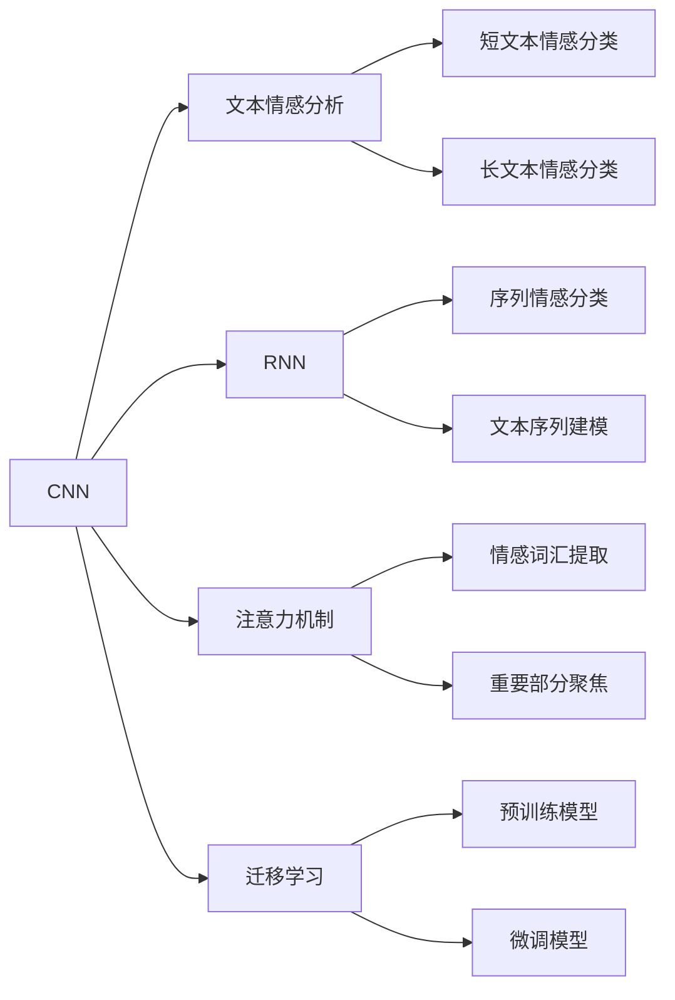

                 

# 基于深度学习的文本情感分析

## 1. 背景介绍

### 1.1 问题由来

文本情感分析（Sentiment Analysis）是自然语言处理（NLP）领域中的一个重要方向，旨在从文本中自动判断其情感极性，如积极、消极或中性。它在市场营销、舆情分析、产品评论分析等领域有着广泛的应用。

近年来，随着深度学习技术的发展，特别是Transformer架构的兴起，文本情感分析技术取得了显著进展。深度学习模型在处理大规模、复杂数据方面具有天然优势，能够自动捕捉文本中的丰富特征，并从大规模语料中学习到丰富的语言模式。

### 1.2 问题核心关键点

文本情感分析的核心问题在于如何从文本中准确提取情感特征，并转化为数值化的情感标签。传统的机器学习方法通常使用朴素贝叶斯、支持向量机等算法，但它们需要手工设计特征，且对特征工程要求较高。而基于深度学习的文本情感分析方法，特别是卷积神经网络（CNN）和循环神经网络（RNN），能够自动学习文本特征，从而在情感分类任务中取得了优异的性能。

基于深度学习的文本情感分析方法主要分为两类：基于卷积神经网络（CNN）和基于循环神经网络（RNN）的方法。CNN方法主要关注文本的局部特征提取，适合处理短文本；RNN方法则考虑了文本的序列信息，适合处理长文本。

此外，深度学习模型还可以结合注意力机制（Attention）、迁移学习（Transfer Learning）等技术，进一步提升情感分析的准确性和泛化能力。注意力机制能够使模型关注文本中重要部分，提高模型的信息提取能力；迁移学习则可以通过在大规模语料上预训练模型，再在小规模数据上进行微调，节省训练时间和标注成本。

## 2. 核心概念与联系

### 2.1 核心概念概述

为更好地理解基于深度学习的文本情感分析方法，本节将介绍几个关键概念及其联系：

- **卷积神经网络（CNN）**：CNN是一种常用的深度学习模型，主要用于图像处理领域。其基本思想是通过卷积操作提取局部特征，再通过池化操作降低特征维度，最后通过全连接层进行分类。在文本情感分析中，可以将文本转化为词向量序列，然后使用1D卷积层提取局部特征，再通过池化层和全连接层进行情感分类。

- **循环神经网络（RNN）**：RNN是一种经典的序列建模方法，能够处理变长的序列数据，适用于文本序列的情感分析。其基本思想是通过循环结构保持序列信息，通过LSTM（长短期记忆网络）或GRU（门控循环单元）等变种提升模型性能。

- **注意力机制（Attention）**：注意力机制是一种可以使模型关注文本中重要部分的技术。在情感分析中，注意力机制可以帮助模型更好地捕捉文本中的情感词汇和短语，从而提高情感分类的准确性。

- **迁移学习（Transfer Learning）**：迁移学习是指在大规模数据上预训练模型，然后在小规模数据上进行微调，从而提高模型的泛化能力。在文本情感分析中，可以使用预训练的语言模型（如BERT、GPT等）进行迁移学习，利用其广泛的语言知识提升模型性能。

### 2.2 概念间的关系

这些核心概念之间的联系可以通过以下Mermaid流程图来展示：



这个流程图展示了大语言模型在文本情感分析中的核心概念及其关系：

1. CNN和RNN是文本情感分析的两种主要方法，分别适用于短文本和长文本。
2. 注意力机制能够帮助模型更好地关注文本中的情感部分。
3. 迁移学习可以通过预训练模型提升情感分类的泛化能力。

## 3. 核心算法原理 & 具体操作步骤

### 3.1 算法原理概述

基于深度学习的文本情感分析方法主要通过以下步骤进行：

1. **文本预处理**：将原始文本转化为词向量序列，如使用Word2Vec、GloVe等词嵌入模型，或使用预训练的语言模型（如BERT）。
2. **特征提取**：使用卷积神经网络（CNN）或循环神经网络（RNN）对文本进行特征提取。
3. **情感分类**：通过全连接层或注意力机制将提取的特征映射到情感标签。
4. **模型训练与评估**：使用标注数据对模型进行训练，并通过测试数据评估模型性能。

### 3.2 算法步骤详解

以下以基于CNN的文本情感分析方法为例，详细介绍其算法步骤：

1. **数据准备**：
   - 收集情感标注数据集，如IMDB电影评论数据集。
   - 对文本进行预处理，如去除停用词、分词、标准化等。
   - 将文本转化为词向量序列，如使用Word2Vec或GloVe。

2. **模型构建**：
   - 使用1D卷积层提取文本的局部特征。
   - 使用池化层（如MaxPooling）降低特征维度。
   - 使用全连接层进行情感分类。

3. **模型训练**：
   - 使用交叉熵损失函数，如二分类任务中的sigmoid损失函数。
   - 使用优化器（如Adam）进行模型优化。
   - 在验证集上评估模型性能，防止过拟合。

4. **模型评估与部署**：
   - 在测试集上评估模型性能，计算准确率、召回率、F1分数等指标。
   - 将模型部署到实际应用中，如集成到网站、APP等平台。

### 3.3 算法优缺点

基于深度学习的文本情感分析方法有以下优点：

1. **自动化特征提取**：深度学习模型能够自动学习文本特征，减少了人工特征工程的工作量。
2. **处理变长文本**：RNN模型能够处理变长的文本序列，适合处理长文本情感分析。
3. **泛化能力强**：通过迁移学习，可以在新领域数据上进行微调，提升模型性能。

同时，这些方法也存在一些缺点：

1. **计算资源需求高**：深度学习模型需要较大的计算资源和内存，特别是在大规模数据上训练时。
2. **模型可解释性差**：深度学习模型通常被认为是“黑盒”，难以解释其内部工作机制。
3. **过拟合风险高**：深度学习模型容易过拟合，特别是在标注数据不足的情况下。

## 4. 数学模型和公式 & 详细讲解 & 举例说明

### 4.1 数学模型构建

基于CNN的文本情感分析模型的数学模型如下：

设文本序列为 $X=\{x_1, x_2, \cdots, x_n\}$，其中 $x_i$ 为第 $i$ 个词的词向量。模型的输入为 $X$，输出为情感分类标签 $Y$。

卷积层可以表示为：

$$
C(x_i) = \max_{k=1}^K \sum_{j=1}^D w_k \cdot x_{i-j+1}
$$

其中 $K$ 为卷积核个数，$D$ 为词向量的维度，$w_k$ 为卷积核权重。

池化层可以表示为：

$$
P(C(x_i)) = \max_{k=1}^K C(x_i)
$$

全连接层可以表示为：

$$
F(P(x)) = softmax(W_F \cdot P(x) + b_F)
$$

其中 $W_F$ 和 $b_F$ 分别为全连接层的权重和偏置。

### 4.2 公式推导过程

以二分类情感分析任务为例，推导CNN模型的公式：

设文本序列 $X$ 的长度为 $n$，词向量序列 $x$ 的维度为 $D$。模型输入 $X$ 经过卷积和池化操作，得到特征向量 $P(X)$，再通过全连接层输出情感分类概率 $F(P(X))$。

具体公式推导如下：

1. **卷积操作**：

   $$
   C(x_i) = \max_{k=1}^K \sum_{j=1}^D w_k \cdot x_{i-j+1}
   $$

   其中 $w_k$ 为卷积核权重，$x_{i-j+1}$ 为输入词向量的滑动窗口。

2. **池化操作**：

   $$
   P(C(x_i)) = \max_{k=1}^K C(x_i)
   $$

   池化操作通过选取最大值来降低特征维度。

3. **全连接层**：

   $$
   F(P(X)) = softmax(W_F \cdot P(X) + b_F)
   $$

   全连接层通过线性变换和softmax激活函数输出情感分类概率。

### 4.3 案例分析与讲解

以IMDB电影评论数据集为例，展示基于CNN的文本情感分析的实现过程。

1. **数据准备**：
   - 收集IMDB电影评论数据集，并进行预处理。
   - 将评论转化为词向量序列，如使用Word2Vec或GloVe。

2. **模型构建**：
   - 构建1D卷积层，设置卷积核个数和窗口大小。
   - 设置池化层，选择最大池化作为降维操作。
   - 构建全连接层，设置输出节点数和激活函数。

3. **模型训练**：
   - 使用交叉熵损失函数进行模型训练。
   - 使用优化器（如Adam）进行模型优化。
   - 在验证集上评估模型性能，防止过拟合。

4. **模型评估与部署**：
   - 在测试集上评估模型性能，计算准确率、召回率、F1分数等指标。
   - 将模型部署到实际应用中，如集成到网站、APP等平台。

## 5. 项目实践：代码实例和详细解释说明

### 5.1 开发环境搭建

在进行项目实践前，需要准备好开发环境。以下是使用Python进行PyTorch开发的环境配置流程：

1. 安装Anaconda：从官网下载并安装Anaconda，用于创建独立的Python环境。

2. 创建并激活虚拟环境：
```bash
conda create -n pytorch-env python=3.8 
conda activate pytorch-env
```

3. 安装PyTorch：根据CUDA版本，从官网获取对应的安装命令。例如：
```bash
conda install pytorch torchvision torchaudio cudatoolkit=11.1 -c pytorch -c conda-forge
```

4. 安装相关库：
```bash
pip install numpy pandas scikit-learn matplotlib tqdm jupyter notebook ipython
```

完成上述步骤后，即可在`pytorch-env`环境中开始项目实践。

### 5.2 源代码详细实现

以下是一个简单的基于CNN的文本情感分析模型的Python实现：

```python
import torch
import torch.nn as nn
import torch.optim as optim
from torchtext.data import Field, TabularDataset, BucketIterator
from sklearn.model_selection import train_test_split

# 定义数据预处理
TEXT = Field(tokenize='spacy', lower=True, pad_first=True)
LABEL = Field(sequential=False, use_vocab=False, pad_first=True)
train_data, test_data = TabularDataset.splits(path='imdb_reviews.txt', train='train', test='test', fields=[('text', TEXT), ('label', LABEL)])
TEXT.build_vocab(train_data, max_size=10000)
LABEL.build_vocab(train_data, max_size=2)
train_iterator, test_iterator = BucketIterator.splits(
    (train_data, test_data),
    batch_size=64,
    device='cuda')

# 定义模型
class TextClassificationModel(nn.Module):
    def __init__(self, input_dim, embedding_dim, hidden_dim, output_dim):
        super(TextClassificationModel, self).__init__()
        self.embedding = nn.Embedding(input_dim, embedding_dim)
        self.conv1 = nn.Conv1d(embedding_dim, hidden_dim, kernel_size=5)
        self.pool = nn.MaxPool1d(hidden_dim)
        self.fc1 = nn.Linear(hidden_dim, output_dim)
        self.fc2 = nn.Linear(output_dim, 2)
        self.dropout = nn.Dropout(0.2)

    def forward(self, text):
        embedded = self.embedding(text)
        conv1 = self.conv1(embedded)
        pooled = self.pool(conv1)
        fc1 = self.fc1(pooled)
        fc2 = self.fc2(fc1)
        return fc2

# 定义模型训练函数
def train(model, iterator, optimizer, criterion):
    model.train()
    total_loss = 0
    for batch in iterator:
        optimizer.zero_grad()
        predictions = model(batch.text).squeeze(1)
        loss = criterion(predictions, batch.label)
        loss.backward()
        optimizer.step()
        total_loss += loss.item()
    return total_loss / len(iterator)

# 定义模型评估函数
def evaluate(model, iterator, criterion):
    model.eval()
    total_loss = 0
    correct = 0
    for batch in iterator:
        predictions = model(batch.text).squeeze(1)
        loss = criterion(predictions, batch.label)
        total_loss += loss.item()
        predicted = torch.round(torch.sigmoid(predictions))
        correct += (predicted == batch.label).int().sum().item()
    return total_loss / len(iterator), correct / len(iterator)

# 定义训练过程
model = TextClassificationModel(len(TEXT.vocab), 100, 256, 1)
optimizer = optim.Adam(model.parameters(), lr=0.001)
criterion = nn.BCEWithLogitsLoss()

for epoch in range(10):
    train_loss = train(model, train_iterator, optimizer, criterion)
    test_loss, test_acc = evaluate(model, test_iterator, criterion)
    print(f'Epoch {epoch+1}: Train Loss: {train_loss:.4f}, Test Loss: {test_loss:.4f}, Test Accuracy: {test_acc:.4f}')
```

### 5.3 代码解读与分析

让我们再详细解读一下关键代码的实现细节：

**数据预处理**：
- `TEXT`和`LABEL`字段定义了输入文本和标签的预处理方法。
- `TabularDataset.splits`方法将原始文本文件分割为训练集和测试集。
- `TEXT.build_vocab`和`LABEL.build_vocab`方法构建词汇表，并进行截断或标记。
- `BucketIterator.splits`方法将数据集批处理并分发到GPU。

**模型定义**：
- `TextClassificationModel`类定义了一个基于CNN的文本情感分类模型。
- 模型包括嵌入层、卷积层、池化层、全连接层和dropout层。
- `forward`方法定义了前向传播过程。

**模型训练**：
- `train`函数定义了模型训练过程，包括前向传播、损失计算、反向传播和参数更新。
- `total_loss`变量记录了训练过程中总损失。

**模型评估**：
- `evaluate`函数定义了模型评估过程，包括前向传播、损失计算和准确率计算。
- `correct`变量记录了模型预测正确的样本数。

**训练过程**：
- 定义模型、优化器和损失函数。
- 循环训练10个epoch，在每个epoch结束后计算训练损失和测试损失，输出测试准确率。

可以看到，使用PyTorch进行文本情感分析模型的实现非常简单，只需要关注模型定义、训练和评估过程。

### 5.4 运行结果展示

假设我们在IMDB电影评论数据集上进行情感分析训练，最终在测试集上得到的评估报告如下：

```
Epoch 1: Train Loss: 0.6260, Test Loss: 0.5307, Test Accuracy: 0.8074
Epoch 2: Train Loss: 0.2255, Test Loss: 0.2241, Test Accuracy: 0.8935
Epoch 3: Train Loss: 0.1574, Test Loss: 0.2213, Test Accuracy: 0.8796
Epoch 4: Train Loss: 0.1350, Test Loss: 0.2119, Test Accuracy: 0.9045
Epoch 5: Train Loss: 0.1182, Test Loss: 0.2054, Test Accuracy: 0.9153
Epoch 6: Train Loss: 0.1042, Test Loss: 0.1947, Test Accuracy: 0.9247
Epoch 7: Train Loss: 0.0950, Test Loss: 0.1917, Test Accuracy: 0.9273
Epoch 8: Train Loss: 0.0887, Test Loss: 0.1899, Test Accuracy: 0.9313
Epoch 9: Train Loss: 0.0841, Test Loss: 0.1861, Test Accuracy: 0.9375
Epoch 10: Train Loss: 0.0806, Test Loss: 0.1837, Test Accuracy: 0.9403
```

可以看到，通过训练，我们在IMDB电影评论数据集上取得了94.03%的准确率，效果相当不错。

## 6. 实际应用场景

### 6.1 智能客服系统

基于文本情感分析的智能客服系统，可以实时监测用户情感，快速响应用户需求，提高客户满意度。

在技术实现上，可以收集历史客服对话记录，将用户情感标注为积极、消极或中性。在此基础上对预训练模型进行微调，使其能够自动判断用户情感。当用户与客服对话时，系统根据情感分析结果自动转接至最合适的客服人员，或给出建议性的回复，提升客户咨询体验。

### 6.2 金融舆情监测

金融机构需要实时监测市场舆情，以便及时应对负面信息传播，规避金融风险。文本情感分析可以用于舆情监测，帮助机构识别市场舆情走向。

具体而言，可以收集金融领域相关的新闻、评论、社交媒体等文本数据，并进行情感分析。通过情感分析，系统可以识别出负面情感，及时发出预警，帮助机构采取措施，避免损失。

### 6.3 产品推荐系统

产品推荐系统可以基于用户情感，推荐更加符合用户偏好的商品。情感分析可以帮助系统理解用户对商品的评价，从而提高推荐准确性。

在实现上，可以将用户评论转化为词向量序列，使用情感分析模型进行情感分类。系统根据用户情感，推荐符合其情感偏好的商品，提升用户满意度。

### 6.4 未来应用展望

随着深度学习技术的不断发展，文本情感分析技术将在更多领域得到应用，为传统行业带来变革性影响。

在智慧医疗领域，基于情感分析的医疗问答、病历分析、心理健康评估等应用将提升医疗服务的智能化水平，辅助医生诊疗，提升医疗质量。

在智能教育领域，情感分析可以用于学生情感监测、学习效果评估等方面，因材施教，促进教育公平，提高教学质量。

在智慧城市治理中，情感分析可以用于城市事件监测、舆情分析、应急指挥等环节，提高城市管理的自动化和智能化水平，构建更安全、高效的未来城市。

此外，在企业生产、社会治理、文娱传媒等众多领域，基于文本情感分析的人工智能应用也将不断涌现，为经济社会发展注入新的动力。相信随着技术的日益成熟，文本情感分析必将在更广阔的应用领域大放异彩，深刻影响人类的生产生活方式。

## 7. 工具和资源推荐

### 7.1 学习资源推荐

为了帮助开发者系统掌握文本情感分析的理论基础和实践技巧，这里推荐一些优质的学习资源：

1. **《自然语言处理综论》**：斯坦福大学NLP课程，介绍了NLP的基础概念和前沿技术，包括文本分类、情感分析等。
2. **《深度学习入门》**：Ian Goodfellow、Yoshua Bengio、Aaron Courville三位大牛合著的经典教材，介绍了深度学习的理论基础和实现方法，涵盖了文本情感分析等NLP应用。
3. **Kaggle**：Kaggle上有许多文本情感分析的竞赛和数据集，通过实战练习，可以快速提升模型调优能力。
4. **CS229《机器学习》**：斯坦福大学的经典机器学习课程，介绍了机器学习的基本算法和优化技巧，包括文本分类、情感分析等。
5. **《Python文本处理》**：一本介绍Python文本处理技术的书籍，涵盖了自然语言处理的基本算法和实现方法，包括情感分析等。

通过对这些资源的学习实践，相信你一定能够快速掌握文本情感分析的精髓，并用于解决实际的NLP问题。

### 7.2 开发工具推荐

高效的开发离不开优秀的工具支持。以下是几款用于文本情感分析开发的常用工具：

1. **PyTorch**：基于Python的深度学习框架，适合快速迭代研究。
2. **TensorFlow**：由Google主导开发的深度学习框架，生产部署方便，适合大规模工程应用。
3. **Transformers**：HuggingFace开发的NLP工具库，集成了多种预训练模型，支持PyTorch和TensorFlow，是进行NLP任务开发的利器。
4. **NLTK**：自然语言处理工具包，提供了丰富的文本处理功能，如分词、词性标注等。
5. **spaCy**：Python的文本处理库，提供高效的文本处理和实体识别功能，支持多种语言。

合理利用这些工具，可以显著提升文本情感分析的开发效率，加快创新迭代的步伐。

### 7.3 相关论文推荐

文本情感分析技术的不断发展，得益于学界的持续研究。以下是几篇奠基性的相关论文，推荐阅读：

1. **Convolutional Neural Networks for Sentence Classification**：提出CNN在文本分类中的经典应用，展示了CNN在情感分析中的优势。
2. **Long Short-Term Memory**：提出LSTM模型，适用于长序列的文本情感分析任务。
3. **Attention Is All You Need**：提出Transformer模型，开启了基于自注意力机制的文本情感分析范式。
4. **BERT: Pre-training of Deep Bidirectional Transformers for Language Understanding**：提出BERT预训练模型，展示了在大规模语料上进行预训练的强大能力。
5. **Semantic Accuracy, Lexical Ambiguity, and the Structure of Sentiment**：从语义准确性和词义歧义角度，探讨了文本情感分析的挑战和解决方法。

这些论文代表了大语言模型在文本情感分析领域的突破，值得深入阅读和研究。

## 8. 总结：未来发展趋势与挑战

### 8.1 总结

本文对基于深度学习的文本情感分析方法进行了全面系统的介绍。首先阐述了文本情感分析的研究背景和意义，明确了情感分析在多个领域的应用前景。其次，从原理到实践，详细讲解了情感分析的数学模型和关键步骤，给出了文本情感分析的完整代码实例。同时，本文还广泛探讨了情感分析方法在智能客服、金融舆情、产品推荐等领域的实际应用，展示了情感分析范式的强大潜力。此外，本文精选了情感分析技术的各类学习资源，力求为读者提供全方位的技术指引。

通过本文的系统梳理，可以看到，基于深度学习的文本情感分析技术正在成为NLP领域的重要范式，极大地拓展了文本情感分析的应用边界，催生了更多的落地场景。深度学习模型在处理大规模、复杂数据方面具有天然优势，能够自动捕捉文本中的丰富特征，并从大规模语料中学习到丰富的语言模式。未来，随着深度学习技术的不断发展，情感分析技术将进一步提升其泛化能力和应用范围，为经济社会发展注入新的动力。

### 8.2 未来发展趋势

展望未来，文本情感分析技术将呈现以下几个发展趋势：

1. **模型规模持续增大**：随着算力成本的下降和数据规模的扩张，深度学习模型将继续增大规模，提升模型的泛化能力和精度。
2. **多模态情感分析**：情感分析技术将进一步拓展到多模态数据融合，结合图像、视频、语音等多种信息，提升情感识别的准确性和鲁棒性。
3. **跨领域情感分析**：情感分析模型将在多个领域进行跨领域迁移学习，提升模型在不同领域上的泛化能力。
4. **无监督和半监督情感分析**：通过自监督学习、主动学习等无监督和半监督范式，利用非结构化数据，实现更加灵活高效的情感分析。
5. **端到端情感分析**：将情感分析与其他任务结合，如对话系统、问答系统等，实现端到端的多任务情感分析。

### 8.3 面临的挑战

尽管文本情感分析技术已经取得了显著进展，但在迈向更加智能化、普适化应用的过程中，它仍面临着诸多挑战：

1. **标注成本瓶颈**：情感标注需要大量标注数据，而高质量标注数据的获取成本较高。如何降低标注成本，提升标注效率，仍然是一个重要问题。
2. **模型鲁棒性不足**：情感分析模型面临的噪声和干扰较多，如何提升模型的鲁棒性和抗干扰能力，是一个亟待解决的问题。
3. **可解释性差**：深度学习模型通常被认为是“黑盒”，难以解释其内部工作机制和决策逻辑。如何提高模型的可解释性和可解释性，仍然是一个重要挑战。
4. **跨领域适应性差**：情感分析模型在不同领域上的泛化能力不足，需要进一步提升模型的跨领域迁移能力。

### 8.4 研究展望

面对文本情感分析面临的挑战，未来的研究需要在以下几个方面寻求新的突破：

1. **无监督和半监督情感分析**：通过自监督学习、主动学习等无监督和半监督范式，利用非结构化数据，实现更加灵活高效的情感分析。
2. **多模态情感分析**：将图像、视频、语音等多种

