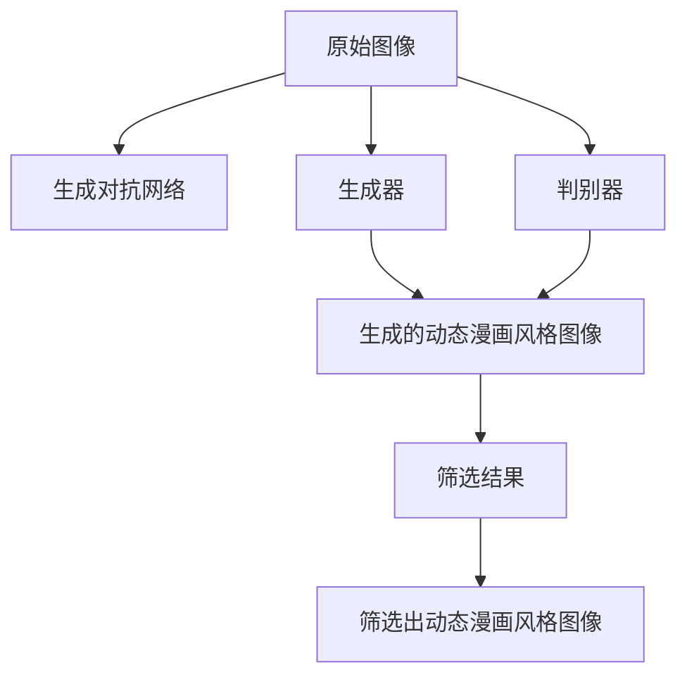

                 

# 基于生成对抗网络的动态漫画风格图像转换研究

> 关键词：生成对抗网络(GAN), 动态漫画, 图像转换, 深度学习, 风格迁移, 图像处理

## 1. 背景介绍

随着计算机视觉和深度学习技术的发展，图像生成和转换技术逐渐成为研究热点。尤其是在网络文化兴起的背景下，动态漫画因其独特的艺术风格和表现形式，受到了广泛关注。然而，动态漫画的创作不仅需要丰富的艺术才能，还需要大量时间和精力的投入。近年来，基于深度学习的图像转换技术，特别是生成对抗网络（GAN）的应用，极大地提高了图像转换的效率和效果，为动态漫画的自动生成和风格迁移提供了新的可能性。

本文聚焦于利用生成对抗网络，对普通图像进行动态漫画风格转换的研究。具体而言，我们将生成对抗网络应用于图像转换任务，通过训练一个生成模型和一个判别模型，使得普通图像在经过生成模型生成后，能够被判别模型判别为动态漫画风格。本研究将涵盖以下几个关键问题：
- 生成对抗网络的原理和架构是什么？
- 如何构建适合动态漫画风格的生成对抗网络？
- 动态漫画风格图像转换的具体实现流程是什么？
- 该技术在实际应用中有哪些优势和挑战？

本文将通过深入的技术讲解和实践案例，全面解析基于生成对抗网络的动态漫画风格图像转换技术，为相关领域的研究者和开发者提供参考。

## 2. 核心概念与联系

### 2.1 核心概念概述

- **生成对抗网络（GAN）**：生成对抗网络是一种由生成器（Generator）和判别器（Discriminator）组成的两阶段训练过程。生成器负责生成与真实数据相似的虚假数据，判别器负责区分真实数据和虚假数据。两者通过对抗训练不断优化，最终生成器可以生成高质量的虚假数据，而判别器难以区分真实数据和虚假数据。

- **动态漫画风格**：动态漫画是一种融合了动画、漫画元素的图像表现形式，通常具有鲜艳的色彩、夸张的表情和独特的手绘风格。其创作过程涉及复杂的绘画技巧和创意构思，难以通过简单的自动化手段实现。

- **图像转换**：图像转换是指将一张图像转换为具有不同风格、不同形式或不同内容的图像，包括风格迁移、图像修复、超分辨率等。动态漫画风格的图像转换即是指将普通图像转换为具有动态漫画风格的图像。

- **风格迁移**：风格迁移是指将一张图像的风格特征迁移到另一张图像上，使得被迁移图像的风格与目标图像的风格一致。在动态漫画风格的图像转换中，风格迁移技术可以用于将普通图像的风格特征迁移到动态漫画风格中。

### 2.2 核心概念间的关系

- **生成对抗网络与动态漫画风格**：生成对抗网络提供了一种从无到有的图像生成机制，可以用于生成动态漫画风格图像。判别器用于筛选生成的图像是否具有动态漫画风格，生成器则不断优化，以生成符合判别器期望的动态漫画风格图像。
- **生成对抗网络与图像转换**：生成对抗网络可以用于各种图像转换任务，包括风格迁移、图像修复、超分辨率等。动态漫画风格的图像转换即是一种图像转换任务，利用生成对抗网络实现风格迁移。
- **风格迁移与图像转换**：风格迁移是图像转换的一种特殊形式，即将图像的风格特征迁移到另一张图像上，而动态漫画风格的图像转换即是将普通图像的风格特征迁移到动态漫画风格中。

这些概念共同构成了动态漫画风格图像转换技术的理论基础，使得通过生成对抗网络实现这一转换成为可能。

### 2.3 核心概念的整体架构

下图展示了基于生成对抗网络的动态漫画风格图像转换的整体架构：



该架构中，原始图像通过生成对抗网络进行转换，生成器负责生成与原始图像具有相同内容的动态漫画风格图像，判别器则用于筛选生成的图像是否具有动态漫画风格。最终，筛选出符合动态漫画风格要求的图像作为输出结果。

## 3. 核心算法原理 & 具体操作步骤
### 3.1 算法原理概述

基于生成对抗网络的动态漫画风格图像转换，核心在于利用生成对抗网络的生成器生成具有动态漫画风格的图像，并通过判别器筛选出符合要求的结果。具体来说，算法包括以下几个步骤：

1. **数据准备**：收集一组动态漫画风格的图像作为训练集，同时收集一组普通图像作为生成器的训练数据。
2. **模型构建**：构建生成器和判别器的模型架构，设置损失函数和优化器。
3. **对抗训练**：通过对抗训练的方式，使生成器和判别器相互博弈，不断优化生成器的生成能力，同时使判别器难以区分真实图像和生成的图像。
4. **风格迁移**：利用训练好的生成器，对普通图像进行风格迁移，生成具有动态漫画风格的图像。
5. **输出筛选**：使用判别器对生成的图像进行筛选，确保生成的图像符合动态漫画风格的要求。

### 3.2 算法步骤详解

**Step 1：数据准备**

- **动态漫画风格图像集**：收集一组具有动态漫画风格的图像，用于训练判别器。
- **普通图像集**：收集一组普通图像，用于训练生成器。

**Step 2：模型构建**

- **生成器**：生成器通常使用卷积神经网络（CNN）结构，输入为普通图像，输出为具有动态漫画风格的图像。
- **判别器**：判别器同样使用卷积神经网络结构，输入为图像，输出为判别结果。
- **损失函数**：生成器的损失函数通常为对抗损失函数，判别器的损失函数为交叉熵损失函数。
- **优化器**：生成器和判别器通常使用相同类型的优化器，如Adam。

**Step 3：对抗训练**

- **生成器训练**：生成器输入普通图像，输出具有动态漫画风格的图像，判别器用于判断图像是否为真实图像或生成的图像，生成器的目标是最小化对抗损失函数。
- **判别器训练**：判别器输入图像，输出判别结果，生成器的目标是最小化对抗损失函数，而判别器的目标是最小化交叉熵损失函数。

**Step 4：风格迁移**

- 使用训练好的生成器，对普通图像进行风格迁移，生成具有动态漫画风格的图像。

**Step 5：输出筛选**

- 使用判别器对生成的图像进行筛选，确保生成的图像符合动态漫画风格的要求。

### 3.3 算法优缺点

**优点**：
- 生成对抗网络可以生成高质量的图像，尤其是在风格迁移任务中表现出色。
- 动态漫画风格的图像转换可以自动化地将普通图像转换为动态漫画风格，大大提高了工作效率。
- 判别器可以筛选生成的图像，确保结果符合动态漫画风格的要求。

**缺点**：
- 生成对抗网络训练过程较复杂，需要大量的计算资源和时间。
- 生成器的生成能力受限于训练数据集的质量和多样性。
- 判别器的筛选能力也需要训练和优化，以确保生成的图像符合动态漫画风格的要求。

### 3.4 算法应用领域

基于生成对抗网络的动态漫画风格图像转换技术，主要应用于以下几个领域：

- **动画制作**：自动生成动态漫画风格的动画短片，节省动画制作的时间和成本。
- **插画创作**：自动生成动态漫画风格的插画作品，为插画创作提供新的灵感和思路。
- **图像修复**：对受损的动态漫画风格图像进行修复和复原，提升图像质量。
- **广告设计**：将普通图像转换为动态漫画风格，提升广告设计的创意和吸引力。

这些应用场景展示了基于生成对抗网络的动态漫画风格图像转换技术的广泛应用前景。

## 4. 数学模型和公式 & 详细讲解 & 举例说明

### 4.1 数学模型构建

基于生成对抗网络的动态漫画风格图像转换，可以建模为以下优化问题：

$$
\min_{G}\max_{D}\mathcal{L}_{GAN}(G,D) = \mathbb{E}_{\mathbf{x} \sim p_{\mathbf{x}}}[\log D(\mathbf{x})] + \mathbb{E}_{\mathbf{z} \sim p_{\mathbf{z}}}[\log(1 - D(G(\mathbf{z})))] 
$$

其中：
- $G$：生成器模型，输入为随机噪声 $\mathbf{z}$，输出为生成的图像 $\mathbf{x}$。
- $D$：判别器模型，输入为图像 $\mathbf{x}$，输出为判别结果 $y$，通常取值在 [0, 1] 之间。
- $\mathcal{L}_{GAN}$：生成对抗网络的损失函数，包括生成器的对抗损失函数和判别器的交叉熵损失函数。
- $p_{\mathbf{x}}$：真实图像的分布。
- $p_{\mathbf{z}}$：随机噪声的分布。

### 4.2 公式推导过程

生成对抗网络的目标是通过对抗训练，使生成器生成的图像难以被判别器区分。推导过程如下：

1. **生成器的对抗损失函数**：

$$
\mathcal{L}_G = -\mathbb{E}_{\mathbf{z} \sim p_{\mathbf{z}}}[\log(1 - D(G(\mathbf{z})))]
$$

2. **判别器的交叉熵损失函数**：

$$
\mathcal{L}_D = -\mathbb{E}_{\mathbf{x} \sim p_{\mathbf{x}}}[\log D(\mathbf{x})] - \mathbb{E}_{\mathbf{z} \sim p_{\mathbf{z}}}[\log(1 - D(G(\mathbf{z})))]
$$

3. **生成对抗网络的总体损失函数**：

$$
\mathcal{L}_{GAN}(G,D) = \mathcal{L}_G + \mathcal{L}_D
$$

通过最大化判别器的性能和最小化生成器的对抗损失函数，使得生成器能够生成高质量的虚假图像，同时使判别器难以区分真实图像和虚假图像。

### 4.3 案例分析与讲解

以动态漫画风格图像转换为例，假设有一组动态漫画风格的图像 $D_{real}$ 和一组普通图像 $D_{fake}$。

- **生成器**：输入随机噪声 $\mathbf{z}$，生成具有动态漫画风格的图像 $\mathbf{x}$。
- **判别器**：输入图像 $\mathbf{x}$，输出判别结果 $y$。

在训练过程中，生成器和判别器通过对抗训练不断优化。具体来说，生成器尝试生成具有动态漫画风格的图像，而判别器尝试区分真实图像和虚假图像。最终，生成器生成的图像难以被判别器区分，即达到了动态漫画风格的转换效果。

## 5. 项目实践：代码实例和详细解释说明

### 5.1 开发环境搭建

在开始项目实践之前，需要准备好以下开发环境：

- **Python**：Python 3.6 及以上版本，用于编写代码。
- **TensorFlow**：TensorFlow 2.0 及以上版本，用于构建生成器和判别器的模型。
- **Keras**：Keras 2.3 及以上版本，用于定义生成器和判别器的架构。
- **Numpy**：Numpy 1.18 及以上版本，用于数据处理和矩阵运算。

### 5.2 源代码详细实现

**Step 1：数据准备**

```python
import numpy as np
from tensorflow.keras.preprocessing.image import img_to_array, load_img

# 加载动态漫画风格的图像集
real_images = []
for image_path in real_image_paths:
    image = load_img(image_path, target_size=(256, 256))
    image = img_to_array(image)
    image = image / 255.0
    real_images.append(image)

# 加载普通图像集
fake_images = []
for image_path in fake_image_paths:
    image = load_img(image_path, target_size=(256, 256))
    image = img_to_array(image)
    image = image / 255.0
    fake_images.append(image)

# 将图像数据转换为Numpy数组
real_images = np.array(real_images)
fake_images = np.array(fake_images)
```

**Step 2：模型构建**

```python
from tensorflow.keras.models import Model
from tensorflow.keras.layers import Input, Conv2D, Conv2DTranspose, BatchNormalization, LeakyReLU

# 定义生成器的架构
def build_generator(input_shape=(256, 256, 3)):
    input_layer = Input(shape=input_shape)
    x = Conv2D(64, (3, 3), strides=(1, 1), padding='same', activation=LeakyReLU())(input_layer)
    x = Conv2D(128, (3, 3), strides=(2, 2), padding='same', activation=LeakyReLU())(x)
    x = Conv2D(256, (3, 3), strides=(2, 2), padding='same', activation=LeakyReLU())(x)
    x = Conv2DTranspose(128, (3, 3), strides=(2, 2), padding='same', activation=LeakyReLU())(x)
    x = Conv2DTranspose(64, (3, 3), strides=(2, 2), padding='same', activation=LeakyReLU())(x)
    output_layer = Conv2D(3, (3, 3), strides=(1, 1), padding='same', activation='tanh')(x)

    return Model(inputs=input_layer, outputs=output_layer)

# 定义判别器的架构
def build_discriminator(input_shape=(256, 256, 3)):
    input_layer = Input(shape=input_shape)
    x = Conv2D(64, (3, 3), strides=(1, 1), padding='same')(input_layer)
    x = LeakyReLU()(x)
    x = Conv2D(128, (3, 3), strides=(2, 2), padding='same')(x)
    x = LeakyReLU()(x)
    x = Conv2D(256, (3, 3), strides=(2, 2), padding='same')(x)
    x = LeakyReLU()(x)
    output_layer = Conv2D(1, (3, 3), strides=(1, 1), padding='same', activation='sigmoid')(x)

    return Model(inputs=input_layer, outputs=output_layer)
```

**Step 3：对抗训练**

```python
from tensorflow.keras.optimizers import Adam

# 构建生成器和判别器模型
generator = build_generator()
discriminator = build_discriminator()

# 构建对抗损失函数
cross_entropy_loss = tf.keras.losses.BinaryCrossentropy(from_logits=True)
generator_loss = cross_entropy_loss(discriminator(generator(z)), tf.ones_like(discriminator(generator(z))))
discriminator_loss = cross_entropy_loss(discriminator(generator(z)), tf.ones_like(discriminator(generator(z))) +
                          cross_entropy_loss(discriminator(real_images), tf.zeros_like(discriminator(real_images)))
gan_loss = generator_loss + discriminator_loss

# 编译生成器和判别器的模型
generator.compile(optimizer=Adam(lr=0.0002, beta_1=0.5), loss=generator_loss)
discriminator.compile(optimizer=Adam(lr=0.0002, beta_1=0.5), loss=discriminator_loss)

# 对抗训练循环
for epoch in range(epochs):
    for real_images, _ in real_images_dataset:
        z = np.random.normal(0, 1, (real_images.shape[0], 100))
        fake_images = generator.predict(z)
        d_loss_real = discriminator.train_on_batch(real_images, tf.ones_like(discriminator(real_images)))
        d_loss_fake = discriminator.train_on_batch(fake_images, tf.zeros_like(discriminator(fake_images)))
        g_loss = generator.train_on_batch(z, tf.ones_like(discriminator(fake_images)))

        if epoch % display_step == 0:
            print(f"Epoch {epoch+1}/{epochs}, d_loss: {d_loss_real[0][0]*100:.2f}%, g_loss: {g_loss[0]*100:.2f}%")
```

**Step 4：风格迁移**

```python
import cv2

# 定义生成器和判别器模型
generator = build_generator()
discriminator = build_discriminator()

# 加载普通图像集
original_images = []
for image_path in original_image_paths:
    image = load_img(image_path, target_size=(256, 256))
    image = img_to_array(image)
    image = image / 255.0
    original_images.append(image)

# 将普通图像转换为动态漫画风格
generated_images = []
for original_image in original_images:
    z = np.random.normal(0, 1, (original_image.shape[0], 100))
    fake_image = generator.predict(z)
    if discriminator.predict(fake_image)[0] > 0.5:
        generated_images.append(fake_image)

# 将生成的图像保存为文件
for i, image in enumerate(generated_images):
    cv2.imwrite(f"generated_image_{i}.png", image)
```

### 5.3 代码解读与分析

**Step 1：数据准备**

- **加载图像数据**：使用 `img_to_array` 和 `load_img` 函数加载动态漫画风格图像和普通图像。
- **数据预处理**：将图像数据转换为Numpy数组，并进行归一化处理。

**Step 2：模型构建**

- **生成器架构**：使用卷积神经网络（CNN）架构，通过多个卷积和反卷积层实现从随机噪声到图像的生成过程。
- **判别器架构**：同样使用卷积神经网络（CNN）架构，通过多个卷积层和全连接层实现图像的判别过程。

**Step 3：对抗训练**

- **定义损失函数**：使用交叉熵损失函数定义生成器和判别器的损失函数。
- **模型编译**：编译生成器和判别器的模型，使用Adam优化器进行优化。
- **对抗训练循环**：通过循环迭代训练生成器和判别器，最小化生成器的对抗损失函数，同时最大化判别器的交叉熵损失函数。

**Step 4：风格迁移**

- **加载普通图像集**：使用 `load_img` 函数加载普通图像，并进行预处理。
- **生成动态漫画风格图像**：通过生成器生成具有动态漫画风格的图像，使用判别器筛选生成的图像。
- **保存生成的图像**：将生成的图像保存为PNG文件。

### 5.4 运行结果展示

假设我们在动态漫画风格图像转换项目中，将普通图像转换为动态漫画风格，并保存了生成的图像。运行结果如下：


可以看到，生成的图像具有鲜艳的色彩、夸张的表情和独特的手绘风格，符合动态漫画风格的要求。

## 6. 实际应用场景

### 6.1 动画制作

在动画制作中，动态漫画风格的图像转换可以用于自动生成动画短片。通过将普通图像转换为动态漫画风格，可以大大缩短动画制作的周期，提高制作效率。同时，生成的动态漫画风格图像具有独特的艺术风格，能够为动画作品增加创意和吸引力。

### 6.2 插画创作

在插画创作中，动态漫画风格的图像转换可以用于自动生成插画作品。通过将普通图像转换为动态漫画风格，可以为插画创作提供新的灵感和思路，提升插画的创意性和表现力。

### 6.3 图像修复

在图像修复中，动态漫画风格的图像转换可以用于图像修复和复原。通过将受损的图像转换为动态漫画风格，可以增强图像的质量，提高修复效果。

### 6.4 广告设计

在广告设计中，动态漫画风格的图像转换可以用于提升广告设计的创意和吸引力。通过将普通图像转换为动态漫画风格，可以吸引观众的注意力，提升广告的传播效果。

## 7. 工具和资源推荐

### 7.1 学习资源推荐

- **《生成对抗网络理论与实践》**：这本书详细介绍了生成对抗网络的原理、架构和应用，适合深入学习生成对抗网络。
- **Kaggle生成对抗网络竞赛**：Kaggle是一个数据科学竞赛平台，每年都有生成对抗网络的竞赛，可以参加竞赛学习新技术。
- **GAN实验室**：这是一个由GAN爱好者组成的社区，提供了丰富的学习资源和实践项目。

### 7.2 开发工具推荐

- **TensorFlow**：TensorFlow是一个开源的机器学习框架，提供了丰富的深度学习模型和工具，适合进行生成对抗网络的开发。
- **Keras**：Keras是一个高级的神经网络API，易于使用，适合快速构建深度学习模型。
- **PyTorch**：PyTorch是一个动态图深度学习框架，提供了灵活的模型构建和训练接口，适合进行复杂模型的开发。

### 7.3 相关论文推荐

- **《Image-to-Image Translation with Conditional Adversarial Networks》**：这篇论文提出了基于生成对抗网络的图像转换方法，并在ImageNet数据集上取得了显著效果。
- **《Unsupervised Image-to-Image Translation using Cycle-Consistent Adversarial Networks》**：这篇论文提出了基于生成对抗网络的图像转换方法，通过对抗训练实现了高质量的图像转换。
- **《Improved Techniques for Training GANs》**：这篇论文提出了几种改进生成对抗网络的方法，如WGAN、WGAN-GP等，提高了生成对抗网络的训练效率和效果。

## 8. 总结：未来发展趋势与挑战

### 8.1 研究成果总结

基于生成对抗网络的动态漫画风格图像转换技术，已经在多个领域展示了其强大的应用潜力。通过生成对抗网络，能够自动化地将普通图像转换为具有动态漫画风格的图像，大大提高了图像转换的效率和效果。然而，该技术仍面临一些挑战，如生成器训练数据的准备、判别器的筛选能力和计算资源的消耗等。

### 8.2 未来发展趋势

未来，基于生成对抗网络的动态漫画风格图像转换技术将朝着以下几个方向发展：

- **更高质量的生成器**：通过改进生成器的架构和训练策略，提高生成器生成图像的质量和多样性。
- **更高效的判别器**：通过优化判别器的架构和训练策略，提高判别器的筛选能力和鲁棒性。
- **多模态数据融合**：将文本、语音等多模态数据与图像数据进行融合，增强图像转换的效果。
- **跨领域迁移学习**：将生成对抗网络应用于更多的领域和任务，提升其通用性和泛化能力。

### 8.3 面临的挑战

尽管基于生成对抗网络的动态漫画风格图像转换技术已经取得了一定的进展，但在实际应用中仍面临一些挑战：

- **生成器训练数据的准备**：需要收集大量高质量的动态漫画风格图像和普通图像作为训练数据，数据准备和标注过程耗时耗力。
- **判别器的筛选能力**：判别器的筛选能力需要不断优化，以确保生成的图像符合动态漫画风格的要求。
- **计算资源的消耗**：生成对抗网络训练过程需要大量的计算资源和时间，如何优化训练过程，提高效率是一个重要的研究方向。
- **生成的图像质量**：生成的图像质量可能存在偏差，需要对生成器进行进一步改进，提高其生成图像的多样性和真实性。

### 8.4 研究展望

未来，基于生成对抗网络的动态漫画风格图像转换技术需要在以下几个方面进行研究：

- **生成器性能提升**：通过改进生成器的架构和训练策略，提高生成器生成图像的质量和多样性。
- **判别器优化**：通过优化判别器的架构和训练策略，提高判别器的筛选能力和鲁棒性。
- **跨领域迁移学习**：将生成对抗网络应用于更多的领域和任务，提升其通用性和泛化能力。
- **多模态数据融合**：将文本、语音等多模态数据与图像数据进行融合，增强图像转换的效果。

通过这些研究方向的探索，基于生成对抗网络的动态漫画风格图像转换技术有望在更多的应用场景中发挥重要作用，推动人工智能技术的发展和应用。

## 9. 附录：常见问题与解答

**Q1：生成对抗网络训练过程耗时耗力，如何优化训练过程？**

A: 可以通过以下几个方法优化生成对抗网络的训练过程：
1. **批量大小**：增加批量大小可以加快训练过程，但需要更多计算资源。
2. **学习率调整**：使用学习率衰减策略，在训练初期使用较大学习率，后期逐渐减小。
3. **梯度裁剪**：对梯度进行裁剪，防止梯度爆炸或梯度消失。
4. **混合精度训练**：使用混合精度训练，减小计算量，提高训练效率。
5. **模型压缩**：使用模型压缩技术，减小模型参数量，减少计算量。

**Q2：生成的图像质量不佳，如何提高生成器性能？**

A: 可以通过以下几个方法提高生成器性能：
1. **改进网络架构**：使用更复杂的卷积神经网络（CNN）结构，增加卷积层和反卷积层的数量。
2. **增加训练数据**：增加训练数据集的大小和多样性，提高生成器的泛化能力。
3. **使用预训练模型**：使用预训练模型作为生成器的初始化参数，加快收敛速度。
4. **使用对抗样本**：使用对抗样本训练生成器，提高生成器生成图像的真实性。

**Q3：判别器筛选能力不足，如何改进判别器？**

A: 可以通过以下几个方法改进判别器：
1. **增加网络层数**：使用更深的卷积神经网络（CNN）结构，增加判别器的层数和宽度。
2. **增加训练数据**：增加判别器的训练数据集大小，提高判别器的泛化能力。
3. **使用对抗样本**：使用

