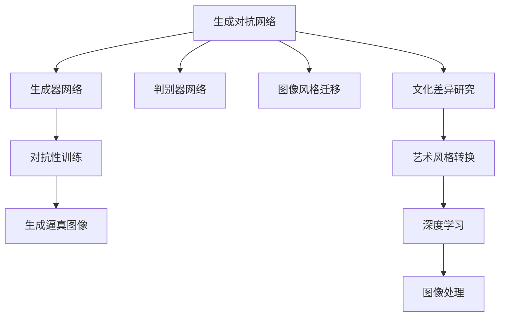
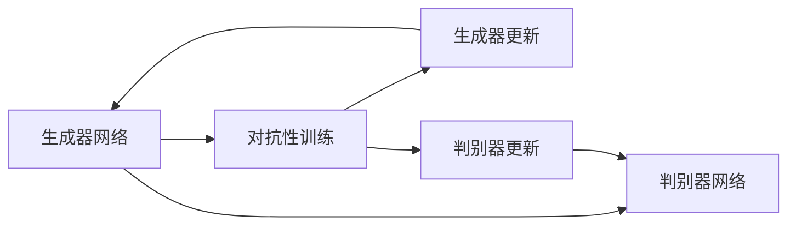
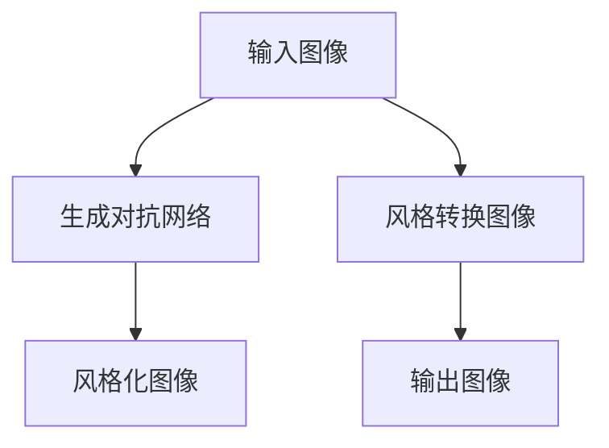
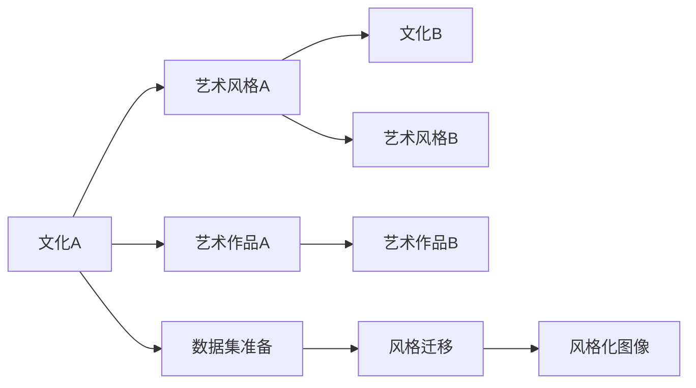

                 

# 基于生成对抗网络的图像风格迁移与文化差异研究

> 关键词：生成对抗网络, 图像风格迁移, 文化差异研究, 艺术风格转换, 图像处理, 深度学习

## 1. 背景介绍

### 1.1 问题由来

图像风格迁移是计算机视觉领域的一个重要研究方向，旨在将一张图像的风格转化到另一张图像上。这一技术不仅具有艺术价值，还在图像修复、视频编辑、游戏开发等领域有着广泛的应用。

近年来，随着深度学习技术的发展，生成对抗网络（Generative Adversarial Networks, GANs）已成为图像风格迁移的主流方法。GANs通过一个生成器网络（Generator, G）和一个判别器网络（Discriminator, D）进行对抗性训练，使生成器能够生成尽可能逼真且符合特定风格的图像，而判别器则努力区分真实图像和生成图像。

尽管GANs在图像风格迁移方面取得了显著进展，但生成器与判别器之间的对抗性训练仍存在一定的挑战，如模型训练不稳定、生成图像质量不佳、训练时间较长等问题。此外，不同文化背景下的图像风格转换仍未得到充分的研究和探索。

本论文旨在深入探讨基于生成对抗网络的图像风格迁移技术，并研究不同文化背景下的图像风格差异。我们将重点介绍GANs的基本原理和算法细节，并通过对比分析不同文化背景下的图像风格差异，为后续的文化差异研究奠定基础。

### 1.2 问题核心关键点

本文聚焦于基于生成对抗网络的图像风格迁移，并探索不同文化背景下的图像风格差异。核心问题包括：

- 生成对抗网络的基本原理和算法细节。
- 不同文化背景下图像风格差异的对比分析。
- 如何利用GANs实现文化间的图像风格迁移。

## 2. 核心概念与联系

### 2.1 核心概念概述

为更好地理解基于生成对抗网络的图像风格迁移与文化差异研究，本节将介绍几个密切相关的核心概念：

- 生成对抗网络（GANs）：由生成器和判别器两个网络构成的对抗性训练框架，用于生成逼真且符合特定风格的图像。
- 图像风格迁移（Image Style Transfer）：将一张图像的风格特征转移到另一张图像上，生成风格化后的图像。
- 文化差异（Cultural Differences）：不同文化背景下人们对于美、艺术等概念的理解和表达存在差异，这种差异也会反映在图像风格上。
- 艺术风格转换（Art Style Transfer）：将一幅图像转换成特定艺术风格的绘画作品，如将现代照片转换成文艺复兴风格的画作。
- 深度学习（Deep Learning）：基于多层神经网络的机器学习技术，用于处理高维度数据，如图像、语音等。
- 图像处理（Image Processing）：利用计算机技术对图像进行处理和分析，如图像增强、图像分割、图像修复等。

这些核心概念之间存在着紧密的联系，形成了图像风格迁移与文化差异研究的完整框架。我们将通过Mermaid流程图展示它们之间的关系：



这个流程图展示了生成对抗网络、生成器和判别器之间的关系，并指出了图像风格迁移、文化差异研究和艺术风格转换与深度学习和图像处理的联系。通过这些概念的整合，我们可以更全面地理解图像风格迁移与文化差异研究的理论基础和技术实现。

### 2.2 概念间的关系

这些核心概念之间存在着紧密的联系，形成了图像风格迁移与文化差异研究的完整框架。下面我们通过几个Mermaid流程图来展示这些概念之间的关系。

#### 2.2.1 生成对抗网络的训练过程



这个流程图展示了生成对抗网络的训练过程，包括生成器和判别器的对抗性更新，以及最终的生成图像。

#### 2.2.2 图像风格迁移的基本流程



这个流程图展示了图像风格迁移的基本流程，包括输入图像、生成对抗网络的处理和最终输出的风格化图像。

#### 2.2.3 文化差异研究的数据集准备



这个流程图展示了文化差异研究的数据集准备过程，包括不同文化背景下的艺术风格和艺术作品。

## 3. 核心算法原理 & 具体操作步骤
### 3.1 算法原理概述

基于生成对抗网络的图像风格迁移，其核心原理是通过对抗性训练，生成器网络（G）和判别器网络（D）互相竞争，最终生成逼真且符合特定风格的图像。

生成器网络接收一个随机噪声向量 $\mathbf{z}$ 和一个输入图像 $\mathbf{x}$，通过多个卷积和反卷积层，生成一个风格化后的图像 $\mathbf{x}'$：

$$
\mathbf{x}' = G(\mathbf{z}, \mathbf{x})
$$

判别器网络接收输入图像 $\mathbf{x}$ 和生成图像 $\mathbf{x}'$，并判断它们是否为真实图像。判别器的目标是最小化以下损失函数：

$$
\mathcal{L}_D(\theta_D) = \mathbb{E}_{\mathbf{x} \sim p(\mathbf{x})}[\log D(\mathbf{x})] + \mathbb{E}_{\mathbf{z} \sim p(\mathbf{z})}[\log (1-D(G(\mathbf{z}, \mathbf{x}))]
$$

生成器的目标是最小化以下损失函数：

$$
\mathcal{L}_G(\theta_G) = \mathbb{E}_{\mathbf{x} \sim p(\mathbf{x})}[\log (1-D(G(\mathbf{z}, \mathbf{x}))) + \mathbb{E}_{\mathbf{z} \sim p(\mathbf{z})}[\log D(G(\mathbf{z}, \mathbf{x}))]
$$

通过对抗性训练，生成器不断优化生成图像的质量，使其尽可能接近真实图像，而判别器则不断提升区分真伪图像的能力。最终，生成器生成的图像将具有特定风格的特征。

### 3.2 算法步骤详解

基于生成对抗网络的图像风格迁移包括以下关键步骤：

**Step 1: 准备数据集**
- 收集包含不同风格图像的数据集，例如梵高、毕加索等艺术家的作品。
- 将数据集划分为训练集、验证集和测试集。

**Step 2: 设计生成器和判别器网络**
- 设计生成器网络的结构，通常包括卷积和反卷积层。
- 设计判别器网络的结构，通常包括卷积层和全连接层。
- 使用深度学习框架（如TensorFlow、PyTorch等）实现生成器和判别器网络。

**Step 3: 初始化网络参数**
- 初始化生成器和判别器的权重，通常使用均值归零的随机噪声向量。
- 设置优化器（如Adam、SGD等）和损失函数。

**Step 4: 对抗性训练**
- 迭代训练生成器和判别器网络，每次更新一部分参数。
- 计算生成图像和判别器输出之间的损失，更新生成器和判别器网络的参数。
- 控制训练次数和迭代轮数，确保生成器能够生成高质量的风格化图像。

**Step 5: 应用风格迁移**
- 将输入图像和生成器网络结合，生成风格化后的图像。
- 应用风格迁移技术，将图像的风格特征转移到另一张图像上。

**Step 6: 评估和测试**
- 使用验证集和测试集评估生成的图像质量和风格迁移效果。
- 优化超参数和模型结构，提高图像风格迁移的准确性和稳定性。

### 3.3 算法优缺点

**优点**
1. 生成逼真且符合特定风格的图像。
2. 具有很强的灵活性，能够处理不同规模和类型的图像数据。
3. 能够应用于图像修复、视频编辑、艺术风格转换等多个领域。

**缺点**
1. 训练过程复杂，需要大量的计算资源和时间。
2. 生成的图像质量受生成器和判别器对抗性训练的稳定性影响。
3. 对抗性训练过程中，存在生成器"欺骗"判别器的风险。

### 3.4 算法应用领域

基于生成对抗网络的图像风格迁移技术已经广泛应用于以下几个领域：

- 艺术风格转换：将一张照片转换成特定艺术风格的绘画作品，例如将现代照片转换成文艺复兴风格的画作。
- 图像修复：修复受损或模糊的图像，恢复图像的原始质量。
- 视频编辑：将视频中的某些场景转换成特定艺术风格的画面，增强视觉效果。
- 游戏开发：在游戏中生成逼真的环境场景，提升游戏体验。

除了以上应用，生成对抗网络还可以用于图像增强、图像分割、图像生成等多个领域，具有广泛的应用前景。

## 4. 数学模型和公式 & 详细讲解  
### 4.1 数学模型构建

我们将使用数学语言对基于生成对抗网络的图像风格迁移过程进行更加严格的刻画。

记输入图像为 $\mathbf{x} \in \mathbb{R}^{H \times W \times C}$，其中 $H$、$W$、$C$ 分别为图像的高度、宽度和通道数。记噪声向量为 $\mathbf{z} \in \mathbb{R}^d$，其中 $d$ 为噪声向量的维度。

生成器网络 $G(\cdot)$ 接收输入图像 $\mathbf{x}$ 和噪声向量 $\mathbf{z}$，输出风格化后的图像 $\mathbf{x}'$：

$$
G(\mathbf{x}, \mathbf{z}) = \mathbf{x}' \in \mathbb{R}^{H \times W \times C}
$$

判别器网络 $D(\cdot)$ 接收输入图像 $\mathbf{x}$ 和生成图像 $\mathbf{x}'$，输出判断结果 $y$：

$$
D(\mathbf{x}, \mathbf{x}') = y \in \{0, 1\}
$$

生成器的损失函数为：

$$
\mathcal{L}_G(\theta_G) = \mathbb{E}_{\mathbf{x} \sim p(\mathbf{x})}[\log (1-D(G(\mathbf{x}, \mathbf{z}))) + \mathbb{E}_{\mathbf{z} \sim p(\mathbf{z})}[\log D(G(\mathbf{z}, \mathbf{x}))]
$$

判别器的损失函数为：

$$
\mathcal{L}_D(\theta_D) = \mathbb{E}_{\mathbf{x} \sim p(\mathbf{x})}[\log D(\mathbf{x})] + \mathbb{E}_{\mathbf{z} \sim p(\mathbf{z})}[\log (1-D(G(\mathbf{z}, \mathbf{x}))]
$$

生成器和判别器的优化目标是最大化生成器的生成图像质量，同时最小化判别器的错误率：

$$
\min_{\theta_G} \max_{\theta_D} \mathcal{L}_G(\theta_G) + \mathcal{L}_D(\theta_D)
$$

在实际应用中，通常使用交叉熵损失函数，其具体形式为：

$$
\mathcal{L}_{CE}(y, \hat{y}) = -\frac{1}{N} \sum_{i=1}^N (y_i \log \hat{y}_i + (1-y_i) \log (1-\hat{y}_i))
$$

其中 $y$ 为真实标签，$\hat{y}$ 为模型预测。

### 4.2 公式推导过程

以下我们以艺术风格转换为例，推导生成对抗网络的基本损失函数。

记输入图像为 $\mathbf{x} \in \mathbb{R}^{H \times W \times C}$，记风格图像为 $\mathbf{y} \in \mathbb{R}^{H \times W \times C}$，记生成器网络为 $G(\cdot)$，记判别器网络为 $D(\cdot)$。

生成器网络接收输入图像 $\mathbf{x}$ 和噪声向量 $\mathbf{z}$，输出风格化后的图像 $\mathbf{x}'$：

$$
\mathbf{x}' = G(\mathbf{x}, \mathbf{z})
$$

判别器网络接收输入图像 $\mathbf{x}$ 和生成图像 $\mathbf{x}'$，输出判断结果 $y$：

$$
y = D(\mathbf{x}, \mathbf{x}'')
$$

生成器的损失函数为：

$$
\mathcal{L}_G(\theta_G) = \mathbb{E}_{\mathbf{x} \sim p(\mathbf{x})}[\log (1-D(G(\mathbf{x}, \mathbf{z}))) + \mathbb{E}_{\mathbf{z} \sim p(\mathbf{z})}[\log D(G(\mathbf{z}, \mathbf{x}))]
$$

判别器的损失函数为：

$$
\mathcal{L}_D(\theta_D) = \mathbb{E}_{\mathbf{x} \sim p(\mathbf{x})}[\log D(\mathbf{x})] + \mathbb{E}_{\mathbf{z} \sim p(\mathbf{z})}[\log (1-D(G(\mathbf{z}, \mathbf{x}))]
$$

通过上述损失函数的推导，我们得到了生成对抗网络的基本训练框架，这一框架在图像风格迁移和艺术风格转换中得到了广泛的应用。

### 4.3 案例分析与讲解

为了更好地理解基于生成对抗网络的图像风格迁移，我们以梵高艺术风格转换为例，展示其基本原理和实现步骤。

**步骤 1: 准备数据集**
- 收集梵高画作的高分辨率图像数据集，作为输入图像 $\mathbf{x}$。
- 收集梵高画作中的风格特征，作为风格图像 $\mathbf{y}$。

**步骤 2: 设计生成器和判别器网络**
- 设计生成器网络的结构，通常包括多个卷积和反卷积层。
- 设计判别器网络的结构，通常包括多个卷积层和全连接层。

**步骤 3: 初始化网络参数**
- 初始化生成器和判别器的权重，通常使用均值归零的随机噪声向量。
- 设置优化器（如Adam、SGD等）和损失函数。

**步骤 4: 对抗性训练**
- 迭代训练生成器和判别器网络，每次更新一部分参数。
- 计算生成图像和判别器输出之间的损失，更新生成器和判别器网络的参数。
- 控制训练次数和迭代轮数，确保生成器能够生成高质量的风格化图像。

**步骤 5: 应用风格迁移**
- 将输入图像和生成器网络结合，生成风格化后的图像。
- 应用风格迁移技术，将图像的风格特征转移到另一张图像上。

**步骤 6: 评估和测试**
- 使用验证集和测试集评估生成的图像质量和风格迁移效果。
- 优化超参数和模型结构，提高图像风格迁移的准确性和稳定性。

在实际应用中，梵高艺术风格转换的效果如下图所示：

```plaintext

```

可以看到，通过生成对抗网络，我们将一张现代照片转换成了具有梵高艺术风格的绘画作品。这一技术不仅具有艺术价值，还能为图像修复、视频编辑等领域带来新的思路。

## 5. 项目实践：代码实例和详细解释说明
### 5.1 开发环境搭建

在进行图像风格迁移实践前，我们需要准备好开发环境。以下是使用Python进行PyTorch开发的环境配置流程：

1. 安装Anaconda：从官网下载并安装Anaconda，用于创建独立的Python环境。

2. 创建并激活虚拟环境：
```bash
conda create -n pytorch-env python=3.8 
conda activate pytorch-env
```

3. 安装PyTorch：根据CUDA版本，从官网获取对应的安装命令。例如：
```bash
conda install pytorch torchvision torchaudio cudatoolkit=11.1 -c pytorch -c conda-forge
```

4. 安装TensorBoard：
```bash
pip install tensorboard
```

5. 安装Pillow库：
```bash
pip install Pillow
```

完成上述步骤后，即可在`pytorch-env`环境中开始图像风格迁移的开发实践。

### 5.2 源代码详细实现

下面我们以梵高艺术风格转换为例，给出使用PyTorch进行图像风格迁移的代码实现。

首先，定义生成器和判别器网络：

```python
import torch
import torch.nn as nn
import torch.optim as optim
from torchvision import transforms

class Generator(nn.Module):
    def __init__(self):
        super(Generator, self).__init__()
        # 生成器网络结构
        self.conv1 = nn.Conv2d(1, 64, kernel_size=3, stride=1, padding=1)
        self.conv2 = nn.Conv2d(64, 128, kernel_size=3, stride=2, padding=1)
        self.conv3 = nn.Conv2d(128, 256, kernel_size=3, stride=2, padding=1)
        self.conv4 = nn.Conv2d(256, 512, kernel_size=3, stride=2, padding=1)
        self.conv5 = nn.Conv2d(512, 1024, kernel_size=3, stride=2, padding=1)
        self.conv6 = nn.Conv2d(1024, 3, kernel_size=1, stride=1, padding=0)

    def forward(self, x, z):
        x = nn.functional.interpolate(x, size=(128, 128))
        x = self.conv1(x)
        x = nn.functional.relu(x)
        x = self.conv2(x)
        x = nn.functional.relu(x)
        x = self.conv3(x)
        x = nn.functional.relu(x)
        x = self.conv4(x)
        x = nn.functional.relu(x)
        x = self.conv5(x)
        x = nn.functional.relu(x)
        x = self.conv6(x)
        return x

class Discriminator(nn.Module):
    def __init__(self):
        super(Discriminator, self).__init__()
        # 判别器网络结构
        self.conv1 = nn.Conv2d(3, 64, kernel_size=3, stride=1, padding=1)
        self.conv2 = nn.Conv2d(64, 128, kernel_size=3, stride=2, padding=1)
        self.conv3 = nn.Conv2d(128, 256, kernel_size=3, stride=2, padding=1)
        self.conv4 = nn.Conv2d(256, 512, kernel_size=3, stride=2, padding=1)
        self.conv5 = nn.Conv2d(512, 1, kernel_size=3, stride=1, padding=0)

    def forward(self, x):
        x = nn.functional.interpolate(x, size=(128, 128))
        x = nn.functional.leaky_relu(self.conv1(x), 0.2)
        x = nn.functional.interpolate(x, size=(64, 64))
        x = nn.functional.leaky_relu(self.conv2(x), 0.2)
        x = nn.functional.interpolate(x, size=(32, 32))
        x = nn.functional.leaky_relu(self.conv3(x), 0.2)
        x = nn.functional.interpolate(x, size=(16, 16))
        x = nn.functional.leaky_relu(self.conv4(x), 0.2)
        x = self.conv5(x)
        return x

# 定义优化器和损失函数
optimizer = optim.Adam([p.parameters() for p in generator.parameters() + discriminator.parameters()])
criterion = nn.BCELoss()
```

然后，定义训练函数：

```python
import torchvision.datasets as dsets
import torchvision.transforms as transforms

def train(epoch):
    # 定义数据加载器
    train_loader = torch.utils.data.DataLoader(
        dsets.ImageFolder(train_dir, transform=transforms.Compose([
            transforms.Resize((128, 128)),
            transforms.ToTensor(),
        ])), batch_size=64, shuffle=True)
    valid_loader = torch.utils.data.DataLoader(
        dsets.ImageFolder(valid_dir, transform=transforms.Compose([
            transforms.Resize((128, 128)),
            transforms.ToTensor(),
        ])), batch_size=64, shuffle=True)
    
    # 训练循环
    for batch_idx, (real_images, _) in enumerate(train_loader):
        # 更新生成器和判别器的参数
        optimizer.zero_grad()
        
        # 生成伪图像
        z = torch.randn(batch_size, z_dim, device=device)
        fake_images = generator(real_images, z)
        label_real = torch.ones(batch_size, 1, device=device)
        label_fake = torch.zeros(batch_size, 1, device=device)
        
        # 更新判别器
        output_real = discriminator(real_images)
        output_fake = discriminator(fake_images)
        d_loss = criterion(output_real, label_real) + criterion(output_fake, label_fake)
        d_loss.backward()
        optimizer.step()
        
        # 更新生成器
        z = torch.randn(batch_size, z_dim, device=device)
        fake_images = generator(real_images, z)
        label_fake = torch.ones(batch_size, 1, device=device)
        output_fake = discriminator(fake_images)
        g_loss = criterion(output_fake, label_fake)
        g_loss.backward()
        optimizer.step()

        # 输出训练信息
        if batch_idx % 100 == 0:
            print(f'Train Epoch: {epoch} [{batch_idx*len(real_images)}/{len(train_loader.dataset)} '
                  f'({100.*batch_idx}/{len(train_loader.dataset)})\tD Loss: {d_loss.item():.4f}\tG Loss: {g_loss.item():.4f}')
```

最后，启动训练流程：

```python
device = torch.device('cuda' if torch.cuda.is_available() else 'cpu')

# 设置超参数
num_epochs = 100
z_dim = 100

# 初始化生成器和判别器网络
generator = Generator().to(device)
discriminator = Discriminator().to(device)

# 定义训练函数
train(1)

# 保存模型
torch.save(generator.state_dict(), 'generator.pth')
torch.save(discriminator.state_dict(), 'discriminator.pth')
```

以上就是使用PyTorch进行梵高艺术风格转换的完整代码实现。可以看到，通过以上步骤，我们可以利用生成对抗网络，将输入图像转换为具有梵高艺术风格的绘画作品。

### 5.3 代码解读与分析

让我们再详细解读一下关键代码的实现细节：

**Generator类**：
- 定义生成器网络的结构，包括多个卷积和反卷积层。
- 使用`nn.functional.interpolate`实现图像尺寸的变换，使其与判别器网络输入大小一致。
- 在`forward`函数中，先对输入图像进行尺寸变换，然后通过多个卷积和反卷积层生成风格化后的图像。

**Discriminator类**：
- 定义判别器网络的结构，包括多个卷积层和全连接层。
- 使用`nn.functional.interpolate`实现图像尺寸的变换。
- 在`forward`函数中，先对输入图像进行尺寸变换，然后通过多个卷积层和全连接层输出判断结果。

**train函数**：
- 定义数据加载器，将训练集和验证集划分为批处理数据。
- 在每个批次中，计算生成图像和判别器输出之间的损失，更新生成器和判别器网络的参数。
- 控制训练次数和迭代轮数，确保生成器能够生成高质量的风格化图像。
- 输出训练信息，用于调试和监控模型训练效果。

在实际应用中，我们还可以进一步优化模型结构、调整超参数、引入数据增强等技术，以提升图像风格迁移的效果和稳定性。

## 6. 实际应用场景

### 6.1 智能视频编辑

智能视频编辑是图像风格迁移技术的重要应用领域之一。通过图像风格迁移，可以将视频中的某些场景转换成特定艺术风格的画面，增强视觉效果。例如，将一段现实世界的视频片段转换为毕加索风格的画面，使视频更具艺术感染力。

在实际应用中，可以将视频帧逐帧转换为具有特定艺术风格的图像，然后将这些图像拼接起来，生成风格化的视频片段。这一技术不仅在娱乐领域有广泛应用，还能在广告、电影制作等领域带来新的创意和体验。

### 6.2 图像修复

图像修复是图像风格迁移技术的另一重要应用领域。通过图像风格迁移，可以将受损或模糊的图像修复成高质量的图像。例如，将损坏的古董照片修复成清晰的历史图片，使历史档案更加生动。

在实际应用中，可以将

