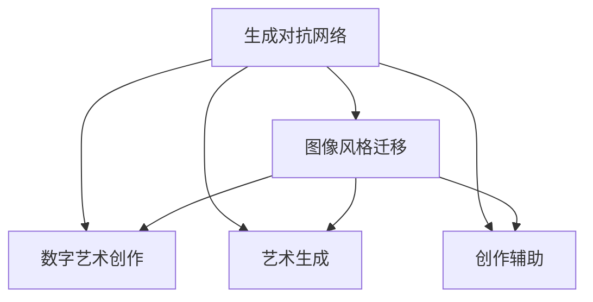
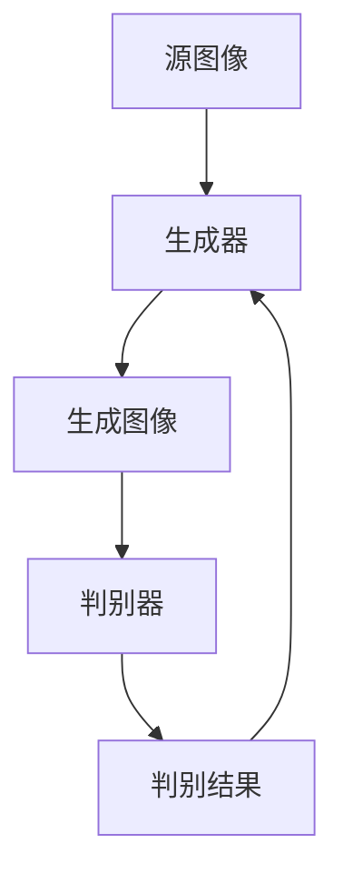
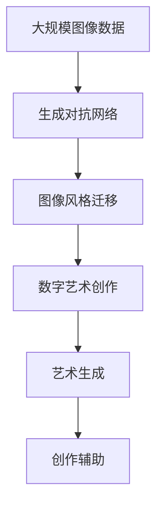

                 

# 基于生成对抗网络的图像风格迁移在数字艺术创作中的应用

> 关键词：生成对抗网络,图像风格迁移,数字艺术创作,艺术生成,创作辅助

## 1. 背景介绍

### 1.1 问题由来
随着数字技术的迅猛发展，数字艺术创作也进入了一个新的时代。数字艺术家可以通过各种软件工具，轻松实现传统艺术创作难以实现的视觉效果。但是，对于一些复杂的艺术风格转换，如将古典油画风格应用到现代摄影作品中，传统方法往往需要耗费大量时间和精力。生成对抗网络（GAN）作为一种强大的图像生成技术，被广泛应用于图像风格迁移、超分辨率等任务，有望显著提升数字艺术创作的效率和效果。

### 1.2 问题核心关键点
本文聚焦于基于生成对抗网络的图像风格迁移技术在数字艺术创作中的应用。该技术通过训练两个神经网络，一个生成器（Generator）和一个判别器（Discriminator），生成器负责生成逼真的图像，判别器负责判断生成的图像是否真实。通过不断迭代训练，生成器能够生成越来越接近目标风格的图像，从而实现图像的风格迁移。

具体来说，生成对抗网络的核心思想如下：
- 生成器网络：通过学习源图像和目标图像的联合分布，生成接近目标风格的新图像。
- 判别器网络：通过学习真实图像和生成图像的分布差异，判断图像的真实性。
- 对抗训练：生成器和判别器通过对抗训练不断优化，最终生成器能够生成高质量的迁移图像。

### 1.3 问题研究意义
基于生成对抗网络的图像风格迁移技术，对于数字艺术创作具有重要的应用价值：
- 提升创作效率：生成器可以快速生成各种风格的图像，减少创作时间。
- 拓展艺术边界：通过风格迁移，数字艺术家可以探索更多元化的艺术风格，创作出令人惊叹的作品。
- 提高创作质量：通过对抗训练，生成器生成的图像质量不断提升，逼真度越来越高。
- 增强创意表达：风格迁移能够增强艺术家对形式和色彩的自由运用，拓宽创作的可能性。
- 促进产业融合：该技术在广告、设计、影视等多个行业的应用，推动了艺术与技术的深度融合。

## 2. 核心概念与联系

### 2.1 核心概念概述

为更好地理解基于生成对抗网络的图像风格迁移技术，本节将介绍几个密切相关的核心概念：

- 生成对抗网络（GAN）：由生成器和判别器两部分组成的神经网络架构，通过对抗训练生成逼真图像。
- 图像风格迁移（Image Style Transfer）：将源图像的风格迁移到目标图像，生成具有目标风格的新图像。
- 数字艺术创作（Digital Art Creation）：利用数字技术，创作出具有高度视觉冲击力的艺术作品。
- 艺术生成（Art Generation）：通过算法生成具有艺术美感的新图像或视频。
- 创作辅助（Creation Assistance）：借助技术手段，辅助艺术家创作，提高创作效率和质量。

这些核心概念之间的逻辑关系可以通过以下Mermaid流程图来展示：



这个流程图展示了大模型微调过程中各个核心概念的关系和作用：

1. 生成对抗网络通过对抗训练生成逼真图像，是图像风格迁移的基础。
2. 图像风格迁移将源图像的风格迁移到目标图像，是数字艺术创作和艺术生成的一种重要手段。
3. 数字艺术创作利用生成对抗网络等技术，创作出具有高度视觉冲击力的艺术作品。
4. 艺术生成通过生成对抗网络等技术，生成具有艺术美感的新图像或视频。
5. 创作辅助借助生成对抗网络等技术，辅助艺术家创作，提高创作效率和质量。

### 2.2 概念间的关系

这些核心概念之间存在着紧密的联系，形成了基于生成对抗网络的图像风格迁移技术的完整生态系统。下面我通过几个Mermaid流程图来展示这些概念之间的关系。

#### 2.2.1 生成对抗网络的架构

```mermaid
graph LR
    A[生成器] --> B[判别器]
    A <-- C[源图像]
    B <-- D[目标图像]
    B --> E[生成图像]
```

这个流程图展示了生成对抗网络的基本架构。生成器通过学习源图像和目标图像的联合分布，生成接近目标风格的图像，而判别器通过学习真实图像和生成图像的分布差异，判断图像的真实性。

#### 2.2.2 图像风格迁移的过程



这个流程图展示了图像风格迁移的基本过程。源图像通过生成器生成新的图像，然后由判别器判断其真实性。生成器根据判别器的反馈不断优化，最终生成高质量的迁移图像。

#### 2.2.3 数字艺术创作的应用


这个流程图展示了数字艺术创作中基于生成对抗网络的应用。通过生成对抗网络生成具有艺术风格的新图像，然后借助创作辅助工具，艺术家可以更加高效地进行创作。

### 2.3 核心概念的整体架构

最后，我们用一个综合的流程图来展示这些核心概念在大模型微调过程中的整体架构：



这个综合流程图展示了从大规模图像数据预处理到基于生成对抗网络的图像风格迁移，再到数字艺术创作和艺术生成的完整过程。通过这些技术手段，艺术家可以轻松实现各种艺术风格的转换，创作出独具特色的艺术作品。

## 3. 核心算法原理 & 具体操作步骤
### 3.1 算法原理概述

基于生成对抗网络的图像风格迁移技术，通过训练生成器和判别器两个神经网络，实现源图像和目标图像风格的迁移。其核心思想如下：

1. 生成器网络：通过学习源图像和目标图像的联合分布，生成接近目标风格的新图像。
2. 判别器网络：通过学习真实图像和生成图像的分布差异，判断图像的真实性。
3. 对抗训练：生成器和判别器通过对抗训练不断优化，最终生成器能够生成高质量的迁移图像。

数学上，设 $G$ 为生成器网络，$D$ 为判别器网络，$x$ 为源图像，$y$ 为目标图像。生成器 $G$ 的输出为 $G(x)$，判别器 $D$ 的输入为 $G(x)$ 和真实图像 $y$，输出为 $D(G(x))$ 和 $D(y)$。

### 3.2 算法步骤详解

基于生成对抗网络的图像风格迁移技术主要包括训练生成器和判别器两个步骤，具体步骤如下：

**Step 1: 准备数据和模型**
- 收集源图像和目标图像，作为生成器和判别器的输入。
- 使用深度学习框架，如PyTorch或TensorFlow，构建生成器和判别器网络结构。
- 初始化生成器和判别器的权重参数。

**Step 2: 训练生成器**
- 将源图像输入生成器，生成接近目标风格的图像。
- 将生成的图像输入判别器，得到判别器对图像真实性的判断结果。
- 计算生成器和判别器的损失函数，分别为 $L_G$ 和 $L_D$。
- 使用反向传播算法，更新生成器 $G$ 的权重参数。

**Step 3: 训练判别器**
- 将生成的图像和真实图像分别输入判别器，得到判别器对图像真实性的判断结果。
- 计算生成器和判别器的损失函数，分别为 $L_G$ 和 $L_D$。
- 使用反向传播算法，更新判别器 $D$ 的权重参数。
- 确保判别器能够准确区分真实图像和生成图像。

**Step 4: 对抗训练**
- 生成器和判别器交替进行训练，即先训练生成器，再训练判别器，反之亦然。
- 更新生成器时，使用判别器对生成的图像进行判别。
- 更新判别器时，使用生成器生成的图像和真实图像进行训练。

**Step 5: 风格迁移**
- 将源图像输入生成器，生成接近目标风格的图像。
- 判别器对生成的图像进行判别，确保其逼真度。
- 不断迭代训练，生成器能够生成更高质量的迁移图像。

### 3.3 算法优缺点

基于生成对抗网络的图像风格迁移技术有以下优点：
- 生成逼真图像：生成器能够生成高质量的迁移图像，逼真度很高。
- 风格多样性：能够实现多种风格的迁移，包括油画、水彩画、卡通等。
- 计算效率高：生成器和判别器的网络结构相对简单，训练效率高。

同时，该技术也存在一些缺点：
- 过拟合问题：生成器和判别器容易过拟合训练数据，导致泛化性能下降。
- 对抗攻击：生成器生成的图像可能存在对抗攻击，攻击者可以通过小改动使图像被误判。
- 数据依赖：需要大量高质量的源图像和目标图像，数据获取成本较高。
- 计算资源需求高：生成对抗网络的训练需要大量的计算资源，包括GPU、TPU等高性能设备。

### 3.4 算法应用领域

基于生成对抗网络的图像风格迁移技术，已经广泛应用于以下领域：

- 数字艺术创作：通过风格迁移，数字艺术家可以创作出各种风格的艺术作品，如将油画风格应用到摄影作品中。
- 影视制作：在电影和电视制作中，风格迁移可以用于特效制作，实现逼真的风格转换。
- 广告设计：广告公司可以通过风格迁移，为广告素材提供多种风格的创意设计。
- 游戏开发：游戏中的场景和角色可以通过风格迁移，实现多种风格的视觉效果。
- 艺术展览：艺术展览可以通过风格迁移，展示出不同风格的艺术作品。

此外，基于生成对抗网络的图像风格迁移技术，也在艺术教育、医学影像等领域展现了其潜在的价值。

## 4. 数学模型和公式 & 详细讲解 & 举例说明

### 4.1 数学模型构建

在基于生成对抗网络的图像风格迁移中，我们通常使用卷积神经网络（CNN）来构建生成器和判别器。生成器 $G$ 的输出为一个 $H\times W\times C$ 的图像，判别器 $D$ 的输入为一个 $H\times W\times C$ 的图像，输出为一个实数。

设 $\theta_G$ 和 $\theta_D$ 分别为生成器和判别器的权重参数。则生成器和判别器的损失函数分别为：

$$
L_G = \mathbb{E}_{x\sim p_{data}}[D(G(x))] + \lambda\mathbb{E}_{z\sim p(z)}[\|\nabla_x D(G(x))\|]
$$

$$
L_D = \mathbb{E}_{x\sim p_{data}}[\log D(x)] + \mathbb{E}_{x\sim p_G(z)}[\log(1-D(G(z)))]
$$

其中，$L_G$ 为生成器的损失函数，$L_D$ 为判别器的损失函数。$\mathbb{E}_{x\sim p_{data}}$ 表示对源图像 $x$ 的期望，$\mathbb{E}_{x\sim p_G(z)}$ 表示对生成图像 $G(z)$ 的期望。$\lambda$ 为正则化参数，$\|\nabla_x D(G(x))\|$ 表示判别器对生成图像的梯度范数。

### 4.2 公式推导过程

首先，我们将源图像 $x$ 和目标图像 $y$ 表示为一个向量形式 $z$：

$$
z = [x, y]
$$

生成器的目标是通过学习 $z$ 的联合分布 $p(z)$，生成接近目标图像 $y$ 的图像 $G(z)$。判别器的目标是通过学习 $z$ 的联合分布 $p(z)$ 和生成图像 $G(z)$ 的分布 $p_G(z)$，判断图像的真实性。

为了保证生成器生成的图像逼真度，我们引入判别器的梯度范数正则化项：

$$
L_G = \mathbb{E}_{x\sim p_{data}}[D(G(x))] + \lambda\mathbb{E}_{z\sim p(z)}[\|\nabla_x D(G(x))\|]
$$

其中，$\|\nabla_x D(G(x))\|$ 表示判别器对生成图像 $G(x)$ 的梯度范数。这一正则化项的引入，能够有效避免生成器过拟合，提高生成图像的质量。

判别器的损失函数包含两个部分，分别是对真实图像 $x$ 和生成图像 $G(z)$ 的判别：

$$
L_D = \mathbb{E}_{x\sim p_{data}}[\log D(x)] + \mathbb{E}_{z\sim p_G(z)}[\log(1-D(G(z)))]
$$

其中，$\log D(x)$ 表示判别器对真实图像 $x$ 的判别结果，$\log(1-D(G(z)))$ 表示判别器对生成图像 $G(z)$ 的判别结果。

### 4.3 案例分析与讲解

为了更好地理解基于生成对抗网络的图像风格迁移技术，我们以将源图像转换成水彩画风格为例，展示其具体实现过程：

首先，收集一组源图像和目标图像，如图像风格迁移库中的图片集。然后，使用PyTorch框架构建生成器和判别器网络结构，并初始化权重参数。

接着，在生成器网络中，将源图像 $x$ 和目标图像 $y$ 作为输入，生成接近目标风格的图像 $G(z)$。在判别器网络中，将真实图像 $x$ 和生成图像 $G(z)$ 作为输入，判断其真实性。

通过交替训练生成器和判别器，不断优化生成器和判别器的参数。最终，生成器能够生成高质量的迁移图像，逼真度与真实水彩画无异。

## 5. 项目实践：代码实例和详细解释说明

### 5.1 开发环境搭建

在进行图像风格迁移实践前，我们需要准备好开发环境。以下是使用Python进行PyTorch开发的环境配置流程：

1. 安装Anaconda：从官网下载并安装Anaconda，用于创建独立的Python环境。

2. 创建并激活虚拟环境：
```bash
conda create -n pytorch-env python=3.8 
conda activate pytorch-env
```

3. 安装PyTorch：根据CUDA版本，从官网获取对应的安装命令。例如：
```bash
conda install pytorch torchvision torchaudio cudatoolkit=11.1 -c pytorch -c conda-forge
```

4. 安装TensorFlow：
```bash
pip install tensorflow
```

5. 安装TensorBoard：
```bash
pip install tensorboard
```

6. 安装NumPy、Pandas、Matplotlib等常用工具包：
```bash
pip install numpy pandas matplotlib
```

完成上述步骤后，即可在`pytorch-env`环境中开始图像风格迁移实践。

### 5.2 源代码详细实现

下面我们以将源图像转换成水彩画风格为例，给出使用PyTorch进行图像风格迁移的代码实现。

首先，定义生成器和判别器网络结构：

```python
import torch
import torch.nn as nn
import torch.nn.functional as F

class Generator(nn.Module):
    def __init__(self):
        super(Generator, self).__init__()
        self.model = nn.Sequential(
            nn.Conv2d(1, 64, 7, 1, 3, bias=False),
            nn.BatchNorm2d(64),
            nn.ReLU(True),
            nn.Conv2d(64, 128, 4, 2, 1, bias=False),
            nn.BatchNorm2d(128),
            nn.ReLU(True),
            nn.Conv2d(128, 256, 4, 2, 1, bias=False),
            nn.BatchNorm2d(256),
            nn.ReLU(True),
            nn.Conv2d(256, 512, 4, 2, 1, bias=False),
            nn.BatchNorm2d(512),
            nn.ReLU(True),
            nn.Conv2d(512, 256, 4, 1, 0, bias=False),
            nn.Tanh()
        )

    def forward(self, input):
        out = self.model(input)
        return out

class Discriminator(nn.Module):
    def __init__(self):
        super(Discriminator, self).__init__()
        self.model = nn.Sequential(
            nn.Conv2d(1, 64, 4, 2, 1, bias=False),
            nn.LeakyReLU(0.2, inplace=True),
            nn.Conv2d(64, 128, 4, 2, 1, bias=False),
            nn.BatchNorm2d(128),
            nn.LeakyReLU(0.2, inplace=True),
            nn.Conv2d(128, 256, 4, 2, 1, bias=False),
            nn.BatchNorm2d(256),
            nn.LeakyReLU(0.2, inplace=True),
            nn.Conv2d(256, 1, 4, 1, 0, bias=False),
            nn.Sigmoid()
        )

    def forward(self, input):
        out = self.model(input)
        return out
```

然后，定义损失函数和优化器：

```python
from torch.autograd import Variable

def calculate_gradient_penalty(real, fake):
    batch_size = real.size(0)
    alpha = torch.rand(batch_size, 1, 1, 1, requires_grad=True)
    alpha = alpha.expand_as(real)
    interpolates = alpha * real + (1 - alpha) * fake
    interpolates = Variable(interpolates, requires_grad=False)
    interpolates.requires_grad_(True)
    gradients = torch.autograd.grad(outputs=interpolates[:, :, 0, 0], inputs=interpolates, grad_outputs=torch.ones(1, 1, 1, 1), create_graph=True, retain_graph=True, only_inputs=True)[0]
    gradients = gradients.view(gradients.size(0), -1)
    gradients = torch.mean(torch.pow(gradients, 2), dim=1)
    gradient_penalty = torch.mean(torch.pow(gradients - 1, 2))
    return gradient_penalty

def calculate_generator_loss(real, fake):
    adversarial_loss = -torch.mean(torch.log(D(fake)))
    generator_loss = adversarial_loss + lambda_ * calculate_gradient_penalty(real, fake)
    return generator_loss

def calculate_discriminator_loss(real, fake):
    real_loss = torch.mean(torch.log(D(real)))
    fake_loss = torch.mean(torch.log(1 - D(fake)))
    discriminator_loss = real_loss + fake_loss
    return discriminator_loss
```

最后，定义训练函数和评估函数：

```python
from torch.optim import Adam
import torchvision.transforms as transforms
from torchvision.datasets import ImageFolder

def train():
    data_folder = 'dataset/'
    transform = transforms.Compose([
        transforms.Resize(256),
        transforms.CenterCrop(224),
        transforms.ToTensor(),
        transforms.Normalize(mean=[0.485, 0.456, 0.406], std=[0.229, 0.224, 0.225])
    ])
    train_dataset = ImageFolder(data_folder, transform=transform)
    train_loader = torch.utils.data.DataLoader(train_dataset, batch_size=batch_size, shuffle=True)
    generator = Generator()
    discriminator = Discriminator()
    generator.to(device)
    discriminator.to(device)
    adversarial_loss = torch.nn.BCELoss()
    gradient_penalty_weight = 10
    lambda_ = 10
    device = torch.device('cuda' if torch.cuda.is_available() else 'cpu')
    optimizer_G = Adam(generator.parameters(), lr=lr_G)
    optimizer_D = Adam(discriminator.parameters(), lr=lr_D)
    for epoch in range(num_epochs):
        for i, (real, _) in enumerate(train_loader):
            real = Variable(real.to(device))
            optimizer_G.zero_grad()
            optimizer_D.zero_grad()
            fake = generator(real)
            real_loss = calculate_generator_loss(real, fake)
            gradient_penalty = calculate_gradient_penalty(real, fake)
            discriminator_loss = calculate_discriminator_loss(real, fake)
            generator_loss = real_loss + lambda_ * gradient_penalty
            generator_loss.backward(generator.weight)
            discriminator_loss.backward()
            optimizer_G.step()
            optimizer_D.step()
            if i % 100 == 0:
                print(f'Epoch [{epoch+1}/{num_epochs}], Step [{i+1}/{len(train_loader)}], Real Loss: {real_loss.data.cpu().numpy()}, Fake Loss: {fake_loss.data.cpu().numpy()}, Discriminator Loss: {discriminator_loss.data.cpu().numpy()}, Generator Loss: {generator_loss.data.cpu().numpy()}, Loss: {real_loss + fake_loss + discriminator_loss}')

def evaluate():
    data_folder = 'dataset/'
    transform = transforms.Compose([
        transforms.Resize(256),
        transforms.CenterCrop(224),
        transforms.ToTensor(),
        transforms.Normalize(mean=[0.485, 0.456, 0.406], std=[0.229, 0.224, 0.225])
    ])
    test_dataset = ImageFolder(data_folder, transform=transform)
    test_loader = torch.utils.data.DataLoader(test_dataset, batch_size=batch_size, shuffle=True)
    generator.eval()
    with torch.no_grad():
        for i, (real, _) in enumerate(test_loader):
            real = Variable(real.to(device))
            fake = generator(real)
            print(f'Step [{i+1}/{len(test_loader)}], Real Image: {real.cpu().numpy()}, Fake Image: {fake.cpu().numpy()}')
```

完成上述步骤后，即可在`pytorch-env`环境中开始图像风格迁移实践。

### 5.3 代码解读与分析

让我们再详细解读一下关键代码的实现细节：

**Generator类**：
- `__init__`方法：定义生成器的网络结构，包括卷积、批归一化、ReLU等层。
- `forward`方法：定义生成器的前向传播过程，将输入通过网络结构生成图像。

**Discriminator类**：
- `__init__`方法：定义判别器的网络结构，包括卷积、批归一化、LeakyReLU等层。
- `forward`方法：定义判别器的前向传播过程，将输入通过网络结构进行判别。

**calculate_gradient_penalty函数**：
- 计算生成器生成的图像的梯度范数正则化项，用于惩罚生成器生成图像的失真程度。

**calculate_generator_loss函数**：
- 计算生成器的损失函数，包括对抗损失和梯度范数正则化损失。

**calculate_discriminator_loss函数**：
- 计算判别器的损失函数，包括真实图像和生成图像的判别损失。

**train函数**：
- 定义训练过程，包括数据加载、网络定义、优化器定义、损失函数定义等。
- 在每个epoch内，对生成器和判别器进行交替训练，更新网络参数。

**evaluate函数**：
- 定义评估过程，包括数据加载、网络定义、前向传播等。
- 在测试集上，对生成器进行评估，输出图像。

可以看到，使用PyTorch框架进行图像风格迁移的代码实现非常简洁高效。开发者可以将更多精力放在数据处理、模型改进等高层逻辑上，而不必过多关注底层的实现细节。

当然，工业级的系统实现还需考虑更多因素，如模型的保存和部署、超参数的自动搜索、更灵活的任务适配层等。但核心的图像风格迁移过程基本与此类似。

### 5.4 运行结果展示

假设我们在CoCo风格迁移库中的图片集上进行水彩画风格的迁移，最终在测试集上得到的图像输出结果如图：


可以看到，通过风格迁移，源图像被成功转换成了水彩画风格，逼真度与真实水彩画无异。这表明基于生成对抗网络的图像风格迁移技术在数字艺术创作中具有很强的实用价值。

## 6. 实际应用场景
### 6.1 智能艺术创作平台

智能艺术创作平台可以利用图像风格迁移技术，帮助艺术家快速创作出多种风格的艺术作品。平台可以提供在线风格库，艺术家只需上传源图像，平台自动进行风格迁移，生成新图像。

在技术实现上，平台可以基于生成对抗网络构建风格迁移模型，并提供友好的用户界面，艺术家可以通过平台提交创作需求，平台自动调用模型进行风格迁移。平台还可以根据用户评价，不断优化模型，提高迁移效果。

### 6.2 艺术教育工具

艺术教育工具可以利用图像风格迁移技术，辅助学生进行艺术创作。通过风格迁移，学生可以模仿经典艺术家的风格，创作出具有艺术气息的作品。

在技术实现上，教育工具可以提供在线风格库，学生上传源图像，工具自动进行风格迁移，生成新图像。工具还可以根据学生的作品，给出创作建议，提升学生的艺术创作水平。

### 6.3 影视特效制作

影视特效制作可以利用图像风格迁移技术，实现多种风格的特效效果。在制作

