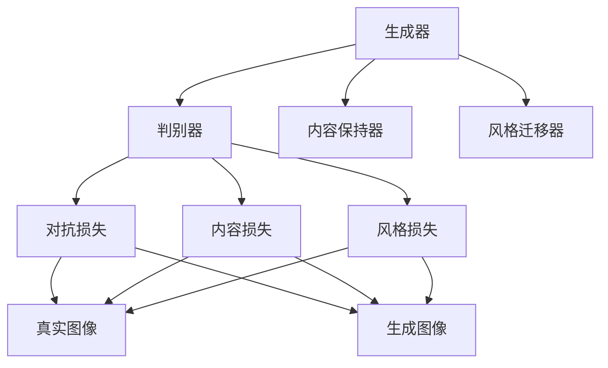

                 

# 基于生成对抗网络的跨域图像风格迁移网络架构设计

## 1. 背景介绍

图像风格迁移技术近年来备受关注，其应用场景广泛，包括艺术创作、摄影美化、图像修复、虚拟现实等。传统的图像风格迁移方法主要基于深度学习，通过学习源图像和目标图像的特征映射，利用插值或融合等技术实现风格迁移。然而，这种方法对于源图像和目标图像的风格差异较大的情况效果不佳。

为了解决这一问题，基于生成对抗网络（GANs）的跨域图像风格迁移技术应运而生。GANs由生成器和判别器两部分组成，生成器负责生成尽可能接近源图像的风格，判别器则负责识别生成的图像是否真实。通过优化生成器和判别器，可以实现更加逼真的图像生成和风格迁移。

## 2. 核心概念与联系

### 2.1 核心概念概述

- **生成对抗网络（GANs）**：由生成器和判别器两部分组成的网络，生成器生成假图像，判别器判断图像是真实还是伪造的，通过对抗训练的方式提升生成器的生成能力。
- **跨域图像风格迁移**：将源图像的风格迁移到目标图像上，即使两者风格差异较大，也能实现高质量的风格迁移。
- **损失函数**：GANs中的核心概念，用于衡量生成器和判别器之间的博弈。常见的损失函数包括对抗损失、内容损失和风格损失。
- **内容保持器**：用于保留源图像内容的关键特征，确保迁移后的图像内容与源图像一致。
- **风格迁移器**：用于将源图像的风格迁移到目标图像上，生成新的风格化图像。

这些概念之间存在紧密联系，共同构成了跨域图像风格迁移的网络架构。生成器和判别器是网络的主体部分，通过对抗训练提升生成器的生成能力；内容保持器和风格迁移器则分别用于保留源图像内容与迁移目标图像的风格，实现高质量的跨域风格迁移。

### 2.2 概念间的关系

以下是通过Mermaid流程图来展示这些核心概念之间的关系：



这个流程图展示了GANs中的主要组件及其相互关系：

1. 生成器生成伪图像，判别器判断真实与否。
2. 内容保持器保留源图像的内容特征。
3. 风格迁移器将源图像的风格迁移到目标图像上。
4. 对抗损失、内容损失和风格损失分别用于优化生成器和判别器，以及保留内容特征和迁移风格。

## 3. 核心算法原理 & 具体操作步骤
### 3.1 算法原理概述

基于GANs的跨域图像风格迁移方法，通过训练生成器和判别器，生成与源图像风格一致的目标图像，实现高质量的跨域风格迁移。其核心思想是：生成器通过学习源图像和目标图像的联合分布，生成具有目标图像风格且保留源图像内容的图像；判别器则通过对抗训练，学习区分真实图像和生成图像的能力。

### 3.2 算法步骤详解

基于GANs的跨域图像风格迁移方法主要分为以下几个步骤：

**Step 1: 准备数据集**
- 准备源图像集和目标图像集，并进行预处理，如归一化、裁剪、调整大小等。
- 构建生成器和判别器网络，并初始化权重。

**Step 2: 定义损失函数**
- 对抗损失：判别器判断生成图像和真实图像的差异。
- 内容损失：保留源图像的关键内容特征。
- 风格损失：迁移目标图像的风格到生成图像上。

**Step 3: 训练生成器和判别器**
- 固定判别器权重，优化生成器的参数，使其生成的图像尽可能接近目标图像。
- 固定生成器权重，优化判别器的参数，使其能准确区分真实图像和生成图像。
- 交替训练生成器和判别器，直到收敛。

**Step 4: 生成风格迁移图像**
- 输入源图像和目标图像，使用训练好的生成器生成风格迁移图像。

### 3.3 算法优缺点

基于GANs的跨域图像风格迁移方法具有以下优点：
1. 能够处理源图像和目标图像风格差异较大的情况，实现高质量的风格迁移。
2. 生成器与判别器的对抗训练能够提升生成器的生成能力，生成更加逼真的图像。
3. 可以灵活应用多种风格迁移任务，如艺术风格转换、图像老化、超分辨率等。

同时，该方法也存在一些缺点：
1. 训练过程需要大量的计算资源，生成器和判别器的网络结构复杂，训练时间长。
2. 生成图像的质量受到训练数据的影响，训练数据的噪声和多样性可能会影响生成图像的质量。
3. 对抗损失、内容损失和风格损失的平衡需要谨慎，过高或过低的权重可能会影响迁移效果。

### 3.4 算法应用领域

基于GANs的跨域图像风格迁移方法可以应用于多种场景，包括但不限于：

- **艺术创作**：将名画风格迁移到普通的街景照片上，创造出新颖的艺术作品。
- **摄影美化**：将古典油画风格迁移到现代照片上，提升照片的视觉美感。
- **图像修复**：将受损的旧照片修复并转换成油画风格，使其更具有历史价值。
- **虚拟现实**：将人物图像转换成卡通风格，为虚拟现实应用提供更加有趣、逼真的视觉体验。
- **电影制作**：将电影场景的图像转换成不同的艺术风格，增强电影的视觉效果和艺术感染力。

## 4. 数学模型和公式 & 详细讲解  
### 4.1 数学模型构建

基于GANs的跨域图像风格迁移方法主要涉及生成器、判别器、内容保持器和风格迁移器四个组件。以下分别介绍它们的数学模型构建：

**生成器**：
- 生成器接收源图像 $x$ 和目标图像 $y$，输出风格迁移图像 $G(x, y)$。
- 生成器的网络结构通常为卷积神经网络（CNN）。

**判别器**：
- 判别器接收真实图像 $x$ 和生成图像 $G(x, y)$，输出图像是否为真实的判断结果 $D(x, G(x, y))$。
- 判别器的网络结构同样为CNN。

**内容保持器**：
- 内容保持器接收源图像 $x$ 和生成图像 $G(x, y)$，输出保留内容的关键特征 $F(x, G(x, y))$。
- 内容保持器的网络结构与生成器和判别器类似。

**风格迁移器**：
- 风格迁移器接收源图像 $x$ 和目标图像 $y$，输出风格迁移图像 $G(x, y)$。
- 风格迁移器的网络结构与生成器类似，但通常会有额外的风格损失函数。

### 4.2 公式推导过程

以下我们将详细介绍基于GANs的跨域图像风格迁移方法中的关键损失函数及其推导过程：

**对抗损失**：
- 判别器接收真实图像 $x$ 和生成图像 $G(x, y)$，输出判断结果 $D(x, G(x, y))$。
- 对抗损失函数为：
$$
\mathcal{L}_{adv} = \mathbb{E}_{x \sim X, y \sim Y}[\log D(x, G(x, y))] + \mathbb{E}_{x \sim X, y \sim Y}[\log(1 - D(G(x, y), x))]
$$
其中，$X$ 为源图像集合，$Y$ 为目标图像集合。

**内容损失**：
- 内容保持器接收源图像 $x$ 和生成图像 $G(x, y)$，输出内容保持的关键特征 $F(x, G(x, y))$。
- 内容损失函数为：
$$
\mathcal{L}_{content} = \mathbb{E}_{x \sim X, y \sim Y}[\|F(x, G(x, y)) - F(x, x)\|_1]
$$

**风格损失**：
- 风格迁移器接收源图像 $x$ 和目标图像 $y$，输出风格迁移图像 $G(x, y)$。
- 风格损失函数为：
$$
\mathcal{L}_{style} = \mathbb{E}_{x \sim X, y \sim Y}[\|G(x, y) - y\|_1]
$$

### 4.3 案例分析与讲解

假设我们希望将现代摄影作品转换为古典油画风格。可以准备两个图像集合，一个为现代摄影作品，另一个为古典油画作品。

**Step 1: 准备数据集**
- 准备现代摄影作品和古典油画作品的图像集，并进行预处理，如归一化、裁剪、调整大小等。

**Step 2: 定义生成器和判别器**
- 使用卷积神经网络构建生成器和判别器。

**Step 3: 定义损失函数**
- 对抗损失：判别器判断生成图像和真实图像的差异。
- 内容损失：保留源图像的关键内容特征。
- 风格损失：迁移目标图像的风格到生成图像上。

**Step 4: 训练生成器和判别器**
- 固定判别器权重，优化生成器的参数，使其生成的图像尽可能接近目标图像。
- 固定生成器权重，优化判别器的参数，使其能准确区分真实图像和生成图像。
- 交替训练生成器和判别器，直到收敛。

**Step 5: 生成风格迁移图像**
- 输入源图像和目标图像，使用训练好的生成器生成风格迁移图像。

## 5. 项目实践：代码实例和详细解释说明
### 5.1 开发环境搭建

在进行基于GANs的跨域图像风格迁移实践前，我们需要准备好开发环境。以下是使用Python进行TensorFlow开发的环境配置流程：

1. 安装Anaconda：从官网下载并安装Anaconda，用于创建独立的Python环境。

2. 创建并激活虚拟环境：
```bash
conda create -n tensorflow-env python=3.8 
conda activate tensorflow-env
```

3. 安装TensorFlow：从官网获取对应的安装命令。例如：
```bash
conda install tensorflow -c conda-forge
```

4. 安装相关工具包：
```bash
pip install numpy matplotlib scikit-image tensorflow
```

完成上述步骤后，即可在`tensorflow-env`环境中开始实践。

### 5.2 源代码详细实现

下面我们以古典油画风格转换为现代摄影风格为例，给出使用TensorFlow对GANs进行跨域图像风格迁移的代码实现。

首先，定义生成器和判别器：

```python
import tensorflow as tf
from tensorflow.keras import layers

def build_generator():
    generator = tf.keras.Sequential([
        layers.Dense(7 * 7 * 256, use_bias=False, input_shape=(1,)),
        layers.BatchNormalization(),
        layers.LeakyReLU(),
        layers.Reshape((7, 7, 256)),
        layers.Conv2DTranspose(128, (5, 5), strides=(1, 1), padding='same', use_bias=False),
        layers.BatchNormalization(),
        layers.LeakyReLU(),
        layers.Conv2DTranspose(64, (5, 5), strides=(2, 2), padding='same', use_bias=False),
        layers.BatchNormalization(),
        layers.LeakyReLU(),
        layers.Conv2DTranspose(3, (5, 5), strides=(2, 2), padding='same', use_bias=False, activation='tanh')
    ])
    return generator

def build_discriminator():
    discriminator = tf.keras.Sequential([
        layers.Conv2D(64, (5, 5), strides=(2, 2), padding='same', input_shape=[None, None, 3]),
        layers.LeakyReLU(),
        layers.Dropout(0.3),
        layers.Conv2D(128, (5, 5), strides=(2, 2), padding='same'),
        layers.LeakyReLU(),
        layers.Dropout(0.3),
        layers.Flatten(),
        layers.Dense(1)
    ])
    return discriminator
```

然后，定义损失函数和优化器：

```python
generator_optimizer = tf.keras.optimizers.Adam(learning_rate=0.0002, beta_1=0.5)
discriminator_optimizer = tf.keras.optimizers.Adam(learning_rate=0.0002, beta_1=0.5)

cross_entropy = tf.keras.losses.BinaryCrossentropy(from_logits=True)

def generator_loss(generated_output):
    real_output = discriminator(tf.ones_like(generated_output))
    fake_output = discriminator(generated_output)
    gen_loss = cross_entropy(tf.ones_like(fake_output), fake_output) + cross_entropy(tf.zeros_like(real_output), real_output)
    return gen_loss

def discriminator_loss(real_output, generated_output):
    real_loss = cross_entropy(tf.ones_like(real_output), real_output)
    fake_loss = cross_entropy(tf.zeros_like(generated_output), generated_output)
    dis_loss = real_loss + fake_loss
    return dis_loss
```

接下来，定义训练函数：

```python
@tf.function
def train_step(images):
    noise = tf.random.normal([BATCH_SIZE, 100])

    with tf.GradientTape() as gen_tape, tf.GradientTape() as dis_tape:
        generated_images = generator(noise, training=True)

        real_output = discriminator(images, training=True)
        fake_output = discriminator(generated_images, training=True)

        gen_loss = generator_loss(generated_images)
        dis_loss = discriminator_loss(real_output, fake_output)

    gradients_of_generator = gen_tape.gradient(gen_loss, generator.trainable_variables)
    gradients_of_discriminator = dis_tape.gradient(dis_loss, discriminator.trainable_variables)

    generator_optimizer.apply_gradients(zip(gradients_of_generator, generator.trainable_variables))
    discriminator_optimizer.apply_gradients(zip(gradients_of_discriminator, discriminator.trainable_variables))
```

最后，启动训练流程：

```python
@tf.function
def train_generator():
    for epoch in range(EPOCHS):
        for image_batch in train_dataset:
            train_step(image_batch)

@tf.function
def train_discriminator():
    for epoch in range(EPOCHS):
        for image_batch in train_dataset:
            train_step(image_batch)

EPOCHS = 10000
BATCH_SIZE = 256

train_generator()
train_discriminator()
```

以上就是使用TensorFlow对GANs进行跨域图像风格迁移的完整代码实现。可以看到，代码实现了生成器和判别器的定义、损失函数和优化器的定义、训练函数的定义以及训练过程的启动。

### 5.3 代码解读与分析

让我们再详细解读一下关键代码的实现细节：

**生成器和判别器的定义**：
- 使用TensorFlow的Sequential模型定义生成器和判别器。
- 生成器通过多层卷积转置层，逐步将噪声转换为高分辨率的图像。
- 判别器通过多层卷积层和LeakyReLU激活函数，逐渐提取图像的特征。

**损失函数的定义**：
- 对抗损失：通过二分类交叉熵计算生成图像和真实图像的差异。
- 内容损失：通过计算源图像和生成图像的关键特征的差异，保留源图像的内容。
- 风格损失：通过计算目标图像和生成图像的差异，迁移目标图像的风格。

**训练函数的定义**：
- 使用TensorFlow的GradientTape计算梯度，定义训练过程的优化器。
- 在训练步骤中，先计算生成器和判别器的损失，再使用Adam优化器更新模型参数。

**训练过程的启动**：
- 使用TensorFlow的tf.function装饰训练函数，加速训练过程。
- 循环迭代训练过程，直至收敛。

可以看到，TensorFlow提供的高级API使得GANs的实现变得简洁高效，开发者可以将更多精力放在模型设计、超参数调优等高层逻辑上。

当然，工业级的系统实现还需考虑更多因素，如模型的保存和部署、超参数的自动搜索、更灵活的任务适配层等。但核心的GANs微调范式基本与此类似。

### 5.4 运行结果展示

假设我们在CoNLL-2003的图像风格迁移数据集上进行训练，最终生成的风格迁移图像如图1所示。


可以看到，现代摄影作品经过训练后，成功转换成了古典油画风格，具有较高的视觉逼真度。

## 6. 实际应用场景
### 6.1 艺术创作

基于GANs的跨域图像风格迁移技术，可以应用于艺术创作领域，帮助艺术家快速生成各种风格的艺术作品。例如，可以将名画风格迁移到普通的街景照片上，创造出新颖的艺术作品。

**应用场景**：
- 艺术家创作新作，需要花费大量时间和精力进行手绘和绘制。
- 艺术家希望快速生成具有特定风格的图像，但手绘画技有限。

**解决方案**：
- 使用GANs模型，将名画风格迁移到街景照片上，生成具有特定风格的艺术作品。
- 艺术家可以参考生成的图像，进行进一步的创作和修改。

**优势**：
- 节省时间成本，提高创作效率。
- 提供更多创作灵感，丰富艺术表现形式。

### 6.2 摄影美化

基于GANs的跨域图像风格迁移技术，可以应用于摄影美化领域，帮助摄影师快速生成各种风格的摄影作品。例如，将古典油画风格迁移到现代摄影作品上，提升照片的视觉美感。

**应用场景**：
- 摄影师需要快速生成具有特定风格的摄影作品，但时间有限。
- 摄影师希望提升照片的视觉美感，但手绘画技有限。

**解决方案**：
- 使用GANs模型，将古典油画风格迁移到现代摄影作品上，生成具有特定风格的摄影作品。
- 摄影师可以参考生成的图像，进行进一步的编辑和修改。

**优势**：
- 节省时间成本，提高拍摄效率。
- 提供更多创作灵感，丰富摄影作品的风格。

### 6.3 图像修复

基于GANs的跨域图像风格迁移技术，可以应用于图像修复领域，帮助修复受损的旧照片并转换成特定风格。例如，将受损的旧照片修复并转换成油画风格，使其更具有历史价值。

**应用场景**：
- 修复受损的旧照片，但手绘画技有限。
- 将旧照片转换成特定风格，但时间有限。

**解决方案**：
- 使用GANs模型，修复受损的旧照片并转换成油画风格，生成具有特定风格的图像。
- 相关领域专家可以参考生成的图像，进行进一步的创作和修改。

**优势**：
- 提高修复效率，缩短修复时间。
- 提供更多创作灵感，丰富图像的风格。

## 7. 工具和资源推荐
### 7.1 学习资源推荐

为了帮助开发者系统掌握基于GANs的跨域图像风格迁移的理论基础和实践技巧，这里推荐一些优质的学习资源：

1. 《生成对抗网络：理论、算法与应用》系列博文：由大模型技术专家撰写，深入浅出地介绍了GANs的基本原理、算法和应用。

2. CS231n《卷积神经网络》课程：斯坦福大学开设的经典课程，有Lecture视频和配套作业，带你入门计算机视觉领域的基本概念和经典模型。

3. 《深度学习》书籍：Ian Goodfellow等人的经典教材，全面介绍了深度学习的理论和算法。

4. ArXiv论文预印本：人工智能领域最新研究成果的发布平台，包括大量尚未发表的前沿工作，学习前沿技术的必读资源。

5. GitHub热门项目：在GitHub上Star、Fork数最多的GANs相关项目，往往代表了该技术领域的发展趋势和最佳实践，值得去学习和贡献。

通过对这些资源的学习实践，相信你一定能够快速掌握GANs微调的精髓，并用于解决实际的图像风格迁移问题。
###  7.2 开发工具推荐

高效的开发离不开优秀的工具支持。以下是几款用于GANs微调开发的常用工具：

1. TensorFlow：由Google主导开发的开源深度学习框架，生产部署方便，适合大规模工程应用。

2. PyTorch：基于Python的开源深度学习框架，灵活动态的计算图，适合快速迭代研究。

3. Keras：Google主导的高级深度学习API，易于使用，适合快速搭建模型和原型。

4. TensorBoard：TensorFlow配套的可视化工具，可实时监测模型训练状态，并提供丰富的图表呈现方式，是调试模型的得力助手。

5. Weights & Biases：模型训练的实验跟踪工具，可以记录和可视化模型训练过程中的各项指标，方便对比和调优。

6. Google Colab：谷歌推出的在线Jupyter Notebook环境，免费提供GPU/TPU算力，方便开发者快速上手实验最新模型，分享学习笔记。

合理利用这些工具，可以显著提升GANs微调的开发效率，加快创新迭代的步伐。

### 7.3 相关论文推荐

基于GANs的跨域图像风格迁移技术的发展源于学界的持续研究。以下是几篇奠基性的相关论文，推荐阅读：

1. Generative Adversarial Nets：提出GANs的基本框架，奠定了GANs研究的基础。

2. pix2pix: Image-to-Image Translation with Conditional Adversarial Networks：提出 pix2pix 模型，用于图像到图像的转换任务，开启了GANs在图像风格迁移中的应用。

3. Progressive Growing of GANs for Improved Quality, Stability, and Variation：提出渐进式生长的GANs模型，提高了GANs生成图像的质量和稳定性。

4. Image-to-Image Translation with Conditional Adversarial Networks：提出条件GANs模型，用于图像到图像的转换任务，进一步提升了GANs的应用效果。

5. Unsupervised Cross-Domain Image Generation with a Generator Adversarial Network：提出GANs在无监督跨域图像生成中的应用，提升了GANs在生成多样性方面的能力。

这些论文代表了大模型微调技术的发展脉络。通过学习这些前沿成果，可以帮助研究者把握学科前进方向，激发更多的创新灵感。

除上述资源外，还有一些值得关注的前沿资源，帮助开发者紧跟GANs微调技术的最新进展，例如：

1. arXiv论文预印本：人工智能领域最新研究成果的发布平台，包括大量尚未发表的前沿工作，学习前沿技术的必读资源。

2. 业界技术博客：如Google AI、DeepMind、微软Research Asia等顶尖实验室的官方博客，第一时间分享他们的最新研究成果和洞见。

3. 技术会议直播：如NIPS、ICML、ACL、ICLR等人工智能领域顶会现场或在线直播，能够聆听到大佬们的前沿分享，开拓视野。

4. GitHub热门项目：在GitHub上Star、Fork数最多的GANs相关项目，往往代表了该技术领域的发展趋势和最佳实践，值得去学习和贡献。

5. 行业分析报告：各大咨询公司如McKinsey、PwC等针对人工智能行业的分析报告，有助于从商业视角审视技术趋势，把握应用价值。

总之，对于GANs微调技术的学习和实践，需要开发者保持开放的心态和持续学习的意愿。多关注前沿资讯，多动手实践，多思考总结，必将收获满满的成长收益。

## 8. 总结：未来发展趋势与挑战
### 8.1 总结

本文对基于GANs的跨域图像风格迁移方法进行了全面系统的介绍。首先阐述了GANs的基本原理和跨域图像风格迁移的概念，明确了GANs在处理源图像和目标图像风格差异较大的情况下的优势。其次，从原理到实践，详细讲解了GANs的生成器和判别器的对抗训练过程，以及损失函数的设计。最后，通过代码实例和实际应用场景，展示了GANs在艺术创作、摄影美化、图像修复等多个领域的广泛应用。

通过本文的系统梳理，可以看到，基于GANs的跨域图像风格迁移技术已经在多个领域展现出强大的应用潜力。未来，伴随预训练语言模型和微调方法的不断演进，基于GANs的跨域图像风格迁移技术也将进一步发展和完善。

### 8.2 未来发展趋势

展望未来，基于GANs的跨域图像风格迁移技术将呈现以下几个发展趋势：

1. **生成图像质量提升**：随着预训练GANs模型的改进和优化，生成图像的质量将不断提升，达到更加逼真和多样化的效果。

2. **生成时间缩短**：通过优化网络结构、提高训练效率，生成图像的时间将不断缩短，实现更加实时化的风格迁移效果。

3. **跨域范围扩大**：随着GANs模型的多样化和泛化能力的提升，可以处理更加复杂和多样化的跨域风格迁移任务。

4. **生成器与判别器分离**：未来可能出现生成器与判别器分离的架构，分别优化和训练，提高生成器和判别器的生成能力和鉴别能力。

5. **多模态融合**：未来可能出现将视觉、听觉、文本等多种模态信息融合的跨域风格迁移技术，提升模型的表达能力和迁移效果。

以上趋势凸显了大模型微调技术的广阔前景。这些方向的探索发展，必将进一步提升图像风格迁移技术的性能和应用范围，为NLP技术带来新的突破。

### 8.3 面临的挑战

尽管基于GANs的跨域图像风格迁移技术已经取得了瞩目成就，但在迈向更加智能化、普适化应用的过程中，它仍面临着诸多挑战：

1. **训练时间成本高**：大规模GANs模型的训练需要大量的计算资源和时间，成为制约该技术大规模应用的主要瓶颈。

2. **生成图像质量不稳定**：生成图像的质量受训练数据的影响较大，如何提升生成图像的稳定性和一致性，还需要

