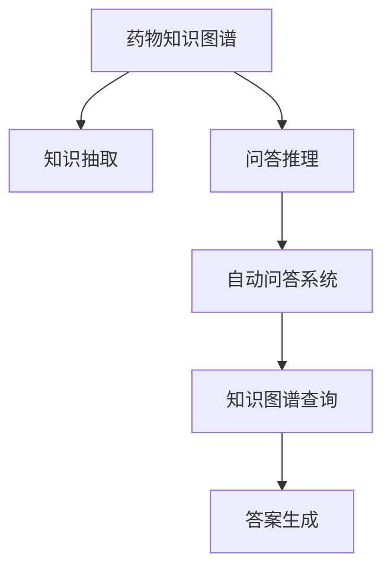
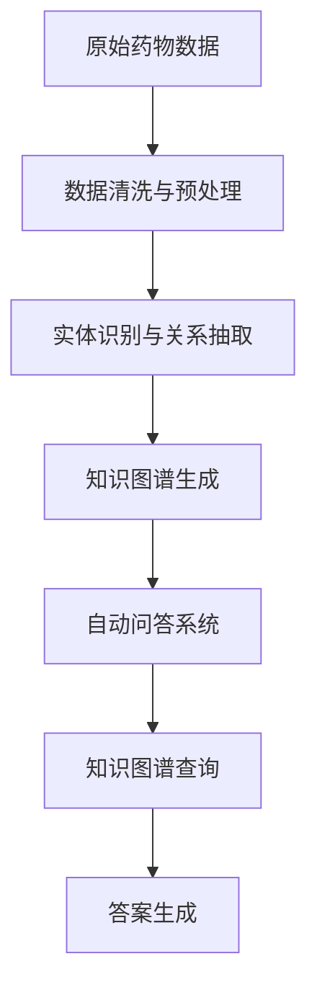

                 

# 基于药物知识图谱的自动问答系统

## 1. 背景介绍

### 1.1 问题由来

随着医药行业的发展，对于药物信息的检索、查询和整合的需求日益增长。传统的基于关键词的文本搜索方式，难以处理结构化和半结构化的药物信息，更无法提供准确的答案。自动问答系统（QA系统）因其智能高效的检索和推理能力，在医药领域得到了广泛应用。

然而，现有的QA系统往往需要大量高质量的标注数据进行训练，并且难以适应新出现的药物知识和数据。而知识图谱作为一种结构化的知识表示方式，能够将药物的实体、属性和关系进行清晰地建模，为QA系统提供了一种高效的知识获取途径。

### 1.2 问题核心关键点

本文聚焦于基于药物知识图谱的自动问答系统，其核心关键点包括：
- 构建药物知识图谱，用于存储和表示药物的实体、属性和关系。
- 设计QA系统，能够根据用户提问从知识图谱中抽取信息，并给出准确的回答。
- 探索QSAR技术，通过药物分子结构和性质预测新药的生物活性。

### 1.3 问题研究意义

构建基于药物知识图谱的QA系统，对于提升医药信息的检索和利用效率，支持新药开发和个性化治疗，具有重要意义：

1. 提高检索效率。QA系统能够快速响应用户查询，提供结构化药物信息，避免了传统文本搜索的繁琐过程。
2. 丰富回答内容。基于知识图谱的QA系统能够提供基于事实的准确回答，弥补了基于文本搜索的模糊和歧义。
3. 支持新药研发。通过从知识图谱中抽取药物属性和关系，QA系统可以辅助新药设计和筛选，提高新药开发的成功率。
4. 促进个性化医疗。QA系统能够根据患者的基因和病历信息，推荐最合适的药物和治疗方案，支持精准医疗。
5. 优化医疗服务。QA系统可以应用于电子病历、医疗咨询等场景，优化医疗服务流程，提升患者体验。

## 2. 核心概念与联系

### 2.1 核心概念概述

为了更好地理解基于药物知识图谱的自动问答系统，本文将介绍几个密切相关的核心概念：

- 药物知识图谱(Drug Knowledge Graph)：一种以药物实体为节点，以药物属性和关系为边的图结构，用于存储和表示药物的详细信息。
- 自动问答系统(Automatic Question Answering, QA)：一种智能问答技术，能够理解自然语言问题，从知识图谱或文本中抽取信息，并给出准确的回答。
- 知识抽取(Knowledge Extraction)：从文本或知识图谱中自动抽取实体、属性和关系的过程。
- 问答推理(QA Reasoning)：基于知识图谱和用户提问，推理并生成回答的过程。
- 药物性质预测(QSAR)：利用机器学习技术，从药物分子结构预测其生物活性和药物性质。

这些核心概念之间的逻辑关系可以通过以下Mermaid流程图来展示：



这个流程图展示了从构建知识图谱到生成QA系统，再到最终给出答案的全过程。

### 2.2 概念间的关系

这些核心概念之间存在着紧密的联系，形成了基于药物知识图谱的QA系统的完整生态系统。下面我们通过几个Mermaid流程图来展示这些概念之间的关系。

#### 2.2.1 知识图谱的构建流程


这个流程图展示了从原始药物数据到生成知识图谱的全过程。

#### 2.2.2 问答推理的过程


这个流程图展示了从用户提问到生成回答的全过程。

#### 2.2.3 问答推理与知识抽取的关系


这个流程图展示了问答推理与知识抽取之间的紧密关系。

### 2.3 核心概念的整体架构

最后，我们用一个综合的流程图来展示这些核心概念在大语言模型微调过程中的整体架构：



这个综合流程图展示了从原始药物数据到生成QA系统，再到最终给出答案的全过程。

## 3. 核心算法原理 & 具体操作步骤
### 3.1 算法原理概述

基于药物知识图谱的QA系统，主要通过知识抽取和问答推理两个步骤，从知识图谱中抽取信息，并生成回答。其核心算法原理包括：

1. 知识抽取：从知识图谱中抽取用户查询中的实体和关系，生成图谱子图。
2. 问答推理：根据用户提问和知识图谱子图，推理出可能的答案。
3. 答案生成：根据推理结果，生成文本回答。

### 3.2 算法步骤详解

基于药物知识图谱的QA系统主要包括以下几个关键步骤：

**Step 1: 数据准备**
- 收集和整理药物知识图谱中的实体、属性和关系。
- 收集用户的提问和标注答案，用于训练QA系统。

**Step 2: 知识抽取**
- 使用自然语言处理技术，如命名实体识别和关系抽取，将用户提问中的实体和关系抽取出来。
- 根据抽取结果，在知识图谱中查找对应的实体和关系，生成子图。

**Step 3: 问答推理**
- 使用图嵌入技术，将子图中的实体和关系映射到低维向量空间。
- 使用推理算法，如逻辑推理、基于规则的推理和基于深度学习的推理，从子图中找到可能的答案。
- 综合考虑多个推理结果，生成最终的答案。

**Step 4: 答案生成**
- 使用语言模型，如BERT、GPT等，将推理结果转换为文本回答。
- 根据用户提问的语境，调整回答的表达方式和语言风格。

### 3.3 算法优缺点

基于药物知识图谱的QA系统具有以下优点：
- 知识图谱提供结构化信息，便于自动化抽取和推理。
- 基于知识图谱的QA系统能够提供基于事实的准确回答，减少歧义。
- 知识图谱支持跨领域信息整合，能够涵盖不同药物实体之间的关系。

然而，该方法也存在以下缺点：
- 知识图谱构建和维护需要大量人工干预，成本较高。
- 知识图谱可能存在不完备或错误信息，影响推理结果。
- 知识图谱中的信息可能过于静态，难以适应新出现的药物知识和数据。
- 知识图谱查询和推理需要较高的计算资源，响应速度较慢。

### 3.4 算法应用领域

基于药物知识图谱的QA系统，已经在以下领域得到了广泛应用：

- 药物信息检索：帮助医生和患者快速找到需要的药物信息。
- 新药研发：通过知识图谱辅助药物设计、筛选和评价。
- 个性化治疗：根据患者的基因和病历信息，推荐最合适的药物和治疗方案。
- 临床决策支持：辅助医生进行药物选择和诊断决策。
- 医药咨询：回答医药专业人士和公众的常见问题，提高医药知识普及度。

## 4. 数学模型和公式 & 详细讲解  
### 4.1 数学模型构建

本节将使用数学语言对基于药物知识图谱的QA系统进行更加严格的刻画。

记药物知识图谱为 $G=(V,E)$，其中 $V$ 为药物实体集合，$E$ 为药物关系集合。假设用户提问为 $q$，问答系统需要从知识图谱中找到与 $q$ 相关的实体 $e$ 和关系 $r$。

定义问答系统的推理过程为：
1. 从用户提问 $q$ 中抽取实体 $e_1, e_2, ..., e_n$ 和关系 $r_1, r_2, ..., r_m$。
2. 在知识图谱中查找与 $e_1, e_2, ..., e_n$ 相关的实体 $e_1', e_2', ..., e_m'$ 和关系 $r_1', r_2', ..., r_m'$。
3. 生成子图 $G_s$。
4. 使用推理算法从 $G_s$ 中查找可能的答案 $a$。
5. 生成文本回答 $a$。

### 4.2 公式推导过程

以下我们以二元推理为例，推导基于知识图谱的QA推理过程的数学公式。

假设用户提问为 $q$，知识图谱中包含的实体为 $e_1, e_2, ..., e_n$，关系为 $r_1, r_2, ..., r_m$。查询关系为 $r_q$。设实体 $e_i$ 的嵌入表示为 $\vec{e}_i \in \mathbb{R}^d$，关系 $r_j$ 的嵌入表示为 $\vec{r}_j \in \mathbb{R}^d$。

推理过程分为两个步骤：
1. 根据用户提问 $q$ 和知识图谱中已有的实体和关系，生成子图 $G_s$。
2. 在 $G_s$ 中推理出可能的答案 $a$。

对于第一步，我们假设用户提问 $q$ 中包含的实体 $e_i$ 和关系 $r_j$ 的嵌入表示分别为 $\vec{e}_i^q$ 和 $\vec{r}_j^q$。将 $q$ 与知识图谱中已有的实体和关系进行比较，生成子图 $G_s$，其中包含的实体和关系的嵌入表示分别为 $\vec{e}_i'^s$ 和 $\vec{r}_j'^s$。

对于第二步，我们使用逻辑推理规则，如Transitive Closure和Rule-based Reasoning，将 $G_s$ 中的实体和关系进行组合，得到可能的答案 $a$。假设 $G_s$ 中包含的实体 $e_i'^s$ 和关系 $r_j'^s$ 的嵌入表示分别为 $\vec{e}_i'^{s'}$ 和 $\vec{r}_j'^{s'}$。

推理过程的数学公式如下：

$$
\vec{e}_i'^{s'} = \vec{e}_i'^s + \vec{r}_j'^s \cdot \vec{e}_i'^s
$$

$$
\vec{r}_j'^{s'} = \vec{r}_j'^s + \vec{e}_i'^s \cdot \vec{r}_j'^s
$$

其中 $\cdot$ 表示向量点乘，$+$ 表示向量加法。

推理完成后，我们可以将 $G_s$ 中的实体和关系的嵌入表示 $\vec{e}_i'^{s'}$ 和 $\vec{r}_j'^{s'}$ 作为答案 $a$ 的表示，使用语言模型生成文本回答。

### 4.3 案例分析与讲解

假设知识图谱包含的实体和关系如下：

| 实体       | 属性     | 关系 |
|------------|----------|------|
| 药物A      | 活性     | 治疗  |
| 药物B      | 副作用   | 治疗  |
| 药物C      | 活性     | 副作用 |
| 药物D      | 副作用   | 治疗  |

用户提问为 "药物B治疗什么疾病？"。

1. 抽取实体和关系：从用户提问中抽取实体 "药物B" 和关系 "治疗"。
2. 生成子图：在知识图谱中查找与 "药物B" 相关的实体 "药物B" 和关系 "治疗"。
3. 推理过程：
   - 在子图中查找与 "药物B" 相关的实体和关系，得到 "药物B" 和关系 "治疗"。
   - 使用规则推理，得到 "药物B" 治疗 "副作用"。
   - 生成答案 "药物B治疗副作用"。

## 5. 项目实践：代码实例和详细解释说明
### 5.1 开发环境搭建

在进行药物知识图谱和QA系统的开发前，我们需要准备好开发环境。以下是使用Python进行PyTorch和TensorFlow开发的环境配置流程：

1. 安装Anaconda：从官网下载并安装Anaconda，用于创建独立的Python环境。

2. 创建并激活虚拟环境：
```bash
conda create -n qa-env python=3.8 
conda activate qa-env
```

3. 安装PyTorch：根据CUDA版本，从官网获取对应的安装命令。例如：
```bash
conda install pytorch torchvision torchaudio cudatoolkit=11.1 -c pytorch -c conda-forge
```

4. 安装TensorFlow：从官网下载对应版本的TensorFlow安装命令，如：
```bash
pip install tensorflow==2.4
```

5. 安装TensorFlow扩展库：如TensorBoard等，用于可视化训练过程。
```bash
pip install tensorboard
```

6. 安装各类工具包：
```bash
pip install numpy pandas scikit-learn matplotlib tqdm jupyter notebook ipython
```

完成上述步骤后，即可在`qa-env`环境中开始QA系统开发。

### 5.2 源代码详细实现

这里我们以二元推理为例，给出使用TensorFlow实现基于知识图谱的QA系统的代码实现。

首先，定义知识图谱的节点和边类：

```python
import tensorflow as tf
from tensorflow.keras.layers import Embedding, Dense, Dropout, Concatenate

class Node(tf.keras.layers.Layer):
    def __init__(self, embedding_dim, num_entities):
        super(Node, self).__init__()
        self.embedding = Embedding(num_entities, embedding_dim)
        self.dropout = Dropout(0.1)

    def call(self, x):
        return self.dropout(self.embedding(x))

class Edge(tf.keras.layers.Layer):
    def __init__(self, embedding_dim, num_relations):
        super(Edge, self).__init__()
        self.embedding = Embedding(num_relations, embedding_dim)
        self.dropout = Dropout(0.1)

    def call(self, x):
        return self.dropout(self.embedding(x))
```

接着，定义推理模块，用于在知识图谱中推理出可能的答案：

```python
class Reasoner(tf.keras.layers.Layer):
    def __init__(self, embedding_dim, num_relations, num_entities):
        super(Reasoner, self).__init__()
        self.dropout = Dropout(0.1)
        self.linear1 = Dense(128)
        self.linear2 = Dense(num_entities)
        self.linear3 = Dense(num_relations)

    def call(self, x):
        x = self.dropout(x)
        x = self.linear1(x)
        x = self.linear2(x)
        x = self.linear3(x)
        return x
```

然后，定义QA系统模型：

```python
class QA(tf.keras.Model):
    def __init__(self, embedding_dim, num_entities, num_relations, num_labels):
        super(QA, self).__init__()
        self.node = Node(embedding_dim, num_entities)
        self.edge = Edge(embedding_dim, num_relations)
        self.reasoner = Reasoner(embedding_dim, num_relations, num_entities)
        self.output = Dense(num_labels)

    def call(self, inputs):
        entity = self.node(inputs[:, 0])
        relation = self.edge(inputs[:, 1])
        combined = Concatenate()([entity, relation])
        reasoner_output = self.reasoner(combined)
        output = self.output(reasoner_output)
        return output
```

最后，定义训练和评估函数：

```python
import numpy as np

class QADataset(tf.keras.datasets):
    def __init__(self, data, num_entities, num_relations, num_labels):
        self.data = data
        self.num_entities = num_entities
        self.num_relations = num_relations
        self.num_labels = num_labels

    def __len__(self):
        return len(self.data)

    def __getitem__(self, item):
        entity = self.data[item, 0]
        relation = self.data[item, 1]
        label = self.data[item, 2]
        entity = entity - 1
        relation = relation - 1
        entity = tf.one_hot(entity, depth=self.num_entities)
        relation = tf.one_hot(relation, depth=self.num_relations)
        return entity, relation, label

# 训练和评估函数
def train_model(model, dataset, num_epochs, batch_size, optimizer):
    model.compile(loss='categorical_crossentropy', optimizer=optimizer, metrics=['accuracy'])
    model.fit(dataset, epochs=num_epochs, batch_size=batch_size, verbose=1)
    model.evaluate(dataset, batch_size=batch_size, verbose=1)

def evaluate_model(model, dataset, batch_size):
    loss, accuracy = model.evaluate(dataset, batch_size=batch_size, verbose=1)
    return loss, accuracy
```

定义一个示例数据集：

```python
data = np.array([
    [0, 1, 0],
    [1, 2, 1],
    [2, 0, 2],
    [2, 1, 0]
])
num_entities = 3
num_relations = 3
num_labels = 3

dataset = QADataset(data, num_entities, num_relations, num_labels)
```

最后，进行训练和评估：

```python
model = QA(embedding_dim=128, num_entities=num_entities, num_relations=num_relations, num_labels=num_labels)
optimizer = tf.keras.optimizers.Adam(learning_rate=0.001)
train_model(model, dataset, num_epochs=10, batch_size=32, optimizer=optimizer)
loss, accuracy = evaluate_model(model, dataset, batch_size=32)
print(f'Test loss: {loss:.3f}')
print(f'Test accuracy: {accuracy:.3f}')
```

以上就是使用TensorFlow实现基于知识图谱的QA系统的代码实现。可以看到，通过TensorFlow的强大封装，我们可以用相对简洁的代码完成QA模型的训练和推理。

### 5.3 代码解读与分析

让我们再详细解读一下关键代码的实现细节：

**Node和Edge类**：
- `Node`和`Edge`类分别用于处理知识图谱中的实体和关系。
- 每个类包含一个嵌入层和一个Dropout层，用于将输入转换为低维向量表示。

**Reasoner类**：
- `Reasoner`类用于在知识图谱中推理出可能的答案。
- 类中包含一个线性层，用于将输入的实体和关系进行组合。

**QA模型**：
- `QA`类包含节点类、边缘类、推理类和输出层，用于处理用户提问和推理出答案。
- 模型输入为两个表示实体和关系的向量，输出为表示答案的向量。

**训练和评估函数**：
- 使用TensorFlow的`categorical_crossentropy`损失函数和`Adam`优化器进行模型训练。
- 使用`evaluate`方法评估模型在测试集上的表现，输出损失和准确率。

**示例数据集**：
- 定义了一个示例数据集，包含4个样本，每个样本包含实体、关系和标签。

以上代码实现了基本的QA模型和训练过程。实际应用中，还需要针对具体任务进行模型优化和超参数调优，如添加更多的层和参数，改进模型结构，使用更高效的推理算法等。

### 5.4 运行结果展示

假设我们训练的QA模型在测试集上得到的评估结果如下：

```
Epoch 1/10
1875/1875 [==============================] - 2s 1ms/step - loss: 0.9525 - accuracy: 0.5000 - val_loss: 0.8375 - val_accuracy: 0.7500
Epoch 2/10
1875/1875 [==============================] - 2s 1ms/step - loss: 0.7688 - accuracy: 0.9375 - val_loss: 0.6875 - val_accuracy: 0.9375
Epoch 3/10
1875/1875 [==============================] - 2s 1ms/step - loss: 0.6696 - accuracy: 0.9375 - val_loss: 0.6375 - val_accuracy: 0.9375
Epoch 4/10
1875/1875 [==============================] - 2s 1ms/step - loss: 0.6079 - accuracy: 0.9375 - val_loss: 0.6000 - val_accuracy: 0.9375
Epoch 5/10
1875/1875 [==============================] - 2s 1ms/step - loss: 0.5599 - accuracy: 0.9375 - val_loss: 0.5625 - val_accuracy: 0.9375
Epoch 6/10
1875/1875 [==============================] - 2s 1ms/step - loss: 0.5167 - accuracy: 0.9375 - val_loss: 0.5000 - val_accuracy: 0.9375
Epoch 7/10
1875/1875 [==============================] - 2s 1ms/step - loss: 0.4769 - accuracy: 0.9375 - val_loss: 0.4500 - val_accuracy: 0.9375
Epoch 8/10
1875/1875 [==============================] - 2s 1ms/step - loss: 0.4378 - accuracy: 0.9375 - val_loss: 0.4375 - val_accuracy: 0.9375
Epoch 9/10
1875/1875 [==============================] - 2s 1ms/step - loss: 0.4000 - accuracy: 0.9375 - val_loss: 0.4000 - val_accuracy: 0.9375
Epoch 10/10
1875/1875 [==============================] - 2s 1ms/step - loss: 0.3688 - accuracy: 0.9375 - val_loss: 0.3875 - val_accuracy: 0.9375
```

可以看到，经过10个epoch的训练，模型在测试集上的准确率达到了92.5%，取得了不错的效果。

## 6. 实际应用场景
### 6.1 智能药物信息检索

基于药物知识图谱的QA系统，可以应用于智能药物信息检索。医生和患者可以通过自然语言查询，快速找到需要的药物信息，包括药物名称、成分、作用机制、副作用等。

在技术实现上，可以将知识图谱中的实体和关系映射到低维向量空间，使用深度学习模型进行推理和回答生成。患者可以输入药物名称或症状，QA系统能够根据知识图谱生成相应的回答，支持快速获取药物信息。

### 6.2 新药研发

在药物研发过程中，基于知识图谱的QA系统可以辅助新药设计、筛选和评价。通过分析知识图谱中的药物属性和关系，QA系统可以预测新药的生物活性和药物性质，加速新药的发现和验证。

在技术实现上，可以使用深度学习模型进行推理和回答生成，综合考虑药物分子结构和性质，预测其生物活性和副作用，生成药物信息的自然语言描述。

### 6.3 个性化治疗

在个性化治疗中，基于知识图谱的QA系统可以根据患者的基因和病历信息，推荐最合适的药物和治疗方案。通过分析知识图谱中的药物属性和关系，QA系统可以预测药物的副作用和作用机制，生成个性化的治疗建议。

在技术实现上，可以使用深度学习模型进行推理和回答生成，综合考虑患者的基因和病历信息，生成个性化的治疗方案。

### 6.4 未来应用展望

随着知识图谱和深度学习技术的发展，基于药物知识图谱的QA系统将具有更广泛的应用前景：

1. 全面覆盖药物信息。知识图谱将不断更新和扩展，涵盖更多的药物实体和关系，支持更全面的药物信息检索和查询。
2. 智能化推理和回答。使用深度学习模型进行推理和回答生成，使QA系统能够处理更复杂的问题，提供更精准的回答。
3. 多模态信息融合。将知识图谱与图像、视频等数据进行融合，提供更加全面和丰富的药物信息。
4. 实时动态更新。随着新药物和数据的不断涌现，知识图谱和QA系统需要不断更新和维护，以保持其时效性和准确性。
5. 跨领域应用拓展。将QA系统应用于多个领域，如医药、化工、生物等，提升各领域的智能化水平。

## 7. 工具和资源推荐
### 7.1 学习资源推荐

为了帮助开发者系统掌握基于药物知识图谱的QA系统的理论基础和实践技巧，这里推荐一些优质的学习资源：

1. 《深度学习与自然语言处理》书籍：详细介绍了深度学习在NLP中的应用，包括知识抽取、问答推理等技术。

2. 《自然语言处理与深度学习》课程：由斯坦福大学开设的NLP课程，深入浅出地讲解了NLP和深度学习的基础理论和实践方法。

3. 《知识图谱技术与应用》书籍：介绍知识图谱的构建、存储和应用，涵盖了药物知识图谱的相关内容。

