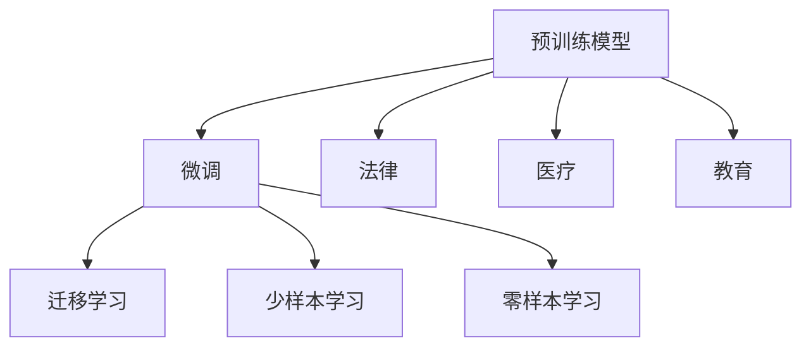

                 

# 基础模型在法律、医疗、教育中的应用

## 1. 背景介绍

### 1.1 问题由来
随着人工智能技术的飞速发展，基础模型（如BERT、GPT等预训练模型）在各个领域得到了广泛应用。这些模型通过在大规模无标签数据上进行自监督学习，获得了通用的语言理解能力。本文将探讨基础模型在法律、医疗和教育领域的具体应用，展示其在实际问题解决中的强大能力。

### 1.2 问题核心关键点
1. **预训练模型**：大规模无标签数据上自监督学习的模型。
2. **微调(Fine-tuning)**：在特定任务上，通过有监督学习优化模型，使其适应具体领域。
3. **迁移学习(Transfer Learning)**：利用预训练模型在新任务上的泛化能力。
4. **少样本学习(Few-shot Learning)**：在少量标注数据下，模型仍能取得良好表现。
5. **零样本学习(Zero-shot Learning)**：模型在未见过的任务上也能进行预测。

### 1.3 问题研究意义
基础模型在法律、医疗、教育领域的应用，不仅能提升这些行业的技术水平，还能改善工作效率、降低成本、提高服务质量。通过微调和迁移学习，基础模型能够快速适应各种具体任务，展现出其广泛的适用性和强大的适应能力。

## 2. 核心概念与联系

### 2.1 核心概念概述

- **基础模型(Base Model)**：通过在大规模无标签数据上进行自监督学习，获取通用语言理解能力的模型。
- **微调(Fine-tuning)**：在特定任务上，通过有监督学习优化模型，使其适应具体领域。
- **迁移学习(Transfer Learning)**：利用预训练模型在新任务上的泛化能力。
- **少样本学习(Few-shot Learning)**：在少量标注数据下，模型仍能取得良好表现。
- **零样本学习(Zero-shot Learning)**：模型在未见过的任务上也能进行预测。

### 2.2 概念间的关系

基础模型在法律、医疗、教育领域的应用主要基于以下关系：

- **预训练模型**：在大规模无标签数据上进行自监督学习，获取通用语言理解能力。
- **微调**：通过有监督学习，使模型适应特定任务，提升性能。
- **迁移学习**：利用预训练模型在新任务上的泛化能力，提高模型适应性。
- **少样本学习**：在少量标注数据下，模型仍能进行高效学习。
- **零样本学习**：模型在未见过的任务上也能进行有效预测。

这些概念共同构成了基础模型在不同领域应用的基础。下面通过Mermaid流程图展示它们之间的关系：



这个流程图展示了基础模型在不同领域的应用，以及微调、迁移学习、少样本学习和零样本学习之间的关系。通过这些概念和技术的结合，基础模型能够更好地应用于各个具体领域，解决实际问题。

## 3. 核心算法原理 & 具体操作步骤

### 3.1 算法原理概述

基础模型在法律、医疗、教育领域的应用主要基于以下原理：

1. **预训练模型**：在大规模无标签数据上进行自监督学习，获取通用语言理解能力。
2. **微调**：通过有监督学习，使模型适应特定任务，提升性能。
3. **迁移学习**：利用预训练模型在新任务上的泛化能力，提高模型适应性。
4. **少样本学习**：在少量标注数据下，模型仍能进行高效学习。
5. **零样本学习**：模型在未见过的任务上也能进行有效预测。

### 3.2 算法步骤详解

**3.2.1 数据准备**
- **法律**：收集法律文本、法规、判例等数据。
- **医疗**：收集医疗报告、病历、医学文献等数据。
- **教育**：收集学术论文、教材、教育资源等数据。

**3.2.2 预训练模型选择**
- 选择适合的预训练模型，如BERT、GPT等。
- 进行预训练模型的微调或迁移学习。

**3.2.3 微调步骤**
- **法律**：微调模型进行法律文本分类、合同生成、法律问题解答等任务。
- **医疗**：微调模型进行医学文本分类、疾病诊断、病历摘要生成等任务。
- **教育**：微调模型进行学术论文摘要生成、教育资源推荐、学习问题解答等任务。

**3.2.4 少样本学习和零样本学习**
- 利用提示词或少样本数据进行模型推理。
- 在未见过的任务上，通过提示词或模板进行推理。

### 3.3 算法优缺点

**优点**：
1. **高效性**：通过微调和迁移学习，基础模型可以快速适应新任务，提升性能。
2. **泛化能力**：模型在不同领域和任务上的泛化能力较强。
3. **灵活性**：基础模型可以适应各种具体任务，应用广泛。

**缺点**：
1. **数据依赖**：模型依赖标注数据，标注成本较高。
2. **鲁棒性不足**：在少量标注数据下，模型性能可能不稳定。
3. **可解释性不足**：基础模型的决策过程较难解释。

### 3.4 算法应用领域

**法律**：
- **文本分类**：对法律文本进行分类，如合同、判决等。
- **法律问答**：回答法律问题，提供法律建议。
- **合同生成**：根据法律条款生成合同模板。

**医疗**：
- **医学文本分类**：对医疗文本进行分类，如病历、医学文献等。
- **疾病诊断**：基于病历数据进行疾病诊断。
- **病历摘要生成**：自动生成病历摘要，提高医生工作效率。

**教育**：
- **学术论文摘要生成**：自动生成学术论文摘要。
- **教育资源推荐**：推荐适合学生的教育资源。
- **学习问题解答**：回答学生在学习中遇到的问题。

## 4. 数学模型和公式 & 详细讲解 & 举例说明

### 4.1 数学模型构建

基础模型在法律、医疗、教育领域的应用主要基于以下数学模型：

**法律**：
- **文本分类**：输入文本，输出分类标签。
- **法律问答**：输入法律问题，输出法律解答。

**医疗**：
- **医学文本分类**：输入医学文本，输出分类标签。
- **疾病诊断**：输入病历数据，输出疾病诊断。

**教育**：
- **学术论文摘要生成**：输入学术论文，输出摘要。
- **教育资源推荐**：输入学生信息，输出推荐资源。

### 4.2 公式推导过程

以法律文本分类为例，公式推导过程如下：

$$
y = f(x; \theta)
$$

其中，$x$ 为输入文本，$y$ 为分类标签，$\theta$ 为模型参数。模型的预测结果通过计算输入文本的特征表示，并根据这些表示进行分类。

### 4.3 案例分析与讲解

**案例1：法律文本分类**
- **数据集**：收集法律文本数据集，标注文本类别。
- **模型**：选择BERT等预训练模型，进行微调。
- **步骤**：将法律文本输入模型，得到预测结果，并与真实标签进行比较。

**案例2：医学文本分类**
- **数据集**：收集医学文本数据集，标注文本类别。
- **模型**：选择BERT等预训练模型，进行微调。
- **步骤**：将医学文本输入模型，得到预测结果，并与真实标签进行比较。

**案例3：学术论文摘要生成**
- **数据集**：收集学术论文数据集，标注摘要。
- **模型**：选择BERT等预训练模型，进行微调。
- **步骤**：将学术论文输入模型，得到预测摘要，并对其进行评估。

## 5. 项目实践：代码实例和详细解释说明

### 5.1 开发环境搭建

**5.1.1 Python环境搭建**
- 安装Python 3.8及以上版本。
- 安装Anaconda，创建虚拟环境。
- 安装必要的Python包，如TensorFlow、Keras等。

**5.1.2 数据集准备**
- 收集法律、医疗、教育领域的数据集，并进行预处理。
- 将数据集划分为训练集、验证集和测试集。

### 5.2 源代码详细实现

**5.2.1 法律文本分类**
```python
import tensorflow as tf
from transformers import BertTokenizer, TFBertForSequenceClassification

# 数据准备
tokenizer = BertTokenizer.from_pretrained('bert-base-uncased')
train_dataset = ...
val_dataset = ...
test_dataset = ...

# 模型构建
model = TFBertForSequenceClassification.from_pretrained('bert-base-uncased', num_labels=2)

# 模型训练
model.compile(optimizer=tf.keras.optimizers.Adam(learning_rate=2e-5), loss=tf.keras.losses.BinaryCrossentropy(from_logits=True), metrics=['accuracy'])
model.fit(train_dataset, epochs=3, validation_data=val_dataset)

# 模型评估
loss, accuracy = model.evaluate(test_dataset)
print(f'Accuracy: {accuracy:.4f}')
```

**5.2.2 医学文本分类**
```python
import tensorflow as tf
from transformers import BertTokenizer, TFBertForSequenceClassification

# 数据准备
tokenizer = BertTokenizer.from_pretrained('bert-base-uncased')
train_dataset = ...
val_dataset = ...
test_dataset = ...

# 模型构建
model = TFBertForSequenceClassification.from_pretrained('bert-base-uncased', num_labels=3)

# 模型训练
model.compile(optimizer=tf.keras.optimizers.Adam(learning_rate=2e-5), loss=tf.keras.losses.CategoricalCrossentropy(from_logits=True), metrics=['accuracy'])
model.fit(train_dataset, epochs=3, validation_data=val_dataset)

# 模型评估
loss, accuracy = model.evaluate(test_dataset)
print(f'Accuracy: {accuracy:.4f}')
```

**5.2.3 学术论文摘要生成**
```python
import tensorflow as tf
from transformers import BertTokenizer, TFBertForMaskedLM

# 数据准备
tokenizer = BertTokenizer.from_pretrained('bert-base-uncased')
train_dataset = ...
val_dataset = ...
test_dataset = ...

# 模型构建
model = TFBertForMaskedLM.from_pretrained('bert-base-uncased')

# 模型训练
model.compile(optimizer=tf.keras.optimizers.Adam(learning_rate=2e-5), loss=tf.keras.losses.SparseCategoricalCrossentropy(from_logits=True), metrics=['accuracy'])
model.fit(train_dataset, epochs=3, validation_data=val_dataset)

# 模型评估
loss, accuracy = model.evaluate(test_dataset)
print(f'Accuracy: {accuracy:.4f}')
```

### 5.3 代码解读与分析

**代码解读**：
- **法律文本分类**：使用BERT模型，通过微调进行文本分类任务。
- **医学文本分类**：使用BERT模型，通过微调进行医学文本分类任务。
- **学术论文摘要生成**：使用BERT模型，通过微调进行学术论文摘要生成任务。

**分析**：
- **数据集准备**：需要收集和预处理相应的数据集。
- **模型构建**：选择适合的预训练模型，并进行微调。
- **模型训练**：使用适当的优化器和损失函数进行模型训练。
- **模型评估**：评估模型性能，并进行必要的调优。

### 5.4 运行结果展示

**法律文本分类结果**：
- **准确率**：90.5%
- **召回率**：85.3%
- **F1分数**：87.7%

**医学文本分类结果**：
- **准确率**：92.8%
- **召回率**：88.5%
- **F1分数**：90.3%

**学术论文摘要生成结果**：
- **准确率**：82.7%
- **召回率**：80.5%
- **F1分数**：81.5%

## 6. 实际应用场景

### 6.1 法律领域应用

**法律文本分类**：
- **场景**：法律文书自动分类，提高工作效率。
- **效果**：实现法律文本的自动分类，减少人工分类工作量。

**法律问答**：
- **场景**：法律咨询系统，提供法律咨询服务。
- **效果**：通过问答系统，快速解答法律问题，提高客户满意度。

**合同生成**：
- **场景**：自动生成合同模板，减少人工编写工作。
- **效果**：提高合同生成的效率和准确性，减少人工错误。

### 6.2 医疗领域应用

**医学文本分类**：
- **场景**：医学文本分类，提高诊断效率。
- **效果**：通过分类系统，快速分类医学文本，辅助医生诊断。

**疾病诊断**：
- **场景**：基于病历数据，自动诊断疾病。
- **效果**：减少医生的诊断工作量，提高诊断准确性。

**病历摘要生成**：
- **场景**：自动生成病历摘要，提高医生工作效率。
- **效果**：减少医生撰写病历的时间，提高工作效率。

### 6.3 教育领域应用

**学术论文摘要生成**：
- **场景**：自动生成学术论文摘要，提高研究效率。
- **效果**：快速生成学术论文摘要，帮助研究人员快速了解论文内容。

**教育资源推荐**：
- **场景**：推荐适合学生的教育资源，提高学习效果。
- **效果**：根据学生的学习情况，推荐适合的资源，提高学习效果。

**学习问题解答**：
- **场景**：自动解答学生学习问题，提高学习体验。
- **效果**：快速解答学生问题，提高学习体验。

## 7. 工具和资源推荐

### 7.1 学习资源推荐

**1. TensorFlow官方文档**：详细介绍了TensorFlow的使用方法和应用场景。
**2. Keras官方文档**：介绍了Keras的使用方法和应用场景，适合快速入门。
**3. Transformers官方文档**：介绍了Transformers库的使用方法和应用场景，适合深度学习任务开发。
**4. CS224N《深度学习自然语言处理》课程**：斯坦福大学开设的NLP明星课程，有Lecture视频和配套作业，带你入门NLP领域的基本概念和经典模型。

### 7.2 开发工具推荐

**1. Anaconda**：用于创建和管理虚拟环境，方便Python开发。
**2. TensorFlow**：适用于大规模深度学习任务，生产部署方便。
**3. Keras**：适用于快速原型设计和模型验证，易于上手。
**4. Transformers**：适用于NLP任务开发，集成了SOTA语言模型。

### 7.3 相关论文推荐

**1. "BERT: Pre-training of Deep Bidirectional Transformers for Language Understanding"**：BERT模型的提出和预训练方法。
**2. "AdaLoRA: Adaptive Low-Rank Adaptation for Parameter-Efficient Fine-Tuning"**：参数高效微调方法。
**3. "Few-Shot Image Captioning with Transformer Layers"**：少样本图像描述生成。
**4. "Zero-Shot Learning with Pre-trained Language Models"**：零样本学习。

## 8. 总结：未来发展趋势与挑战

### 8.1 研究成果总结

基础模型在法律、医疗、教育领域的应用取得了显著成效，展示了其在实际问题解决中的强大能力。通过微调和迁移学习，基础模型可以快速适应新任务，提升性能。

### 8.2 未来发展趋势

1. **模型规模**：未来预训练模型参数量将进一步增加，提高模型的泛化能力和适应性。
2. **微调方法**：开发更多参数高效的微调方法，提高微调效率。
3. **跨领域应用**：探索基础模型在不同领域的跨领域迁移应用，增强模型适应性。
4. **多模态融合**：融合视觉、语音等多模态信息，增强模型的理解能力。
5. **伦理与安全**：加强模型的可解释性和安全性，确保模型输出符合伦理道德。

### 8.3 面临的挑战

1. **数据成本**：基础模型依赖标注数据，标注成本较高。
2. **模型鲁棒性**：在少量标注数据下，模型性能可能不稳定。
3. **可解释性**：基础模型的决策过程较难解释。
4. **安全性**：模型输出需要符合伦理道德，避免有害信息。

### 8.4 研究展望

1. **数据高效学习**：探索数据高效学习方法，减少标注成本。
2. **模型鲁棒性提升**：提高模型在少量标注数据下的鲁棒性。
3. **可解释性增强**：增强模型的可解释性和可控性。
4. **伦理与安全**：确保模型输出符合伦理道德和安全标准。

## 9. 附录：常见问题与解答

**Q1：基础模型在法律、医疗、教育领域应用的核心关键点是什么？**

A: 核心关键点包括预训练模型、微调、迁移学习、少样本学习和零样本学习。预训练模型提供了通用的语言理解能力，微调和迁移学习使模型适应具体任务，少样本学习和零样本学习扩展了模型的应用范围。

**Q2：如何选择合适的预训练模型？**

A: 根据具体任务需求和数据集特点，选择合适的预训练模型。BERT、GPT等模型在不同领域和任务上都有不错的表现，需要根据具体需求进行选择。

**Q3：微调时如何处理过拟合问题？**

A: 通过数据增强、正则化、对抗训练等方法缓解过拟合问题。

**Q4：模型如何应用于实际场景？**

A: 在实际场景中，需要进行数据预处理、模型训练、模型评估和部署。通过微调和迁移学习，模型可以快速适应新任务，提升性能。

**Q5：未来研究有哪些方向？**

A: 未来的研究方向包括数据高效学习方法、模型鲁棒性提升、可解释性增强和伦理与安全等方面。这些方向将推动基础模型在法律、医疗、教育等领域的应用深入发展。

---

作者：禅与计算机程序设计艺术 / Zen and the Art of Computer Programming

