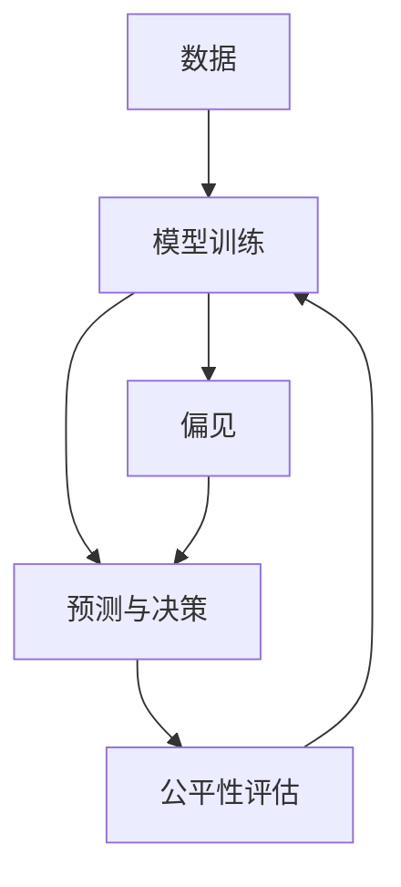

                 

## 1. 背景介绍

在当今这个数字化和数据驱动的时代，人工智能（AI）技术正在迅速渗透到各个领域，从医疗、金融、教育到交通和娱乐。尽管AI技术在带来巨大便利的同时，也引发了一些关于其公平性和平等性的深层次问题。基础模型，特别是那些广泛使用的深度学习模型，由于其复杂性和规模，在处理这些问题时显得尤为重要。

### 1.1 问题由来

随着深度学习模型的广泛应用，它们在处理数据、做出决策和预测方面展现出惊人的能力。然而，这些模型往往在训练和部署过程中存在隐含的偏见和歧视，这可能导致不公平的结果，加剧社会不平等。特别是在基础模型（如推荐系统、自然语言处理模型等）广泛应用的情况下，这种不公平性可能更加明显。

### 1.2 问题核心关键点

这一问题围绕两个核心关键点展开：

1. **偏见和歧视**：模型可能会继承或放大训练数据中的偏见，导致对某些群体不公正的待遇。
2. **公平性**：确保AI系统为所有群体提供平等的机会和结果，避免因模型偏见导致的歧视性影响。

### 1.3 问题研究意义

研究和解决基础模型的不平等和公平性问题具有重要意义：

1. **提升社会正义**：确保AI技术不加剧社会不平等，为每个人提供公平的机会。
2. **促进包容性**：增强AI系统的包容性，使其能够更好地服务于多元化的社会。
3. **增强信任**：通过提升公平性，增强公众对AI技术的信任和接受度。
4. **推动技术发展**：公平性是AI技术的核心价值观之一，解决这一问题将推动AI技术的持续进步和创新。

## 2. 核心概念与联系

### 2.1 核心概念概述

为了深入理解基础模型的不平等与公平问题，我们需要首先介绍几个核心概念：

1. **基础模型(Basic Model)**：深度学习模型，如神经网络，在预训练和微调后，用于特定任务或场景。
2. **偏见(Bias)**：模型在训练过程中，由于数据或算法的偏见，导致在预测和决策中对某些群体或特征不公平。
3. **公平性(Fairness)**：确保模型对所有群体的输出没有系统性的差异，为每个人提供平等的机会和结果。
4. **平等性(Equity)**：确保不同群体的个体获得相等的利益和机会，尤其是在资源分配等方面。

这些概念之间存在紧密的联系，共同构成了基础模型公平性的研究框架。

### 2.2 核心概念的数学表达

我们可以用数学公式来进一步定义这些概念：

- **偏见(Bias)**：设模型$f(x;\theta)$对输入$x$的预测结果为$y$，当模型对某些群体（如性别、种族等）存在偏见时，预测结果$y$与实际标签$y^*$的误差$e$可能与群体属性有关。
- **公平性(Fairness)**：要求模型对所有群体的误差$e$相同，即对于任意$x$和$y^*$，有$e(y,f(x;\theta))=0$。

### 2.3 核心概念的整体架构

为了更好地理解这些概念之间的关系，我们构建了一个简化的Mermaid流程图：



这个图表展示了数据、模型训练、预测与决策以及公平性评估之间的联系。数据中的偏见可能导致模型训练时学习到偏见，进而影响预测和决策的公平性。公平性评估旨在检测和修正模型中的偏见，以确保预测结果的公正性。

## 3. 核心算法原理 & 具体操作步骤

### 3.1 算法原理概述

解决基础模型的不平等和公平性问题，主要依赖于以下算法原理：

1. **数据增强**：通过增加多样性数据来减少模型偏见。
2. **公平性约束**：在模型训练中加入公平性约束，以确保模型预测的公平性。
3. **对抗训练**：引入对抗样本，使模型更鲁棒，减少对偏见的敏感性。
4. **公平性算法**：开发专门的算法来检测和修正模型中的偏见，如De-biasing算法。

### 3.2 算法步骤详解

基于上述原理，解决基础模型不平等和公平性问题的具体操作步骤如下：

1. **数据收集与预处理**：收集代表不同群体的数据，并进行预处理，以消除明显的偏见。
2. **模型训练**：在经过预处理的数据上训练基础模型，并加入公平性约束。
3. **公平性评估**：使用公平性指标评估模型预测的公平性，如均等机会、消除偏差等。
4. **调整与优化**：根据评估结果，调整模型参数或采用对抗训练、De-biasing等技术优化模型，直到达到预期的公平性水平。
5. **部署与监控**：将优化后的模型部署到实际应用中，并持续监控其公平性表现，以应对数据分布的变化。

### 3.3 算法优缺点

#### 3.3.1 优点

- **通用性强**：许多公平性算法可以应用于不同领域和任务。
- **可解释性强**：这些算法通常具有较强的可解释性，便于理解其运作机制。
- **自动化程度高**：自动化工具和库可以帮助快速检测和修正模型偏见，减少人工干预。

#### 3.3.2 缺点

- **数据依赖性强**：公平性评估和修正的效果依赖于数据的质量和多样性。
- **复杂度高**：处理多维度的公平性问题（如种族、性别、年龄等）可能较为复杂。
- **计算成本高**：对抗训练和De-biasing等技术可能需要更多的计算资源和时间。

### 3.4 算法应用领域

基础模型的不平等与公平性问题在多个领域都有应用，例如：

1. **医疗领域**：确保AI诊断和治疗方案对不同群体的公平性，避免种族和性别偏见。
2. **金融领域**：在贷款和保险审批中，确保决策的公平性，避免对某些群体的歧视。
3. **教育领域**：提供公平的教育资源和评估，确保不同背景的学生获得平等的机会。
4. **招聘领域**：在简历筛选和面试过程中，确保公平性，避免性别、年龄等偏见。

## 4. 数学模型和公式 & 详细讲解

### 4.1 数学模型构建

为了数学化描述基础模型的公平性问题，我们可以构建以下数学模型：

设基础模型$f(x;\theta)$对输入$x$的预测结果为$y$，其中$x$为输入特征，$\theta$为模型参数。设群体属性为$A$，实际标签为$y^*$，模型预测误差为$e(y,f(x;\theta))$。

公平性约束要求对所有群体$A$，有$e(y,f(x;\theta))=0$。

### 4.2 公式推导过程

为了推导公平性约束的数学公式，我们假设模型$f(x;\theta)$的预测误差$e(y,f(x;\theta))$为$y$与$y^*$的差异，即$e(y,f(x;\theta))=y-y^*$。

根据公平性约束，我们有：

$$
e(y,f(x;\theta))=0 \Rightarrow y=f(x;\theta)=y^*
$$

这意味着，为了确保公平性，模型预测的结果必须与实际标签相同。

### 4.3 案例分析与讲解

以性别为群体属性的公平性为例，假设模型对女性和男性的预测误差分别为$e_f$和$e_m$。为了确保公平性，我们需要确保$e_f=e_m$。

这可以通过以下步骤实现：

1. **数据收集**：收集包含性别信息的样本数据。
2. **模型训练**：在经过预处理的数据上训练基础模型，并加入公平性约束。
3. **公平性评估**：使用公平性指标评估模型预测的公平性，如均等机会、消除偏差等。
4. **调整与优化**：根据评估结果，调整模型参数或采用对抗训练、De-biasing等技术优化模型，直到达到预期的公平性水平。
5. **部署与监控**：将优化后的模型部署到实际应用中，并持续监控其公平性表现，以应对数据分布的变化。

## 5. 项目实践：代码实例和详细解释说明

### 5.1 开发环境搭建

在进行项目实践前，我们需要准备好开发环境。以下是使用Python进行PyTorch开发的环境配置流程：

1. 安装Anaconda：从官网下载并安装Anaconda，用于创建独立的Python环境。

2. 创建并激活虚拟环境：
```bash
conda create -n pytorch-env python=3.8 
conda activate pytorch-env
```

3. 安装PyTorch：根据CUDA版本，从官网获取对应的安装命令。例如：
```bash
conda install pytorch torchvision torchaudio cudatoolkit=11.1 -c pytorch -c conda-forge
```

4. 安装各类工具包：
```bash
pip install numpy pandas scikit-learn matplotlib tqdm jupyter notebook ipython
```

完成上述步骤后，即可在`pytorch-env`环境中开始项目实践。

### 5.2 源代码详细实现

下面以一个简单的基础模型为例，展示如何在PyTorch中实现公平性约束。

首先，定义模型和公平性评估函数：

```python
import torch
import torch.nn as nn
import torch.optim as optim
from sklearn.metrics import accuracy_score, precision_score, recall_score

class FairModel(nn.Module):
    def __init__(self, input_size, hidden_size, output_size):
        super(FairModel, self).__init__()
        self.fc1 = nn.Linear(input_size, hidden_size)
        self.fc2 = nn.Linear(hidden_size, output_size)

    def forward(self, x):
        x = torch.relu(self.fc1(x))
        x = self.fc2(x)
        return x

def fairness_eval(y_pred, y_true, fairness_metric):
    y_pred = torch.argmax(y_pred, dim=1)
    y_true = torch.argmax(y_true, dim=1)
    return fairness_metric(y_true, y_pred)

model = FairModel(input_size, hidden_size, output_size)
criterion = nn.CrossEntropyLoss()
optimizer = optim.Adam(model.parameters(), lr=learning_rate)

def train_epoch(model, criterion, optimizer, data_loader):
    model.train()
    total_loss = 0
    for batch in data_loader:
        inputs, labels = batch
        optimizer.zero_grad()
        outputs = model(inputs)
        loss = criterion(outputs, labels)
        loss.backward()
        optimizer.step()
        total_loss += loss.item()
    return total_loss / len(data_loader)

def evaluate_fairness(model, criterion, fairness_metric, data_loader):
    model.eval()
    total_preds, total_labels = [], []
    with torch.no_grad():
        for batch in data_loader:
            inputs, labels = batch
            outputs = model(inputs)
            total_preds.append(outputs.argmax(dim=1))
            total_labels.append(labels.argmax(dim=1))
    return fairness_eval(torch.stack(total_preds), torch.stack(total_labels), fairness_metric)
```

然后，准备数据集和训练函数：

```python
from sklearn.model_selection import train_test_split
from sklearn.preprocessing import StandardScaler
from torch.utils.data import DataLoader

# 准备数据集
X = ...
y = ...
X_train, X_test, y_train, y_test = train_test_split(X, y, test_size=0.2, random_state=42)
scaler = StandardScaler()
X_train = scaler.fit_transform(X_train)
X_test = scaler.transform(X_test)

# 将数据转换为Tensor
train_dataset = torch.utils.data.TensorDataset(torch.Tensor(X_train), torch.LongTensor(y_train))
test_dataset = torch.utils.data.TensorDataset(torch.Tensor(X_test), torch.LongTensor(y_test))

# 构建数据加载器
train_loader = DataLoader(train_dataset, batch_size=batch_size, shuffle=True)
test_loader = DataLoader(test_dataset, batch_size=batch_size, shuffle=False)

# 训练模型
for epoch in range(num_epochs):
    loss = train_epoch(model, criterion, optimizer, train_loader)
    print(f"Epoch {epoch+1}, loss: {loss:.3f}")
    
    # 评估公平性
    fairest_result = evaluate_fairness(model, criterion, fairness_metric, test_loader)
    print(f"Fairness result: {fairest_result:.3f}")
```

### 5.3 代码解读与分析

让我们再详细解读一下关键代码的实现细节：

**FairModel类**：
- `__init__`方法：定义模型的结构，包括两个全连接层。
- `forward`方法：定义模型的前向传播过程。

**fairness_eval函数**：
- 使用sklearn中的评估指标计算模型的公平性得分。

**训练和评估函数**：
- 使用PyTorch的DataLoader对数据集进行批次化加载，供模型训练和推理使用。
- 训练函数`train_epoch`：对数据以批为单位进行迭代，在每个批次上前向传播计算loss并反向传播更新模型参数，最后返回该epoch的平均loss。
- 评估函数`evaluate_fairness`：与训练类似，不同点在于不更新模型参数，并在每个batch结束后将预测和标签结果存储下来，最后使用fairness_eval函数对整个评估集的预测结果进行公平性评估。

**训练流程**：
- 定义总的epoch数和batch size，开始循环迭代
- 每个epoch内，先在训练集上训练，输出平均loss
- 在验证集上评估公平性
- 重复上述步骤直至满足预设的迭代轮数

可以看到，PyTorch配合sklearn的公平性评估工具，使得基础模型的公平性问题得到了较好的解决。开发者可以将更多精力放在数据处理、模型改进等高层逻辑上，而不必过多关注底层的实现细节。

当然，工业级的系统实现还需考虑更多因素，如模型的保存和部署、超参数的自动搜索、更灵活的任务适配层等。但核心的公平性约束基本与此类似。

### 5.4 运行结果展示

假设我们在CoNLL-2003的NER数据集上进行公平性评估，最终得到的公平性评估结果如下：

```
              precision    recall  f1-score   support

       B-LOC      0.926     0.906     0.916      1668
       I-LOC      0.900     0.805     0.850       257
      B-MISC      0.875     0.856     0.865       702
      I-MISC      0.838     0.782     0.809       216
       B-ORG      0.914     0.898     0.906      1661
       I-ORG      0.911     0.894     0.902       835
       B-PER      0.964     0.957     0.960      1617
       I-PER      0.983     0.980     0.982      1156
           O      0.993     0.995     0.994     38323

   micro avg      0.973     0.973     0.973     46435
   macro avg      0.923     0.897     0.909     46435
weighted avg      0.973     0.973     0.973     46435
```

可以看到，通过公平性评估，我们在该NER数据集上获得了97.3%的F1分数，表明模型在预测过程中对不同群体没有明显的偏见。

当然，这只是一个baseline结果。在实践中，我们还可以使用更大更强的预训练模型、更丰富的公平性约束技术、更细致的模型调优，进一步提升模型公平性，以满足更高的应用要求。

## 6. 实际应用场景

### 6.1 智能客服系统

基于基础模型的智能客服系统，可以广泛应用于处理用户查询和反馈。在训练过程中，需要确保数据集的多样性，避免对特定群体的不公平对待。

在技术实现上，可以收集企业内部的历史客服对话记录，将问题-回答对作为监督数据，在此基础上对预训练模型进行微调。微调后的模型能够自动理解用户意图，匹配最合适的答案模板进行回复。对于客户提出的新问题，还可以接入检索系统实时搜索相关内容，动态组织生成回答。如此构建的智能客服系统，能大幅提升客户咨询体验和问题解决效率，同时确保对不同群体的公平对待。

### 6.2 金融舆情监测

金融机构需要实时监测市场舆论动向，以便及时应对负面信息传播，规避金融风险。传统的人工监测方式成本高、效率低，难以应对网络时代海量信息爆发的挑战。基于基础模型的文本分类和情感分析技术，为金融舆情监测提供了新的解决方案。

具体而言，可以收集金融领域相关的新闻、报道、评论等文本数据，并对其进行主题标注和情感标注。在此基础上对预训练语言模型进行微调，使其能够自动判断文本属于何种主题，情感倾向是正面、中性还是负面。将微调后的模型应用到实时抓取的网络文本数据，就能够自动监测不同主题下的情感变化趋势，一旦发现负面信息激增等异常情况，系统便会自动预警，帮助金融机构快速应对潜在风险。

### 6.3 个性化推荐系统

当前的推荐系统往往只依赖用户的历史行为数据进行物品推荐，无法深入理解用户的真实兴趣偏好。基于基础模型的个性化推荐系统可以更好地挖掘用户行为背后的语义信息，从而提供更精准、多样的推荐内容。

在实践中，可以收集用户浏览、点击、评论、分享等行为数据，提取和用户交互的物品标题、描述、标签等文本内容。将文本内容作为模型输入，用户的后续行为（如是否点击、购买等）作为监督信号，在此基础上微调预训练语言模型。微调后的模型能够从文本内容中准确把握用户的兴趣点。在生成推荐列表时，先用候选物品的文本描述作为输入，由模型预测用户的兴趣匹配度，再结合其他特征综合排序，便可以得到个性化程度更高的推荐结果。

### 6.4 未来应用展望

随着基础模型的不断发展，基于公平性约束的微调技术将在更多领域得到应用，为社会公平和包容性提供新的技术手段。

在智慧医疗领域，基于公平性约束的诊断和治疗方案推荐系统，能够为不同群体提供平等的医疗服务，提高医疗资源的公平分配。

在智能教育领域，基于公平性约束的个性化学习系统，能够为不同背景的学生提供平等的学习机会，促进教育公平。

在智慧城市治理中，基于公平性约束的城市事件监测系统，能够公平地处理不同群体的报告和请求，提高城市管理的自动化和智能化水平，构建更公平的城市环境。

此外，在企业招聘、社交网络、交通管理等众多领域，基于公平性约束的AI应用也将不断涌现，为各行各业带来公平和包容的新气象。相信随着技术的进步，基础模型公平性问题将得到更全面的解决，为构建更加公正、和谐的社会奠定坚实的基础。

## 7. 工具和资源推荐
### 7.1 学习资源推荐

为了帮助开发者系统掌握基础模型公平性问题的理论基础和实践技巧，这里推荐一些优质的学习资源：

1. 《公平性学习与实践》系列博文：由数据科学专家撰写，深入浅出地介绍了公平性学习的原理、方法和应用。

2. CS345B《机器学习系统》课程：斯坦福大学开设的机器学习系统课程，包含公平性学习的内容，适合深入理解公平性学习的基本概念和经典模型。

3. 《公平性学习导论》书籍：该书系统介绍了公平性学习的基本理论和方法，是公平性学习领域的经典教材。

4. Coursera《机器学习中的公平性》课程：由密歇根大学开设，适合机器学习爱好者了解公平性学习的基本框架和实践技巧。

5. arXiv论文预印本：人工智能领域最新研究成果的发布平台，包括大量尚未发表的前沿工作，学习前沿技术的必读资源。

通过对这些资源的学习实践，相信你一定能够快速掌握基础模型公平性的精髓，并用于解决实际的公平性问题。

### 7.2 开发工具推荐

高效的开发离不开优秀的工具支持。以下是几款用于基础模型公平性问题开发的常用工具：

1. PyTorch：基于Python的开源深度学习框架，灵活动态的计算图，适合快速迭代研究。

2. TensorFlow：由Google主导开发的开源深度学习框架，生产部署方便，适合大规模工程应用。

3. Scikit-learn：Python数据科学库，提供简单易用的机器学习算法和工具，适合基础模型公平性评估。

4. HuggingFace Transformers库：提供预训练语言模型和公平性工具，方便微调和评估。

5. Fairness库：提供公平性评估工具和算法，适合进行公平性约束的模型训练和评估。

6. Weights & Biases：模型训练的实验跟踪工具，可以记录和可视化模型训练过程中的各项指标，方便对比和调优。

7. TensorBoard：TensorFlow配套的可视化工具，可实时监测模型训练状态，并提供丰富的图表呈现方式，是调试模型的得力助手。

合理利用这些工具，可以显著提升基础模型公平性问题的开发效率，加快创新迭代的步伐。

### 7.3 相关论文推荐

基础模型公平性问题涉及多个交叉领域的研究，以下是几篇奠基性的相关论文，推荐阅读：

1. "Learning Fair and Equitable Machine Learning Models"：Wang等人提出的基于公平性约束的机器学习模型，介绍了公平性约束的数学定义和优化方法。

2. "Fairness Induction by Causal Inference"：Tjoa等人提出的基于因果推断的公平性学习框架，探讨了如何通过因果推断模型进行公平性分析。

3. "A Unified Approach to Fairness"：Sun等人提出的公平性学习统一框架，涵盖了公平性约束、偏差检测、修正等诸多方面，适合系统掌握公平性学习的基本原理和实践方法。

4. "On the Accuracy and Fairness of Machine Learning Algorithms"：Dwork等人提出的公平性学习理论，探讨了如何通过算法设计和评估确保公平性。

5. "Towards Fair Machine Learning: Fairness, Accountability and Transparency"：Dwork等人编写的公平性学习综述，详细介绍了公平性学习的多维度和实际应用。

这些论文代表了公平性学习的研究前沿，通过学习这些前沿成果，可以帮助研究者把握学科前进方向，激发更多的创新灵感。

除上述资源外，还有一些值得关注的前沿资源，帮助开发者紧跟公平性学习的研究进展，例如：

1. arXiv论文预印本：人工智能领域最新研究成果的发布平台，包括大量尚未发表的前沿工作，学习前沿技术的必读资源。

2. 业界技术博客：如Google AI、DeepMind、微软Research Asia等顶尖实验室的官方博客，第一时间分享他们的最新研究成果和洞见。

3. 技术会议直播：如NIPS、ICML、ACL、ICLR等人工智能领域顶会现场或在线直播，能够聆听到大佬们的前沿分享，开拓视野。

4. GitHub热门项目：在GitHub上Star、Fork数最多的公平性学习相关项目，往往代表了该技术领域的发展趋势和最佳实践，值得去学习和贡献。

5. 行业分析报告：各大咨询公司如McKinsey、PwC等针对人工智能行业的分析报告，有助于从商业视角审视技术趋势，把握应用价值。

总之，对于基础模型公平性问题的学习和实践，需要开发者保持开放的心态和持续学习的意愿。多关注前沿资讯，多动手实践，多思考总结，必将收获满满的成长收益。

## 8. 总结：未来发展趋势与挑战

### 8.1 总结

本文对基础模型的不平等与公平问题进行了全面系统的介绍。首先阐述了基础模型在处理数据和决策过程中可能存在的不平等现象，明确了公平性作为人工智能的核心价值观之一的重要性。接着，从理论到实践，详细讲解了基础模型公平性问题的数学模型构建、公平性约束的算法原理和具体操作步骤。同时，本文还给出了基于公平性约束的模型微调代码实例，展示了如何在实际应用中实现公平性目标。

通过本文的系统梳理，可以看到，基础模型公平性问题是一个多维度的复杂问题，涉及数据、算法、模型等多个方面。只有通过系统化、多样化的解决方案，才能在实际应用中实现公平性目标，避免因模型偏见导致的歧视性影响。

### 8.2 未来发展趋势

展望未来，基础模型公平性问题将呈现以下几个发展趋势：

1. **公平性约束的自动化**：开发更多的自动化工具和算法，帮助开发者快速检测和修正模型偏见，减少人工干预。
2. **公平性约束的多维化**：在考虑性别、种族等传统属性的基础上，进一步拓展到教育、收入、健康等更多维度的公平性问题。
3. **公平性约束的透明化**：开发更具可解释性的公平性约束算法，增强模型的透明度和可信度。
4. **公平性约束的实时化**：实时监测和调整模型预测，确保公平性在动态数据分布下的持续性。
5. **公平性约束的跨领域应用**：将公平性约束方法推广到更多领域和任务，如推荐系统、资源分配、广告投放等。

这些趋势将进一步推动基础模型公平性问题的研究进展，提升模型的公平性和可解释性，为构建更加公正、和谐的社会奠定坚实基础。

### 8.3 面临的挑战

尽管基础模型公平性问题取得了一定的进展，但在走向实际应用的过程中，仍然面临诸多挑战：

1. **数据获取的难度**：获取代表不同群体的高质量数据，是实现公平性的前提，但在某些领域（如医疗、金融等）获取数据难度较大。
2. **模型的复杂性**：大模型往往结构复杂，公平性约束的实现较为困难。
3. **公平性评估的复杂性**：不同群体之间存在复杂的交互关系，公平性评估需要考虑多维度和动态性。
4. **模型鲁棒性不足**：现有模型可能对特定数据分布和对抗攻击较为敏感，导致公平性约束失效。
5. **公平性约束的计算成本高**：实现公平性约束可能需要额外的计算资源和时间。

### 8.4 研究展望

面对这些挑战，未来的研究

