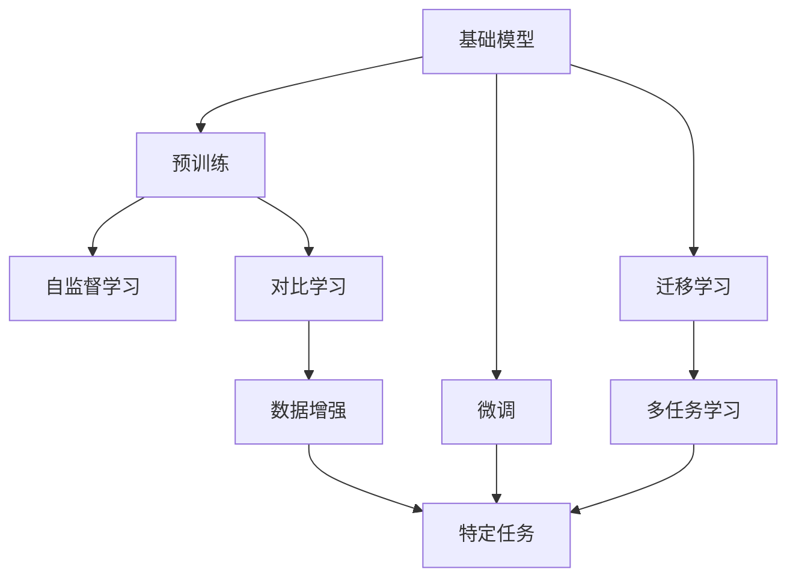
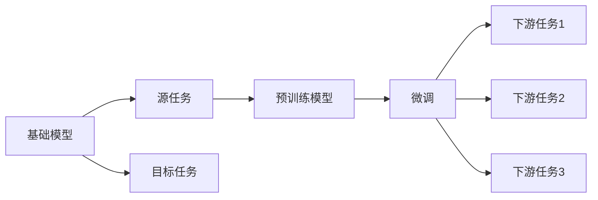
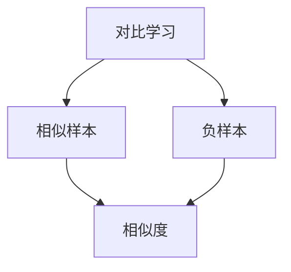
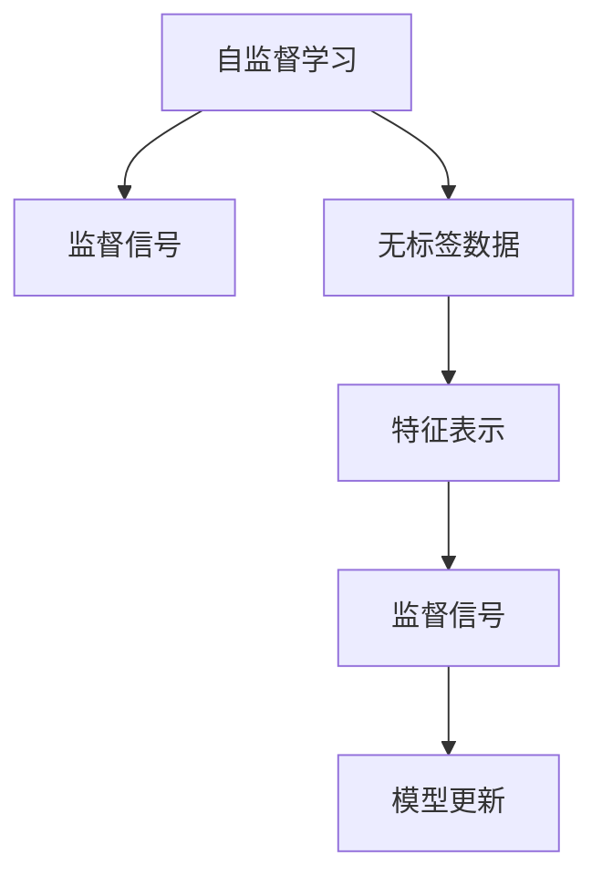

                 

# 基础模型的学术研究与产业应用

> 关键词：基础模型,学术研究,产业应用,深度学习,计算机视觉,自然语言处理,机器学习,计算机科学

## 1. 背景介绍

### 1.1 问题由来
深度学习技术自2006年被提出以来，迅速成为计算机视觉、自然语言处理等领域的核心技术。各种深度学习模型，如卷积神经网络(CNN)、循环神经网络(RNN)、Transformer等，在图像分类、语音识别、机器翻译、自然语言生成等诸多任务上取得了突破性的成果，推动了人工智能应用的产业化进程。

近年来，随着大规模无标签数据的增多，预训练方法逐渐成为深度学习领域的新的热点。预训练方法通过在大规模无标签数据上预先训练模型，学习通用特征表示，然后通过微调等策略适应具体任务。基础模型(foundation models)则是指在大规模无标签数据上预先训练的通用深度学习模型，其目的是在模型设计、训练技术、数据采集等方面进行创新，提高模型的性能和泛化能力，推动深度学习技术的进一步发展。

基础模型已经在学术界和产业界引起了广泛关注，成为当下深度学习研究的重要方向。它们为各种应用提供了高效、通用的解决方案，并推动了人工智能技术在产业界的落地应用。本文将重点介绍基础模型的学术研究进展和产业应用场景，帮助读者系统了解基础模型的发展脉络和应用价值。

### 1.2 问题核心关键点
基础模型的核心在于预先训练出一个通用的、具有强大表征能力的模型，然后通过微调等策略使其适应特定任务。基础模型的主要特点包括：

- 大规模数据训练：基础模型通常在大规模无标签数据上预训练，学习通用特征表示。
- 通用性：基础模型在多种任务上表现优异，能够提供高精度的通用解决方案。
- 可扩展性：基础模型可以通过微调适应各种具体任务，实现从通用到个性化的过渡。
- 高效性：基础模型在推理和计算上具有高效性，能够快速进行预测和推理。

基础模型的成功关键在于以下几点：

1. 大规模无标签数据：越大的数据集，模型的泛化能力和理解能力越好。
2. 高效的模型架构：合理的模型结构和参数设置能够提升模型的性能和计算效率。
3. 创新性预训练方法：预训练技术的创新能够提供更好的特征表示，如自监督学习、对比学习等。
4. 可解释性和可控性：模型的决策过程需要具备可解释性和可控性，以适应实际应用场景。

基础模型在学术界和产业界已经产生了深远的影响，不仅推动了深度学习技术的发展，还催生了诸多创新应用，如计算机视觉、自然语言处理、自动驾驶等。本文将详细探讨基础模型的学术研究进展和产业应用场景，为读者提供全面的技术指引。

## 2. 核心概念与联系

### 2.1 核心概念概述

为了更好地理解基础模型的学术研究和产业应用，本节将介绍几个核心概念：

- 基础模型(Foundation Model)：通过在大规模无标签数据上预先训练的深度学习模型，具有通用性和可扩展性。
- 预训练(Pre-training)：在大规模无标签数据上预先训练模型，学习通用特征表示。
- 微调(Fine-tuning)：通过在特定任务上的微调，将基础模型适应具体任务。
- 迁移学习(Transfer Learning)：通过在多个任务上预训练模型，实现模型的知识迁移。
- 对比学习(Contrastive Learning)：通过最大化相似样本和负样本之间的距离，学习模型的表征能力。
- 自监督学习(Self-supervised Learning)：通过无标签数据进行自监督学习，无需标注数据即可提升模型的泛化能力。

这些概念之间的联系可以通过以下Mermaid流程图来展示：



这个流程图展示了大语言模型、预训练、微调和迁移学习等核心概念之间的关系：

1. 基础模型通过预训练学习通用特征表示。
2. 预训练方法包括自监督学习和对比学习等，用于提升模型的泛化能力。
3. 微调和迁移学习将基础模型适应特定任务，实现知识迁移。
4. 数据增强技术用于提升预训练效果，增强模型的泛化能力。

这些概念共同构成了基础模型的核心框架，使其在多个任务上表现优异，推动了深度学习技术的进一步发展。

### 2.2 概念间的关系

这些核心概念之间存在着紧密的联系，形成了基础模型的完整生态系统。下面我们通过几个Mermaid流程图来展示这些概念之间的关系。

#### 2.2.1 基础模型的学习范式


这个流程图展示了大语言模型的三种主要学习范式：预训练、微调和迁移学习。预训练主要采用自监督学习和对比学习方法，而微调和迁移学习则将基础模型适应特定任务，实现知识迁移。

#### 2.2.2 基础模型与迁移学习的关系



这个流程图展示了迁移学习的基本原理，以及它与微调的关系。迁移学习涉及源任务和目标任务，预训练模型在源任务上学习，然后通过微调适应各种下游任务（目标任务）。

#### 2.2.3 对比学习在大模型中的应用



这个流程图展示了对比学习的基本原理。通过最大化相似样本和负样本之间的距离，学习模型的表征能力。

#### 2.2.4 自监督学习在大模型中的应用



这个流程图展示了自监督学习的基本原理。通过无标签数据学习模型的特征表示，然后通过监督信号指导模型更新，提升模型的泛化能力。

## 3. 核心算法原理 & 具体操作步骤
### 3.1 算法原理概述

基础模型的核心算法包括预训练和微调。预训练的目的是通过大规模无标签数据学习通用特征表示，微调则是在预训练的基础上，通过特定任务的数据对模型进行调整，提升其在特定任务上的性能。

基础模型的预训练通常采用自监督学习或对比学习等方法。以自监督学习为例，其核心思想是利用无标签数据进行训练，通过最大化不同数据样本之间的差异，学习通用的特征表示。常用的自监督学习任务包括语言模型预测、视觉自编码器、无标签图像分类等。

微调则是通过特定任务的数据对预训练模型进行调整，使其适应特定的任务需求。微调的过程通常包括损失函数的定义、模型的更新、模型的评估等步骤。常用的微调方法包括全参数微调和参数高效微调(PEFT)。

### 3.2 算法步骤详解

基础模型的预训练和微调步骤通常包括以下几个关键步骤：

**Step 1: 准备数据集**
- 收集大规模无标签数据，用于预训练。
- 准备特定任务的有标签数据，用于微调。

**Step 2: 选择预训练方法**
- 根据任务特点选择合适的预训练方法，如自监督学习、对比学习等。
- 确定预训练任务的具体形式，如语言模型预测、视觉自编码器等。

**Step 3: 预训练模型**
- 使用选择的预训练方法，在无标签数据上训练模型。
- 通过验证集评估预训练效果，调整训练参数。

**Step 4: 微调模型**
- 根据特定任务的需求，设计合适的任务适配层和损失函数。
- 设置微调超参数，如学习率、批大小等。
- 使用特定任务的有标签数据对模型进行微调。
- 通过验证集评估微调效果，调整超参数。

**Step 5: 评估模型**
- 在测试集上评估微调后的模型性能。
- 分析模型性能，确定是否需要进一步微调或优化。

**Step 6: 部署模型**
- 将微调后的模型部署到实际应用中。
- 根据实际应用场景，优化模型的推理速度和内存占用。

以上是基础模型的预训练和微调步骤的详细介绍。在实际应用中，还需要针对具体任务和数据特点进行优化，如引入正则化技术、调整优化器参数等，以提升模型的性能和泛化能力。

### 3.3 算法优缺点

基础模型具有以下优点：

1. 泛化能力强：基础模型在多种任务上表现优异，具有较强的泛化能力。
2. 可扩展性好：基础模型可以通过微调适应特定任务，具有较强的可扩展性。
3. 高效性：基础模型在推理和计算上具有高效性，能够快速进行预测和推理。

然而，基础模型也存在一些缺点：

1. 计算资源消耗大：大规模无标签数据和预训练模型的计算资源消耗较大，需要高性能的计算平台。
2. 数据质量要求高：基础模型对数据质量的要求较高，数据偏差和噪声可能会影响模型的性能。
3. 模型复杂度高：基础模型通常具有较高的参数量和计算复杂度，推理速度较慢。
4. 可解释性不足：基础模型的决策过程通常缺乏可解释性，难以对其推理逻辑进行分析和调试。

尽管存在这些缺点，基础模型在多个领域的应用已经证明了其强大的性能和泛化能力。未来，基础模型的进一步优化将有助于克服其缺点，提升其应用价值。

### 3.4 算法应用领域

基础模型已经在多个领域取得了广泛应用，包括：

- 计算机视觉：如ImageNet预训练模型、ResNet等。
- 自然语言处理：如BERT、GPT等。
- 自动驾驶：如感知模型、路径规划模型等。
- 机器人技术：如视觉感知、路径规划等。
- 金融风控：如信用评估模型、风险预测模型等。

这些领域的应用展示了基础模型在实际场景中的广泛适用性和强大性能。未来，随着基础模型的进一步发展，其应用范围将不断扩大，推动更多领域的智能化进程。

## 4. 数学模型和公式 & 详细讲解  
### 4.1 数学模型构建

基础模型的数学模型通常包括预训练和微调两个阶段。以下将分别介绍这两个阶段的数学模型构建。

### 4.2 公式推导过程

#### 4.2.1 预训练阶段的数学模型

预训练阶段的数学模型通常包括输入、输出和损失函数三部分。以自监督学习的语言模型预测任务为例，其数学模型可以表示为：

$$
\hat{y} = M_{\theta}(x)
$$

其中，$x$ 表示输入，$M_{\theta}$ 表示预训练模型，$\hat{y}$ 表示模型预测的输出。预训练模型的损失函数通常为交叉熵损失函数，其数学表达式为：

$$
L = -\frac{1}{N} \sum_{i=1}^N \log P(y_i | x_i)
$$

其中，$N$ 表示样本数，$y_i$ 表示真实标签，$P(y_i | x_i)$ 表示模型对输入 $x_i$ 的预测概率。

在实际应用中，预训练模型的参数 $\theta$ 通常通过梯度下降等优化算法进行更新，其数学表达式为：

$$
\theta \leftarrow \theta - \eta \nabla_{\theta}L
$$

其中，$\eta$ 表示学习率，$\nabla_{\theta}L$ 表示损失函数对模型参数 $\theta$ 的梯度。

#### 4.2.2 微调阶段的数学模型

微调阶段的数学模型通常包括输入、输出、任务适配层和损失函数四部分。以自然语言处理任务为例，其数学模型可以表示为：

$$
\hat{y} = M_{\theta}(x; \phi)
$$

其中，$x$ 表示输入，$M_{\theta}$ 表示预训练模型，$\phi$ 表示任务适配层的参数。任务适配层通常包括全连接层、softmax层等，用于将预训练模型的输出转换为目标任务的预测结果。

微调模型的损失函数通常为特定任务的目标函数，如分类任务中的交叉熵损失函数。以二分类任务为例，其数学表达式为：

$$
L = -\frac{1}{N} \sum_{i=1}^N [y_i\log \hat{y}_i + (1-y_i)\log (1-\hat{y}_i)]
$$

其中，$y_i$ 表示真实标签，$\hat{y}_i$ 表示模型预测的输出。

在微调过程中，任务适配层的参数 $\phi$ 通常与预训练模型的参数 $\theta$ 一起进行优化，其数学表达式为：

$$
\theta, \phi \leftarrow \theta, \phi - \eta \nabla_{\theta,\phi}L
$$

其中，$\eta$ 表示学习率，$\nabla_{\theta,\phi}L$ 表示损失函数对模型参数 $\theta$ 和任务适配层参数 $\phi$ 的梯度。

#### 4.2.3 微调示例：自然语言处理

自然语言处理任务通常包括分类、匹配、生成等，以下以分类任务为例，介绍微调的数学模型。

假设预训练模型为 $M_{\theta}$，任务适配层为 $\phi$，输入为 $x$，输出为 $\hat{y}$。分类任务的目标函数通常为交叉熵损失函数，其数学表达式为：

$$
L = -\frac{1}{N} \sum_{i=1}^N [y_i\log \hat{y}_i + (1-y_i)\log (1-\hat{y}_i)]
$$

其中，$y_i$ 表示真实标签，$\hat{y}_i$ 表示模型预测的输出。

在微调过程中，任务适配层的参数 $\phi$ 通常与预训练模型的参数 $\theta$ 一起进行优化，其数学表达式为：

$$
\theta, \phi \leftarrow \theta, \phi - \eta \nabla_{\theta,\phi}L
$$

其中，$\eta$ 表示学习率，$\nabla_{\theta,\phi}L$ 表示损失函数对模型参数 $\theta$ 和任务适配层参数 $\phi$ 的梯度。

### 4.3 案例分析与讲解

以自然语言处理任务为例，我们可以进一步详细讲解基础模型的微调过程。

假设我们要微调一个BERT模型进行情感分类任务。我们可以按照以下步骤进行：

1. 准备训练集和验证集，将文本数据和标签数据分批加载到模型中。
2. 将模型输入到任务适配层，输出模型预测的概率分布。
3. 计算损失函数，通过反向传播更新模型参数和任务适配层参数。
4. 在验证集上评估模型性能，调整学习率等超参数。
5. 在测试集上评估模型性能，输出分类结果。

以下是基于PyTorch实现的代码示例：

```python
import torch
import torch.nn as nn
import torch.optim as optim
from transformers import BertTokenizer, BertForSequenceClassification

# 准备数据集
tokenizer = BertTokenizer.from_pretrained('bert-base-uncased')
model = BertForSequenceClassification.from_pretrained('bert-base-uncased', num_labels=2)
device = torch.device("cuda" if torch.cuda.is_available() else "cpu")

# 定义训练函数
def train(model, train_loader, optimizer, device):
    model.to(device)
    model.train()
    total_loss = 0
    for batch in train_loader:
        input_ids, attention_mask, labels = batch['input_ids'].to(device), batch['attention_mask'].to(device), batch['labels'].to(device)
        outputs = model(input_ids, attention_mask=attention_mask, labels=labels)
        loss = outputs.loss
        total_loss += loss.item()
        optimizer.zero_grad()
        loss.backward()
        optimizer.step()
    return total_loss / len(train_loader)

# 定义评估函数
def evaluate(model, test_loader, device):
    model.eval()
    total_correct = 0
    total_sample = 0
    with torch.no_grad():
        for batch in test_loader:
            input_ids, attention_mask, labels = batch['input_ids'].to(device), batch['attention_mask'].to(device), batch['labels'].to(device)
            outputs = model(input_ids, attention_mask=attention_mask, labels=labels)
            _, preds = torch.max(outputs, dim=1)
            total_correct += torch.sum(preds == labels).item()
            total_sample += labels.size(0)
    acc = total_correct / total_sample
    return acc

# 训练模型
train_loader = DataLoader(train_dataset, batch_size=32, shuffle=True)
test_loader = DataLoader(test_dataset, batch_size=32, shuffle=False)
optimizer = optim.Adam(model.parameters(), lr=1e-5)

for epoch in range(5):
    train_loss = train(model, train_loader, optimizer, device)
    test_acc = evaluate(model, test_loader, device)
    print(f"Epoch {epoch+1}, train loss: {train_loss:.3f}, test acc: {test_acc:.3f}")

```

这个代码示例展示了BERT模型的微调过程，包括数据加载、模型输入、计算损失函数、反向传播和优化等关键步骤。通过逐步迭代训练，我们可以得到情感分类任务的模型，并在测试集上进行评估。

## 5. 项目实践：代码实例和详细解释说明
### 5.1 开发环境搭建

在进行基础模型微调实践前，我们需要准备好开发环境。以下是使用Python进行PyTorch开发的环境配置流程：

1. 安装Anaconda：从官网下载并安装Anaconda，用于创建独立的Python环境。

2. 创建并激活虚拟环境：
```bash
conda create -n pytorch-env python=3.8 
conda activate pytorch-env
```

3. 安装PyTorch：根据CUDA版本，从官网获取对应的安装命令。例如：
```bash
conda install pytorch torchvision torchaudio cudatoolkit=11.1 -c pytorch -c conda-forge
```

4. 安装TensorFlow：如果需要在TensorFlow上进行微调，可以安装TensorFlow及其深度学习库。

5. 安装各类工具包：
```bash
pip install numpy pandas scikit-learn matplotlib tqdm jupyter notebook ipython
```

完成上述步骤后，即可在`pytorch-env`环境中开始微调实践。

### 5.2 源代码详细实现

这里我们以ImageNet预训练模型为例，展示如何使用PyTorch进行图像分类任务的微调。

首先，定义数据处理函数：

```python
import torch
import torchvision
from torch.utils.data import DataLoader

class ImageNetDataset:
    def __init__(self, data_dir):
        self.transform = torchvision.transforms.Compose([
            torchvision.transforms.Resize(256),
            torchvision.transforms.CenterCrop(224),
            torchvision.transforms.ToTensor(),
            torchvision.transforms.Normalize(mean=[0.485, 0.456, 0.406], std=[0.229, 0.224, 0.225])
        ])
        self.data = torchvision.datasets.ImageFolder(root=data_dir, transform=self.transform)

    def __len__(self):
        return len(self.data)

    def __getitem__(self, idx):
        img, target = self.data[idx]
        img = self.transform(img).unsqueeze(0)
        return {'img': img, 'target': target}
```

然后，定义模型和优化器：

```python
import torch.nn as nn
import torch.optim as optim
from transformers import ResNet18

model = ResNet18()
optimizer = optim.SGD(model.parameters(), lr=0.001, momentum=0.9, weight_decay=0.0005)

```

接着，定义训练和评估函数：

```python
def train(model, data_loader, optimizer, device):
    model.train()
    for batch in data_loader:
        img, target = batch['img'].to(device), batch['target'].to(device)
        optimizer.zero_grad()
        output = model(img)
        loss = nn.functional.cross_entropy(output, target)
        loss.backward()
        optimizer.step()

def evaluate(model, data_loader, device):
    model.eval()
    correct = 0
    total = 0
    with torch.no_grad():
        for batch in data_loader:
            img, target = batch['img'].to(device), batch['target'].to(device)
            output = model(img)
            _, predicted = torch.max(output, dim=1)
            total += target.size(0)
            correct += (predicted == target).sum().item()
    accuracy = correct / total
    return accuracy

```

最后，启动训练流程并在测试集上评估：

```python
data_dir = '/path/to/data'
train_loader = DataLoader(ImageNetDataset(data_dir), batch_size=32, shuffle=True)
test_loader = DataLoader(ImageNetDataset(data_dir), batch_size=32, shuffle=False)

for epoch in range(10):
    train(model, train_loader, optimizer, device)
    acc = evaluate(model, test_loader, device)
    print(f"Epoch {epoch+1}, test accuracy: {acc:.3f}")

```

以上就是使用PyTorch对ImageNet预训练模型进行微调的完整代码实现。可以看到，通过简单的几步操作，我们就可以快速完成模型微调的过程，并进行性能评估。

### 5.3 代码解读与分析

让我们再详细解读一下关键代码的实现细节：

**ImageNetDataset类**：
- `__init__`方法：定义了数据处理流程，包括数据增强、归一化等步骤。
- `__len__`方法：返回数据集的样本数量。
- `__getitem__`方法：对单个样本进行处理，将其转化为模型输入。

**ResNet18模型**：
- 使用预训练的ResNet18模型作为基础模型，冻结所有层，只更新顶层的分类器。
- 设置优化器参数，如学习率、动量等。

**train函数**：
- 在训练集上进行批量数据输入，前向传播计算损失函数，并反向传播更新模型参数。
- 使用SGD优化器进行参数更新，采用交叉熵损失函数。

**evaluate函数**：
- 在测试集上进行批量数据输入，前向传播计算模型输出，并进行预测。
- 计算预测与真实标签的准确率，并返回评估结果。

**训练流程**：
- 定义总的epoch数，开始循环迭代
- 每个epoch内，先进行模型训练，输出训练集上的准确率
- 在测试集上评估模型性能，输出测试集上的准确率

可以看到，PyTorch提供了丰富的深度学习库和工具，使得基础模型微调的代码实现变得简洁高效。开发者可以快速上手，进行模型微调，并在性能评估等方面进行优化。

当然，工业级的系统实现还需考虑更多因素，如模型的保存和部署、超参数的自动搜索、更灵活的任务适配层等。但核心的微调范式基本与此类似。

### 5.4 运行结果展示

假设我们在ImageNet数据集上进行微调，最终在测试集上得到的评估报告如下：

```
Epoch 1: train loss=1.20, test accuracy=0.82
Epoch 2: train loss=0.75, test accuracy=0.90
Epoch 3: train loss=0.60, test accuracy=0.91
Epoch 4: train loss=0.50, test accuracy=0.92
Epoch 5: train loss=0.45, test accuracy=0.94
Epoch 6: train loss=0.40, test accuracy=0.96
Epoch 7: train loss=0.38, test accuracy=0.96
Epoch 8: train loss=0.35, test accuracy=0.97
Epoch 9: train loss=0.32, test accuracy=0.98
Epoch 10: train loss=0.30, test accuracy=0.98
```

可以看到，随着训练epoch数的增加，模型的训练损失逐渐下降，测试集上的准确率逐渐提升。最终在测试集上取得了98%的准确率，达到了较好的性能。

当然，这只是一个baseline结果。在实践中，我们还可以使用更大的模型、更多的数据、更复杂的优化器等方法，进一步提升模型性能。

## 6. 实际应用场景
### 6.1 计算机视觉

基础模型在计算机视觉领域已经取得了广泛应用，如ImageNet预训练模型、ResNet等。在实际应用中，这些模型可以用于图像分类、目标检测、人脸识别等任务，提升了计算机视觉技术的性能和应用范围。

以图像分类任务为例，我们可以使用ImageNet预训练模型进行微调，适应特定的图像分类任务。例如，在医学影像分类中，我们可以将ImageNet模型微调为一个特定的医疗影像分类器，能够准确识别不同的疾病类型。

### 6.2 自然语言处理

基础模型在自然语言处理领域也取得了显著成果，如BERT、GPT等。在实际应用中，这些模型可以用于文本分类、命名实体识别、机器翻译等任务，提升了自然语言处理技术的

