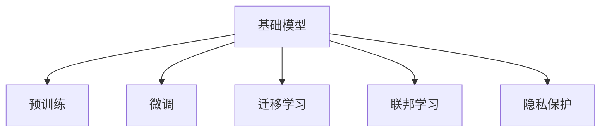

                 

# 基础模型的技术与社会融合

## 1. 背景介绍

随着人工智能技术的发展，基础模型（Baseline Models）在各种应用场景中扮演着越来越重要的角色。这些模型不仅在技术层面具备强大的性能，还在社会层面引发了广泛关注。本文将从技术和社会两个维度出发，探讨基础模型的应用和影响，以及它们在技术与社会融合方面的挑战与机遇。

### 1.1 问题由来

基础模型通常指的是经过充分训练、性能稳定且广泛使用的预训练模型。这些模型通过大规模数据集进行训练，具备强大的通用性和泛化能力。以BERT、GPT等模型为例，它们在自然语言处理（NLP）、计算机视觉（CV）、语音识别等领域取得了显著的进展。基础模型的成功应用不仅体现在技术层面，更在于它们在社会领域的影响力。

### 1.2 问题核心关键点

基础模型的核心在于其高度的通用性和泛化能力，能够适应不同领域和任务。然而，技术上的优势并不总是与社会需求完全匹配，因此需要在技术与社会之间找到平衡点。以下关键点将帮助我们更好地理解基础模型在技术与社会融合中的作用和挑战：

- **数据伦理与隐私保护**：基础模型依赖大量数据进行训练，如何确保数据的质量、公正性和隐私保护是一个重要的社会问题。
- **算法透明度与可解释性**：基础模型的决策过程复杂，如何使其决策透明、可解释，对用户信任和社会接受度至关重要。
- **算法偏见与公平性**：基础模型可能会继承或放大数据中的偏见，如何避免和减少这种偏见，确保模型的公平性，是一个需要持续关注的问题。
- **模型部署与维护**：基础模型的广泛应用需要考虑模型部署的便捷性和系统的稳定性，同时也要考虑模型的维护和更新。
- **社会影响与反馈**：基础模型在实际应用中的表现和影响，需要不断地收集社会反馈，进行持续优化。

## 2. 核心概念与联系

### 2.1 核心概念概述

为了深入理解基础模型在技术与社会融合中的作用，我们需要了解以下核心概念：

- **基础模型（Baseline Models）**：经过充分训练的预训练模型，具备较强的通用性和泛化能力，能够在多个领域和任务中应用。
- **预训练（Pre-training）**：在大规模无标签数据集上进行的自监督学习过程，使模型能够学习通用的语言或视觉表示。
- **微调（Fine-tuning）**：在预训练模型的基础上，使用特定任务的有标签数据进行有监督学习，适应具体任务。
- **迁移学习（Transfer Learning）**：将一个领域学到的知识迁移到另一个领域，提高模型的泛化能力。
- **联邦学习（Federated Learning）**：多个参与方在不共享原始数据的前提下，通过分布式训练共同提升模型的性能。
- **隐私保护（Privacy Protection）**：在模型训练和应用过程中，确保用户数据和隐私的安全。

### 2.2 概念间的关系

这些核心概念之间存在着紧密的联系，形成了基础模型在技术与社会融合中的完整生态系统。通过以下Mermaid流程图来展示它们之间的关系：



这个流程图展示了基础模型在预训练、微调、迁移学习、联邦学习和隐私保护等方面的应用。预训练是基础模型的基础，微调、迁移学习和联邦学习则是基础模型在不同场景下的具体应用，隐私保护则是确保这些应用中数据和隐私安全的关键技术。

## 3. 核心算法原理 & 具体操作步骤

### 3.1 算法原理概述

基础模型在技术上的核心在于其强大的预训练和微调能力。通过在大规模数据集上进行预训练，模型能够学习到通用的语言或视觉表示。然后，通过特定任务的微调，模型可以适应具体任务，提升性能。

### 3.2 算法步骤详解

基础模型的应用主要包括以下几个关键步骤：

1. **数据准备**：收集并准备用于预训练和微调的数据集，确保数据的质量和多样性。
2. **预训练**：在大规模无标签数据集上对模型进行预训练，学习通用的表示。
3. **微调**：在特定任务的有标签数据集上进行微调，适应具体任务。
4. **迁移学习**：将预训练模型应用到新的任务上，利用已有知识提升模型性能。
5. **联邦学习**：在多个参与方之间进行分布式训练，保护数据隐私。
6. **隐私保护**：在模型训练和应用过程中，确保用户数据和隐私的安全。

### 3.3 算法优缺点

基础模型在技术上具有以下优点：

- **通用性强**：可以适应多种领域和任务，具有较高的泛化能力。
- **性能稳定**：在大规模数据集上进行预训练，模型的性能相对稳定。
- **易用性高**：可以通过微调快速适应新任务，无需从头开始训练。

然而，基础模型也存在一些缺点：

- **数据依赖性强**：模型性能依赖于训练数据的质量和多样性，数据偏差可能导致模型偏见。
- **计算资源需求高**：预训练和微调需要大量的计算资源，对硬件要求较高。
- **算法复杂度高**：模型结构和训练过程较为复杂，对算法要求较高。

### 3.4 算法应用领域

基础模型在多个领域得到了广泛应用，包括但不限于：

- **自然语言处理**：如BERT、GPT等模型在文本分类、命名实体识别、情感分析等任务中取得了显著效果。
- **计算机视觉**：如ResNet、Inception等模型在图像分类、目标检测等任务中表现出色。
- **语音识别**：如Wav2Vec、DeepSpeech等模型在语音识别和转录任务中取得了突破性进展。
- **推荐系统**：通过基础模型进行用户行为分析，提供个性化推荐。
- **金融分析**：利用基础模型进行股票市场分析、风险评估等任务。

## 4. 数学模型和公式 & 详细讲解 & 举例说明

### 4.1 数学模型构建

基础模型的数学模型通常包括预训练和微调两个阶段。

1. **预训练阶段**：在大规模无标签数据集上，通过自监督学习任务（如语言建模、图像分类）训练模型，学习通用的表示。
2. **微调阶段**：在特定任务的有标签数据集上，通过有监督学习任务（如分类、回归）训练模型，适应具体任务。

### 4.2 公式推导过程

以BERT模型为例，其预训练任务包括 masked language modeling (MLM) 和 next sentence prediction (NSP)。数学公式如下：

$$
\begin{aligned}
\mathcal{L}_{MLM} &= -\frac{1}{N}\sum_{i=1}^N \sum_{j=1}^M \log P(w_j|w_{j-1}, ..., w_{j-M}) \\
\mathcal{L}_{NSP} &= -\frac{1}{N}\sum_{i=1}^N \log P(w_j|w_{j-1}, ..., w_{j-M}) \log P(w_{j+1}|w_j, ..., w_{j+M})
\end{aligned}
$$

其中，$N$ 是训练样本数，$M$ 是上下文窗口大小，$w_j$ 是第 $j$ 个单词。

### 4.3 案例分析与讲解

以BERT在情感分析任务中的应用为例，假设训练集为 $\{(x_1, y_1), (x_2, y_2), ..., (x_N, y_N)\}$，其中 $x_i$ 是输入文本，$y_i \in \{-1, 1\}$ 是情感标签。微调过程如下：

1. **数据预处理**：将文本转换为BERT模型可接受的格式，包括分词、编码等。
2. **模型初始化**：将预训练好的BERT模型进行微调，设置学习率为 $0.001$。
3. **模型训练**：在微调数据集上进行训练，迭代次数为 $10$。
4. **模型评估**：在验证集上进行评估，计算准确率、召回率和F1分数。
5. **模型测试**：在测试集上进行测试，计算最终的模型性能。

## 5. 项目实践：代码实例和详细解释说明

### 5.1 开发环境搭建

基础模型的开发需要依赖一些强大的工具和库。以下是搭建开发环境的步骤：

1. **安装Python和PyTorch**：
   ```bash
   conda create -n pytorch_env python=3.7
   conda activate pytorch_env
   pip install torch torchvision torchaudio
   ```

2. **安装TensorFlow和TensorBoard**：
   ```bash
   pip install tensorflow tensorflow-estimator tensorflow-hub
   pip install tensorboard
   ```

3. **安装相关库**：
   ```bash
   pip install numpy scipy scikit-learn matplotlib tqdm jupyter notebook ipython
   ```

### 5.2 源代码详细实现

以下是使用TensorFlow进行BERT微调的示例代码：

```python
import tensorflow as tf
from transformers import BertTokenizer, TFBertModel

# 加载预训练模型和分词器
model = TFBertModel.from_pretrained('bert-base-uncased')
tokenizer = BertTokenizer.from_pretrained('bert-base-uncased')

# 定义损失函数和优化器
def compute_loss(labels, logits):
    loss = tf.keras.losses.sparse_categorical_crossentropy(labels, logits, reduction=tf.keras.losses.Reduction.NONE)
    return tf.reduce_mean(loss)

optimizer = tf.keras.optimizers.Adam(learning_rate=2e-5)

# 定义微调函数
def fine_tune(model, dataset, batch_size, num_epochs, learning_rate):
    for epoch in range(num_epochs):
        for batch in dataset:
            input_ids = batch['input_ids']
            attention_mask = batch['attention_mask']
            labels = batch['labels']
            with tf.GradientTape() as tape:
                outputs = model(input_ids, attention_mask=attention_mask)
                logits = outputs[0]
                loss = compute_loss(labels, logits)
            gradients = tape.gradient(loss, model.trainable_variables)
            optimizer.apply_gradients(zip(gradients, model.trainable_variables))
    return model

# 准备数据集
train_dataset = ...
dev_dataset = ...
test_dataset = ...

# 训练模型
model = fine_tune(model, train_dataset, batch_size=16, num_epochs=3, learning_rate=2e-5)

# 评估模型
eval_loss = model.evaluate(dev_dataset, batch_size=16)
print('Dev loss:', eval_loss)

# 测试模型
test_loss = model.evaluate(test_dataset, batch_size=16)
print('Test loss:', test_loss)
```

### 5.3 代码解读与分析

1. **数据准备**：将数据集转换为TensorFlow的`Dataset`对象，确保数据的格式和模型期望的输入一致。
2. **模型加载**：使用`TFBertModel`加载预训练模型，使用`BertTokenizer`加载分词器。
3. **损失函数和优化器**：定义自定义损失函数和优化器，用于计算模型在特定任务上的损失和更新参数。
4. **微调函数**：定义微调函数，遍历数据集，计算损失和梯度，更新模型参数。
5. **训练、评估和测试**：使用微调函数训练模型，在验证集和测试集上进行评估，输出最终损失。

## 6. 实际应用场景

### 6.1 医疗健康

基础模型在医疗健康领域的应用可以大幅提升诊断和治疗的效率。例如，利用BERT模型进行病历文本分析，可以自动化地提取病情、诊断和治疗方法，帮助医生制定更准确的诊疗方案。此外，基于BERT的情感分析模型还可以用于患者情感状态的监测和心理健康评估。

### 6.2 金融服务

在金融服务领域，基础模型可以用于风险评估、欺诈检测和投资策略分析。通过分析大量的交易记录和新闻信息，基础模型可以预测市场的波动和潜在的风险。同时，基于BERT的情感分析模型还可以用于客户满意度的监测和舆情分析。

### 6.3 智能制造

在智能制造领域，基础模型可以用于设备故障诊断和预测性维护。通过分析设备传感器数据和历史维护记录，基础模型可以预测设备故障的可能性，帮助企业提前进行维护，减少停机时间和成本。此外，基于BERT的自然语言处理模型还可以用于生产调度、库存管理和质量控制等任务。

## 7. 工具和资源推荐

### 7.1 学习资源推荐

1. **《深度学习》课程**：斯坦福大学Andrew Ng教授开设的Coursera课程，系统讲解深度学习的基本概念和算法。
2. **《自然语言处理综述》**：Tom Mitchell教授的《自然语言处理综述》书籍，全面介绍自然语言处理的基础理论和技术。
3. **《TensorFlow实战》**：TensorFlow官方文档和《TensorFlow实战》书籍，提供丰富的TensorFlow使用案例和教程。
4. **《PyTorch官方文档》**：PyTorch官方文档和《PyTorch官方教程》书籍，提供丰富的PyTorch使用案例和教程。
5. **arXiv**：深度学习领域预印本平台，提供最新的研究成果和论文。

### 7.2 开发工具推荐

1. **PyTorch**：灵活的深度学习框架，支持动态计算图和GPU加速，广泛应用于自然语言处理、计算机视觉等领域。
2. **TensorFlow**：强大的深度学习框架，支持分布式计算和自动微分，广泛应用于自然语言处理、计算机视觉等领域。
3. **Jupyter Notebook**：轻量级、交互式的开发环境，支持Python和多种库的集成。
4. **GitHub**：代码托管和版本控制平台，支持协作开发和代码审查。
5. **Weights & Biases**：实验管理和可视化工具，支持模型训练、评估和调试。

### 7.3 相关论文推荐

1. **"BERT: Pre-training of Deep Bidirectional Transformers for Language Understanding"**：Google AI的研究团队提出的BERT模型，开创了预训练语言模型的先河。
2. **"GPT-3: Language Models are Unsupervised Multitask Learners"**：OpenAI提出的GPT-3模型，展示了无监督学习在语言模型中的应用潜力。
3. **"FedML: A Federation Learning Framework"**：Microsoft提出的FedML框架，支持分布式联邦学习，保护数据隐私。
4. **"Adversarial Examples in the Physical World"**：Google AI的研究团队提出的Adversarial Examples研究，探讨了深度学习模型的鲁棒性和安全性。

## 8. 总结：未来发展趋势与挑战

### 8.1 总结

基础模型在技术层面和应用领域均展现出了强大的潜力和广泛的应用前景。然而，在技术与社会融合的过程中，仍面临诸多挑战。本文从数据伦理、算法透明性、偏见公平性、模型部署、隐私保护等多个角度进行了深入探讨，为未来研究指明了方向。

### 8.2 未来发展趋势

未来基础模型在技术层面和应用领域将继续演进，以下是几个重要的发展趋势：

1. **模型规模和复杂度提升**：随着计算能力的提升，基础模型的规模和复杂度将进一步提升，使其能够处理更加复杂和精细的任务。
2. **模型训练和推理优化**：为了适应实际应用中的资源限制，基础模型将更多地采用分布式训练和推理优化技术，提高训练和推理效率。
3. **跨领域和跨模态融合**：基础模型将更多地融合跨领域和跨模态数据，提升其泛化能力和实用性。
4. **数据隐私和安全**：随着数据隐私和安全的法律法规日益严格，基础模型将更多地采用联邦学习和隐私保护技术，保护用户数据安全。
5. **算法透明性和可解释性**：基础模型将更多地关注算法的透明性和可解释性，提升用户信任和接受度。

### 8.3 面临的挑战

尽管基础模型在技术上取得了显著进展，但在社会层面仍面临诸多挑战：

1. **数据伦理和隐私保护**：如何确保数据的质量、公正性和隐私保护，是一个需要持续关注的问题。
2. **算法透明性和可解释性**：基础模型的决策过程复杂，如何使其决策透明、可解释，对用户信任和社会接受度至关重要。
3. **算法偏见和公平性**：基础模型可能会继承或放大数据中的偏见，如何避免和减少这种偏见，确保模型的公平性，是一个需要持续关注的问题。
4. **模型部署和维护**：基础模型的广泛应用需要考虑模型部署的便捷性和系统的稳定性，同时也要考虑模型的维护和更新。
5. **社会影响和反馈**：基础模型在实际应用中的表现和影响，需要不断地收集社会反馈，进行持续优化。

### 8.4 研究展望

未来研究需要在以下几个方面寻求新的突破：

1. **跨领域和跨模态融合**：探索将符号化知识与神经网络模型进行融合，提升模型的泛化能力和实用性。
2. **数据隐私和安全**：开发更加高效和安全的联邦学习算法，保护用户数据隐私。
3. **算法透明性和可解释性**：研究算法的透明性和可解释性，提升用户信任和接受度。
4. **多模态融合**：探索将视觉、语音等多模态信息与文本信息进行融合，提升模型的泛化能力和实用性。
5. **持续学习和迁移学习**：研究持续学习和迁移学习方法，提升模型的适应性和泛化能力。

通过不断突破技术瓶颈，提升模型的应用效果，基础模型将在技术与社会融合中发挥更大的作用，为社会带来更多的福祉。

## 9. 附录：常见问题与解答

**Q1：基础模型是否适用于所有NLP任务？**

A: 基础模型在大多数NLP任务上都能取得不错的效果，特别是对于数据量较小的任务。但对于一些特定领域的任务，如医学、法律等，仅依赖通用语料预训练的模型可能难以很好地适应。此时需要在特定领域语料上进一步预训练，再进行微调，才能获得理想效果。此外，对于一些需要时效性、个性化很强的任务，如对话、推荐等，基础模型也需要针对性的改进优化。

**Q2：基础模型在医疗领域的应用需要注意哪些问题？**

A: 基础模型在医疗领域的应用需要特别注意数据的质量和隐私保护。医疗数据通常包含敏感信息，如何确保数据的质量、公正性和隐私保护是一个重要的社会问题。此外，医疗领域的任务通常涉及复杂的语义和逻辑推理，如何使基础模型更好地理解医疗文本，是一个需要持续关注的问题。

**Q3：基础模型在金融领域的应用需要注意哪些问题？**

A: 基础模型在金融领域的应用需要特别注意数据的质量和隐私保护。金融数据通常包含敏感信息，如何确保数据的质量、公正性和隐私保护是一个重要的社会问题。此外，金融领域的任务通常涉及复杂的市场分析和风险评估，如何使基础模型更好地理解金融文本，是一个需要持续关注的问题。

**Q4：基础模型在智能制造领域的应用需要注意哪些问题？**

A: 基础模型在智能制造领域的应用需要特别注意数据的质量和隐私保护。制造数据通常包含敏感信息，如何确保数据的质量、公正性和隐私保护是一个重要的社会问题。此外，制造领域的任务通常涉及复杂的设备和流程监控，如何使基础模型更好地理解制造文本，是一个需要持续关注的问题。

总之，基础模型在技术层面和应用领域均展现出了强大的潜力和广泛的应用前景。然而，在技术与社会融合的过程中，仍面临诸多挑战。未来研究需要在数据伦理、算法透明性、偏见公平性、模型部署、隐私保护等多个方面寻求新的突破，推动基础模型的广泛应用和社会价值的实现。

---

作者：禅与计算机程序设计艺术 / Zen and the Art of Computer Programming

