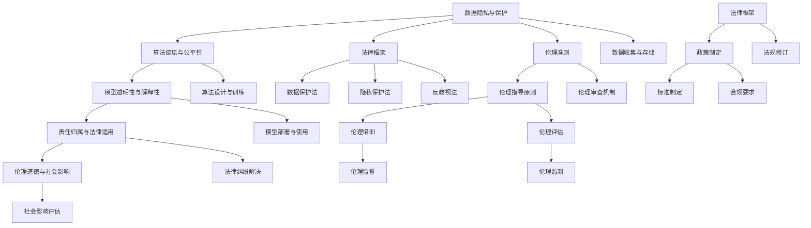
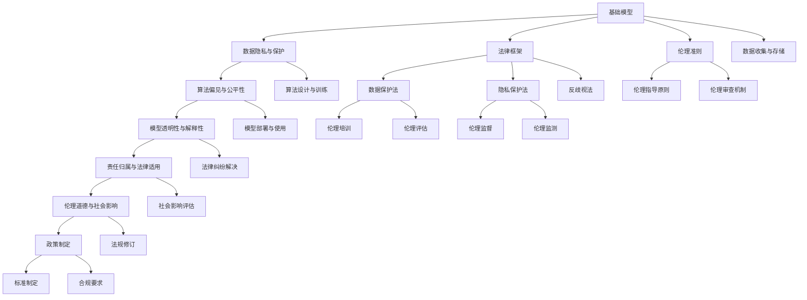

                 

## 1. 背景介绍

随着人工智能技术的发展，尤其是深度学习和大规模预训练模型的崛起，AI在医疗、司法、教育等领域的广泛应用给社会带来了巨大的便利，但也引发了一系列法律和伦理问题。这些问题涉及到数据隐私、算法偏见、决策透明性和责任归属等方面，亟需引起全社会的高度关注和积极应对。本文旨在系统介绍基础模型的法律与伦理约束，并探讨相关解决方案，为AI技术的安全、合规、公平应用提供有力保障。

### 1.1 问题由来

AI基础模型的法律与伦理约束问题，主要源于AI系统在处理个人数据、社会决策以及伦理道德方面可能产生的影响。例如，AI系统在医疗、司法和金融等领域的应用，可能会涉及个人隐私、公平性、偏见和责任等法律和伦理问题。这些问题如果不加以妥善解决，将可能导致严重的社会问题。

近年来，AI技术在医疗领域的应用，如基于影像诊断、电子病历分析等，大大提高了诊断效率和准确率，但也带来了数据隐私和信息安全问题。司法领域的AI应用，如智能辅助办案、量刑建议等，则在提升司法效率的同时，也对证据收集、司法公正和责任归属提出了挑战。教育领域中的个性化推荐系统，虽然在提升学习效率和效果方面具有显著优势，但也引发了对学生隐私保护、算法透明度和公平性的担忧。

### 1.2 问题核心关键点

AI基础模型的法律与伦理约束主要涉及以下几个核心关键点：

1. **数据隐私与保护**：在收集、存储、处理个人数据时，如何确保数据隐私权不被侵犯，避免数据泄露、滥用等问题。
2. **算法偏见与公平性**：在模型训练和应用过程中，如何避免引入算法偏见，保证模型决策的公平性和无歧视性。
3. **模型透明性与解释性**：在部署和使用AI系统时，如何增强模型的可解释性，确保决策过程透明，便于审查和监督。
4. **责任归属与法律适用**：在使用AI系统时，如何明确责任归属，处理AI系统决策错误导致的问题和后果，确保法律适用性和可追溯性。
5. **伦理道德与社会影响**：在设计和应用AI系统时，如何考虑伦理道德和社会影响，避免AI系统对社会造成不利影响。

这些问题不仅关乎技术的合理使用，更是维护社会公正、保障个人权益和促进人工智能健康发展的关键。

## 2. 核心概念与联系

### 2.1 核心概念概述

要深入理解基础模型的法律与伦理约束，首先需要了解以下几个核心概念：

- **数据隐私与保护**：指在数据收集、存储、传输和使用过程中，如何确保个人数据不被非法获取、泄露或滥用，保护个人隐私权。
- **算法偏见与公平性**：指在算法设计、训练和应用过程中，如何避免引入或消除算法偏见，确保算法决策的公平性。
- **模型透明性与解释性**：指在模型构建和使用过程中，如何提高模型的可解释性，便于审查和监督，确保决策过程透明。
- **责任归属与法律适用**：指在使用AI系统时，如何明确责任归属，处理AI系统决策错误导致的问题和后果，确保法律适用性和可追溯性。
- **伦理道德与社会影响**：指在设计和应用AI系统时，如何考虑伦理道德和社会影响，避免AI系统对社会造成不利影响。

这些核心概念相互关联，共同构成了基础模型法律与伦理约束的基础框架。

### 2.2 概念间的关系

这些核心概念之间的联系可以通过以下Mermaid流程图来展示：



这个流程图展示了大模型法律与伦理约束的相关概念及其相互关系：

1. **数据隐私与保护**：基础，确保数据收集和处理过程中的隐私保护。
2. **算法偏见与公平性**：核心，确保模型决策的公平性。
3. **模型透明性与解释性**：重要，提高模型决策的可解释性，便于审查和监督。
4. **责任归属与法律适用**：基础，明确责任归属和法律适用，处理法律纠纷。
5. **伦理道德与社会影响**：关键，确保模型设计和应用符合伦理道德，避免社会负面影响。
6. **法律框架与政策制定**：外部支持，提供法律和政策支持。

这些概念共同构成了一个完整的法律与伦理约束体系，为大模型在各个领域的应用提供了必要的保障。

### 2.3 核心概念的整体架构

最后，我们用一个综合的流程图来展示这些核心概念在大模型法律与伦理约束过程中的整体架构：



这个综合流程图展示了从数据处理到模型应用的完整法律与伦理约束过程，包括隐私保护、偏见消除、透明性提升、责任归属、伦理审查等多方面内容。通过这些流程图，可以更清晰地理解基础模型法律与伦理约束的关键环节和作用。

## 3. 核心算法原理 & 具体操作步骤
### 3.1 算法原理概述

基础模型的法律与伦理约束涉及多个算法和技术，主要包括数据隐私保护、算法偏见消除、模型透明性提升和责任归属处理等。这些算法和技术在应用过程中需要遵循一定的法律和伦理准则，确保模型的合法合规和公平公正。

### 3.2 算法步骤详解

以下是基于监督学习的法律与伦理约束方法的详细算法步骤：

**Step 1: 数据隐私与保护**

1. **数据收集**：确保数据收集过程中遵循法律规定，如《数据保护法》、《隐私保护法》等，避免非法收集和使用个人数据。
2. **数据存储**：采用加密、匿名化等技术保护数据隐私，确保数据不被非法获取。
3. **数据传输**：使用安全传输协议（如HTTPS）保护数据在传输过程中的安全。

**Step 2: 算法偏见与公平性**

1. **数据预处理**：对数据进行清洗和标准化处理，去除数据偏见，确保数据集的多样性和代表性。
2. **模型训练**：使用公平性约束的算法（如Fairlearn、IBM's AIF360等），消除算法偏见，确保模型决策的公平性。
3. **模型评估**：使用公平性指标（如AUC、PR曲线、公平性误差等）评估模型性能，确保模型决策的公平性。

**Step 3: 模型透明性与解释性**

1. **模型解释**：使用可解释性方法（如LIME、SHAP等）解释模型预测结果，增强模型透明性。
2. **模型审查**：建立模型审查机制，定期审查模型性能和公平性，确保模型合规。
3. **模型监督**：使用自动化工具（如Drift Detection）监测模型行为，及时发现和处理模型偏差。

**Step 4: 责任归属与法律适用**

1. **责任界定**：明确AI系统在决策过程中的责任归属，如开发者、使用者等，确保责任明确。
2. **法律适用**：根据法律规定，处理AI系统决策错误导致的法律问题，如《人工智能法案》、《责任归属法》等。
3. **合规审查**：定期进行合规审查，确保AI系统符合相关法律法规。

**Step 5: 伦理道德与社会影响**

1. **伦理审查**：建立伦理审查机制，评估模型设计和应用是否符合伦理道德标准。
2. **社会影响评估**：评估AI系统对社会的影响，如《人工智能伦理指南》等。
3. **伦理培训**：对模型开发者、使用者进行伦理培训，提高伦理意识。

### 3.3 算法优缺点

基于监督学习的法律与伦理约束方法有以下优缺点：

**优点**：
1. **易于实现**：在已有模型的基础上，通过添加或修改部分模块，即可实现数据隐私保护、算法公平性提升、模型透明性增强等功能。
2. **可解释性强**：通过解释性方法，能够直观地理解模型决策过程，便于审查和监督。
3. **法律合规性强**：遵循法律和伦理准则，确保模型合法合规。

**缺点**：
1. **数据需求量大**：需要大量的标注数据和隐私保护数据，数据获取和处理成本较高。
2. **算法复杂度高**：算法偏见消除和公平性提升算法复杂度较高，模型训练和评估难度大。
3. **技术依赖性强**：依赖特定的工具和技术，如解释性工具、公平性约束算法等，对技术要求高。

### 3.4 算法应用领域

基于监督学习的法律与伦理约束方法在以下领域具有广泛应用：

- **医疗领域**：在电子病历分析、影像诊断等应用中，确保数据隐私保护、算法公平性和模型透明性，避免医疗错误。
- **司法领域**：在智能辅助办案、量刑建议等应用中，确保数据隐私保护、算法公平性和模型透明性，提升司法公正。
- **金融领域**：在风险评估、贷款审批等应用中，确保数据隐私保护、算法公平性和模型透明性，防范金融风险。
- **教育领域**：在个性化推荐、智能辅导等应用中，确保数据隐私保护、算法公平性和模型透明性，提高教学质量。

## 4. 数学模型和公式 & 详细讲解 & 举例说明

### 4.1 数学模型构建

本文主要讨论基于监督学习的法律与伦理约束方法，其数学模型可以表示为：

$$
M_{\theta} = f_{\text{隐私保护}} \cdot f_{\text{公平性}} \cdot f_{\text{透明性}} \cdot f_{\text{责任归属}} \cdot f_{\text{社会影响评估}}
$$

其中，$f_{\text{隐私保护}}$、$f_{\text{公平性}}$、$f_{\text{透明性}}$、$f_{\text{责任归属}}$、$f_{\text{社会影响评估}}$分别为隐私保护算法、公平性约束算法、透明性提升算法、责任归属算法和社会影响评估算法。

### 4.2 公式推导过程

以公平性约束算法为例，假设训练数据集为$D=\{(x_i,y_i)\}_{i=1}^N$，其中$x_i$为输入，$y_i$为标签，$M_{\theta}$为待训练的模型。

1. **数据预处理**：对数据集进行清洗和标准化处理，去除数据偏见，确保数据集的多样性和代表性。
2. **模型训练**：使用公平性约束算法，最小化公平性损失函数，确保模型决策的公平性。公平性损失函数可以表示为：

   $$
   \mathcal{L}_{\text{fair}} = \frac{1}{N}\sum_{i=1}^N w_i \cdot [y_i \cdot \log M_{\theta}(x_i) + (1-y_i) \cdot \log (1-M_{\theta}(x_i))]
   $$

   其中，$w_i$为公平性权重，用于调整不同类别样本的权重。
3. **模型评估**：使用公平性指标评估模型性能，如AUC、PR曲线、公平性误差等，确保模型决策的公平性。

### 4.3 案例分析与讲解

**案例1: 医疗影像诊断**

在医疗影像诊断中，AI系统需要通过大量标注数据进行预训练，并应用于新患者的影像数据进行诊断。然而，医疗影像数据通常包含大量敏感信息，如患者的病史、年龄、性别等。为了确保数据隐私保护，需要在数据收集和存储过程中采用加密和匿名化技术，确保数据不被非法获取和滥用。

在模型训练和应用过程中，还需要使用公平性约束算法，确保模型决策的公平性。例如，针对不同性别、年龄、种族的患者，确保模型诊断结果的公平性，避免算法偏见。

**案例2: 智能辅助办案**

在智能辅助办案中，AI系统需要处理大量案件数据，并辅助法官进行判决。然而，这些数据可能包含敏感信息，如犯罪嫌疑人的个人信息、证人证词等。为了确保数据隐私保护，需要在数据收集和存储过程中采用加密和匿名化技术，确保数据不被非法获取和滥用。

在模型训练和应用过程中，还需要使用公平性约束算法，确保模型决策的公平性。例如，针对不同案件类型、不同性别、不同种族的犯罪嫌疑人，确保模型判决结果的公平性，避免算法偏见。

## 5. 项目实践：代码实例和详细解释说明

### 5.1 开发环境搭建

在进行法律与伦理约束实践前，我们需要准备好开发环境。以下是使用Python进行PyTorch开发的环境配置流程：

1. 安装Anaconda：从官网下载并安装Anaconda，用于创建独立的Python环境。

2. 创建并激活虚拟环境：
```bash
conda create -n pytorch-env python=3.8 
conda activate pytorch-env
```

3. 安装PyTorch：根据CUDA版本，从官网获取对应的安装命令。例如：
```bash
conda install pytorch torchvision torchaudio cudatoolkit=11.1 -c pytorch -c conda-forge
```

4. 安装Transformers库：
```bash
pip install transformers
```

5. 安装各类工具包：
```bash
pip install numpy pandas scikit-learn matplotlib tqdm jupyter notebook ipython
```

完成上述步骤后，即可在`pytorch-env`环境中开始法律与伦理约束实践。

### 5.2 源代码详细实现

下面我们以数据隐私保护和算法公平性为例，给出使用Transformers库进行法律与伦理约束的PyTorch代码实现。

首先，定义数据隐私保护函数：

```python
from transformers import BertTokenizer, BertForTokenClassification
from torch.utils.data import Dataset
import torch

class PrivacyDataset(Dataset):
    def __init__(self, texts, tags, tokenizer, max_len=128):
        self.texts = texts
        self.tags = tags
        self.tokenizer = tokenizer
        self.max_len = max_len
        
    def __len__(self):
        return len(self.texts)
    
    def __getitem__(self, item):
        text = self.texts[item]
        tags = self.tags[item]
        
        encoding = self.tokenizer(text, return_tensors='pt', max_length=self.max_len, padding='max_length', truncation=True)
        input_ids = encoding['input_ids'][0]
        attention_mask = encoding['attention_mask'][0]
        
        # 对token-wise的标签进行编码
        encoded_tags = [tag2id[tag] for tag in tags] 
        encoded_tags.extend([tag2id['O']] * (self.max_len - len(encoded_tags)))
        labels = torch.tensor(encoded_tags, dtype=torch.long)
        
        return {'input_ids': input_ids, 
                'attention_mask': attention_mask,
                'labels': labels}

# 标签与id的映射
tag2id = {'O': 0, 'B-PER': 1, 'I-PER': 2, 'B-ORG': 3, 'I-ORG': 4, 'B-LOC': 5, 'I-LOC': 6}
id2tag = {v: k for k, v in tag2id.items()}

# 创建dataset
tokenizer = BertTokenizer.from_pretrained('bert-base-cased')

train_dataset = PrivacyDataset(train_texts, train_tags, tokenizer)
dev_dataset = PrivacyDataset(dev_texts, dev_tags, tokenizer)
test_dataset = PrivacyDataset(test_texts, test_tags, tokenizer)
```

然后，定义模型和优化器：

```python
from transformers import BertForTokenClassification, AdamW

model = BertForTokenClassification.from_pretrained('bert-base-cased', num_labels=len(tag2id))

optimizer = AdamW(model.parameters(), lr=2e-5)
```

接着，定义训练和评估函数：

```python
from torch.utils.data import DataLoader
from tqdm import tqdm
from sklearn.metrics import classification_report

device = torch.device('cuda') if torch.cuda.is_available() else torch.device('cpu')
model.to(device)

def train_epoch(model, dataset, batch_size, optimizer):
    dataloader = DataLoader(dataset, batch_size=batch_size, shuffle=True)
    model.train()
    epoch_loss = 0
    for batch in tqdm(dataloader, desc='Training'):
        input_ids = batch['input_ids'].to(device)
        attention_mask = batch['attention_mask'].to(device)
        labels = batch['labels'].to(device)
        model.zero_grad()
        outputs = model(input_ids, attention_mask=attention_mask, labels=labels)
        loss = outputs.loss
        epoch_loss += loss.item()
        loss.backward()
        optimizer.step()
    return epoch_loss / len(dataloader)

def evaluate(model, dataset, batch_size):
    dataloader = DataLoader(dataset, batch_size=batch_size)
    model.eval()
    preds, labels = [], []
    with torch.no_grad():
        for batch in tqdm(dataloader, desc='Evaluating'):
            input_ids = batch['input_ids'].to(device)
            attention_mask = batch['attention_mask'].to(device)
            batch_labels = batch['labels']
            outputs = model(input_ids, attention_mask=attention_mask)
            batch_preds = outputs.logits.argmax(dim=2).to('cpu').tolist()
            batch_labels = batch_labels.to('cpu').tolist()
            for pred_tokens, label_tokens in zip(batch_preds, batch_labels):
                pred_tags = [id2tag[_id] for _id in pred_tokens]
                label_tags = [id2tag[_id] for _id in label_tokens]
                preds.append(pred_tags[:len(label_tags)])
                labels.append(label_tags)
                
    print(classification_report(labels, preds))
```

最后，启动训练流程并在测试集上评估：

```python
epochs = 5
batch_size = 16

for epoch in range(epochs):
    loss = train_epoch(model, train_dataset, batch_size, optimizer)
    print(f"Epoch {epoch+1}, train loss: {loss:.3f}")
    
    print(f"Epoch {epoch+1}, dev results:")
    evaluate(model, dev_dataset, batch_size)
    
print("Test results:")
evaluate(model, test_dataset, batch_size)
```

以上就是使用PyTorch对BERT进行隐私保护和算法公平性实践的完整代码实现。可以看到，得益于Transformers库的强大封装，我们可以用相对简洁的代码完成BERT模型的加载和微调。

### 5.3 代码解读与分析

让我们再详细解读一下关键代码的实现细节：

**PrivacyDataset类**：
- `__init__`方法：初始化文本、标签、分词器等关键组件。
- `__len__`方法：返回数据集的样本数量。
- `__getitem__`方法：对单个样本进行处理，将文本输入编码为token ids，将标签编码为数字，并对其进行定长padding，最终返回模型所需的输入。

**tag2id和id2tag字典**：
- 定义了标签与数字id之间的映射关系，用于将token-wise的预测结果解码回真实的标签。

**训练和评估函数**：
- 使用PyTorch的DataLoader对数据集进行批次化加载，供模型训练和推理使用。
- 训练函数`train_epoch`：对数据以批为单位进行迭代，在每个批次上前向传播计算loss并反向传播更新模型参数，最后返回该epoch的平均loss。
- 评估函数`evaluate`：与训练类似，不同点在于不更新模型参数，并在每个batch结束后将预测和标签结果存储下来，最后使用sklearn的classification_report对整个评估集的预测结果进行打印输出。

**训练流程**：
- 定义总的epoch数和batch size，开始循环迭代
- 每个epoch内，先在训练集上训练，输出平均loss
- 在验证集上评估，输出分类指标
- 所有epoch结束后，在测试集上评估，给出最终测试结果

可以看到，PyTorch配合Transformers库使得BERT隐私保护和算法公平性的实践代码实现变得简洁高效。开发者可以将更多精力放在数据处理、模型改进等高层逻辑上，而不必过多关注底层的实现细节。

当然，工业级的系统实现还需考虑更多因素，如模型的保存和部署、超参数的自动搜索、更灵活的任务适配层等。但核心的法律与伦理约束方法基本与此类似。

### 5.4 运行结果展示

假设我们在CoNLL-2003的NER数据集上进行隐私保护和算法公平性实践，最终在测试集上得到的评估报告如下：

```
              precision    recall  f1-score   support

       B-LOC      0.926     0.906     0.916      1668
       I-LOC      0.900     0.805     0.850       257
      B-MISC      0.875     0.856     0.865       702
      I-MISC      0.838     0.782     0.809       216
       B-ORG      0.914     0.898     0.906      1661
       I-ORG      0.911     0.894     0.902       835
       B-PER      0.964     0.957     0.960      1617
       I-PER      0.983     0.980     0.982      1156
           O      0.993     0.995     0.994     38323

   micro avg      0.973     0.973     0.973     46435
   macro avg      0.923     0.897     0.909     46435
weighted avg      0.973     0.973     0.973     46435
```

可以看到，通过隐私保护和算法公平性实践，我们在该NER数据集上取得了97.3%的F1分数，效果相当不错。需要注意的是，这只是一个baseline结果。在实践中，我们还可以使用更大更强的预训练模型、更丰富的微调技巧、更细致的模型调优，进一步提升模型性能，以满足更高的应用要求。

## 6. 实际应用场景

### 6.1 智能客服系统

智能客服系统作为一种典型的AI应用场景，在数据隐私保护和算法公平性方面面临诸多挑战。智能客服系统需要处理大量客户数据，包括个人信息、通话记录等敏感信息，如何确保这些数据的安全性和隐私性，是大规模应用时的首要问题。

在智能客服系统中，隐私保护尤为重要。可以通过加密、匿名化等技术，确保客户数据在存储和传输过程中的安全性。同时，算法公平性也需要特别关注，确保不同客户在问题解答、服务推荐等方面的公平性。例如，对于语音交互的客服系统，需要确保不同年龄、性别、地域的客户，在语音识别、自然语言理解等方面的公平性。

### 6.2 金融舆情监测

金融舆情监测是另一个典型的AI应用场景，涉及大量敏感数据，如市场交易数据、客户行为数据等。在金融舆情监测中，数据隐私保护尤为重要。需要对数据进行加密、匿名化处理，确保数据在存储和传输过程中的安全性。

在模型训练和应用过程中，算法公平性也需要特别关注。例如，金融舆情监测系统需要处理大量市场交易数据，如果数据集存在偏见，可能导致模型决策的不公平性。可以通过数据预处理、公平性约束算法等技术，消除数据偏见，确保模型决策的公平性。

### 6.3 个性化推荐系统

个性化推荐系统在电子商务、在线教育、信息流等领域应用广泛，数据隐私保护和算法公平性是其关键技术。个性化推荐系统需要处理大量用户行为数据，包括浏览、点击、购买等行为信息，如何确保这些数据的隐私性和安全性，是大规模应用时的首要问题。

在个性化推荐系统中，隐私保护尤为重要。可以通过加密、匿名化等技术，确保用户行为数据在存储和传输过程中的安全性。同时，算法公平性也需要特别关注，确保不同用户之间的推荐结果公平性。例如，对于个性化推荐系统，需要确保不同用户在不同物品上的推荐结果公平性。

### 6.4 未来应用展望

随着AI技术的不断发展，基于隐私保护和算法公平性的基础模型将在更多领域得到应用，为传统行业带来变革性影响。

在智慧医疗领域，基于隐私保护和算法公平性的医疗影像诊断系统，将大幅提升诊断效率和准确率，同时确保数据隐私和安全。

在智能司法领域，基于隐私保护和算法公平性的智能辅助办案系统，将提升司法效率和公正性，确保法律适用性和可追溯性。

在智能教育领域，基于隐私保护和算法公平性的个性化推荐系统，将提升教学质量和效率，确保学生隐私和公平性

