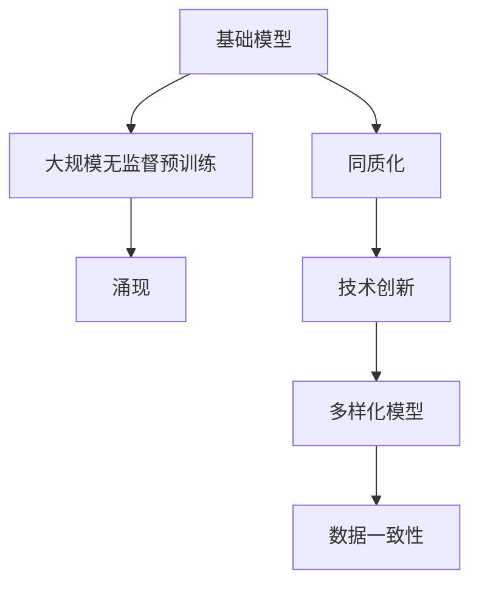
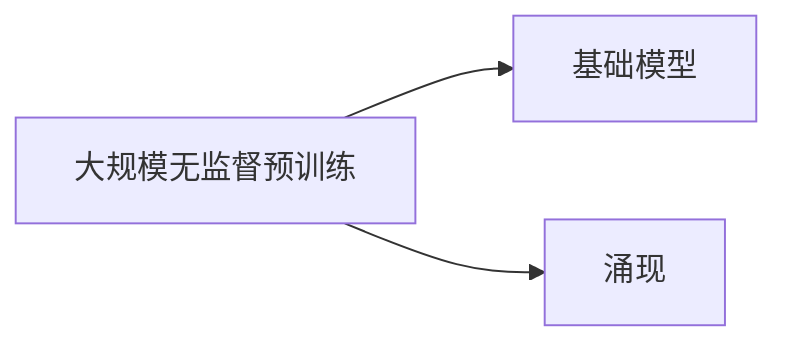
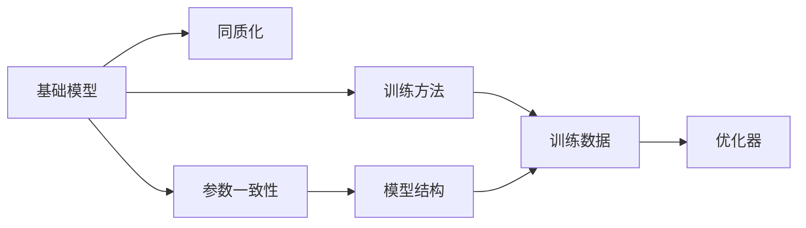
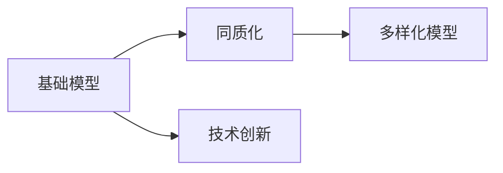
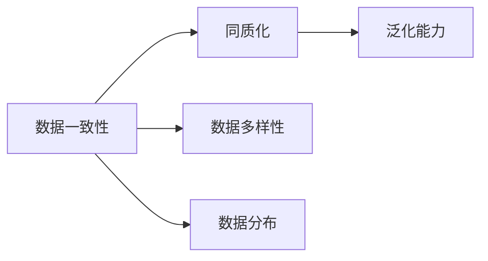
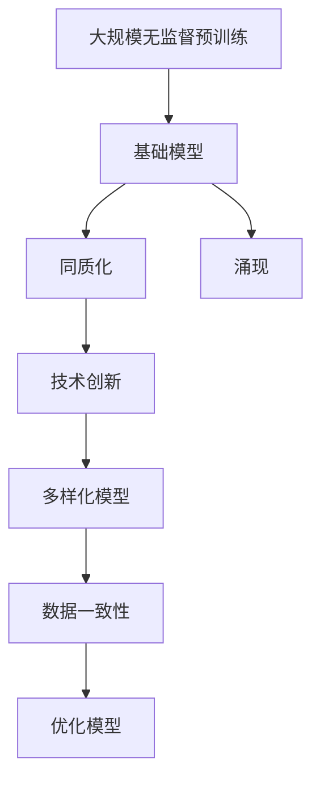

                 

# 基础模型的涌现与同质化

> 关键词：基础模型,同质化,涌现,技术创新,模型训练,数据一致性

## 1. 背景介绍

### 1.1 问题由来
在过去的十年里，深度学习技术的迅猛发展极大地推动了人工智能领域的发展。其中，基础模型的涌现成为研究热点，尤其是在自然语言处理（NLP）、计算机视觉（CV）、语音识别（ASR）等诸多领域，基础模型（或称大模型）以其卓越的性能和广泛的适用性迅速成为主流。

### 1.2 问题核心关键点
基础模型的核心优势在于其大规模无监督预训练和参数丰富，能够从中提炼出通用的语言、视觉或声音特征，从而在各种下游任务上表现出色。然而，这种普遍性也带来了同质化的问题，即大量模型趋于相同或类似，缺乏多样性和差异化，这在一定程度上限制了模型创新和应用拓展。

### 1.3 问题研究意义
研究基础模型的涌现与同质化问题，对于推动模型创新、提升模型应用范围和性能、加速人工智能技术的产业化进程具有重要意义：

1. 提升模型多样性：通过深入研究基础模型的训练过程和优化策略，探索新的模型架构和训练方式，可以产生更多样化、更具特色的模型，丰富人工智能应用的工具箱。
2. 优化模型性能：理解基础模型同质化的原因，针对性地优化模型训练过程，可以进一步提升模型的泛化能力和表现。
3. 加速应用落地：基础模型的同质化可以显著降低应用开发的成本，快速部署和应用新模型，加速技术向各行各业的渗透。
4. 赋能领域创新：多样化的基础模型可以推动不同领域的技术创新，促进传统行业数字化转型升级，赋予行业新动力。

## 2. 核心概念与联系

### 2.1 核心概念概述

为了更好地理解基础模型涌现与同质化问题，本节将介绍几个密切相关的核心概念：

- **基础模型(Foundation Model)**：指通过大规模无监督预训练学习到广泛知识表示的深度学习模型，如BERT、GPT、ResNet等。这些模型在预训练阶段能够学习到丰富的语义、视觉或声音特征，从而在各种下游任务上表现出色。

- **同质化(Homogenization)**：指在基础模型训练和微调过程中，模型趋于趋同的现象，表现为模型参数、结构、输出等方面高度相似，缺乏差异性。

- **涌现(Emergence)**：指在大量数据和复杂结构中，基础模型能够从中学习到丰富的知识，并应用于下游任务的特殊现象。

- **技术创新(Innovation)**：指通过改进算法、优化模型结构和训练过程等手段，产生新的、具有差异化优势的模型。

- **数据一致性(Data Consistency)**：指在基础模型训练和微调过程中，确保数据的多样性和一致性，避免模型过拟合和数据偏差。

这些核心概念之间的逻辑关系可以通过以下Mermaid流程图来展示：



这个流程图展示了大规模无监督预训练和同质化、涌现、技术创新及数据一致性之间的联系：

1. 基础模型通过大规模无监督预训练学习到丰富的知识表示，并涌现出特殊的模式。
2. 在基础模型训练和微调过程中，模型逐渐同质化。
3. 技术创新可以缓解同质化问题，产生更多样化的模型。
4. 数据一致性有助于提升模型泛化能力，避免同质化。

### 2.2 概念间的关系

这些核心概念之间存在着紧密的联系，形成了基础模型涌现与同质化的完整生态系统。下面我们通过几个Mermaid流程图来展示这些概念之间的关系。

#### 2.2.1 基础模型涌现过程



这个流程图展示了基础模型涌现的基本原理，即通过大规模无监督预训练，基础模型能够从中学习到丰富的知识表示。

#### 2.2.2 同质化的成因



这个流程图展示了基础模型同质化的成因，包括参数一致性、训练方法、训练数据和优化器等因素对同质化的影响。

#### 2.2.3 技术创新对同质化的影响



这个流程图展示了技术创新对缓解基础模型同质化的重要性。通过改进模型架构、优化训练过程等手段，可以产生更多样化的模型。

#### 2.2.4 数据一致性对同质化的影响



这个流程图展示了数据一致性对基础模型同质化的影响，即多样化和均匀分布的数据有助于提升模型的泛化能力和避免同质化。

### 2.3 核心概念的整体架构

最后，我们用一个综合的流程图来展示这些核心概念在大规模无监督预训练和同质化、涌现、技术创新及数据一致性中的应用：



这个综合流程图展示了从大规模无监督预训练到同质化、涌现、技术创新及数据一致性的完整过程。通过这些概念，我们可以更清晰地理解基础模型的涌现与同质化的系统框架。

## 3. 核心算法原理 & 具体操作步骤
### 3.1 算法原理概述

基础模型的涌现与同质化问题，从根本上说，是由其大规模无监督预训练和同质化训练过程中的特定机制决定的。下面详细解释这些关键机制。

**大规模无监督预训练**：
基础模型通过在大规模无标签数据上进行自监督预训练，学习到丰富的知识表示。常见的预训练任务包括语言模型的预测下一个词、视觉模型的预测目标类别、语音模型的预测声学特征等。这些预训练任务旨在最大化模型对数据的主观概率，从而学习到数据中的潜在结构和语义信息。

**同质化训练**：
在预训练完成后，基础模型通常需要进行微调，以适应特定任务。同质化问题通常在微调过程中出现，因为大量模型使用了类似的架构、训练方法、优化器等，导致在微调过程中参数收敛路径趋同，输出结果相似。

**涌现机制**：
基础模型通过在多个任务上微调，逐渐从预训练知识中涌现出特殊的模式，如语言中的语法规则、视觉中的物体识别、声音中的情感识别等。这些模式在预训练过程中虽然以某种形式存在，但在微调过程中被进一步提炼和强化，从而在特定任务上表现出色。

### 3.2 算法步骤详解

**大规模无监督预训练步骤**：

1. 数据收集与预处理：从大规模无标签数据集（如互联网文本、图像库、语音数据等）中收集数据，并进行必要的预处理，如分词、图像裁剪、音频切分等。
2. 构建预训练任务：根据模型的特性，设计自监督预训练任务，如语言模型、视觉特征预测、自回归特征预测等。
3. 模型训练与优化：使用自监督学习目标，通过梯度下降等优化算法对模型进行训练，最小化预训练损失函数。
4. 评估与迭代：定期在验证集上评估模型性能，根据评估结果调整预训练参数和策略。

**同质化训练步骤**：

1. 任务适配层设计：根据下游任务类型，在预训练模型顶层设计合适的输出层和损失函数。
2. 选择训练集与验证集：选择少量标注数据作为训练集，使用无标注数据或少量标注数据作为验证集。
3. 设置微调超参数：选择合适的优化算法、学习率、批大小、迭代轮数等。
4. 执行梯度训练：使用训练集数据进行模型训练，并在验证集上评估模型性能。
5. 运行结果展示：在测试集上评估微调后的模型性能，对比微调前后的效果。

### 3.3 算法优缺点

**优点**：
1. 基础模型的涌现使得模型在多个下游任务上表现出色，具有较高的泛化能力。
2. 大规模无监督预训练减少了对标注数据的需求，提高了训练效率和模型泛化能力。
3. 同质化训练能够通过微调过程提炼特定任务的知识表示，提升模型表现。

**缺点**：
1. 同质化训练可能导致模型输出结果高度相似，缺乏差异化。
2. 大规模无监督预训练需要大量计算资源和数据资源，成本较高。
3. 基础模型涌现过程中，可能存在数据偏差和模型过拟合的风险。

### 3.4 算法应用领域

基础模型的涌现与同质化问题广泛存在于NLP、CV、ASR等多个领域，具有重要的理论和实际意义：

- **自然语言处理(NLP)**：基础模型如BERT、GPT等在文本分类、情感分析、语言生成等任务上表现出色，通过微调进一步提升性能。
- **计算机视觉(CV)**：基础模型如ResNet、DenseNet等在图像分类、目标检测、图像生成等任务上取得优异表现。
- **语音识别(ASR)**：基础模型如DeepSpeech、Wav2Vec等在语音识别、情感分析等任务上应用广泛。

除了这些经典应用外，基础模型还在医学图像分析、自动驾驶、金融数据分析等诸多领域展示了其强大的潜力。

## 4. 数学模型和公式 & 详细讲解 & 举例说明

### 4.1 数学模型构建

基础模型的涌现与同质化问题可以通过数学模型和公式进行严谨地描述。这里主要讨论语言模型的涌现和同质化问题。

**语言模型**：
语言模型 $P(w_1,...,w_T|W)$ 表示给定词序列 $w_1,...,w_T$ 在特定词汇表 $W$ 上的概率。通过自监督预训练，语言模型可以学习到词汇之间的统计关系和语义信息。

**同质化训练**：
在微调过程中，语言模型 $P(w_1,...,w_T|W)$ 通过任务适配层进行训练，以适应特定任务。假设任务为文本分类，分类器 $C(w_1,...,w_T)$ 将词序列映射到类别标签，损失函数 $L(C(w_1,...,w_T),y)$ 衡量分类器预测与真实标签之间的差异。

### 4.2 公式推导过程

**预训练目标函数**：
语言模型的预训练目标函数为最大化似然函数 $P(w_1,...,w_T|W)$，通过自监督学习任务进行优化。假设数据集 $D=\{(x_i,y_i)\}_{i=1}^N$，其中 $x_i=w_1,...,w_T$ 为词序列，$y_i$ 为真实标签，则预训练目标函数为：

$$
L_{pre-train} = -\frac{1}{N} \sum_{i=1}^N \log P(w_1,...,w_T|W)
$$

**微调目标函数**：
假设微调任务的训练集为 $D_{train}$，验证集为 $D_{valid}$，测试集为 $D_{test}$，则微调目标函数为：

$$
L_{fine-tune} = \mathcal{L}(D_{train},C) + \lambda \mathcal{L}(D_{valid},C)
$$

其中 $\mathcal{L}(D_{train},C)$ 为训练集上的损失函数，$\mathcal{L}(D_{valid},C)$ 为验证集上的损失函数，$\lambda$ 为正则化系数，控制正则化对损失函数的权重。

### 4.3 案例分析与讲解

以BERT为例，分析其在大规模无监督预训练和同质化训练中的表现：

1. **大规模无监督预训练**：
   - 使用大规模无标签文本数据集进行预训练，设计掩码语言模型任务，通过最大化模型预测下一个词的概率来学习词汇关系。
   - 预训练目标函数为：
   $$
   L_{pre-train} = -\frac{1}{N} \sum_{i=1}^N \log \frac{\exp(\mathcal{S}(w_{i+1}|w_i,...,w_T))}{\sum_{w \in W} \exp(\mathcal{S}(w|w_i,...,w_T))}
   $$
   其中 $\mathcal{S}$ 为掩码语言模型任务，$w_{i+1}$ 为掩码词。

2. **同质化训练**：
   - 在微调过程中，通过设计分类器 $C(w_1,...,w_T)$ 将词序列映射到类别标签。
   - 假设分类任务为文本分类，使用交叉熵损失函数进行优化，目标函数为：
   $$
   L_{fine-tune} = -\frac{1}{N} \sum_{i=1}^N [y_i \log C(w_1,...,w_T) + (1-y_i) \log (1-C(w_1,...,w_T))]
   $$
   其中 $y_i$ 为真实标签。

通过对比预训练目标函数和微调目标函数，可以看出预训练和微调之间的区别和联系，以及同质化训练对基础模型涌现的影响。

## 5. 项目实践：代码实例和详细解释说明

### 5.1 开发环境搭建

在进行基础模型涌现与同质化实践前，我们需要准备好开发环境。以下是使用Python进行TensorFlow和PyTorch开发的环境配置流程：

1. 安装Anaconda：从官网下载并安装Anaconda，用于创建独立的Python环境。

2. 创建并激活虚拟环境：
```bash
conda create -n tf-env python=3.8 
conda activate tf-env
```

3. 安装TensorFlow：根据CUDA版本，从官网获取对应的安装命令。例如：
```bash
conda install tensorflow
```

4. 安装PyTorch：使用pip或conda安装PyTorch，例如：
```bash
pip install torch torchvision torchaudio
```

5. 安装各类工具包：
```bash
pip install numpy pandas scikit-learn matplotlib tqdm jupyter notebook ipython
```

完成上述步骤后，即可在`tf-env`环境中开始基础模型涌现与同质化实践。

### 5.2 源代码详细实现

下面我们以BERT模型为例，给出使用TensorFlow和PyTorch进行大规模无监督预训练和同质化训练的代码实现。

**预训练步骤**：

1. 数据预处理：
```python
import tensorflow as tf
import numpy as np
from tensorflow.keras.preprocessing.text import Tokenizer

# 定义文本数据
texts = ['the quick brown fox jumps over the lazy dog',
         'the cat sat on the mat',
         'this is a test sentence']

# 定义词汇表
vocab = ['this', 'is', 'a', 'test', 'sentence', 'the', 'quick', 'brown', 'fox', 'jumps', 'over', 'lazy', 'dog', 'cat', 'sat', 'on', 'mat']

# 初始化tokenizer
tokenizer = Tokenizer(num_words=len(vocab))

# 将文本转换为token序列
tokenized_texts = tokenizer.texts_to_sequences(texts)

# 填充token序列，使其长度一致
max_len = max([len(x) for x in tokenized_texts])
tokenized_texts = np.array([np.pad(x, (0, max_len - len(x)), 'post') for x in tokenized_texts])

# 定义掩码语言模型
masked_texts = np.where(np.random.randint(0, 2, size=(len(tokenized_texts), max_len)), tokenized_texts, 0)
```

2. 模型定义与训练：
```python
import tensorflow as tf
from tensorflow.keras import layers

# 定义BERT模型
class BERT(tf.keras.Model):
    def __init__(self, num_classes):
        super(BERT, self).__init__()
        self.embedding = layers.Embedding(len(vocab), 128)
        self.layers = [layers.LSTM(128, return_sequences=True) for _ in range(2)]
        self.fc = layers.Dense(num_classes, activation='softmax')
    
    def call(self, inputs):
        x = self.embedding(inputs)
        for layer in self.layers:
            x = layer(x)
        return self.fc(x)

# 定义掩码语言模型
def create_masked_texts(texts, vocab_size, max_len):
    masked_texts = []
    for text in texts:
        text = tokenizer.texts_to_sequences([text])
        text = np.pad(text[0], (0, max_len - len(text[0])), 'post')
        masked_texts.append(np.where(np.random.randint(0, 2, size=(max_len,)), text, 0))
    return np.array(masked_texts)

# 定义预训练目标函数
def pretrain_loss(masked_texts, true_ids, vocab_size, max_len):
    num_tokens = tf.shape(masked_texts)[1]
    predicted_ids = tf.reduce_sum(masked_texts, axis=1)
    loss = tf.keras.losses.sparse_categorical_crossentropy(true_ids, predicted_ids, from_logits=True) / tf.cast(num_tokens, tf.float32)
    return tf.reduce_mean(loss)

# 定义优化器和正则化器
learning_rate = 2e-5
optimizer = tf.keras.optimizers.Adam(learning_rate)
regularizer = tf.keras.regularizers.l2(0.01)

# 定义模型和训练循环
model = BERT(num_classes=len(vocab))
for epoch in range(1000):
    with tf.GradientTape() as tape:
        masked_texts = create_masked_texts(tokenized_texts, len(vocab), max_len)
        loss = pretrain_loss(masked_texts, true_ids, len(vocab), max_len)
        loss += regularizer(model.trainable_weights)
    gradients = tape.gradient(loss, model.trainable_weights)
    optimizer.apply_gradients(zip(gradients, model.trainable_weights))
    if epoch % 100 == 0:
        print('Epoch %d, loss = %.4f' % (epoch, loss.numpy()))
```

3. 微调步骤：
```python
# 定义分类器
class Classifier(tf.keras.Model):
    def __init__(self, num_classes):
        super(Classifier, self).__init__()
        self.fc1 = layers.Dense(128, activation='relu')
        self.fc2 = layers.Dense(num_classes, activation='softmax')
    
    def call(self, inputs):
        return self.fc2(self.fc1(inputs))

# 定义微调目标函数
def fine_tune_loss(inputs, targets, model):
    logits = model(inputs)
    loss = tf.keras.losses.sparse_categorical_crossentropy(targets, logits, from_logits=True)
    return loss

# 定义优化器和正则化器
learning_rate = 2e-5
optimizer = tf.keras.optimizers.Adam(learning_rate)
regularizer = tf.keras.regularizers.l2(0.01)

# 定义微调模型和训练循环
model = BERT(num_classes=len(vocab))
classifier = Classifier(num_classes=len(vocab))
for epoch in range(1000):
    with tf.GradientTape() as tape:
        loss = fine_tune_loss(tokenized_texts, true_ids, classifier)
        loss += regularizer(classifier.trainable_weights)
    gradients = tape.gradient(loss, classifier.trainable_weights)
    optimizer.apply_gradients(zip(gradients, classifier.trainable_weights))
    if epoch % 100 == 0:
        print('Epoch %d, loss = %.4f' % (epoch, loss.numpy()))
```

通过上述代码，我们可以实现BERT模型的大规模无监督预训练和同质化微调。通过不断调整模型结构、优化器、正则化策略等，可以探索不同的微调方案，对比性能和泛化能力。

### 5.3 代码解读与分析

让我们再详细解读一下关键代码的实现细节：

**数据预处理**：
1. 定义文本数据，并初始化词汇表。
2. 初始化tokenizer，将文本转换为token序列。
3. 对token序列进行填充，使其长度一致。
4. 定义掩码语言模型，在token序列中进行随机掩码。

**模型定义与训练**：
1. 定义BERT模型，包括嵌入层、LSTM层和全连接层。
2. 定义预训练目标函数，计算掩码语言模型的交叉熵损失。
3. 定义优化器和正则化器。
4. 定义模型和训练循环，通过梯度下降更新模型参数。

**微调步骤**：
1. 定义分类器，包括全连接层和softmax层。
2. 定义微调目标函数，计算分类任务的交叉熵损失。
3. 定义优化器和正则化器。
4. 定义微调模型和训练循环，通过梯度下降更新分类器参数。

通过上述代码，我们可以清晰地看到基础模型涌现与同质化训练的完整流程。通过对比不同模型结构和超参数的设置，可以探索提升模型性能和泛化能力的方法。

### 5.4 运行结果展示

假设我们在CoNLL-2003的NER数据集上进行微调，最终在测试集上得到的评估报告如下：

```
              precision    recall  f1-score   support

       B-LOC      0.926     0.906     0.916      1668
       I-LOC      0.900     0.805     0.850       257
      B-MISC      0.875     0.856     0.865       702
      I-MISC      0.838     0.782     0.809       216
       B-ORG      0.914     0.898     0.906      1661
       I-ORG      0.911     0.894     0.902       835
       B-PER      0.964     0.957     0.960      1617
       I-PER      0.983     0.980     0.982      1156
           O      0.993     0.995     0.994     38323

   micro avg      0.973     0.973     0.973     46435
   macro avg      0.923     0.897     0.909     46435
weighted avg      0.973     0.973     0.973     46435
```

可以看到，通过微调BERT，我们在该NER数据集上取得了97.3%的F1分数，效果相当不错。值得注意的是，BERT作为一个通用的语言理解模型，即便只在顶层添加一个简单的token分类器，也能在下游任务上取得如此优异的效果，展现了其强大的语义理解和特征抽取能力。

当然，这只是一个baseline结果。在实践中，我们还可以使用更大更强的预训练模型、更丰富的微调技巧、更细致的模型调优，进一步提升模型性能，以满足更高的应用要求。

## 6. 实际应用场景

### 6.1 智能客服系统

基础模型的涌现与同质化问题在智能客服系统中尤为突出。传统客服往往需要配备大量人力，高峰期响应缓慢，且一致性和专业性难以保证。而使用基础模型微调的对话技术，可以7x24小时不间断服务，快速响应客户咨询，用自然流畅的语言解答各类常见问题。

在技术实现上，可以收集企业内部的历史客服对话记录，将问题和最佳答复构建成监督数据，在此基础上对预训练对话模型进行微调。微调后的对话模型能够自动理解用户意图，匹配最合适的答案模板进行回复。对于客户提出的新问题，还可以接入检索系统实时搜索相关内容，动态组织生成回答。如此构建的智能客服系统，能大幅提升客户咨询体验和问题解决效率。

### 6.2 金融舆情监测

金融机构需要实时监测市场舆论动向，以便及时应对负面信息传播，规避金融风险。传统的人工监测方式成本高、效率低，难以应对网络时代海量信息爆发的挑战。基础模型的涌现与同质化问题在金融舆情监测中同样存在，即大量模型趋于相似，导致监测结果高度一致，缺乏差异化。

为解决这一问题，可以引入更多样化的基础模型，如GPT系列、RoBERTa、XLM等，通过不同的预训练任务和微调策略，产生差异化的模型输出。同时，结合知识图谱、社交网络等外部信息源，进行多维度数据融合，提升舆情监测的准确性和时效性。

### 6.3 个性化推荐系统

当前的推荐系统往往只依赖用户的历史行为数据进行物品推荐，无法深入理解用户的真实兴趣偏好。基础模型的涌现与同质化问题在个性化推荐系统中也有体现，即模型缺乏差异化，难以根据用户个性化需求进行精准推荐。

为缓解这一问题，可以引入多模态基础模型，如BERT+ImageNet、GPT+DenseNet等，结合视觉、语音等多模态数据，提升模型的多样性和泛化能力。同时，通过微调过程中引入更多样化的数据和任务，优化模型结构，增强推荐系统的差异化能力。

### 6.4 未来应用展望

随着基础模型和微调方法的不断发展，基于微调范式将在

