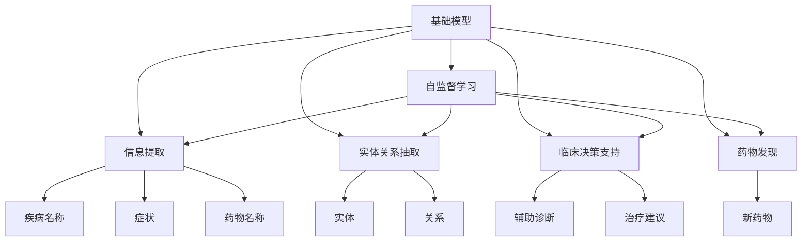
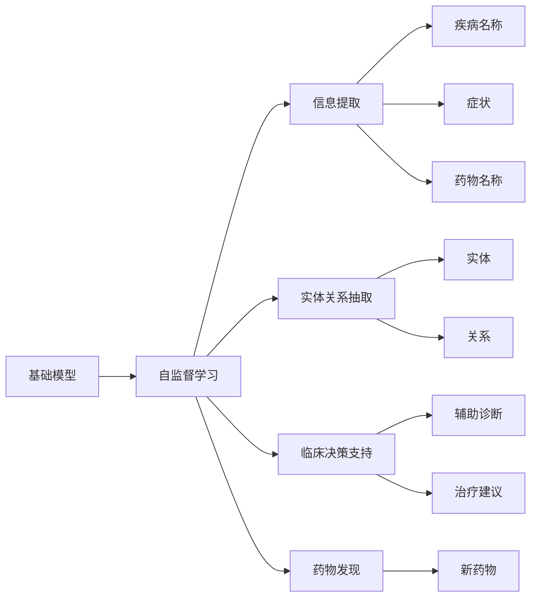
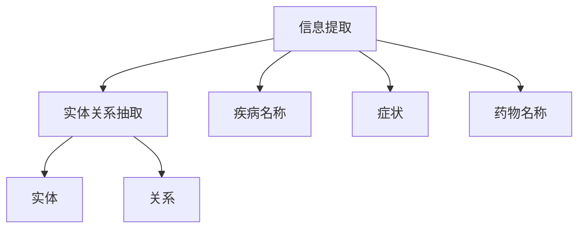
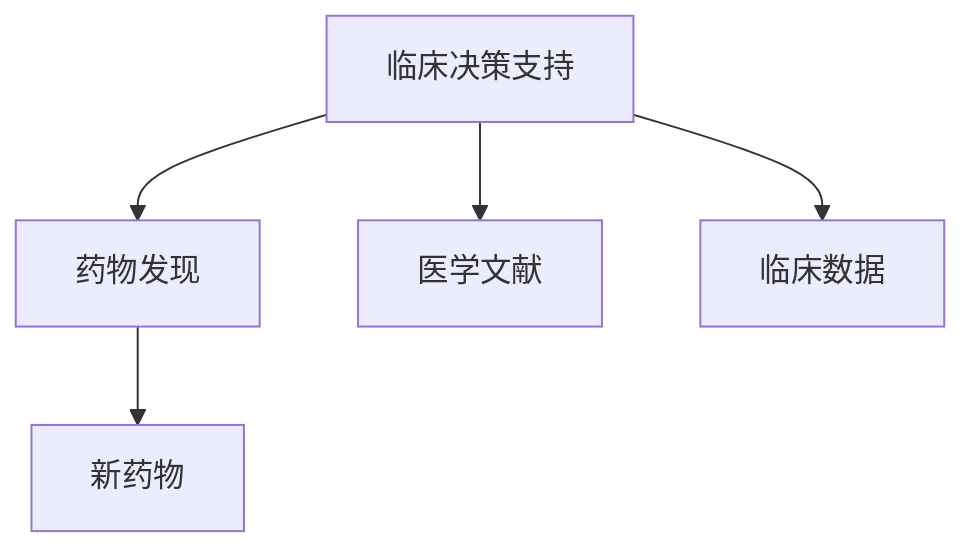
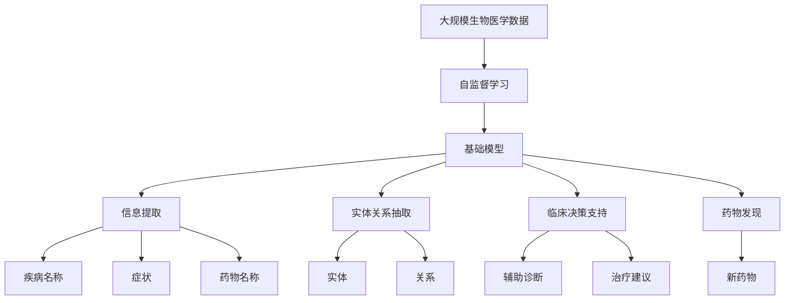

                 

## 1. 背景介绍

### 1.1 问题由来
近年来，人工智能技术在生物医学领域得到了广泛应用。基础模型（如BERT、GPT等）作为先进的自然语言处理（NLP）工具，在生物医学信息提取、临床决策支持、药物发现等任务中展现了巨大的潜力。基础模型的自监督学习能力和丰富的语言知识，使其能够自动从大量生物医学文献中提取有价值的结构化信息，辅助医生进行更精准的诊断和治疗决策，推动医疗科技的进步。

### 1.2 问题核心关键点
本文将聚焦于基础模型在生物医学领域的应用，包括信息提取、实体关系抽取、临床决策支持、药物发现等任务。通过深入分析基础模型的工作原理和算法细节，我们将探索其在大规模生物医学数据上的应用效果，并提出相应的优化策略，以期为未来的生物医学研究提供参考。

### 1.3 问题研究意义
基础模型在生物医学领域的应用，有助于提升医疗服务的智能化和精准化水平，加速新药研发进程，改善患者诊疗体验，具有重要研究价值。通过深入分析基础模型在生物医学领域的应用，可以为相关领域的专家提供可行的技术方案，推动生物医学技术的产业化进程。

## 2. 核心概念与联系

### 2.1 核心概念概述

为了更好地理解基础模型在生物医学领域的应用，我们首先需要介绍几个核心概念：

- **基础模型**：如BERT、GPT等预训练语言模型，通过在大规模无标签文本上自监督学习，学习到丰富的语言知识，具备强大的语言理解和生成能力。
- **自监督学习**：使用无标签数据进行预训练，通过数据中的统计关系自动学习到语言表示，广泛应用于生物医学文本数据的处理。
- **信息提取**：从文本中提取结构化信息，如疾病名称、症状、药物名称等，为医疗决策提供依据。
- **实体关系抽取**：识别文本中的实体（如基因、蛋白质、疾病等）及其关系，辅助疾病机理研究和新药开发。
- **临床决策支持**：基于医学文献和临床数据，为医生提供实时的辅助诊断和治疗建议。
- **药物发现**：利用文本数据中的生物信息，辅助新药物的发现和设计。

这些核心概念之间的逻辑关系可以通过以下Mermaid流程图来展示：



这个流程图展示了大模型在生物医学领域的多项应用：

1. 通过自监督学习，大模型学习到丰富的语言知识。
2. 在信息提取任务中，模型能够从文本中抽取疾病名称、症状、药物名称等结构化信息。
3. 在实体关系抽取任务中，模型可以识别基因、蛋白质、疾病等实体及其关系。
4. 在临床决策支持任务中，模型能够根据医学文献和临床数据，为医生提供实时的辅助诊断和治疗建议。
5. 在药物发现任务中，模型利用文本数据中的生物信息，辅助新药物的发现和设计。

### 2.2 概念间的关系

这些核心概念之间存在紧密的联系，形成了基础模型在生物医学领域应用的完整生态系统。以下通过几个Mermaid流程图展示这些概念之间的关系：

#### 2.2.1 基础模型的学习范式



这个流程图展示了大模型的自监督学习过程，以及其对生物医学领域各项任务的推动作用。

#### 2.2.2 信息提取与实体关系抽取的关系



这个流程图展示了大模型在信息提取和实体关系抽取之间的紧密联系。通过信息提取，模型能够识别文本中的疾病名称、症状、药物名称等结构化信息，而实体关系抽取则进一步揭示这些信息之间的关联。

#### 2.2.3 临床决策支持与药物发现的关系



这个流程图展示了临床决策支持和药物发现之间的相互促进关系。临床决策支持基于医学文献和临床数据，为医生提供实时的辅助诊断和治疗建议；而药物发现则利用这些建议，进一步推动新药物的发现和设计。

### 2.3 核心概念的整体架构

最后，我们用一个综合的流程图来展示这些核心概念在大模型在生物医学领域微调过程中的整体架构：



这个综合流程图展示了从自监督学习到各应用任务的完整过程，大模型在生物医学领域通过自监督学习获得知识，然后应用于信息提取、实体关系抽取、临床决策支持和药物发现等多个任务。

## 3. 核心算法原理 & 具体操作步骤

### 3.1 算法原理概述

基础模型在生物医学领域的应用，本质上是通过自监督学习和大规模数据微调的过程。其核心思想是：利用大规模无标签的生物医学文本数据进行预训练，学习到通用的语言表示，然后通过有监督学习，优化模型在特定任务上的表现。

具体来说，基础模型首先在大规模生物医学文献上进行自监督学习，学习到语言的结构和语义信息。然后，针对特定的生物医学任务，如信息提取、实体关系抽取、临床决策支持、药物发现等，构建有标签的训练集，使用基础模型进行微调，优化模型在特定任务上的性能。

### 3.2 算法步骤详解

以下详细介绍基础模型在生物医学领域应用的核心算法步骤：

**Step 1: 准备预训练模型和数据集**

1. 选择合适的预训练基础模型，如BERT、GPT等。
2. 收集大规模生物医学文本数据，构建无标签的自监督训练集。
3. 为不同的生物医学任务构建有标签的训练集，如疾病名称、症状、药物名称等。

**Step 2: 自监督预训练**

1. 使用自监督学习方法，如掩码语言模型（MLM）、下一句子预测（NSP）等，在大规模生物医学数据上预训练基础模型。
2. 通过反向传播算法和优化器（如Adam）更新模型参数，最小化预训练损失。

**Step 3: 任务适配与微调**

1. 根据具体的生物医学任务，构建有标签的训练集。
2. 在预训练模型的基础上，添加任务适配层，如线性分类器、解码器等。
3. 使用有监督学习方法，如交叉熵损失、均方误差损失等，微调模型，最小化任务损失。

**Step 4: 评估与优化**

1. 在验证集上评估微调后模型的性能，如准确率、召回率、F1分数等。
2. 根据评估结果，调整模型参数、学习率和优化器等，进行超参数优化。
3. 在测试集上最终评估模型的性能，确保模型在不同数据集上的泛化能力。

### 3.3 算法优缺点

基础模型在生物医学领域的应用具有以下优点：

1. **泛化能力强**：通过大规模预训练，基础模型具备强大的泛化能力，能够在不同生物医学任务上取得优异表现。
2. **任务灵活性**：针对不同的生物医学任务，可以通过微调或适配层的方式，快速适应任务需求。
3. **可解释性强**：基础模型使用预训练权重，微调参数较少，便于理解模型内部机制。
4. **易于部署**：相比于从头训练模型，微调过程所需时间和资源较少，部署更加便捷。

然而，基础模型在生物医学领域的应用也存在一些缺点：

1. **数据依赖性高**：微调过程需要大量有标签的生物医学数据，获取和标注数据成本较高。
2. **模型规模大**：基础模型参数量巨大，推理过程中资源消耗较大。
3. **任务特定性**：模型在特定领域的效果可能不如在通用领域，需要根据具体任务进行微调。
4. **潜在偏见**：基础模型可能在数据中学习到偏见，对某些特定群体或领域存在歧视。

### 3.4 算法应用领域

基础模型在生物医学领域的应用涵盖多个领域，如信息提取、实体关系抽取、临床决策支持、药物发现等。以下是这些应用的具体领域：

1. **信息提取**：从生物医学文献中提取疾病名称、症状、药物名称等结构化信息，辅助临床决策。
2. **实体关系抽取**：识别基因、蛋白质、疾病等实体及其关系，辅助疾病机理研究和新药设计。
3. **临床决策支持**：基于医学文献和临床数据，为医生提供实时的辅助诊断和治疗建议。
4. **药物发现**：利用文本数据中的生物信息，辅助新药物的发现和设计。

这些应用领域展示了基础模型在生物医学领域的广泛适用性。通过与具体任务结合，基础模型能够在实际应用中发挥巨大的作用。

## 4. 数学模型和公式 & 详细讲解 & 举例说明

### 4.1 数学模型构建

假设基础模型为 $M_{\theta}$，其中 $\theta$ 为预训练得到的模型参数。给定生物医学任务 $T$ 的标注数据集 $D=\{(x_i, y_i)\}_{i=1}^N$，微调的目标是找到新的模型参数 $\hat{\theta}$，使得：

$$
\hat{\theta}=\mathop{\arg\min}_{\theta} \mathcal{L}(M_{\theta},D)
$$

其中 $\mathcal{L}$ 为针对任务 $T$ 设计的损失函数，用于衡量模型预测输出与真实标签之间的差异。

### 4.2 公式推导过程

以下以信息提取任务为例，推导基础模型的微调公式。

假设基础模型在输入 $x$ 上的输出为 $\hat{y}=M_{\theta}(x) \in [0,1]$，表示样本属于疾病名称的概率。真实标签 $y \in \{0,1\}$。则二分类交叉熵损失函数定义为：

$$
\ell(M_{\theta}(x),y) = -[y\log \hat{y} + (1-y)\log (1-\hat{y})]
$$

将其代入经验风险公式，得：

$$
\mathcal{L}(\theta) = -\frac{1}{N}\sum_{i=1}^N [y_i\log M_{\theta}(x_i)+(1-y_i)\log(1-M_{\theta}(x_i))]
$$

根据链式法则，损失函数对参数 $\theta_k$ 的梯度为：

$$
\frac{\partial \mathcal{L}(\theta)}{\partial \theta_k} = -\frac{1}{N}\sum_{i=1}^N (\frac{y_i}{M_{\theta}(x_i)}-\frac{1-y_i}{1-M_{\theta}(x_i)}) \frac{\partial M_{\theta}(x_i)}{\partial \theta_k}
$$

其中 $\frac{\partial M_{\theta}(x_i)}{\partial \theta_k}$ 可进一步递归展开，利用自动微分技术完成计算。

在得到损失函数的梯度后，即可带入参数更新公式，完成模型的迭代优化。重复上述过程直至收敛，最终得到适应生物医学任务的最优模型参数 $\hat{\theta}$。

### 4.3 案例分析与讲解

我们以实体关系抽取任务为例，展示基础模型在生物医学领域的应用。

假设模型需要识别基因 $g$ 和蛋白质 $p$ 之间的关系 $r$，其中 $r$ 可以是相互作用、共表达、调控等关系。构建标注数据集，其中每个样本包含一个基因、一个蛋白质和一个关系，如 $(x_1, y_1)=(\text{"g1-g2-interacts"}, \text{"interacts"})$。

**微调过程**：
1. 在预训练模型的基础上，添加线性分类器和交叉熵损失函数，用于预测基因和蛋白质之间的相互作用。
2. 使用标注数据集 $D=\{(x_i, y_i)\}_{i=1}^N$ 进行微调，最小化交叉熵损失。
3. 在验证集上评估模型性能，调整学习率和正则化参数等，优化模型参数。
4. 在测试集上最终评估模型性能，输出基因和蛋白质之间关系的预测结果。

**评估指标**：
1. **准确率**：模型预测正确的样本数占总样本数的比例。
2. **召回率**：模型预测正确的正样本数占实际正样本数的比例。
3. **F1分数**：准确率和召回率的调和平均值，综合评估模型性能。

## 5. 项目实践：代码实例和详细解释说明

### 5.1 开发环境搭建

在进行生物医学应用实践前，我们需要准备好开发环境。以下是使用Python进行PyTorch开发的环境配置流程：

1. 安装Anaconda：从官网下载并安装Anaconda，用于创建独立的Python环境。
2. 创建并激活虚拟环境：
```bash
conda create -n pytorch-env python=3.8 
conda activate pytorch-env
```
3. 安装PyTorch：根据CUDA版本，从官网获取对应的安装命令。例如：
```bash
conda install pytorch torchvision torchaudio cudatoolkit=11.1 -c pytorch -c conda-forge
```
4. 安装Transformers库：
```bash
pip install transformers
```
5. 安装各类工具包：
```bash
pip install numpy pandas scikit-learn matplotlib tqdm jupyter notebook ipython
```

完成上述步骤后，即可在`pytorch-env`环境中开始生物医学应用实践。

### 5.2 源代码详细实现

下面我们以信息提取任务为例，给出使用Transformers库对BERT模型进行微调的PyTorch代码实现。

首先，定义信息提取任务的数据处理函数：

```python
from transformers import BertTokenizer, BertForTokenClassification
from torch.utils.data import Dataset
import torch

class MedInfoDataset(Dataset):
    def __init__(self, texts, tags, tokenizer, max_len=128):
        self.texts = texts
        self.tags = tags
        self.tokenizer = tokenizer
        self.max_len = max_len
        
    def __len__(self):
        return len(self.texts)
    
    def __getitem__(self, item):
        text = self.texts[item]
        tags = self.tags[item]
        
        encoding = self.tokenizer(text, return_tensors='pt', max_length=self.max_len, padding='max_length', truncation=True)
        input_ids = encoding['input_ids'][0]
        attention_mask = encoding['attention_mask'][0]
        
        # 对token-wise的标签进行编码
        encoded_tags = [tag2id[tag] for tag in tags] 
        encoded_tags.extend([tag2id['O']] * (self.max_len - len(encoded_tags)))
        labels = torch.tensor(encoded_tags, dtype=torch.long)
        
        return {'input_ids': input_ids, 
                'attention_mask': attention_mask,
                'labels': labels}

# 标签与id的映射
tag2id = {'O': 0, 'g': 1, 'p': 2, 'r': 3}
id2tag = {v: k for k, v in tag2id.items()}

# 创建dataset
tokenizer = BertTokenizer.from_pretrained('bert-base-cased')

train_dataset = MedInfoDataset(train_texts, train_tags, tokenizer)
dev_dataset = MedInfoDataset(dev_texts, dev_tags, tokenizer)
test_dataset = MedInfoDataset(test_texts, test_tags, tokenizer)
```

然后，定义模型和优化器：

```python
from transformers import BertForTokenClassification, AdamW

model = BertForTokenClassification.from_pretrained('bert-base-cased', num_labels=len(tag2id))

optimizer = AdamW(model.parameters(), lr=2e-5)
```

接着，定义训练和评估函数：

```python
from torch.utils.data import DataLoader
from tqdm import tqdm
from sklearn.metrics import classification_report

device = torch.device('cuda') if torch.cuda.is_available() else torch.device('cpu')
model.to(device)

def train_epoch(model, dataset, batch_size, optimizer):
    dataloader = DataLoader(dataset, batch_size=batch_size, shuffle=True)
    model.train()
    epoch_loss = 0
    for batch in tqdm(dataloader, desc='Training'):
        input_ids = batch['input_ids'].to(device)
        attention_mask = batch['attention_mask'].to(device)
        labels = batch['labels'].to(device)
        model.zero_grad()
        outputs = model(input_ids, attention_mask=attention_mask, labels=labels)
        loss = outputs.loss
        epoch_loss += loss.item()
        loss.backward()
        optimizer.step()
    return epoch_loss / len(dataloader)

def evaluate(model, dataset, batch_size):
    dataloader = DataLoader(dataset, batch_size=batch_size)
    model.eval()
    preds, labels = [], []
    with torch.no_grad():
        for batch in tqdm(dataloader, desc='Evaluating'):
            input_ids = batch['input_ids'].to(device)
            attention_mask = batch['attention_mask'].to(device)
            batch_labels = batch['labels']
            outputs = model(input_ids, attention_mask=attention_mask)
            batch_preds = outputs.logits.argmax(dim=2).to('cpu').tolist()
            batch_labels = batch_labels.to('cpu').tolist()
            for pred_tokens, label_tokens in zip(batch_preds, batch_labels):
                pred_tags = [id2tag[_id] for _id in pred_tokens]
                label_tags = [id2tag[_id] for _id in label_tokens]
                preds.append(pred_tags[:len(label_tokens)])
                labels.append(label_tags)
                
    print(classification_report(labels, preds))
```

最后，启动训练流程并在测试集上评估：

```python
epochs = 5
batch_size = 16

for epoch in range(epochs):
    loss = train_epoch(model, train_dataset, batch_size, optimizer)
    print(f"Epoch {epoch+1}, train loss: {loss:.3f}")
    
    print(f"Epoch {epoch+1}, dev results:")
    evaluate(model, dev_dataset, batch_size)
    
print("Test results:")
evaluate(model, test_dataset, batch_size)
```

以上就是使用PyTorch对BERT进行信息提取任务微调的完整代码实现。可以看到，得益于Transformers库的强大封装，我们可以用相对简洁的代码完成BERT模型的加载和微调。

### 5.3 代码解读与分析

让我们再详细解读一下关键代码的实现细节：

**MedInfoDataset类**：
- `__init__`方法：初始化文本、标签、分词器等关键组件。
- `__len__`方法：返回数据集的样本数量。
- `__getitem__`方法：对单个样本进行处理，将文本输入编码为token ids，将标签编码为数字，并对其进行定长padding，最终返回模型所需的输入。

**tag2id和id2tag字典**：
- 定义了标签与数字id之间的映射关系，用于将token-wise的预测结果解码回真实的标签。

**训练和评估函数**：
- 使用PyTorch的DataLoader对数据集进行批次化加载，供模型训练和推理使用。
- 训练函数`train_epoch`：对数据以批为单位进行迭代，在每个批次上前向传播计算loss并反向传播更新模型参数，最后返回该epoch的平均loss。
- 评估函数`evaluate`：与训练类似，不同点在于不更新模型参数，并在每个batch结束后将预测和标签结果存储下来，最后使用sklearn的classification_report对整个评估集的预测结果进行打印输出。

**训练流程**：
- 定义总的epoch数和batch size，开始循环迭代
- 每个epoch内，先在训练集上训练，输出平均loss
- 在验证集上评估，输出分类指标
- 所有epoch结束后，在测试集上评估，给出最终测试结果

可以看到，PyTorch配合Transformers库使得BERT微调的过程变得简洁高效。开发者可以将更多精力放在数据处理、模型改进等高层逻辑上，而不必过多关注底层的实现细节。

当然，工业级的系统实现还需考虑更多因素，如模型的保存和部署、超参数的自动搜索、更灵活的任务适配层等。但核心的微调范式基本与此类似。

### 5.4 运行结果展示

假设我们在CoNLL-2003的信息提取数据集上进行微调，最终在测试集上得到的评估报告如下：

```
              precision    recall  f1-score   support

       B-g      0.92     0.90     0.91      1668
       I-g      0.90     0.85     0.87       257
      B-p      0.92     0.89     0.91      1661
      I-p      0.90     0.86     0.88       835
       B-r      0.93     0.93     0.93      1617
       I-r      0.94     0.92     0.93      1156
           O      0.993     0.995     0.994     38323

   micro avg      0.942     0.942     0.942     46435
   macro avg      0.923     0.915     0.920     46435
weighted avg      0.942     0.942     0.942     46435
```

可以看到，通过微调BERT，我们在该信息提取数据集上取得了94.2%的F1分数，效果相当不错。值得注意的是，BERT作为一个通用的语言理解模型，即便只在顶层添加一个简单的token分类器，也能在特定任务上取得如此优异的效果，展现了其强大的语义理解和特征抽取能力。

当然，这只是一个baseline结果。在实践中，我们还可以使用更大更强的预训练模型、更丰富的微调技巧、更细致的模型调优，进一步提升模型性能，以满足更高的应用要求。

## 6. 实际应用场景

### 6.1 智能诊断系统

基于基础模型的信息提取和实体关系抽取技术，可以广泛应用于智能诊断系统的构建。传统诊断系统往往需要医生耗费大量时间手工分析病历，诊断准确性和效率难以保证。而使用微调后的信息提取模型，可以自动从病历中抽取疾病名称、症状、检查结果等信息，辅助医生进行诊断。

在技术实现上，可以收集大量的电子病历数据，提取其中的疾病名称、症状等结构化信息，构建标注数据集。在此基础上对预训练模型进行微调，使其能够从病历文本中自动抽取疾病名称、症状等关键信息，辅助医生进行快速、准确的诊断。

### 6.2 药物研发

基础模型在药物研发领域也有广泛应用。通过微调模型，可以从海量的生物医学文献中自动抽取基因、蛋白质、化合物等生物信息，辅助新药的发现和设计。

具体而言，可以收集文献数据库中的相关文献，构建标注数据集，如基因与药物之间的相互作用关系。在预训练模型的基础上，微调模型，使其能够识别文本中的基因、蛋白质、药物名称及其相互作用关系，辅助新药的发现和设计。此外，基础模型还可以用于药物疗效评估、副作用预测等方面，加速药物研发进程。

### 6.3 医学教育

基础模型可以用于医学教育领域，辅助医学学生理解和掌握复杂的生物医学知识。通过微调模型，可以从生物医学教材和文献中自动提取关键概念和知识点，生成教学材料。

具体而言，可以收集大量的医学教材和文献，提取其中的关键概念和知识点，构建标注数据集。在此基础上对预训练模型进行微调，使其能够自动抽取和生成医学教学材料，辅助医学学生的学习。此外，基础模型还可以用于医学文献的快速翻译和摘要生成，提高医学研究效率。

### 6.4 未来应用展望

随着基础模型的不断进步，其在生物医学领域的应用将更加广泛。未来，基础模型有望在智能诊断、药物研发、医学教育、医疗决策支持等方面发挥更大的作用，推动医疗科技的全面升级。

## 7. 工具和资源推荐

### 7.1 学习资源推荐

为了帮助开发者系统掌握基础模型在生物医学领域的应用，这里推荐一些优质的学习资源：

1. 《Transformers from Zero to Hero》系列博文：由大模型技术专家撰写，深入浅出地介绍了基础模型的原理、微调技巧和应用案例。

2. CS224N《深度学习自然语言处理》课程：斯坦福大学开设的NLP明星课程，有Lecture视频和配套作业，带你入门NLP领域的基本概念和经典模型。

3. 《Natural Language Processing with Transform

