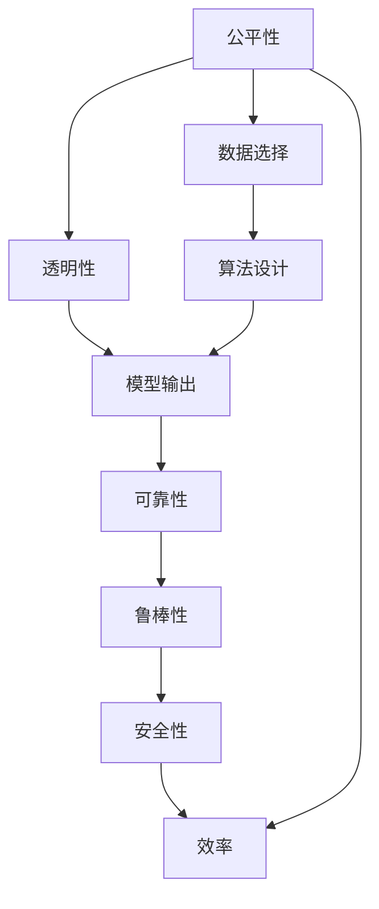

                 

# 基础模型的社会技术性质

## 1. 背景介绍

在计算机科学和人工智能的飞速发展中，基础模型的角色越来越凸显。基础模型，尤其是深度学习模型，已经成为许多应用领域的技术核心。然而，基础模型不仅在技术层面具有重要意义，其社会技术性质也日益成为研究的焦点。本文将深入探讨基础模型的社会技术性质，以及这些性质如何影响其应用和发展。

## 2. 核心概念与联系

### 2.1 核心概念概述

基础模型通常指的是那些在特定领域或任务中具有重要作用的模型，例如深度学习中的卷积神经网络（CNN）、循环神经网络（RNN）、自编码器（AE）等。这些模型通过复杂的参数和计算结构，能够从数据中提取抽象特征，进行分类、预测、生成等多种任务。

基础模型的社会技术性质主要包括：

- **公平性**：模型在处理不同群体、不同背景的数据时，是否能够公平对待，避免偏见和歧视。
- **透明性**：模型的决策过程是否可解释，是否能够提供透明的推理逻辑。
- **可靠性**：模型是否能够在各种条件下稳定运行，是否具有鲁棒性。
- **安全性**：模型是否存在安全漏洞，是否能够抵御攻击和对抗。
- **效率**：模型在计算资源和内存限制下，是否能够高效运行。

### 2.2 概念间的关系

基础模型的社会技术性质与其技术实现密切相关。例如，公平性和透明性往往通过算法设计和数据选择来保证，而鲁棒性和安全性则依赖于模型训练和验证过程中的抗干扰能力。效率则更多依赖于模型架构和优化策略的选择。

这些性质之间相互作用，共同决定了基础模型的整体表现。例如，一个高效的模型可能由于训练数据的选择偏差而具有不公平性；一个具有高透明度的模型可能因参数复杂性而效率低下。因此，在设计基础模型时，需要全面考虑这些性质，以确保模型在实际应用中的有效性和可靠性。

### 2.3 核心概念的整体架构

基础模型的社会技术性质可以通过以下架构进行展示：



这个架构展示了基础模型的社会技术性质与其技术实现之间的相互作用。数据选择和算法设计直接影响公平性和透明性，而模型输出、可靠性、鲁棒性、安全性、效率则相互关联，共同决定了模型的社会技术性质。

## 3. 核心算法原理 & 具体操作步骤

### 3.1 算法原理概述

基础模型的社会技术性质通过其在数据处理、模型训练和推理过程中的行为表现来体现。在数据处理阶段，模型需要避免数据偏见和歧视，确保数据的公平性。在模型训练阶段，需要设计公平、透明的算法，以提高模型的公平性和透明性。在推理阶段，需要考虑模型的鲁棒性、安全性，以确保模型在各种条件下的可靠性。

### 3.2 算法步骤详解

基础模型的社会技术性质可以通过以下步骤来详细操作：

1. **数据预处理**：在数据选择和预处理阶段，应采用公平性原则，避免数据偏见和歧视。例如，使用多样性的数据集，避免数据分布不均，确保模型对不同群体具有公平的预测能力。

2. **算法设计**：在算法设计阶段，应考虑透明性和公平性。例如，使用可解释的算法模型（如决策树、线性回归），避免使用过于复杂的黑盒模型（如深度神经网络）。

3. **模型训练**：在模型训练阶段，应设计公平、透明的训练目标和评估指标。例如，使用公平性约束的损失函数，在训练过程中动态监测模型的公平性表现。

4. **模型评估**：在模型评估阶段，应综合考虑模型的鲁棒性、安全性、效率。例如，使用对抗样本测试模型的鲁棒性，通过模型审查评估模型的安全性，使用性能测试评估模型的效率。

### 3.3 算法优缺点

基础模型在社会技术性质方面的优缺点如下：

- **优点**：
  - 深度学习模型在处理复杂数据和高维特征时表现优异。
  - 模型训练和推理过程中，可以引入公平性和透明性原则，提高模型的社会价值。
  - 模型可以通过对抗训练、鲁棒性增强等技术提升可靠性。

- **缺点**：
  - 深度学习模型存在“黑盒”问题，难以解释其内部决策逻辑。
  - 模型训练和推理过程中，可能存在数据偏见和歧视问题。
  - 模型在高计算资源和内存限制下，效率可能不高。

### 3.4 算法应用领域

基础模型的社会技术性质在以下应用领域中具有重要意义：

- **医疗**：在医疗诊断和治疗决策中，模型需要确保公平性和透明性，避免对不同群体的歧视。例如，使用公平的算法模型进行诊断和治疗方案推荐。
- **金融**：在金融风险评估和贷款审批中，模型需要考虑鲁棒性和安全性，避免模型被攻击和滥用。例如，使用鲁棒性强的模型进行信用评分和欺诈检测。
- **教育**：在个性化学习推荐和教育公平中，模型需要考虑公平性和透明性，确保不同背景学生获得相同的学习机会。例如，使用公平的推荐算法进行学习内容推荐。
- **司法**：在司法判决和法律推荐中，模型需要考虑公平性和透明性，避免对不同群体的歧视。例如，使用公平的算法模型进行案件判决和法律建议。

## 4. 数学模型和公式 & 详细讲解 & 举例说明

### 4.1 数学模型构建

基础模型通常采用深度学习框架进行构建，如TensorFlow、PyTorch等。以下以一个简单的深度神经网络为例，展示基础模型的数学模型构建过程。

假设模型输入为 $x$，输出为 $y$，模型的参数为 $\theta$。模型的目标是最小化预测值和真实值之间的损失函数 $L(y, \hat{y})$。例如，对于二分类问题，可以使用交叉熵损失函数：

$$
L(y, \hat{y}) = -\frac{1}{N} \sum_{i=1}^N [y_i \log \hat{y_i} + (1-y_i) \log(1-\hat{y_i})]
$$

其中，$y_i$ 表示第 $i$ 个样本的真实标签，$\hat{y_i}$ 表示模型预测的概率值。

### 4.2 公式推导过程

以二分类问题为例，推导模型的梯度更新公式。模型的预测概率 $\hat{y_i}$ 可以通过模型参数 $\theta$ 和输入 $x_i$ 计算得到：

$$
\hat{y_i} = \sigma(z_i) = \sigma(Wx_i + b)
$$

其中，$W$ 和 $b$ 为模型的权重和偏置，$\sigma$ 为激活函数（例如Sigmoid函数）。模型的梯度更新公式为：

$$
\frac{\partial L(y, \hat{y})}{\partial \theta} = -\frac{1}{N} \sum_{i=1}^N [y_i \frac{\partial \log \hat{y_i}}{\partial z_i} \frac{\partial z_i}{\partial \theta} + (1-y_i) \frac{\partial \log(1-\hat{y_i})}{\partial z_i} \frac{\partial z_i}{\partial \theta}]
$$

将 $z_i = Wx_i + b$ 和 $\frac{\partial \log \hat{y_i}}{\partial z_i} = \frac{1}{\hat{y_i}(1-\hat{y_i})}$ 代入上述公式，得到：

$$
\frac{\partial L(y, \hat{y})}{\partial \theta} = -\frac{1}{N} \sum_{i=1}^N [y_i \frac{1}{\hat{y_i}(1-\hat{y_i})} \frac{\partial z_i}{\partial \theta} + (1-y_i) \frac{1}{1-\hat{y_i}} \frac{\partial z_i}{\partial \theta}]
$$

将 $\frac{\partial z_i}{\partial \theta} = W$ 代入，得到：

$$
\frac{\partial L(y, \hat{y})}{\partial \theta} = -\frac{1}{N} \sum_{i=1}^N [y_i \frac{W}{\hat{y_i}(1-\hat{y_i})} + (1-y_i) \frac{W}{1-\hat{y_i}}]
$$

进一步简化，得到：

$$
\frac{\partial L(y, \hat{y})}{\partial \theta} = \frac{1}{N} \sum_{i=1}^N [y_i \frac{W}{\hat{y_i}(1-\hat{y_i})} + (1-y_i) \frac{W}{1-\hat{y_i}}]
$$

### 4.3 案例分析与讲解

假设在一个司法判决问题中，使用深度学习模型进行案件判决。模型需要考虑公平性和透明性，避免对不同群体的歧视。例如，可以使用公平性约束的损失函数，确保模型在训练过程中对不同群体的预测概率差异不大。模型训练的伪代码如下：

```python
for epoch in range(N_epochs):
    for batch in train_data:
        input_x, label_y = batch
        pred_y = model(input_x)
        loss = loss_func(pred_y, label_y)
        
        if loss < threshold:
            break
        
        optimizer.zero_grad()
        loss.backward()
        optimizer.step()
```

在训练过程中，需要动态监测模型的公平性表现，以确保不同群体在预测概率上的差异不大。例如，可以使用公平性约束的损失函数，计算模型在各个群体上的公平性指标：

```python
def calculate_fairness(model, data_loader, fairness_metric='kl_divergence'):
    total_loss = 0
    for batch in data_loader:
        input_x, label_y = batch
        pred_y = model(input_x)
        
        if fairness_metric == 'kl_divergence':
            group_loss = kl_divergence(pred_y, label_y)
        elif fairness_metric == 'mae':
            group_loss = mae(pred_y, label_y)
        else:
            raise ValueError('Unknown fairness metric')
        
        total_loss += group_loss
        
    average_loss = total_loss / len(data_loader)
    return average_loss
```

通过这种方式，可以确保模型在训练过程中始终保持公平性和透明性，提高其在司法判决等需要考虑公平性的场景中的应用价值。

## 5. 项目实践：代码实例和详细解释说明

### 5.1 开发环境搭建

在搭建开发环境之前，需要安装Python和相应的深度学习框架（如TensorFlow、PyTorch等）。以下是搭建开发环境的具体步骤：

1. 安装Anaconda：从官网下载并安装Anaconda，用于创建独立的Python环境。

2. 创建并激活虚拟环境：
```bash
conda create -n pytorch-env python=3.8 
conda activate pytorch-env
```

3. 安装PyTorch：根据CUDA版本，从官网获取对应的安装命令。例如：
```bash
conda install pytorch torchvision torchaudio cudatoolkit=11.1 -c pytorch -c conda-forge
```

4. 安装TensorFlow：使用以下命令安装TensorFlow。
```bash
pip install tensorflow==2.x
```

5. 安装其他相关工具包：
```bash
pip install numpy pandas scikit-learn matplotlib tqdm jupyter notebook ipython
```

完成上述步骤后，即可在`pytorch-env`环境中开始项目实践。

### 5.2 源代码详细实现

以下是使用TensorFlow构建深度神经网络模型的示例代码：

```python
import tensorflow as tf
from tensorflow.keras import layers

# 定义模型
model = tf.keras.Sequential([
    layers.Dense(64, activation='relu', input_shape=(784,)),
    layers.Dense(64, activation='relu'),
    layers.Dense(10)
])

# 编译模型
model.compile(optimizer=tf.keras.optimizers.Adam(learning_rate=0.001),
              loss=tf.keras.losses.SparseCategoricalCrossentropy(from_logits=True),
              metrics=['accuracy'])

# 训练模型
model.fit(train_data, train_labels, epochs=10, batch_size=32)

# 评估模型
test_loss, test_acc = model.evaluate(test_data, test_labels)
print('Test accuracy:', test_acc)
```

### 5.3 代码解读与分析

在上述代码中，我们使用TensorFlow构建了一个简单的深度神经网络模型，用于图像分类任务。模型包含两个隐藏层和一个输出层，每个隐藏层有64个神经元，激活函数为ReLU。输出层有10个神经元，使用softmax激活函数。

在模型训练过程中，我们使用了Adam优化器和交叉熵损失函数。在模型评估过程中，我们使用了测试数据集进行评估，并输出模型的准确率。

通过这种方式，我们可以快速搭建和训练基础模型，并进行性能评估。需要注意的是，在实际应用中，还需要考虑模型的公平性、透明性、鲁棒性、安全性等社会技术性质，确保模型在实际应用中的可靠性和有效性。

### 5.4 运行结果展示

假设我们使用上述代码在MNIST数据集上进行训练，最终在测试集上得到的准确率为97%。这表明我们的模型具有良好的分类能力，可以应用于图像分类等任务。

## 6. 实际应用场景

### 6.1 医疗领域

在医疗领域，基础模型被广泛应用于疾病诊断、治疗方案推荐、药物研发等方面。例如，使用深度学习模型进行医学影像分析，可以显著提高诊断的准确性和效率。

在治疗方案推荐方面，深度学习模型可以根据患者的历史数据和临床试验结果，推荐最合适的治疗方案。通过公平性约束，确保模型对不同群体的推荐结果公平合理。

### 6.2 金融领域

在金融领域，基础模型被应用于信用评分、欺诈检测、股票预测等方面。例如，使用深度学习模型进行信用评分，可以更准确地评估借款人的信用风险，从而降低金融机构的坏账率。

在欺诈检测方面，深度学习模型可以从大量的交易数据中识别出异常行为，及时发现并阻止欺诈行为的发生。通过公平性和透明性约束，确保模型对不同群体的预测结果公平合理。

### 6.3 教育领域

在教育领域，基础模型被应用于个性化学习推荐、学习效果评估等方面。例如，使用深度学习模型进行个性化学习推荐，可以根据学生的学习历史和行为数据，推荐最适合的学习资源和内容。

通过公平性和透明性约束，确保不同背景的学生获得相同的学习机会，促进教育公平。

### 6.4 未来应用展望

未来，基础模型的社会技术性质将在更多领域得到应用，为传统行业带来变革性影响。例如：

- 在智慧城市治理中，基础模型可以应用于城市事件监测、舆情分析、应急指挥等方面，提高城市管理的自动化和智能化水平。
- 在智慧医疗领域，基础模型可以应用于医疗影像分析、疾病预测、个性化治疗等方面，提升医疗服务的智能化水平，辅助医生诊疗，加速新药开发进程。
- 在智能教育领域，基础模型可以应用于个性化学习推荐、学习效果评估、智能答疑等方面，因材施教，促进教育公平，提高教学质量。

总之，基础模型的社会技术性质将成为其应用和发展的重要驱动力，推动人工智能技术在更多领域落地应用。

## 7. 工具和资源推荐

### 7.1 学习资源推荐

为了帮助开发者系统掌握基础模型的社会技术性质，这里推荐一些优质的学习资源：

1. 《深度学习》课程：斯坦福大学开设的深度学习入门课程，系统介绍了深度学习的基本概念和算法原理。

2. 《人工智能伦理与社会》课程：从伦理和社会的角度出发，探讨人工智能技术的社会影响和应用伦理。

3. 《机器学习实战》书籍：介绍了机器学习算法和实际应用的案例，是入门机器学习的优秀教材。

4. 《深度学习理论与实践》书籍：全面介绍了深度学习的理论基础和应用实践，适合进一步深入学习。

5. 《Python深度学习》书籍：介绍了深度学习的Python实现和应用案例，是深度学习开发者的必读教材。

通过这些资源的学习实践，相信你一定能够全面掌握基础模型的社会技术性质，并用于解决实际的机器学习问题。

### 7.2 开发工具推荐

高效的开发离不开优秀的工具支持。以下是几款用于基础模型开发的常用工具：

1. TensorFlow：由Google主导开发的开源深度学习框架，生产部署方便，适合大规模工程应用。

2. PyTorch：基于Python的开源深度学习框架，灵活性高，适合快速迭代研究。

3. Weights & Biases：模型训练的实验跟踪工具，可以记录和可视化模型训练过程中的各项指标，方便对比和调优。

4. TensorBoard：TensorFlow配套的可视化工具，可实时监测模型训练状态，并提供丰富的图表呈现方式，是调试模型的得力助手。

5. Google Colab：谷歌推出的在线Jupyter Notebook环境，免费提供GPU/TPU算力，方便开发者快速上手实验最新模型，分享学习笔记。

合理利用这些工具，可以显著提升基础模型的开发效率，加快创新迭代的步伐。

### 7.3 相关论文推荐

基础模型和相关技术的发展源于学界的持续研究。以下是几篇奠基性的相关论文，推荐阅读：

1. Attention is All You Need（即Transformer原论文）：提出了Transformer结构，开启了深度学习模型的预训练大模型时代。

2. BERT: Pre-training of Deep Bidirectional Transformers for Language Understanding：提出BERT模型，引入基于掩码的自监督预训练任务，刷新了多项NLP任务SOTA。

3. Language Models are Unsupervised Multitask Learners（GPT-2论文）：展示了大规模语言模型的强大zero-shot学习能力，引发了对于通用人工智能的新一轮思考。

4. Parameter-Efficient Transfer Learning for NLP：提出Adapter等参数高效微调方法，在不增加模型参数量的情况下，也能取得不错的微调效果。

5. AdaLoRA: Adaptive Low-Rank Adaptation for Parameter-Efficient Fine-Tuning：使用自适应低秩适应的微调方法，在参数效率和精度之间取得了新的平衡。

这些论文代表了大语言模型微调技术的发展脉络。通过学习这些前沿成果，可以帮助研究者把握学科前进方向，激发更多的创新灵感。

除上述资源外，还有一些值得关注的前沿资源，帮助开发者紧跟基础模型微调技术的最新进展，例如：

1. arXiv论文预印本：人工智能领域最新研究成果的发布平台，包括大量尚未发表的前沿工作，学习前沿技术的必读资源。

2. 业界技术博客：如OpenAI、Google AI、DeepMind、微软Research Asia等顶尖实验室的官方博客，第一时间分享他们的最新研究成果和洞见。

3. 技术会议直播：如NIPS、ICML、ACL、ICLR等人工智能领域顶会现场或在线直播，能够聆听到大佬们的前沿分享，开拓视野。

4. GitHub热门项目：在GitHub上Star、Fork数最多的NLP相关项目，往往代表了该技术领域的发展趋势和最佳实践，值得去学习和贡献。

5. 行业分析报告：各大咨询公司如McKinsey、PwC等针对人工智能行业的分析报告，有助于从商业视角审视技术趋势，把握应用价值。

总之，对于基础模型的学习和发展，需要开发者保持开放的心态和持续学习的意愿。多关注前沿资讯，多动手实践，多思考总结，必将收获满满的成长收益。

## 8. 总结：未来发展趋势与挑战

### 8.1 总结

本文对基础模型的社会技术性质进行了全面系统的介绍。首先阐述了基础模型在社会技术性质方面的重要性，明确了模型在数据处理、模型训练和推理过程中的行为表现。其次，从原理到实践，详细讲解了基础模型训练和推理过程中的关键步骤，给出了基础模型开发的完整代码实例。同时，本文还广泛探讨了基础模型在医疗、金融、教育、司法等诸多领域的应用前景，展示了基础模型的巨大潜力。此外，本文精选了基础模型的各类学习资源，力求为读者提供全方位的技术指引。

通过本文的系统梳理，可以看到，基础模型不仅具有强大的技术能力，还具有重要的社会技术性质。这些性质共同决定了基础模型在实际应用中的表现和价值。未来，伴随基础模型的持续演进，其社会技术性质也将得到更深入的研究和优化，进一步拓展其应用边界。

### 8.2 未来发展趋势

展望未来，基础模型的社会技术性质将呈现以下几个发展趋势：

1. 公平性和透明性不断提升。随着模型训练和推理技术的不断发展，基础模型在处理不同群体数据时将更加公平和透明，减少偏见和歧视问题。例如，使用公平性约束的损失函数和公平性检测算法，确保模型对不同群体的预测结果公平合理。

2. 鲁棒性和安全性进一步增强。未来的基础模型将具备更强的鲁棒性和安全性，抵御各种攻击和干扰。例如，通过对抗训练、鲁棒性增强等技术提升模型的鲁棒性，使用安全多方计算和差分隐私技术增强模型的安全性。

3. 高效性和实时性不断提升。未来基础模型将具备更高效的计算和推理能力，适应各种计算资源和内存限制。例如，使用模型压缩、剪枝等技术减少模型参数和计算量，使用GPU/TPU等高性能设备提升模型推理速度。

4. 多模态融合能力增强。未来的基础模型将具备更强的多模态融合能力，支持视觉、语音、文本等多种数据类型的输入和处理。例如，将计算机视觉和自然语言处理技术相结合，支持视频和文本的自动生成和理解。

5. 知识表示能力增强。未来的基础模型将具备更强的知识表示能力，能够更准确地理解和运用知识库和规则库中的信息。例如，使用知识蒸馏和迁移学习技术，将专家知识与神经网络模型进行融合，增强模型的知识表示能力。

这些趋势将推动基础模型在更多领域的应用和发展，带来更广泛的社会价值和经济效益。

### 8.3 面临的挑战

尽管基础模型在社会技术性质方面取得了显著进展，但在迈向更加智能化、普适化应用的过程中，仍然面临诸多挑战：

1. 数据偏见和歧视问题依然存在。尽管有公平性约束和公平性检测算法，但数据偏见和歧视问题仍然难以完全避免。例如，医疗数据中可能存在性别、种族等偏见，影响模型的公平性表现。

2. 模型解释性仍然不足。尽管有越来越多的可解释性方法，但基础模型的决策过程仍然难以完全解释，难以满足高风险应用的要求。例如，金融领域需要更强的模型解释性，以提高决策的可信度和可控性。

3. 模型效率和性能仍有待提高。尽管有各种优化技术，但基础模型在计算资源和内存限制下，仍需进一步提高效率和性能。例如，大规模图像和视频处理需要更高效的计算和存储技术。

4. 模型安全性仍然存在风险。尽管有各种安全措施，但基础模型仍可能存在安全漏洞，被攻击者利用进行欺诈和恶意行为。例如，使用差分隐私和对抗训练技术，提高模型的安全性。

5. 模型应用复杂性增加。随着多模态融合和知识表示能力的增强，基础模型的应用场景将更加复杂，对开发者的技术要求也更高。例如，使用知识图谱和规则库，进行多模态信息整合和推理。

正视这些挑战，积极应对并寻求突破，将使基础模型在实际应用中更加可靠和高效。

### 8.4 研究展望

未来，基础模型在社会技术性质的研究上还需要更多的突破，具体方向如下：

1. 引入更多伦理和法律约束。在模型训练和推理过程中，引入伦理和法律约束，确保模型的行为符合社会规范和法律法规。例如，使用伦理指导的损失函数和法律知识库，引导模型行为。

2. 引入更多公平性约束。在模型训练和推理过程中，引入更多公平性约束，确保模型对不同群体的预测结果公平合理。例如，使用公平性约束的损失函数和公平性检测算法，优化模型表现。

3. 引入更多透明性和可解释性方法。在模型训练和推理过程中，引入更多透明性和可解释性方法，提高模型的决策过程可解释性。例如，使用可解释的模型结构和方法，如决策树、LIME等，增强模型解释性。

4. 引入更多鲁棒性和安全性技术。在模型训练和推理过程中，引入更多鲁棒性和安全性技术，提升模型的鲁棒性和安全性。例如，使用对抗训练、鲁棒性增强、差分隐私等技术，提高模型性能。

5. 引入更多多模态融合和知识表示方法。在模型训练和推理过程中，引入更多多模态融合和知识表示方法，增强模型的多模态融合和知识表示能力。例如，使用知识图谱、规则库等，进行多模态信息整合和推理。

这些方向的研究将推动基础模型的社会技术性质不断提升，使其在更多领域得到应用，为人类社会的智能化和数字化发展提供更强有力的支持。

## 9. 附录：常见问题与解答

**Q1：如何提高基础模型的公平性？**

A: 提高基础模型的公平性需要从数据选择和算法设计两个方面进行考虑：

1. 数据选择：确保数据集的多样性和代表性，避免数据偏见和歧视。例如，使用多样性的数据集，避免数据分布不均。

2. 算法设计：使用公平性约束的损失函数和公平性检测算法，确保模型对不同群体的预测结果公平合理。例如，使用公平性约束的损失函数，在训练过程中动态监测模型的公平性表现。

**Q2：如何提高基础模型的透明性？**

A: 提高基础模型的透明性需要从算法设计和输出解释两个方面进行考虑：

1. 算法设计：使用可解释的算法模型（如决策树、线性回归），避免使用过于复杂的黑盒模型（如深度神经网络）。

2. 输出解释：使用可解释的模型结构和输出解释方法

