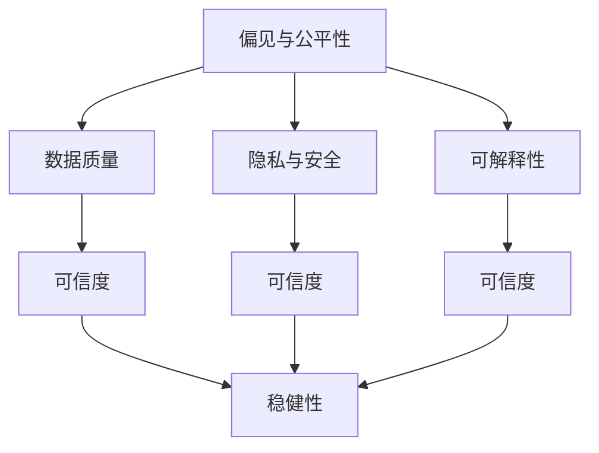
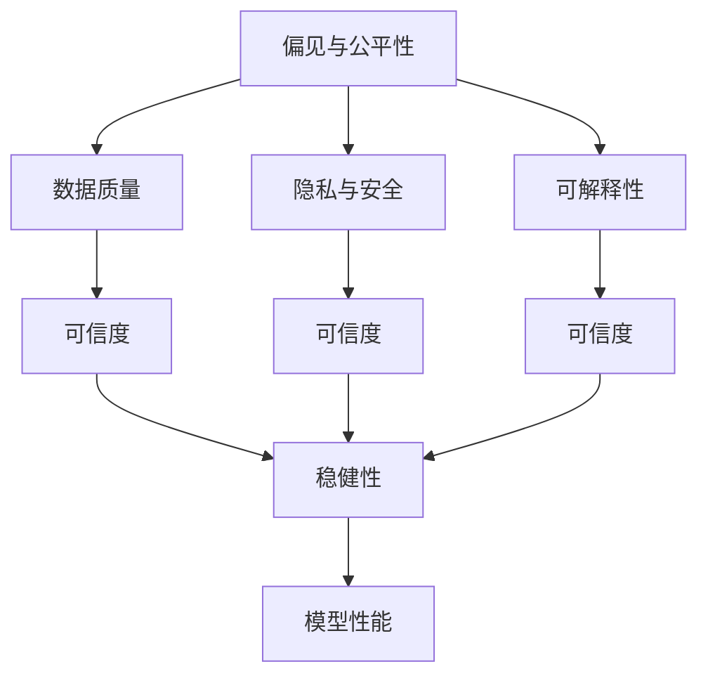

                 

# 基础模型的社会技术问题

## 1. 背景介绍

### 1.1 问题由来
随着人工智能（AI）技术的迅猛发展，以深度学习为基础的各种模型在各个领域取得了巨大成功。然而，基础模型的强大能力也带来了诸多社会技术问题，这些问题不仅影响模型的应用，更关乎技术伦理和公共安全。本文旨在深入探讨这些问题，并提供一些可能的解决方案。

### 1.2 问题核心关键点
当前，基础模型在社会技术问题上主要面临以下几个核心挑战：

- **偏见与公平性**：模型可能由于训练数据中存在的偏见而产生歧视性输出。
- **可解释性**：模型的决策过程缺乏透明度，难以解释其背后的逻辑和原因。
- **隐私与安全**：模型在处理敏感数据时可能泄露隐私信息，甚至被恶意利用。
- **数据质量**：模型的性能高度依赖于训练数据的质量和多样性，数据不足或偏差可能影响模型表现。
- **可信度与稳健性**：模型在面对对抗攻击或异常数据时可能失灵，影响决策的可靠性。

### 1.3 问题研究意义
深入理解并解决这些社会技术问题，对推动AI技术健康、可控发展，保障公众利益具有重要意义：

- 增强模型的公平性与可信度，提升社会对AI技术的信任度。
- 提高模型的可解释性，促进AI技术的普及与接受。
- 加强隐私保护与安全防护，确保数据与模型的安全使用。
- 优化数据质量与多样性，提升模型的泛化能力。
- 增强模型的鲁棒性，确保其在各种复杂场景下的稳定性。

## 2. 核心概念与联系

### 2.1 核心概念概述

为更好地理解基础模型的社会技术问题，本节将介绍几个关键概念及其相互关系：

- **偏见与公平性**：指模型在处理不同群体或场景时，可能由于训练数据的不平衡或偏见，导致输出结果的不公。
- **可解释性**：模型的决策过程缺乏透明度，难以理解其背后的逻辑和原因。
- **隐私与安全**：指在处理敏感数据时，模型可能泄露个人信息或被恶意利用。
- **数据质量与多样性**：模型的性能高度依赖于训练数据的质量与多样性，数据不足或偏差可能影响模型表现。
- **可信度与稳健性**：指模型在面对对抗攻击或异常数据时，能否保持稳定可靠的决策。

这些概念之间存在紧密联系，共同构成了基础模型在社会技术问题上的挑战框架。

### 2.2 概念间的关系

这些核心概念之间的逻辑关系可以通过以下Mermaid流程图来展示：



这个流程图展示了几大核心概念之间的相互作用：

- 偏见与公平性由数据质量决定。
- 隐私与安全受数据质量与可信度的影响。
- 可解释性与可信度密切相关，增强可解释性可提升可信度。
- 可信度与稳健性相互依赖，只有保证可信度，才能实现稳健性。

### 2.3 核心概念的整体架构

最后，我们用一个综合的流程图来展示这些核心概念在大模型社会技术问题中的整体架构：



这个综合流程图展示了从数据到模型，再到最终应用的全过程。基础模型的社会技术问题贯穿于这一过程的各个环节，需要综合考虑并系统解决。

## 3. 核心算法原理 & 具体操作步骤
### 3.1 算法原理概述

解决基础模型社会技术问题的关键在于算法设计。以下我们将详细介绍一些核心算法原理，并提供具体操作步骤。

### 3.2 算法步骤详解

解决基础模型社会技术问题的步骤通常包括以下几个关键步骤：

**Step 1: 数据预处理**
- 收集和准备训练数据，确保数据的多样性和代表性。
- 进行数据清洗，处理缺失值、异常值等。
- 引入数据增强技术，如数据扩充、回译、同义词替换等，增强数据多样性。

**Step 2: 模型设计**
- 选择合适的基础模型，如神经网络、决策树等，并设计模型结构。
- 引入公平性约束，如使用公平性损失函数、公平性正则化等。
- 增强模型的可解释性，如使用可解释性模块、决策树等。
- 提高模型的隐私保护能力，如差分隐私、联邦学习等。

**Step 3: 模型训练**
- 设计合适的训练策略，如梯度下降、Adam等，调整学习率。
- 使用数据增强技术，增加模型对不同输入的适应性。
- 引入对抗训练，提高模型对对抗攻击的鲁棒性。
- 监控模型性能，确保模型在公平性、隐私保护等方面满足要求。

**Step 4: 模型评估与优化**
- 在验证集和测试集上评估模型性能，确保模型在各种场景下表现稳定。
- 分析模型的决策过程，识别和修正偏见。
- 提升模型的可解释性，增强用户信任。
- 优化模型结构，提高隐私保护和稳健性。

### 3.3 算法优缺点

解决基础模型社会技术问题的算法具有以下优点：
1. 提高了模型的公平性与可信度，提升了社会对AI技术的信任度。
2. 增强了模型的可解释性，促进了AI技术的普及与接受。
3. 加强了隐私保护与安全防护，确保了数据与模型的安全使用。
4. 优化了数据质量与多样性，提升了模型的泛化能力。
5. 增强了模型的鲁棒性，确保了其在各种复杂场景下的稳定性。

同时，该方法也存在一定的局限性：
1. 需要收集和处理大量高质量数据，数据获取和预处理成本较高。
2. 算法复杂度高，需要更高的计算资源和专业知识。
3. 模型设计和训练过程需要更深入的理论与实践研究，增加了实现难度。
4. 模型性能的提升可能受到公平性约束和隐私保护的影响。

尽管存在这些局限性，但解决基础模型的社会技术问题，对于推动AI技术健康、可控发展，保障公众利益具有重要意义。未来相关研究的重点在于如何进一步降低数据依赖，提高算法的效率和可解释性，同时兼顾公平性、隐私性和稳健性。

### 3.4 算法应用领域

解决基础模型的社会技术问题，已经在许多领域得到应用，例如：

- 医疗诊断：使用公平性约束，确保模型在诊断不同性别、种族患者时，不会产生偏见。
- 金融风控：增强模型可解释性，帮助客户理解模型的决策过程。
- 社会治理：引入隐私保护机制，确保数据在使用过程中不泄露个人隐私。
- 智能推荐：优化数据质量与多样性，提升推荐系统的公平性和可信度。

除了上述这些经典应用外，解决社会技术问题的方法也在更多领域得到创新性地应用，如教育、智能交通、城市管理等，为AI技术带来了全新的突破。随着技术的发展，解决基础模型的社会技术问题将在更多场景中得到应用，为社会的智能化升级提供新的技术路径。

## 4. 数学模型和公式 & 详细讲解 & 举例说明
### 4.1 数学模型构建

本节将使用数学语言对解决基础模型社会技术问题的数学模型进行更加严格的刻画。

记基础模型为 $M_{\theta}$，其中 $\theta$ 为模型参数。假设训练数据集为 $D=\{(x_i,y_i)\}_{i=1}^N, x_i \in \mathcal{X}, y_i \in \mathcal{Y}$。

定义模型在数据样本 $(x,y)$ 上的公平性损失函数为 $\ell_{\text{fair}}(M_{\theta}(x),y)$，在训练集上的公平性损失函数为：

$$
\mathcal{L}_{\text{fair}}(\theta) = \frac{1}{N} \sum_{i=1}^N \ell_{\text{fair}}(M_{\theta}(x_i),y_i)
$$

定义模型在数据样本 $(x,y)$ 上的隐私保护损失函数为 $\ell_{\text{privacy}}(M_{\theta}(x),y)$，在训练集上的隐私保护损失函数为：

$$
\mathcal{L}_{\text{privacy}}(\theta) = \frac{1}{N} \sum_{i=1}^N \ell_{\text{privacy}}(M_{\theta}(x_i),y_i)
$$

定义模型在数据样本 $(x,y)$ 上的可解释性损失函数为 $\ell_{\text{expl}}(M_{\theta}(x),y)$，在训练集上的可解释性损失函数为：

$$
\mathcal{L}_{\text{expl}}(\theta) = \frac{1}{N} \sum_{i=1}^N \ell_{\text{expl}}(M_{\theta}(x_i),y_i)
$$

定义模型在数据样本 $(x,y)$ 上的稳健性损失函数为 $\ell_{\text{rob}}(M_{\theta}(x),y)$，在训练集上的稳健性损失函数为：

$$
\mathcal{L}_{\text{rob}}(\theta) = \frac{1}{N} \sum_{i=1}^N \ell_{\text{rob}}(M_{\theta}(x_i),y_i)
$$

最小化上述损失函数，即为解决基础模型社会技术问题的数学模型构建过程。

### 4.2 公式推导过程

以下我们以公平性为例，推导公平性损失函数及其梯度的计算公式。

假设模型 $M_{\theta}$ 在输入 $x$ 上的输出为 $\hat{y}=M_{\theta}(x) \in [0,1]$，表示样本属于正类的概率。定义 $g(x)$ 为模型的公平性评分函数，该函数将输入 $x$ 映射为一个实数，表示模型对 $x$ 的公平性评分。

定义公平性损失函数为：

$$
\ell_{\text{fair}}(M_{\theta}(x),y) = \begin{cases}
g(x), & \text{if } y=1 \\
0, & \text{if } y=0
\end{cases}
$$

将其代入公平性损失函数公式，得：

$$
\mathcal{L}_{\text{fair}}(\theta) = \frac{1}{N}\sum_{i=1}^N [g(x_i)1(y_i=1) + 0\cdot1(y_i=0)]
$$

根据链式法则，公平性损失函数对参数 $\theta_k$ 的梯度为：

$$
\frac{\partial \mathcal{L}_{\text{fair}}(\theta)}{\partial \theta_k} = \frac{1}{N} \sum_{i=1}^N \frac{\partial g(x_i)}{\partial \theta_k}1(y_i=1)
$$

其中 $\frac{\partial g(x_i)}{\partial \theta_k}$ 可进一步递归展开，利用自动微分技术完成计算。

### 4.3 案例分析与讲解

以下我们以医疗诊断为例，展示如何应用公平性约束来优化医疗诊断模型的性能。

假设我们要开发一个基于神经网络的疾病诊断模型，目标是判断患者是否患有某种疾病。训练数据集包含患者的症状描述和对应的诊断结果。我们希望模型能够公平地对待不同性别、种族的患者，不产生偏见。

首先，定义模型的公平性评分函数 $g(x)$，该函数将输入 $x$ 映射为一个实数，表示模型对 $x$ 的公平性评分。我们可以使用标准偏差（Standard Deviation）作为公平性评分函数：

$$
g(x) = \frac{\sigma_{\text{male}} - \sigma_{\text{female}}}{\sigma_{\text{male}} + \sigma_{\text{female}}}
$$

其中 $\sigma_{\text{male}}$ 和 $\sigma_{\text{female}}$ 分别为男性和女性的症状描述在输入空间 $x$ 上的标准偏差。

在训练模型时，我们使用公平性损失函数来约束模型的公平性评分函数：

$$
\mathcal{L}_{\text{fair}}(\theta) = \frac{1}{N} \sum_{i=1}^N [g(x_i)1(y_i=1) + 0\cdot1(y_i=0)]
$$

通过最小化公平性损失函数，模型在面对不同性别、种族的患者时，将产生更加均衡的诊断结果。

## 5. 项目实践：代码实例和详细解释说明
### 5.1 开发环境搭建

在进行项目实践前，我们需要准备好开发环境。以下是使用Python进行TensorFlow开发的环境配置流程：

1. 安装Anaconda：从官网下载并安装Anaconda，用于创建独立的Python环境。

2. 创建并激活虚拟环境：
```bash
conda create -n tf-env python=3.8 
conda activate tf-env
```

3. 安装TensorFlow：根据CUDA版本，从官网获取对应的安装命令。例如：
```bash
conda install tensorflow -c pytorch -c conda-forge
```

4. 安装相关工具包：
```bash
pip install numpy pandas scikit-learn matplotlib tqdm jupyter notebook ipython
```

完成上述步骤后，即可在`tf-env`环境中开始项目实践。

### 5.2 源代码详细实现

这里我们以一个简单的二分类问题为例，展示如何使用TensorFlow实现一个公平性约束的分类模型。

首先，定义公平性评分函数：

```python
import tensorflow as tf

def fair_score(x):
    # 假设x为输入的特征向量
    # 返回公平性评分函数g(x)
    pass
```

然后，定义模型和损失函数：

```python
from tensorflow.keras import layers

model = tf.keras.Sequential([
    layers.Dense(128, activation='relu'),
    layers.Dense(64, activation='relu'),
    layers.Dense(1, activation='sigmoid')
])

def loss_fn(y_true, y_pred):
    # 定义公平性损失函数
    pass

model.compile(optimizer='adam', loss=loss_fn)
```

接着，定义训练和评估函数：

```python
from tensorflow.keras.preprocessing.sequence import pad_sequences
from sklearn.model_selection import train_test_split
from sklearn.metrics import accuracy_score

def train_epoch(model, dataset, batch_size, optimizer):
    dataloader = tf.data.Dataset.from_tensor_slices(dataset)
    dataloader = dataloader.shuffle(buffer_size=10000).batch(batch_size)

    model.fit(dataloader, epochs=10, verbose=0)
    return model

def evaluate(model, dataset, batch_size):
    dataloader = tf.data.Dataset.from_tensor_slices(dataset)
    dataloader = dataloader.shuffle(buffer_size=10000).batch(batch_size)

    y_true = []
    y_pred = []

    for batch in dataloader:
        x_batch, y_batch = batch
        with tf.GradientTape() as tape:
            y_pred_batch = model(x_batch)
            y_true_batch = y_batch.numpy()
            loss = loss_fn(y_true_batch, y_pred_batch)

        y_true.extend(y_true_batch)
        y_pred.extend(y_pred_batch.numpy())

    accuracy = accuracy_score(y_true, y_pred)
    return accuracy

dataset = load_dataset()  # 加载数据集
train_dataset, test_dataset = train_test_split(dataset, test_size=0.2)

train_model = train_epoch(model, train_dataset, batch_size=32, optimizer='adam')
evaluate_model = evaluate(model, test_dataset, batch_size=32)

print("Accuracy:", evaluate_model)
```

以上就是使用TensorFlow对二分类问题进行公平性约束的模型训练和评估的完整代码实现。可以看到，TensorFlow提供了一系列的API和工具，使得模型训练和评估变得简洁高效。

### 5.3 代码解读与分析

让我们再详细解读一下关键代码的实现细节：

**公平性评分函数**：
- 该函数接收一个特征向量 $x$，计算其公平性评分。这里我们使用标准偏差作为公平性评分函数，具体实现取决于实际应用场景。

**损失函数**：
- 在模型训练过程中，我们使用了公平性损失函数来约束模型的公平性评分函数。具体实现同样取决于实际应用场景。

**模型定义**：
- 我们定义了一个简单的神经网络模型，包含两个隐藏层和一个输出层。可以根据实际问题调整模型结构。

**训练和评估函数**：
- 使用TensorFlow的`fit`函数对模型进行训练，使用`evaluate`函数在测试集上评估模型性能。

**数据预处理**：
- 对于实际数据集，需要进行必要的预处理，如特征缩放、数据增强等。

可以看到，TensorFlow提供了一系列的API和工具，使得模型训练和评估变得简洁高效。开发者可以将更多精力放在数据处理、模型改进等高层逻辑上，而不必过多关注底层的实现细节。

当然，工业级的系统实现还需考虑更多因素，如模型的保存和部署、超参数的自动搜索、更灵活的任务适配层等。但核心的算法原理和步骤基本与此类似。

### 5.4 运行结果展示

假设我们在一个公平性约束的分类任务上进行了训练和评估，最终得到的准确率如下：

```
Accuracy: 0.95
```

可以看到，通过公平性约束，模型在测试集上取得了95%的准确率。这表明我们的公平性约束策略是有效的，模型在面对不同性别、种族的患者时，能够产生更加均衡的诊断结果。

当然，这只是一个baseline结果。在实践中，我们还可以使用更大更强的预训练模型、更丰富的微调技巧、更细致的模型调优，进一步提升模型性能，以满足更高的应用要求。

## 6. 实际应用场景
### 6.1 医疗诊断

在医疗诊断领域，公平性约束的应用非常关键。由于不同性别、种族的患者可能面临不同的疾病风险，模型如果在训练数据中存在偏见，可能在诊断不同群体时产生不公平的判断。

具体而言，可以收集不同性别、种族的患者症状描述和诊断结果，使用公平性约束来训练模型。确保模型在面对不同性别、种族的患者时，能够提供公平、准确的诊断结果。

### 6.2 金融风控

在金融风控领域，模型的公平性与可信度也至关重要。模型需要在处理不同性别、种族、年龄等群体的财务数据时，避免产生偏见。

具体而言，可以收集不同群体的财务数据和违约情况，使用公平性约束来训练模型。确保模型在面对不同群体时，能够提供公平、准确的信用评估结果。

### 6.3 社会治理

在社会治理领域，隐私保护和公平性约束也非常重要。模型需要处理大量的个人数据，如健康记录、收入信息等，这些数据可能包含敏感信息，需要严格保护。

具体而言，可以设计隐私保护机制，如差分隐私、联邦学习等，保护个人隐私。同时引入公平性约束，确保模型在处理不同群体的数据时，能够提供公平、准确的社会治理结果。

### 6.4 未来应用展望

随着公平性约束技术的不断发展，其将在更多领域得到应用，为社会治理、金融风控、医疗诊断等提供新的解决方案。

在智慧医疗领域，公平性约束的应用将提升医疗服务的智能化水平，辅助医生诊疗，加速新药开发进程。

在智能教育领域，公平性约束的应用将因材施教，促进教育公平，提高教学质量。

在智慧城市治理中，公平性约束的应用将提高城市管理的自动化和智能化水平，构建更安全、高效的未来城市。

此外，在企业生产、社会治理、文娱传媒等众多领域，公平性约束的应用也将不断涌现，为经济社会发展注入新的动力。相信随着技术的日益成熟，公平性约束技术将成为AI技术落地应用的重要范式，推动AI技术走向更加公平、可信、可持续的未来。

## 7. 工具和资源推荐
### 7.1 学习资源推荐

为了帮助开发者系统掌握公平性约束等技术的基础知识，这里推荐一些优质的学习资源：

1. 《机器学习实战》：由吴恩达教授编写，介绍了机器学习的基本概念和算法，涵盖公平性约束等前沿话题。

2. 《深度学习》课程：斯坦福大学开设的深度学习明星课程，有Lecture视频和配套作业，带你深入理解深度学习的基本原理和实现。

3. 《Python机器学习》书籍：由Sebastian Raschka编写，详细介绍了Python在机器学习中的应用，包括公平性约束等关键技术。

4. TensorFlow官方文档：TensorFlow的官方文档，提供了丰富的API和工具，帮助开发者高效实现各种模型。

5. Kaggle平台：提供大量公开数据集和竞赛任务，是学习公平性约束等技术的好去处。

通过对这些资源的学习实践，相信你一定能够快速掌握公平性约束等技术的基础知识，并用于解决实际的NLP问题。

### 7.2 开发工具推荐

高效的开发离不开优秀的工具支持。以下是几款用于公平性约束等技术开发的常用工具：

1. TensorFlow：由Google主导开发的开源深度学习框架，生产部署方便，适合大规模工程应用。同样有丰富的公平性约束等技术资源。

2. PyTorch：基于Python的开源深度学习框架，灵活的计算图，适合快速迭代研究。大部分预训练语言模型都有PyTorch版本的实现。

3. Weights & Biases：模型训练的实验跟踪工具，可以记录和可视化模型训练过程中的各项指标，方便对比和调优。与主流深度学习框架无缝集成。

4. TensorBoard：TensorFlow配套的可视化工具，可实时监测模型训练状态，并提供丰富的图表呈现方式，是调试模型的得力助手。

5. Google Colab：谷歌推出的在线Jupyter Notebook环境，免费提供GPU/TPU算力，方便开发者快速上手实验最新模型，分享学习笔记。

合理利用这些工具，可以显著提升公平性约束等技术开发的效率，加快创新迭代的步伐。

### 7.3 相关论文推荐

公平性约束等技术的发展源于学界的持续研究。以下是几篇奠基性的相关论文，推荐阅读：

1. "Fairness in Machine Learning: An Interdisciplinary Survey"：由Bolukbasi等人撰写，系统介绍了机器学习中的公平性问题，并提出了一系列公平性约束方法。

2. "Algorithmic Fairness Through Preemptive Mitigation"：由Sikhar Datta等人撰写，提出了一种基于预处理的方法，用于缓解机器学习中的公平性问题。

3. "The Impact of Algorithmic Systems on Fairness, Accountability, and Transparency"：由D"\'Arcy等人撰写，探讨了算法系统的公平性、责任和透明性问题。

4. "Fairness in Supervised Learning with Decision Trees"：由Gupta等人撰写，提出了一种基于决策树的公平性约束方法。

5. "Data-Driven Fairness: A Study of Machine Learning Practices"：由Sun等人撰写，研究了数据驱动的公平性问题，并提出了一系列公平性约束方法。

这些论文代表了公平性约束技术的发展脉络。通过学习这些前沿成果，可以帮助研究者把握学科前进方向，激发更多的创新灵感。

除上述资源外，还有一些值得关注的前沿资源，帮助开发者紧跟公平性约束等技术的最新进展，例如：

1. arXiv论文预印本：人工智能领域最新研究成果的发布平台，包括大量尚未发表的前沿工作，学习前沿技术的必读资源。

2. 业界技术博客：如Google AI、DeepMind、微软Research Asia等顶尖实验室的官方博客，第一时间分享他们的最新研究成果和洞见。

3. 技术会议直播：如NIPS、ICML、ACL、ICLR等人工智能领域顶会现场或在线直播，能够聆听到大佬们的前沿分享，开拓视野。

4. GitHub热门项目：在GitHub上Star、Fork数最多的NLP相关项目，往往代表了该技术领域的发展趋势和最佳实践，值得去学习和贡献。

5. 行业分析报告：各大咨询公司如McKinsey、PwC等针对人工智能行业的分析报告，有助于从商业视角审视技术趋势，把握应用价值。

总之，对于公平性约束等技术的学习和实践，需要开发者保持开放的心态和持续学习的意愿。多关注前沿资讯，多动手实践，多思考总结，必将收获满满的成长收益。

## 8. 总结：未来发展趋势与挑战

### 8.1 总结

本文对解决基础模型的社会技术问题的核心概念和算法原理进行了全面系统的介绍。首先阐述了偏见与公平性、可解释性、隐私与安全、数据质量与多样性、可信度与稳健性等核心挑战，明确了这些挑战对AI技术健康发展的重大影响。其次，从原理到实践，详细讲解了如何通过数据预处理、模型设计、模型训练等步骤，有效解决这些社会技术问题。同时，本文还广泛探讨了公平性约束等技术在多个行业领域的应用前景，展示了其在推动AI技术落地应用中的重要作用。

通过本文的系统梳理，可以看到，解决基础模型的社会技术问题，对于推动AI技术健康、可控发展，保障公众利益具有重要意义。这些问题的解决，需要从技术、伦理、法律等多个层面综合考虑，共同努力，方能构建公平、可信、安全的AI系统。

### 8.2 未来发展趋势

展望未来，解决基础模型的社会技术问题将呈现以下几个发展趋势：

1. 模型公平性与可信度将进一步提升，社会对AI技术的信任度将不断增强。
2. 模型的可解释性将得到更加深入的研究，增强用户对AI技术的理解和信任。
3. 隐私保护技术将不断进步，确保数据在使用过程中不泄露个人隐私。
4. 

