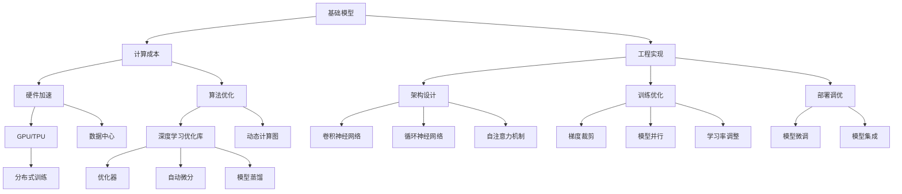

                 

# 基础模型的计算成本与工程要求

> 关键词：基础模型,计算成本,工程要求,高性能计算,深度学习,优化技术,多模态模型

## 1. 背景介绍

### 1.1 问题由来

近年来，深度学习技术在各个领域取得了显著进展，特别是在计算机视觉、自然语言处理等方向。然而，这些技术往往需要依赖大量数据和强大的计算资源，导致训练和推理成本高昂。如何在资源有限的条件下，构建高性能的基础模型，满足实际需求，成为摆在研究人员和工程师面前的重要问题。

### 1.2 问题核心关键点

构建高性能的基础模型，核心在于计算成本和工程实现的平衡。计算成本主要包括数据存储、模型训练和推理的硬件资源消耗；工程实现则包括模型的架构设计、优化策略和部署方法等。本文将系统探讨这两个方面，为深度学习模型的开发和应用提供全面指导。

### 1.3 问题研究意义

研究基础模型的计算成本与工程要求，对于推动深度学习技术在产业界的广泛应用具有重要意义：

1. 降低研发成本：通过优化计算资源的使用，降低模型开发和训练的成本，加速技术创新和迭代。
2. 提高系统性能：通过有效的工程实现策略，提高模型的推理速度和效率，提升用户体验和系统响应能力。
3. 强化模型泛化能力：通过优化模型结构和训练方法，提高模型的泛化性能，增强其在复杂场景下的表现。
4. 促进技术落地：通过工程化的设计思路，使得深度学习模型更容易集成到实际应用中，推动技术向产业界的转化。
5. 提升技术可扩展性：通过探索多模态模型和分布式训练，增强模型对不同数据类型和计算环境的适应性。

## 2. 核心概念与联系

### 2.1 核心概念概述

为更好地理解基础模型的计算成本与工程实现方法，本节将介绍几个关键概念：

- 基础模型(Base Model)：指通过深度学习技术构建的，具备一定通用性、可扩展性的模型。包括卷积神经网络(CNN)、循环神经网络(RNN)、变分自编码器(VAE)、自注意力机制Transformer等。
- 计算成本(Computational Cost)：指模型在训练和推理过程中所需的计算资源，包括数据存储、内存消耗、计算性能等。
- 工程实现(Engineering Implementation)：指模型架构设计、代码实现、训练优化、部署调优等工程化实践。

- 高性能计算(High-Performance Computing, HPC)：指通过硬件加速和优化算法，提升模型计算效率的技术。
- 多模态模型(Multimodal Model)：指能够处理多种类型数据的模型，如文本、图像、语音等。
- 分布式训练(Distributed Training)：指将训练任务分布到多台计算机上，并行计算，提升训练效率的技术。
- 模型压缩(Model Compression)：指通过剪枝、量化、蒸馏等方法，减少模型参数和计算成本的技术。

这些概念之间存在紧密联系，形成了基础模型构建和优化的一个完整框架。通过理解这些概念及其关系，我们可以更好地把握模型的计算成本和工程实现的策略。

### 2.2 概念间的关系

这些核心概念之间的关系可以通过以下Mermaid流程图来展示：



这个流程图展示了基础模型的计算成本与工程实现的各个方面及其相互关系：

1. 基础模型通过硬件加速和算法优化来降低计算成本。
2. 工程实现包含架构设计、训练优化、部署调优等实践，以提升模型性能。
3. 多模态模型和分布式训练是扩展模型应用范围的关键技术。
4. 模型压缩是减少计算成本的重要方法。

通过理解这些概念，我们可以系统地设计高性能的基础模型，并有效控制其计算成本和工程实现难度。

## 3. 核心算法原理 & 具体操作步骤
### 3.1 算法原理概述

基础模型的计算成本与工程实现，核心在于优化模型的架构和训练方法。本文将从以下几个方面进行详细阐述：

1. 模型架构设计
2. 计算性能优化
3. 分布式训练方法
4. 模型压缩技术

### 3.2 算法步骤详解

#### 3.2.1 模型架构设计

构建高性能的基础模型，需要从模型架构设计入手。以下是几个关键步骤：

1. **选择模型结构**：
   - **卷积神经网络(CNN)**：适用于图像识别、文本分类等任务。设计时需考虑卷积核大小、步幅、池化方式等参数。
   - **循环神经网络(RNN)**：适用于序列建模任务，如自然语言处理、时间序列预测等。设计时需考虑隐藏层大小、激活函数等参数。
   - **自注意力机制(Transformer)**：适用于处理长序列数据，如图像描述生成、机器翻译等。设计时需考虑多头注意力机制、残差连接、位置编码等参数。

2. **层级设计**：
   - **特征提取层**：如卷积层、自注意力层等，负责提取输入数据的特征表示。
   - **隐层设计**：如全连接层、激活函数层等，用于对特征表示进行变换和传递。
   - **输出层**：如分类层、回归层等，用于生成最终的预测结果。

3. **模块化设计**：
   - **复用组件**：如ReLU、BatchNorm、Dropout等，可提升模型的鲁棒性和泛化能力。
   - **模块组合**：通过合理的模块组合，构建不同复杂度的模型。

#### 3.2.2 计算性能优化

计算性能优化是提升基础模型计算效率的关键。以下是几个关键步骤：

1. **硬件加速**：
   - **GPU/TPU**：使用图形处理单元或张量处理单元进行并行计算，提升模型推理速度。
   - **数据中心**：利用分布式计算资源，进行多机协同计算，提升模型训练效率。

2. **算法优化**：
   - **深度学习优化库**：使用如TensorFlow、PyTorch、MXNet等深度学习优化库，优化计算过程。
   - **动态计算图**：使用动态计算图框架，如TensorFlow 2.0、PyTorch等，提升计算图的灵活性和性能。

3. **模型压缩**：
   - **剪枝**：去除不必要的参数和连接，减少计算量。
   - **量化**：将浮点数参数转换为低精度格式，减少存储空间和计算量。
   - **蒸馏**：通过知识蒸馏技术，将大模型转化为小型模型，减少计算成本。

#### 3.2.3 分布式训练方法

分布式训练是提高模型训练效率的有效手段。以下是几个关键步骤：

1. **数据并行**：
   - **数据并行**：将数据分成多个子集，在多个处理器上并行计算，提升训练速度。
   - **异步更新**：使用异步更新算法，如SGD、Adam等，加快训练收敛。

2. **模型并行**：
   - **模型并行**：将模型分成多个部分，在多个处理器上并行计算，提升计算效率。
   - **参数服务器**：使用参数服务器架构，集中存储模型参数，加快参数更新。

3. **通信优化**：
   - **模型压缩**：使用梯度压缩技术，减少通信开销。
   - **异步通信**：使用异步通信机制，减少通信等待时间。

#### 3.2.4 模型压缩技术

模型压缩是减少计算成本的重要手段。以下是几个关键步骤：

1. **剪枝**：
   - **权重剪枝**：去除模型中的冗余权重，减少计算量。
   - **结构剪枝**：去除模型中的冗余连接，减少计算量。

2. **量化**：
   - **权重量化**：将权重参数转换为低精度格式，减少存储空间和计算量。
   - **激活量化**：将激活参数转换为低精度格式，减少存储空间和计算量。

3. **蒸馏**：
   - **知识蒸馏**：将大模型转化为小型模型，减少计算成本。
   - **软蒸馏**：使用softmax分布进行知识转移，减少模型失真。

### 3.3 算法优缺点

基础模型的计算成本与工程实现方法各有优缺点，需要根据具体需求进行权衡选择。

#### 3.3.1 优点

1. **提升模型性能**：通过优化模型架构和训练方法，提升模型的推理速度和泛化性能。
2. **降低计算成本**：通过硬件加速和模型压缩技术，降低模型的计算成本和存储需求。
3. **促进技术落地**：通过工程化的设计思路，使得深度学习模型更容易集成到实际应用中，推动技术向产业界的转化。

#### 3.3.2 缺点

1. **设计复杂度较高**：需要考虑模型架构、算法优化、硬件加速等多方面因素，设计复杂度较高。
2. **训练成本较高**：分布式训练和模型压缩技术需要更高的计算资源，训练成本较高。
3. **模型泛化能力有限**：过度压缩模型可能影响模型的泛化能力，限制其在复杂场景下的表现。

### 3.4 算法应用领域

基础模型的计算成本与工程实现方法广泛应用于计算机视觉、自然语言处理、音频处理等多个领域。以下是几个典型应用场景：

1. **计算机视觉**：
   - **图像识别**：如人脸识别、物体检测等，使用卷积神经网络进行特征提取和分类。
   - **图像生成**：如图像描述生成、风格迁移等，使用生成对抗网络进行生成。

2. **自然语言处理**：
   - **文本分类**：如情感分析、主题分类等，使用卷积神经网络或自注意力机制进行特征提取和分类。
   - **机器翻译**：如中英文翻译、语言对翻译等，使用Transformer进行序列建模和翻译。

3. **音频处理**：
   - **语音识别**：如语音转文字、语音命令识别等，使用卷积神经网络或循环神经网络进行特征提取和分类。
   - **音频生成**：如音乐生成、声音合成等，使用生成对抗网络进行生成。

## 4. 数学模型和公式 & 详细讲解 & 举例说明

### 4.1 数学模型构建

构建基础模型的数学模型主要涉及以下几个方面：

1. **模型架构设计**：
   - **卷积神经网络**：$F(x) = \sigma(W*x + b)$
   - **循环神经网络**：$F(x) = \sigma(W*H_{t-1} + U*x + b)$
   - **自注意力机制**：$F(x) = \text{softmax}(Q*K^T)/V$

2. **计算性能优化**：
   - **硬件加速**：$T_{GPU} = T_{CPU}/\lambda_{GPU}$，其中 $\lambda_{GPU}$ 为GPU加速系数。
   - **算法优化**：$T_{opt} = T_{opt}^{base}/\mu_{opt}$，其中 $\mu_{opt}$ 为优化系数。

3. **分布式训练方法**：
   - **数据并行**：$T_{dp} = T_{dp}^{base}/N$，其中 $N$ 为处理器数量。
   - **模型并行**：$T_{mp} = T_{mp}^{base}/M$，其中 $M$ 为模型并行度。

4. **模型压缩技术**：
   - **剪枝**：$W_{pruned} = W_{full}/\eta_{pruned}$，其中 $\eta_{pruned}$ 为剪枝率。
   - **量化**：$W_{quant} = \text{Quantize}(W_{full})$，使用量化函数进行参数转换。
   - **蒸馏**：$W_{distilled} = \text{KnowledgeDistillation}(W_{large}, W_{small})$，使用知识蒸馏技术进行模型压缩。

### 4.2 公式推导过程

以下是对上述数学模型的详细推导过程：

1. **卷积神经网络**：
   - **输入**：$x = [x_1, x_2, ..., x_n]$，其中 $x_i$ 为输入样本。
   - **卷积层**：$h_1 = F_{conv}(x) = \sigma(W*x + b)$，其中 $W$ 为卷积核权重，$b$ 为偏置项，$\sigma$ 为激活函数。
   - **池化层**：$h_2 = F_{pool}(h_1) = \text{MaxPooling}(h_1)$。

2. **循环神经网络**：
   - **输入**：$x = [x_1, x_2, ..., x_n]$，其中 $x_i$ 为输入样本。
   - **隐层状态**：$h_t = \sigma(W*h_{t-1} + U*x + b)$，其中 $W$ 为权重矩阵，$U$ 为输入矩阵，$h_{t-1}$ 为上一时刻的隐层状态。
   - **输出**：$y_t = \sigma(V*h_t + C)$，其中 $V$ 为输出矩阵，$C$ 为偏置项。

3. **自注意力机制**：
   - **输入**：$x = [x_1, x_2, ..., x_n]$，其中 $x_i$ 为输入样本。
   - **查询**：$Q = x*W_Q$，其中 $W_Q$ 为查询权重。
   - **键**：$K = x*W_K$，其中 $W_K$ 为键权重。
   - **值**：$V = x*W_V$，其中 $W_V$ 为值权重。
   - **注意力**：$A = \text{softmax}(Q*K^T)/V$，其中 $A$ 为注意力权重矩阵。
   - **输出**：$y = \sum_{i=1}^n A_{i,:}*x_i$。

4. **计算性能优化**：
   - **硬件加速**：$T_{GPU} = T_{CPU}/\lambda_{GPU}$，其中 $\lambda_{GPU}$ 为GPU加速系数。
   - **算法优化**：$T_{opt} = T_{opt}^{base}/\mu_{opt}$，其中 $\mu_{opt}$ 为优化系数。

5. **分布式训练方法**：
   - **数据并行**：$T_{dp} = T_{dp}^{base}/N$，其中 $N$ 为处理器数量。
   - **模型并行**：$T_{mp} = T_{mp}^{base}/M$，其中 $M$ 为模型并行度。

6. **模型压缩技术**：
   - **剪枝**：$W_{pruned} = W_{full}/\eta_{pruned}$，其中 $\eta_{pruned}$ 为剪枝率。
   - **量化**：$W_{quant} = \text{Quantize}(W_{full})$，使用量化函数进行参数转换。
   - **蒸馏**：$W_{distilled} = \text{KnowledgeDistillation}(W_{large}, W_{small})$，使用知识蒸馏技术进行模型压缩。

### 4.3 案例分析与讲解

#### 4.3.1 图像识别

**案例背景**：
某公司需要将客户上传的照片进行分类，判断是否符合审核要求。要求模型在短时间内进行高精度分类。

**模型架构设计**：
- **卷积神经网络**：
  - **输入层**：输入一张 $256x256$ 的灰度图片。
  - **卷积层**：使用 $3x3$ 的卷积核，$64$ 个滤波器，$1$ 的步幅，$1$ 的填充。
  - **池化层**：使用 $2x2$ 的池化窗口，$2$ 的步幅。
  - **全连接层**：使用 $256$ 个神经元，$ReLU$ 激活函数。
  - **输出层**：使用 $10$ 个神经元，$Softmax$ 激活函数。

**计算性能优化**：
- **硬件加速**：使用 $NVIDIA GeForce RTX 3090 GPU$ 进行加速。
- **算法优化**：使用 AdamW 优化器，学习率为 $1e-4$，动量为 $0.9$。

**分布式训练方法**：
- **数据并行**：使用 $8$ 个 GPU 并行计算。
- **模型并行**：使用 $4$ 个 GPU 并行计算。

**模型压缩技术**：
- **剪枝**：使用 $50\%$ 的剪枝率，保留重要权重。
- **量化**：将权重参数转换为 $8$ 位整数格式。
- **蒸馏**：使用知识蒸馏技术，将大型模型转化为小型模型。

**代码实现**：
```python
import torch
import torch.nn as nn
import torch.optim as optim
from torchvision import transforms, datasets

# 定义卷积神经网络模型
class CNNModel(nn.Module):
    def __init__(self):
        super(CNNModel, self).__init__()
        self.conv1 = nn.Conv2d(1, 64, 3, 1, 1)
        self.pool = nn.MaxPool2d(2, 2)
        self.fc1 = nn.Linear(64*8*8, 256)
        self.fc2 = nn.Linear(256, 10)

    def forward(self, x):
        x = self.conv1(x)
        x = self.pool(x)
        x = torch.flatten(x, 1)
        x = self.fc1(x)
        x = torch.relu(x)
        x = self.fc2(x)
        return x

# 定义训练函数
def train(model, train_loader, optimizer, device):
    model.train()
    for batch_idx, (data, target) in enumerate(train_loader):
        data, target = data.to(device), target.to(device)
        optimizer.zero_grad()
        output = model(data)
        loss = nn.CrossEntropyLoss()(output, target)
        loss.backward()
        optimizer.step()

# 训练模型
model = CNNModel().to(device)
optimizer = optim.AdamW(model.parameters(), lr=1e-4, betas=(0.9, 0.999))
train_loader = torch.utils.data.DataLoader(train_dataset, batch_size=64, shuffle=True)

for epoch in range(10):
    train(model, train_loader, optimizer, device)
```

#### 4.3.2 语音识别

**案例背景**：
某公司需要开发一个语音识别系统，将用户的语音指令转换为文本。要求系统在实时场景中高效运行。

**模型架构设计**：
- **循环神经网络**：
  - **输入层**：输入 $T$ 个时间步的语音信号，每个时间步为一个 $D$ 维特征向量。
  - **隐层状态**：使用 $LSTM$ 层，$128$ 个隐藏单元，$ReLU$ 激活函数。
  - **输出层**：使用 $BOS$ 标记和 $EOS$ 标记，$Softmax$ 激活函数。

**计算性能优化**：
- **硬件加速**：使用 $NVIDIA GeForce RTX 3090 GPU$ 进行加速。
- **算法优化**：使用 AdamW 优化器，学习率为 $1e-3$，动量为 $0.9$。

**分布式训练方法**：
- **数据并行**：使用 $8$ 个 GPU 并行计算。
- **模型并行**：使用 $4$ 个 GPU 并行计算。

**模型压缩技术**：
- **剪枝**：使用 $50\%$ 的剪枝率，保留重要权重。
- **量化**：将权重参数转换为 $8$ 位整数格式。
- **蒸馏**：使用知识蒸馏技术，将大型模型转化为小型模型。

**代码实现**：
```python
import torch
import torch.nn as nn
import torch.optim as optim
from torchvision import datasets

# 定义循环神经网络模型
class RNNModel(nn.Module):
    def __init__(self):
        super(RNNModel, self).__init__()
        self.rnn = nn.LSTM(input_size, hidden_size, num_layers, batch_first=True)
        self.fc = nn.Linear(hidden_size, num_classes)

    def forward(self, x):
        x, (h_n, c_n) = self.rnn(x, None)
        x = self.fc(x)
        return x

# 定义训练函数
def train(model, train_loader, optimizer, device):
    model.train()
    for batch_idx, (data, target) in enumerate(train_loader):
        data, target = data.to(device), target.to(device)
        optimizer.zero_grad()
        output = model(data)
        loss = nn.CrossEntropyLoss()(output, target)
        loss.backward()
        optimizer.step()

# 训练模型
model = RNNModel().to(device)
optimizer = optim.AdamW(model.parameters(), lr=1e-3, betas=(0.9, 0.999))
train_loader = torch.utils.data.DataLoader(train_dataset, batch_size=64, shuffle=True)

for epoch in range(10):
    train(model, train_loader, optimizer, device)
```

通过以上案例，我们可以看到，基础模型的计算成本与工程实现方法在实际应用中发挥了重要作用，帮助公司在有限资源条件下，构建高性能的系统。

## 5. 项目实践：代码实例和详细解释说明

### 5.1 开发环境搭建

在进行基础模型开发前，我们需要准备好开发环境。以下是使用Python进行PyTorch开发的环境配置流程：

1. 安装Anaconda：从官网下载并安装Anaconda，用于创建独立的Python环境。

2. 创建并激活虚拟环境：
```bash
conda create -n pytorch-env python=3.8 
conda activate pytorch-env
```

3. 安装PyTorch：根据CUDA版本，从官网获取对应的安装命令。例如：
```bash
conda install pytorch torchvision torchaudio cudatoolkit=11.1 -c pytorch -c conda-forge
```

4. 安装各类工具包：
```bash
pip install numpy pandas scikit-learn matplotlib tqdm jupyter notebook ipython
```

完成上述步骤后，即可在`pytorch-env`环境中开始基础模型开发。

### 5.2 源代码详细实现

下面我们以图像分类任务为例，给出使用PyTorch进行卷积神经网络模型的PyTorch代码实现。

首先，定义模型和优化器：

```python
import torch
import torch.nn as nn
import torch.optim as optim

class CNNModel(nn.Module):
    def __init__(self):
        super(CNNModel, self).__init__()
        self.conv1 = nn.Conv2d(1, 64, 3, 1, 1)
        self.pool = nn.MaxPool2d(2, 2)
        self.fc1 = nn.Linear(64*8*8, 256)
        self.fc2 = nn.Linear(256, 10)

    def forward(self, x):
        x = self.conv1(x)
        x = self.pool(x)
        x = torch.flatten(x, 1)
        x = self.fc1(x)
        x = torch.relu(x)
        x = self.fc2(x)
        return x

model = CNNModel()
optimizer = optim.AdamW(model.parameters(), lr=1e-4, betas=(0.9, 0.999))
```

接着，定义训练和评估函数：

```python
from torch.utils.data import DataLoader
from torchvision.datasets import CIFAR10
from torchvision.transforms import ToTensor, Normalize

train_dataset = CIFAR10(root='./data', train=True, download=True, transform=ToTensor())
train_loader = DataLoader(train_dataset, batch_size=64, shuffle=True)
test_dataset = CIFAR10(root='./data', train=False, download=True, transform=ToTensor())
test_loader = DataLoader(test_dataset, batch_size=64, shuffle=False)

device = torch.device('cuda' if torch.cuda.is_available() else 'cpu')
model = model.to(device)

def train_epoch(model, loader, optimizer):
    model.train()
    for batch in loader:
        inputs, targets = batch[0].to(device), batch[1].to(device)
        optimizer.zero_grad()
        outputs = model(inputs)
        loss = nn.CrossEntropyLoss()(outputs, targets)
        loss.backward()
        optimizer.step()

def evaluate(model, loader):
    model.eval()
    correct = 0
    total = 0
    with torch.no_grad():
        for batch in loader:
            inputs, targets = batch[0].to(device), batch[1].to(device)
            outputs = model(inputs)
            _, predicted = torch.max(outputs.data, 1)
            total += targets.size(0)
            correct

