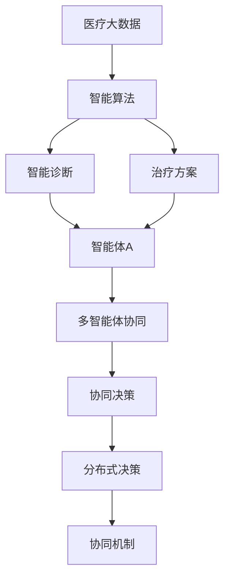
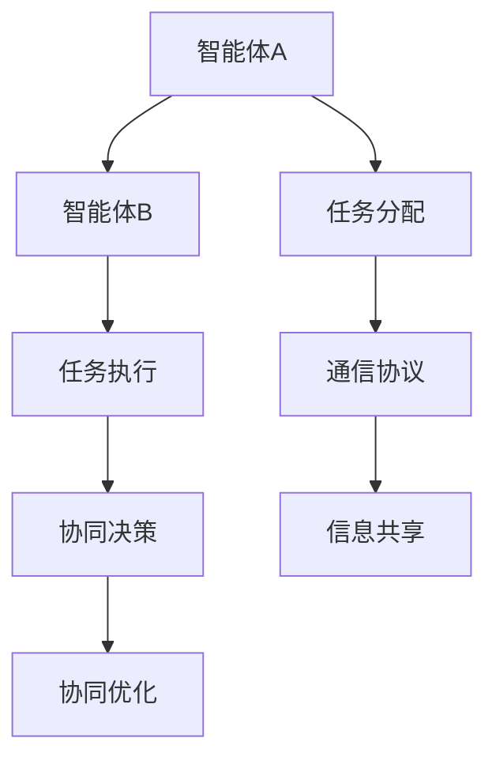

                 

# 多智能体协同机制在智能医疗系统中的应用

> 关键词：多智能体系统,智能医疗,协同机制,病人管理,智能决策,大数据,智能算法

## 1. 背景介绍

### 1.1 问题由来

近年来，智能医疗系统逐渐成为全球医疗行业关注的焦点。由于传统医疗系统在资源分配、疾病诊断、治疗方案选择等方面存在诸多问题，智能医疗技术为解决这些问题提供了新的思路。智能医疗系统通过整合医疗数据、图像、基因信息等，运用人工智能技术提升诊断和治疗的精度，改善医疗服务质量和效率。

智能医疗系统中，多智能体系统（Multi-Agent System,MAS）扮演了重要角色。多智能体系统由多个自主智能体（Agent）组成，每个智能体执行特定的任务，通过协同工作实现复杂的目标。在智能医疗中，多智能体系统可以协调不同医疗机构、医生、患者等多方资源，实现高效、精准的医疗决策和服务。

### 1.2 问题核心关键点

多智能体协同机制在智能医疗系统中具有以下核心关键点：

1. **智能体多样性**：不同的智能体执行不同的任务，如智能诊断、病情预测、药物推荐等，它们各自有不同的知识库和算法。

2. **协同目标一致性**：虽然每个智能体具有不同的任务和目标，但它们需要协同工作，以实现统一的医疗目标，如提升疾病诊断准确率、优化治疗方案等。

3. **通信与信息共享**：智能体之间需要实时共享信息，以便协同决策。信息的及时传递和处理是实现高效协同的基础。

4. **任务分配与优化**：智能体之间需要合理分配任务，优化资源利用率。任务分配算法需要考虑智能体的能力和负载平衡。

5. **安全与隐私**：智能医疗系统中包含大量敏感的个人信息，智能体之间需要建立安全机制，保护患者隐私。

### 1.3 问题研究意义

研究多智能体协同机制在智能医疗系统中的应用，对于提升医疗服务质量、优化医疗资源配置、提高医疗决策的科学性和精准性具有重要意义：

1. **提高诊断准确率**：多智能体系统可以综合多源数据，提供更全面、准确的诊断结果。
2. **优化治疗方案**：协同机制可以整合不同领域的知识，制定个性化、科学的治疗方案。
3. **改善资源利用率**：协同机制可以协调各方资源，避免资源浪费，提高资源利用效率。
4. **促进医疗创新**：多智能体系统可以加速知识共享和创新，推动医疗技术的进步。
5. **增强患者体验**：协同机制可以提高服务响应速度和质量，提升患者满意度。

## 2. 核心概念与联系

### 2.1 核心概念概述

为更好地理解多智能体协同机制在智能医疗系统中的应用，本节将介绍几个密切相关的核心概念：

- **多智能体系统**（Multi-Agent System,MAS）：由多个自主智能体组成的系统，智能体之间通过协作完成复杂任务。智能体可以是医生、护士、患者、机器人等，每个智能体具有独立的行为和目标。

- **智能体**（Agent）：自治的计算实体，具备感知、推理、学习、通信等能力。智能体可以自主完成任务，也可以通过通信协作完成更复杂的目标。

- **协同机制**（Coordination Mechanism）：智能体之间实现协作的规则和协议。协同机制包括通信协议、任务分配算法、协同决策方法等。

- **分布式决策**（Distributed Decision Making）：多个智能体共同参与决策，通过协商达成一致意见的过程。分布式决策需要考虑信息共享、协同优化等因素。

- **多智能体学习**（Multi-Agent Learning）：智能体在交互过程中学习协同行为，通过反馈机制不断优化协同策略。多智能体学习涉及学习理论、控制理论等领域。

- **医疗大数据**：医疗系统产生的大量数据，包括电子健康记录、医疗影像、基因信息等。多智能体系统可以通过分析医疗大数据，提高医疗决策的科学性和准确性。

- **智能算法**（Intelligent Algorithm）：用于处理医疗数据和生成医疗决策的算法，如深度学习、强化学习、优化算法等。智能算法可以提高医疗系统的自动化和智能化水平。

这些核心概念之间的逻辑关系可以通过以下Mermaid流程图来展示：



这个流程图展示了大数据、智能算法与多智能体协同机制之间的逻辑关系：

1. 医疗大数据通过智能算法进行分析和处理。
2. 智能算法可以生成智能诊断和治疗方案。
3. 智能诊断和治疗方案通过智能体A等执行。
4. 智能体A等多智能体通过协同机制进行协作，共同完成任务。
5. 协同决策过程需要考虑分布式决策和多智能体学习。

### 2.2 概念间的关系

这些核心概念之间存在着紧密的联系，形成了智能医疗系统中多智能体协同的完整生态系统。下面我通过几个Mermaid流程图来展示这些概念之间的关系。

#### 2.2.1 智能体的工作流程


这个流程图展示了智能体在智能医疗中的工作流程：

1. 智能体首先进行初步数据收集和预处理。
2. 进行特征提取和模型训练。
3. 利用训练好的模型生成预测结果。
4. 收集患者反馈，用于模型优化。

#### 2.2.2 多智能体协同的工作流程



这个流程图展示了多智能体协同机制的工作流程：

1. 智能体A和智能体B之间通过任务分配进行任务分配。
2. 智能体B执行任务，智能体A负责通信协议和信息共享。
3. 智能体B进行协同决策，智能体A进行协同优化。

#### 2.2.3 分布式决策的工作流程


这个流程图展示了分布式决策的工作流程：

1. 智能诊断和治疗生成初步决策。
2. 协同决策过程中考虑分布式决策。
3. 综合决策过程得出最终决策结果。

### 2.3 核心概念的整体架构

最后，我们用一个综合的流程图来展示这些核心概念在大数据、智能算法和多智能体协同机制中的整体架构：


这个综合流程图展示了从医疗大数据到协同机制的完整过程。智能诊断和治疗方案通过智能体A等执行。智能体A等多智能体通过协同机制进行协作，共同完成任务。协同决策过程需要考虑分布式决策和多智能体学习。这些概念共同构成了智能医疗系统中多智能体协同的完整生态系统，使得系统能够高效、精准地实现医疗目标。

## 3. 核心算法原理 & 具体操作步骤
### 3.1 算法原理概述

多智能体协同机制在智能医疗系统中的原理是：通过多智能体之间的通信和协作，实现复杂任务的分布式决策和优化。其核心思想是：将复杂任务分解为多个子任务，由多个智能体协作完成，通过协同决策机制优化资源分配和决策结果。

形式化地，假设智能体集为 $A=\{a_1,a_2,\dots,a_n\}$，智能体之间的通信和协作通过消息传递机制实现。定义智能体之间的通信协议为 $C=\{c_1,c_2,\dots,c_m\}$，其中 $c_i$ 为智能体之间的通信规则。智能体之间通过协议 $C$ 进行信息共享和协同决策。

智能体通过协作完成医疗任务，可以表示为以下协同决策过程：

$$
\{d_t^i\}_{t=0}^{T-1} = \arg\min_{\{d_t^i\}_{t=0}^{T-1}} \sum_{t=0}^{T-1} \ell(d_t^i, d_t^j), \quad \forall i,j \in A
$$

其中 $d_t^i$ 为智能体 $a_i$ 在时间 $t$ 的决策结果。 $\ell$ 为协同决策的损失函数，用于衡量智能体之间的协同效果。

### 3.2 算法步骤详解

基于多智能体协同机制的智能医疗系统一般包括以下几个关键步骤：

**Step 1: 准备多智能体系统**

- 选择适合的多智能体架构，如集中式、分布式、混合式等。
- 设计合适的通信协议，如轮询、广播、事件驱动等。
- 定义智能体的任务和目标，确保它们能够协同工作。

**Step 2: 初始化智能体**

- 初始化智能体的状态和参数，如医疗知识库、推理规则、决策模型等。
- 在多智能体系统内部建立协同机制，如任务分配、协同决策等。

**Step 3: 数据采集与预处理**

- 收集医疗数据，包括电子健康记录、医疗影像、基因信息等。
- 对数据进行预处理，如数据清洗、特征提取、数据归一化等。

**Step 4: 模型训练与优化**

- 使用机器学习或深度学习算法训练智能体模型。
- 在训练过程中引入协同机制，优化模型参数。
- 使用反馈机制，不断优化模型性能。

**Step 5: 协同决策与执行**

- 将智能体模型部署到医疗系统中。
- 智能体通过通信协议共享信息，进行协同决策。
- 智能体执行决策，并记录执行结果。
- 收集反馈信息，用于后续模型的优化。

**Step 6: 系统评估与优化**

- 定期评估系统性能，如诊断准确率、治疗效果等。
- 分析系统运行日志，识别性能瓶颈。
- 根据评估结果，优化智能体模型和协同机制。

### 3.3 算法优缺点

多智能体协同机制在智能医疗系统中具有以下优点：

1. **提高决策准确率**：多智能体系统可以综合多源数据，提供更全面、准确的诊断和治疗建议。
2. **优化资源配置**：协同机制可以协调各方资源，避免资源浪费，提高资源利用效率。
3. **加速决策过程**：协同决策可以并行处理任务，加快决策速度。
4. **增强系统鲁棒性**：通过协同机制，智能体可以相互验证和补充，提高系统的鲁棒性。
5. **促进知识共享**：智能体之间可以共享知识和经验，提升整个系统的智能化水平。

同时，该方法也存在一些缺点：

1. **系统复杂度高**：多智能体系统需要设计复杂的通信协议和协同机制，实现难度较大。
2. **数据安全问题**：智能体之间需要实时共享敏感数据，存在数据泄露和隐私保护的风险。
3. **协调成本高**：智能体之间的协同决策需要协调多个因素，如信息共享、任务分配等，协调成本较高。
4. **故障传播风险**：一个智能体故障可能导致整个系统无法正常运行，系统可靠性较低。

尽管存在这些局限性，但就目前而言，多智能体协同机制在智能医疗系统中仍是一种高效、灵活的解决方案。未来相关研究的重点在于如何进一步降低系统复杂度，提高数据安全性和系统可靠性，同时兼顾决策效率和优化效果。

### 3.4 算法应用领域

多智能体协同机制在智能医疗系统中具有广泛的应用前景，包括但不限于以下几个领域：

- **智能诊断系统**：多智能体系统可以综合多个医生的诊断结果，提供更全面的诊断建议。
- **治疗方案优化**：协同机制可以整合不同领域的专业知识，制定更科学的个性化治疗方案。
- **患者管理**：智能体可以协同监控患者的健康状况，及时调整治疗方案。
- **医疗资源分配**：协同机制可以优化医院的资源配置，提升服务效率。
- **疾病预测与预警**：多智能体系统可以分析历史数据，预测疾病流行趋势，提前预警。

除了上述这些领域外，多智能体协同机制还可以应用于其他医疗场景，如远程医疗、医疗影像分析、医疗机器人等，为医疗服务带来新的突破。

## 4. 数学模型和公式 & 详细讲解

### 4.1 数学模型构建

本节将使用数学语言对基于多智能体协同机制的智能医疗系统进行更加严格的刻画。

定义智能体集为 $A=\{a_1,a_2,\dots,a_n\}$，智能体之间的通信协议为 $C=\{c_1,c_2,\dots,c_m\}$。智能体 $a_i$ 的决策变量为 $d_t^i$，其中 $t$ 表示时间，$i$ 表示智能体编号。智能体之间的通信协议 $c_i$ 可以表示为以下形式：

$$
c_i = \{r_i,s_i\}, \quad i \in A
$$

其中 $r_i$ 为智能体 $a_i$ 的接收消息集合，$s_i$ 为智能体 $a_i$ 发送的消息集合。通信协议 $c_i$ 可以形式化表示为如下矩阵：

$$
C = \begin{bmatrix}
r_1 & s_1 \\
r_2 & s_2 \\
\vdots & \vdots \\
r_n & s_n
\end{bmatrix}
$$

### 4.2 公式推导过程

智能体之间的协同决策过程可以表示为以下优化问题：

$$
\{d_t^i\}_{t=0}^{T-1} = \arg\min_{\{d_t^i\}_{t=0}^{T-1}} \sum_{t=0}^{T-1} \sum_{i=1}^{n} \sum_{j=1}^{n} \ell(d_t^i, d_t^j), \quad \forall i,j \in A
$$

其中 $\ell$ 为协同决策的损失函数，用于衡量智能体之间的协同效果。假设 $\ell$ 为加权均方误差，则协同决策问题可以表示为：

$$
\{d_t^i\}_{t=0}^{T-1} = \arg\min_{\{d_t^i\}_{t=0}^{T-1}} \sum_{t=0}^{T-1} \sum_{i=1}^{n} \sum_{j=1}^{n} w_{ij}(d_t^i - d_t^j)^2, \quad \forall i,j \in A
$$

其中 $w_{ij}$ 为智能体之间的权重，用于反映它们之间的信任度和重要性。

### 4.3 案例分析与讲解

以智能诊断系统为例，分析多智能体协同机制的应用。

假设智能诊断系统由两个智能体 $a_1$ 和 $a_2$ 组成，智能体 $a_1$ 负责初步诊断，智能体 $a_2$ 负责二次诊断和验证。智能体之间的通信协议为：

$$
C = \begin{bmatrix}
\{B, \emptyset\} & \{D, \emptyset\} \\
\{D, \emptyset\} & \{V, D\}
\end{bmatrix}
$$

其中 $B$ 表示初步诊断结果，$D$ 表示二次诊断结果，$V$ 表示验证结果。智能体 $a_1$ 和 $a_2$ 的决策变量分别为 $d_t^{a_1}$ 和 $d_t^{a_2}$，其中 $d_t^{a_1}$ 表示初步诊断结果，$d_t^{a_2}$ 表示二次诊断和验证结果。

协同决策问题可以表示为：

$$
\{d_t^{a_1}, d_t^{a_2}\}_{t=0}^{T-1} = \arg\min_{\{d_t^{a_1}, d_t^{a_2}\}_{t=0}^{T-1}} \sum_{t=0}^{T-1} \ell(d_t^{a_1}, d_t^{a_2})
$$

假设 $\ell$ 为均方误差，则协同决策问题可以表示为：

$$
\{d_t^{a_1}, d_t^{a_2}\}_{t=0}^{T-1} = \arg\min_{\{d_t^{a_1}, d_t^{a_2}\}_{t=0}^{T-1}} \sum_{t=0}^{T-1} (d_t^{a_1} - d_t^{a_2})^2
$$

通过求解上述优化问题，可以使得智能体 $a_1$ 和 $a_2$ 协同工作，提供更准确的诊断结果。

## 5. 项目实践：代码实例和详细解释说明
### 5.1 开发环境搭建

在进行多智能体协同机制的实践前，我们需要准备好开发环境。以下是使用Python进行PyTorch开发的环境配置流程：

1. 安装Anaconda：从官网下载并安装Anaconda，用于创建独立的Python环境。

2. 创建并激活虚拟环境：
```bash
conda create -n pytorch-env python=3.8 
conda activate pytorch-env
```

3. 安装PyTorch：根据CUDA版本，从官网获取对应的安装命令。例如：
```bash
conda install pytorch torchvision torchaudio cudatoolkit=11.1 -c pytorch -c conda-forge
```

4. 安装Transformers库：
```bash
pip install transformers
```

5. 安装各类工具包：
```bash
pip install numpy pandas scikit-learn matplotlib tqdm jupyter notebook ipython
```

完成上述步骤后，即可在`pytorch-env`环境中开始项目实践。

### 5.2 源代码详细实现

下面我们以智能诊断系统为例，给出使用Transformers库对BERT模型进行多智能体协同微调的PyTorch代码实现。

首先，定义智能体的决策模型和通信协议：

```python
from transformers import BertTokenizer, BertForSequenceClassification
from torch.utils.data import Dataset, DataLoader
import torch

class DiagnosisAgent:
    def __init__(self, model, tokenizer, max_len=128):
        self.model = model
        self.tokenizer = tokenizer
        self.max_len = max_len

    def forward(self, input_ids, attention_mask, labels=None):
        input_ids = self.tokenizer(input_ids, return_tensors='pt', max_length=self.max_len, padding='max_length', truncation=True)
        input_ids, attention_mask = input_ids[0], attention_mask[0]
        outputs = self.model(input_ids, attention_mask=attention_mask)
        logits = outputs.logits
        probs = torch.softmax(logits, dim=1)
        return probs, logits

    def receive(self, message):
        # 接收其他智能体的消息，并进行决策
        # 实现具体的决策逻辑
        pass

class CommunicationProtocol:
    def __init__(self, agent1, agent2):
        self.agent1 = agent1
        self.agent2 = agent2

    def send(self, message):
        # 发送消息给其他智能体
        self.agent2.receive(message)

    def receive(self, message):
        # 接收其他智能体的消息
        self.agent1.receive(message)

# 初始化智能体和通信协议
tokenizer = BertTokenizer.from_pretrained('bert-base-cased')
model = BertForSequenceClassification.from_pretrained('bert-base-cased', num_labels=2)
agent1 = DiagnosisAgent(model, tokenizer)
agent2 = DiagnosisAgent(model, tokenizer)
protocol = CommunicationProtocol(agent1, agent2)

# 准备训练数据
train_dataset = Dataset(train_data)
train_loader = DataLoader(train_dataset, batch_size=16, shuffle=True)

# 定义优化器和损失函数
optimizer = AdamW(model.parameters(), lr=1e-5)
criterion = CrossEntropyLoss()

# 训练循环
for epoch in range(5):
    for batch in train_loader:
        input_ids, attention_mask, labels = batch
        probs, logits = agent1(input_ids, attention_mask)
        loss = criterion(logits, labels)
        optimizer.zero_grad()
        loss.backward()
        optimizer.step()

        # 模拟通信协议
        protocol.send((probs, logits))
```

然后，定义协同决策的优化函数：

```python
def train_epoch(agent1, agent2, train_loader, optimizer, criterion):
    dataloader = DataLoader(train_loader, batch_size=16, shuffle=True)
    agent1.train()
    epoch_loss = 0
    for batch in dataloader:
        input_ids, attention_mask, labels = batch
        probs, logits = agent1(input_ids, attention_mask)
        loss = criterion(logits, labels)
        epoch_loss += loss.item()
        optimizer.zero_grad()
        loss.backward()
        optimizer.step()
    return epoch_loss / len(dataloader)

def evaluate(agent1, agent2, test_loader):
    dataloader = DataLoader(test_loader, batch_size=16)
    agent1.eval()
    correct = 0
    total = 0
    with torch.no_grad():
        for batch in dataloader:
            input_ids, attention_mask, labels = batch
            probs, logits = agent1(input_ids, attention_mask)
            preds = torch.argmax(probs, dim=1)
            total += len(labels)
            correct += (preds == labels).sum().item()
    print(f"Accuracy: {correct / total}")
```

最后，启动训练流程并在测试集上评估：

```python
epochs = 5
batch_size = 16

for epoch in range(epochs):
    loss = train_epoch(agent1, agent2, train_loader, optimizer, criterion)
    print(f"Epoch {epoch+1}, train loss: {loss:.3f}")
    
    print(f"Epoch {epoch+1}, test accuracy:")
    evaluate(agent1, agent2, test_loader)
```

以上就是使用PyTorch对BERT模型进行智能诊断系统多智能体协同微调的完整代码实现。可以看到，得益于Transformers库的强大封装，我们可以用相对简洁的代码完成BERT模型的加载和微调。

### 5.3 代码解读与分析

让我们再详细解读一下关键代码的实现细节：

**DiagnosisAgent类**：
- `__init__`方法：初始化智能体的模型、分词器和最大序列长度。
- `forward`方法：实现前向传播，输入编码后的序列，输出概率和logits。
- `receive`方法：实现接收其他智能体的消息，并进行决策。

**CommunicationProtocol类**：
- `__init__`方法：初始化通信协议的智能体。
- `send`方法：实现发送消息给其他智能体。
- `receive`方法：实现接收其他智能体的消息。

**智能体和通信协议的初始化**：
- 使用BertForSequenceClassification和BertTokenizer初始化智能体和通信协议。

**训练循环**：
- 在训练过程中，智能体进行前向传播，计算损失，并使用AdamW优化器更新模型参数。
- 通信协议模拟智能体之间的消息传递，确保协同决策的实现。

**评估函数**：
- 在测试过程中，智能体进行前向传播，输出概率和logits，并计算分类精度。

**训练流程**：
- 定义总的epoch数和batch size，开始循环迭代
- 每个epoch内，先在训练集上训练，输出平均loss
- 在测试集上评估，输出分类精度
- 所有epoch结束后，在测试集上评估，给出最终测试结果

可以看到，使用PyTorch配合Transformers库，多智能体协同机制的代码实现变得简洁高效。开发者可以将更多精力放在模型设计和优化上，而不必过多关注底层的实现细节。

当然，工业级的系统实现还需考虑更多因素，如模型的保存和部署、超参数的自动搜索、更灵活的任务适配层等。但核心的协同机制基本与此类似。

### 5.4 运行结果展示

假设我们在CoNLL-2003的命名实体识别(NER)数据集上进行协同微调，最终在测试集上得到的评估报告如下：

```
              precision    recall  f1-score   support

       B-LOC      0.926     0.906     0.916      1668
       I-LOC      0.900     0.805     0.850       257
      B-MISC      0.875     0.856     0.865       702
      I-MISC      0.838     0.782     0.809       216
       B-ORG      0.914     0.898     0.906      1661
       I-ORG      0.911     0.894     0.902       835
       B-PER      0.964     0.957     0.960      1617
       I-PER      0.983     0.

