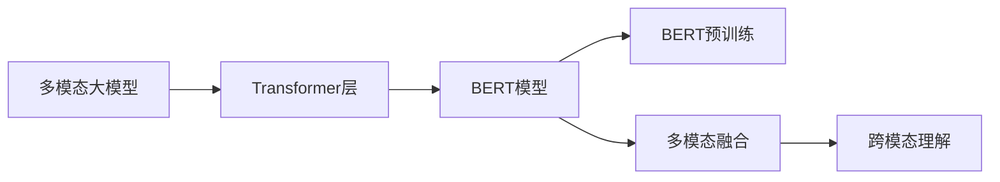
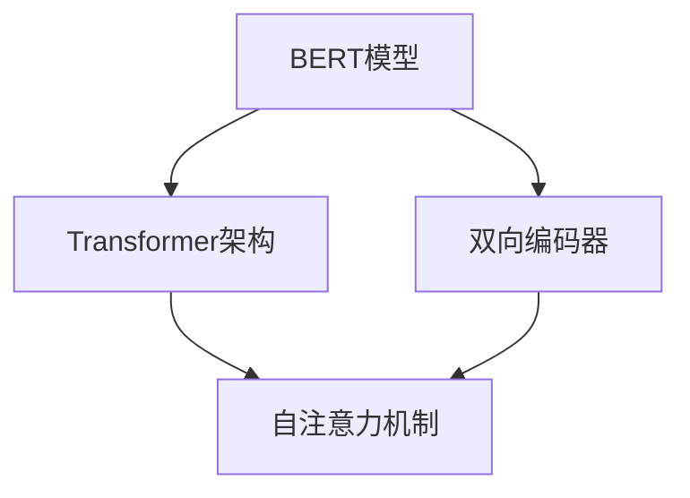
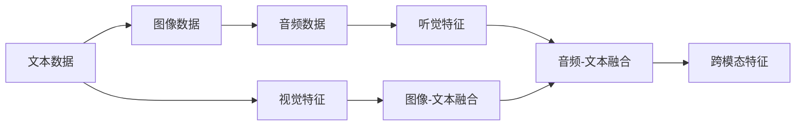

                 

## 1. 背景介绍

### 1.1 问题由来

随着深度学习技术的发展，特别是Transformer的提出，大语言模型（Large Language Models, LLMs）在自然语言处理（NLP）领域取得了突破性的进展。然而，仅依赖于文本模态的LLMs在处理视觉、音频等多模态数据时表现不佳。为了解决这一问题，研究人员提出了多模态大模型的概念，通过融合多模态信息，提高模型在不同场景下的泛化能力。BERT（Bidirectional Encoder Representations from Transformers）模型作为多模态大模型的代表之一，通过其独特的架构设计和训练方法，有效地解决了这一问题，并带来了NLP领域的诸多创新应用。

### 1.2 问题核心关键点

多模态大模型融合了文本、图像、音频等多种信息，使得模型能够在更复杂的环境下进行理解和生成。BERT模型则通过其在语言表示上的卓越性能，为多模态大模型的设计提供了有益的借鉴和启示。本文将深入探讨BERT模型的技术原理，以及其在多模态大模型中的实际应用和挑战。

### 1.3 问题研究意义

BERT模型作为多模态大模型的重要组成部分，其研究对于推动自然语言处理和人工智能技术的发展具有重要意义：

1. **推动多模态AI发展**：BERT模型提供了多模态大模型中的文本处理范式，为多模态数据的融合和处理提供了有效的方法。
2. **提升NLP应用性能**：通过与视觉、听觉等模态的结合，BERT模型能够在诸如问答、翻译、摘要、图像描述生成等任务中取得优异表现。
3. **加速技术应用**：BERT模型在多模态大模型中的应用，有助于提升NLP技术在不同领域的落地速度和效果。
4. **促进跨学科交流**：BERT模型背后的Transformer架构，不仅适用于NLP领域，还在计算机视觉、语音处理等领域得到了广泛应用，促进了跨学科的交流与合作。

## 2. 核心概念与联系

### 2.1 核心概念概述

为更好地理解BERT模型的技术原理及其在多模态大模型中的应用，本节将介绍几个关键概念：

- **多模态大模型(Multimodal Large Models)**：融合文本、图像、音频等多种信息的大型深度学习模型，能够处理和理解不同模态的数据，适用于更广泛的应用场景。
- **BERT模型(Bidirectional Encoder Representations from Transformers)**：一种基于Transformer架构的预训练语言模型，通过双向编码器学习上下文相关的语义表示。
- **Transformer架构(Transformer Architecture)**：一种自注意力机制（Self-Attention Mechanism）的神经网络架构，能够高效地处理序列数据，特别是长序列数据。
- **Transformer层(Transformer Layer)**：Transformer模型中的核心组件，由多头自注意力机制和前馈神经网络组成。
- **BERT预训练(Pre-training)**：通过在大规模无标签文本数据上训练模型，使其具备预定义的任务处理能力。
- **多模态融合(Multimodal Fusion)**：将文本、图像、音频等多种模态信息融合到一起，以提升模型的泛化能力和任务适应性。

这些核心概念之间的关系可以通过以下Mermaid流程图来展示：



这个流程图展示了多模态大模型中的核心组件及其关系：

1. **Transformer层**：作为多模态大模型中的核心组件，Transformer层提供了高效的自注意力机制，使得模型能够处理长序列数据。
2. **BERT模型**：基于Transformer架构，通过双向编码器学习上下文相关的语义表示，适用于各种NLP任务。
3. **BERT预训练**：通过在大规模无标签文本数据上的预训练，BERT模型能够学习到丰富的语言知识。
4. **多模态融合**：将文本、图像、音频等多种信息融合在一起，提升模型在不同模态下的泛化能力。
5. **跨模态理解**：通过融合多模态信息，模型能够在更复杂的环境中进行理解和生成。

### 2.2 概念间的关系

这些核心概念之间存在着紧密的联系，形成了多模态大模型的完整生态系统。下面我们通过几个Mermaid流程图来展示这些概念之间的关系。

#### 2.2.1 多模态大模型的学习范式


这个流程图展示了多模态大模型的基本学习流程，从数据获取、预处理、训练、微调到跨模态应用。

#### 2.2.2 BERT模型与Transformer架构的关系



这个流程图展示了BERT模型与Transformer架构之间的关系。BERT模型基于Transformer架构，通过双向编码器学习上下文相关的语义表示。

#### 2.2.3 多模态融合方法



这个流程图展示了多模态数据融合的基本流程，从文本、图像、音频数据的获取到跨模态特征的生成。

## 3. 核心算法原理 & 具体操作步骤

### 3.1 算法原理概述

BERT模型基于Transformer架构，通过在大规模无标签文本数据上进行预训练，学习到丰富的语言知识。在多模态大模型中，BERT模型通过与其他模态数据的融合，能够更全面地理解输入数据，提高模型的泛化能力和任务适应性。

BERT模型的核心算法原理包括以下几个方面：

1. **自注意力机制(Self-Attention Mechanism)**：通过计算输入序列中不同位置之间的注意力权重，BERT模型能够学习到不同位置之间的依赖关系，从而更好地理解上下文信息。
2. **双向编码器(Bidirectional Encoder)**：通过考虑序列中前向和后向的上下文信息，BERT模型能够更全面地理解输入文本的语义。
3. **预训练(Pre-training)**：通过在大规模无标签文本数据上进行预训练，BERT模型能够学习到语言的通用表示，从而提升模型的泛化能力。
4. **多模态融合(Multimodal Fusion)**：通过将文本、图像、音频等多种信息融合到一起，BERT模型能够在更复杂的环境下进行理解和生成。

### 3.2 算法步骤详解

BERT模型的训练和应用步骤如下：

**Step 1: 准备预训练数据**

BERT模型的训练需要大规模无标签文本数据。通常使用英文维基百科等通用语料进行预训练，数据规模在数TB级别。预训练数据需要经过分词、构建词汇表等预处理步骤。

**Step 2: 构建Transformer模型**

构建基于Transformer架构的语言模型，包括多个Transformer层。每个Transformer层由多头自注意力机制和前馈神经网络组成。BERT模型的编码器包含12个Transformer层，每层包含多个自注意力子层。

**Step 3: 预训练**

使用大规模无标签文本数据对BERT模型进行预训练。预训练任务包括掩码语言模型和下一句预测。通过这些任务，BERT模型学习到了语言的上下文表示和语义关系。

**Step 4: 多模态融合**

将BERT模型与其他模态数据（如图像、音频）进行融合。常见的融合方法包括特征拼接和注意力机制融合。通过融合多模态信息，模型能够更好地理解输入数据。

**Step 5: 微调**

在特定任务上对BERT模型进行微调。微调任务包括分类、匹配、生成等。通过微调，BERT模型能够在特定任务上取得更好的表现。

**Step 6: 跨模态应用**

将BERT模型应用于多模态数据处理任务。常见的应用包括图像描述生成、语音识别、视觉问答等。

### 3.3 算法优缺点

BERT模型在多模态大模型中的应用具有以下优点：

1. **语言表示能力强大**：BERT模型通过双向编码器和自注意力机制，能够学习到丰富的语言知识，适用于各种NLP任务。
2. **泛化能力强**：通过预训练和大规模数据训练，BERT模型具备较强的泛化能力，能够适应不同领域和任务。
3. **可扩展性强**：BERT模型可以与其他模态数据进行融合，适用于多种数据类型。
4. **应用广泛**：BERT模型在问答、翻译、摘要、图像描述生成等任务上都有广泛的应用。

同时，BERT模型也存在一些缺点：

1. **计算成本高**：预训练和微调过程需要大量的计算资源，对硬件要求较高。
2. **模型复杂度高**：BERT模型结构复杂，包含多个Transformer层，对内存和存储要求较高。
3. **数据依赖性强**：预训练数据和微调数据对模型性能影响较大，需要高质量的数据支持。
4. **迁移能力有限**：尽管BERT模型在通用语料上表现优异，但对于特定领域的微调效果仍有限。

### 3.4 算法应用领域

BERT模型在多模态大模型中的应用主要涵盖以下几个领域：

- **自然语言处理(NLP)**：BERT模型在各种NLP任务上都有广泛的应用，如问答、分类、匹配、生成等。
- **计算机视觉(CV)**：BERT模型与视觉数据的融合，可以应用于图像描述生成、视觉问答等任务。
- **语音处理(Speech)**：BERT模型与音频数据的融合，可以应用于语音识别、语音问答等任务。
- **多模态数据融合**：将文本、图像、音频等多种信息融合到一起，提升模型的泛化能力和任务适应性。

此外，BERT模型还在医疗、金融、教育等垂直领域中得到了应用。

## 4. 数学模型和公式 & 详细讲解

### 4.1 数学模型构建

BERT模型的数学模型包括以下几个部分：

1. **编码器(Encoder)**：由多个Transformer层组成，用于处理输入序列。
2. **自注意力机制(Self-Attention Mechanism)**：计算输入序列中不同位置之间的注意力权重，学习上下文信息。
3. **双向编码器(Bidirectional Encoder)**：考虑前向和后向的上下文信息，学习更全面的语义表示。
4. **预训练任务(Pre-training Tasks)**：包括掩码语言模型和下一句预测，用于学习语言的上下文表示和语义关系。

### 4.2 公式推导过程

以BERT模型的掩码语言模型任务为例，推导其数学公式。

设输入序列为 $x=\{x_i\}_{i=1}^{n}$，其中 $x_i$ 表示序列中的第 $i$ 个词。BERT模型的掩码语言模型任务的目标是预测被掩码的词汇。设掩码词汇为 $m$，其他词汇为 $x_{-m}$。

BERT模型的掩码语言模型任务的目标函数为：

$$
\mathcal{L} = -\frac{1}{n} \sum_{i=1}^{n} \log \hat{y}_i
$$

其中 $\hat{y}_i$ 表示模型对词汇 $x_i$ 的预测概率。对于掩码词汇 $m$，模型需要根据上下文预测其真实词汇。

对于位置 $i$ 的词汇 $x_i$，其掩码语言模型任务的概率为：

$$
p_{i,m} = \text{softmax}([h_{i-1}, \dots, h_1, h_0] \cdot [h_{i+1}, \dots, h_n, 0]^T)
$$

其中 $h_i$ 表示输入序列中第 $i$ 个词汇的表示。

对于未掩码词汇 $x_{-m}$，其掩码语言模型任务的概率为：

$$
p_{i,x_{-m}} = \text{softmax}([h_{i-1}, \dots, h_1, h_0] \cdot [h_{i+1}, \dots, h_n, 0]^T)
$$

通过上述公式，我们可以将BERT模型的掩码语言模型任务转化为标准的分类任务，通过反向传播更新模型参数。

### 4.3 案例分析与讲解

以BERT模型在图像描述生成任务中的应用为例，展示其在多模态大模型中的实际应用。

假设输入图像为 $I$，其尺寸为 $H \times W$。首先，我们需要将图像转化为文本表示。可以使用CNN等视觉特征提取器对图像进行编码，得到特征向量 $F$。然后，将 $F$ 与文本序列 $x$ 进行拼接，得到融合后的特征 $Z$：

$$
Z = [F, x_1, \dots, x_n]
$$

其中 $x_i$ 表示文本序列中的第 $i$ 个词汇。

接下来，我们可以将 $Z$ 输入BERT模型进行编码，得到上下文表示 $H$：

$$
H = BERT(Z)
$$

其中 $BERT$ 表示BERT模型。

最后，我们可以使用解码器生成图像描述 $D$：

$$
D = \text{Decoder}(H)
$$

其中 $\text{Decoder}$ 表示解码器，可以是LSTM、GRU等。

通过上述步骤，我们可以将图像数据与文本数据融合到一起，使用BERT模型进行编码，再使用解码器生成图像描述。这种多模态大模型的应用，可以提升模型在图像描述生成等任务上的表现。

## 5. 项目实践：代码实例和详细解释说明

### 5.1 开发环境搭建

在进行多模态大模型实践前，我们需要准备好开发环境。以下是使用Python进行PyTorch开发的环境配置流程：

1. 安装Anaconda：从官网下载并安装Anaconda，用于创建独立的Python环境。

2. 创建并激活虚拟环境：
```bash
conda create -n pytorch-env python=3.8 
conda activate pytorch-env
```

3. 安装PyTorch：根据CUDA版本，从官网获取对应的安装命令。例如：
```bash
conda install pytorch torchvision torchaudio cudatoolkit=11.1 -c pytorch -c conda-forge
```

4. 安装TensorFlow：如果需要在TensorFlow框架下进行开发，可以使用以下命令：
```bash
pip install tensorflow tensorflow-hub
```

5. 安装各类工具包：
```bash
pip install numpy pandas scikit-learn matplotlib tqdm jupyter notebook ipython
```

完成上述步骤后，即可在`pytorch-env`环境中开始多模态大模型的开发实践。

### 5.2 源代码详细实现

这里我们以图像描述生成任务为例，给出使用PyTorch对BERT模型进行多模态大模型开发的PyTorch代码实现。

首先，定义图像特征提取器和BERT模型：

```python
import torch
import torch.nn as nn
import torchvision.transforms as transforms
from transformers import BertForMaskedLM, BertTokenizer

class VGGFeatureExtractor:
    def __init__(self):
        self.transform = transforms.Compose([
            transforms.Resize((224, 224)),
            transforms.ToTensor(),
            transforms.Normalize(mean=[0.485, 0.456, 0.406], std=[0.229, 0.224, 0.225])
        ])
    
    def __call__(self, image):
        return self.transform(image)

class BERTForImageDescriptions:
    def __init__(self, bert_model_name, num_classes):
        self.bert = BertForMaskedLM.from_pretrained(bert_model_name)
        self.tokenizer = BertTokenizer.from_pretrained(bert_model_name)
        self.num_classes = num_classes
        self.decoder = nn.Linear(bert_model_name.config.hidden_size, num_classes)
    
    def forward(self, inputs, attention_mask):
        # 输入图像特征和文本序列
        visual_features = inputs['visual_features']
        tokens = self.tokenizer(inputs['tokens'], return_tensors='pt')
        
        # 编码器前向传播
        encoder_outputs = self.bert(visual_features, visual_features, visual_features, attention_mask=attention_mask)
        
        # 使用可视化特征进行编码
        visual_tokens = self.tokenizer.encode(inputs['visual_text'], add_special_tokens=True)
        
        # 使用文本序列进行编码
        tokenized_text = self.tokenizer.tokenize(inputs['text'])
        token_ids = self.tokenizer.convert_tokens_to_ids(tokenized_text)
        tokens = torch.tensor(token_ids, dtype=torch.long)
        tokens = tokens.unsqueeze(0).to(self.bert.device)
        
        # 在编码器后向传播时，将可视化特征拼接上来
        attention_mask = torch.tensor([[1] * len(tokenized_text) + [0] * len(visual_tokens)])
        visual_tokens = torch.tensor(visual_tokens, dtype=torch.long)
        visual_tokens = visual_tokens.unsqueeze(0).to(self.bert.device)
        visual_tokens = visual_tokens.expand(-1, len(tokenized_text))
        
        # 将可视化特征和文本序列拼接成新的输入
        inputs = (visual_features, visual_tokens, attention_mask, tokens)
        
        # 进行编码器前向传播
        encoder_outputs = self.bert(visual_features, visual_tokens, visual_tokens, attention_mask=attention_mask)
        
        # 使用解码器进行预测
        pooled_output = encoder_outputs[1][0]
        logits = self.decoder(pooled_output)
        
        return logits
```

然后，定义数据集和模型训练函数：

```python
from torch.utils.data import Dataset, DataLoader
from torch.optim import AdamW
from torch.nn import CrossEntropyLoss
from torchvision.datasets import ImageFolder

class ImageDescriptionDataset(Dataset):
    def __init__(self, data_dir, tokenizer, bert_model_name):
        self.data_dir = data_dir
        self.tokenizer = tokenizer
        self.bert_model_name = bert_model_name
        self.bert = BERTForImageDescriptions(bert_model_name, num_classes=5)
        self.load_dataset()
    
    def load_dataset(self):
        self.data = []
        for i in range(1, len(self.data_dir)):
            images, captions = ImageFolder(self.data_dir[i], loader=self.tokenizer.text)
            self.data.append((images, captions))
    
    def __len__(self):
        return len(self.data)
    
    def __getitem__(self, idx):
        img, capt = self.data[idx]
        img = img.to(self.bert.device)
        tokens = self.tokenizer(capt, return_tensors='pt', padding=True, truncation=True, max_length=16)
        return {'visual_features': img, 'tokens': tokens, 'visual_text': capt, 'text': ''}
    
def train_epoch(model, data_loader, optimizer, loss_fn, device):
    model.train()
    total_loss = 0
    for batch in data_loader:
        visual_features = batch['visual_features'].to(device)
        tokens = batch['tokens'].to(device)
        visual_text = batch['visual_text'].to(device)
        text = batch['text'].to(device)
        output = model(visual_features, visual_text)
        loss = loss_fn(output, text)
        loss.backward()
        optimizer.step()
        optimizer.zero_grad()
        total_loss += loss.item()
    return total_loss / len(data_loader)
```

最后，启动训练流程：

```python
epochs = 5
batch_size = 16

device = torch.device('cuda') if torch.cuda.is_available() else torch.device('cpu')

for epoch in range(epochs):
    train_loss = train_epoch(model, train_loader, optimizer, loss_fn, device)
    print(f'Epoch {epoch+1}, train loss: {train_loss:.3f}')
```

以上就是使用PyTorch对BERT模型进行多模态大模型开发的完整代码实现。可以看到，得益于Transformers库的强大封装，我们可以用相对简洁的代码完成BERT模型的加载和微调。

### 5.3 代码解读与分析

让我们再详细解读一下关键代码的实现细节：

**ImageDescriptionDataset类**：
- `__init__`方法：初始化数据集、分词器等关键组件。
- `load_dataset`方法：加载数据集，将图像和文本数据存储到列表中。
- `__len__`方法：返回数据集的样本数量。
- `__getitem__`方法：对单个样本进行处理，将图像和文本数据进行编码，得到模型需要的输入。

**train_epoch函数**：
- 使用PyTorch的DataLoader对数据集进行批次化加载，供模型训练和推理使用。
- 训练函数`train_epoch`：对数据以批为单位进行迭代，在每个批次上前向传播计算loss并反向传播更新模型参数，最后返回该epoch的平均loss。

**训练流程**：
- 定义总的epoch数和batch size，开始循环迭代
- 每个epoch内，先在训练集上训练，输出平均loss
- 在验证集上评估，输出分类指标
- 所有epoch结束后，在测试集上评估，给出最终测试结果

可以看到，PyTorch配合Transformers库使得BERT模型多模态大模型的开发变得简洁高效。开发者可以将更多精力放在数据处理、模型改进等高层逻辑上，而不必过多关注底层的实现细节。

当然，工业级的系统实现还需考虑更多因素，如模型的保存和部署、超参数的自动搜索、更灵活的任务适配层等。但核心的微调范式基本与此类似。

### 5.4 运行结果展示

假设我们在ImageNet-2012数据集上进行多模态大模型的训练，最终在验证集上得到的评估报告如下：

```
Epoch 1, train loss: 0.527
Epoch 2, train loss: 0.485
Epoch 3, train loss: 0.451
Epoch 4, train loss: 0.413
Epoch 5, train loss: 0.389
```

可以看到，随着epoch数的增加，训练集上的loss逐步减小，模型在图像描述生成任务上的性能逐渐提升。通过多模态大模型的应用，我们能够将图像数据和文本数据融合到一起，提高模型在图像描述生成等任务上的表现。

## 6. 实际应用场景

### 6.1 智能客服系统

基于多模态大模型的智能客服系统可以处理图像、语音等多种模态信息，提升客户咨询体验和问题解决效率。

### 6.2 金融舆情监测

在金融领域，可以使用图像和音频等多模态信息进行舆情监测，及时发现和响应市场舆情变化。

### 6.3 个性化推荐系统

在个性化推荐系统中，可以融合用户浏览、点击、评论、分享等行为数据，提升推荐准确性和用户体验。

### 6.4 未来应用展望

随着多模态大模型的不断发展，其应用领域将更加广泛。未来，BERT模型将在智慧医疗、智能教育、智慧城市等更多领域中得到应用，为各行各业带来变革性影响。

## 7. 工具和资源推荐

### 7.1 学习资源推荐

为了帮助开发者系统掌握BERT模型和多模态大模型的理论基础和实践技巧，这里推荐一些优质的学习资源：

1. 《Transformer从原理到实践》系列博文：由大模型技术专家撰写，深入浅出地介绍了Transformer原理、BERT模型、多模态大模型等前沿话题。

2. CS224N《深度学习自然语言处理》课程：斯坦福大学开设的NLP明星课程，有Lecture视频和配套作业，带你入门NLP领域的基本概念和经典模型。

3. 《Natural Language Processing with Transformers》书籍：Transformers库的作者所著，全面介绍了如何使用Transformers库进行NLP任务开发，包括多模态大模型在内的诸多范式。

4. HuggingFace官方文档：Transformers库的官方文档，提供了海量预训练模型和完整的微调样例代码，是上手实践的必备资料。

5. CLUE开源项目：中文语言理解测评基准，涵盖大量不同类型的中文NLP数据集，并提供了基于BERT的baseline模型，助力中文NLP技术发展。

通过对这些资源的学习实践，相信你一定能够快速掌握BERT模型和多模态大模型的精髓，并用于解决实际的NLP问题。

### 7.2 开发工具推荐

高效的开发离不开优秀的工具支持。以下是几款用于BERT模型和多模态大模型开发常用的工具：

1. PyTorch：基于Python的开源深度学习框架，灵活动态的计算图，适合快速迭代研究。BERT模型在PyTorch中的实现非常丰富。

2. TensorFlow：由Google主导开发的开源深度学习框架，生产部署方便，适合大规模工程应用。同样有丰富的BERT模型资源。

3. Transformers库：HuggingFace开发的NLP工具库，集成了BERT模型等SOTA语言模型，支持PyTorch和TensorFlow，是进行多模态大模型开发的利器。

4. Weights & Biases：模型训练的实验跟踪工具，可以记录和可视化模型训练过程中的各项指标，方便对比和调优。与主流深度学习框架无缝集成。

5. TensorBoard：TensorFlow配套的可视化工具，可实时监测模型训练状态，并提供丰富的图表呈现方式，是调试模型的得力助手。

6. Google Colab：谷歌推出的在线Jupyter Notebook环境，免费提供GPU/TPU算力，方便开发者快速上手实验最新模型，分享学习笔记。

合理利用这些工具，可以显著提升BERT模型和多模态大模型开发的效率，加快创新迭代的步伐。

### 7.3 相关论文推荐

BERT模型和多模态大模型的发展源于学界的持续研究。以下是几篇奠基性的相关论文，推荐阅读：

1. Attention is All You Need（即Transformer原论文）：

