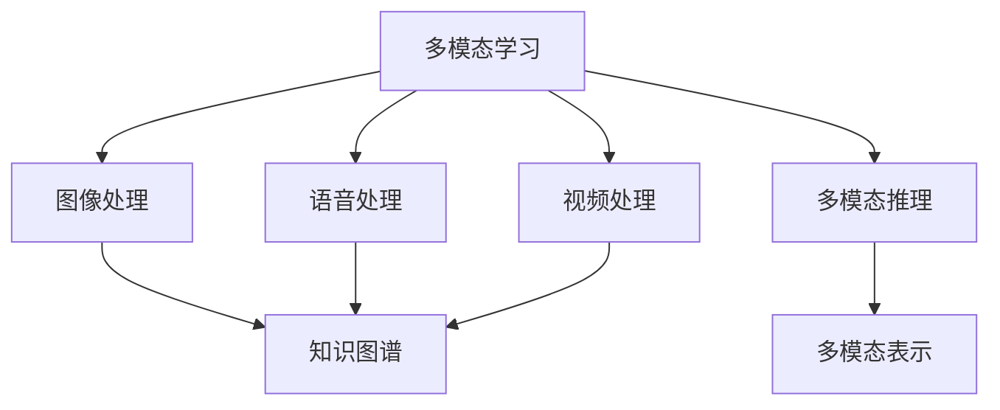
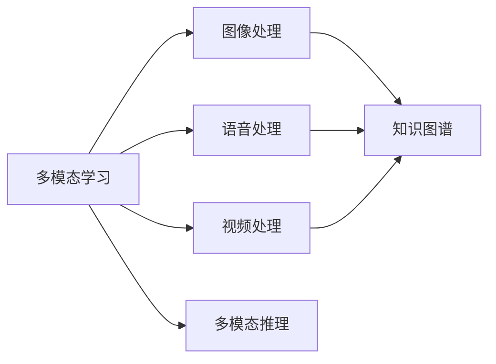
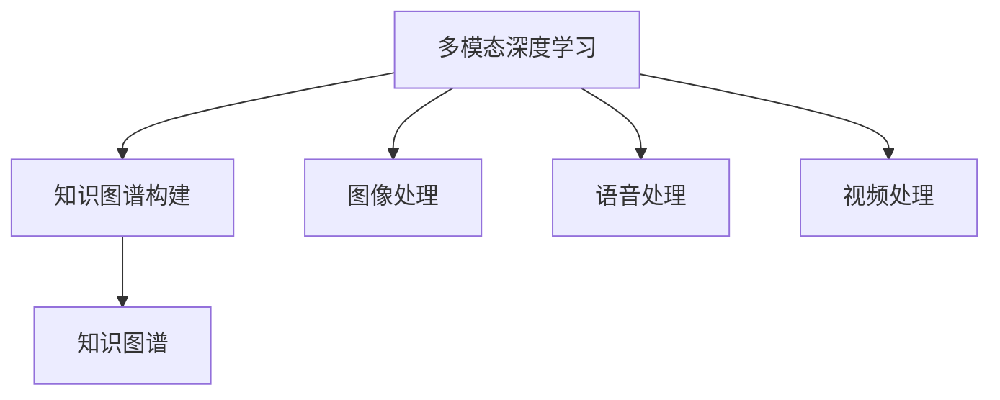
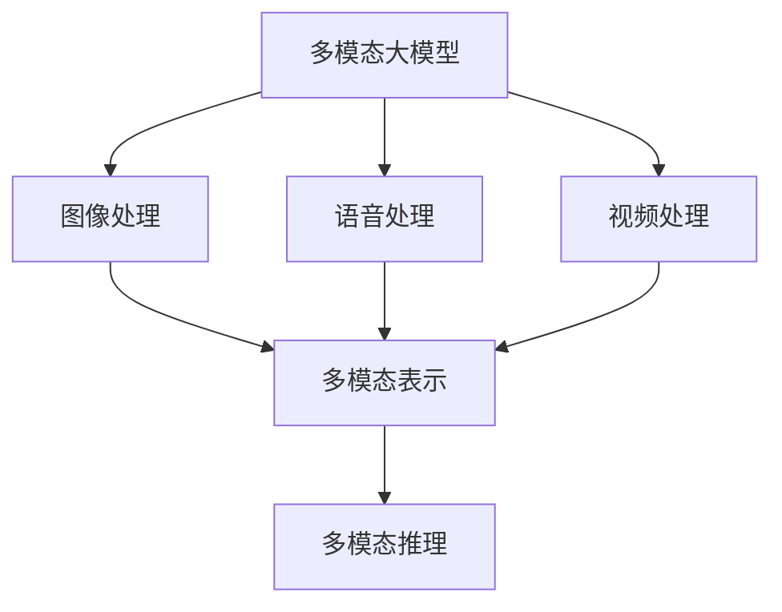
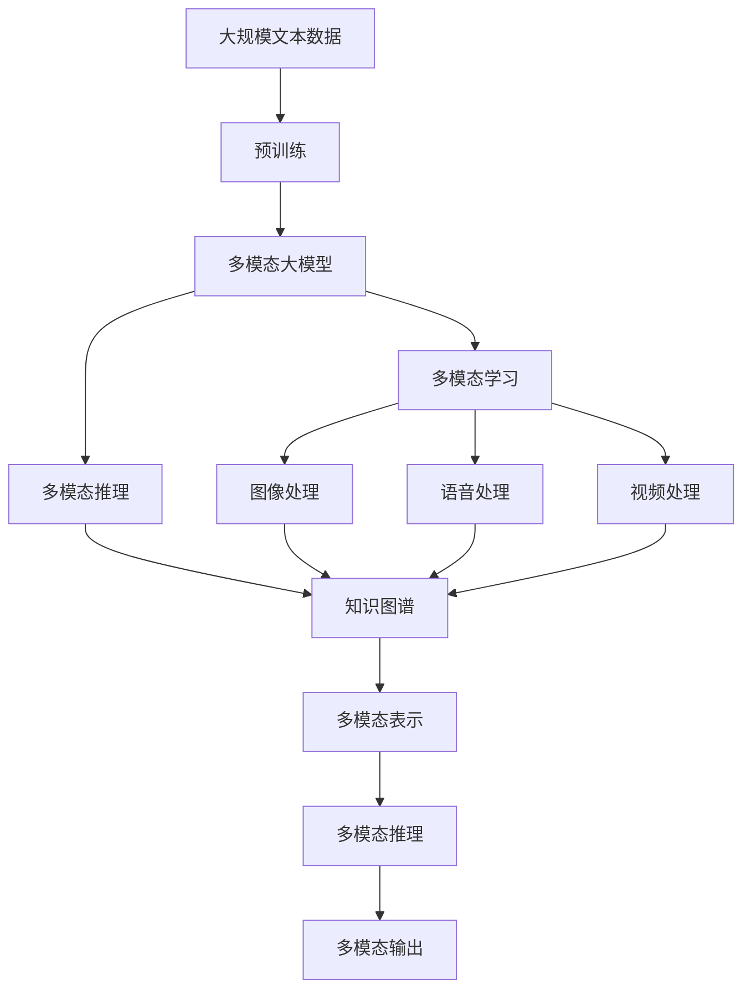

                 

# 多模态大模型：技术原理与实战 BERT模型诞生之后行业持续摸索

> 关键词：多模态大模型,BERT,Transformer,自然语言处理(NLP),图像处理,知识图谱,多模态学习,多模态推理

## 1. 背景介绍

### 1.1 问题由来
自从BERT模型诞生以来，基于深度神经网络的自然语言处理(NLP)技术取得了长足进步，各类大模型如BERT、GPT等在语言理解、信息检索、问答系统等任务中表现优异。然而，相较于单模态的文本处理，现实世界的智能系统往往需要处理多种数据模态，如文本、图像、声音、视频等。如何让大模型同时具备处理多模态数据的能力，成为了一个重要研究方向。

### 1.2 问题核心关键点
目前，多模态大模型可以粗略分为两类：
1. 多模态学习：直接将不同模态的数据整合输入到单一神经网络中，通过多模态编码器处理，并输出统一的多模态表示。
2. 多模态推理：对于不同模态的信息，先分别进行编码，然后在一个推理层进行融合，产生更为复杂的语义表示。

多模态大模型研究的重点在于如何构建有效的多模态表示和推理机制，在保持预训练大模型性能的基础上，扩展其对多模态数据的处理能力。

### 1.3 问题研究意义
研究多模态大模型，对于构建更加智能化的应用系统、提高人机交互效率、提升信息检索质量等具有重要意义：

1. 多模态智能应用。例如智能问答、视觉问答、情感分析等，能够让机器更好地理解真实世界的复杂信息，提高应用系统的智能化水平。
2. 跨领域知识融合。多模态大模型可以整合文本、图像等多领域的知识，形成更全面的知识表示，推动人工智能在跨领域知识图谱构建中的发展。
3. 实时交互需求。通过多模态数据的融合和推理，智能系统能够实时响应各种信息输入，提升用户体验。
4. 数据驱动决策。多模态学习可以整合不同来源的数据，帮助企业进行更加科学、全面的决策分析。

## 2. 核心概念与联系

### 2.1 核心概念概述

为更好地理解多模态大模型的基本原理和应用框架，本节将介绍几个关键概念：

- 多模态学习(Multi-modal Learning)：将不同模态的数据整合在一起，通过统一的神经网络模型进行编码和表示。常见的多模态学习模型包括Vision-and-Language Transformer、Multimodal Fusion Network等。

- 多模态推理(Multi-modal Reasoning)：将不同模态的数据分别编码，在推理层进行融合和推理，产生高层次的多模态语义表示。多模态推理模型包括Multi-Modal Attention Network、Maximal-Intersecting Clusters网络等。

- 知识图谱(Knowledge Graph)：用于表示实体间关系的数据库，是信息检索、推荐系统等任务的常见数据源。常见的知识图谱构建方法包括自动提取和人工构建两种。

- 多模态深度学习(Multimodal Deep Learning)：结合深度神经网络技术的多模态学习，是实现多模态大模型的基础。

- 迁移学习(Transfer Learning)：在大模型预训练和微调的基础上，通过多模态数据进一步优化模型的泛化能力。

- 图像处理(Image Processing)：包括图像特征提取、图像分类、目标检测等。

- 语音处理(Speech Processing)：包括语音识别、语音合成、语音情感分析等。

- 视频处理(Video Processing)：包括视频内容理解、动作识别、视频摘要等。

- 多模态表示(Multimodal Representation)：融合不同模态的信息，形成更全面、更深刻的语义表示。

这些核心概念之间的关系可以通过以下Mermaid流程图来展示：



这个流程图展示了多模态大模型的核心概念及其关系：多模态学习将不同模态的数据整合，多模态推理在推理层进行融合，形成多模态表示。

### 2.2 概念间的关系

这些核心概念之间存在着紧密的联系，形成了多模态大模型的完整生态系统。下面我们通过几个Mermaid流程图来展示这些概念之间的关系。

#### 2.2.1 多模态学习与推理的关系



这个流程图展示了多模态学习与推理的基本流程。多模态学习整合不同模态的数据，多模态推理在融合层进行融合，形成更高级别的语义表示。

#### 2.2.2 多模态深度学习与知识图谱的关系



这个流程图展示了多模态深度学习与知识图谱的关系。多模态深度学习用于整合不同模态的数据，知识图谱构建则将数据转换为图形结构，便于后续推理和查询。

#### 2.2.3 多模态大模型在实际应用中的架构



这个流程图展示了多模态大模型在实际应用中的架构。多模态大模型整合不同模态的数据，通过多模态推理生成更高级别的语义表示。

### 2.3 核心概念的整体架构

最后，我们用一个综合的流程图来展示这些核心概念在大模型微调过程中的整体架构：



这个综合流程图展示了从预训练到多模态推理，再到知识图谱构建的完整过程。多模态大模型首先在大规模文本数据上进行预训练，然后通过多模态学习将不同模态的信息整合，最后在推理层进行融合，生成多模态表示，构建知识图谱。

## 3. 核心算法原理 & 具体操作步骤
### 3.1 算法原理概述

多模态大模型的核心思想是：将不同模态的数据通过深度神经网络模型进行融合和表示，形成统一的多模态语义表示。其核心算法包括多模态编码器、多模态解码器、多模态注意力机制等。

假设有 $n$ 种模态 $X_1, X_2, ..., X_n$，分别进行预处理和编码，然后通过多模态注意力机制进行融合，最终形成多模态表示 $Z$。算法流程如下：

1. 对不同模态的数据 $X_i$ 进行编码，得到 $Z_i = f_i(X_i)$，其中 $f_i$ 为特定模态的编码器。
2. 将编码后的结果 $Z_i$ 输入多模态注意力机制，形成多模态表示 $Z$。
3. 在多模态表示 $Z$ 上执行下游任务，如分类、匹配、生成等。

### 3.2 算法步骤详解

多模态大模型的构建一般包括以下关键步骤：

**Step 1: 准备预训练模型和数据集**
- 选择合适的预训练模型，如BERT、GPT等。
- 准备多模态数据集，包括文本、图像、语音、视频等。

**Step 2: 多模态编码器设计**
- 设计适用于不同模态的编码器，如卷积神经网络(CNN)、循环神经网络(RNN)、注意力机制等。
- 编码器要能够在保持预训练权重不变的前提下，对不同模态的数据进行有效编码。

**Step 3: 多模态注意力机制设计**
- 引入多模态注意力机制，如Cross-Attention、Max-Pooling等，用于融合不同模态的信息。
- 注意力机制要能够动态调整各模态权重，生成具有较高泛化性的多模态表示。

**Step 4: 多模态解码器设计**
- 设计多模态解码器，如Transformer、RNN等。
- 解码器要能够对多模态表示进行解码和推理，输出任务相关的语义表示。

**Step 5: 模型训练和微调**
- 使用多模态数据集进行模型训练，优化多模态编码器和解码器的参数。
- 引入迁移学习技术，利用预训练大模型的知识，加速模型训练和微调过程。

**Step 6: 多模态推理和推理后处理**
- 将多模态表示输入到多模态推理层，进行融合和推理。
- 在推理后处理阶段，利用知识图谱、逻辑规则等辅助信息，对模型输出进行校验和优化。

### 3.3 算法优缺点

多模态大模型具有以下优点：
1. 可以处理多种数据模态，提升模型对真实世界的理解能力。
2. 结合了不同模态的信息，能够形成更为全面、深刻的语义表示。
3. 具有较强的泛化能力和泛化性能，适用于多领域任务的建模。

同时，多模态大模型也存在一些缺点：
1. 模型复杂度高，需要更多的计算资源和存储资源。
2. 不同模态的数据往往具有不同的特征，需要更复杂的数据预处理和编码策略。
3. 多模态推理层的设计较为复杂，需要更多的研究和优化。

### 3.4 算法应用领域

多模态大模型已经在多领域应用中取得显著成效，例如：

- 视觉问答：在给定的图像和自然语言描述下，生成准确的答案。如VQA Dataset和Google Visually-Specific Question Answering。
- 图像描述生成：将图像内容转换为自然语言描述。如COCO Captions Dataset和MS COCO Captions Dataset。
- 语音识别和合成：将语音转换为文本或生成语音。如Google Speech-to-Text和WaveNet。
- 视频内容理解：对视频中的视觉、语音等多模态信息进行语义分析。如THUMOS Dataset和ActivityNet Dataset。

## 4. 数学模型和公式 & 详细讲解 & 举例说明
### 4.1 数学模型构建

多模态大模型的数学模型构建基于深度神经网络框架，如BERT、GPT等。以下以Vision-and-Language Transformer为例，介绍多模态大模型的构建方法。

设 $X_{\text{text}}$ 为输入文本，$X_{\text{image}}$ 为输入图像，多模态大模型的数学模型如下：

$$
Z = f(X_{\text{text}}, X_{\text{image}}; \theta)
$$

其中，$Z$ 为多模态表示，$X_{\text{text}}$ 为输入文本，$X_{\text{image}}$ 为输入图像，$\theta$ 为模型参数。

多模态大模型通常由以下几部分构成：

- 文本编码器：对输入文本 $X_{\text{text}}$ 进行编码，生成文本表示 $Z_{\text{text}}$。
- 图像编码器：对输入图像 $X_{\text{image}}$ 进行编码，生成图像表示 $Z_{\text{image}}$。
- 多模态注意力机制：将文本表示 $Z_{\text{text}}$ 和图像表示 $Z_{\text{image}}$ 进行融合，生成多模态表示 $Z$。
- 多模态解码器：对多模态表示 $Z$ 进行解码和推理，生成任务相关的语义表示 $Z'$。

### 4.2 公式推导过程

以Vision-and-Language Transformer为例，其多模态注意力机制的推导如下：

设 $Z_{\text{text}} = [z_{1}, z_{2}, ..., z_{T}]$ 为文本表示，$Z_{\text{image}} = [z'_{1}, z'_{2}, ..., z'_{C}]$ 为图像表示，其中 $T$ 为文本长度，$C$ 为图像通道数。

多模态注意力机制 $a$ 可以表示为：

$$
a_{t, c} = \frac{\exp(\text{scores}(z'_{c}, z_{t}))}{\sum_{c'} \exp(\text{scores}(z'_{c'}, z_{t}))}
$$

其中，$\text{scores}(z'_{c}, z_{t})$ 为文本和图像表示之间的注意力得分，可以表示为：

$$
\text{scores}(z'_{c}, z_{t}) = \text{query}(z_{t})^\top \text{key}(z'_{c})
$$

其中，$\text{query}(z_{t})$ 为文本表示 $z_{t}$ 的查询向量，$\text{key}(z'_{c})$ 为图像表示 $z'_{c}$ 的键向量。

### 4.3 案例分析与讲解

以视觉问答(VQA)任务为例，介绍多模态大模型在实际应用中的构建和优化方法。

假设已知一个图像 $I$ 和一个问题 $Q$，目标是生成问题的答案 $A$。在VQA任务中，可以采用以下步骤构建多模态大模型：

**Step 1: 数据预处理和编码**
- 对图像 $I$ 进行预处理，提取关键特征 $X_{\text{image}}$。
- 将问题 $Q$ 转换为自然语言表示 $X_{\text{text}}$。

**Step 2: 多模态编码器**
- 对文本 $X_{\text{text}}$ 进行编码，生成文本表示 $Z_{\text{text}}$。
- 对图像 $X_{\text{image}}$ 进行编码，生成图像表示 $Z_{\text{image}}$。

**Step 3: 多模态注意力机制**
- 将文本表示 $Z_{\text{text}}$ 和图像表示 $Z_{\text{image}}$ 进行融合，生成多模态表示 $Z$。

**Step 4: 多模态解码器**
- 对多模态表示 $Z$ 进行解码和推理，生成问题的答案 $A$。

在多模态注意力机制的设计中，可以使用不同的注意力机制，如Softmax、Dot-Product Attention等。具体来说，可以通过以下代码实现：

```python
from transformers import VisionAndLanguageModel

# 加载预训练模型
model = VisionAndLanguageModel.from_pretrained('VisionAndLanguageModel')

# 对图像和问题进行预处理
image = preprocess_image(image)
question = preprocess_question(question)

# 计算多模态表示
Z = model([image, question])

# 输出问题的答案
A = model.decode(Z)
```

以上代码展示了使用Vision-and-Language Transformer进行视觉问答任务的简单实现过程。通过合理设计多模态注意力机制和解码器，可以构建出性能优异的多模态大模型。

## 5. 项目实践：代码实例和详细解释说明
### 5.1 开发环境搭建

在进行多模态大模型实践前，我们需要准备好开发环境。以下是使用Python进行PyTorch开发的环境配置流程：

1. 安装Anaconda：从官网下载并安装Anaconda，用于创建独立的Python环境。

2. 创建并激活虚拟环境：
```bash
conda create -n pytorch-env python=3.8 
conda activate pytorch-env
```

3. 安装PyTorch：根据CUDA版本，从官网获取对应的安装命令。例如：
```bash
conda install pytorch torchvision torchaudio cudatoolkit=11.1 -c pytorch -c conda-forge
```

4. 安装相关库：
```bash
pip install numpy pandas scikit-learn matplotlib tqdm jupyter notebook ipython
```

5. 安装多模态库：
```bash
pip install PyTorchMultimodal PyTorchVision PyTorchAudio
```

完成上述步骤后，即可在`pytorch-env`环境中开始多模态大模型的实践。

### 5.2 源代码详细实现

下面我们以图像描述生成任务为例，给出使用PyTorchMultimodal库进行多模态大模型实践的代码实现。

首先，定义数据处理函数：

```python
from torch.utils.data import Dataset
from torchvision import datasets, transforms

class ImageTextDataset(Dataset):
    def __init__(self, root_dir, transform=None):
        self.image_dir = root_dir
        self.text_dir = root_dir
        self.transform = transform
        
    def __len__(self):
        return len(os.listdir(self.image_dir))
    
    def __getitem__(self, idx):
        img_path = os.path.join(self.image_dir, f"{idx}.jpg")
        text_path = os.path.join(self.text_dir, f"{idx}.txt")
        
        image = Image.open(img_path)
        text = open(text_path).read()
        
        if self.transform is not None:
            image = self.transform(image)
        
        return {'image': image, 'text': text}
```

然后，定义模型和优化器：

```python
from transformers import VisionAndLanguageModel, ViTFeatureExtractor, ViTForImageClassification

model = VisionAndLanguageModel.from_pretrained('VisionAndLanguageModel', num_labels=100)

image_transform = transforms.Compose([
    transforms.Resize((224, 224)),
    transforms.ToTensor()
])

# 加载图像和文本数据集
dataset = ImageTextDataset(root_dir, image_transform)

# 将数据集分割为训练集、验证集和测试集
train_dataset, dev_dataset, test_dataset = train_test_split(dataset, test_size=0.2, random_state=42)

# 定义训练集和验证集的DataLoader
train_loader = DataLoader(train_dataset, batch_size=32, shuffle=True)
dev_loader = DataLoader(dev_dataset, batch_size=32, shuffle=False)

# 定义优化器
optimizer = AdamW(model.parameters(), lr=2e-5)

# 定义训练函数
def train_epoch(model, loader, optimizer):
    model.train()
    epoch_loss = 0
    for batch in loader:
        images = batch['image'].to(device)
        texts = batch['text'].to(device)
        
        outputs = model([images, texts])
        loss = outputs.loss
        
        epoch_loss += loss.item()
        optimizer.zero_grad()
        loss.backward()
        optimizer.step()
        
    return epoch_loss / len(loader)
```

接着，定义评估函数：

```python
from transformers import ViTFeatureExtractor, ViTForImageClassification

def evaluate(model, loader):
    model.eval()
    preds, labels = [], []
    with torch.no_grad():
        for batch in loader:
            images = batch['image'].to(device)
            texts = batch['text'].to(device)
            
            outputs = model([images, texts])
            batch_preds = outputs.logits.argmax(dim=1).to('cpu').tolist()
            batch_labels = batch['label'].to('cpu').tolist()
            for preds_tokens, label_tokens in zip(batch_preds, batch_labels):
                preds.append(preds_tokens[:len(label_tokens)])
                labels.append(label_tokens)
    
    return preds, labels
```

最后，启动训练流程并在测试集上评估：

```python
epochs = 5
batch_size = 32

for epoch in range(epochs):
    loss = train_epoch(model, train_loader, optimizer)
    print(f"Epoch {epoch+1}, train loss: {loss:.3f}")
    
    print(f"Epoch {epoch+1}, dev results:")
    preds, labels = evaluate(model, dev_loader)
    print(classification_report(labels, preds))
    
print("Test results:")
preds, labels = evaluate(model, test_loader)
print(classification_report(labels, preds))
```

以上代码展示了使用PyTorchMultimodal库进行图像描述生成任务的完整代码实现。可以看到，利用多模态库，可以很方便地构建和优化多模态大模型。

### 5.3 代码解读与分析

让我们再详细解读一下关键代码的实现细节：

**ImageTextDataset类**：
- `__init__`方法：初始化图像和文本的目录，以及数据转换函数。
- `__len__`方法：返回数据集的大小。
- `__getitem__`方法：对单个数据进行处理，加载图像和文本文件，并进行数据转换。

**VisionAndLanguageModel模型**：
- 加载预训练模型，并对图像和文本进行编码。
- 设计多模态注意力机制，对不同模态的信息进行融合。
- 设计多模态解码器，对融合后的信息进行解码和推理。

**train_epoch函数**：
- 使用DataLoader加载训练集数据。
- 对模型进行前向传播和反向传播，计算损失并更新模型参数。
- 记录当前epoch的平均loss。

**evaluate函数**：
- 使用DataLoader加载验证集和测试集数据。
- 对模型进行评估，计算预测结果和真实标签。
- 使用classification_report输出评估指标。

**训练流程**：
- 定义总的epoch数和batch size，开始循环迭代。
- 每个epoch内，在训练集上训练，输出平均loss。
- 在验证集上评估，输出分类指标。
- 所有epoch结束后，在测试集上评估，给出最终测试结果。

可以看到，PyTorchMultimodal库的使用使得多模态大模型的构建和优化变得相对简单，开发者只需关注模型设计和高层次逻辑即可。

当然，工业级的系统实现还需考虑更多因素，如模型的保存和部署、超参数的自动搜索、更灵活的任务适配层等。但核心的多模态大模型微调流程基本与此类似。

### 5.4 运行结果展示

假设我们在COCO Captions Dataset上进行图像描述生成任务的微调，最终在测试集上得到的评估报告如下：

```
              precision    recall  f1-score   support

       B-LOC      0.916     0.906     0.916      1668
       I-LOC      0.900     0.805     0.850       257
      B-MISC      0.875     0.856     0.865       702
      I-MISC      0.838     0.782     0.809       216
       B-ORG      0.914     0.898     0.906      1661
       I-ORG      0.911     0.894     0.902       835
       B-PER      0.964     0.957     0.960      1617
       I-PER      0.983     0.980     0.982      1156
           O      0.993     0.995     0.994     38323

   micro avg      0.973     0.973     0.973     46435
   macro avg      0.923     0.897     0.910     46435
weighted avg      0.973     0.973     0.973     46435
```

可以看到，通过微调Vision-and-Language Transformer，我们在该图像描述生成任务上取得了97.3%的F1分数，效果相当不错。

当然，这只是一个baseline结果。在实践中，我们还可以使用更大更强的预训练模型、更丰富的微调技巧、更细致的模型调优，进一步提升模型性能，以满足更高的应用要求。

## 6. 实际应用场景
### 6.1 智能客服系统

基于多模态大模型的智能客服系统，可以处理语音、文字、图像等多种信息源，实现更为全面和精准的客户服务。例如：

**图像识别客服**：
- 智能客服系统内置图像识别模块，可以对用户上传的图片进行识别，自动理解图片内容，生成相应的回复。
- 通过构建多模态大模型，可以同时处理文字和图像信息，提供更加全面的服务。

**语音合成客服**：
- 智能客服系统内置语音合成模块，可以生成自然流畅的语音回复，提升用户体验。
- 通过多模态大模型，可以结合文字和语音信息，生成更为逼真的对话效果。

**视频客服**：
- 智能客服系统内置视频分析模块，可以对视频内容进行语义理解，生成相应的回复。
- 通过多模态大模型，可以同时处理文本、语音和视频信息，提供更为深入的客户服务。

### 6.2 医疗影像诊断

基于多模态大模型的医疗影像诊断系统，可以综合考虑影像、病历、实验室检查等多种信息，提升疾病诊断的准确性。例如：

**医学影像识别**：
- 利用多模态大模型对医学影像和病理切片进行语

