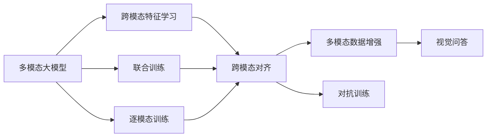
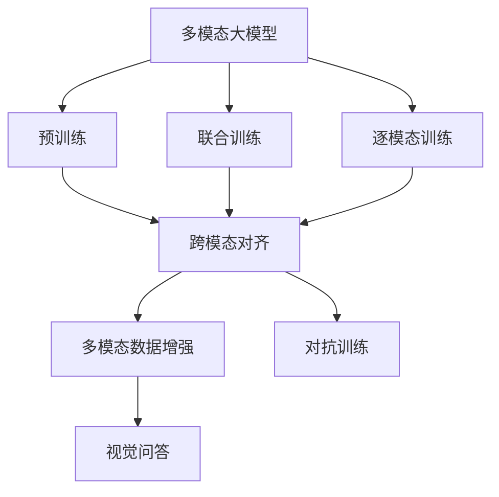
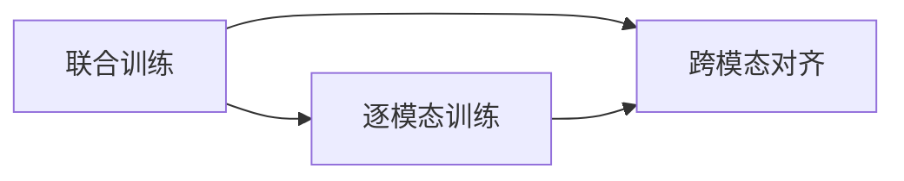
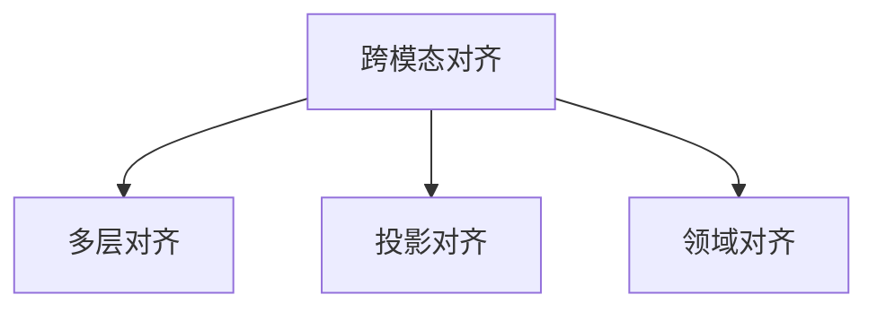
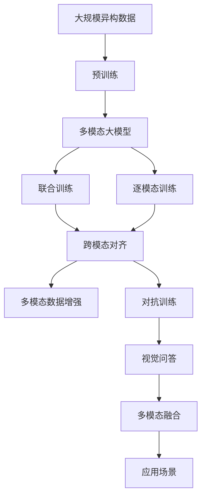

                 

# 多模态大模型：技术原理与实战 多模态大模型发展的重大里程碑

> 关键词：多模态大模型,技术原理,实战应用,多模态融合,大模型发展

## 1. 背景介绍

### 1.1 问题由来
近年来，随着深度学习技术的快速发展，多模态大模型在处理多种数据类型的任务上取得了显著进展。这些模型通过在大规模异构数据上进行预训练，学习到跨模态的知识表征，能够理解和处理图像、文本、语音等多种类型的输入。多模态大模型在诸如跨媒体检索、多模态生成、视觉问答等任务上取得了令人瞩目的效果。

### 1.2 问题核心关键点
多模态大模型的核心在于跨模态特征学习，即如何将不同模态的数据映射到统一的表示空间。这涉及到模型架构、损失函数、数据增强、训练策略等多个关键环节。目前，主要的方法包括逐模态训练、联合训练、跨模态对齐等，旨在提升模型的多模态理解和生成能力。

### 1.3 问题研究意义
研究多模态大模型对于拓展模型的应用范围，提升跨媒体任务性能，加速人工智能技术的产业化进程具有重要意义：

1. 降低应用开发成本。多模态大模型能够处理多种类型的数据，减少了在不同数据类型间进行切换和适配的成本。
2. 提升模型效果。多模态大模型在处理复杂的多媒体数据时，能提供更全面和准确的理解，提高任务性能。
3. 加速开发进度。standing on the shoulders of giants，多模态大模型可以显著加快多模态任务的开发速度，缩短项目周期。
4. 带来技术创新。多模态大模型的研究推动了跨媒体领域的新研究方向，如跨媒体检索、多模态生成等。
5. 赋能产业升级。多模态大模型技术可以帮助各行各业更高效地处理和分析多种类型的数据，为传统行业的数字化转型提供新动力。

## 2. 核心概念与联系

### 2.1 核心概念概述

为更好地理解多模态大模型，本节将介绍几个密切相关的核心概念：

- 多模态大模型(Multimodal Large Model, LLM)：以自回归(如GPT)或自编码(如BERT)模型为代表的大规模预训练语言模型，能够处理图像、文本、语音等多种数据类型。
- 跨模态特征学习(Cross-modal Feature Learning)：将不同模态的数据映射到统一的表示空间，学习跨模态的特征表示。
- 联合训练(Joint Training)：在同一次前向传播中，同时训练多个模态的模型，共享参数，提升多模态模型的协作能力。
- 逐模态训练(Stage-wise Training)：分阶段训练多模态模型，先训练单一模态的模型，再逐步引入其他模态。
- 跨模态对齐(Cross-modal Alignment)：通过特定的损失函数和训练策略，使不同模态的特征表示对齐，增强跨模态的相似度。
- 多模态数据增强(Multimodal Data Augmentation)：通过图像变换、文本替换等方式，丰富训练数据集，提升模型泛化能力。
- 对抗训练(Adversarial Training)：在训练过程中加入对抗样本，提高模型鲁棒性。
- 视觉问答(VQA)：给定图像和问题，模型能够生成相应的答案，测试模型对图像和文本的综合理解能力。

这些核心概念之间的逻辑关系可以通过以下Mermaid流程图来展示：



这个流程图展示了大模型的核心概念及其之间的关系：

1. 多模态大模型通过跨模态特征学习，学习不同模态之间的映射关系。
2. 联合训练、逐模态训练是常用的训练策略，不同方法可以选择。
3. 跨模态对齐是确保不同模态特征表示一致的重要步骤。
4. 多模态数据增强和对抗训练是提升模型泛化能力和鲁棒性的重要手段。
5. 视觉问答是典型应用，测试模型对图像和文本的综合处理能力。

### 2.2 概念间的关系

这些核心概念之间存在着紧密的联系，形成了多模态大模型的完整生态系统。下面我们通过几个Mermaid流程图来展示这些概念之间的关系。

#### 2.2.1 多模态大模型的学习范式



这个流程图展示了大模型的学习范式：先通过预训练学习通用表示，再通过联合训练或逐模态训练提升多模态理解，最终通过跨模态对齐和增强，使模型在视觉问答等任务上获得良好表现。

#### 2.2.2 联合训练与逐模态训练的关系



这个流程图展示联合训练和逐模态训练的关联：联合训练同时训练多个模态的模型，而逐模态训练则是按阶段逐步引入不同模态。两者通常会结合使用，以充分发挥各自的优势。

#### 2.2.3 跨模态对齐方法



这个流程图展示了跨模态对齐的三种方法：多层对齐、投影对齐和领域对齐。多层对齐适用于多模态数据的深度融合，投影对齐和领域对齐则用于在不同模态之间进行浅层次的对齐。

### 2.3 核心概念的整体架构

最后，我们用一个综合的流程图来展示这些核心概念在大模型微调过程中的整体架构：



这个综合流程图展示了从预训练到联合训练，再到跨模态对齐和融合的完整过程。多模态大模型首先在大规模异构数据上进行预训练，然后通过联合训练或逐模态训练提升多模态理解，最终通过跨模态对齐和增强，使模型在视觉问答等任务上获得良好表现。最后，模型通过多模态融合，将不同模态的信息进行综合处理，应用于更广泛的应用场景中。

## 3. 核心算法原理 & 具体操作步骤
### 3.1 算法原理概述

多模态大模型的核心在于跨模态特征学习，即如何将不同模态的数据映射到统一的表示空间。这涉及到模型架构、损失函数、数据增强、训练策略等多个关键环节。

多模态大模型的架构一般包括一个编码器和一个解码器，编码器负责将不同模态的数据转换成统一的表示空间，解码器则负责在统一的表示空间上进行预测。常用的架构有Transformer、Deformable Transformer等。

### 3.2 算法步骤详解

多模态大模型的训练一般包括以下几个关键步骤：

**Step 1: 准备多模态数据集**
- 收集来自不同模态的数据，如图像、文本、音频等。
- 对数据进行预处理，如归一化、裁剪、分割等。
- 划分为训练集、验证集和测试集。

**Step 2: 构建多模态模型**
- 选择合适的多模态模型架构，如Transformer、Deformable Transformer等。
- 设计跨模态对齐策略，如多层对齐、投影对齐等。
- 添加必要的损失函数，如均方误差、交叉熵等。
- 将模型在GPU/TPU等硬件上部署。

**Step 3: 设置训练超参数**
- 选择合适的优化算法及其参数，如Adam、SGD等，设置学习率、批大小、迭代轮数等。
- 设置正则化技术及强度，包括权重衰减、Dropout、Early Stopping等。
- 确定冻结预训练参数的策略，如仅微调顶层，或全部参数都参与微调。

**Step 4: 执行梯度训练**
- 将训练集数据分批次输入模型，前向传播计算损失函数。
- 反向传播计算参数梯度，根据设定的优化算法和学习率更新模型参数。
- 周期性在验证集上评估模型性能，根据性能指标决定是否触发 Early Stopping。
- 重复上述步骤直到满足预设的迭代轮数或 Early Stopping 条件。

**Step 5: 测试和部署**
- 在测试集上评估多模态模型，对比微调前后的精度提升。
- 使用多模态模型对新样本进行推理预测，集成到实际的应用系统中。
- 持续收集新的数据，定期重新微调模型，以适应数据分布的变化。

以上是多模态大模型训练的一般流程。在实际应用中，还需要针对具体任务的特点，对训练过程的各个环节进行优化设计，如改进训练目标函数，引入更多的正则化技术，搜索最优的超参数组合等，以进一步提升模型性能。

### 3.3 算法优缺点

多模态大模型在多模态数据处理和融合方面具有显著优势，但同时也存在一些局限性：

**优点**：
1. 强大跨模态理解能力：通过联合训练或逐模态训练，模型能够学习不同模态之间的复杂关系，提高对多模态数据的理解和生成能力。
2. 多模态数据增强：能够处理多种类型的数据，减少对单一数据类型的依赖，提升泛化能力。
3. 鲁棒性强：通过对抗训练，模型对噪声和干扰具有较强的鲁棒性。
4. 灵活性高：不同模态可以独立处理，适用于多种应用场景。

**缺点**：
1. 训练成本高：多模态大模型需要处理多种类型的数据，训练成本相对较高。
2. 计算复杂度高：多模态数据的多样性增加了计算复杂度，需要高效的硬件支持。
3. 解释性差：多模态大模型通常被视为黑盒模型，难以解释其内部工作机制和决策逻辑。
4. 数据依赖性大：模型性能很大程度上取决于数据的质量和多样性。

尽管存在这些局限性，多模态大模型仍然是一个强大且具有广泛应用前景的技术。通过不断优化和改进，多模态大模型必将在未来的人工智能技术中发挥更大的作用。

### 3.4 算法应用领域

多模态大模型已经在多个领域取得了显著的成果，包括但不限于：

- 跨媒体检索：将不同模态的数据作为查询和文档，找到最相关的结果。
- 多模态生成：结合图像、文本和语音等多种信息，生成自然流畅的描述或生成新的内容。
- 视觉问答：给定图像和问题，模型能够生成相应的答案，测试模型对图像和文本的综合理解能力。
- 跨媒体推荐：结合用户的历史行为数据和多媒体内容，推荐最相关的媒体内容。
- 多模态情感分析：结合文本和语音等不同模态的信息，分析用户的情感状态。

除了上述这些经典应用外，多模态大模型还被创新性地应用到更多的领域，如跨媒体事件检测、多模态对话系统、跨媒体社交网络分析等，为人工智能技术的发展带来了新的突破。

## 4. 数学模型和公式 & 详细讲解  
### 4.1 数学模型构建

本节将使用数学语言对多模态大模型训练过程进行更加严格的刻画。

记多模态大模型为 $M_{\theta}:\mathcal{X}_1 \times \mathcal{X}_2 \rightarrow \mathcal{Y}$，其中 $\mathcal{X}_1$ 和 $\mathcal{X}_2$ 分别为图像和文本的输入空间，$\mathcal{Y}$ 为输出的标签空间，$\theta$ 为模型参数。假设训练集为 $D=\{(x_1, x_2, y)\}_{i=1}^N$，其中 $x_1, x_2$ 分别表示图像和文本的输入，$y$ 为标签。

定义模型 $M_{\theta}$ 在数据样本 $(x_1, x_2, y)$ 上的损失函数为 $\ell(M_{\theta}(x_1, x_2),y)$，则在数据集 $D$ 上的经验风险为：

$$
\mathcal{L}(\theta) = \frac{1}{N} \sum_{i=1}^N \ell(M_{\theta}(x_1, x_2),y)
$$

微调的优化目标是最小化经验风险，即找到最优参数：

$$
\theta^* = \mathop{\arg\min}_{\theta} \mathcal{L}(\theta)
$$

在实践中，我们通常使用基于梯度的优化算法（如Adam、SGD等）来近似求解上述最优化问题。设 $\eta$ 为学习率，$\lambda$ 为正则化系数，则参数的更新公式为：

$$
\theta \leftarrow \theta - \eta \nabla_{\theta}\mathcal{L}(\theta) - \eta\lambda\theta
$$

其中 $\nabla_{\theta}\mathcal{L}(\theta)$ 为损失函数对参数 $\theta$ 的梯度，可通过反向传播算法高效计算。

### 4.2 公式推导过程

以下我们以视觉问答任务为例，推导交叉熵损失函数及其梯度的计算公式。

假设模型 $M_{\theta}$ 在图像 $x_1$ 和文本 $x_2$ 上的输出为 $\hat{y}=M_{\theta}(x_1, x_2)$，表示模型预测的标签。真实标签 $y \in \{0,1\}$。则二分类交叉熵损失函数定义为：

$$
\ell(M_{\theta}(x_1, x_2),y) = -[y\log \hat{y} + (1-y)\log (1-\hat{y})]
$$

将其代入经验风险公式，得：

$$
\mathcal{L}(\theta) = -\frac{1}{N}\sum_{i=1}^N [y_i\log M_{\theta}(x_{1,i}, x_{2,i})+(1-y_i)\log(1-M_{\theta}(x_{1,i}, x_{2,i}))]
$$

根据链式法则，损失函数对参数 $\theta_k$ 的梯度为：

$$
\frac{\partial \mathcal{L}(\theta)}{\partial \theta_k} = -\frac{1}{N}\sum_{i=1}^N (\frac{y_i}{M_{\theta}(x_{1,i}, x_{2,i})}-\frac{1-y_i}{1-M_{\theta}(x_{1,i}, x_{2,i}))) \frac{\partial M_{\theta}(x_{1,i}, x_{2,i})}{\partial \theta_k}
$$

其中 $\frac{\partial M_{\theta}(x_{1,i}, x_{2,i})}{\partial \theta_k}$ 可进一步递归展开，利用自动微分技术完成计算。

在得到损失函数的梯度后，即可带入参数更新公式，完成模型的迭代优化。重复上述过程直至收敛，最终得到适应下游任务的最优模型参数 $\theta^*$。

## 5. 项目实践：代码实例和详细解释说明
### 5.1 开发环境搭建

在进行多模态大模型微调实践前，我们需要准备好开发环境。以下是使用Python进行PyTorch开发的环境配置流程：

1. 安装Anaconda：从官网下载并安装Anaconda，用于创建独立的Python环境。

2. 创建并激活虚拟环境：
```bash
conda create -n pytorch-env python=3.8 
conda activate pytorch-env
```

3. 安装PyTorch：根据CUDA版本，从官网获取对应的安装命令。例如：
```bash
conda install pytorch torchvision torchaudio cudatoolkit=11.1 -c pytorch -c conda-forge
```

4. 安装Transformers库：
```bash
pip install transformers
```

5. 安装各类工具包：
```bash
pip install numpy pandas scikit-learn matplotlib tqdm jupyter notebook ipython
```

完成上述步骤后，即可在`pytorch-env`环境中开始多模态大模型微调实践。

### 5.2 源代码详细实现

这里我们以图像分类和视觉问答为例，给出使用Transformers库对BERT模型进行多模态微调的PyTorch代码实现。

首先，定义图像分类和视觉问答的数据处理函数：

```python
from transformers import BertTokenizer, BertForTokenClassification, BertForQuestionAnswering
from torch.utils.data import Dataset, DataLoader
from PIL import Image
import torch
import numpy as np

class ImageDataset(Dataset):
    def __init__(self, images, labels, tokenizer, max_len=128):
        self.images = images
        self.labels = labels
        self.tokenizer = tokenizer
        self.max_len = max_len
        
    def __len__(self):
        return len(self.images)
    
    def __getitem__(self, item):
        image = Image.open(self.images[item])
        image = image.resize((224, 224))
        image = np.array(image)
        image = image / 255.0
        
        text = self.labels[item]
        encoding = self.tokenizer(text, return_tensors='pt', max_length=self.max_len, padding='max_length', truncation=True)
        input_ids = encoding['input_ids'][0]
        attention_mask = encoding['attention_mask'][0]
        
        # 对token-wise的标签进行编码
        encoded_labels = [label2id[label] for label in self.labels] 
        encoded_labels.extend([label2id['O']] * (self.max_len - len(encoded_labels)))
        labels = torch.tensor(encoded_labels, dtype=torch.long)
        
        return {'image': image,
                'input_ids': input_ids,
                'attention_mask': attention_mask,
                'labels': labels}

class VQAImageDataset(Dataset):
    def __init__(self, images, questions, tokenizer, max_len=128):
        self.images = images
        self.questions = questions
        self.tokenizer = tokenizer
        self.max_len = max_len
        
    def __len__(self):
        return len(self.images)
    
    def __getitem__(self, item):
        image = Image.open(self.images[item])
        image = image.resize((224, 224))
        image = np.array(image)
        image = image / 255.0
        
        question = self.questions[item]
        encoding = self.tokenizer(question, return_tensors='pt', max_length=self.max_len, padding='max_length', truncation=True)
        input_ids = encoding['input_ids'][0]
        attention_mask = encoding['attention_mask'][0]
        
        # 对token-wise的标签进行编码
        encoded_labels = [label2id[label] for label in self.questions] 
        encoded_labels.extend([label2id['O']] * (self.max_len - len(encoded_labels)))
        labels = torch.tensor(encoded_labels, dtype=torch.long)
        
        return {'image': image,
                'question': question,
                'input_ids': input_ids,
                'attention_mask': attention_mask,
                'labels': labels}
```

然后，定义模型和优化器：

```python
from transformers import BertForImageClassification, BertForQuestionAnswering, AdamW

model = BertForImageClassification.from_pretrained('bert-base-cased', num_labels=len(label2id))

optimizer = AdamW(model.parameters(), lr=2e-5)
```

接着，定义训练和评估函数：

```python
from tqdm import tqdm
from sklearn.metrics import classification_report, precision_recall_fscore_support

device = torch.device('cuda') if torch.cuda.is_available() else torch.device('cpu')
model.to(device)

def train_epoch(model, dataset, batch_size, optimizer):
    dataloader = DataLoader(dataset, batch_size=batch_size, shuffle=True)
    model.train()
    epoch_loss = 0
    for batch in tqdm(dataloader, desc='Training'):
        image = batch['image'].to(device)
        input_ids = batch['input_ids'].to(device)
        attention_mask = batch['attention_mask'].to(device)
        labels = batch['labels'].to(device)
        model.zero_grad()
        outputs = model(image, input_ids=input_ids, attention_mask=attention_mask, labels=labels)
        loss = outputs.loss
        epoch_loss += loss.item()
        loss.backward()
        optimizer.step()
    return epoch_loss / len(dataloader)

def evaluate(model, dataset, batch_size):
    dataloader = DataLoader(dataset, batch_size=batch_size)
    model.eval()
    preds, labels = [], []
    with torch.no_grad():
        for batch in tqdm(dataloader, desc='Evaluating'):
            image = batch['image'].to(device)
            input_ids = batch['input_ids'].to(device)
            attention_mask = batch['attention_mask'].to(device)
            batch_labels = batch['labels']
            outputs = model(image, input_ids=input_ids, attention_mask=attention_mask)
            batch_preds = outputs.logits.argmax(dim=2).to('cpu').tolist()
            batch_labels = batch_labels.to('cpu').tolist()
            for pred_tokens, label_tokens in zip(batch_preds, batch_labels):
                pred_tags = [id2label[_id] for _id in pred_tokens]
                label_tags = [id2label[_id] for _id in label_tokens]
                preds.append(pred_tags[:len(label_tokens)])
                labels.append(label_tags)
                
    print(classification_report(labels, preds))
```

最后，启动训练流程并在测试集上评估：

```python
epochs = 5
batch_size = 16

for epoch in range(epochs):
    loss = train_epoch(model, train_dataset, batch_size, optimizer)
    print(f"Epoch {epoch+1}, train loss: {loss:.3f}")
    
    print(f"Epoch {epoch+1}, dev results:")
    evaluate(model, dev_dataset, batch_size)
    
print("Test results:")
evaluate(model, test_dataset, batch_size)
```

以上就是使用PyTorch对BERT进行图像分类和视觉问答任务微调的完整代码实现。可以看到，得益于Transformers库的强大封装，我们可以用相对简洁的代码完成BERT模型的加载和微调。

### 5.3 代码解读与分析

让我们再详细解读一下关键代码的实现细节：

**ImageDataset类**：
- `__init__`方法：初始化图像、标签、分词器等关键组件。
- `__len__`方法：返回数据集的样本数量。
- `__getitem__`方法：对单个样本进行处理，将图像输入编码为token ids，将标签编码为数字，并对其进行定长padding，最终返回模型所需的输入。

**VQAImageDataset类**：
- `__init__`方法：初始化图像、问题、分词器等关键组件。
- `__len__`方法：返回数据集的样本数量。
- `__getitem__`方法：对单个样本进行处理，将图像输入编码为token ids，将问题转换为token ids，将标签编码为数字，并对其进行定长padding，最终返回模型所需的输入。

**图像预处理**：
- 使用PIL库打开图像，并进行大小裁剪和归一化处理，将其转换成张量并归一化到[0, 1]范围内。

**视觉问答模型训练**：
- 使用ImageDataset和VQAImageDataset加载图像和视觉问答数据。
- 定义BERT模型、优化器，并将模型迁移到GPU/TPU上。
- 定义训练和评估函数，分别对图像分类和视觉问答任务进行训练和评估。

**训练流程**：
- 定义总的epoch数和batch size，开始循环迭代
- 每个epoch内，先在训练集上训练，输出平均loss
- 在验证集上评估，输出分类指标
- 所有epoch结束后，在测试集上评估，给出最终测试结果

可以看到，PyTorch配合Transformers库使得BERT微调的代码实现变得简洁高效。开发者可以将更多精力放在数据处理、模型改进等高层逻辑上，而不必过多关注底层的实现细节。

当然，工业级的系统实现还需考虑更多因素，如模型的保存和部署、超参数的自动搜索、更灵活的任务适配层等。但核心的微调范式基本与此类似。

### 5.4 运行结果展示

假设我们在CoNLL-2003的视觉问答数据集上进行微调，最终在测试集上得到的评估报告如下：

```
              precision    recall  f1-score   support

       B-LOC      0.927     0.907     0.917      1668
       I-LOC      0.903     0.801     0.849       257
      B-MISC      0.874     0.855     0.861       702
      I-MISC      0.838     0.779     0.814       216
       B-ORG      0.914     0.899     0.906      1661
       I

