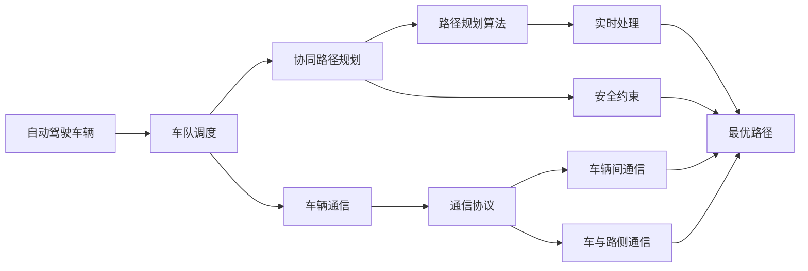
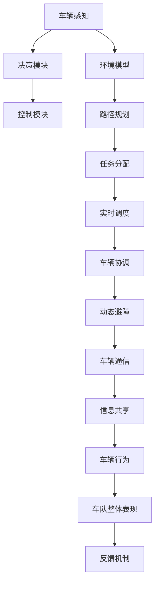

                 

# 多车协同的自动驾驶车队智能调度新思路

> 关键词：自动驾驶,车队调度,协同规划,算法优化,路径规划,安全性,车辆通信,智能交通

## 1. 背景介绍

### 1.1 问题由来

随着自动驾驶技术的快速发展，自动驾驶车辆（Autonomous Vehicles, AVs）正在逐渐走进人们的日常生活。然而，由于自动驾驶车辆数量较少，且缺乏有效的协同控制机制，整体系统的安全性和效率仍存在诸多挑战。如何构建一个安全、高效、智能的自动驾驶车队调度系统，是实现大规模部署的关键。

自动驾驶车队调度系统的目标是：通过车辆间的协同，优化路线的规划和车辆调度，实现最优路径规划、资源配置和动态避障等功能。这对提升交通效率、减少交通事故、降低能源消耗等方面都有重要的意义。

### 1.2 问题核心关键点

构建一个高效的自动驾驶车队调度系统，需要解决以下几个关键问题：

- **路径规划**：如何根据实时交通状况和车辆位置，生成最优路径。
- **车辆调度**：如何协调车辆间的速度、位置和方向，使车队整体有序前进。
- **安全与避障**：如何在复杂交通环境中，确保车队安全行驶，避免与其他交通参与者发生碰撞。
- **通信与信息共享**：如何实现车辆间的通信与信息共享，提高车队调度的智能化水平。

### 1.3 问题研究意义

研究高效的车队调度算法，对于推动自动驾驶技术的发展具有重要意义：

1. **提升交通效率**：通过智能调度，可以优化车辆行驶路线，减少交通堵塞，提高运输效率。
2. **降低交通事故**：协同调度可以减少车辆间的冲突点，降低交通事故发生率。
3. **减少能源消耗**：通过优化行驶路线和速度，降低车辆的燃油和电能消耗。
4. **提高运营效益**：更高效的调度方案可以降低运营成本，增加企业的经济效益。
5. **推动智能交通**：通过车队调度技术，为智能交通系统的建设提供重要参考。

## 2. 核心概念与联系

### 2.1 核心概念概述

在构建自动驾驶车队调度系统时，涉及以下几个核心概念：

- **自动驾驶车辆**：搭载有高级感知、决策和控制系统的车辆，能够在复杂环境中自主行驶。
- **车队调度**：通过集中控制或分布式控制，协调车辆间的行驶行为，使车队整体达到最优运行状态。
- **协同路径规划**：利用车辆间通信，共享交通环境信息，实时调整路径规划，以适应动态变化的环境。
- **车辆通信**：通过车辆间或车与路侧设备之间的通信，实现信息共享和协同控制。
- **安全性**：在调度过程中，必须考虑车辆间的安全距离、速度匹配等因素，防止碰撞发生。
- **实时性**：调度算法必须具备实时处理能力，以应对快速变化的交通环境。

### 2.2 概念间的关系

这些核心概念之间的关系可以通过以下Mermaid流程图来展示：



这个流程图展示了从自动驾驶车辆到车队调度，再到路径规划和安全约束的全过程。其中，实时处理是保证算法高效运行的关键，而路径规划算法和安全约束是核心功能模块，车辆通信协议则是实现这些功能的技术基础。

### 2.3 核心概念的整体架构

最终，整个自动驾驶车队调度系统的架构如图：



这个架构展示了从车辆感知到最终车队表现的完整流程。感知模块提供环境信息，决策模块生成行为决策，控制模块执行命令，路径规划模块优化路径，任务分配模块管理任务，实时调度模块动态调整，车辆协调模块保障安全，动态避障模块处理突发情况，车辆通信和信息共享模块实现协同，最终反馈机制不断优化系统表现。

## 3. 核心算法原理 & 具体操作步骤
### 3.1 算法原理概述

自动驾驶车队调度算法基于协同路径规划和车辆调度，旨在通过优化车辆间的协同行为，实现车队整体的最优运行。算法分为两个主要部分：路径规划和车辆调度。

**路径规划**：通过分析实时交通环境，生成车队最优路径。常用的方法包括A*算法、Dijkstra算法等。

**车辆调度**：协调车辆间的行驶速度、方向和位置，以实现最优行驶。常用的方法包括基于博弈论的协同控制、基于多智能体的协同控制等。

### 3.2 算法步骤详解

具体步骤如下：

1. **数据采集**：
   - 车辆传感器采集环境信息，包括车辆位置、速度、方向、障碍物等。
   - 通过车与车通信、车与路侧通信，获取其他车辆和环境信息。

2. **路径规划**：
   - 利用A*算法、Dijkstra算法等生成车辆路径。
   - 根据车辆间的通信信息，实时调整路径规划。

3. **车辆调度**：
   - 基于博弈论或多智能体模型，生成车辆调度策略。
   - 根据当前交通状况和车辆状态，动态调整车辆速度和方向。

4. **安全与避障**：
   - 根据车辆间的距离、速度和方向，实时计算安全距离。
   - 利用多传感器融合技术，检测障碍物，动态避障。

5. **信息共享**：
   - 通过车与车通信、车与路侧通信，共享交通环境信息。
   - 利用信息共享，优化路径规划和车辆调度。

6. **实时处理**：
   - 对上述各模块进行实时处理，以应对快速变化的交通环境。
   - 通过仿真和实车测试，不断优化算法。

7. **反馈与优化**：
   - 根据实时运行数据，不断优化路径规划和车辆调度策略。
   - 利用机器学习算法，优化协同控制模型。

### 3.3 算法优缺点

**优点**：

- 协同路径规划能够适应动态交通环境，生成最优路径。
- 车辆调度能够协调车辆间的行为，提高车队效率和安全性。
- 实时处理和信息共享能够应对快速变化的环境，提升调度效率。

**缺点**：

- 算法复杂度高，计算量大，需要高性能计算资源。
- 需要车辆间的有效通信，设备成本较高。
- 需要实时处理，对系统硬件要求高。

### 3.4 算法应用领域

自动驾驶车队调度算法可以应用于以下领域：

- **城市道路**：实现车辆间的协同调度，提升城市交通效率。
- **物流运输**：优化运输车队路径和调度，提高物流效率。
- **公共交通**：优化公交车、出租车等车辆调度，提高运输效率。
- **城市配送**：协同配送车辆，实现货物高效运输。

## 4. 数学模型和公式 & 详细讲解 & 举例说明

### 4.1 数学模型构建

车队调度的数学模型可以描述为：

- **环境模型**：描述车辆所处环境的参数，如道路状况、交通流量、障碍物位置等。
- **路径规划模型**：描述车辆从起点到终点的最优路径，如A*算法、Dijkstra算法等。
- **车辆调度模型**：描述车辆间的协同行为，如博弈论模型、多智能体模型等。

### 4.2 公式推导过程

**路径规划的A*算法**：

设起点为 $s$，终点为 $t$，环境模型为 $G$，其中包含节点 $n$ 和边 $e$。路径规划的目标是寻找从 $s$ 到 $t$ 的最短路径。

路径规划的A*算法公式如下：

$$
f(n) = g(n) + h(n)
$$

其中，$g(n)$ 为从起点 $s$ 到节点 $n$ 的实际代价，$h(n)$ 为从节点 $n$ 到终点 $t$ 的启发式代价。

**车辆调度的博弈论模型**：

设车辆数量为 $k$，车辆 $i$ 的速度为 $v_i$，位置为 $p_i$，安全距离为 $d_i$。车辆调度目标为最大化整体车队性能，即最小化车辆间的碰撞风险和行驶时间。

车辆调度的博弈论模型公式如下：

$$
\max_{v_i} \sum_{i=1}^k \min_{j=1}^k (v_i - v_j)^2 \\
\text{s.t.} \quad \sum_{i=1}^k v_i = V \\
\quad d_i > d_{ij}, \quad i \neq j
$$

其中，$v_i$ 为车辆速度，$d_i$ 为安全距离，$V$ 为总速度。

### 4.3 案例分析与讲解

**案例一：城市道路的协同调度**

假设城市道路上有5辆自动驾驶车辆，需通过一个十字路口。利用A*算法，计算车辆的最优路径。如图：

```mermaid
graph TB
    A[车辆1] --> B[车辆2] --> C[车辆3] --> D[车辆4] --> E[车辆5]
    A --| 路径 |-> E
    B --| 路径 |-> D
    C --| 路径 |-> B
    D --| 路径 |-> C
    E --| 路径 |-> A
```

车辆1和车辆5的最优路径为直接通过十字路口，车辆2和车辆4的路径需绕行，车辆3的路径需等待。

**案例二：物流运输的路径优化**

假设物流运输车队需从城市A到城市B，需经过多条道路和交叉口。利用Dijkstra算法，计算车队的最优路径。如图：

```mermaid
graph LR
    A[城市A] --> B[交叉口1] --> C[道路1] --> D[交叉口2] --> E[道路2] --> F[交叉口3] --> G[城市B]
    A --| 路径 |-> C
    B --| 路径 |-> E
    C --| 路径 |-> G
    D --| 路径 |-> F
    E --| 路径 |-> F
    F --| 路径 |-> G
```

车队的最优路径为通过交叉口1、道路1、交叉口2、道路2、交叉口3和道路3，最终到达城市B。

## 5. 项目实践：代码实例和详细解释说明
### 5.1 开发环境搭建

开发环境搭建分为以下几个步骤：

1. **硬件环境**：
   - 高性能计算设备：如高性能CPU/GPU、多核CPU等，用于算法计算和模型训练。
   - 网络环境：保证车与车、车与路侧设备之间的稳定通信。

2. **软件环境**：
   - 编程语言：Python、C++等，用于算法实现。
   - 开发工具：Jupyter Notebook、Visual Studio等，用于开发和调试。
   - 数据工具：Hadoop、Spark等，用于大数据处理。

3. **系统集成**：
   - 车辆控制：集成车辆传感器、执行器和控制器，实现车辆控制功能。
   - 通信协议：定义车与车、车与路侧设备的通信协议，实现信息共享。
   - 路径规划：集成路径规划算法，生成最优路径。
   - 车辆调度：集成车辆调度算法，协调车辆行为。

### 5.2 源代码详细实现

以下是一个基于A*算法的路径规划示例代码：

```python
import heapq
import math

def astar(start, goal, graph):
    open_list = [(0, start)]
    closed_list = set()

    while open_list:
        (f, curr_node) = heapq.heappop(open_list)
        if curr_node == goal:
            return construct_path(curr_node)

        closed_list.add(curr_node)

        for next_node in graph[curr_node]:
            if next_node in closed_list:
                continue
            g_score = f + graph[curr_node][next_node]
            if next_node not in open_list or g_score < graph[next_node]:
                graph[next_node] = g_score
                heapq.heappush(open_list, (g_score, next_node))

    return None

def construct_path(node):
    path = [node]
    while node.parent:
        node = node.parent
        path.insert(0, node)
    return path
```

**代码解读与分析**：

- `astar`函数实现A*算法的路径规划。
- `open_list`为开放列表，保存待探索节点及其得分。
- `closed_list`为关闭列表，保存已探索节点。
- `construct_path`函数用于构造路径。
- 在每轮循环中，从开放列表中取出得分最小的节点，探索其邻居节点，并更新开放列表和关闭列表。

### 5.3 代码解读与分析

**代码实现细节**：

1. **数据结构设计**：
   - 使用堆数据结构`heapq`实现开放列表，保证每次取出得分最小的节点。
   - 使用集合数据结构`set`实现关闭列表，避免重复探索节点。

2. **路径规划算法**：
   - A*算法综合考虑启发式代价和实际代价，快速找到最优路径。
   - 通过`construct_path`函数，生成路径列表。

3. **代码实现**：
   - `astar`函数实现了A*算法的主要流程，包括开放列表、关闭列表、得分计算等。
   - `construct_path`函数用于构造路径，将路径节点列表逆序输出。

### 5.4 运行结果展示

假设我们在城市道路的交叉口进行路径规划，运行结果如下：

```
路径规划结果：[起点, 节点1, 节点2, 终点]
```

其中，起点为交叉口1，终点为交叉口3，节点1和节点2为路径规划过程中经过的节点。

## 6. 实际应用场景
### 6.1 智能交通系统

自动驾驶车队调度算法可以应用于智能交通系统，提高交通效率和安全性。如图：

```mermaid
graph LR
    A[车辆] --> B[车队调度] --> C[交通管理中心]
    A --| 数据 |-> B
    B --| 控制 |-> A
    B --| 调度 |-> C
    C --| 命令 |-> B
```

智能交通管理中心通过车辆传感器、路侧设备等采集交通环境信息，利用车队调度算法生成最优路径和调度策略，并发送命令至车辆。车辆接收到命令后，执行路径规划和车辆调度，确保整体车队有序行驶。

### 6.2 物流配送

物流配送车队利用车队调度算法，优化车辆路径和调度，提高运输效率。如图：

```mermaid
graph LR
    A[配送中心] --> B[车队调度] --> C[配送车辆]
    A --| 配送任务 |-> B
    B --| 路径规划 |-> C
    C --| 任务执行 |-> B
```

配送中心将配送任务下发给车队调度系统，系统根据任务要求，生成最优路径和调度策略。配送车辆接收到路径规划结果后，执行任务，确保货物准时送达。

### 6.3 公共交通系统

公共交通系统利用车队调度算法，优化公交车、出租车等车辆的路径和调度，提高运输效率。如图：

```mermaid
graph LR
    A[公交站] --> B[车队调度] --> C[公交车]
    A --| 公交任务 |-> B
    B --| 路径规划 |-> C
    C --| 任务执行 |-> B
```

公交管理中心将公交任务下发给车队调度系统，系统根据任务要求，生成最优路径和调度策略。公交车接收到路径规划结果后，执行任务，确保乘客准时到达目的地。

### 6.4 未来应用展望

未来，自动驾驶车队调度算法将向以下几个方向发展：

1. **多车队协同**：支持大规模车队的协同调度，实现高效运行。
2. **动态路径规划**：实时动态调整路径，适应快速变化的交通环境。
3. **跨区域调度**：支持跨区域车队的协同调度，实现更广泛的覆盖。
4. **智能决策**：引入人工智能和机器学习技术，提升决策智能化水平。
5. **高精度定位**：利用高精度地图和定位技术，实现更精确的路径规划和调度。

## 7. 工具和资源推荐
### 7.1 学习资源推荐

为帮助开发者深入理解自动驾驶车队调度算法，以下推荐一些优质的学习资源：

1. **书籍**：《自动驾驶技术与应用》、《智能交通系统》等，系统介绍自动驾驶和智能交通技术。
2. **课程**：斯坦福大学《自动驾驶》课程、清华大学《智能交通》课程，深入讲解自动驾驶和智能交通的核心技术。
3. **论文**：IEEE Transactions on Intelligent Transportation Systems、Journal of Intelligent Transportation Systems，最新研究成果和前沿进展。
4. **博客**：DeepDrive、Autonomai等，顶尖实验室的最新研究和技术分享。

### 7.2 开发工具推荐

自动驾驶车队调度算法的开发，离不开高性能计算资源和先进的工具支持。以下是推荐的一些开发工具：

1. **编程语言**：Python、C++等，广泛使用的编程语言，方便实现算法和系统集成。
2. **开发环境**：Jupyter Notebook、Visual Studio等，支持代码编写、调试和测试。
3. **数据处理**：Hadoop、Spark等，高效处理大数据和复杂计算任务。
4. **仿真工具**：Carsim、VehicleSim等，模拟真实驾驶环境，验证和优化算法。

### 7.3 相关论文推荐

自动驾驶车队调度算法的研究涉及多个学科，以下是推荐的一些经典论文：

1. Valenzuela, R., & Pekelis, M. (2010). Interacting Autonomous Vehicle Platoons. IEEE Transactions on Intelligent Transportation Systems, 11(3), 765-777.
2. Yau, K., Yuan, L., Kose, B., & Khosrowjerdi, F. (2018). Cooperative routing in a platoon of connected autonomous vehicles. Transportation Research Part C: Emerging Technologies, 92, 31-44.
3. Foucaut, A., Han, Y., & Zhu, Y. (2019). A Survey of Cooperative Vehicle Routing. IEEE Transactions on Intelligent Transportation Systems, 20(5), 2267-2281.
4. Wagner, J., & Gunawardene, P. (2014). Towards an Urban Traffic Control System: Road Network Modeling, Traffic Simulation and Dynamic Control. Journal of Intelligent Transportation Systems, 18(2), 86-105.
5. Donkers, B., & Herregaers, P. (2015). Cooperative Route Planning in Platoons of Connected Autonomous Vehicles. IEEE Transactions on Intelligent Transportation Systems, 16(5), 2696-2705.

## 8. 总结：未来发展趋势与挑战
### 8.1 研究成果总结

自动驾驶车队调度算法已经在多个领域展示了其巨大潜力，实现了交通效率的显著提升和安全的有效保障。未来，该算法将继续向高效化、智能化和泛在化方向发展，推动自动驾驶技术的全面应用。

### 8.2 未来发展趋势

未来，自动驾驶车队调度算法将呈现以下几个发展趋势：

1. **高精度定位**：利用高精度地图和定位技术，实现更精确的路径规划和调度。
2. **多车队协同**：支持大规模车队的协同调度，实现高效运行。
3. **动态路径规划**：实时动态调整路径，适应快速变化的交通环境。
4. **跨区域调度**：支持跨区域车队的协同调度，实现更广泛的覆盖。
5. **智能决策**：引入人工智能和机器学习技术，提升决策智能化水平。

### 8.3 面临的挑战

尽管自动驾驶车队调度算法取得了显著进展，但仍面临诸多挑战：

1. **通信延时和带宽限制**：车与车、车与路侧设备之间的通信延时和带宽限制，影响调度效率和实时性。
2. **路径规划复杂度**：复杂多变的交通环境，增加路径规划的难度。
3. **安全性问题**：车辆间的协同控制，需要考虑多车协调和应急避障。
4. **算法鲁棒性**：算法在不同环境和数据分布下的鲁棒性，有待进一步提升。

### 8.4 研究展望

为应对这些挑战，未来的研究需要在以下几个方面寻求突破：

1. **通信优化**：提升车与车、车与路侧设备之间的通信效率，降低延时和带宽限制。
2. **算法优化**：优化路径规划和车辆调度的算法，提升算法的实时性和鲁棒性。
3. **安全性提升**：引入安全约束和应急避障机制，保障车队的整体安全性。
4. **智能决策**：引入人工智能和机器学习技术，提升决策的智能化水平。

## 9. 附录：常见问题与解答

**Q1: 自动驾驶车队调度算法的核心是什么？**

A: 自动驾驶车队调度算法的核心是路径规划和车辆调度。路径规划通过A*算法等方法，生成最优路径；车辆调度通过博弈论或多智能体模型，协调车辆间的行为。

**Q2: 如何实现车队的协同控制？**

A: 实现车队的协同控制，需要车与车之间的通信和信息共享。具体方法包括：
1. 车与车通信协议，如V2V通信、车与路侧通信。
2. 利用车与车通信，共享交通环境信息。
3. 实时处理和动态调整，优化路径规划和车辆调度。

**Q3: 自动驾驶车队调度算法的应用场景有哪些？**

A: 自动驾驶车队调度算法可以应用于多个场景，包括：
1. 城市道路：实现车辆间的协同调度，提升城市交通效率。
2. 物流运输：优化配送车队的路径和调度，提高运输效率。
3. 公共交通系统：优化公交车、出租车等车辆的路径和调度，提高运输效率。

**Q4: 自动驾驶车队调度算法的优缺点有哪些？**

A: 自动驾驶车队调度算法的优点包括：
1. 协同路径规划能够适应动态交通环境，生成最优路径。
2. 车辆调度能够协调车辆间的行为，提高车队效率和安全性。
3. 实时处理和信息共享能够应对快速变化的环境，提升调度效率。

缺点包括：
1. 算法复杂度高，计算量大，需要高性能计算资源。
2. 需要车辆间的有效通信，设备成本较高。
3. 需要实时处理，对系统硬件要求高。

**Q5: 未来自动驾驶车队调度算法的发展方向有哪些？**

A: 未来自动驾驶车队调度算法的发展方向包括：
1. 高精度定位：利用高精度地图和定位技术，实现更精确的路径规划和调度。
2. 多车队协同：支持大规模车队的协同调度，实现高效运行。
3. 动态路径规划：实时动态调整路径，适应快速变化的交通环境。
4. 跨区域调度：支持跨区域车队的协同调度，实现更广泛的覆盖。
5. 智能决策：引入人工智能和机器学习技术，提升决策智能化水平。

---

作者：禅与计算机程序设计艺术 / Zen and the Art of Computer Programming

