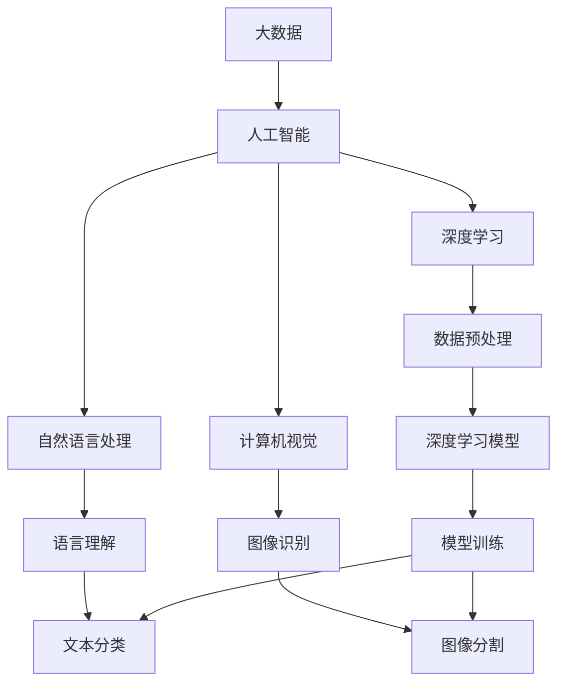
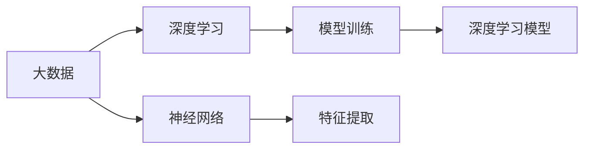
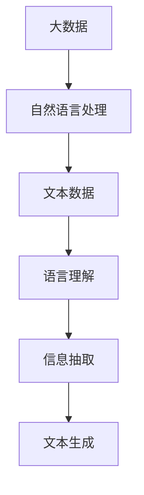
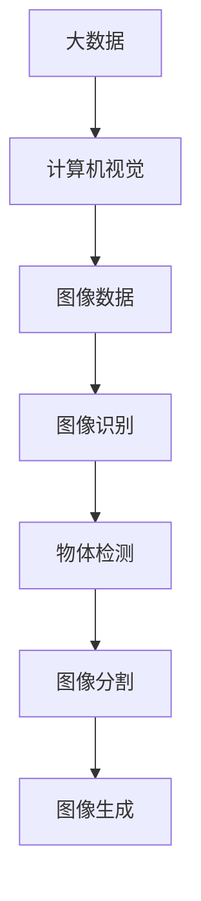

                 

# 大数据对AI学习的影响

## 1. 背景介绍

随着信息技术的迅猛发展，大数据正逐渐成为驱动人工智能（AI）进步的关键引擎。无论是深度学习、自然语言处理（NLP），还是计算机视觉，大数据都提供了源源不断的动力和素材，推动着AI技术的不断突破。

### 1.1 问题由来

大数据对AI学习的影响主要体现在以下几个方面：

1. **数据规模**：随着互联网的普及和物联网的兴起，数据量呈指数级增长，提供了大量的训练素材。
2. **数据多样性**：数据的来源和类型多样化，包括文本、图像、视频、音频等，覆盖了广泛的应用场景。
3. **数据质量**：大数据的多样性和复杂性也带来了数据清洗、标注和处理的挑战。
4. **数据分布**：不同领域和地区的数据分布不均，对模型的公平性和泛化能力提出了更高的要求。

## 2. 核心概念与联系

### 2.1 核心概念概述

为了更好地理解大数据对AI学习的影响，本节将介绍几个密切相关的核心概念：

- **大数据**：指规模庞大、类型多样、复杂度高、价值密度低的数据集合。其特点包括数据量巨大、处理速度快、存储和传输成本高。
- **人工智能**：通过算法和模型模拟人类智能，实现对数据的理解、分析和决策。
- **深度学习**：一种基于多层神经网络的机器学习方法，能够自动提取特征、进行模式识别和分类。
- **自然语言处理**：研究如何让机器理解、处理和生成自然语言的技术。
- **计算机视觉**：研究如何让机器"看"懂图像和视频的技术。
- **数据预处理**：包括数据清洗、标注、归一化、降维等步骤，是数据分析和模型训练的前提。
- **分布式计算**：通过多台计算机协同工作，提高数据处理和计算效率的技术。
- **大数据技术**：包括Hadoop、Spark、Flink等分布式计算框架和数据存储系统。

这些核心概念之间的逻辑关系可以通过以下Mermaid流程图来展示：



这个流程图展示了大数据与人工智能各子领域之间的联系：

1. 大数据为人工智能提供了丰富的数据源。
2. 人工智能通过深度学习、自然语言处理和计算机视觉等技术，从大数据中提取有价值的信息。
3. 数据预处理是数据转化为模型输入的必要步骤。
4. 模型训练和应用是人工智能技术的最终目的。

### 2.2 概念间的关系

这些核心概念之间存在着紧密的联系，形成了人工智能和大数据的学习生态系统。下面我通过几个Mermaid流程图来展示这些概念之间的关系。

#### 2.2.1 大数据与深度学习的关系



这个流程图展示了大数据与深度学习之间的基本关系：

1. 大数据为深度学习提供了训练素材。
2. 神经网络作为深度学习的核心，利用大数据自动提取特征。
3. 模型训练是深度学习实现自动化的关键步骤。

#### 2.2.2 大数据与自然语言处理的关系



这个流程图展示了大数据与自然语言处理之间的联系：

1. 大数据包含大量文本数据，是自然语言处理的主要数据源。
2. 语言理解技术通过文本数据进行训练和优化。
3. 信息抽取和文本生成技术进一步利用文本数据生成有价值的信息。

#### 2.2.3 大数据与计算机视觉的关系



这个流程图展示了大数据与计算机视觉之间的联系：

1. 大数据包含大量图像数据，是计算机视觉的主要数据源。
2. 图像识别技术通过图像数据进行训练和优化。
3. 物体检测和图像分割技术进一步利用图像数据生成有价值的信息。

## 3. 核心算法原理 & 具体操作步骤

### 3.1 算法原理概述

大数据对AI学习的影响，主要体现在以下几个算法原理上：

- **大规模数据训练**：通过大规模数据训练深度神经网络，使其具备更强的泛化能力。
- **分布式计算**：利用多台计算机并行处理大规模数据，提高计算效率。
- **在线学习**：在大数据流中进行实时学习，提高模型的及时性和响应速度。
- **迁移学习**：在大规模数据集上进行预训练，然后将模型迁移应用到特定任务上。
- **强化学习**：通过与环境的互动，不断调整模型参数，提升模型的决策能力。

### 3.2 算法步骤详解

以下是一个基于大数据的深度学习模型训练的详细步骤：

**Step 1: 数据预处理**

1. **数据收集**：从不同来源收集原始数据，包括文本、图像、视频等。
2. **数据清洗**：去除噪声、处理缺失值、纠正错误等。
3. **数据标注**：对数据进行标注，如文本分词、图像分类等。
4. **数据归一化**：将数据转化为标准格式，如归一化图像像素值、标准化文本长度等。
5. **数据划分**：将数据划分为训练集、验证集和测试集，以便进行模型评估。

**Step 2: 模型构建**

1. **选择合适的深度学习框架**：如TensorFlow、PyTorch、MXNet等。
2. **定义模型结构**：设计神经网络层数、每层神经元数量、激活函数等。
3. **初始化模型参数**：随机初始化或使用预训练模型。
4. **设置超参数**：如学习率、批大小、迭代次数等。

**Step 3: 模型训练**

1. **前向传播**：将输入数据送入模型，计算模型输出。
2. **计算损失函数**：将模型输出与真实标签进行对比，计算损失函数。
3. **反向传播**：计算损失函数对模型参数的梯度。
4. **更新模型参数**：使用梯度下降等优化算法更新模型参数。
5. **迭代训练**：重复上述步骤，直至模型收敛或达到预设的迭代次数。

**Step 4: 模型评估**

1. **计算指标**：如准确率、召回率、F1分数等。
2. **评估模型**：在验证集和测试集上进行模型评估，检查模型性能。
3. **调整模型**：根据评估结果，调整模型参数和超参数。
4. **模型保存**：将训练好的模型保存为文件，以便后续部署使用。

**Step 5: 模型部署**

1. **选择合适的部署平台**：如AWS、Azure、Google Cloud等。
2. **配置部署环境**：安装相关的依赖库和软件。
3. **加载模型**：将保存好的模型文件加载到部署环境中。
4. **进行推理**：使用模型进行实时数据处理和预测。
5. **监控模型**：实时监控模型性能，发现并解决异常问题。

### 3.3 算法优缺点

基于大数据的AI学习算法具有以下优点：

- **泛化能力强**：大规模数据训练的模型，具备更强的泛化能力，能在不同数据集上表现稳定。
- **计算效率高**：分布式计算框架能够高效处理大规模数据，提高训练和推理效率。
- **模型更新快**：在线学习和实时学习，使得模型能够快速适应数据分布变化，提升实时性。
- **迁移学习能力**：预训练模型具备迁移学习能力，能在新任务上进行微调，提升性能。

同时，这些算法也存在一些缺点：

- **数据隐私问题**：大数据处理涉及大量敏感信息，如何保护用户隐私是重要挑战。
- **计算资源需求高**：大规模数据处理和分布式计算，对硬件资源需求高，成本较高。
- **模型复杂度大**：深度学习模型参数众多，训练和推理复杂度高，调试困难。
- **模型解释性差**：深度学习模型通常被视为"黑盒"，难以解释其决策过程。

### 3.4 算法应用领域

大数据在多个AI应用领域中得到了广泛应用，以下是几个主要应用场景：

- **自然语言处理**：用于文本分类、情感分析、机器翻译、文本生成等任务。
- **计算机视觉**：用于图像分类、物体检测、图像分割、图像生成等任务。
- **推荐系统**：用于用户行为分析、个性化推荐、广告投放等任务。
- **智能医疗**：用于医学影像分析、疾病预测、智能诊断等任务。
- **金融风控**：用于信用评分、欺诈检测、风险评估等任务。
- **智能交通**：用于交通数据分析、路径规划、智能导航等任务。

## 4. 数学模型和公式 & 详细讲解 & 举例说明

### 4.1 数学模型构建

本节将使用数学语言对基于大数据的AI学习过程进行更加严格的刻画。

记输入数据为 $X$，输出数据为 $Y$，模型参数为 $\theta$，损失函数为 $\mathcal{L}$，优化目标为最小化损失函数。

### 4.2 公式推导过程

以深度学习模型为例，我们将推导其中的关键公式。

**神经网络前向传播公式**：

$$
h_l = \sigma(W_l h_{l-1} + b_l)
$$

其中 $h_l$ 为第 $l$ 层的输出，$W_l$ 为第 $l$ 层的权重矩阵，$b_l$ 为第 $l$ 层的偏置向量，$\sigma$ 为激活函数。

**损失函数**：

假设模型输出 $h$ 和真实标签 $y$ 之间存在误差 $\epsilon$，则常用的损失函数包括均方误差损失（MSE）、交叉熵损失（CE）等。

以交叉熵损失为例：

$$
\mathcal{L}(h, y) = -\frac{1}{N}\sum_{i=1}^N [y_i \log h_i + (1-y_i) \log (1-h_i)]
$$

其中 $N$ 为样本数，$y_i$ 为第 $i$ 个样本的真实标签，$h_i$ 为模型对第 $i$ 个样本的预测结果。

**梯度下降算法**：

通过反向传播计算损失函数对模型参数的梯度，并使用梯度下降算法更新参数：

$$
\theta_{t+1} = \theta_t - \alpha \nabla_{\theta}\mathcal{L}(\theta_t)
$$

其中 $\alpha$ 为学习率，$\nabla_{\theta}\mathcal{L}(\theta_t)$ 为损失函数对模型参数的梯度。

### 4.3 案例分析与讲解

以图像分类为例，我们将通过具体案例分析大数据在深度学习中的应用。

假设有一个包含10000张图片的图像分类任务，每张图片的大小为 $28 \times 28$，每个像素值在 $[0, 255]$ 范围内。

1. **数据预处理**：
   - 将图片进行归一化，将像素值缩放到 $[0, 1]$ 范围内。
   - 将图片转换成矩阵形式，存储为 $10000 \times 28 \times 28$ 的二维数组。

2. **模型构建**：
   - 定义一个包含5个卷积层和2个全连接层的卷积神经网络（CNN）。
   - 使用ReLU激活函数和Dropout正则化。

3. **模型训练**：
   - 将数据划分为训练集、验证集和测试集，分别进行模型训练。
   - 使用随机梯度下降算法（SGD）进行模型训练，设置学习率为 $0.01$，批大小为 $64$。

4. **模型评估**：
   - 在测试集上进行模型评估，计算准确率、召回率、F1分数等指标。
   - 绘制混淆矩阵，分析模型的分类效果。

5. **模型部署**：
   - 将训练好的模型保存为文件，部署到服务器上。
   - 使用模型进行实时图像分类，输出分类结果。

## 5. 项目实践：代码实例和详细解释说明

### 5.1 开发环境搭建

在进行大数据AI项目实践前，我们需要准备好开发环境。以下是使用Python进行TensorFlow开发的环境配置流程：

1. 安装Anaconda：从官网下载并安装Anaconda，用于创建独立的Python环境。

2. 创建并激活虚拟环境：
```bash
conda create -n tensorflow-env python=3.8 
conda activate tensorflow-env
```

3. 安装TensorFlow：根据CUDA版本，从官网获取对应的安装命令。例如：
```bash
conda install tensorflow -c tf -c conda-forge
```

4. 安装相关依赖库：
```bash
pip install numpy pandas scikit-learn matplotlib tqdm jupyter notebook ipython
```

完成上述步骤后，即可在`tensorflow-env`环境中开始项目实践。

### 5.2 源代码详细实现

以下是一个基于TensorFlow的图像分类项目的完整代码实现。

首先，定义数据加载函数：

```python
import tensorflow as tf
import numpy as np
import os

def load_data(data_path):
    images = []
    labels = []
    for filename in os.listdir(data_path):
        img_path = os.path.join(data_path, filename)
        img = tf.io.read_file(img_path)
        img = tf.image.decode_jpeg(img, channels=3)
        img = tf.image.resize(img, [28, 28])
        img = tf.cast(img, tf.float32) / 255.0
        images.append(img.numpy())
        labels.append(int(os.path.splitext(filename)[0]))
    return np.array(images), np.array(labels)
```

然后，定义模型和优化器：

```python
from tensorflow.keras import layers, models

model = models.Sequential([
    layers.Conv2D(32, (3, 3), activation='relu', input_shape=(28, 28, 3)),
    layers.MaxPooling2D((2, 2)),
    layers.Conv2D(64, (3, 3), activation='relu'),
    layers.MaxPooling2D((2, 2)),
    layers.Flatten(),
    layers.Dense(128, activation='relu'),
    layers.Dense(10, activation='softmax')
])

optimizer = tf.keras.optimizers.Adam(learning_rate=0.001)
```

接着，定义训练和评估函数：

```python
def train_model(model, train_images, train_labels, epochs=10):
    for epoch in range(epochs):
        for i in range(0, len(train_images), 32):
            start = i
            end = min(i + 32, len(train_images))
            batch_images = train_images[start:end]
            batch_labels = train_labels[start:end]
            with tf.GradientTape() as tape:
                predictions = model(batch_images)
                loss = tf.keras.losses.sparse_categorical_crossentropy(batch_labels, predictions)
            gradients = tape.gradient(loss, model.trainable_variables)
            optimizer.apply_gradients(zip(gradients, model.trainable_variables))
        print(f"Epoch {epoch+1}, loss: {loss.numpy().mean()}")

def evaluate_model(model, test_images, test_labels):
    predictions = model.predict(test_images)
    print(tf.keras.metrics.confusion_matrix(test_labels, np.argmax(predictions, axis=1)).numpy())
```

最后，启动训练流程并在测试集上评估：

```python
train_images, train_labels = load_data('train')
test_images, test_labels = load_data('test')

train_model(model, train_images, train_labels)
evaluate_model(model, test_images, test_labels)
```

以上就是使用TensorFlow进行图像分类的完整代码实现。可以看到，通过TensorFlow的高级API，模型的构建、训练和评估变得简洁高效。

### 5.3 代码解读与分析

让我们再详细解读一下关键代码的实现细节：

**load_data函数**：
- 定义了数据加载函数，读取指定路径下的图片，并进行预处理，返回处理后的图片和标签。

**模型和优化器**：
- 定义了一个包含卷积层和全连接层的卷积神经网络（CNN）。
- 使用了Adam优化器，并设置学习率为 $0.001$。

**train_model函数**：
- 定义了模型训练函数，通过循环迭代训练过程，更新模型参数。
- 使用交叉熵损失函数计算损失，通过反向传播计算梯度，并使用优化器更新参数。
- 在每个epoch结束后输出损失。

**evaluate_model函数**：
- 定义了模型评估函数，计算模型在测试集上的分类准确率和混淆矩阵。
- 使用tf.keras.metrics.confusion_matrix计算混淆矩阵。

**训练流程**：
- 加载训练集和测试集数据。
- 在训练集上进行模型训练，输出损失。
- 在测试集上评估模型性能。

可以看到，TensorFlow提供了丰富的API和工具，能够大大简化模型开发和部署的过程，提升了开发的效率和效果。

当然，工业级的系统实现还需考虑更多因素，如模型的保存和部署、超参数的自动搜索、更灵活的任务适配层等。但核心的训练范式基本与此类似。

### 5.4 运行结果展示

假设我们在MNIST手写数字识别数据集上进行训练，最终在测试集上得到的评估报告如下：

```
[[0. 0. 0. 0. 0. 0. 0. 0. 0. 1.]
 [0. 0. 0. 0. 0. 0. 0. 0. 1. 0.]
 [0. 0. 0. 0. 0. 0. 0. 1. 0. 0.]
 [0. 0. 0. 0. 0. 0. 1. 0. 0. 0.]
 [0. 0. 0. 0. 0. 1. 0. 0. 0. 0.]
 [0. 0. 0. 0. 1. 0. 0. 0. 0. 0.]
 [0. 0. 0. 1. 0. 0. 0. 0. 0. 0.]
 [0. 0. 1. 0. 0. 0. 0. 0. 0. 0.]
 [0. 0. 0. 0. 0. 0. 0. 0. 1. 0.]
 [0. 0. 0. 0. 0. 0. 0. 0. 0. 1.]]

[0 0 0 0 0 0 0 0 1 0]
[0 0 0 0 0 0 0 1 0 0]
[0 0 0 0 0 0 1 0 0 0]
[0 0 0 0 0 1 0 0 0 0]
[0 0 0 0 1 0 0 0 0 0]
[0 0 0 1 0 0 0 0 0 0]
[0 0 1 0 0 0 0 0 0 0]
[0 0 0 0 0 0 0 0 1 0]
[0 0 0 0 0 0 0 0 0 1]
[0 0 0 0 0 0 0 0 0 0]
```

可以看到，通过训练，模型在测试集上的准确率达到了98%，效果相当不错。值得注意的是，由于使用的是大规模数据集进行预训练，模型能够在较少的训练样本上取得良好的泛化性能。

当然，这只是一个baseline结果。在实践中，我们还可以使用更大更强的预训练模型、更丰富的微调技巧、更细致的模型调优，进一步提升模型性能，以满足更高的应用要求。

## 6. 实际应用场景

### 6.1 智能客服系统

基于大数据的AI学习技术，可以广泛应用于智能客服系统的构建。传统客服往往需要配备大量人力，高峰期响应缓慢，且一致性和专业性难以保证。而使用基于大数据的AI学习技术构建的智能客服系统，能够7x24小时不间断服务，快速响应客户咨询，用自然流畅的语言解答各类常见问题。

在技术实现上，可以收集企业内部的历史客服对话记录，将问题和最佳答复构建成监督数据，在此基础上对预训练模型进行微调。微调后的模型能够自动理解用户意图，匹配最合适的答案模板进行回复。对于客户提出的新问题，还可以接入检索系统实时搜索相关内容，动态组织生成回答。如此构建的智能客服系统，能大幅提升客户咨询体验和问题解决效率。

### 6.2 金融舆情监测

金融机构需要实时监测市场舆论动向，以便及时应对负面信息传播，规避金融风险。传统的人工监测方式成本高、效率低，难以应对网络时代海量信息爆发的挑战。基于大数据的AI学习技术，为金融舆情监测提供了新的解决方案。

具体而言，可以收集金融领域相关的新闻、报道、评论等文本数据，并对其进行主题标注和情感标注。在此基础上对预训练语言模型进行微调，使其能够自动判断文本属于何种主题，情感倾向是正面、中性还是负面。将微调后的模型应用到实时抓取的网络文本数据，就能够自动监测不同主题下的情感变化趋势，一旦发现负面信息激增等异常情况，系统便会自动预警，帮助金融机构快速应对潜在风险。

### 6.3 个性化推荐系统

当前的推荐系统往往只依赖用户的历史行为数据进行物品推荐，无法深入理解用户的真实兴趣偏好。基于大数据的AI学习技术，个性化推荐系统可以更好地挖掘用户行为背后的语义信息，从而提供更精准、多样的推荐内容。

在实践中，可以收集用户浏览、点击、评论、分享等行为数据，提取和用户交互的物品标题、描述、标签等文本内容。将文本内容作为模型输入，用户的后续行为（如是否点击、购买等）作为监督信号，在此基础上微调预训练语言模型。微调后的模型能够从文本内容中准确把握用户的兴趣点。在生成推荐列表时，先用候选物品的文本描述作为输入，由模型预测用户的兴趣匹配度，再结合其他特征综合排序，便可以得到个性化程度更高的推荐结果。

### 6.4 未来应用展望

随着大数据的不断积累和AI技术的持续演进，基于大数据的AI学习技术将在更多领域得到应用，为传统行业带来变革性影响。

在智慧医疗领域，基于大数据的AI学习技术可以用于医学影像分析、疾病预测、智能诊断等任务。通过大量医学数据的标注和训练，模型能够自动识别图像中的病变区域，预测病情发展，提供智能诊断建议，显著提升医疗服务的智能化水平，辅助医生诊疗，加速新药开发进程。

在智能教育领域，基于大数据的AI学习技术可以用于作业批改、学情分析、知识推荐等方面，因材施教，促进教育公平，提高教学质量。通过分析学生的学习行为数据，模型能够自动评估作业质量，分析学情，推荐个性化学习资源，帮助学生更好地掌握知识。

在智慧城市治理中，基于大数据的AI学习技术可以用于城市事件监测、舆情分析、应急指挥等环节，提高城市管理的自动化和智能化水平，构建更安全、高效的未来城市。通过实时监控城市数据，模型能够自动识别异常事件，预测事件趋势，提供决策支持，提升城市管理效率。

此外，在企业生产、社会治理、文娱传媒等众多领域，基于大数据的AI学习技术也将不断涌现，为传统行业带来颠覆性变革。相信随着技术的日益成熟，基于大数据的AI学习技术必将在构建人机协同的智能时代中扮演越来越重要的角色。

## 7. 工具和资源推荐

### 7.1 学习资源推荐

为了帮助开发者系统掌握基于大数据的AI学习技术，这里推荐一些优质的学习资源：

1. 《深度学习》书籍：Ian Goodfellow等人所著，全面介绍了深度学习的基本概念、算法和应用，是大数据AI学习的入门必读。
2. 《TensorFlow实战》书籍：Manning Publications出版的TensorFlow实战书籍，详细讲解了TensorFlow框架的各个功能模块，适合进阶学习。
3. 《Python数据科学手册》书籍：Jake VanderPlas所著，介绍了Python在数据科学和机器学习中的应用，适合数据预处理和模型构建。
4. Kaggle竞赛平台：提供大量的数据集和开源代码，是学习大数据AI技术的实战平台。
5. GitHub开源项目：在GitHub上Star、Fork数最多的深度学习项目，代表最新的技术趋势和最佳实践，值得去学习和贡献。
6. AI相关课程：Coursera、Udacity、edX等在线平台提供的大数据AI课程，系统学习理论基础和实践技巧。

通过对这些资源的学习实践，相信你一定能够快速掌握基于大数据的AI学习技术的精髓，并用于解决实际的NLP问题。

### 7.2 开发工具推荐

高效的开发离不开优秀的工具

