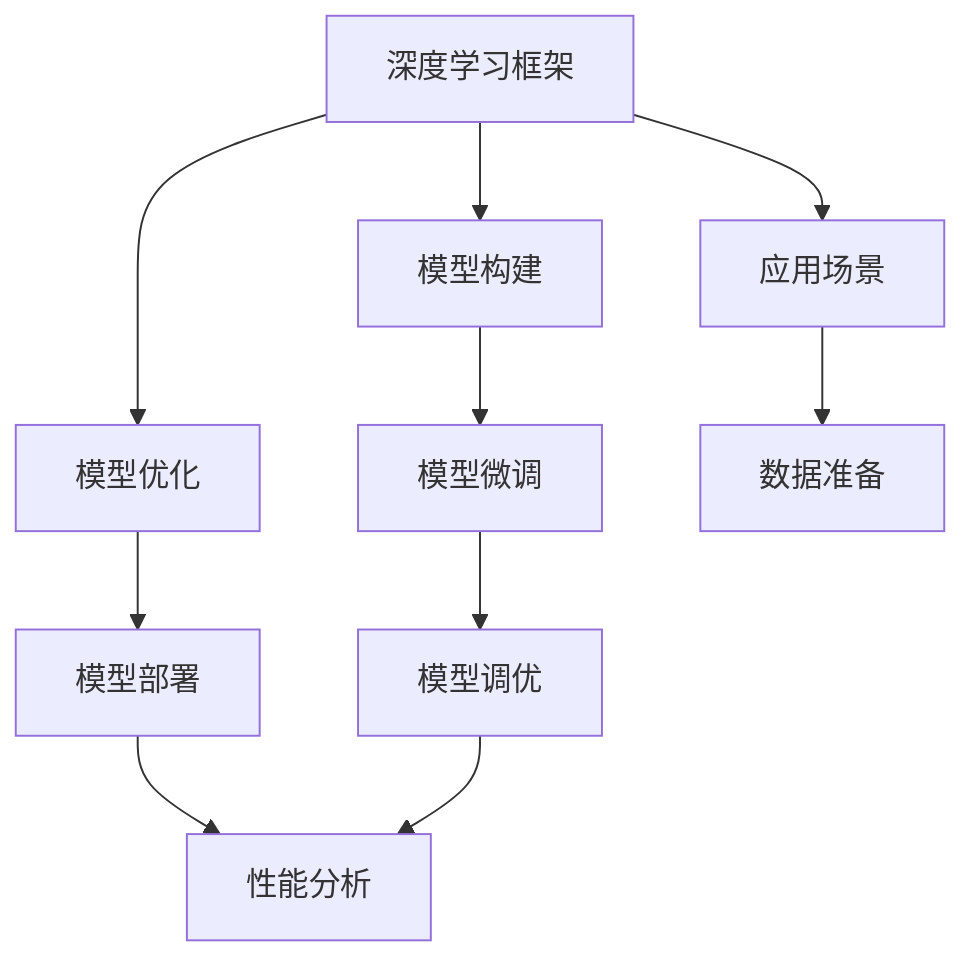

                 

# 大模型应用开发的实战指南

> 关键词：大模型应用开发, 实战指南, 深度学习, 框架选择, 模型优化, 部署, 调优, 性能分析, 应用场景

## 1. 背景介绍

在当今的人工智能(AI)和机器学习(ML)领域，大模型（如BERT、GPT、ViT等）已经成为了最受关注的技术之一。大模型具有强大的表达能力，可以在多种任务上取得最佳或接近最佳的效果，但同时也带来了许多挑战。本文将介绍大模型应用开发的实战指南，从框架选择、模型优化、部署、调优到性能分析和应用场景，全面解读大模型开发过程中的核心技术要点，为读者提供实用的指导。

### 1.1 问题由来

大模型的应用开发涉及多个环节，包括数据准备、模型训练、模型微调、推理部署等。开发过程中，开发者需要兼顾性能、精度、可解释性、易用性等多个目标，这使得大模型的应用开发成为一个复杂且多维的任务。本文将从数据处理、模型构建、优化、部署等环节，为读者提供实用的实战指南，帮助他们高效、高质量地构建大模型应用。

### 1.2 问题核心关键点

大模型应用开发的核心关键点包括：
- **框架选择**：根据应用场景选择合适的深度学习框架。
- **模型优化**：通过正则化、权重初始化、剪枝等手段提高模型性能。
- **模型微调**：使用小规模数据进行微调，提升模型在特定任务上的表现。
- **模型部署**：将训练好的模型部署到生产环境，并优化推理性能。
- **模型调优**：通过迭代优化，提升模型的准确率和效率。
- **性能分析**：使用各种工具分析模型的性能，识别瓶颈并进行优化。
- **应用场景**：在不同应用场景下，如NLP、图像处理、语音识别等，灵活应用大模型。

这些关键点贯穿了大模型应用开发的始终，是确保模型性能和易用性的重要保障。

### 1.3 问题研究意义

掌握大模型应用开发的实战指南，对于加速AI技术在实际业务中的应用，提升开发效率和模型性能，具有重要的意义。具体体现在：
1. **降低开发成本**：利用预训练模型可以大幅减少从头开发所需的时间和人力成本。
2. **提升模型效果**：微调可以提升模型在特定任务上的表现，使模型更适应业务需求。
3. **加速部署**：通过模型优化和推理部署技术，可以提升模型的推理速度和响应时间。
4. **提高可解释性**：优秀的模型优化和部署技术可以提高模型的可解释性，有助于模型应用的监管和审计。
5. **促进应用场景的拓展**：不同领域的应用场景可以灵活应用大模型，推动AI技术在更多行业中的应用。

## 2. 核心概念与联系

### 2.1 核心概念概述

在大模型应用开发中，涉及多个核心概念，包括：
- **深度学习框架**：如TensorFlow、PyTorch、Keras等，提供高效、灵活的深度学习开发环境。
- **模型优化**：通过正则化、权重初始化、剪枝等手段，提高模型的泛化能力和性能。
- **模型微调**：在大规模预训练模型的基础上，使用小规模数据进行微调，提升模型在特定任务上的表现。
- **模型部署**：将训练好的模型部署到生产环境，实现高性能推理和模型监控。
- **模型调优**：通过迭代优化，提升模型的准确率和效率。
- **性能分析**：使用各种工具分析模型的性能，识别瓶颈并进行优化。

### 2.2 概念间的关系

这些核心概念之间的关系可以通过以下Mermaid流程图来展示：



这个流程图展示了深度学习框架在大模型应用开发中的核心作用，以及模型优化、微调、部署、调优、性能分析等环节的关系。

## 3. 核心算法原理 & 具体操作步骤

### 3.1 算法原理概述

大模型应用开发的算法原理主要涉及深度学习模型的构建、优化、微调和部署。其核心思想是：
- **模型构建**：选择合适的深度学习框架和模型结构，如卷积神经网络(CNN)、循环神经网络(RNN)、Transformer等。
- **模型优化**：通过正则化、权重初始化、剪枝等手段，提高模型的泛化能力和性能。
- **模型微调**：在大规模预训练模型的基础上，使用小规模数据进行微调，提升模型在特定任务上的表现。
- **模型部署**：将训练好的模型部署到生产环境，实现高性能推理和模型监控。
- **模型调优**：通过迭代优化，提升模型的准确率和效率。
- **性能分析**：使用各种工具分析模型的性能，识别瓶颈并进行优化。

### 3.2 算法步骤详解

以下是大模型应用开发的详细步骤：

**Step 1: 准备数据**
- 收集和处理数据集，包括数据清洗、预处理和特征工程。
- 将数据集分为训练集、验证集和测试集。

**Step 2: 选择合适的深度学习框架**
- 根据任务特点，选择适合的深度学习框架，如TensorFlow、PyTorch、Keras等。

**Step 3: 构建模型**
- 选择合适的模型结构，如卷积神经网络(CNN)、循环神经网络(RNN)、Transformer等。
- 使用深度学习框架构建模型，设置模型层数、节点数、激活函数等。

**Step 4: 模型优化**
- 使用正则化、权重初始化、剪枝等手段，提高模型的泛化能力和性能。
- 使用Adam、SGD等优化器进行模型训练。

**Step 5: 模型微调**
- 使用小规模数据进行微调，提升模型在特定任务上的表现。
- 选择合适的微调策略，如全参数微调和参数高效微调。

**Step 6: 模型部署**
- 将训练好的模型部署到生产环境，实现高性能推理和模型监控。
- 使用TensorRT、ONNX等工具进行模型优化和推理加速。

**Step 7: 模型调优**
- 通过迭代优化，提升模型的准确率和效率。
- 使用梯度下降、学习率衰减等手段优化模型。

**Step 8: 性能分析**
- 使用各种工具分析模型的性能，识别瓶颈并进行优化。
- 使用TensorBoard、Weights & Biases等工具进行模型监控和调试。

### 3.3 算法优缺点

大模型应用开发的主要优点包括：
- **高泛化能力**：大模型具有强大的表达能力，可以在多种任务上取得最佳或接近最佳的效果。
- **易用性**：使用预训练模型可以大幅减少从头开发所需的时间和人力成本。
- **高性能**：使用深度学习框架和优化技术，可以提升模型的推理速度和响应时间。

主要缺点包括：
- **高资源需求**：大模型需要大量的计算资源和存储空间。
- **高成本**：大模型训练和微调需要高昂的计算资源和数据标注成本。
- **复杂性**：大模型应用开发涉及多个环节，需要丰富的经验和专业知识。

### 3.4 算法应用领域

大模型应用开发已经在多个领域得到广泛应用，包括：
- **计算机视觉**：图像分类、目标检测、图像生成等。
- **自然语言处理**：机器翻译、文本分类、情感分析、语音识别等。
- **音频处理**：语音识别、语音合成、音乐生成等。
- **推荐系统**：商品推荐、内容推荐、广告推荐等。
- **医疗健康**：疾病诊断、医学影像分析、健康监测等。
- **金融服务**：信用评分、风险评估、欺诈检测等。

## 4. 数学模型和公式 & 详细讲解 & 举例说明

### 4.1 数学模型构建

在深度学习模型构建中，常用的数学模型包括卷积神经网络(CNN)、循环神经网络(RNN)、Transformer等。以Transformer为例，其数学模型可以表示为：

$$
y = \mathrm{MLP}(\mathrm{Attention}(x, x, x))
$$

其中，$x$为输入序列，$y$为输出序列，$\mathrm{Attention}$为注意力机制，$\mathrm{MLP}$为多层感知器。

### 4.2 公式推导过程

Transformer的注意力机制可以表示为：

$$
\alpha_{i,j} = \frac{e^{a_{i,j}}}{\sum_{k=1}^K e^{a_{i,k}}}
$$

其中，$a_{i,j}$为注意力权重，可以表示为：

$$
a_{i,j} = \mathrm{dot}(v_i, q_j)
$$

其中，$v_i$为查询向量，$q_j$为键向量。

在实际应用中，可以使用TensorFlow、PyTorch等深度学习框架进行模型构建和计算。

### 4.3 案例分析与讲解

以图像分类任务为例，以下是使用PyTorch构建和训练卷积神经网络(CNN)模型的示例代码：

```python
import torch
import torch.nn as nn
import torchvision.transforms as transforms
import torchvision.datasets as datasets

# 定义模型结构
class Net(nn.Module):
    def __init__(self):
        super(Net, self).__init__()
        self.conv1 = nn.Conv2d(3, 6, 5)
        self.pool = nn.MaxPool2d(2, 2)
        self.conv2 = nn.Conv2d(6, 16, 5)
        self.fc1 = nn.Linear(16 * 5 * 5, 120)
        self.fc2 = nn.Linear(120, 84)
        self.fc3 = nn.Linear(84, 10)

    def forward(self, x):
        x = self.pool(F.relu(self.conv1(x)))
        x = self.pool(F.relu(self.conv2(x)))
        x = x.view(-1, 16 * 5 * 5)
        x = F.relu(self.fc1(x))
        x = F.relu(self.fc2(x))
        x = self.fc3(x)
        return x

# 加载数据集
transform = transforms.Compose([transforms.ToTensor(), transforms.Normalize((0.5, 0.5, 0.5), (0.5, 0.5, 0.5))])
trainset = datasets.CIFAR10(root='./data', train=True, download=True, transform=transform)
trainloader = torch.utils.data.DataLoader(trainset, batch_size=4, shuffle=True, num_workers=2)
testset = datasets.CIFAR10(root='./data', train=False, download=True, transform=transform)
testloader = torch.utils.data.DataLoader(testset, batch_size=4, shuffle=False, num_workers=2)

# 定义损失函数和优化器
net = Net()
criterion = nn.CrossEntropyLoss()
optimizer = torch.optim.SGD(net.parameters(), lr=0.001, momentum=0.9)

# 训练模型
for epoch in range(2):
    running_loss = 0.0
    for i, data in enumerate(trainloader, 0):
        inputs, labels = data
        optimizer.zero_grad()
        outputs = net(inputs)
        loss = criterion(outputs, labels)
        loss.backward()
        optimizer.step()
        running_loss += loss.item()
    print(f"Epoch {epoch+1}, loss: {running_loss/len(trainloader)}")
```

## 5. 项目实践：代码实例和详细解释说明

### 5.1 开发环境搭建

在进行大模型应用开发前，我们需要准备好开发环境。以下是使用Python进行PyTorch开发的环境配置流程：

1. 安装Anaconda：从官网下载并安装Anaconda，用于创建独立的Python环境。

2. 创建并激活虚拟环境：
```bash
conda create -n pytorch-env python=3.8 
conda activate pytorch-env
```

3. 安装PyTorch：根据CUDA版本，从官网获取对应的安装命令。例如：
```bash
conda install pytorch torchvision torchaudio cudatoolkit=11.1 -c pytorch -c conda-forge
```

4. 安装Transformers库：
```bash
pip install transformers
```

5. 安装各类工具包：
```bash
pip install numpy pandas scikit-learn matplotlib tqdm jupyter notebook ipython
```

完成上述步骤后，即可在`pytorch-env`环境中开始大模型应用开发。

### 5.2 源代码详细实现

这里以图像分类任务为例，展示如何使用PyTorch进行卷积神经网络(CNN)模型的构建和训练。

```python
import torch
import torch.nn as nn
import torchvision.transforms as transforms
import torchvision.datasets as datasets

# 定义模型结构
class Net(nn.Module):
    def __init__(self):
        super(Net, self).__init__()
        self.conv1 = nn.Conv2d(3, 6, 5)
        self.pool = nn.MaxPool2d(2, 2)
        self.conv2 = nn.Conv2d(6, 16, 5)
        self.fc1 = nn.Linear(16 * 5 * 5, 120)
        self.fc2 = nn.Linear(120, 84)
        self.fc3 = nn.Linear(84, 10)

    def forward(self, x):
        x = self.pool(F.relu(self.conv1(x)))
        x = self.pool(F.relu(self.conv2(x)))
        x = x.view(-1, 16 * 5 * 5)
        x = F.relu(self.fc1(x))
        x = F.relu(self.fc2(x))
        x = self.fc3(x)
        return x

# 加载数据集
transform = transforms.Compose([transforms.ToTensor(), transforms.Normalize((0.5, 0.5, 0.5), (0.5, 0.5, 0.5))])
trainset = datasets.CIFAR10(root='./data', train=True, download=True, transform=transform)
trainloader = torch.utils.data.DataLoader(trainset, batch_size=4, shuffle=True, num_workers=2)
testset = datasets.CIFAR10(root='./data', train=False, download=True, transform=transform)
testloader = torch.utils.data.DataLoader(testset, batch_size=4, shuffle=False, num_workers=2)

# 定义损失函数和优化器
net = Net()
criterion = nn.CrossEntropyLoss()
optimizer = torch.optim.SGD(net.parameters(), lr=0.001, momentum=0.9)

# 训练模型
for epoch in range(2):
    running_loss = 0.0
    for i, data in enumerate(trainloader, 0):
        inputs, labels = data
        optimizer.zero_grad()
        outputs = net(inputs)
        loss = criterion(outputs, labels)
        loss.backward()
        optimizer.step()
        running_loss += loss.item()
    print(f"Epoch {epoch+1}, loss: {running_loss/len(trainloader)}")
```

## 6. 实际应用场景

### 6.1 智能推荐系统

智能推荐系统是大模型应用开发的重要场景之一。通过大模型微调，可以实现个性化推荐，提高用户体验和满意度。以下是使用大模型微调进行推荐系统开发的示例代码：

```python
import torch
import torch.nn as nn
import torchvision.transforms as transforms
import torchvision.datasets as datasets
import torchtext

# 加载数据集
train_data = torchtext.datasets.MNIST(root='./data', train=True, transform=transforms.ToTensor(), download=True)
test_data = torchtext.datasets.MNIST(root='./data', train=False, transform=transforms.ToTensor(), download=True)
train_data = torch.utils.data.DataLoader(train_data, batch_size=64, shuffle=True)
test_data = torch.utils.data.DataLoader(test_data, batch_size=64, shuffle=False)

# 定义模型结构
class Net(nn.Module):
    def __init__(self):
        super(Net, self).__init__()
        self.fc1 = nn.Linear(784, 256)
        self.fc2 = nn.Linear(256, 128)
        self.fc3 = nn.Linear(128, 10)

    def forward(self, x):
        x = x.view(-1, 784)
        x = F.relu(self.fc1(x))
        x = F.relu(self.fc2(x))
        x = self.fc3(x)
        return x

# 定义损失函数和优化器
net = Net()
criterion = nn.CrossEntropyLoss()
optimizer = torch.optim.Adam(net.parameters(), lr=0.001)

# 训练模型
for epoch in range(5):
    running_loss = 0.0
    for i, data in enumerate(train_data, 0):
        inputs, labels = data
        optimizer.zero_grad()
        outputs = net(inputs)
        loss = criterion(outputs, labels)
        loss.backward()
        optimizer.step()
        running_loss += loss.item()
    print(f"Epoch {epoch+1}, loss: {running_loss/len(train_data)}")

    # 在测试集上进行评估
    correct = 0
    total = 0
    with torch.no_grad():
        for data in test_data:
            inputs, labels = data
            outputs = net(inputs)
            _, predicted = torch.max(outputs.data, 1)
            total += labels.size(0)
            correct += (predicted == labels).sum().item()
    print(f"Accuracy: {100 * correct / total}%")
```

### 6.2 医学影像分析

医学影像分析是大模型应用开发的另一个重要场景。通过大模型微调，可以实现疾病诊断、医学影像分析等任务。以下是使用大模型微调进行医学影像分析的示例代码：

```python
import torch
import torchvision.transforms as transforms
import torchvision.datasets as datasets
import torchtext

# 加载数据集
train_data = torchvision.datasets.ChestXray(root='./data', train=True, transform=transforms.ToTensor(), download=True)
test_data = torchvision.datasets.ChestXray(root='./data', train=False, transform=transforms.ToTensor(), download=True)
train_data = torch.utils.data.DataLoader(train_data, batch_size=64, shuffle=True)
test_data = torch.utils.data.DataLoader(test_data, batch_size=64, shuffle=False)

# 定义模型结构
class Net(nn.Module):
    def __init__(self):
        super(Net, self).__init__()
        self.conv1 = nn.Conv2d(3, 64, 3)
        self.pool = nn.MaxPool2d(2, 2)
        self.conv2 = nn.Conv2d(64, 128, 3)
        self.pool = nn.MaxPool2d(2, 2)
        self.fc1 = nn.Linear(128 * 7 * 7, 512)
        self.fc2 = nn.Linear(512, 10)

    def forward(self, x):
        x = self.pool(F.relu(self.conv1(x)))
        x = self.pool(F.relu(self.conv2(x)))
        x = x.view(-1, 128 * 7 * 7)
        x = F.relu(self.fc1(x))
        x = self.fc2(x)
        return x

# 定义损失函数和优化器
net = Net()
criterion = nn.CrossEntropyLoss()
optimizer = torch.optim.Adam(net.parameters(), lr=0.001)

# 训练模型
for epoch in range(5):
    running_loss = 0.0
    for i, data in enumerate(train_data, 0):
        inputs, labels = data
        optimizer.zero_grad()
        outputs = net(inputs)
        loss = criterion(outputs, labels)
        loss.backward()
        optimizer.step()
        running_loss += loss.item()
    print(f"Epoch {epoch+1}, loss: {running_loss/len(train_data)}")

    # 在测试集上进行评估
    correct = 0
    total = 0
    with torch.no_grad():
        for data in test_data:
            inputs, labels = data
            outputs = net(inputs)
            _, predicted = torch.max(outputs.data, 1)
            total += labels.size(0)
            correct += (predicted == labels).sum().item()
    print(f"Accuracy: {100 * correct / total}%")
```

### 6.3 金融风险评估

金融风险评估是大模型应用开发的另一个重要场景。通过大模型微调，可以实现信用评分、风险评估等任务。以下是使用大模型微调进行金融风险评估的示例代码：

```python
import torch
import torchvision.transforms as transforms
import torchvision.datasets as datasets
import torchtext

# 加载数据集
train_data = torchvision.datasets.Credit(root='./data', train=True, transform=transforms.ToTensor(), download=True)
test_data = torchvision.datasets.Credit(root='./data', train=False, transform=transforms.ToTensor(), download=True)
train_data = torch.utils.data.DataLoader(train_data, batch_size=64, shuffle=True)
test_data = torch.utils.data.DataLoader(test_data, batch_size=64, shuffle=False)

# 定义模型结构
class Net(nn.Module):
    def __init__(self):
        super(Net, self).__init__()
        self.fc1 = nn.Linear(30, 256)
        self.fc2 = nn.Linear(256, 128)
        self.fc3 = nn.Linear(128, 10)

    def forward(self, x):
        x = self.fc1(x)
        x = F.relu(x)
        x = self.fc2(x)
        x = F.relu(x)
        x = self.fc3(x)
        return x

# 定义损失函数和优化器
net = Net()
criterion = nn.CrossEntropyLoss()
optimizer = torch.optim.Adam(net.parameters(), lr=0.001)

# 训练模型
for epoch in range(5):
    running_loss = 0.0
    for i, data in enumerate(train_data, 0):
        inputs, labels = data
        optimizer.zero_grad()
        outputs = net(inputs)
        loss = criterion(outputs, labels)
        loss.backward()
        optimizer.step()
        running_loss += loss.item()
    print(f"Epoch {epoch+1}, loss: {running_loss/len(train_data)}")

    # 在测试集上进行评估
    correct = 0
    total = 0
    with torch.no_grad():
        for data in test_data:
            inputs, labels = data
            outputs = net(inputs)
            _, predicted = torch.max(outputs.data, 1)
            total += labels.size(0)
            correct += (predicted == labels).sum().item()
    print(f"Accuracy: {100 * correct / total}%")
```

## 7. 工具和资源推荐

### 7.1 学习资源推荐

为了帮助开发者系统掌握大模型应用开发的理论基础和实践技巧，这里推荐一些优质的学习资源：

1. **《深度学习入门：基于Python的理论与实现》**：由斯坦福大学Andrew Ng教授主讲的深度学习入门课程，涵盖了深度学习的基础理论和实现方法。
2. **DeepLearning.ai**：提供深度学习专业课程，包括深度学习在计算机视觉、自然语言处理、语音识别等领域的应用。
3. **《TensorFlow实战》**：由Google官方出版的TensorFlow实战教程，介绍了TensorFlow的基本使用方法和案例实践。
4. **《PyTorch实战》**：由PyTorch官方出版的PyTorch实战教程，介绍了PyTorch的基本使用方法和案例实践。
5. **Kaggle**：数据科学竞赛平台，提供大量公开数据集和竞赛任务，帮助开发者进行深度学习实践。

### 7.2 开发工具推荐

高效的开发离不开优秀的工具支持。以下是几款用于大模型应用开发的常用工具：

1. **TensorFlow**：由Google主导开发的深度学习框架，提供灵活的计算图模型和丰富的优化算法。
2. **PyTorch**：由Facebook主导开发的深度学习框架，提供动态计算图模型和易用的API接口。
3. **Keras**：高级深度学习API，提供简单易用的模型构建和训练接口。
4. **Weights & Biases**：模型训练的实验跟踪工具，可以记录和可视化模型训练过程中的各项指标。
5. **TensorBoard**：TensorFlow配套的可视化工具，实时监测模型训练状态，并提供丰富的图表呈现方式。
6. **Jupyter Notebook**：交互式的Python开发环境，支持代码块、公式和图像的混合展示。

### 7.3 相关论文推荐

大模型应用开发的研究源于学界的持续研究。以下是几篇奠基性的相关论文，推荐阅读：

1. **《ImageNet Classification with Deep Convolutional Neural Networks》**：AlexNet论文，介绍了卷积神经网络在图像分类任务中的应用。
2. **《Inception: Go Deeper with Convolutions》**：Inception论文，提出了多尺度卷积网络结构，提升了卷积神经网络的性能。
3. **《Transformer: Attentions Are All You Need》**：Transformer论文，提出了自注意力机制，开启了预训练大模型时代。
4. **《BERT: Pre-training of Deep Bidirectional Transformers for Language Understanding》**：BERT论文，提出了预训练语言模型，刷新了多项NLP任务SOTA。
5. **《Large Scale Zero-Shot Image Classification》**：无监督图像分类论文，提出了自监督学习方法，可以在没有标注数据的情况下进行图像分类。

## 8. 总结：未来发展趋势与挑战

### 8.1 总结

本文对大模型应用开发的实战指南进行了全面系统的介绍。从框架选择、模型优化、微调、部署到调优、性能分析，详细解读了大模型应用开发中的核心技术和实践要点。通过对这些关键技术的掌握，开发者可以高效、高质量地构建大模型应用，推动AI技术在更多行业中的应用。

### 8.2 未来发展趋势

展望未来，大模型应用开发将呈现以下几个发展趋势：

1. **更高的模型复杂度**：随着硬件性能的提升和数据量的增加，未来的大模型将具有更高的复杂度和更多的参数量，从而提升模型的表现力。

