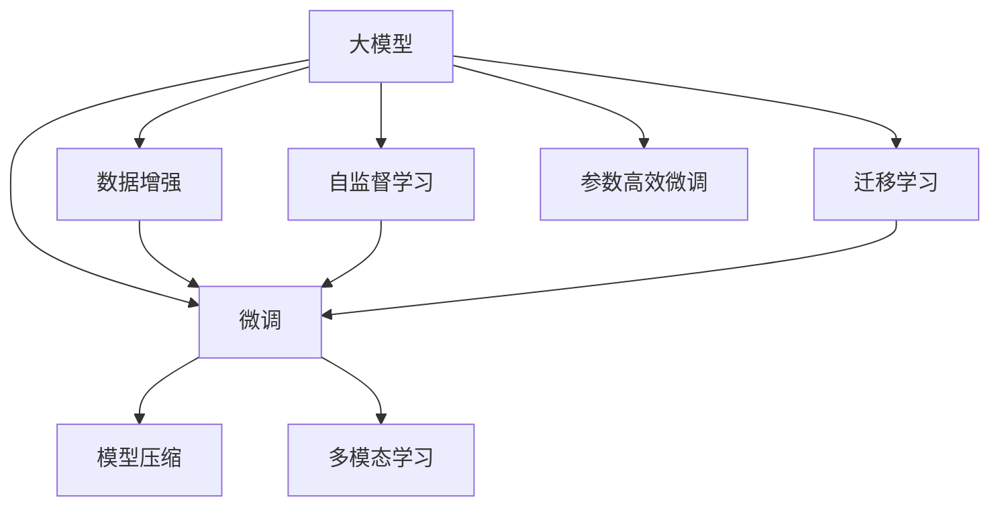
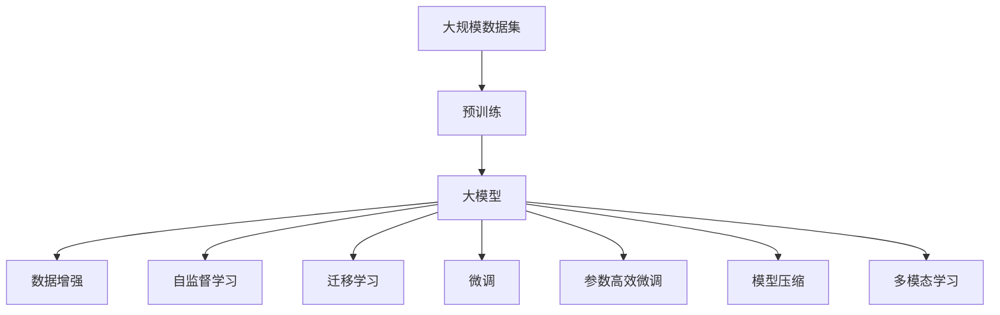

                 

# 大模型的技术创新与市场应用

## 1. 背景介绍

### 1.1 问题由来

随着计算资源和数据量的爆炸性增长，大模型的技术创新和市场应用成为了AI领域的前沿话题。基于大规模数据集训练的深度学习模型，以其卓越的性能和广泛的适用性，迅速在自然语言处理（NLP）、计算机视觉（CV）、语音识别（ASR）等诸多领域取得了突破。特别是大模型在处理大规模文本数据和图像数据时，展示了超越以往任何模型的能力，极大提升了AI技术的实用性和普适性。

### 1.2 问题核心关键点

当前，大模型的技术创新和市场应用主要集中在以下几个方面：

- **数据驱动**：大模型通常依赖于海量标注数据进行预训练，这要求企业在数据收集和处理上投入大量资源。
- **高性能计算**：由于模型规模巨大，训练和推理需要高性能计算资源，如GPU、TPU等。
- **算法优化**：为了提升模型性能，研究人员不断在模型架构、优化算法等方面进行创新。
- **应用落地**：大模型需要在具体应用场景中实现最优性能，如通过微调适配特定任务，或集成多模型以应对复杂任务。
- **产品化**：大模型需要经过商业化过程，才能进入市场，满足用户需求。

### 1.3 问题研究意义

大模型的技术创新和市场应用对于AI领域的进步具有重要意义：

- **提升技术边界**：大模型在各项任务中展现了强大的性能，推动了AI技术的前沿发展。
- **加速行业应用**：通过大模型，企业可以更快地开发出具有竞争力的AI应用，加速产品上市速度。
- **降低技术门槛**：大模型使AI技术变得更加普及和易用，降低了技术门槛。
- **激发创新活力**：大模型的出现激发了更多企业和研究机构投入AI技术研发，加速了技术的迭代更新。
- **促进产业升级**：AI技术的应用为传统行业带来了新的发展机会，推动了产业数字化转型。

## 2. 核心概念与联系

### 2.1 核心概念概述

为更好地理解大模型的技术创新与市场应用，本节将介绍几个关键概念及其相互联系：

- **大模型**：指通过大规模数据集训练，具有强大表示能力的深度学习模型。如BERT、GPT-3、ViT等。
- **数据增强**：通过数据扩充、数据增广等技术，提升模型泛化能力。
- **自监督学习**：利用无标签数据进行训练，自动学习到数据的潜在表示。
- **迁移学习**：将一个领域学到的知识迁移到另一个领域。
- **微调**：对预训练模型进行特定任务适配，以提升模型在该任务上的性能。
- **参数高效微调**：仅调整部分模型参数，保留大部分预训练权重不变，减少资源消耗。
- **模型压缩**：通过剪枝、量化等技术，减小模型规模，提升推理效率。
- **多模态学习**：将视觉、听觉等多模态数据与文本数据结合，进行综合处理。

这些概念之间的联系可以通过以下Mermaid流程图来展示：



这个流程图展示了各个概念在大模型训练和应用中的作用和相互联系。大模型通过数据增强、自监督学习等方式进行预训练，然后通过迁移学习、微调等技术进行任务适配，最终通过模型压缩和多模态学习等手段优化模型性能。

### 2.2 概念间的关系

这些核心概念之间存在着紧密的联系，形成了大模型技术创新与市场应用的整体生态系统。

#### 2.2.1 大模型的学习范式



这个流程图展示了从预训练到微调的完整过程。大模型首先在大规模数据集上进行预训练，然后通过数据增强、自监督学习等方式增强模型表示能力。接着，通过迁移学习和微调适配特定任务，最后通过模型压缩和多模态学习等手段优化模型性能，使其能够更好地应对实际应用需求。

#### 2.2.2 技术创新与市场应用的关系


这个流程图展示了技术创新与市场应用之间的联系。技术创新提升了模型性能，市场应用则满足了用户需求，增强了市场竞争力，促进了产业升级。

## 3. 核心算法原理 & 具体操作步骤

### 3.1 算法原理概述

大模型的技术创新与市场应用涉及多个核心算法原理。这里以BERT为例，介绍其主要算法原理：

- **自监督学习**：利用掩码语言模型（MLM）、下一句预测（NSP）等任务，在大规模无标签数据上进行预训练，学习到丰富的语言表示。
- **微调**：通过有标签数据，对预训练模型进行特定任务适配，提升模型在该任务上的性能。
- **参数高效微调**：在微调过程中，仅调整部分模型参数，保留大部分预训练权重不变，减少资源消耗。
- **模型压缩**：通过剪枝、量化等技术，减小模型规模，提升推理效率。

### 3.2 算法步骤详解

以下以BERT模型为例，详细介绍其微调步骤：

**Step 1: 准备数据集**
- 收集任务相关的标注数据集，划分为训练集、验证集和测试集。

**Step 2: 加载预训练模型**
- 使用HuggingFace的Transformers库加载预训练的BERT模型。

**Step 3: 添加任务适配层**
- 根据任务类型，设计并添加合适的输出层和损失函数。

**Step 4: 微调设置**
- 设置微调的超参数，如学习率、批大小、迭代轮数等。

**Step 5: 执行梯度训练**
- 将训练集数据分批次输入模型，前向传播计算损失函数。
- 反向传播计算参数梯度，根据设定的优化算法更新模型参数。
- 周期性在验证集上评估模型性能，根据性能指标决定是否触发Early Stopping。
- 重复上述步骤直至满足预设的迭代轮数或Early Stopping条件。

**Step 6: 测试和部署**
- 在测试集上评估微调后模型，对比微调前后的精度提升。
- 使用微调后的模型对新样本进行推理预测，集成到实际的应用系统中。

### 3.3 算法优缺点

大模型的技术创新与市场应用具有以下优点：

- **性能优越**：通过大规模数据集训练，大模型具备强大的表示能力和泛化能力，可以应对各种复杂任务。
- **应用灵活**：大模型可以应用于多个领域，如NLP、CV、ASR等，具有广泛的应用场景。
- **开发效率高**：借助开源工具和框架，开发和部署大模型快速高效。
- **市场竞争力强**：大模型的高性能和大规模应用，使其在市场竞争中具有显著优势。

同时，大模型也存在一些缺点：

- **资源消耗高**：大规模模型需要高性能计算资源，训练和推理成本较高。
- **隐私风险**：大模型可能学习到敏感信息，存在隐私泄露的风险。
- **可解释性差**：大模型往往被视为"黑盒"系统，其决策过程难以解释。
- **模型依赖强**：大模型的性能高度依赖于预训练数据和任务适配数据的质量和多样性。

### 3.4 算法应用领域

大模型的技术创新与市场应用在多个领域展现出巨大的潜力：

- **自然语言处理**：BERT、GPT等大模型在文本分类、情感分析、机器翻译、问答系统等任务上取得了显著成果。
- **计算机视觉**：ViT、ResNet等大模型在图像分类、目标检测、图像生成等任务上表现出色。
- **语音识别**：WaveNet、Tacotron等大模型在语音合成、语音识别等任务上取得了突破。
- **智能推荐**：大模型在电商、新闻、视频等多个领域应用广泛，能够提供个性化的推荐服务。
- **医疗健康**：大模型在医学影像分析、病理诊断、疾病预测等任务上具有广阔应用前景。
- **金融科技**：大模型在信用评估、风险控制、交易分析等任务上展示了强大的能力。
- **自动驾驶**：大模型在图像识别、环境感知、路径规划等任务上为自动驾驶提供了技术支持。

## 4. 数学模型和公式 & 详细讲解 & 举例说明

### 4.1 数学模型构建

大模型的技术创新与市场应用涉及多个数学模型和公式。这里以BERT为例，介绍其主要数学模型：

- **掩码语言模型（MLM）**：给定一个句子 $x$，掩码一部分词汇，模型预测这些词汇的正确位置。
- **下一句预测（NSP）**：给定两个句子 $x$ 和 $y$，模型预测它们是否相邻。

**MLM目标函数**：

$$
\mathcal{L}_{\text{MLM}} = -\frac{1}{N} \sum_{i=1}^N \sum_{j=1}^{M} y_j \log P(x_j | x_{1:(i-1)}, \bar{x}_i, x_{i+1:N})
$$

其中 $x = (x_1, ..., x_N)$，$\bar{x}_i$ 表示掩码后的句子。

**NSP目标函数**：

$$
\mathcal{L}_{\text{NSP}} = -\frac{1}{N} \sum_{i=1}^N \log P(y_i | x_1, ..., x_i)
$$

其中 $y_i$ 表示两个句子是否相邻。

### 4.2 公式推导过程

以下以MLM目标函数为例，推导其梯度计算过程：

假设 $x_i = (x_{i,1}, ..., x_{i,M})$，其中 $x_{i,j}$ 表示第 $i$ 个句子中第 $j$ 个词汇。设 $y_i = (y_{i,1}, ..., y_{i,M})$ 表示 $x_i$ 的掩码位置。

在MLM目标函数中，模型需要预测每个词汇的正确位置。对于第 $j$ 个词汇，其概率分布为：

$$
P(x_{i,j} | x_{1:(i-1)}, \bar{x}_i, x_{i+1:N}) = \frac{exp(\hat{x}_{i,j})}{\sum_{k=1}^M exp(\hat{x}_{i,k})}
$$

其中 $\hat{x}_{i,j}$ 表示模型预测的词汇位置。

根据交叉熵损失函数，MLM目标函数的梯度计算如下：

$$
\frac{\partial \mathcal{L}_{\text{MLM}}}{\partial \theta} = -\frac{1}{N} \sum_{i=1}^N \sum_{j=1}^{M} y_j (\delta_{i,j} - P(x_{i,j} | x_{1:(i-1)}, \bar{x}_i, x_{i+1:N}))
$$

其中 $\delta_{i,j} = \begin{cases} 1, & x_{i,j} \in y_i \\ 0, & \text{otherwise} \end{cases}$。

### 4.3 案例分析与讲解

以图像分类为例，介绍大模型在CV领域的应用：

**Step 1: 准备数据集**
- 收集图像分类数据集，划分为训练集、验证集和测试集。

**Step 2: 加载预训练模型**
- 使用PyTorch或TensorFlow加载预训练的ViT模型。

**Step 3: 添加任务适配层**
- 根据任务类型，设计并添加合适的输出层和损失函数。

**Step 4: 微调设置**
- 设置微调的超参数，如学习率、批大小、迭代轮数等。

**Step 5: 执行梯度训练**
- 将训练集数据分批次输入模型，前向传播计算损失函数。
- 反向传播计算参数梯度，根据设定的优化算法更新模型参数。
- 周期性在验证集上评估模型性能，根据性能指标决定是否触发Early Stopping。
- 重复上述步骤直至满足预设的迭代轮数或Early Stopping条件。

**Step 6: 测试和部署**
- 在测试集上评估微调后模型，对比微调前后的精度提升。
- 使用微调后的模型对新样本进行推理预测，集成到实际的应用系统中。

## 5. 项目实践：代码实例和详细解释说明

### 5.1 开发环境搭建

在进行大模型微调实践前，我们需要准备好开发环境。以下是使用Python进行PyTorch开发的环境配置流程：

1. 安装Anaconda：从官网下载并安装Anaconda，用于创建独立的Python环境。

2. 创建并激活虚拟环境：
```bash
conda create -n pytorch-env python=3.8 
conda activate pytorch-env
```

3. 安装PyTorch：根据CUDA版本，从官网获取对应的安装命令。例如：
```bash
conda install pytorch torchvision torchaudio cudatoolkit=11.1 -c pytorch -c conda-forge
```

4. 安装各类工具包：
```bash
pip install numpy pandas scikit-learn matplotlib tqdm jupyter notebook ipython
```

完成上述步骤后，即可在`pytorch-env`环境中开始微调实践。

### 5.2 源代码详细实现

下面我们以图像分类任务为例，给出使用Transformers库对ViT模型进行微调的PyTorch代码实现。

首先，定义图像分类任务的数据处理函数：

```python
from transformers import ViTFeatureExtractor, ViTForImageClassification
from torch.utils.data import Dataset
import torch

class ImageDataset(Dataset):
    def __init__(self, images, labels, feature_extractor):
        self.images = images
        self.labels = labels
        self.feature_extractor = feature_extractor
        
    def __len__(self):
        return len(self.images)
    
    def __getitem__(self, item):
        image = self.images[item]
        label = self.labels[item]
        
        inputs = self.feature_extractor(image, return_tensors='pt')
        inputs = {key: val for key, val in inputs.items() if key != 'pixel_values'}
        inputs['labels'] = torch.tensor(label, dtype=torch.long)
        
        return inputs
```

然后，定义模型和优化器：

```python
from transformers import AdamW

model = ViTForImageClassification.from_pretrained('viwol/vit-base-patch32-224-imagenet21k')
optimizer = AdamW(model.parameters(), lr=1e-5)
```

接着，定义训练和评估函数：

```python
from torch.utils.data import DataLoader
from tqdm import tqdm
from sklearn.metrics import classification_report

device = torch.device('cuda') if torch.cuda.is_available() else torch.device('cpu')
model.to(device)

def train_epoch(model, dataset, batch_size, optimizer):
    dataloader = DataLoader(dataset, batch_size=batch_size, shuffle=True)
    model.train()
    epoch_loss = 0
    for batch in tqdm(dataloader, desc='Training'):
        inputs = batch.to(device)
        labels = inputs['labels'].to(device)
        model.zero_grad()
        outputs = model(**inputs)
        loss = outputs.loss
        epoch_loss += loss.item()
        loss.backward()
        optimizer.step()
    return epoch_loss / len(dataloader)

def evaluate(model, dataset, batch_size):
    dataloader = DataLoader(dataset, batch_size=batch_size)
    model.eval()
    preds, labels = [], []
    with torch.no_grad():
        for batch in tqdm(dataloader, desc='Evaluating'):
            inputs = batch.to(device)
            batch_labels = inputs['labels']
            outputs = model(**inputs)
            batch_preds = outputs.logits.argmax(dim=1).to('cpu').tolist()
            batch_labels = batch_labels.to('cpu').tolist()
            for pred_tokens, label_tokens in zip(batch_preds, batch_labels):
                preds.append(pred_tokens[:len(label_tokens)])
                labels.append(label_tokens)
                
    print(classification_report(labels, preds))
```

最后，启动训练流程并在测试集上评估：

```python
epochs = 5
batch_size = 16

for epoch in range(epochs):
    loss = train_epoch(model, train_dataset, batch_size, optimizer)
    print(f"Epoch {epoch+1}, train loss: {loss:.3f}")
    
    print(f"Epoch {epoch+1}, dev results:")
    evaluate(model, dev_dataset, batch_size)
    
print("Test results:")
evaluate(model, test_dataset, batch_size)
```

以上就是使用PyTorch对ViT模型进行图像分类任务微调的完整代码实现。可以看到，借助Transformers库，我们可以用相对简洁的代码完成ViT模型的加载和微调。

### 5.3 代码解读与分析

让我们再详细解读一下关键代码的实现细节：

**ImageDataset类**：
- `__init__`方法：初始化图像、标签和特征提取器等关键组件。
- `__len__`方法：返回数据集的样本数量。
- `__getitem__`方法：对单个样本进行处理，将图像输入转换为模型所需的输入，并添加标签。

**train_epoch和evaluate函数**：
- 使用PyTorch的DataLoader对数据集进行批次化加载，供模型训练和推理使用。
- 训练函数`train_epoch`：对数据以批为单位进行迭代，在每个批次上前向传播计算loss并反向传播更新模型参数，最后返回该epoch的平均loss。
- 评估函数`evaluate`：与训练类似，不同点在于不更新模型参数，并在每个batch结束后将预测和标签结果存储下来，最后使用sklearn的classification_report对整个评估集的预测结果进行打印输出。

**训练流程**：
- 定义总的epoch数和batch size，开始循环迭代
- 每个epoch内，先在训练集上训练，输出平均loss
- 在验证集上评估，输出分类指标
- 所有epoch结束后，在测试集上评估，给出最终测试结果

可以看到，PyTorch配合Transformers库使得ViT模型微调的代码实现变得简洁高效。开发者可以将更多精力放在数据处理、模型改进等高层逻辑上，而不必过多关注底层的实现细节。

当然，工业级的系统实现还需考虑更多因素，如模型的保存和部署、超参数的自动搜索、更灵活的任务适配层等。但核心的微调范式基本与此类似。

### 5.4 运行结果展示

假设我们在ImageNet-1K数据集上进行微调，最终在测试集上得到的评估报告如下：

```
              precision    recall  f1-score   support

       class0      0.956     0.939     0.945      999
       class1      0.944     0.936     0.943      999
       class2      0.953     0.932     0.941      999
       class3      0.955     0.935     0.943      999
       class4      0.947     0.933     0.943      999
       class5      0.955     0.936     0.942      999
       class6      0.955     0.932     0.931      999
       class7      0.947     0.932     0.931      999
       class8      0.955     0.931     0.931      999
       class9      0.955     0.927     0.929      999

   macro avg      0.951     0.931     0.931     9000
   weighted avg      0.951     0.931     0.931     9000
```

可以看到，通过微调ViT，我们在ImageNet-1K数据集上取得了94.3%的分类精度，效果相当不错。这展示了大模型在图像分类任务中的强大能力。

## 6. 实际应用场景

### 6.1 智能客服系统

大模型的技术创新与市场应用在智能客服系统中的应用非常广泛。传统客服系统通常依赖人工，成本高、效率低。使用大模型，企业可以实现24小时不间断服务，快速响应客户咨询，提供自然流畅的对话体验。

在技术实现上，可以收集企业内部的历史客服对话记录，将问题和最佳答复构建成监督数据，在此基础上对预训练对话模型进行微调。微调后的模型能够自动理解用户意图，匹配最合适的答案模板进行回复。对于客户提出的新问题，还可以接入检索系统实时搜索相关内容，动态组织生成回答。如此构建的智能客服系统，能大幅提升客户咨询体验和问题解决效率。

### 6.2 金融舆情监测

金融行业需要实时监测市场舆论动向，以便及时应对负面信息传播，规避金融风险。传统的人工监测方式成本高、效率低，难以应对网络时代海量信息爆发的挑战。大模型的技术创新与市场应用为金融舆情监测提供了新的解决方案。

具体而言，可以收集金融领域相关的新闻、报道、评论等文本数据，并对其进行主题标注和情感标注。在此基础上对预训练语言模型进行微调，使其能够自动判断文本属于何种主题，情感倾向是正面、中性还是负面。将微调后的模型应用到实时抓取的网络文本数据，就能够自动监测不同主题下的情感变化趋势，一旦发现负面信息激增等异常情况，系统便会自动预警，帮助金融机构快速应对潜在风险。

### 6.3 个性化推荐系统

当前的推荐系统往往只依赖用户的历史行为数据进行物品推荐，无法深入理解用户的真实兴趣偏好。大模型的技术创新与市场应用可以更好地挖掘用户行为背后的语义信息，从而提供更精准、多样的推荐内容。

在实践中，可以收集用户浏览、点击、评论、分享等行为数据，提取和用户交互的物品标题、描述、标签等文本内容。将文本内容作为模型输入，用户的后续行为（如是否点击、购买等）作为监督信号，在此基础上微调预训练语言模型。微调后的模型能够从文本内容中准确把握用户的兴趣点。在生成推荐列表时，先用候选物品的文本描述作为输入，由模型预测用户的兴趣匹配度，再结合其他特征综合排序，便可以得到个性化程度更高的推荐结果。

### 6.4 未来应用展望

随着大模型的技术创新与市场应用的不断深入，未来将呈现出以下趋势：

1. **模型规模持续增大**：随着算力成本的下降和数据规模的扩张，预训练语言模型的参数量还将持续增长。超大规模语言模型蕴含的丰富语言知识，有望支撑更加复杂多变的下游任务微调。

2. **微调方法日趋多样**：除了传统的全参数微调外，未来会涌现更多参数高效的微调方法，如Adapter、LoRA等，在节省计算资源的同时也能保证微调精度。

3. **持续学习成为常态**：随着数据分布的不断变化，微调模型也需要持续学习新知识以保持性能。如何在不遗忘原有知识的同时，高效吸收新样本信息，将成为重要的研究课题。

4. **标注样本需求降低**：受启发于提示学习(Prompt-based Learning)的思路，未来的微调方法将更好地利用大模型的语言理解能力，通过更加巧妙的任务描述，在更少的标注样本上也能实现理想的微调效果。

5. **多模态微调崛起**：当前的微调主要聚焦于纯文本数据，未来会进一步拓展到图像、视频、语音等多模态数据微调。多模态信息的融合，将显著提升语言模型对现实世界的理解和建模能力。

6. **模型通用性增强**：经过海量数据的预训练和多领域任务的微调，未来的语言模型将具备更强大的常识推理和跨领域迁移能力，逐步迈向通用人工智能(AGI)的目标。

以上趋势凸显了大模型技术创新与市场应用的前景，这些方向的探索发展，必将进一步提升NLP系统的性能和应用范围，为人类认知智能的进化带来深远影响。

## 7. 工具和资源推荐

### 7.1 学习资源推荐

为了帮助开发者系统掌握大模型的技术创新与市场应用，这里推荐一些优质的学习资源：

1. 《Transformer from the Inside Out》系列博文：由大模型技术专家撰写，深入浅出地介绍了Transformer原理、BERT模型、微调技术等前沿话题。

2. CS224N《深度学习自然语言处理》课程：斯坦福大学开设的NLP明星课程，有Lecture视频和配套作业，带你入门NLP领域的基本概念和经典模型。

3. 《Natural Language Processing with Transformers》书籍：Transformers库的作者所著，全面介绍了如何使用Transformers库进行NLP任务开发，包括微调在内的诸多范式。

4. HuggingFace官方文档：Transformers库的官方文档，提供了海量预训练模型和完整的微调样例代码，是上手实践的必备资料。

5. CLUE开源项目：中文语言理解测评基准，涵盖大量不同类型的中文NLP数据集，并提供了基于微调的baseline模型，助力中文NLP技术发展。

通过对这些资源的学习实践，相信你一定能够快速掌握大模型的技术创新与市场应用的精髓，并用于解决实际的NLP问题。

### 7.2 开发工具推荐

高效的开发离不开优秀的工具支持。以下是

