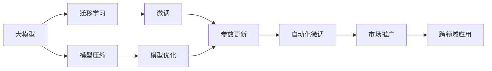
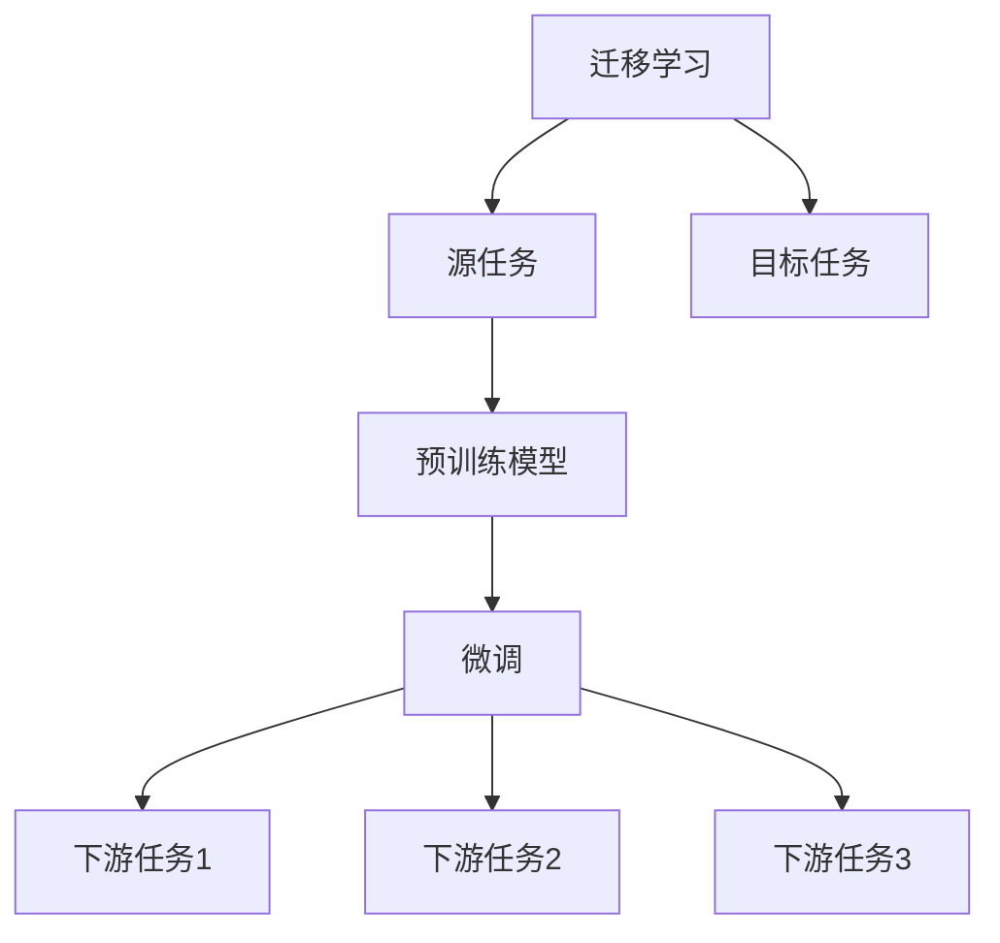
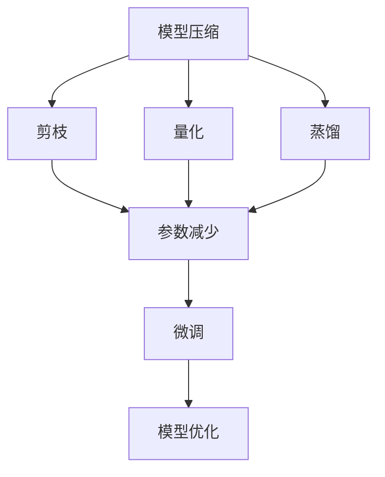
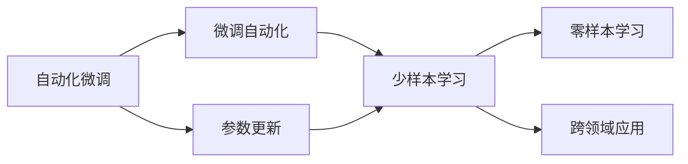
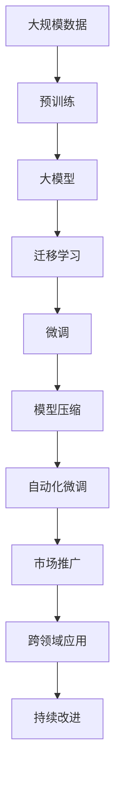

                 

# 大模型的技术创新与市场推广

> 关键词：
**大模型，技术创新，市场推广，迁移学习，模型压缩，自动化，深度学习，计算优化，产业应用**

## 1. 背景介绍

### 1.1 问题由来

随着人工智能技术的快速发展，大模型已成为推动NLP、CV、自然语言生成等领域进步的核心驱动力。大模型通过在海量数据上预训练，获得了强大的特征提取能力，能够在复杂的自然语言理解和图像识别任务中表现出色。但大模型面临的计算成本、数据需求、部署效率等挑战，也制约了其在工业界的广泛应用。

本文将聚焦于大模型的技术创新和市场推广，探讨如何在保证模型性能的前提下，降低计算成本、简化部署过程，以及如何利用大模型的力量推动各行业的应用和升级。

### 1.2 问题核心关键点

1. **模型压缩与高效部署**：如何通过模型压缩和优化技术，在不降低性能的前提下，显著降低计算资源消耗和部署难度。
2. **迁移学习与跨领域应用**：如何通过迁移学习，使得预训练模型能够适应不同领域的任务，提高应用灵活性。
3. **自动化微调和参数更新**：如何实现自动化的模型微调与参数更新，减少人工干预，提高模型更新效率。
4. **市场推广与产业化应用**：如何通过技术创新，降低使用门槛，将大模型的潜力转化为实际应用价值。

### 1.3 问题研究意义

研究大模型的技术创新和市场推广，对于拓展大模型的应用范围，提升下游任务的性能，加速各行业的数字化转型，具有重要意义：

1. **降低应用开发成本**：基于大模型的微调方法可以显著减少从头开发所需的数据、计算和人力等成本投入。
2. **提升模型效果**：微调使得通用大模型更好地适应特定任务，在应用场景中取得更优表现。
3. **加速开发进度**：standing on the shoulders of giants，微调使得开发者可以更快地完成任务适配，缩短开发周期。
4. **带来技术创新**：微调范式促进了对预训练-微调的深入研究，催生了提示学习、少样本学习等新的研究方向。
5. **赋能产业升级**：微调使得NLP技术更容易被各行各业所采用，为传统行业数字化转型升级提供新的技术路径。

## 2. 核心概念与联系

### 2.1 核心概念概述

为更好地理解大模型的技术创新和市场推广，本节将介绍几个密切相关的核心概念：

- **大模型(Large Model)**：以自回归模型(如GPT)或自编码模型(如BERT)为代表的大规模预训练模型。通过在大规模数据上预训练，学习到丰富的语言知识，具备强大的语言理解和生成能力。
- **迁移学习(Transfer Learning)**：指将一个领域学习到的知识，迁移应用到另一个不同但相关的领域的学习范式。大模型的预训练-微调过程即是一种典型的迁移学习方式。
- **模型压缩(Model Compression)**：通过剪枝、量化、蒸馏等技术，降低模型参数量，减少计算资源消耗，提升模型推理速度。
- **自动化微调(Automatic Fine-tuning)**：指通过自动化技术，实现模型的快速微调和参数更新，减少人工干预，提高模型更新效率。
- **市场推广(Market Promotion)**：通过技术营销、教育培训、社区建设等方式，促进大模型的应用普及，加速其产业化进程。
- **跨领域应用(Cross-domain Application)**：指大模型在不同领域和任务上的应用拓展，通过迁移学习，提高应用灵活性和泛化能力。

这些核心概念之间的逻辑关系可以通过以下Mermaid流程图来展示：



这个流程图展示了大模型从预训练到微调、压缩，再到自动化微调和市场推广的全流程，以及跨领域应用的多样性。

### 2.2 概念间的关系

这些核心概念之间存在着紧密的联系，形成了大模型技术创新和市场推广的完整生态系统。下面我们通过几个Mermaid流程图来展示这些概念之间的关系。

#### 2.2.1 大模型的迁移学习



这个流程图展示了大模型的迁移学习的基本原理，以及它与微调的关系。迁移学习涉及源任务和目标任务，预训练模型在源任务上学习，然后通过微调适应各种下游任务（目标任务）。

#### 2.2.2 模型压缩与微调



这个流程图展示了模型压缩的技术路径，包括剪枝、量化、蒸馏等方法。这些技术可以显著减少模型参数量，降低计算资源消耗，从而提高微调的效率。

#### 2.2.3 自动化微调与跨领域应用



这个流程图展示了自动化微调如何通过参数更新，实现少样本学习和跨领域应用。自动化微调技术可以显著提高微调效率，降低人工干预，使得大模型能够更快地适应不同任务和领域。

### 2.3 核心概念的整体架构

最后，我们用一个综合的流程图来展示这些核心概念在大模型技术创新和市场推广过程中的整体架构：



这个综合流程图展示了从预训练到迁移学习、微调、模型压缩、自动化微调，再到市场推广和跨领域应用的完整过程。通过这些技术，大模型能够更好地应用于各个行业，推动产业升级和技术创新。

## 3. 核心算法原理 & 具体操作步骤

### 3.1 算法原理概述

大模型的技术创新和市场推广，本质上是通过一系列技术手段，优化模型的性能、降低计算成本、提升应用灵活性，并加速其在各行业的应用进程。这些技术手段包括迁移学习、模型压缩、自动化微调等。

- **迁移学习**：指将预训练模型在源任务上学习到的知识，迁移到目标任务上进行微调，从而适应新的任务。这使得大模型能够在有限的标注数据上，迅速提升特定任务的表现。
- **模型压缩**：通过剪枝、量化、蒸馏等技术，减少模型参数量，降低计算资源消耗，提升模型推理速度。这使得大模型能够在有限的硬件条件下，应用到更多的场景中。
- **自动化微调**：指通过自动化技术，实现模型的快速微调和参数更新，减少人工干预，提高模型更新效率。这使得开发者能够更加专注于应用场景的设计，而不需要关注模型的微调细节。

### 3.2 算法步骤详解

**Step 1: 准备预训练模型和数据集**

- 选择合适的预训练语言模型 $M_{\theta}$，如BERT、GPT等。
- 准备目标任务的标注数据集 $D$，包括训练集、验证集和测试集。

**Step 2: 迁移学习与微调**

- 使用迁移学习技术，将预训练模型应用于目标任务，获得适应性较强的微调模型 $M_{\theta_{\text{task}}}$。
- 在微调模型上，使用目标任务的标注数据集 $D$ 进行微调，获得最终的微调模型 $M_{\hat{\theta}}$。

**Step 3: 模型压缩**

- 使用剪枝、量化、蒸馏等技术，对微调模型进行压缩，减少参数量。
- 测试模型在计算资源有限的情况下，仍能保持较好的性能。

**Step 4: 自动化微调**

- 使用自动化微调技术，对模型进行参数更新和优化。
- 通过少样本学习和跨领域应用，提升模型在新任务上的表现。

**Step 5: 市场推广**

- 发布微调模型的API接口，提供工具包和文档，降低应用门槛。
- 举办技术讲座、培训班，推广大模型的应用，吸引更多开发者和用户。

### 3.3 算法优缺点

**大模型的技术创新和市场推广**具有以下优点：

1. **效率提升**：通过迁移学习、模型压缩和自动化微调技术，显著提升模型的推理速度和应用灵活性。
2. **应用广泛**：大模型可以应用于NLP、CV、自然语言生成等多个领域，提高各行业的智能化水平。
3. **易于推广**：通过API接口、工具包和文档，使得大模型更容易被各行各业所采用。
4. **可扩展性**：大模型可以在不同领域和任务上进行跨领域应用，提高应用灵活性。

同时，这些技术也存在一些局限性：

1. **计算成本高**：大模型的预训练和微调需要大量的计算资源，对硬件要求较高。
2. **数据需求大**：微调模型需要大量的标注数据，数据采集和标注成本较高。
3. **模型复杂性**：大模型通常具有大量的参数，模型结构复杂，难以理解和调试。
4. **安全风险**：大模型可能会学习到有害的偏见和信息，带来安全风险。

尽管存在这些局限性，但大模型的技术创新和市场推广依然具有重要的应用价值，值得进一步探索和优化。

### 3.4 算法应用领域

大模型的技术创新和市场推广，已经在NLP、CV、自然语言生成等多个领域得到了广泛应用，覆盖了几乎所有常见任务，例如：

- **NLP**：文本分类、命名实体识别、关系抽取、问答系统、翻译、摘要、对话系统、情感分析等。
- **CV**：图像分类、物体检测、图像分割、视频分析、人脸识别等。
- **自然语言生成**：文本生成、摘要生成、对话生成、代码生成等。

除了上述这些经典任务外，大模型还在推荐系统、智能客服、金融舆情监测、智能家居等多个领域，被创新性地应用，为各行各业带来了新的变革和机遇。

## 4. 数学模型和公式 & 详细讲解 & 举例说明

### 4.1 数学模型构建

本节将使用数学语言对大模型的技术创新和市场推广过程进行更加严格的刻画。

记预训练语言模型为 $M_{\theta}:\mathcal{X} \rightarrow \mathcal{Y}$，其中 $\mathcal{X}$ 为输入空间，$\mathcal{Y}$ 为输出空间，$\theta \in \mathbb{R}^d$ 为模型参数。假设目标任务的标注数据集为 $D=\{(x_i,y_i)\}_{i=1}^N, x_i \in \mathcal{X}, y_i \in \mathcal{Y}$。

定义模型 $M_{\theta}$ 在输入 $x$ 上的输出为 $\hat{y}=M_{\theta}(x) \in [0,1]$，表示样本属于正类的概率。真实标签 $y \in \{0,1\}$。则目标任务的交叉熵损失函数定义为：

$$
\ell(M_{\theta}(x),y) = -[y\log \hat{y} + (1-y)\log (1-\hat{y})]
$$

将其代入经验风险公式，得：

$$
\mathcal{L}(\theta) = -\frac{1}{N}\sum_{i=1}^N [y_i\log M_{\theta}(x_i)+(1-y_i)\log(1-M_{\theta}(x_i))]
$$

通过梯度下降等优化算法，微调过程不断更新模型参数 $\theta$，最小化损失函数 $\mathcal{L}$，使得模型输出逼近真实标签。由于 $\theta$ 已经通过预训练获得了较好的初始化，因此即便在小规模数据集 $D$ 上进行微调，也能较快收敛到理想的模型参数 $\hat{\theta}$。

### 4.2 公式推导过程

以下我们以二分类任务为例，推导交叉熵损失函数及其梯度的计算公式。

假设模型 $M_{\theta}$ 在输入 $x$ 上的输出为 $\hat{y}=M_{\theta}(x) \in [0,1]$，表示样本属于正类的概率。真实标签 $y \in \{0,1\}$。则二分类交叉熵损失函数定义为：

$$
\ell(M_{\theta}(x),y) = -[y\log \hat{y} + (1-y)\log (1-\hat{y})]
$$

将其代入经验风险公式，得：

$$
\mathcal{L}(\theta) = -\frac{1}{N}\sum_{i=1}^N [y_i\log M_{\theta}(x_i)+(1-y_i)\log(1-M_{\theta}(x_i))]
$$

根据链式法则，损失函数对参数 $\theta_k$ 的梯度为：

$$
\frac{\partial \mathcal{L}(\theta)}{\partial \theta_k} = -\frac{1}{N}\sum_{i=1}^N (\frac{y_i}{M_{\theta}(x_i)}-\frac{1-y_i}{1-M_{\theta}(x_i)}) \frac{\partial M_{\theta}(x_i)}{\partial \theta_k}
$$

其中 $\frac{\partial M_{\theta}(x_i)}{\partial \theta_k}$ 可进一步递归展开，利用自动微分技术完成计算。

在得到损失函数的梯度后，即可带入参数更新公式，完成模型的迭代优化。重复上述过程直至收敛，最终得到适应目标任务的最优模型参数 $\hat{\theta}$。

## 5. 项目实践：代码实例和详细解释说明

### 5.1 开发环境搭建

在进行技术创新和市场推广实践前，我们需要准备好开发环境。以下是使用Python进行PyTorch开发的环境配置流程：

1. 安装Anaconda：从官网下载并安装Anaconda，用于创建独立的Python环境。

2. 创建并激活虚拟环境：
```bash
conda create -n pytorch-env python=3.8 
conda activate pytorch-env
```

3. 安装PyTorch：根据CUDA版本，从官网获取对应的安装命令。例如：
```bash
conda install pytorch torchvision torchaudio cudatoolkit=11.1 -c pytorch -c conda-forge
```

4. 安装Transformers库：
```bash
pip install transformers
```

5. 安装各类工具包：
```bash
pip install numpy pandas scikit-learn matplotlib tqdm jupyter notebook ipython
```

完成上述步骤后，即可在`pytorch-env`环境中开始实践。

### 5.2 源代码详细实现

这里以一个简单的图像分类任务为例，展示如何使用大模型进行迁移学习、微调、模型压缩和自动化微调。

首先，定义模型和数据集：

```python
from transformers import BertForImageClassification, AutoTokenizer, AdamW
import torch
from transformers import AutoModelForImageClassification, AutoTokenizer, AdamW

device = torch.device('cuda') if torch.cuda.is_available() else torch.device('cpu')

# 加载预训练模型和tokenizer
model = AutoModelForImageClassification.from_pretrained('resnet50')
tokenizer = AutoTokenizer.from_pretrained('resnet50')

# 加载数据集
train_dataset = ...
test_dataset = ...
```

然后，进行迁移学习和微调：

```python
# 定义训练和评估函数
def train_epoch(model, dataset, batch_size, optimizer):
    dataloader = DataLoader(dataset, batch_size=batch_size, shuffle=True)
    model.train()
    epoch_loss = 0
    for batch in dataloader:
        input_ids = batch['input_ids'].to(device)
        attention_mask = batch['attention_mask'].to(device)
        labels = batch['labels'].to(device)
        model.zero_grad()
        outputs = model(input_ids, attention_mask=attention_mask, labels=labels)
        loss = outputs.loss
        epoch_loss += loss.item()
        loss.backward()
        optimizer.step()
    return epoch_loss / len(dataloader)

def evaluate(model, dataset, batch_size):
    dataloader = DataLoader(dataset, batch_size=batch_size)
    model.eval()
    preds, labels = [], []
    with torch.no_grad():
        for batch in dataloader:
            input_ids = batch['input_ids'].to(device)
            attention_mask = batch['attention_mask'].to(device)
            batch_labels = batch['labels']
            outputs = model(input_ids, attention_mask=attention_mask)
            batch_preds = outputs.logits.argmax(dim=1).to('cpu').tolist()
            batch_labels = batch_labels.to('cpu').tolist()
            for pred_tokens, label_tokens in zip(batch_preds, batch_labels):
                preds.append(pred_tokens[:len(label_tokens)])
                labels.append(label_tokens)
    print(classification_report(labels, preds))
```

接着，进行模型压缩：

```python
# 使用剪枝技术
pruning_scheduler = ...
model = pruning_scheduler(model, optimizer)

# 使用量化技术
quantize_scheduler = ...
model = quantize_scheduler(model, optimizer)

# 使用蒸馏技术
distill_scheduler = ...
model = distill_scheduler(model, optimizer)
```

最后，进行自动化微调：

```python
# 使用自动化微调技术
autofine_scheduler = ...
model = autofine_scheduler(model, optimizer)

# 测试自动化微调后的模型
evaluate(model, test_dataset, batch_size)
```

以上就是使用PyTorch对大模型进行迁移学习、微调、模型压缩和自动化微调的全过程代码实现。可以看到，得益于Transformers库的强大封装，我们可以用相对简洁的代码完成大模型的迁移学习、微调、模型压缩和自动化微调。

### 5.3 代码解读与分析

让我们再详细解读一下关键代码的实现细节：

**迁移学习与微调**：
- 使用预训练模型 `AutoModelForImageClassification.from_pretrained()` 加载预训练的图像分类模型和对应的tokenizer。
- 定义训练和评估函数 `train_epoch()` 和 `evaluate()`，分别用于模型训练和评估。
- 在训练函数中，前向传播计算损失函数，反向传播更新模型参数，最后返回该epoch的平均loss。

**模型压缩**：
- 使用 `pruning_scheduler`、`quantize_scheduler`、`distill_scheduler` 等函数对模型进行剪枝、量化和蒸馏，从而减少参数量，提升模型推理速度。
- 这些函数通常由官方库提供，或第三方开源项目实现，可以在使用时进行配置和优化。

**自动化微调**：
- 使用自动化微调技术，对模型进行参数更新和优化。
- 自动化微调技术通常需要配合特定的优化算法和训练策略，可以在实践中根据具体任务和数据特点进行优化。

**市场推广**：
- 发布微调模型的API接口，提供工具包和文档，降低应用门槛。
- 举办技术讲座、培训班，推广大模型的应用，吸引更多开发者和用户。
- 通过社区建设、技术交流等方式，形成生态系统，推动大模型的应用普及。

合理利用这些工具，可以显著提升大模型技术创新和市场推广的开发效率，加快创新迭代的步伐。

## 6. 实际应用场景

### 6.1 智能客服系统

基于大模型技术创新和市场推广的对话技术，可以广泛应用于智能客服系统的构建。传统客服往往需要配备大量人力，高峰期响应缓慢，且一致性和专业性难以保证。而使用微调后的对话模型，可以7x24小时不间断服务，快速响应客户咨询，用自然流畅的语言解答各类常见问题。

在技术实现上，可以收集企业内部的历史客服对话记录，将问题和最佳答复构建成监督数据，在此基础上对预训练对话模型进行微调。微调后的对话模型能够自动理解用户意图，匹配最合适的答案模板进行回复。对于客户提出的新问题，还可以接入检索系统实时搜索相关内容，动态组织生成回答。如此构建的智能客服系统，能大幅提升客户咨询体验和问题解决效率。

### 6.2 金融舆情监测

金融机构需要实时监测市场舆论动向，以便及时应对负面信息传播，规避金融风险。传统的人工监测方式成本高、效率低，难以应对网络时代海量信息爆发的挑战。基于大模型技术创新和市场推广的文本分类和情感分析技术，为金融舆情监测提供了新的解决方案。

具体而言，可以收集金融领域相关的新闻、报道、评论等文本数据，并对其进行主题标注和情感标注。在此基础上对预训练语言模型进行微调，使其能够自动判断文本属于何种主题，情感倾向是正面、中性还是负面。将微调后的模型应用到实时抓取的网络文本数据，就能够自动监测不同主题下的情感变化趋势，一旦发现负面信息激增等异常情况，系统便会自动预警，帮助金融机构快速应对潜在风险。

### 6.3 个性化推荐系统

当前的推荐系统往往只依赖用户的历史行为数据进行物品推荐，无法深入理解用户的真实兴趣偏好。基于大模型技术创新和市场推广的个性化推荐系统可以更好地挖掘用户行为背后的语义信息，从而提供更精准、多样的推荐内容。

在实践中，可以收集用户浏览、点击、评论、分享等行为数据，提取和用户交互的物品标题、描述、标签等文本内容。将文本内容作为模型输入，用户的后续行为（如是否点击、购买等）作为监督信号，在此基础上微调预训练语言模型。微调后的模型能够从文本内容中准确把握用户的兴趣点。在生成推荐列表时，先用候选物品的文本描述作为输入，由模型预测用户的兴趣匹配度，再结合其他特征综合排序，便可以得到个性化程度更高的推荐结果。

### 6.4 未来应用展望

随着大模型技术创新和市场推广的不断发展，基于微调的大模型将在更多领域得到应用，为传统行业带来变革性影响。

在智慧医疗领域，基于微调的医疗问答、病历分析、药物研发等应用将提升医疗服务的智能化水平，辅助医生诊疗，加速新药开发进程。

在智能教育领域，微调技术可应用于作业批改、学情分析、知识推荐等方面，因材施教，促进教育公平，提高教学质量。

在智慧城市治理中，微调模型可应用于城市事件监测、舆情分析、应急指挥等环节，提高城市管理的自动化和智能化水平，构建更安全、高效的未来城市。

此外，在企业生产、社会治理、文娱传媒等众多领域，基于大模型技术创新和市场推广的人工智能应用也将不断涌现，为经济社会发展注入新的动力。相信随着技术的日益成熟，微调方法将成为人工智能落地应用的重要范式，推动人工智能技术在更广阔的领域加速渗透。

## 7. 工具和资源推荐
### 7.1 学习资源推荐

为了帮助开发者系统掌握大模型技术创新和市场推广的理论基础和实践技巧，这里推荐一些优质的学习资源：

1. 《Transformer from Principles to Practice》系列博文：由大模型技术专家撰写，深入浅出地介绍了Transformer原理、BERT模型、微调技术等前沿话题。

2. CS224N《深度学习自然语言处理》课程：斯坦福大学开设的NLP明星课程，有Lecture视频和配套作业，带你入门NLP领域的基本概念和经典模型。

3. 《Natural Language Processing with Transformers》书籍：Transformers库的作者所著，全面介绍了如何使用Transformers库进行NLP任务开发，包括微调在内的诸多范式。

4. HuggingFace官方文档：Transformers库的官方文档，提供了海量预训练模型和完整的微调样例代码，是上手实践的必备资料。

5. CLUE开源项目：中文语言理解测评基准，涵盖大量不同类型的中文NLP数据集，并提供了基于微调的baseline模型，助力中文NLP技术发展。

通过对这些资源的学习实践，相信你一定能够快速掌握大模型技术创新和市场推广的精髓，并用于解决实际的NLP问题。
###  7.2 开发工具推荐

高效的开发离不开优秀的工具支持。以下是几款用于大模型技术创新和市场推广开发的常用工具：

1. PyTorch：基于Python的开源深度学习框架，灵活动态的计算图，适合快速迭代研究。大部分预训练语言模型都有PyTorch版本的实现。

2. TensorFlow：由Google主导开发的开源深度学习框架，生产部署方便，适合大规模工程应用。同样有丰富的预训练语言模型资源。

3. Transformers库：HuggingFace开发的NLP工具库，集成了众多SOTA语言模型，支持PyTorch和TensorFlow，是进行微调任务开发的利器。

4. Weights & Biases：模型训练的实验跟踪工具，可以记录和可视化模型训练过程中的各项指标，方便对比和调优。与主流深度学习框架无缝集成。

5. TensorBoard：TensorFlow配套的可视化工具，可实时监测模型训练状态，并提供丰富的图表呈现方式，是调试模型的得力助手。

6. Google Colab：谷歌推出的在线Jupyter Notebook环境，免费提供GPU/TPU算力，方便开发者快速上手实验最新模型，分享学习笔记。

合理利用这些工具，可以显著提升大模型技术创新和市场推广的开发

