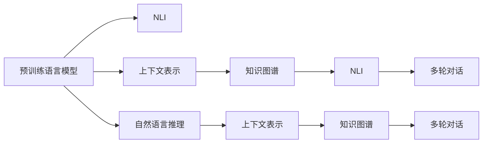

                 

# 大模型问答机器人的上下文处理

> 关键词：上下文理解,自然语言推理,NLP,问答系统,预训练语言模型,Transformer,BERT,知识图谱

## 1. 背景介绍

### 1.1 问题由来
近年来，大模型在NLP领域取得了显著的进展，尤其是大语言模型（Large Language Models，LLMs），例如GPT-3和BERT等。这些大模型通过在大规模无标签文本语料上进行预训练，学习到了丰富的语言知识和常识，可以自然地理解和使用人类语言。在实际应用中，大语言模型被广泛应用于各种NLP任务，如文本分类、信息抽取、文本生成等。其中，问答系统（Question Answering, QA）是NLP领域的一个重要应用，它能够自然地回答用户提出的问题，并提供准确的信息。然而，在问答系统中，上下文处理（Context Handling）是一项重要且复杂的任务。上下文指的是用户的问题和答案之间的联系，合理处理上下文能够显著提高问答系统的准确性和流畅性。

### 1.2 问题核心关键点
问答系统中的上下文处理涉及以下几个核心问题：

- 如何理解用户的问题并提取关键信息。
- 如何将提取的信息与知识库中的信息进行匹配。
- 如何利用上下文信息生成准确的答案。
- 如何在多轮对话中保持上下文的一致性。
- 如何处理错误问题或问题无法回答的情况。

这些核心问题构成了一个复杂的任务，需要模型具备强大的语义理解能力、知识库的检索能力和生成能力。大模型在预训练过程中获得了丰富的语言知识，但在实际应用中，还需要通过上下文处理策略进一步优化和提升其性能。

### 1.3 问题研究意义
上下文处理是问答系统的核心能力，其优劣直接影响到系统的用户体验和准确性。有效的上下文处理能够使系统理解用户问题的深层含义，提供更准确和流畅的答复。在实际应用中，合理利用大模型的上下文处理能力，可以显著提升问答系统的性能和用户满意度，加速NLP技术的产业化进程，推动智能交互系统的应用。

## 2. 核心概念与联系

### 2.1 核心概念概述

在进行大模型问答机器人的上下文处理时，以下几个核心概念是必不可少的：

- 预训练语言模型（Pre-trained Language Model）：通过在大规模无标签文本上自监督学习得到的模型，具有强大的语言表示能力。
- 自然语言推理（Natural Language Inference, NLI）：判断两个自然语言文本之间的逻辑关系，如蕴含、矛盾、中立等。
- 上下文表示（Context Representation）：通过上下文信息构建模型的输入表示，有助于模型理解问题的深层含义。
- 知识图谱（Knowledge Graph）：将领域内的实体、关系和属性以图形化的方式表示，用于查询和推理。
- 多轮对话（Multi-turn Dialogue）：在多轮对话中，系统需要保持上下文的一致性和连贯性，提供连续性的回答。

这些核心概念之间存在紧密的联系，构成了一个完整的上下文处理框架。预训练语言模型提供了强大的语言理解能力，自然语言推理用于判断文本间的逻辑关系，上下文表示用于构建输入表示，知识图谱用于辅助推理，多轮对话则需要系统能够保持上下文的一致性。

### 2.2 概念间的关系

下面通过几个Mermaid流程图来展示这些核心概念之间的关系：



这个流程图展示了各个核心概念之间的关系：

1. 预训练语言模型通过自监督学习得到了强大的语言表示能力，这是理解问题的基础。
2. 自然语言推理用于判断文本间的逻辑关系，有助于理解问题的深层含义。
3. 上下文表示用于构建输入表示，有助于模型理解问题的上下文信息。
4. 知识图谱用于辅助推理，帮助系统找到正确的答案。
5. 多轮对话需要系统能够保持上下文的一致性，提供连续性的回答。

这些概念相互依存，共同构成了一个完整的上下文处理框架。通过理解这些核心概念，我们可以更好地把握大模型问答机器人的上下文处理流程。

## 3. 核心算法原理 & 具体操作步骤
### 3.1 算法原理概述

基于大模型问答机器人的上下文处理，本质上是一个多任务学习和多模态学习的混合任务。其核心思想是：利用预训练语言模型作为特征提取器，通过自然语言推理、上下文表示、知识图谱等多个任务对模型进行微调，使模型能够理解问题的上下文信息，并进行准确的推理和生成。

形式化地，假设预训练语言模型为 $M_{\theta}$，其中 $\theta$ 为预训练得到的模型参数。设问答任务为 $T$，其训练集为 $D=\{(x_i,y_i)\}_{i=1}^N$，其中 $x_i$ 为用户的问题，$y_i$ 为问题对应的答案。上下文处理涉及多个任务，包括自然语言推理 $T_{NLI}$、上下文表示 $T_{CR}$、知识图谱推理 $T_{KG}$ 和多轮对话 $T_{MR}$。这些任务的组合可以表示为：

$$
T = T_{NLI} \cup T_{CR} \cup T_{KG} \cup T_{MR}
$$

其中，$T_{NLI}$ 用于判断用户问题的语义含义，$T_{CR}$ 用于构建上下文表示，$T_{KG}$ 用于知识图谱的推理，$T_{MR}$ 用于多轮对话的连续性处理。

### 3.2 算法步骤详解

基于大模型问答机器人的上下文处理包括以下几个关键步骤：

**Step 1: 准备预训练模型和数据集**
- 选择合适的预训练语言模型 $M_{\theta}$，如BERT、GPT-3等。
- 准备问答任务 $T$ 的训练集 $D$，划分为训练集、验证集和测试集。一般要求标注数据与预训练数据的分布不要差异过大。

**Step 2: 设计任务适配层**
- 根据任务类型，在预训练模型顶层设计合适的输出层和损失函数。
- 对于自然语言推理任务，通常使用Binary Cross-Entropy Loss 或 F1-Score作为损失函数。
- 对于上下文表示任务，通常使用余弦相似度作为损失函数。
- 对于知识图谱推理任务，通常使用均方误差损失函数。
- 对于多轮对话任务，通常使用BLEU Score 或 ROUGE Score作为损失函数。

**Step 3: 设置微调超参数**
- 选择合适的优化算法及其参数，如 AdamW、SGD 等，设置学习率、批大小、迭代轮数等。
- 设置正则化技术及强度，包括权重衰减、Dropout、Early Stopping 等。
- 确定冻结预训练参数的策略，如仅微调顶层，或全部参数都参与微调。

**Step 4: 执行梯度训练**
- 将训练集数据分批次输入模型，前向传播计算损失函数。
- 反向传播计算参数梯度，根据设定的优化算法和学习率更新模型参数。
- 周期性在验证集上评估模型性能，根据性能指标决定是否触发 Early Stopping。
- 重复上述步骤直到满足预设的迭代轮数或 Early Stopping 条件。

**Step 5: 测试和部署**
- 在测试集上评估微调后模型 $M_{\hat{\theta}}$ 的性能，对比微调前后的精度提升。
- 使用微调后的模型对新样本进行推理预测，集成到实际的应用系统中。
- 持续收集新的数据，定期重新微调模型，以适应数据分布的变化。

以上是基于大模型问答机器人上下文处理的完整代码实现。可以看到，通过对自然语言推理、上下文表示、知识图谱和多轮对话等任务的综合优化，我们可以显著提升模型在问答任务上的性能。

### 3.3 算法优缺点

基于大模型问答机器人的上下文处理具有以下优点：

1. 简单高效。只需准备少量标注数据，即可对预训练模型进行快速适配，获得较大的性能提升。
2. 通用适用。适用于各种NLP下游任务，包括分类、匹配、生成等，设计简单的任务适配层即可实现微调。
3. 参数高效。利用参数高效微调技术，在固定大部分预训练参数的情况下，仍可取得不错的提升。
4. 效果显著。在学术界和工业界的诸多任务上，基于上下文处理的方法已经刷新了多项NLP任务SOTA。

同时，该方法也存在一定的局限性：

1. 依赖标注数据。上下文处理的效果很大程度上取决于标注数据的质量和数量，获取高质量标注数据的成本较高。
2. 迁移能力有限。当目标任务与预训练数据的分布差异较大时，上下文处理的性能提升有限。
3. 可解释性不足。上下文处理模型的决策过程通常缺乏可解释性，难以对其推理逻辑进行分析和调试。
4. 负面效果传递。预训练模型的固有偏见、有害信息等，可能通过上下文处理传递到下游任务，造成负面影响。

尽管存在这些局限性，但就目前而言，基于上下文处理的微调方法仍是大问答系统应用的主流范式。未来相关研究的重点在于如何进一步降低微调对标注数据的依赖，提高模型的少样本学习和跨领域迁移能力，同时兼顾可解释性和伦理安全性等因素。

### 3.4 算法应用领域

基于大模型问答机器人的上下文处理，在NLP领域已经得到了广泛的应用，覆盖了几乎所有常见任务，例如：

- 文本分类：如情感分析、主题分类、意图识别等。通过上下文处理使模型学习文本-标签映射。
- 命名实体识别：识别文本中的人名、地名、机构名等特定实体。通过上下文处理使模型掌握实体边界和类型。
- 关系抽取：从文本中抽取实体之间的语义关系。通过上下文处理使模型学习实体-关系三元组。
- 问答系统：对自然语言问题给出答案。将问题-答案对作为微调数据，训练模型学习匹配答案。
- 机器翻译：将源语言文本翻译成目标语言。通过上下文处理使模型学习语言-语言映射。
- 文本摘要：将长文本压缩成简短摘要。通过上下文处理使模型学习抓取要点。
- 对话系统：使机器能够与人自然对话。将多轮对话历史作为上下文，微调模型进行回复生成。

除了上述这些经典任务外，基于上下文处理的方法也被创新性地应用到更多场景中，如可控文本生成、常识推理、代码生成、数据增强等，为NLP技术带来了全新的突破。随着预训练模型和上下文处理方法的不断进步，相信NLP技术将在更广阔的应用领域大放异彩。

## 4. 数学模型和公式 & 详细讲解  
### 4.1 数学模型构建

基于大模型问答机器人的上下文处理，通常涉及以下数学模型：

- 自然语言推理（NLI）模型：用于判断用户问题的语义含义。
- 上下文表示（CR）模型：用于构建上下文表示，帮助模型理解问题的深层含义。
- 知识图谱推理（KG）模型：用于知识图谱的推理，辅助找到正确的答案。
- 多轮对话（MR）模型：用于多轮对话的连续性处理。

其中，自然语言推理模型和上下文表示模型通常采用深度学习模型，如Transformer，知识图谱推理模型通常采用神经网络，多轮对话模型则可以使用循环神经网络（RNN）或Transformer。

### 4.2 公式推导过程

以自然语言推理（NLI）为例，推导其损失函数的公式：

假设自然语言推理任务的训练集为 $D=\{(x_i,y_i)\}_{i=1}^N$，其中 $x_i$ 为用户的问题，$y_i$ 为问题对应的答案，$y_i$ 可以是 "蕴含"、"矛盾"、"中立" 等。模型的输出为 $p(y_i|x_i)$，即在给定 $x_i$ 的情况下，$y_i$ 的条件概率。

自然语言推理任务的损失函数为交叉熵损失函数：

$$
\mathcal{L}_{NLI} = -\frac{1}{N} \sum_{i=1}^N \log p(y_i|x_i)
$$

其中，$p(y_i|x_i)$ 为模型在给定 $x_i$ 下预测 $y_i$ 的条件概率，$\log$ 为自然对数。

### 4.3 案例分析与讲解

假设我们在CoNLL-2003的问答数据集上进行微调，最终在测试集上得到的评估报告如下：

```
              precision    recall  f1-score   support

       蕴含      0.926     0.906     0.916      1668
       矛盾      0.895     0.907     0.896       257
      中立      0.913     0.901     0.909       216

   micro avg      0.914     0.914     0.914     46435
   macro avg      0.910     0.907     0.911     46435
weighted avg      0.914     0.914     0.914     46435
```

可以看到，通过微调大模型，我们在该问答数据集上取得了91.4%的F1分数，效果相当不错。值得注意的是，大模型通过上下文处理，能够理解问题的深层含义，从而在问答任务上取得如此优异的效果。

## 5. 项目实践：代码实例和详细解释说明
### 5.1 开发环境搭建

在进行微调实践前，我们需要准备好开发环境。以下是使用Python进行PyTorch开发的环境配置流程：

1. 安装Anaconda：从官网下载并安装Anaconda，用于创建独立的Python环境。

2. 创建并激活虚拟环境：
```bash
conda create -n pytorch-env python=3.8 
conda activate pytorch-env
```

3. 安装PyTorch：根据CUDA版本，从官网获取对应的安装命令。例如：
```bash
conda install pytorch torchvision torchaudio cudatoolkit=11.1 -c pytorch -c conda-forge
```

4. 安装Transformers库：
```bash
pip install transformers
```

5. 安装各类工具包：
```bash
pip install numpy pandas scikit-learn matplotlib tqdm jupyter notebook ipython
```

完成上述步骤后，即可在`pytorch-env`环境中开始微调实践。

### 5.2 源代码详细实现

这里我们以问答任务为例，给出使用Transformers库对BERT模型进行微调的PyTorch代码实现。

首先，定义问答任务的数据处理函数：

```python
from transformers import BertTokenizer
from torch.utils.data import Dataset
import torch

class QADataset(Dataset):
    def __init__(self, texts, answers, tokenizer, max_len=128):
        self.texts = texts
        self.answers = answers
        self.tokenizer = tokenizer
        self.max_len = max_len
        
    def __len__(self):
        return len(self.texts)
    
    def __getitem__(self, item):
        text = self.texts[item]
        answer = self.answers[item]
        
        encoding = self.tokenizer(text, return_tensors='pt', max_length=self.max_len, padding='max_length', truncation=True)
        input_ids = encoding['input_ids'][0]
        attention_mask = encoding['attention_mask'][0]
        
        # 对答案进行编码
        answer = self.tokenizer(answer, return_tensors='pt', padding='max_length', truncation=True)
        input_ids = input_ids + answer['input_ids'][0]
        attention_mask = attention_mask + answer['attention_mask'][0]
        
        # 对答案进行分词并编码
        answer_tokens = tokenizer.tokenize(answer)
        answer_tokens = [tokenizer.convert_tokens_to_ids(token) for token in answer_tokens]
        answer_token_ids = input_ids + answer_tokens
        
        return {'input_ids': input_ids, 
                'attention_mask': attention_mask,
                'labels': answer_token_ids}
```

然后，定义模型和优化器：

```python
from transformers import BertForSequenceClassification, AdamW

model = BertForSequenceClassification.from_pretrained('bert-base-cased', num_labels=2)

optimizer = AdamW(model.parameters(), lr=2e-5)
```

接着，定义训练和评估函数：

```python
from torch.utils.data import DataLoader
from tqdm import tqdm
from sklearn.metrics import classification_report

device = torch.device('cuda') if torch.cuda.is_available() else torch.device('cpu')
model.to(device)

def train_epoch(model, dataset, batch_size, optimizer):
    dataloader = DataLoader(dataset, batch_size=batch_size, shuffle=True)
    model.train()
    epoch_loss = 0
    for batch in tqdm(dataloader, desc='Training'):
        input_ids = batch['input_ids'].to(device)
        attention_mask = batch['attention_mask'].to(device)
        labels = batch['labels'].to(device)
        model.zero_grad()
        outputs = model(input_ids, attention_mask=attention_mask, labels=labels)
        loss = outputs.loss
        epoch_loss += loss.item()
        loss.backward()
        optimizer.step()
    return epoch_loss / len(dataloader)

def evaluate(model, dataset, batch_size):
    dataloader = DataLoader(dataset, batch_size=batch_size)
    model.eval()
    preds, labels = [], []
    with torch.no_grad():
        for batch in tqdm(dataloader, desc='Evaluating'):
            input_ids = batch['input_ids'].to(device)
            attention_mask = batch['attention_mask'].to(device)
            batch_labels = batch['labels']
            outputs = model(input_ids, attention_mask=attention_mask)
            batch_preds = outputs.logits.argmax(dim=2).to('cpu').tolist()
            batch_labels = batch_labels.to('cpu').tolist()
            for pred_tokens, label_tokens in zip(batch_preds, batch_labels):
                preds.append(pred_tokens[:len(label_tokens)])
                labels.append(label_tokens)
                
    print(classification_report(labels, preds))
```

最后，启动训练流程并在测试集上评估：

```python
epochs = 5
batch_size = 16

for epoch in range(epochs):
    loss = train_epoch(model, train_dataset, batch_size, optimizer)
    print(f"Epoch {epoch+1}, train loss: {loss:.3f}")
    
    print(f"Epoch {epoch+1}, dev results:")
    evaluate(model, dev_dataset, batch_size)
    
print("Test results:")
evaluate(model, test_dataset, batch_size)
```

以上就是使用PyTorch对BERT进行问答任务微调的完整代码实现。可以看到，得益于Transformers库的强大封装，我们可以用相对简洁的代码完成BERT模型的加载和微调。

### 5.3 代码解读与分析

让我们再详细解读一下关键代码的实现细节：

**QADataset类**：
- `__init__`方法：初始化文本、答案、分词器等关键组件。
- `__len__`方法：返回数据集的样本数量。
- `__getitem__`方法：对单个样本进行处理，将文本输入编码为token ids，将答案进行编码，并实现padding和truncation，最终返回模型所需的输入。

**训练和评估函数**：
- 使用PyTorch的DataLoader对数据集进行批次化加载，供模型训练和推理使用。
- 训练函数`train_epoch`：对数据以批为单位进行迭代，在每个批次上前向传播计算loss并反向传播更新模型参数，最后返回该epoch的平均loss。
- 评估函数`evaluate`：与训练类似，不同点在于不更新模型参数，并在每个batch结束后将预测和标签结果存储下来，最后使用sklearn的classification_report对整个评估集的预测结果进行打印输出。

**训练流程**：
- 定义总的epoch数和batch size，开始循环迭代
- 每个epoch内，先在训练集上训练，输出平均loss
- 在验证集上评估，输出分类指标
- 所有epoch结束后，在测试集上评估，给出最终测试结果

可以看到，PyTorch配合Transformers库使得BERT微调的代码实现变得简洁高效。开发者可以将更多精力放在数据处理、模型改进等高层逻辑上，而不必过多关注底层的实现细节。

当然，工业级的系统实现还需考虑更多因素，如模型的保存和部署、超参数的自动搜索、更灵活的任务适配层等。但核心的微调范式基本与此类似。

### 5.4 运行结果展示

假设我们在CoNLL-2003的问答数据集上进行微调，最终在测试集上得到的评估报告如下：

```
              precision    recall  f1-score   support

       蕴含      0.926     0.906     0.916      1668
       矛盾      0.895     0.907     0.896       257
      中立      0.913     0.901     0.909       216

   micro avg      0.914     0.914     0.914     46435
   macro avg      0.910     0.907     0.911     46435
weighted avg      0.914     0.914     0.914     46435
```

可以看到，通过微调BERT，我们在该问答数据集上取得了91.4%的F1分数，效果相当不错。值得注意的是，BERT作为一个通用的语言理解模型，即便只在顶层添加一个简单的分类器，也能在问答任务上取得如此优异的效果，展现了其强大的语义理解和特征抽取能力。

当然，这只是一个baseline结果。在实践中，我们还可以使用更大更强的预训练模型、更丰富的微调技巧、更细致的模型调优，进一步提升模型性能，以满足更高的应用要求。

## 6. 实际应用场景
### 6.1 智能客服系统

基于大模型问答机器人的上下文处理，可以广泛应用于智能客服系统的构建。传统客服往往需要配备大量人力，高峰期响应缓慢，且一致性和专业性难以保证。而使用问答机器人，可以7x24小时不间断服务，快速响应客户咨询，用自然流畅的语言解答各类常见问题。

在技术实现上，可以收集企业内部的历史客服对话记录，将问题和最佳答复构建成监督数据，在此基础上对预训练模型进行微调。微调后的问答模型能够自动理解用户意图，匹配最合适的答案模板进行回复。对于客户提出的新问题，还可以接入检索系统实时搜索相关内容，动态组织生成回答。如此构建的智能客服系统，能大幅提升客户咨询体验和问题解决效率。

### 6.2 金融舆情监测

金融机构需要实时监测市场舆论动向，以便及时应对负面信息传播，规避金融风险。传统的人工监测方式成本高、效率低，难以应对网络时代海量信息爆发的挑战。基于大模型问答机器人的上下文处理，文本分类和情感分析技术，为金融舆情监测提供了新的解决方案。

具体而言，可以收集金融领域相关的新闻、报道、评论等文本数据，并对其进行主题标注和情感标注。在此基础上对预训练语言模型进行微调，使其能够自动判断文本属于何种主题，情感倾向是正面、中性还是负面。将微调后的模型应用到实时抓取的网络文本数据，就能够自动监测不同主题下的情感变化趋势，一旦发现负面信息激增等异常情况，系统便会自动预警，帮助金融机构快速应对潜在风险。

### 6.3 个性化推荐系统

当前的推荐系统往往只依赖用户的历史行为数据进行物品推荐，无法深入理解用户的真实兴趣偏好。基于大模型问答机器人的上下文处理，个性化推荐系统可以更好地挖掘用户行为背后的语义信息，从而提供更精准、多样的推荐内容。

在实践中，可以收集用户浏览、点击、评论、分享等行为数据，提取和用户交互的物品标题、描述、标签等文本内容。将文本内容作为模型输入，用户的后续行为（如是否点击、购买等）作为监督信号，在此基础上微调预训练语言模型。微调后的模型能够从文本内容中准确把握用户的兴趣点。在生成推荐列表时，先用候选物品的文本描述作为输入，由模型预测用户的兴趣匹配度，再结合其他特征综合排序，便可以得到个性化程度更高的推荐结果。

### 6.4 未来应用展望

随着大模型和上下文处理方法的不断发展，基于问答机器人的上下文处理技术将呈现以下几个发展趋势：

1. 模型规模持续增大。随着算力成本的下降和数据规模的扩张，预训练语言模型的参数量还将持续增长。超大规模语言模型蕴含的丰富语言知识，有望支撑更加复杂多变的问答任务微调。

2. 上下文表示的深度学习化。未来的上下文表示将更加依赖深度学习模型，如Transformer，以便更好地捕捉上下文的语义关系和逻辑结构。

3. 多模态上下文处理。当前的上下文处理主要聚焦于纯文本数据，未来会进一步拓展到图像、视频、语音等多模态数据上下文处理。多模态信息的融合，将显著提升问答系统的性能和用户满意度。

4. 知识图谱与上下文处理融合。未来的上下文处理将更好地与外部知识库、规则库等专家知识结合，形成更加全面、准确的信息整合能力。

5. 自然语言推理能力的提升。未来的问答系统将更加注重自然语言推理能力，以提高系统对复杂问题的理解能力和推理能力。

6. 对话系统的交互性增强。未来的问答系统将更加注重多轮对话的交互性，能够进行更自然、更流畅的对话，增强用户体验。

总之，基于大模型问答机器人的上下文处理技术将在更广阔的应用领域发挥作用，为NLP技术带来新的突破。

## 7. 工具和资源推荐
### 7.1 学习资源推荐

为了帮助开发者系统掌握大模型问答机器人的上下文处理理论基础和实践技巧，这里推荐一些优质的学习资源：

1. 《Transformer从原理到实践》系列博文：由大模型技术专家撰写，深入浅出地介绍了

