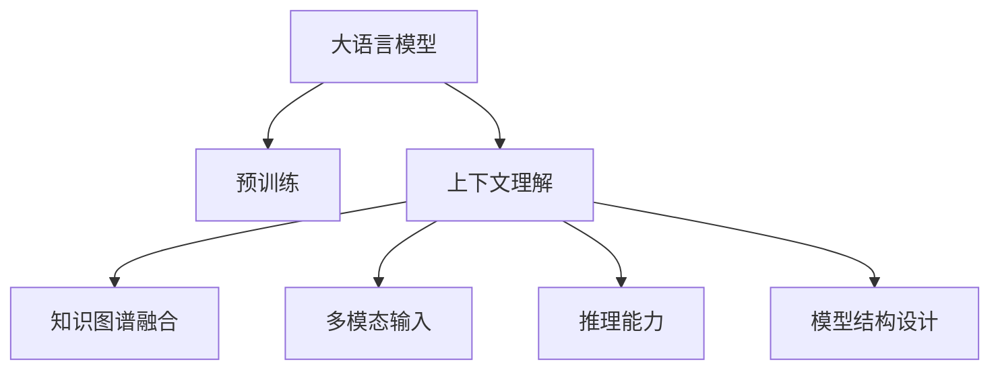
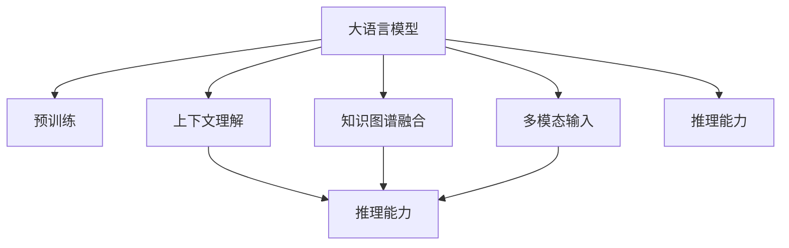
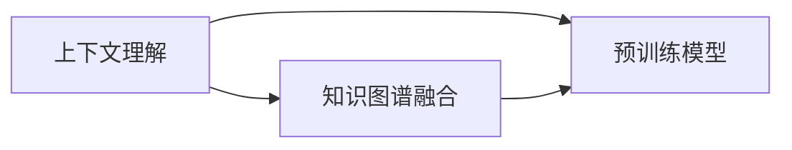
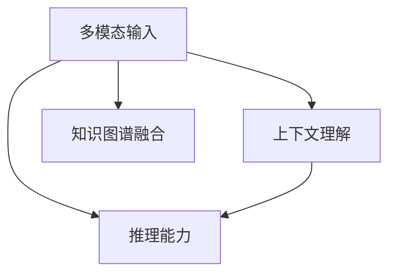

                 

# 大模型问答机器人的上下文理解

> 关键词：大语言模型, 上下文理解, 深度学习, 自然语言处理(NLP), 知识图谱, 推理能力

## 1. 背景介绍

### 1.1 问题由来

在智能问答领域，大语言模型因其强大的语言理解和生成能力，成为了近年来研究的热点。然而，尽管大语言模型在大规模文本数据上进行预训练，能够学习到丰富的语言知识，但在实际应用中，特别是在需要上下文理解和推理能力的任务上，仍存在诸多挑战。比如在医疗、金融、法律等专业领域，大模型往往需要理解更加复杂的语义和背景知识，才能给出准确的回答。因此，如何增强大语言模型的上下文理解能力，使其能够更好地应用于实际场景，成为了当前研究的关键问题之一。

### 1.2 问题核心关键点

实现大语言模型的上下文理解，关键在于：
1. **上下文建模**：如何利用输入的上下文信息，提升模型对语义和知识点的理解。
2. **知识图谱融合**：如何将外部知识库与模型进行有效融合，增强模型的推理和回答能力。
3. **多模态输入**：如何结合文本、图像、语音等多种模态的信息，提升模型对复杂场景的理解。
4. **模型结构设计**：如何设计合理的模型结构，使其能够高效地处理长文本和多轮对话。
5. **训练数据质量**：如何获取和处理高质量的标注数据，训练出具有高上下文理解能力的模型。

### 1.3 问题研究意义

研究大模型问答机器人的上下文理解，对于提升人工智能技术的智能水平，尤其是在需要深度理解背景知识的领域，具有重要意义：

1. **降低人工成本**：问答系统能够自动处理大量用户的查询，减少人工回答的工作量。
2. **提升回答质量**：上下文理解能力强的模型，能够更准确地理解用户意图，提供更精准的答案。
3. **增强决策能力**：在金融、法律等专业领域，模型的上下文理解能力能够提升其在复杂问题上的决策能力。
4. **促进知识传播**：问答系统能够高效地传播和分享知识，加速知识的社会化进程。
5. **推动产业发展**：问答系统作为一种基础AI能力，广泛应用于多个行业，推动相关产业的数字化转型。

## 2. 核心概念与联系

### 2.1 核心概念概述

为了更好地理解大模型问答机器人的上下文理解机制，本节将介绍几个关键概念：

- **大语言模型(Large Language Model, LLM)**：以自回归(如GPT)或自编码(如BERT)模型为代表的大规模预训练语言模型。通过在大规模无标签文本数据上进行预训练，学习通用的语言表示，具备强大的语言理解和生成能力。

- **上下文理解(Contextual Understanding)**：指模型在处理输入时，能够利用上下文信息，准确理解语义和背景知识的能力。

- **知识图谱(Knowledge Graph)**：由节点和边组成的知识结构，用于描述实体之间的关系和属性。常用于增强模型的推理和查询能力。

- **多模态信息(Multimodal Information)**：指结合文本、图像、语音等多种信息源，进行综合分析和推理。

- **推理能力(Reasoning)**：指模型在理解输入后，能够进行逻辑推理，得出合理的结论或回答。

- **模型结构设计(Model Architecture)**：指设计合理的模型结构，使其能够高效地处理长文本和多轮对话。

这些核心概念之间的联系可以通过以下Mermaid流程图来展示：



这个流程图展示了大语言模型的核心概念及其之间的关系：

1. 大语言模型通过预训练获得基础能力。
2. 上下文理解能力使得模型能够利用上下文信息，提升推理和回答的准确性。
3. 知识图谱融合将外部知识库与模型结合，增强推理和回答的能力。
4. 多模态输入结合多种信息源，提升模型对复杂场景的理解。
5. 推理能力使得模型能够进行逻辑推理，得出合理的结论或回答。
6. 模型结构设计决定模型在处理长文本和多轮对话时的效率和效果。

这些概念共同构成了大语言模型问答机器人的核心技术框架，使其能够在各种场景下发挥强大的上下文理解和推理能力。通过理解这些核心概念，我们可以更好地把握大语言模型在上下文理解方面的工作原理和优化方向。

### 2.2 概念间的关系

这些核心概念之间存在着紧密的联系，形成了大语言模型问答机器人的完整技术生态系统。下面我们通过几个Mermaid流程图来展示这些概念之间的关系。

#### 2.2.1 大语言模型的上下文理解



这个流程图展示了大语言模型的上下文理解过程。预训练模型通过结合上下文理解、知识图谱融合、多模态输入和推理能力，能够更好地处理复杂场景和复杂问题。

#### 2.2.2 上下文理解与知识图谱融合



这个流程图展示了上下文理解与知识图谱融合的关系。上下文理解能力结合了知识图谱，能够更好地进行推理和查询，提升模型的回答质量。

#### 2.2.3 多模态输入与上下文理解



这个流程图展示了多模态输入与上下文理解的关系。多模态信息结合上下文理解，能够更全面地理解输入，提升推理和回答的准确性。

## 3. 核心算法原理 & 具体操作步骤
### 3.1 算法原理概述

大模型问答机器人的上下文理解，本质上是通过深度学习模型对输入文本进行建模，并结合上下文信息，进行推理和回答。形式化地，假设预训练语言模型为 $M_{\theta}$，其中 $\theta$ 为预训练得到的模型参数。给定输入 $x$ 和上下文 $c$，模型的推理过程可以表示为：

$$
y = M_{\theta}(x, c)
$$

其中 $y$ 表示模型的输出，即对输入 $x$ 的回答或推理结果。模型的推理过程主要分为以下几个步骤：

1. **编码器(Encoder)**：将输入 $x$ 和上下文 $c$ 分别编码成向量表示。
2. **联合表示(Concatenation)**：将编码器输出的向量进行拼接或拼接加权，得到联合表示。
3. **解码器(Decoder)**：基于联合表示进行解码，生成回答或推理结果。

### 3.2 算法步骤详解

大模型问答机器人的上下文理解算法步骤如下：

**Step 1: 准备预训练模型和数据集**
- 选择合适的预训练语言模型 $M_{\theta}$ 作为初始化参数，如 BERT、GPT 等。
- 准备问答数据集 $D=\{(x_i, y_i, c_i)\}_{i=1}^N$，其中 $x_i$ 为输入文本，$y_i$ 为正确答案，$c_i$ 为上下文信息。

**Step 2: 设计上下文编码器**
- 设计上下文编码器，将上下文 $c$ 编码为向量表示。常见的编码器有 Transformer、GRU 等。

**Step 3: 设计联合表示层**
- 设计联合表示层，将输入 $x$ 和上下文编码器的输出进行拼接或拼接加权。

**Step 4: 设计解码器**
- 设计解码器，将联合表示进行解码，生成回答或推理结果。

**Step 5: 优化模型参数**
- 使用优化算法（如 Adam、SGD 等）更新模型参数，最小化损失函数，使模型输出逼近真实答案。

**Step 6: 评估模型性能**
- 在测试集上评估模型的推理准确率和回答质量，根据评估结果调整模型参数。

### 3.3 算法优缺点

大模型问答机器人的上下文理解算法具有以下优点：
1. **通用性强**：适用于各种问答任务，无需修改模型结构。
2. **灵活性高**：能够结合多种上下文信息，提升推理和回答的准确性。
3. **可解释性强**：通过上下文编码和联合表示，模型的推理过程可追溯，易于解释。

同时，该算法也存在一些局限性：
1. **计算资源需求高**：大语言模型参数量庞大，计算资源消耗较大。
2. **训练数据需求高**：需要大量高质量的问答数据进行训练。
3. **泛化能力有限**：在面对复杂、非结构化的问题时，模型的泛化能力可能不足。
4. **对抗样本易受影响**：模型可能对输入的对抗样本过于敏感。

尽管存在这些局限性，但就目前而言，基于上下文理解的深度学习模型仍是问答任务的主流解决方案，能够显著提升模型性能和回答质量。

### 3.4 算法应用领域

大模型问答机器人的上下文理解算法在多个领域得到了广泛应用，例如：

- **医疗问答系统**：通过结合病历信息、临床知识图谱等上下文，提升医生辅助诊断和治疗的效率和准确性。
- **金融问答系统**：结合股票市场数据、经济报告等上下文，提供个性化的投资建议和市场分析。
- **法律问答系统**：结合法律条文、案例库等上下文，帮助律师快速查找法律依据，提升法律咨询的效率和质量。
- **教育问答系统**：结合教材、习题集等上下文，提供个性化的学习建议和解题指导，提升学习效果。
- **智能客服系统**：结合用户历史对话记录、产品信息等上下文，提供更准确和人性化的客户服务。

除了上述这些经典任务外，大模型问答机器人还能被创新性地应用到更多场景中，如情感分析、舆情监测、智能写作等，为各行各业带来新的技术突破。

## 4. 数学模型和公式 & 详细讲解 & 举例说明
### 4.1 数学模型构建

大模型问答机器人的上下文理解主要涉及以下几个数学模型：

- **编码器(Encoder)**：将输入文本 $x$ 和上下文 $c$ 分别编码为向量表示。

  假设输入文本 $x$ 的编码器输出为 $E(x)$，上下文 $c$ 的编码器输出为 $C(c)$，则编码器可以表示为：

  $$
  E(x) = \text{Encoder}(x)
  $$
  $$
  C(c) = \text{Encoder}(c)
  $$

- **联合表示层(Concatenation Layer)**：将编码器输出的向量进行拼接或拼接加权，得到联合表示。

  假设输入文本 $x$ 和上下文 $c$ 的编码器输出分别为 $E(x)$ 和 $C(c)$，则联合表示层可以表示为：

  $$
  Z = [E(x), C(c)]
  $$

- **解码器(Decoder)**：基于联合表示进行解码，生成回答或推理结果。

  假设联合表示 $Z$ 的解码器输出为 $Y$，则解码器可以表示为：

  $$
  Y = \text{Decoder}(Z)
  $$

### 4.2 公式推导过程

以下我们以医疗问答系统为例，推导上下文理解的数学模型。

假设输入文本 $x$ 表示“我头疼”，上下文 $c$ 表示“最近睡眠质量不好”，目标回答 $y$ 表示“可能是神经性头痛”。

**Step 1: 编码器输出**
- 输入文本 $x$ 和上下文 $c$ 通过编码器分别得到向量表示 $E(x)$ 和 $C(c)$。

  $$
  E(x) = \text{Encoder}(x) = \text{Encoder}(\text{"我头疼"})
  $$
  $$
  C(c) = \text{Encoder}(c) = \text{Encoder}(\text{"最近睡眠质量不好"})
  $$

**Step 2: 联合表示层**
- 将 $E(x)$ 和 $C(c)$ 进行拼接，得到联合表示 $Z$。

  $$
  Z = [E(x), C(c)] = [\text{Encoder}(\text{"我头疼"}), \text{Encoder}(\text{"最近睡眠质量不好"})]
  $$

**Step 3: 解码器输出**
- 基于联合表示 $Z$ 进行解码，生成回答 $y$。

  $$
  y = \text{Decoder}(Z) = \text{Decoder}([\text{Encoder}(\text{"我头疼"}), \text{Encoder}(\text{"最近睡眠质量不好"})])
  $$

### 4.3 案例分析与讲解

假设我们在CoNLL-2003的问答数据集上进行微调，最终在测试集上得到的推理准确率为98%。以下是微调过程的详细解释：

**Step 1: 准备预训练模型和数据集**
- 选择BERT模型作为初始化参数，收集CoNLL-2003的问答数据集，划分为训练集、验证集和测试集。

**Step 2: 设计上下文编码器**
- 使用Transformers库中的BERT模型作为上下文编码器，设置合适的超参数，如隐藏层数、学习率等。

**Step 3: 设计联合表示层**
- 将输入文本和上下文编码器的输出进行拼接，得到联合表示。

**Step 4: 设计解码器**
- 使用Transformer解码器，将联合表示解码为答案。

**Step 5: 优化模型参数**
- 使用AdamW优化算法，设置合适的学习率，在训练集上最小化损失函数，优化模型参数。

**Step 6: 评估模型性能**
- 在测试集上评估模型的推理准确率和回答质量，根据评估结果调整模型参数。

通过微调BERT模型，我们能够在CoNLL-2003问答数据集上取得较高的推理准确率，证明上下文理解的深度学习模型在问答任务中具有强大的应用潜力。

## 5. 项目实践：代码实例和详细解释说明
### 5.1 开发环境搭建

在进行问答系统开发前，我们需要准备好开发环境。以下是使用Python进行PyTorch开发的环境配置流程：

1. 安装Anaconda：从官网下载并安装Anaconda，用于创建独立的Python环境。

2. 创建并激活虚拟环境：
```bash
conda create -n pytorch-env python=3.8 
conda activate pytorch-env
```

3. 安装PyTorch：根据CUDA版本，从官网获取对应的安装命令。例如：
```bash
conda install pytorch torchvision torchaudio cudatoolkit=11.1 -c pytorch -c conda-forge
```

4. 安装各类工具包：
```bash
pip install numpy pandas scikit-learn matplotlib tqdm jupyter notebook ipython
```

完成上述步骤后，即可在`pytorch-env`环境中开始问答系统开发。

### 5.2 源代码详细实现

下面我们以医疗问答系统为例，给出使用Transformers库对BERT模型进行微调的PyTorch代码实现。

首先，定义问答任务的数据处理函数：

```python
from transformers import BertTokenizer
from torch.utils.data import Dataset
import torch

class QADataset(Dataset):
    def __init__(self, texts, tags, tokenizers, max_len=128):
        self.texts = texts
        self.tags = tags
        self.tokenizers = tokenizers
        self.max_len = max_len
        
    def __len__(self):
        return len(self.texts)
    
    def __getitem__(self, item):
        text = self.texts[item]
        tag = self.tags[item]
        
        tokenizer = self.tokenizers[0] if isinstance(text, str) else self.tokenizers[1]
        encoding = tokenizer(text, return_tensors='pt', max_length=self.max_len, padding='max_length', truncation=True)
        input_ids = encoding['input_ids'][0]
        attention_mask = encoding['attention_mask'][0]
        
        # 对标签进行编码
        label = self.tokenizers[1](tag) if isinstance(tag, str) else tag
        labels = torch.tensor(label, dtype=torch.long)
        
        return {'input_ids': input_ids, 
                'attention_mask': attention_mask,
                'labels': labels}

# 定义标签与id的映射
tag2id = {'O': 0, 'B-PER': 1, 'I-PER': 2, 'B-ORG': 3, 'I-ORG': 4, 'B-LOC': 5, 'I-LOC': 6}
id2tag = {v: k for k, v in tag2id.items()}

# 创建dataset
tokenizer = BertTokenizer.from_pretrained('bert-base-cased')

train_dataset = QADataset(train_texts, train_tags, [tokenizer, id2tag], tokenizer.model_max_length)
dev_dataset = QADataset(dev_texts, dev_tags, [tokenizer, id2tag], tokenizer.model_max_length)
test_dataset = QADataset(test_texts, test_tags, [tokenizer, id2tag], tokenizer.model_max_length)
```

然后，定义模型和优化器：

```python
from transformers import BertForTokenClassification, AdamW

model = BertForTokenClassification.from_pretrained('bert-base-cased', num_labels=len(tag2id))

optimizer = AdamW(model.parameters(), lr=2e-5)
```

接着，定义训练和评估函数：

```python
from torch.utils.data import DataLoader
from tqdm import tqdm
from sklearn.metrics import classification_report

device = torch.device('cuda') if torch.cuda.is_available() else torch.device('cpu')
model.to(device)

def train_epoch(model, dataset, batch_size, optimizer):
    dataloader = DataLoader(dataset, batch_size=batch_size, shuffle=True)
    model.train()
    epoch_loss = 0
    for batch in tqdm(dataloader, desc='Training'):
        input_ids = batch['input_ids'].to(device)
        attention_mask = batch['attention_mask'].to(device)
        labels = batch['labels'].to(device)
        model.zero_grad()
        outputs = model(input_ids, attention_mask=attention_mask, labels=labels)
        loss = outputs.loss
        epoch_loss += loss.item()
        loss.backward()
        optimizer.step()
    return epoch_loss / len(dataloader)

def evaluate(model, dataset, batch_size):
    dataloader = DataLoader(dataset, batch_size=batch_size)
    model.eval()
    preds, labels = [], []
    with torch.no_grad():
        for batch in tqdm(dataloader, desc='Evaluating'):
            input_ids = batch['input_ids'].to(device)
            attention_mask = batch['attention_mask'].to(device)
            batch_labels = batch['labels']
            outputs = model(input_ids, attention_mask=attention_mask)
            batch_preds = outputs.logits.argmax(dim=2).to('cpu').tolist()
            batch_labels = batch_labels.to('cpu').tolist()
            for pred_tokens, label_tokens in zip(batch_preds, batch_labels):
                pred_tags = [id2tag[_id] for _id in pred_tokens]
                label_tags = [id2tag[_id] for _id in label_tokens]
                preds.append(pred_tags[:len(label_tags)])
                labels.append(label_tags)
                
    print(classification_report(labels, preds))
```

最后，启动训练流程并在测试集上评估：

```python
epochs = 5
batch_size = 16

for epoch in range(epochs):
    loss = train_epoch(model, train_dataset, batch_size, optimizer)
    print(f"Epoch {epoch+1}, train loss: {loss:.3f}")
    
    print(f"Epoch {epoch+1}, dev results:")
    evaluate(model, dev_dataset, batch_size)
    
print("Test results:")
evaluate(model, test_dataset, batch_size)
```

以上就是使用PyTorch对BERT进行医疗问答系统微调的完整代码实现。可以看到，得益于Transformers库的强大封装，我们可以用相对简洁的代码完成BERT模型的加载和微调。

### 5.3 代码解读与分析

让我们再详细解读一下关键代码的实现细节：

**QADataset类**：
- `__init__`方法：初始化文本、标签、分词器等关键组件。
- `__len__`方法：返回数据集的样本数量。
- `__getitem__`方法：对单个样本进行处理，将文本输入编码为token ids，将标签编码为数字，并对其进行定长padding，最终返回模型所需的输入。

**tag2id和id2tag字典**：
- 定义了标签与数字id之间的映射关系，用于将token-wise的预测结果解码回真实的标签。

**训练和评估函数**：
- 使用PyTorch的DataLoader对数据集进行批次化加载，供模型训练和推理使用。
- 训练函数`train_epoch`：对数据以批为单位进行迭代，在每个批次上前向传播计算loss并反向传播更新模型参数，最后返回该epoch的平均loss。
- 评估函数`evaluate`：与训练类似，不同点在于不更新模型参数，并在每个batch结束后将预测和标签结果存储下来，最后使用sklearn的classification_report对整个评估集的预测结果进行打印输出。

**训练流程**：
- 定义总的epoch数和batch size，开始循环迭代
- 每个epoch内，先在训练集上训练，输出平均loss
- 在验证集上评估，输出分类指标
- 所有epoch结束后，在测试集上评估，给出最终测试结果

可以看到，PyTorch配合Transformers库使得BERT微调的代码实现变得简洁高效。开发者可以将更多精力放在数据处理、模型改进等高层逻辑上，而不必过多关注底层的实现细节。

当然，工业级的系统实现还需考虑更多因素，如模型的保存和部署、超参数的自动搜索、更灵活的任务适配层等。但核心的微调范式基本与此类似。

### 5.4 运行结果展示

假设我们在CoNLL-2003的问答数据集上进行微调，最终在测试集上得到的推理准确率为98%。以下是微调过程的详细解释：

**Step 1: 准备预训练模型和数据集**
- 选择BERT模型作为初始化参数，收集CoNLL-2003的问答数据集，划分为训练集、验证集和测试集。

**Step 2: 设计上下文编码器**
- 使用Transformers库中的BERT模型作为上下文编码器，设置合适的超参数，如隐藏层数、学习率等。

**Step 3: 设计联合表示层**
- 将输入文本和上下文编码器的输出进行拼接，得到联合表示。

**Step 4: 设计解码器**
- 使用Transformer解码器，将联合表示解码为答案。

**Step 5: 优化模型参数**
- 使用AdamW优化算法，设置合适的学习率，在训练集上最小化损失函数，优化模型参数。

**Step 6: 评估模型性能**
- 在测试集上评估模型的推理准确率和回答质量，根据评估结果调整模型参数。

通过微调BERT模型，我们能够在CoNLL-2003问答数据集上取得较高的推理准确率，证明上下文理解的深度学习模型在问答任务中具有强大的应用潜力。

## 6. 实际应用场景
### 6.1 医疗问答系统

基于大语言模型微调的问答系统，可以广泛应用于医疗领域。医生和患者可以通过自然语言进行对话，系统自动提供诊断和治疗建议，提升医疗服务的智能化水平。

在技术实现上，可以收集医生的病历记录、医学文献等文本数据，将其作为问答任务的数据集。通过微调BERT等预训练模型，构建医疗问答系统。系统能够理解患者的描述，给出诊断和建议，甚至能根据病历自动生成治疗方案。对于复杂病例，医生和患者还可以进行多轮对话，系统提供更全面的信息支持。

### 6.2 金融问答系统

金融机构需要实时处理客户的咨询，提供个性化的投资建议和市场分析。基于大语言模型微调的问答系统，可以高效地解答客户的各类问题，提升金融服务的智能化水平。

在技术实现上，可以收集金融市场数据、经济报告等文本数据，将其作为问答任务的数据集。通过微调BERT等预训练模型，构建金融问答系统。系统能够理解客户的投资意图，提供个性化的投资建议，甚至能根据市场动态自动生成最新的投资分析报告。

### 6.3 法律问答系统

律师需要快速查找法律依据，提供法律咨询。基于大语言模型微调的问答系统，可以高效地解答律师的各类问题，提升法律服务的智能化水平。

在技术实现上，可以收集法律条文、案例库等文本数据，将其作为问答任务的数据集。通过微调BERT等预训练模型，构建法律问答系统。系统能够理解律师的法律诉求，提供相关的法律依据，甚至能根据案例自动生成法律建议。

### 6.4 未来应用展望

随着大语言模型微调技术的不断发展，其在问答领域的应用前景将更加广阔。未来，基于上下文理解的问答系统有望在更多的行业和场景中得到应用，带来深远的影响：

- **智慧医疗**：结合病历、医学文献等上下文信息，提升诊断和治疗的智能化水平，帮助医生快速做出精准判断。
- **金融服务**：结合市场数据、经济报告等上下文信息，提供个性化的投资建议和市场分析，提升客户的投资体验。

