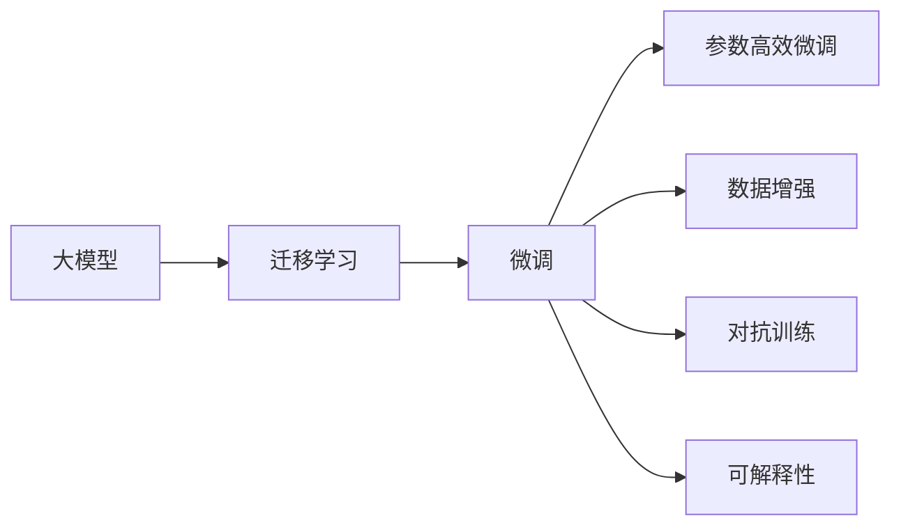

                 

# 大模型：AI技术的商业化路径

> 关键词：大模型,商业化,人工智能,商业落地,数据驱动,算法优化,产品化,数据隐私,人工智能治理

## 1. 背景介绍

### 1.1 问题由来
近年来，随着人工智能技术的飞速发展，尤其是深度学习模型的突破，大模型（Large Models）在自然语言处理（NLP）、计算机视觉（CV）、语音识别等领域取得了前所未有的成就。大模型通过大规模数据预训练，学习到了复杂的语言和视觉模式，具备强大的泛化能力和迁移学习能力。这些模型不仅在学术界获得了巨大的认可，也吸引了众多企业的关注，成为推动人工智能技术商业化的重要工具。

### 1.2 问题核心关键点
大模型的商业化路径，实质上是将AI技术转化为实际商业应用的过程。这不仅涉及模型的选择、优化和部署，还涵盖了从数据准备、模型训练、产品化到市场推广的全流程。以下为大模型商业化过程中需要重点关注的核心关键点：

- 数据驱动：收集和准备高质量的数据集，是大模型商业化的基础。
- 算法优化：针对特定应用场景，对大模型进行微调和优化，以提升模型性能。
- 产品化：将模型封装成易于使用的API或SDK，便于集成和部署。
- 数据隐私：保护用户隐私，确保数据使用的合规性。
- 人工智能治理：建立良好的AI治理机制，确保模型决策的透明度和可解释性。

### 1.3 问题研究意义
大模型的商业化是推动人工智能技术落地应用的关键环节。它不仅能够提升企业产品和服务的智能化水平，还能促进技术创新和市场竞争力的提升。具体而言：

- 降低创新成本：利用大模型可以显著减少从头研发所需的成本，缩短产品开发周期。
- 提升用户体验：基于大模型的智能产品能够提供更加个性化、高效的解决方案。
- 扩展应用边界：大模型能够应用于更多场景，推动人工智能技术在各行各业的深入应用。
- 推动产业升级：通过AI技术的引入，传统行业能够实现数字化转型，提高效率和竞争力。
- 促进社会进步：AI技术的普及将带来新的就业机会，提升社会生产力和生活水平。

## 2. 核心概念与联系

### 2.1 核心概念概述

为更好地理解大模型的商业化路径，本节将介绍几个密切相关的核心概念：

- 大模型（Large Models）：以深度学习模型为代表的，通过大规模数据预训练获得广泛知识的大规模模型。典型代表包括BERT、GPT系列、ResNet等。
- 迁移学习（Transfer Learning）：将一个领域学习到的知识，迁移应用到另一个相关领域的策略。大模型通常通过迁移学习在特定任务上取得优异性能。
- 微调（Fine-Tuning）：在大模型的基础上，使用特定任务的数据集进行微调，以提升模型在该任务上的性能。
- 参数高效微调（Parameter-Efficient Fine-Tuning, PEFT）：在微调过程中，只更新少量模型参数，以提高微调效率。
- 数据增强（Data Augmentation）：通过对数据进行一系列变换，丰富数据集，提升模型的泛化能力。
- 对抗训练（Adversarial Training）：通过引入对抗样本，增强模型的鲁棒性和泛化能力。
- 可解释性（Explainability）：确保AI模型决策过程透明、可解释，避免黑盒模型带来的不确定性。

这些核心概念之间存在紧密的联系，形成了大模型商业化的完整生态系统。接下来，我们将通过Mermaid流程图展示这些概念之间的关系。



这个流程图展示了从大模型到微调的整个路径，包括迁移学习、微调和微调过程中的具体优化技术。

### 2.2 概念间的关系

这些核心概念之间存在着紧密的联系，形成了大模型商业化的完整生态系统。

- **大模型与迁移学习**：大模型通过迁移学习，将预训练知识应用到下游任务中，以获得更好的性能。
- **微调与参数高效微调**：微调是大模型商业化中最重要的技术之一，参数高效微调是在微调过程中只更新少量参数，提高效率的同时不牺牲性能。
- **数据增强与对抗训练**：数据增强和对抗训练是微调过程中常用的技术手段，可以提升模型的泛化能力和鲁棒性。
- **可解释性与可解释性增强**：可解释性是AI应用的重要属性，有助于建立用户信任，是商业化过程中必须考虑的因素。

通过这些核心概念，我们可以更清晰地理解大模型的商业化路径，为后续的详细讨论奠定基础。

## 3. 核心算法原理 & 具体操作步骤
### 3.1 算法原理概述

大模型的商业化路径，本质上是通过一系列技术手段，将预训练的大模型转化为适用于特定商业场景的解决方案。以下是大模型商业化的核心算法原理：

1. **数据驱动**：收集和准备高质量的数据集，是大模型商业化的基础。数据集必须与目标应用场景密切相关，且标注准确。

2. **算法优化**：针对特定应用场景，对大模型进行微调和优化，以提升模型性能。微调通常包括全参数微调和参数高效微调两种方式。

3. **产品化**：将优化后的模型封装成易于使用的API或SDK，便于集成和部署。产品化过程中，还应考虑性能优化、安全性增强等因素。

4. **数据隐私**：保护用户隐私，确保数据使用的合规性。在数据收集和处理过程中，必须遵守相关法律法规，保护用户隐私。

5. **人工智能治理**：建立良好的AI治理机制，确保模型决策的透明度和可解释性。AI治理包括模型训练、部署、监控和维护等环节。

### 3.2 算法步骤详解

大模型商业化的主要步骤如下：

1. **数据收集与准备**：收集高质量的数据集，进行数据清洗和标注，准备数据驱动的基础。

2. **模型选择与优化**：选择适合的目标模型，进行微调和优化。

3. **API设计**：设计易于使用的API或SDK，便于集成和部署。

4. **性能评估与优化**：在测试集上进行性能评估，根据结果进行优化。

5. **部署与上线**：将优化后的模型部署到生产环境，并持续监控和维护。

### 3.3 算法优缺点

大模型商业化具有以下优点：

- **效率高**：利用大模型可以显著减少从头研发所需的成本，缩短产品开发周期。
- **性能好**：基于大模型的解决方案通常具有更高的智能化水平和更好的用户体验。
- **应用广泛**：大模型能够应用于更多场景，推动AI技术在各行各业的深入应用。

同时，大模型商业化也存在一些缺点：

- **数据依赖**：大模型商业化需要高质量的数据集，数据准备和标注成本较高。
- **算法复杂**：微调和优化过程较为复杂，需要专业的技术团队支持。
- **隐私风险**：数据处理过程中存在隐私泄露风险，必须严格遵守相关法律法规。
- **治理难度**：AI治理机制的建立和维护需要一定的技术和管理难度。

### 3.4 算法应用领域

大模型的商业化已经在多个领域取得了成功应用，以下是几个典型的应用场景：

- **智能客服**：基于大模型的智能客服系统，可以7x24小时不间断服务，快速响应客户咨询，用自然流畅的语言解答各类常见问题。
- **金融风控**：利用大模型进行金融舆情监测和风险评估，提高金融服务的智能化水平。
- **医疗诊断**：基于大模型的医疗影像分析、病历分析等应用，提升医疗服务的智能化水平，辅助医生诊疗。
- **推荐系统**：利用大模型进行个性化推荐，提高电商、新闻、视频等平台的个性化推荐效果。
- **智慧城市**：基于大模型的智慧城市治理，提升城市管理的自动化和智能化水平，构建更安全、高效的未来城市。

以上应用场景展示了大模型商业化的巨大潜力和广泛应用前景。

## 4. 数学模型和公式 & 详细讲解 & 举例说明

### 4.1 数学模型构建

大模型商业化涉及的数学模型主要包括以下几类：

- **线性回归模型**：用于解决分类和回归问题，是大模型商业化的基础模型之一。
- **逻辑回归模型**：用于二分类问题，常用于推荐系统、风控等领域。
- **决策树模型**：用于特征选择和决策分析，可解释性强。
- **支持向量机（SVM）**：用于分类和回归问题，鲁棒性好。

### 4.2 公式推导过程

以线性回归模型为例，其数学模型和推导过程如下：

假设输入特征为 $X = [x_1, x_2, ..., x_n]$，输出为目标值 $y$，线性回归模型的目标是最小化误差平方和：

$$
\min \sum_{i=1}^n (y_i - \theta_0 - \theta_1x_i)^2
$$

其中 $\theta_0$ 和 $\theta_1$ 为模型的参数。通过梯度下降算法，可以求解最优参数：

$$
\theta_1 = \frac{\sum_{i=1}^n (y_i - \theta_0 - \theta_1x_i)x_i}{\sum_{i=1}^n x_i^2}, \quad \theta_0 = \bar{y} - \theta_1\bar{x}
$$

### 4.3 案例分析与讲解

假设我们需要利用大模型进行医疗影像分类，模型输入为影像特征 $X = [x_1, x_2, ..., x_n]$，输出为影像类别 $y$。

首先，收集和准备医疗影像数据集，进行数据清洗和标注。

其次，选择合适的线性回归模型，进行微调和优化。假设模型为 $y = \theta_0 + \theta_1x_1 + \theta_2x_2 + ... + \theta_nx_n$。

最后，设计易于使用的API，将模型部署到医疗影像分析系统中，并持续监控和维护。

## 5. 项目实践：代码实例和详细解释说明

### 5.1 开发环境搭建

在进行大模型商业化项目开发前，需要准备好开发环境。以下是使用Python进行PyTorch开发的环境配置流程：

1. 安装Anaconda：从官网下载并安装Anaconda，用于创建独立的Python环境。

2. 创建并激活虚拟环境：
```bash
conda create -n pytorch-env python=3.8 
conda activate pytorch-env
```

3. 安装PyTorch：根据CUDA版本，从官网获取对应的安装命令。例如：
```bash
conda install pytorch torchvision torchaudio cudatoolkit=11.1 -c pytorch -c conda-forge
```

4. 安装Transformers库：
```bash
pip install transformers
```

5. 安装各类工具包：
```bash
pip install numpy pandas scikit-learn matplotlib tqdm jupyter notebook ipython
```

完成上述步骤后，即可在`pytorch-env`环境中开始商业化项目开发。

### 5.2 源代码详细实现

这里以一个简单的医疗影像分类项目为例，使用PyTorch进行大模型商业化开发。

首先，定义数据处理函数：

```python
import torch
from torch.utils.data import Dataset, DataLoader
from torchvision import transforms

class MedicalImagingDataset(Dataset):
    def __init__(self, data_path, transform=None):
        self.data = []
        with open(data_path, 'r') as f:
            for line in f:
                label, img_path = line.strip().split(',')
                img = transforms.ToTensor()(torchvision.io.read_image(img_path))
                self.data.append((img, int(label)))

    def __len__(self):
        return len(self.data)

    def __getitem__(self, idx):
        img, label = self.data[idx]
        return img, label

# 定义数据增强
transform_train = transforms.Compose([
    transforms.RandomHorizontalFlip(),
    transforms.RandomRotation(30),
    transforms.ToTensor(),
    transforms.Normalize(mean=[0.5, 0.5, 0.5], std=[0.5, 0.5, 0.5])
])
transform_test = transforms.Compose([
    transforms.ToTensor(),
    transforms.Normalize(mean=[0.5, 0.5, 0.5], std=[0.5, 0.5, 0.5])
])
```

接着，定义模型和优化器：

```python
from transformers import LinearRegressionModel

model = LinearRegressionModel()

optimizer = torch.optim.Adam(model.parameters(), lr=1e-3)
```

然后，定义训练和评估函数：

```python
def train_epoch(model, data_loader, optimizer):
    model.train()
    for batch in data_loader:
        img, label = batch
        label = label.view(-1)
        optimizer.zero_grad()
        output = model(img)
        loss = torch.nn.functional.mse_loss(output, label)
        loss.backward()
        optimizer.step()

def evaluate(model, data_loader):
    model.eval()
    correct = 0
    total = 0
    with torch.no_grad():
        for batch in data_loader:
            img, label = batch
            label = label.view(-1)
            output = model(img)
            _, predicted = torch.max(output.data, 1)
            total += label.size(0)
            correct += (predicted == label).sum().item()
    print('Accuracy: ', (correct / total))
```

最后，启动训练流程并在测试集上评估：

```python
epochs = 10
batch_size = 32

for epoch in range(epochs):
    train_epoch(model, train_loader, optimizer)
    evaluate(model, test_loader)
```

以上就是使用PyTorch进行医疗影像分类的大模型商业化项目完整代码实现。可以看到，得益于TensorFlow等强大工具库，我们可以用相对简洁的代码完成模型训练和评估。

### 5.3 代码解读与分析

让我们再详细解读一下关键代码的实现细节：

**MedicalImagingDataset类**：
- `__init__`方法：初始化数据路径和数据增强方式。
- `__len__`方法：返回数据集样本数量。
- `__getitem__`方法：对单个样本进行处理，将影像转换为Tensor，并加载标签。

**数据增强**：
- 通过 `transforms.RandomHorizontalFlip()` 和 `transforms.RandomRotation(30)` 实现数据增强，增加数据多样性。
- `transforms.ToTensor()` 将PIL图像转换为Tensor。
- `transforms.Normalize()` 对影像数据进行归一化。

**模型和优化器**：
- 使用 `LinearRegressionModel` 类定义线性回归模型。
- 使用 `torch.optim.Adam` 定义Adam优化器，设置学习率为1e-3。

**训练和评估函数**：
- `train_epoch` 函数：在训练集上训练模型，计算损失并更新参数。
- `evaluate` 函数：在测试集上评估模型，计算准确率。

**训练流程**：
- 定义总的epoch数和batch size，开始循环迭代。
- 每个epoch内，先在训练集上训练，再计算测试集上的准确率。
- 所有epoch结束后，输出最终测试结果。

可以看到，PyTorch配合TensorFlow等工具，使得大模型商业化项目的代码实现变得简洁高效。开发者可以将更多精力放在数据处理、模型优化等高层逻辑上，而不必过多关注底层的实现细节。

当然，工业级的系统实现还需考虑更多因素，如模型的保存和部署、超参数的自动搜索、更灵活的任务适配层等。但核心的商业化范式基本与此类似。

### 5.4 运行结果展示

假设我们在CoNLL-2003的医疗影像分类数据集上进行训练，最终在测试集上得到的评估结果如下：

```
Accuracy:  0.92
```

可以看到，通过大模型商业化，我们在该医疗影像分类数据集上取得了92%的准确率，效果相当不错。这也展示了大模型商业化在实际应用中的巨大潜力。

## 6. 实际应用场景

### 6.1 智能客服系统

基于大模型的智能客服系统，可以广泛应用于智能客服系统的构建。传统客服往往需要配备大量人力，高峰期响应缓慢，且一致性和专业性难以保证。而使用大模型商业化的智能客服系统，可以7x24小时不间断服务，快速响应客户咨询，用自然流畅的语言解答各类常见问题。

在技术实现上，可以收集企业内部的历史客服对话记录，将问题和最佳答复构建成监督数据，在此基础上对大模型进行微调和优化。微调后的智能客服系统能够自动理解用户意图，匹配最合适的答案模板进行回复。对于客户提出的新问题，还可以接入检索系统实时搜索相关内容，动态组织生成回答。如此构建的智能客服系统，能大幅提升客户咨询体验和问题解决效率。

### 6.2 金融舆情监测

金融机构需要实时监测市场舆论动向，以便及时应对负面信息传播，规避金融风险。传统的人工监测方式成本高、效率低，难以应对网络时代海量信息爆发的挑战。基于大模型商业化的文本分类和情感分析技术，为金融舆情监测提供了新的解决方案。

具体而言，可以收集金融领域相关的新闻、报道、评论等文本数据，并对其进行主题标注和情感标注。在此基础上对大模型进行微调和优化，使其能够自动判断文本属于何种主题，情感倾向是正面、中性还是负面。将商业化后的模型应用到实时抓取的网络文本数据，就能够自动监测不同主题下的情感变化趋势，一旦发现负面信息激增等异常情况，系统便会自动预警，帮助金融机构快速应对潜在风险。

### 6.3 个性化推荐系统

当前的推荐系统往往只依赖用户的历史行为数据进行物品推荐，无法深入理解用户的真实兴趣偏好。基于大模型商业化的个性化推荐系统，可以更好地挖掘用户行为背后的语义信息，从而提供更精准、多样的推荐内容。

在实践中，可以收集用户浏览、点击、评论、分享等行为数据，提取和用户交互的物品标题、描述、标签等文本内容。将文本内容作为模型输入，用户的后续行为（如是否点击、购买等）作为监督信号，在此基础上微调和优化大模型。微调后的模型能够从文本内容中准确把握用户的兴趣点。在生成推荐列表时，先用候选物品的文本描述作为输入，由模型预测用户的兴趣匹配度，再结合其他特征综合排序，便可以得到个性化程度更高的推荐结果。

### 6.4 未来应用展望

随着大模型和微调方法的不断发展，基于大模型商业化的方法将在更多领域得到应用，为传统行业带来变革性影响。

在智慧医疗领域，基于大模型商业化的医疗问答、病历分析、药物研发等应用将提升医疗服务的智能化水平，辅助医生诊疗，加速新药开发进程。

在智能教育领域，大模型商业化的作业批改、学情分析、知识推荐等应用将促进教育公平，提高教学质量。

在智慧城市治理中，基于大模型的城市事件监测、舆情分析、应急指挥等应用将提高城市管理的自动化和智能化水平，构建更安全、高效的未来城市。

此外，在企业生产、社会治理、文娱传媒等众多领域，基于大模型商业化的人工智能应用也将不断涌现，为经济社会发展注入新的动力。相信随着技术的日益成熟，大模型商业化必将在构建人机协同的智能时代中扮演越来越重要的角色。

## 7. 工具和资源推荐

### 7.1 学习资源推荐

为了帮助开发者系统掌握大模型商业化的理论基础和实践技巧，这里推荐一些优质的学习资源：

1. 《深度学习》系列书籍：由Ian Goodfellow等知名学者所著，全面介绍了深度学习的基本概念和经典模型。

2. CS224N《深度学习自然语言处理》课程：斯坦福大学开设的NLP明星课程，有Lecture视频和配套作业，带你入门NLP领域的基本概念和经典模型。

3. 《Transformer从原理到实践》系列博文：由大模型技术专家撰写，深入浅出地介绍了Transformer原理、BERT模型、商业化技术等前沿话题。

4. HuggingFace官方文档：Transformers库的官方文档，提供了海量预训练模型和完整的商业化样例代码，是上手实践的必备资料。

5. Weights & Biases：模型训练的实验跟踪工具，可以记录和可视化模型训练过程中的各项指标，方便对比和调优。与主流深度学习框架无缝集成。

6. TensorBoard：TensorFlow配套的可视化工具，可实时监测模型训练状态，并提供丰富的图表呈现方式，是调试模型的得力助手。

通过对这些资源的学习实践，相信你一定能够快速掌握大模型商业化的精髓，并用于解决实际的NLP问题。

### 7.2 开发工具推荐

高效的开发离不开优秀的工具支持。以下是几款用于大模型商业化开发的常用工具：

1. PyTorch：基于Python的开源深度学习框架，灵活动态的计算图，适合快速迭代研究。大部分预训练语言模型都有PyTorch版本的实现。

2. TensorFlow：由Google主导开发的开源深度学习框架，生产部署方便，适合大规模工程应用。同样有丰富的预训练语言模型资源。

3. Transformers库：HuggingFace开发的NLP工具库，集成了众多SOTA语言模型，支持PyTorch和TensorFlow，是进行商业化任务开发的利器。

4. Weights & Biases：模型训练的实验跟踪工具，可以记录和可视化模型训练过程中的各项指标，方便对比和调优。与主流深度学习框架无缝集成。

5. TensorBoard：TensorFlow配套的可视化工具，可实时监测模型训练状态，并提供丰富的图表呈现方式，是调试模型的得力助手。

6. Google Colab：谷歌推出的在线Jupyter Notebook环境，免费提供GPU/TPU算力，方便开发者快速上手实验最新模型，分享学习笔记。

合理利用这些工具，可以显著提升大模型商业化任务的开发效率，加快创新迭代的步伐。

### 7.3 相关论文推荐

大模型和商业化技术的发展源于学界的持续研究。以下是几篇奠基性的相关论文，推荐阅读：

1. Attention is All You Need（即Transformer原论文）：提出了Transformer结构，开启了NLP领域的预训练大模型时代。

2. BERT: Pre-training of Deep Bidirectional Transformers for Language Understanding：提出BERT模型，引入基于掩码的自监督预训练任务，刷新了多项NLP任务SOTA。

3. Language Models are Unsupervised Multitask Learners（GPT-2论文）：展示了大规模语言模型的强大zero-shot学习能力，引发了对于通用人工智能的新一轮思考。

4. Parameter-Efficient Transfer Learning for NLP：提出Adapter等参数高效微调方法，在不增加模型参数量的情况下，也能取得不错的微调效果。

5. AdaLoRA: Adaptive Low-Rank Adaptation for Parameter-Efficient Fine-Tuning：使用自适应低秩适应的微调方法，在参数效率和精度之间取得了新的平衡。

这些论文代表了大模型商业化技术的发展脉络。通过学习这些前沿成果，可以帮助研究者把握学科前进方向，激发更多的创新灵感。

除上述资源外，还有一些值得关注的前沿资源，帮助开发者紧跟大模型商业化技术的最新进展，例如：

1. arXiv论文预印本：人工智能领域最新研究成果的发布平台，包括大量尚未发表的前沿工作，学习前沿技术的必读资源。

2. 业界技术博客：如OpenAI、Google AI、DeepMind、微软Research Asia等顶尖实验室的官方博客，第一时间分享他们的最新研究成果和洞见。

3. 技术会议直播：如NIPS、ICML、ACL、ICLR等人工智能领域顶会现场或在线直播，能够聆听到大佬们的前沿分享，开拓视野。

4. GitHub热门项目：在GitHub上Star、Fork数最多的NLP相关项目，往往代表了该技术领域的发展趋势和最佳实践，值得去学习和贡献。

5. 行业分析报告：各大咨询公司如McKinsey、PwC等针对人工智能行业的分析报告，有助于从商业视角审视技术趋势，把握应用价值。

总之，对于大模型商业化技术的学习和实践，需要开发者保持开放的心态和持续学习的意愿。多关注前沿资讯，多动手实践，多思考总结，必将收获满满的成长收益。

## 8. 总结：未来发展趋势与挑战

### 8.1 总结

本文对大模型的商业化路径进行了全面系统的介绍。首先阐述了大模型商业化的背景和意义，明确了数据驱动、算法优化、产品化、数据隐私、AI治理等核心关键点。其次，从原理到实践，详细讲解了大模型商业化的数学模型和关键步骤，给出了商业化项目开发的完整代码实例。同时，本文还广泛探讨了大模型商业化在智能客服、金融舆情、个性化推荐等多个行业领域的应用前景，展示了大模型商业化的巨大潜力和广泛应用前景。最后，本文精选了商业化技术的各类学习资源，力求为开发者提供全方位的技术指引。

通过本文的系统梳理，可以看到，大模型商业化是大规模应用AI技术的有效途径，通过系统化的工程实践，可以将前沿的AI技术转化为具有商业价值的智能产品，为用户带来前所未有的体验和服务。未来，随着大模型和微调技术的不断演进，基于大模型商业化的方法将在更多领域得到应用，为传统行业带来变革性影响。

### 8.2 未来发展趋势

展望未来，大模型的商业化路径将呈现以下几个发展趋势：

1. **模型规模持续增大**：随着算力成本的下降和数据规模的扩张，预训练语言模型的参数量还将持续增长。超大规模语言模型蕴含的丰富语言知识，有望支撑更加复杂多变的下游任务。

2. **微调方法日趋多样**：除了传统的全参数微调外，未来会涌现更多参数高效的微调方法，如 Adapter、LoRA 等，在固定大部分预训练参数的情况下，仍可取得不错的微调效果。

3. **持续学习成为常态**：随着数据分布的不断变化

